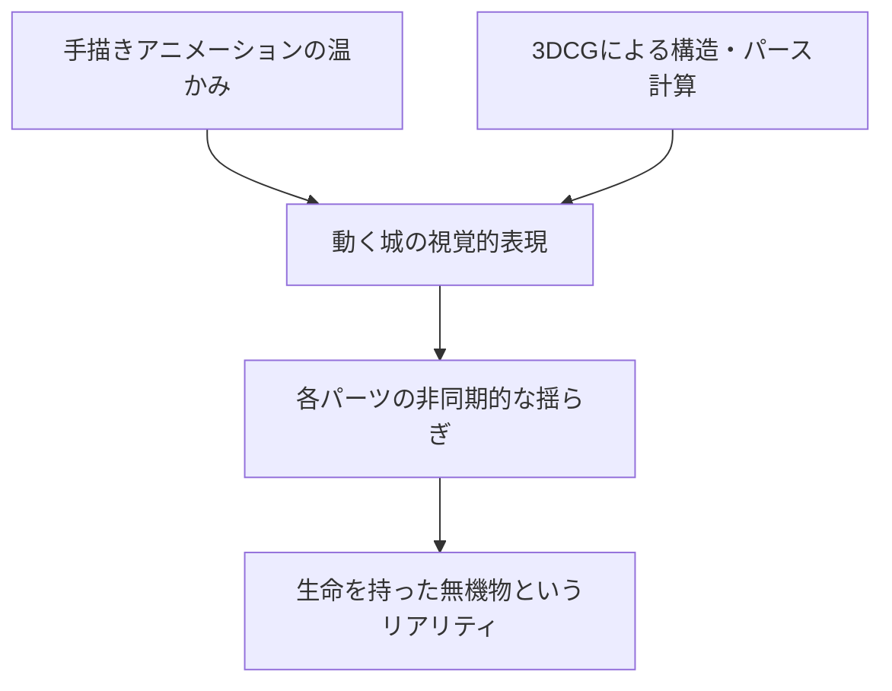
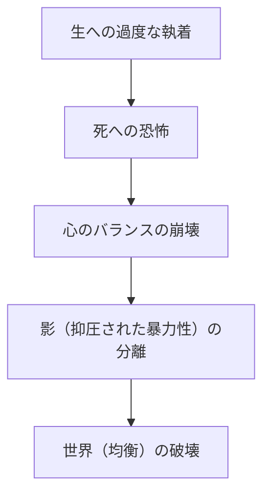

# 第6章：反戦と愛、魔法のメカニズム（ハウルの動く城、ゲド戦記）

## はじめに：ジブリ新時代の幕開けと揺らぐ世界

2000年代中盤、スタジオジブリは大きな転換点を迎えていた。『千と千尋の神隠し』という日本映画史に残る金字塔を打ち立て、アカデミー賞を受賞し、世界的評価を不動のものとした宮崎駿監督。しかし、その足元では現実世界が大きく揺れ動いていた。2001年の同時多発テロから連なる対テロ戦争、そして2003年に勃発したイラク戦争。世界が分断と暴力の連鎖に飲み込まれていく中で、宮崎駿の視線はより直接的に「戦争と人間の愚かさ」に向けられるようになる。

同時に、スタジオジブリ内部でも世代交代という巨大な課題が顕在化しつつあった。本章では、宮崎駿がイラク戦争への激しい怒りと「老い」の受容を圧倒的なアニメーション技術で描き出した『ハウルの動く城』（2004年）、そして宮崎駿の長男である宮崎吾朗が異例の抜擢で監督デビューを果たし、原作者との対立や哲学的なテーマの表現に挑んだ『ゲド戦記』（2006年）という、ジブリの歴史において極めて特異な位置を占める2作品について、その技術的、歴史的、そしてテーマ的側面から極限まで深く考察していく。

---

## 『ハウルの動く城』：スチームパンクの極致と反戦の叫び

ダイアナ・ウィン・ジョーンズの児童文学『魔法使いハウルと火の悪魔』を原作としながらも、宮崎駿はそこに自身の強烈な作家性を注ぎ込み、原作とは大きく異なる独自の物語を構築した。それは、魔法と機械が混在する世界を舞台にした、壮大なラブストーリーであると同時に、痛烈な反戦映画でもある。

### 1. 動く城のメカニズムとアニメーション技術の臨界点

本作の真の主役とも言えるのが、タイトルにもなっている「動く城」である。この城のアニメーション表現は、スタジオジブリ、ひいては手描きアニメーションと3DCGの融合における一つの臨界点を示している。

城のデザインは、大砲、家屋、煙突、歯車、巨大な鳥の足のような歩行脚など、無数のジャンクパーツが継ぎ接ぎされた異形のキメラ建築である。これは宮崎駿が得意とするスチームパンク的なメカニックデザインの極致であり、金属の軋む音、蒸気を吹き出すバルブ、そして不格好でありながらどこかユーモラスに歩行する様は、巨大な生き物としての生命感に溢れている。

技術的な特筆すべき点は、この複雑極まりない巨大構造物をいかにしてアニメーションさせるかという課題へのアプローチである。ジブリは『もののけ姫』のタタリ神や『千と千尋の神隠し』などで培ってきた3DCG技術を駆使し、城のベースとなる動きをCGで構築した。しかし、単なる3Dモデルのレンダリングではなく、その上から手描きのテクスチャやディテールを緻密に重ね合わせることで、ジブリ特有の「温かみのある手描きの質感」と「CGならではの立体的でダイナミックなパースの変化」を完全に融合させたのである。

城を構成する各パーツ（家屋の部分、歯車、足など）は、歩行の衝撃に合わせてそれぞれ異なるタイミングで揺れ、きしみ、歪む。この「非同期的な揺れ」を計算し、アニメーションとして成立させる作業は狂気の沙汰と言えるほどの手間を要した。城が崩壊し、再び再構築される終盤のシークエンスでは、重力と魔法の力が拮抗する様子が、パーツ一つ一つの動きのベクトルによって見事に表現されている。

### 2. イラク戦争の影：宮崎駿が描いた強烈な反戦メッセージ

『ハウルの動く城』の制作中、現実世界ではアメリカによるイラクへの軍事侵攻が開始されていた。宮崎駿はこの戦争に対し、かつてないほどの激しい怒りと失望を抱いていた。その感情は、本作の随所に強烈な暗い影を落としている。

本作に登場する戦争は、明確な敵対国同士の正義のぶつかり合いとして描かれない。どちらが正義でどちらが悪なのか、観客には一切説明されず、ただただ空を覆い尽くす奇怪な軍用機が無差別に街を爆撃し、火の海に変えていく様子が圧倒的な絶望感とともに描画される。この「理由なき破壊」の恐怖こそが、現代の戦争の本質を突いている。

主人公のハウルは、魔法使いとして軍の招集から逃げ回りながらも、夜な夜な巨大な鳥の怪物を思わせる姿に変身し、単身で戦場に赴き両国の軍艦や爆撃機を破壊している。しかし、力を使えば使うほど、彼は人間性を失い、完全な化物へと近づいていく。これは「平和のための暴力」という矛盾が、最終的に個人の魂をどのように蝕み、破壊していくかというメタファーである。ハウルが燃え盛る街を見下ろし、「味方だろうが敵だろうが、人殺しどもめ」と吐き捨てるシーンには、イラク戦争に対する宮崎駿自身の悲痛な叫びがそのまま重なっている。

従来の宮崎作品（例えば『風の谷のナウシカ』や『もののけ姫』）では、争いの中でいかに生きるかというテーマが提示されていたが、『ハウル』においては「戦争自体が絶対的な愚行であり、そこに参加すること自体が魂の死を意味する」という徹底した拒絶の姿勢が貫かれている。

### 3. 「老い」と「若さ」の視覚的流転：ソフィーの呪いが意味するもの

本作のもう一つの画期的な表現は、主人公ソフィーの「年齢の流転」である。荒地の魔女に呪いをかけられ、18歳の少女から90歳の老婆へと姿を変えられてしまったソフィー。しかし、物語の進行とともに、彼女の容姿は老婆から少女へ、少女から中年の女性へと、感情の起伏や精神状態に同調してシームレスに変化し続ける。

アニメーションにおいて、キャラクターの設定（デザイン）を固定しないということは極めて異例の挑戦である。作画監督の山下明彦らは、老婆のソフィーを描く際、単にシワを増やすのではなく、骨格、筋肉の衰え、そして何より「重力に対する姿勢の変化」を緻密に観察し、描写した。老婆の時のソフィーは腰が曲がり、歩行には重さが伴う。しかし、彼女がハウルを庇おうとする時や、自信を取り戻して力強く発言する時、その背筋は伸び、シワが消え、声のトーンまでが若返る（倍賞千恵子の声優としての驚異的な演技力もここに大きく貢献している）。

宮崎駿は、この視覚的トリックを用いて「老いとは物理的な現象であると同時に、心理的な状態でもある」というテーマを描き出した。ソフィーは呪いをかけられる前から、自己評価が低く、心を閉ざし、内面的には既に「老いて」いた。呪いは彼女の内面を外見に反映させたに過ぎない。しかし、老婆という社会的な属性から解放されたことで、皮肉にも彼女は少女時代よりも大胆に、エネルギッシュに行動できるようになる。

この「年齢の流転」表現は、アニメーションが持つ「形を自由に変えられる」という特性を最大限に活かした心理描写の極致であり、愛を通して自己肯定感を回復していく人間の魂の軌跡を、これ以上ないほど美しく視覚化している。

---

## 『ゲド戦記』：宮崎吾朗のデビューと影の哲学

『ハウルの動く城』から2年後の2006年、スタジオジブリはアーシュラ・K・ル＝グウィンの世界的ファンタジー文学『ゲド戦記』をアニメーション映画化した。しかし、監督の座に座ったのは宮崎駿ではなく、それまで映像制作の経験が一切なかった長男・宮崎吾朗であった。

### 1. 異例の抜擢と制作の背景

『ゲド戦記』の映画化は、宮崎駿にとって長年の悲願であった。しかし、原作者のル＝グウィンからようやく映画化の許諾が下りた際、宮崎駿は『ハウルの動く城』の制作中であり監督を引き受けることができなかった。そこでプロデューサーの鈴木敏夫が白羽の矢を立てたのが、当時三鷹の森ジブリ美術館の館長を務め、建築家としてのキャリアを持っていた宮崎吾朗である。

鈴木敏夫は、吾朗が描いたアレンと竜の対峙する絵コンテに「宮崎駿にはない現代的な暗さ、若者のリアリティ」を見出した。しかし、この決定に対して宮崎駿は猛反発し、親子関係は断絶状態に陥った。「アニメーションを全くわかっていない人間に監督はできない」という駿の懸念はもっともであり、吾朗は巨大なプレッシャーと父という絶対的な壁に直面しながら、ジブリのベテランスタッフを束ねて制作を指揮するという過酷な状況に置かれた。

### 2. 原作者アーシュラ・K・ル＝グウィンとの軋轢とその本質

完成した映画『ゲド戦記』は、興行的には成功を収めたものの、批評家やファンからは賛否両論の嵐を巻き起こした。最も深刻だったのは、原作者ル＝グウィンとの決定的な軋轢である。

ル＝グウィンは自身のサイトで映画に対するコメントを発表し、「It is not my book. It is your movie.（これは私の本ではない。あなたの映画だ）」と冷徹に評した。彼女が問題視したのは、原作が持つ繊細で内省的なテーマが、短絡的なアクションや善悪の二元論にすり替えられてしまった点である。

原作の『ゲド戦記』第1巻において、主人公ゲド（ハイタカ）が対峙する「影」は、彼自身の傲慢さや弱さが具現化したものであり、最終的にゲドはその影を打ち倒すのではなく、抱きしめ、統合することで真の自己を確立する。これはユング心理学的なアプローチに基づく深い哲学である。

しかし映画版（主に原作の第3巻をベースにしている）では、主人公アレンの内なる影が彼から分離し、別個の存在として描かれる。そして最終的なクライマックスは、不老不死を求める悪の魔法使いクモとの物理的な戦闘に集約されてしまった。ル＝グウィンの目には、この改変が原作の核である「内なる精神の成長と受容」というテーマを著しく損なうものとして映ったのである。

### 3. 影と光の哲学：アレンの葛藤と現代社会の病理

ル＝グウィンからの批判や構成上の粗さはあるものの、宮崎吾朗の『ゲド戦記』には、2000年代の日本の若者が抱えていた特有の病理が鋭く反映されている点において、独自の価値を見出すことができる。

主人公アレンは、理由もなく父親（国王）を刺し殺し、国を逃亡する。彼は常に「正体不明の不安」に苛まれ、生に対する執着と死への恐怖の間で引き裂かれている。このアレンの姿は、バブル崩壊後の閉塞した日本社会において、明確な理由なく凶悪犯罪に走る若者たちや、生きる意味を見失い「死にたい」と口にする若者たちの心理状態をトレースしている。

映画のメインテーマである「命を大切にしないやつなんて大嫌いだ」というテルーのセリフは、あまりにも直接的で説教臭いと批判されることも多い。しかし、宮崎吾朗が建築家として環境問題に向き合ってきた経験や、巨匠・宮崎駿の息子として生まれた呪縛と葛藤を考慮すれば、アレンの「自分の命すらどうしていいかわからない」という焦燥感は、吾朗自身の痛切な叫びでもあった。

また、不老不死を希求し、世界の均衡（バランス）を破壊しようとする魔法使いクモは、現代のテクノロジーや医療技術によって「死」という自然の摂理を否定しようとする現代人類そのもののカリカチュアである。死を拒絶することは、すなわち生を拒絶することであるというパラドックス。アレンとクモの対立は、表層的には善悪の戦いに見えるが、その根底には「限りある命をいかに受容するか」という実存的な問いが横たわっている。

アニメーション技術の面では、宮崎駿作品のような圧倒的な飛翔感や、細部まで血の通ったモブキャラクターの躍動感には欠けるものの、静謐な背景美術（特に竜が共食いをする嵐の海の描写や、荒廃したホート・タウンの陰鬱な色彩）は、世界が緩やかに死に向かっているという終末的な空気感を巧みに表現している。

---

## 結語：魔法の代償と次世代への継承

『ハウルの動く城』と『ゲド戦記』。この2つの作品は、スタジオジブリが成熟期を迎え、同時に未来への不安と向き合わねばならなかった過渡期の象徴である。

宮崎駿は『ハウルの動く城』において、アニメーションという魔法を極限まで駆使しながら、その魔法（力）を使うことの恐ろしさと、戦争という現実の暴力に対する深い絶望を描いた。そして、そこからの救済を「老いを受け入れること」と「無償の愛」に託した。

一方、宮崎吾朗は『ゲド戦記』において、父の作り上げた巨大な魔法の城に挑み、傷つきながらも自身の声で「生と死の受容」を語ろうとした。それは不格好であったかもしれないが、次世代が先人の遺産とどう向き合い、どうやって自身の影を統合していくかという、スタジオジブリ自体のメタファーとしての痛切なドキュメンタリーでもあった。

魔法（アニメーション）は万能ではない。しかし、その限界と代償を知った上で、なお暗闇の中に光を描き出そうとする営みこそが、この時代のジブリ作品に宿る凄みなのである。

（第6章 終わり）

