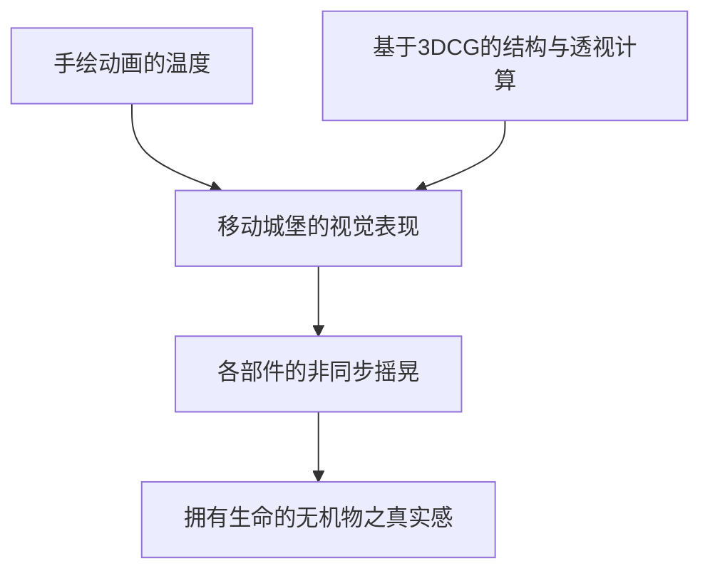
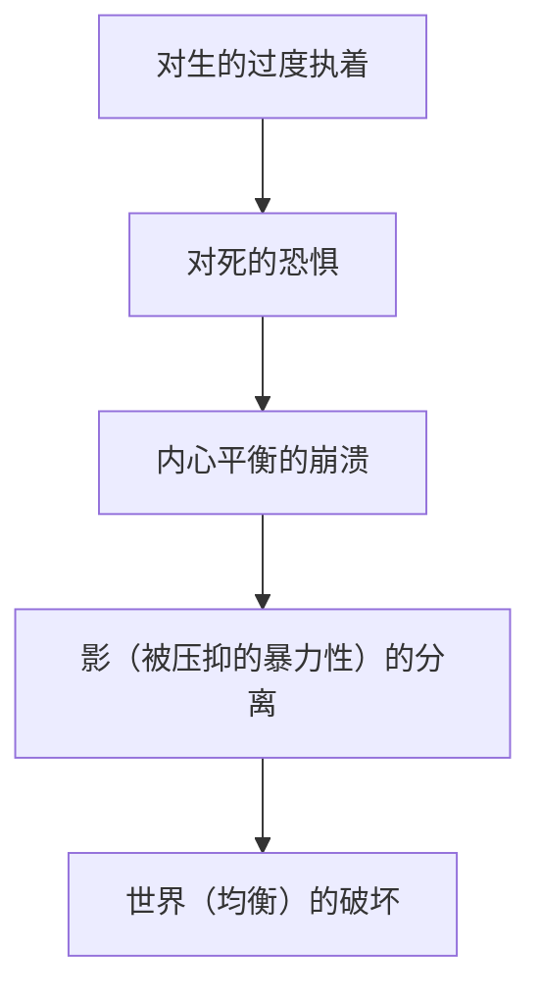

# 第6章：反战与爱，魔法的机制（哈尔的移动城堡、地海战记）

## 引言：吉卜力新时代的序幕与动荡的世界

2000年代中期，吉卜力工作室迎来了巨大的转折点。宫崎骏导演凭借《千与千寻》树立了日本电影史上的不朽金字塔，荣获奥斯卡金像奖，确立了不可动摇的世界级评价。然而，就在这辉煌的脚下，现实世界却在剧烈动荡。从2001年的911事件引发的反恐战争，到2003年爆发的伊拉克战争。在世界被卷入分裂与暴力连锁反应的过程中，宫崎骏的目光开始更直接地投向了“战争与人类的愚蠢”。

与此同时，吉卜力工作室内部也逐渐显现出世代交替这一巨大课题。本章将对吉卜力历史上占据极其特殊地位的两部作品进行技术、历史以及主题层面的极限深入探讨：一部是宫崎骏以压倒性的动画技术描绘出对伊拉克战争的强烈愤怒与对“衰老”的接纳的《哈尔的移动城堡》（2004年）；另一部则是宫崎骏的长子宫崎吾朗被破格提拔完成导演首秀，挑战与原作者的冲突及哲学性主题表达的《地海战记》（2006年）。

---

## 《哈尔的移动城堡》：蒸汽朋克的极致与反战的呐喊

尽管以戴安娜·温·琼斯的儿童文学《魔法师哈尔与火之恶魔》为原著，但宫崎骏在其中倾注了自身强烈的作家个性，构建了一个与原著大相径庭的独特故事。这既是一部以魔法与机械交织的世界为舞台的宏大爱情故事，同时也是一部痛彻心扉的反战电影。

### 1. 移动城堡的机制与动画技术的临界点

可以说本作真正的绝对主角就是标题中的“移动城堡”。这座城堡的动画表现，展示了吉卜力工作室，乃至手绘动画与3DCG融合的一个临界点。

城堡的设计是一个由大炮、房屋、烟囱、齿轮以及犹如巨大鸟类的步行足等无数废弃零件拼凑而成的异形嵌合体建筑。这是宫崎骏所擅长的蒸汽朋克式机械设计的极致，金属的摩擦声、喷出蒸汽的阀门，以及那笨拙却又莫名幽默的行走姿态，洋溢着作为巨大生物的生命感。

技术上值得特书一笔的，是如何让这个复杂至极的巨大构造物动起来的课题解决方案。吉卜力运用在《幽灵公主》的邪魔神和《千与千寻》等作品中积累的3DCG技术，用CG构建了城堡基础的运动。然而，他们并没有停留在单纯的3D模型渲染，而是将其与手绘的纹理和细节精密地叠加，从而将吉卜力特有的“手绘的温暖质感”与“CG独有的立体且动态的透视变化”完美地融合在了一起。

构成城堡的各个部件（房屋部分、齿轮、脚等），会随着步行的冲击在各自不同的时机摇晃、嘎吱作响、扭曲。计算这种“非同步的摇晃”并使其作为动画成立的工作，需要耗费近乎疯狂的心血。在城堡崩塌又再次重组的尾声阶段中，重力与魔法力量的相互抗衡，通过每一个零件运动的矢量被出色地表现了出来。

### 2. 伊拉克战争的阴影：宫崎骏描绘的强烈反战信息

在《哈尔的移动城堡》制作期间，现实世界中美国开始了对伊拉克的军事入侵。宫崎骏对这场战争怀有前所未有的强烈愤怒与失望。这种情感在本作的各个角落投下了强烈的暗影。

本作中出现的战争，并没有被描绘成敌对国家之间明确的正义碰撞。究竟孰正孰邪，对观众没有进行任何解释，只是以压倒性的绝望感描绘了遮天蔽日的怪异军机无差别地轰炸城市、将其化为火海的景象。这种“无理由破坏”的恐惧，正是戳中了现代战争的本质。

主人公哈尔作为魔法师，一边逃避军队的征召，一边每晚化身为仿佛巨大鸟怪的形态，只身奔赴战场破坏两国的军舰和轰炸机。然而，力量用得越多，他就越失去人性，逐渐变成彻底的怪物。这是一个隐喻：“为了和平的暴力”这一矛盾，最终将如何侵蚀并毁灭个人的灵魂。哈尔俯视着燃烧的城市，唾骂道：“管他是敌是友，这帮杀人凶手”，这个场景直接重叠了宫崎骏自身对伊拉克战争的悲痛呐喊。

在以往的宫崎骏作品（例如《风之谷》或《幽灵公主》）中，提示的是在纷争中如何生存的主题，而在《哈尔》中，则贯彻了“战争本身就是绝对的愚蠢行径，参与其中就意味着灵魂的死亡”这种彻底拒绝的姿态。

### 3. “老”与“少”的视觉流转：苏菲诅咒的含义

本作另一个划时代的表现是主人公苏菲的“年龄流转”。被荒野女巫施下诅咒后，苏菲从18岁的少女变成了90岁的老妇人。但是，随着故事的推进，她的容貌在老妇人与少女、少女与中年女性之间，随着情感起伏和精神状态同频，不断进行着无缝变化。

在动画中不固定角色的设定（设计），是一项极其罕见的挑战。作画监督山下明彦等人在绘制老妇人苏菲时，不仅是单纯地增加皱纹，而是精密观察并描绘了骨骼、肌肉的衰退，以及最重要的“对抗重力的姿势变化”。老妇人时期的苏菲弯腰驼背，走路带着沉重感。但是，当她想要保护哈尔，或者找回自信强有力地发言时，她的背脊会挺直，皱纹会消失，甚至连声音的声调都会变年轻（倍赏千惠子作为声优的惊人演技也在此做出了巨大贡献）。

宫崎骏利用这种视觉把戏，描绘了“衰老既是物理现象，同时也是心理状态”的主题。苏菲在被施加诅咒之前，自我评价就很低，封闭内心，在内在上已经“老了”。诅咒不过是将她的内在反映到了外表上。然而，从老妇人这一社会属性中解放出来后，讽刺的是，她反而能比少女时代采取更大胆、更有活力的行动。

这种“年龄流转”的表现，是将动画所拥有的“能够自由改变形态”的特性发挥到极致的心理描写，将人类灵魂通过爱恢复自我肯定感的轨迹，进行了无可比拟的绝美视觉化。

---

## 《地海战记》：宫崎吾朗的首秀与影之哲学

《哈尔的移动城堡》上映两年后的2006年，吉卜力工作室将厄休拉·K·勒古恩的世界级奇幻文学《地海战记》改编成了动画电影。然而，坐上导演位子的并非宫崎骏，而是此前毫无影像制作经验的长子宫崎吾朗。

### 1. 破格提拔与制作背景

将《地海战记》拍成电影，是宫崎骏长年以来的夙愿。但是，当终于从原作者勒古恩那里获得电影化许可时，宫崎骏正忙于制作《哈尔的移动城堡》，无法接任导演。于是，制片人铃木敏夫便选中了当时担任三鹰之森吉卜力美术馆馆长、拥有建筑师履历的宫崎吾朗。

铃木敏夫在吾朗绘制的亚伦与龙对峙的分镜图中，看出了“宫崎骏所没有的现代黑暗感与年轻人的真实感”。然而，对于这个决定，宫崎骏进行了强烈抗议，父子关系陷入了决裂状态。“完全不懂动画的人是做不了导演的”，宫崎骏的担忧不无道理。吾朗面临着巨大的压力以及父亲这座绝对的高墙，在统率吉卜力的资深员工指挥制作的严酷境地中苦苦挣扎。

### 2. 与原作者厄休拉·K·勒古恩的摩擦及其本质

完成后的电影《地海战记》，虽然在票房上取得了成功，但在评论家和粉丝中却掀起了毁誉参半的风暴。最为严重的是与原作者勒古恩之间决定性的摩擦。

勒古恩在自己的网站上发表了对电影的评论，冷酷地评价道：“It is not my book. It is your movie.（这不是我的书，这是你的电影。）”她认为问题在于，原著所拥有的细腻而内省的主题，被偷换成了短视的动作戏和善恶二元论。

在原著《地海战记》第一卷中，主人公格得（雀鹰）所对抗的“黑影”，是他自身的傲慢与软弱的具象化。最终格得并没有打倒那个黑影，而是拥抱并统合了它，从而确立了真正的自我。这是基于荣格心理学视角的深刻哲学。

然而在电影版（主要以原著第三卷为基础）中，主人公亚伦内心的黑影从他身上分离出来，被描绘成了独立的实体。并且最终的高潮被归结为与寻求长生不老的邪恶魔法师蜘蛛的物理战斗。在勒古恩看来，这种改编严重损害了原著核心的“内在精神的成长与接纳”这一主题。

### 3. 影与光的哲学：亚伦的纠葛与现代社会的病理

尽管受到了勒古恩的批评以及在结构上存在粗糙之处，但宫崎吾朗的《地海战记》在尖锐反映2000年代日本年轻人所特有的病理这一点上，能够发现其独特的价值。

主人公亚伦无缘无故地刺死了父亲（国王）并逃离国家。他总是被“来历不明的不安”所折磨，在对生存的执着与对死亡的恐惧之间被撕裂。亚伦的这个形象，描摹了在泡沫经济破灭后停滞的日本社会中，那些毫无理由便走向恶性犯罪的年轻人，以及迷失生存意义、把“想死”挂在嘴边的年轻人们的心理状态。

电影的主题台词，恬娜所说的“我最讨厌不爱惜生命的人”，经常被批评为过于直接且说教味太浓。但是，如果考虑到宫崎吾朗作为建筑师面对环境问题的经验，以及作为巨匠宫崎骏之子所背负的束缚与纠葛，亚伦那种“连自己的命都不知该如何是好”的焦躁感，也是吾朗自身痛彻心扉的呐喊。

此外，渴求长生不老、试图破坏世界均衡（平衡）的魔法师蜘蛛，正是通过现代科技和医疗技术试图否定“死”这一自然法则的现代人类本身的讽刺画。拒绝死亡，也就是拒绝生存，这是一个悖论。亚伦与蜘蛛的对立，表面上看是善恶之战，但在其根底，横亘着“如何接纳有限生命”这一存在主义的拷问。

在动画技术方面，虽然缺乏宫崎骏作品那种压倒性的飞翔感以及连细节都充满血肉的群演的跃动感，但静谧的背景美术（尤其是龙同类相食的暴风雨海面的描绘，以及荒废的霍特镇阴郁的色彩），巧妙地表现出了世界正在缓缓走向死亡的末日氛围。

---

## 结语：魔法的代价与向下一代的传承

《哈尔的移动城堡》与《地海战记》。这两部作品，是吉卜力工作室迎来成熟期，同时又不得不面对对未来的不安的过渡期的象征。

宫崎骏在《哈尔的移动城堡》中，将动画这种魔法运用到了极致，同时也描绘了使用这种魔法（力量）的恐怖，以及对战争这种现实暴力深深的绝望。然后，他将从中获得救赎的希望寄托在了“接纳衰老”与“无偿的爱”上。

另一方面，宫崎吾朗在《地海战记》中，挑战父亲建造的巨大魔法城堡，即便遍体鳞伤，也试图用自己的声音讲述“对生与死的接纳”。这或许有些笨拙，但它也是一部关于下一代应如何面对先人遗产、如何统合自身阴影的痛切的纪录片，是吉卜力工作室自身的一个隐喻。

魔法（动画）并非万能。但是，在知晓其局限与代价之后，依然试图在黑暗中描绘出光芒的营生，正是这个时代的吉卜力作品所蕴含的惊人魄力。

（第6章 完）
