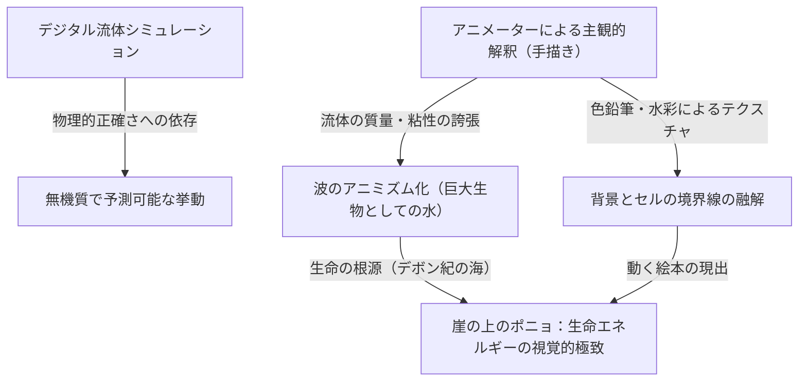

# 第7章：生命の根源と手描きの回帰（崖の上のポニョ、借りぐらしのアリエッティ）

スタジオジブリの歴史、ひいては日本のアニメーション史全体を俯瞰したとき、2000年代後半から2010年代初頭にかけての時期は、極めて特異な技術的・思想的転換点として位置づけられる。ハリウッドではピクサーやドリームワークスに代表されるフル3DCGアニメーションが映画市場のデファクトスタンダードとして君臨し、日本国内のテレビアニメや劇場作品においても、制作工程のデジタル化（デジタルペイントや3DCGによる背景・メカニックの描画）が不可逆的な波として完全に定着していた。

そのような「効率と計算された正確さ」が支配するデジタル全盛期において、宮崎駿およびスタジオジブリは、全く逆のベクトルへと強烈な舵を切った。それが「手描きアニメーションへの徹底的な回帰」と「プリミティブな生命表現の追求」である。本章では、宮崎駿監督作『崖の上のポニョ』（2008年）におけるマクロな流体アニメーションの狂気と、米林宏昌の監督デビュー作『借りぐらしのアリエッティ』（2010年）におけるミクロな視点移動とスケール感の再定義を対比しながら、ジブリがいかにして「アニメーションにおける生命の息吹」をフィルムに焼き付けたのか、その技術的・思想的深淵に迫る。

## 1. 『崖の上のポニョ』：CG排斥という狂気と「動く絵本」の現出

スタジオジブリは決してデジタル技術を否定してきたわけではない。『もののけ姫』（1997年）でのタタリ神の表現やデジタルペイントの導入、『千と千尋の神隠し』（2001年）での空間処理、『ハウルの動く城』（2004年）における3DCGを用いた城の複雑な駆動表現など、常に最新技術をセルアニメーションの文脈に巧みに取り込んできた。しかし、『崖の上のポニョ』において、宮崎駿は意図的に3DCGの使用を徹底的に排斥するという、時代に逆行する決断を下した。

この決断の根底にあったのは、デジタル技術がもたらす「過剰な正確さ」が、アニメーション本来の魅力である「デフォルメの快楽」や「描線に宿るアニメーターの身体性」を奪っているという宮崎自身の強い危機感であった。結果として本作の作画枚数は、ジブリ作品としては異例中の異例である17万枚を突破した。これはリミテッドアニメーションを基調とする日本のアニメーション業界において、正気の沙汰とは言えない狂気的な物量である。

本作の視覚的な最大の特徴は、色鉛筆や水彩の荒々しいタッチを画面上にそのまま残している点にある。従来のセルアニメーションは、キャラクター（セル）と背景美術を明確に分離し、セルは均一なベタ塗りで表現するのが定石であった。しかし『ポニョ』では、背景美術とセルの境界線を意図的に融解させている。色鉛筆のストロークや水彩の滲みがキャラクターの輪郭線にも適用され、画面全体がひとつの「動く絵本」として一体化して呼吸しているかのような有機的なテクスチャを獲得している。これは、記号論的なアニメーションの文法を破壊し、観客に対して「絵が動くことの原始的な驚き」を直接的にぶつける、極めて暴力的なまでの作家性の発露と言える。

## 2. 流体力学とアニミズムの融合：波の物理学的解釈

『崖の上のポニョ』においてアニメーション技術の歴史に名を残す最大の達成は、「水」および「波」の表現である。現代の映像制作において、水の表現は流体シミュレーション（パーティクルシステム）を用いたCGの独壇場である。物理演算を用いれば、本物と見紛うばかりのフォトリアルな海を生成することは容易だ。しかし、宮崎駿はそれを拒絶し、すべてをアニメーターの鉛筆による「線」で構築した。

特筆すべきは、中盤の圧倒的なシークエンス——巨大な古代魚の形をした波の上を、ポニョが疾走しながら宗介を追いかけるシーンである。ここでの海は、流体力学におけるナビエ＝ストークス方程式が支配する単なるニュートン流体（H2Oの集合体）ではない。作画監督の近藤勝也や、原画を担当したジブリのトップアニメーターたちは、水の挙動（慣性、粘性、表面張力、圧力）を、「筋肉の躍動」や「巨大生物の重たい質量」として直感的に再解釈している。

ポニョが乗る波は、表面張力が限界を超えて弾け飛ぶ瞬間のダイナミズムと、深海から湧き上がる高粘度のゼリー状の物質感を同時に内包している。物理学的な正確さをあえて逸脱し、波の先端に巨大な「目」を描き入れるなどのアニミズム的な視覚化を行うことで、「海そのものが意思を持った巨大な生命体である」という強烈な感覚を観客に植え付ける。波が砕ける際の水しぶき（飛沫）さえも、規則的なパーティクルではなく、ひとつひとつが不規則な形状を持った「生き物」として手描きでフルアニメートされている。この「水に命を吹き込む」という作画作業は、アニメーターたちの精神と肉体を極限まで削り取るものであったが、その結果としてCGには絶対に生み出せない「熱量」と「重量感」を伴う歴史的な映像が誕生した。

## 3. 生命の根源への退行：カンブリア爆発と母なる海

物語の構造や世界観の構築においても、『ポニョ』は生命の根源的なあり方への退行を志向している。嵐によって完全に水没した宗介の町は、通常のパニック映画であれば悲惨な災害の爪痕として描かれるはずだ。しかし本作では、水没した町の上を古代魚（デボン紀の両生類や板皮類、例えばダンクルオステウスやボトリオレピスなど）が悠然と泳ぎ回る、極めて祝祭的で美しい空間として描写される。

この透明で美しい水没都市は、地球上の生命が誕生した原始の海、あるいは羊水に満たされた巨大な子宮のメタファーである。宮崎駿はここで、人類の構築した脆い文明社会（陸）が、圧倒的な包容力と破壊力を併せ持つ自然（海）に飲み込まれ、融合していく過程を肯定的に描いている。ポニョという存在自体が、魚類から半魚人、そして両生類を経て人間（陸の生物）へと至る「進化の系統樹」を個体発生として猛スピードで体現する存在である。全編を貫く手描きアニメーションの圧倒的な運動量は、カンブリア爆発のごとき「生命が誕生し、躍動する瞬間の爆発的なエネルギー」そのものの表現なのである。

## 4. 『借りぐらしのアリエッティ』：スケール感の魔術師・米林宏昌の視点

『ポニョ』が圧倒的なマクロのスケールで生命力の爆発を描いたとすれば、その2年後に公開された『借りぐらしのアリエッティ』は、徹底したミクロの世界における物理学と視覚表現を探求した傑作である。ジブリきっての凄腕アニメーターであり、「マロ」の愛称で知られる米林宏昌の監督デビュー作となる本作は、メアリー・ノートンの児童文学を原作としながらも、「身長10cmの小人」という設定を単なるファンタジーのギミックとして終わらせず、厳密なスケール感の計算と緻密な視点移動によって、圧倒的なリアリズムへと昇華させている。

米林監督の卓越した空間認識能力とレイアウト（画面構成）の技術は、我々人間が日常的に暮らす巨大な日本家屋を、アリエッティたち小人にとっては「切り立った絶壁」「鬱蒼とした森」「広大で危険な迷宮」へと劇的に変容させる。釘を足場として巨大な壁を登り、両面テープの粘着力を利用して高所へ移動し、マチ針を護身用の剣として腰に帯びる。これらのアクション描写は、単に人間の動作を縮小しただけのものではない。10cmというスケールにおける「重力」と「質感」、そして「筋力」の再定義に基づいた、極めて物理学的に説得力のあるアニメーションとして構築されている。

## 5. マイクロスケールにおける流体力学と音響設計の妙

本作におけるアニメーション技術の白眉は、マイクロスケールにおける物理法則（特にスケール効果による流体や粉体の挙動変化）の精緻な視覚化である。流体力学においては、物体のスケールが極端に小さくなると、重力（慣性力）よりも表面張力や粘性力の影響が支配的になることが知られている。

例えば、アリエッティの母・ホミリーがティーポットでお茶を注ぐシーンを思い出してほしい。人間サイズの世界であれば、水は重力に従って細い線状になって滑らかに流れ落ちる。しかし、10cmの小人の世界では、水の表面張力の影響が相対的に極めて大きくなる。そのため、注がれるお茶は大きな水滴の塊となり、一つの重たいゼリーのように「ボトッ、ボトッ」と落下する。このミクロの世界特有の流体のダイナミクスを、アニメーターの鋭利な観察眼と作画技術によって完璧に再現しているのである。また、角砂糖の一粒が持つ巨大な岩のような重量感や、ティッシュペーパーを引っ張り出す際の分厚い帆布のような剛性の表現も、小人のスケール感を観客に体感させる重要な要素となっている。

さらに、このスケール感を決定づけているのが、笠松広司による極めて繊細かつダイナミックな音響設計（フォーリーサウンド）である。アリエッティの視点にカメラが切り替わると、人間の足音は巨大な地鳴りのような重低音として響き、冷蔵庫のモーター音は工場の機械室のような轟音となる。一方で、布が擦れる音や水滴が落ちる音も、小人の耳の解像度に合わせて極端に増幅されて表現される。視覚表現だけでなく、聴覚からもスケール感を劇的に操作することで、観客は完全にアリエッティの10cmの視座へと没入（同期）させられるのだ。

## 6. 被写界深度の操作とマクロレンズ的レイアウト

もうひとつ、『アリエッティ』の映像的特徴として見逃せないのが、背景美術における意図的かつ極端な「被写界深度（ボケ味）」の操作である。通常、スタジオジブリ作品の背景美術（男鹿和雄や武重洋二らに代表される職人技）は、画面の隅々までパンフォーカスで緻密に描き込まれ、世界の広がりを提示することが多い。

しかし本作において、小人の視点を描くカットでは、アリエッティにピントが合っている背後で、人間の家具や日用品、植物などが、まるで一眼レフカメラにマクロレンズを装着して近接撮影したかのように、極端に大きくボケて描かれている。この「ピントの浅さ」は、小人の世界が常に巨大で予測不可能な未知（人間の世界）と隣り合わせであるという緊張感や閉塞感を視覚的に表現する高度なレイアウト手法である。デジタル撮影処理を用いたボケ味の付加だけでなく、背景美術の作画段階から意図的に輪郭をぼかして描くというアナログとデジタルの融合によって、ミクロの世界の空気感を見事に表現している。

## 7. 総括：スケールの両極端から描く「生命の輝き」

『崖の上のポニョ』と『借りぐらしのアリエッティ』。一方は、マクロな視点で荒れ狂う母なる海のエネルギーと生命の爆発を、色鉛筆の狂気と全編手描きという手法で描き出した。もう一方は、ミクロな視点で静かな日常の営みと微細な物理法則の妙を、緻密なレイアウトと計算し尽くされた視覚・聴覚のコントロールによって描き出した。

アプローチの方向性はマクロとミクロという両極端に位置しているが、この時期のスタジオジブリが到達した境地は同じである。それは、CGがもたらす「無機質な正確さ」に抗い、アニメーターの手によって描かれた線の一本一本、背景の筆致の一塗りに、アニミズム的な生命を宿らせるという究極のアニメーションの姿である。巨大な波のうねりの中にも、一滴の重たいお茶の雫の中にも、等しく「生命の輝き」を見出すジブリの深い洞察力。それは、効率化の波に飲み込まれゆく現代の映像産業に対する、最も美しく、最も力強く、そして最も誇り高い作り手たちの反逆であったと言えるだろう。

