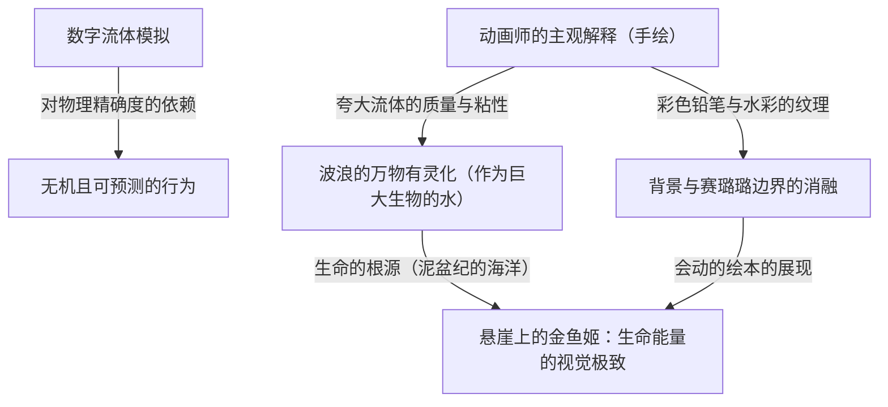

# 第7章：生命的根源与手绘的回归（悬崖上的金鱼姬、借东西的小人阿莉埃蒂）

纵观吉卜力工作室的历史，乃至整个日本动画史，2000年代后期至2010年代初期这段时期，被定位为一个极其特殊的技​​术与思想转折点。在好莱坞，以皮克斯和梦工厂为代表的全3DCG动画作为电影市场的事实标准君临天下，而在日本国内的电视动画和剧场版作品中，制作流程的数字化（数字上色以及通过3DCG绘制背景和机械）也已作为不可逆转的浪潮完全确立。

在这样一个被“效率与计算出的精确度”所支配的数字全盛期，宫崎骏及吉卜力工作室却向着完全相反的矢量强力转舵。那便是“对手绘动画的彻底回归”与“对原始生命表现的追求”。本章将对比宫崎骏导演作品《悬崖上的金鱼姬》（2008年）中宏观流体动画的疯狂，与米林宏昌导演处女作《借东西的小人阿莉埃蒂》（2010年）中微观视角的移动与尺度感的重新定义，探讨吉卜力是如何将“动画中生命的呼吸”烙印在胶片上的，并深入剖析其技术与思想的深渊。

## 1. 《悬崖上的金鱼姬》：排斥CG的疯狂与“会动的绘本”的展现

吉卜力工作室绝非一直否定数字技术。无论是《幽灵公主》（1997年）中邪魔神的表现和数字上色的引入，还是《千与千寻》（2001年）中的空间处理，亦或是《哈尔的移动城堡》（2004年）中使用3DCG表现城堡复杂的驱动等，他们总是巧妙地将最新技术融入赛璐璐动画的语境中。然而，在《悬崖上的金鱼姬》中，宫崎骏刻意做出了彻底排斥使用3DCG的逆时代潮流的决定。

这一决定的根源在于宫崎骏自身的强烈危机感：他认为数字技术带来的“过度精确”，正在剥夺动画本来的魅力，即“变形的快感”和“线条中蕴含的动画师的身体性”。结果，本作的作画张数突破了17万张，这在吉卜力作品中也是属于特例中的特例。在以有限动画为基调的日本动画业界，这是极其疯狂、难以用常理度之的工作量。

本作在视觉上的最大特征，在于将彩色铅笔和水彩粗犷的笔触原封不动地保留在画面上。传统的赛璐璐动画明确分离角色（赛璐璐）和背景美术，赛璐璐通常以均匀的平涂来表现。然而在《金鱼姬》中，背景美术和赛璐璐的边界被刻意消融了。彩色铅笔的笔触和水彩的晕染也被应用到角色的轮廓线上，使得整个画面如同一个“会动的绘本”般，获得了一体化且仿佛在呼吸的有机纹理。可以说，这破坏了符号学的动画语法，将“画作动起来的原始惊奇”直接冲击观众，是极具暴力色彩的作家性的流露。

## 2. 流体力学与万物有灵论的融合：波浪的物理学解释

在《悬崖上的金鱼姬》中，名留动画技术史的最大成就是“水”和“波浪”的表现。在现代影视制作中，水的表现是使用流体模拟（粒子系统）的CG的独角戏。只要使用物理演算，生成足以乱真的照片级真实海洋轻而易举。然而，宫崎骏拒绝了这一点，一切都用动画师铅笔的“线”来构建。

值得特书一笔的是中段压倒性的片段——波妞在形似巨大古代鱼的波浪上疾驰，追赶宗介的场景。这里的海，绝非流体力学中由纳维-斯托克斯方程支配的单纯牛顿流体（H2O的集合体）。作画监督近藤胜也以及负责原画的吉卜力顶级动画师们，将水的行为（惯性、粘性、表面张力、压力）直观地重新解释为“肌肉的跃动”和“巨大生物的沉重质量”。

波妞乘坐的波浪，同时内含表面张力超越极限迸发瞬间的动态，以及从深海涌现的高粘度果冻状的物质感。通过刻意偏离物理学的精确度，在波浪顶端画上巨大的“眼睛”等万物有灵论的视觉化处理，给观众植入了“大海本身就是一个拥有意志的巨大生命体”的强烈感觉。甚至连波浪破碎时的水花（飞沫），也不是规则的粒子，而是被当作一个个形状不规则的“生物”，以全动画手绘完成。这种“为水注入生命”的作画工作，极度消耗了动画师们的精神与肉体，但其结果是诞生了伴随着CG绝对无法创造的“热量”与“重量感”的历史性影像。

## 3. 回归生命根源：寒武纪大爆发与母亲之海

在故事结构和世界观的构建上，《金鱼姬》也志向于回归生命根源的存在方式。因暴风雨而完全被水淹没的宗介的小镇，在通常的灾难电影中应该被描绘成悲惨灾难的伤痕。然而在本作中，古代鱼（泥盆纪的两栖类和盾皮鱼类，例如邓氏鱼或沟鳞鱼等）在被水淹没的小镇上方悠然游弋，被描绘成一个极具庆典色彩的美丽空间。

这座透明而美丽的水下都市，是地球上生命诞生的原始海洋，抑或是充满羊水的巨大子宫的隐喻。宫崎骏在这里，对人类构建的脆弱文明社会（陆地）被兼具压倒性包容力与破坏力的自然（海洋）所吞噬并融合的过程，进行了肯定的描绘。波妞这一存在本身，就以极快的速度在个体发育中体现了从鱼类到半鱼人，再经过两栖类最终成为人类（陆地生物）的“进化系统树”。贯穿全篇的手绘动画的压倒性运动量，正是如同寒武纪大爆发般“生命诞生并跃动瞬间的爆发性能量”本身的表现。

## 4. 《借东西的小人阿莉埃蒂》：尺度感魔术师·米林宏昌的视角

如果说《金鱼姬》以压倒性的宏观尺度描绘了生命力的爆发，那么其2年后上映的《借东西的小人阿莉埃蒂》，则是彻底探求微观世界中物理学与视觉表现的杰作。作为吉卜力首屈一指的干练动画师、以“麻吕”为爱称的米林宏昌的导演处女作，本作虽然改编自玛丽·诺顿的儿童文学，却并未将“身高10cm的小人”这一设定仅仅停留在奇幻的噱头上，而是通过严密的尺度感计算和致密的视角移动，将其升华为压倒性的现实主义。

米林导演卓越的空间认知能力和布局（画面构成）技术，将我们人类日常居住的巨大日式房屋，对阿莉埃蒂等小人来说，戏剧性地转变为“陡峭的绝壁”、“郁郁葱葱的森林”、“广阔而危险的迷宫”。把钉子作为踏脚点攀爬巨大的墙壁，利用双面胶的粘力向高处移动，将大头针作为防身剑佩在腰间。这些动作描写，并非单纯地将人类的动作缩小。它们是基于10cm尺度下的“重力”、“质感”以及“肌肉力量”的重新定义，被构建为极具物理学说服力的动画。

## 5. 微观尺度下流体力学与音响设计的奥妙

本作动画技术中最精彩的部分，是对微观尺度下物理法则（特别是由于尺度效应引起的流体或粉体行为变化）的精细视觉化。在流体力学中众所周知，当物体的尺度变得极度微小时，表面张力和粘性力的影响将变得比重力（惯性力）更加具有支配性。

例如，请回想一下阿莉埃蒂的母亲霍米莉用茶壶倒茶的场景。如果是人类尺寸的世界，水会顺应重力变成细线状平滑地流下。然而，在10cm的小人世界里，水表面张力的影响相对变得极大。因此，倒出来的茶水变成大水滴块，像一块沉重的果冻一样“吧嗒、吧嗒”地落下。动画师敏锐的观察眼光和作画技术，完美地重现了这种微观世界特有的流体动力学。此外，一颗方糖所具有的如巨岩般的重量感，以及抽拉纸巾时如同厚重帆布般的刚性表现，也都成为了让观众体感小人尺度感的重要要素。

此外，决定这种尺度感的，是笠松广司极其细腻且充满动感的音响设计（拟音）。当摄像机切换到阿莉埃蒂的视角时，人类的脚步声回荡为如同巨大地鸣般的重低音，冰箱的马达声变成了像工厂机房一样的轰鸣声。另一方面，布料摩擦的声音或水滴落下的声音，也配合小人耳朵的分辨率被极端地放大表现。通过不仅从视觉表现，更从听觉上对尺度感进行戏剧性的操作，观众被完全代入（同步）到了阿莉埃蒂10cm的视角之中。

## 6. 景深的控制与微距镜头式的布局

另一个不容忽视的《阿莉埃蒂》的影像特征，是背景美术中刻意且极端的“景深（散景效果）”的控制。通常，吉卜力工作室作品的背景美术（以男鹿和雄和武重洋二等人为代表的匠人技艺）多采用全景深将画面的每一个角落都致密地描绘出来，以展现世界的广阔。

然而在本作中，在描绘小人视角的镜头里，在焦点对准阿莉埃蒂的背后，人类的家具、日用品、植物等，就像在单反相机上安装了微距镜头进行近距离拍摄一样，被描绘成极其严重的虚化模糊。这种“浅焦点”，是在视觉上表现小人的世界始终与巨大且不可预测的未知（人类的世界）相邻的紧张感和封闭感的高级布局手法。不仅是利用数字摄影处理添加散景效果，更在背景美术的作画阶段就刻意将轮廓模糊描绘，通过这种模拟与数字的融合，完美地表现了微观世界的空气感。

## 7. 总结：从尺度的两极描绘的“生命的光辉”

《悬崖上的金鱼姬》与《借东西的小人阿莉埃蒂》。一方，以宏观视角将波涛汹涌的母亲之海的能量与生命的爆发，用彩色铅笔的疯狂与全篇手绘的手法描绘了出来。另一方，以微观视角将宁静的日常营生与微小物理法则的奥妙，通过致密的布局和计算到了极致的视觉与听觉控制描绘了出来。

尽管切入的方向性位于宏观与微观这两极，但这一时期吉卜力工作室所达到的境界却是相同的。那就是，对抗CG带来的“无机的精确度”，在动画师亲手画出的每一根线条、背景的每一笔涂抹中，赋予万物有灵般的生命，这是动画的终极姿态。无论是在巨大的波浪翻滚之中，还是在一滴沉重的茶水之中，吉卜力深邃的洞察力都能同等地发现“生命的光辉”。这可以说是最美丽、最有力、也是最高傲的创作者们，对逐渐被效率化浪潮吞没的现代影视产业的绝地反击。
