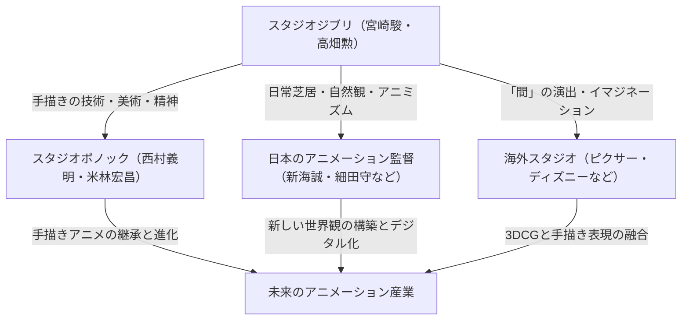

# 第8章：巨匠たちの集大成と未来への継承

日本のアニメーション史、ひいては世界のエポックメイキングとして君臨し続けたスタジオジブリは、2010年代以降、創設者である宮崎駿と高畑勲という二人の巨匠の「集大成」とも呼ぶべき特異なフェーズへと突入した。エンターテインメントとしての枠を超え、クリエイター自身の業、哲学、そして生の終焉を見据えた自己言及的な作品群が誕生することになる。本章では、『風立ちぬ』（2013）、『かぐや姫の物語』（2013）、そして『君たちはどう生きるか』（2023）という、スタジオジブリの到達点であり同時に「破壊と再生」を内包する3つの傑作を解剖し、彼らがアニメーション産業に残した遺言と、次世代への継承について技術的・思想的観点から極限まで詳述する。

## 1. 『風立ちぬ』——創造の呪縛と美しい夢の果て、宮崎駿の矛盾の告白

2013年に公開された『風立ちぬ』は、宮崎駿が長年抱え続けてきた「矛盾」を、かつてないほど生々しく露呈させた自伝的とも言える作品である。本作の主人公・堀越二郎は、零式艦上戦闘機（ゼロ戦）の設計者である実在の人物だが、宮崎はそこに同時代の文学者・堀辰雄のエッセンスを融合させ、ひとりの「創造者」の肖像を描き出した。

### 兵器の美と戦争の悲惨さという自己矛盾の極致
宮崎駿は熱狂的な兵器マニア・航空機マニアであると同時に、強固な平和主義者である。この「美しい兵器を愛しながら、それが人殺しの道具として使われる戦争を憎む」という矛盾は、『紅の豚』や『ハウルの動く城』でも断続的に描かれてきた。しかし、『風立ちぬ』において、彼はもはやファンタジーのオブラートで包むことをやめた。二郎の「ただ美しい飛行機を作りたい」という純粋な技術的欲求は、最終的に数多の若者を死地に送り込み、日本を焦土と化すゼロ戦という「呪われた夢」として結実する。夢想の空間で二郎と対話するイタリアの航空機設計者カプローニは、「ピラミッドのある世界とない世界、どちらを選ぶか」と問い、「創造的人生の持ち時間は10年だ」と告げる。これは才能の輝きとその残酷な代償についての深い洞察であり、宮崎駿自身がアニメーションという「美しい虚構」を生み出すために、自らの人生と周囲をいかに犠牲にしてきたかという痛切な懺悔録でもある。

### アニメーション技術における「風」と「音」の実験的アプローチ
技術的な観点から見ると、『風立ちぬ』はジブリが培ってきた「風」と「飛翔」の表現の総決算である。冒頭の夢のシークエンスから、軽井沢での紙飛行機の飛空、そして試験飛行に至るまで、大気の流れが目に見えるかのような作画技術は圧巻の一言に尽きる。機体のジュラルミンの質感や、リベットの一粒一粒に至るまでの執念深い描写は、メカニックへの偏愛の極致である。
さらに特筆すべきは、音響面での大胆な実験である。本作では、飛行機のプロペラ音、蒸気機関車の排気音、さらには関東大震災の地鳴りに至るまで、多くの効果音（SE）が「人間の声」によって表現された。このアニミズム的なアプローチにより、機械や自然災害がまるで意思を持った巨大な生物であるかのような異様な生々しさを獲得している。また、主人公・二郎の声優に『新世紀エヴァンゲリオン』の監督である庵野秀明を起用したことも象徴的である。プロの俳優ではない庵野の、感情の起伏が削ぎ落とされたような朴訥とした声は、技術に憑き動かされる二郎の「純粋さゆえの狂気」を見事に体現していた。結核を患う妻・菜穂子との美しくも残酷な日々もまた、エゴイズムと愛の境界線を曖昧にする宮崎のリアリズムを際立たせている。

## 2. 『かぐや姫の物語』——余白が語る生命の躍動と高畑勲の究極的実験

宮崎駿が『風立ちぬ』で自身の内面を描破した同年、高畑勲は14年ぶりの監督作『かぐや姫の物語』で、セルアニメーションの歴史を覆す究極の実験を完成させた。総製作費50億円、製作期間8年という途方もないリソースを注ぎ込んだ本作は、アニメーションの「絵画性」を極限まで押し広げた美術的到達点であり、高畑勲の遺作にして最高傑作である。

### プレスコ形式と線の生々しさ、ディズニーへのアンチテーゼ
日本のアニメーションの主流であるセルアニメーションは、均一な線で囲まれた領域を単色で塗りつぶす手法（いわゆるアニメ塗り）を基本とする。しかし高畑は、その手法が「絵から生命力を奪い、完成された過去のものにしてしまう」と考えた。彼が求めたのは、画家がキャンバスに向かって筆を走らせた瞬間の「スケッチの生々しさ（現在進行形の躍動感）」である。アニメーターの男鹿和雄や田辺修らを中核に据え、本作では鉛筆や木炭の粗いタッチ、水彩画のような淡い色彩をそのままスクリーンに定着させるという狂気的な作業が行われた。
さらに、高畑監督は「プレスコ（プレスコアリング）」形式を採用した。これは声優の演技を先に収録し、その声の抑揚や息遣い、さらには収録時の表情や身振り（ビデオカメラで撮影されていた）をベースにアニメーターが絵を描き起こす手法である。これにより、朝倉あき（かぐや姫）や高良健吾（捨丸）らの発する声のリアリティが、キャラクターの微細な筋肉の動きや感情の機微と完全にシンクロし、圧倒的な実在感を獲得した。これは、記号化されたキャラクター表現に頼りがちな現代アニメーションへの痛烈なアンチテーゼであった。

### 余白の美学と感情の爆発——疾走シークエンスの衝撃
『かぐや姫の物語』の最大の技術的・演出的特徴は「余白（描き込まない美学）」である。画面の端は水彩画のようにぼかされ、背景すらも完全に描き込まれないことが多い。高畑は「観客の想像力が入り込む余地」を残すことで、逆にスクリーンの奥に広がる世界の奥行きを観客に補完させ、能動的な鑑賞を促した。
この手法が最も凄まじい効果を発揮したのが、かぐや姫が御所の宴から逃げ出し、山へ向かって疾走するシークエンスである。彼女の怒りと絶望、束縛への抵抗が頂点に達した瞬間、丁寧な線画は突如として荒々しい墨絵のようなタッチへと変貌し、背景は感情の激流に飲み込まれるかのようにデッサンレベルまで崩壊する。線が乱れ、色が飛び散るこのシーンは、アニメーションが「描かれた記号」から「純粋な感情の視覚化」へと飛躍した瞬間であり、世界の映画史に刻まれるべき奇跡的な名シーンである。月の都の描写における無機質で仏教的な音楽との対比も、地球の「穢れ」と「生命の喜び」を肯定する高畑の死生観を浮き彫りにしている。

## 3. 『君たちはどう生きるか』——象徴主義の迷宮と次世代への遺言

2013年に一度は長編からの引退を宣言した宮崎駿が、10年の歳月を経て完成させた『君たちはどう生きるか』（2023）。本作は、かつての『千と千尋の神隠し』のようなカタルシスを伴う王道の冒険活劇ではなく、夢と現実、生と死、そして創造と破壊が入り乱れる極めて難解で象徴主義的な迷宮である。

### 自伝的要素と過去作の総括的暗喩
主人公の眞人（まひと）は、幼くして母を火事で失い、軍需工場を営む父と共に疎開する。この設定自体が宮崎自身の幼少期の体験（宇都宮への疎開、空襲の記憶、母への思慕）を色濃く反映している。彼を異世界へと誘う不気味なアオサギは、宮崎の長年の盟友であり時に激しく衝突したプロデューサー・鈴木敏夫の暗喩とも、あるいは宮崎自身の内なるトリックスターとも解釈できる。
異世界（下の世界）は、これまでのジブリ作品のモチーフが不気味に歪められ、再構築されたような空間である。『天空の城ラピュタ』を思わせる巨石、『もののけ姫』のコダマに似たワラワラ、『千と千尋』の湯屋を彷彿とさせる洋館。しかし、それらは単なるファンサービスやセルフパロディではない。宮崎が自らの脳内に蓄積された「イマジネーションの墓場」、あるいは業の集積を観客に提示しているかのように見える。人間を食らうペリカンや、ファシズムを暗示するようなインコの群れは、人間の歴史が持つ暴力性や大衆の狂気を鋭く批判している。

### 崩壊する「塔」とアニメーション産業へのメタファー
本作の核心は、異世界の均衡を保つ「大叔父」の存在である。彼は宇宙から降ってきた隕石（塔）の中で、悪意のない積み木を積むことで世界のバランスを辛うじて維持している。この大叔父こそが高畑勲、あるいは宮崎駿自身（＝スタジオジブリの創造神）のメタファーであることは疑いようがない。大叔父は眞人に「悪意のない石で、君自身の美しい世界を作れ」と後継を託すが、眞人は自らの頭にある傷（自らがついた嘘と悪意の象徴）を指し示し、完全無欠な虚構の世界を継ぐことを拒絶する。そして塔は崩壊し、鳥たちは現実世界へと解き放たれる。
これは、宮崎駿による「スタジオジブリという帝国の終焉」の宣言に他ならない。自分たちが築き上げたアニメーションという魔法の塔は、もはや寿命を迎えている。次世代は、過去の巨星が作り上げた安全で無菌な塔の中に留まるのではなく、傷や悪意に満ちた現実世界（火の海）を自らの足で生きていかなければならない。この突き放すような、しかし力強いメッセージこそが、『君たちはどう生きるか』というタイトルに込められた宮崎駿の遺言である。

## 4. スタジオジブリの遺産とアニメーションの未来——ポノックへの系譜とこれから

巨匠二人が辿り着いた極地と、その「塔」の崩壊を経て、スタジオジブリの遺伝子はいかにして未来へと継承されるのだろうか。宮崎・高畑の圧倒的なカリスマ性と天才的な作家性に依存していたジブリは、組織としての新陳代謝やシステム化という面では常に課題を抱えていた。しかし、彼らが育て上げたアニメーターたちと、その精神は確実に業界全体へと波及し、新たな命を芽吹かせている。

### スタジオポノックと手描きアニメーションの継承
その最も直接的な後継者と言えるのが、ジブリのプロデューサーであった西村義明が設立した「スタジオポノック」である。『借りぐらしのアリエッティ』『思い出のマーニー』を監督した米林宏昌を中心に設立されたこのスタジオは、『メアリと魔女の花』や『屋根裏のラジャー』を通じて、ジブリが培ってきた高度な「手描きアニメーション」の技術と、ダイナミックな背景美術の伝統を現代に受け継いでいる。
現代のアニメーション制作は3DCGやデジタルツールへの移行が著しいが、手描きならではの線の温かみや、物理法則を超えたアニメーション的な誇張（オバケ作画や重力のデフォルメ）を維持・発展させようとするポノックの試みは極めて重要である。彼らはジブリの模倣に留まらず、短編アンソロジー『ちいさな英雄』などで新たなクリエイターの育成にも注力し、手描きアニメの灯を絶やさぬための正統な技術的継承を担っている。

### 影響の広がりとジブリのこれから
ジブリの遺伝子はポノックだけに留まらない。ピクサー・アニメーション・スタジオの元CCOジョン・ラセターをはじめ、世界中のトップクリエイターたちが宮崎や高畑の演出手法、とりわけ「間（ま）」の取り方や、日常の微細な動作（食事、掃除、歩行など）に宿るキャラクターの生命感から多大な影響を受けている。新海誠や細田守といった現代の日本アニメーションを牽引する監督たちの作品にも、風景描写やアニミズム的自然観においてジブリの刻印が深く押されている。

「塔」は崩壊したかもしれないが、そこから飛び立った鳥たちは世界中に散らばり、新たな種を蒔いている。『風立ちぬ』で示された創造の業、『かぐや姫の物語』で証明された表現の無限の可能性、そして『君たちはどう生きるか』で突きつけられた現実を生きる覚悟。これらは単なる映画作品の枠を超え、人類の文化遺産として永遠に語り継がれるだろう。
2023年末、スタジオジブリは日本テレビの傘下に入り、企業としての新たなフェーズを迎えた。しかし、スタジオジブリの「第8章」は物理的なスタジオの枠組みを超えて続いていく。彼らが遺した問いと圧倒的な手描きの技術は、これから生まれる無数のクリエイターたちの手によって、次なる時代の新しいキャンバスへと描き出されていくのである。ジブリの真の遺産とは、過去のフィルムの中ではなく、それを見た私たちが「どう生きるか」という未来の行動そのものに託されている。

