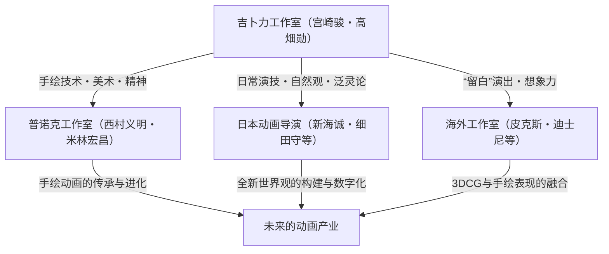

# 第8章：大师们的集大成与向未来的传承

日本动画史，乃至作为世界划时代标志而君临天下的吉卜力工作室，自2010年代以后，进入了一个特异的阶段，这可以被称为创始人宫崎骏和高畑勋两位大师的“集大成”。超越了作为娱乐的框架，诞生了一系列注视着创作者自身的业障、哲学以及生命终焉的自我指涉式的作品群。在本章中，我们将解剖《起风了》（2013）、《辉夜姬物语》（2013）以及《你想活出怎样的人生》（2023）这三部既是吉卜力工作室的顶点、同时又内含“破坏与再生”的杰作，从技术与思想的极度详尽的角度，阐述他们留给动画产业的遗言以及向下一代的传承。

## 1. 《起风了》——创造的诅咒与美丽梦想的尽头，宫崎骏矛盾的告白

2013年上映的《起风了》，是一部可以说是自传性质的作品，它将宫崎骏长年抱有的“矛盾”以前所未有的生动方式暴露出来。本作的主人公堀越二郎，是零式舰上战斗机（零战）设计者的真实人物，但宫崎骏将同时代的文学家堀辰雄的本质融合其中，描绘出了一个“创造者”的肖像。

### 兵器之美与战争悲惨的自我矛盾之极致
宫崎骏不仅是狂热的兵器迷、航空器迷，同时也是坚定的和平主义者。这种“爱着美丽的兵器，却憎恨它作为杀人工具被使用的战争”的矛盾，在《红猪》和《哈尔的移动城堡》中也断断续续地被描绘过。然而，在《起风了》中，他已经不再用幻想的糖衣来包裹。二郎“只想制造美丽的飞机”的纯粹技术欲望，最终结出了零战这个“被诅咒的梦想”的果实，将无数年轻人送往死地，让日本化为焦土。在梦想的空间里与二郎对话的意大利飞机设计师卡普罗尼问道：“有金字塔的世界和没有金字塔的世界，你选择哪一个？”并宣告“创造性人生的时间只有10年”。这是对才华的光辉及其残酷代价的深刻洞察，也是宫崎骏自身为了创造动画这种“美丽的虚构”，如何牺牲了自己的人生和周围人的痛切忏悔录。

### 动画技术中关于“风”与“声音”的实验性尝试
从技术的角度来看，《起风了》是吉卜力长期积累的关于“风”与“飞翔”表现的总决算。从开头的梦境片段，到轻井泽的纸飞机飞翔，再到试飞，仿佛能看到大气流动的作画技术，只能用叹为观止来形容。机体硬铝的质感，甚至对每一颗铆钉的执着描绘，都是对机械偏爱的极致。
此外，值得大书特书的是音响方面的大胆实验。在本作中，飞机的螺旋桨声、蒸汽机车的排气声，甚至关东大地震的地鸣声等许多音效（SE），都是通过“人声”来表现的。通过这种泛灵论的方法，机械和自然灾害获得了仿佛拥有意志的巨大生物般的奇异生动感。此外，起用《新世纪福音战士》的导演庵野秀明担任主人公二郎的配音也具有象征意义。并非专业演员的庵野那缺乏感情起伏、质朴无华的声音，完美地体现了被技术驱使的二郎那“因纯粹而产生的疯狂”。与患有结核病的妻子菜穗子美丽而残酷的日常生活，也凸显了宫崎骏模糊利己主义与爱之边界的现实主义。

## 2. 《辉夜姬物语》——留白讲述的生命跃动与高畑勋的终极实验

就在宫崎骏在《起风了》中描绘自身内心的同一年，高畑勋凭借时隔14年的导演作品《辉夜姬物语》，完成了颠覆赛璐珞动画历史的终极实验。这部耗资50亿日元总制作费、历时8年制作周期的作品，将动画的“绘画性”推向了极限的美术顶点，是高畑勋的遗作兼最高杰作。

### 预先配音形式与线条的生动感，对迪士尼的反叛
作为日本动画主流的赛璐珞动画，基本手法是用均一的线条围住区域并涂上单色（即所谓的动画涂色）。然而高畑勋认为，这种手法“剥夺了绘画的生命力，使其成为已完成的过去之物”。他所追求的，是画家面对画布挥毫泼墨瞬间的“素描的生动感（现在进行时的跃动感）”。以动画师男鹿和雄、田边修等人为核心，本作进行了一项疯狂的工作，即将铅笔和木炭的粗糙笔触、水彩画般淡雅的色彩原封不动地固定在银幕上。
此外，高畑导演采用了“预先配音（Prescoring）”的形式。这是一种先录制声优的表演，然后以声音的抑扬顿挫、呼吸，甚至录音时的表情和动作（由摄像机拍摄）为基础，由动画师绘制画面的手法。由此，朝仓亚纪（辉夜姬）和高良健吾（舍丸）等人的声音的真实感，与角色微小的肌肉运动和情感的微妙变化完美同步，获得了压倒性的真实感。这是对容易依赖符号化角色表现的现代动画的强烈反叛。

### 留白的美学与情感的爆发——疾跑片段的冲击
《辉夜姬物语》在技术与演出上最大的特征是“留白（不画满的美学）”。画面的边缘像水彩画一样被晕开，甚至连背景也经常不完全画满。高畑勋通过留下“观众想象力介入的空间”，反过来让观众去补全银幕深处广阔世界的深度，促使他们进行能动的欣赏。
这一手法发挥出最惊人效果的，是辉夜姬逃离宫中宴会，向山里疾跑的片段。在她愤怒、绝望以及对束缚的抵抗达到顶点的瞬间，细致的线稿突然变成了粗犷的水墨画般的笔触，背景仿佛被情感的激流吞没，崩溃到了素描的程度。线条凌乱、色彩飞溅的这个场景，是动画从“被描绘的符号”飞跃到“纯粹情感的视觉化”的瞬间，是应该被铭刻在世界电影史上的奇迹般的名场面。在月之都的描写中，与无机质的、佛教般的音乐的对比，也凸显了高畑勋肯定地球的“污秽”与“生命的喜悦”的生死观。

## 3. 《你想活出怎样的人生》——象征主义的迷宫与给下一代的遗言

2013年曾一度宣布从长篇动画引退的宫崎骏，历经10年岁月完成了《你想活出怎样的人生》（2023）。本作并非像曾经的《千与千寻》那样伴随着宣泄的王道冒险活剧，而是梦境与现实、生与死、以及创造与破坏交织的极其晦涩且象征主义的迷宫。

### 自传要素与过去作品的总结性隐喻
主人公真人（Mahito），幼时因火灾失去母亲，与经营军工厂的父亲一同疏散。这个设定本身就浓厚地反映了宫崎骏自身的幼年体验（疏散到宇都宫、空袭的记忆、对母亲的思慕）。诱导他进入异世界的那只诡异的苍鹭，既可以解释为宫崎骏多年的盟友、有时也会激烈冲突的制片人铃木敏夫的隐喻，也可以解释为宫崎骏自身内在的骗子（Trickster）。
异世界（下面的世界），是一个将迄今为止吉卜力作品的母题怪异地扭曲、重构般的空间。让人联想到《天空之城》的巨石，与《幽灵公主》中的木灵相似的哇啦哇啦，让人仿佛看到《千与千寻》中汤屋的洋馆。然而，它们绝非单纯的粉丝福利或自我戏仿。宫崎骏似乎在向观众展示他大脑中积累的“想象力的坟墓”，抑或是业障的堆积。吃人的鹈鹕、暗示法西斯主义的鹦鹉群，尖锐地批判了人类历史所拥有的暴力性和大众的疯狂。

### 崩塌的“塔”与对动画产业的隐喻
本作的核心是维持异世界平衡的“舅公”的存在。他在从宇宙降落的陨石（塔）中，通过堆叠没有恶意的积木，勉强维持着世界的平衡。这位舅公毫无疑问就是高畑勋，或者是宫崎骏自身（=吉卜力工作室的创造神）的隐喻。舅公将后继之事托付给真人，说“用没有恶意的石头，创造出你自己美丽的世界”，但真人指着自己头上的伤疤（自己撒谎和恶意的象征），拒绝继承完美无缺的虚构世界。于是塔崩塌了，鸟儿们被释放到了现实世界。
这无异于宫崎骏对“吉卜力工作室这个帝国的终结”的宣言。他们建立的动画这座魔法之塔，已经迎来了寿命的终结。下一代不应该留在过去的巨星建立的安全无菌的塔中，而必须用自己的双脚，在充满伤痕和恶意的现实世界（火海）中活下去。这种仿佛将人推开、却又强有力的信息，正是宫崎骏寄托在《你想活出怎样的人生》这个标题中的遗言。

## 4. 吉卜力工作室的遗产与动画的未来——普诺克的系谱与未来

在两位大师抵达极境以及那座“塔”的崩塌之后，吉卜力工作室的基因将如何向未来传承呢？依赖于宫崎骏、高畑勋压倒性的领袖魅力和天才般作家性的吉卜力，在作为组织的新陈代谢和系统化方面一直面临着课题。然而，他们培养出来的动画师们，以及他们的精神，确实波及了整个行业，正在孕育出新的生命。

### 普诺克工作室与手绘动画的传承
可以说其最直接的继承者，就是由吉卜力制片人西村义明设立的“普诺克工作室（Studio Ponoc）”。这个以执导了《借东西的小人阿莉埃蒂》、《回忆中的玛妮》的米林宏昌为中心设立的工作室，通过《玛丽与魔女之花》和《阁楼的拉杰》，将吉卜力培育出的高度的“手绘动画”技术和充满动态的背景美术传统传承至今。
现代的动画制作正显著地向3DCG和数字化工具过渡，但普诺克试图维持并发展手绘特有的线条温度，以及超越物理法则的动画式夸张（幽灵作画或重力的变形）的尝试极其重要。他们并没有停留在模仿吉卜力上，还通过短篇选集《小小英雄》等致力于培养新的创作者，担负着不让手绘动画之火熄灭的正统技术传承。

### 影响的扩大与吉卜力的未来
吉卜力的基因并不仅限于普诺克。以皮克斯动画工作室前CCO约翰·拉塞特为首，全世界的顶级创作者们都从宫崎骏和高畑勋的演出手法，特别是“留白（间）”的处理方式，以及在日常微小动作（吃饭、打扫、行走等）中蕴含的角色生命力中受到了巨大的影响。在引领现代日本动画的新海诚和细田守等导演的作品中，风景描写和泛灵论的自然观上也深深地烙印着吉卜力的印记。

“塔”也许已经崩塌，但从中飞出的鸟儿们散落到世界各地，播下了新的种子。在《起风了》中展现的创造之业障，在《辉夜姬物语》中被证明的表现的无限可能性，以及在《你想活出怎样的人生》中被强加的活在现实中的觉悟。这些早已超越了单纯的电影作品框架，作为人类的文化遗产，将被永远传唱。
2023年底，吉卜力工作室归入日本电视台旗下，迎来了作为企业的新阶段。但是，吉卜力工作室的“第8章”将超越物理工作室的框架继续下去。他们留下的问题和压倒性的手绘技术，将由今后诞生的无数创作者之手，在下一个时代的新画布上描绘出来。吉卜力真正的遗产，不在过去的胶片中，而是寄托在看了那些胶片的我们“想活出怎样的人生”这一未来的行动本身之中。
