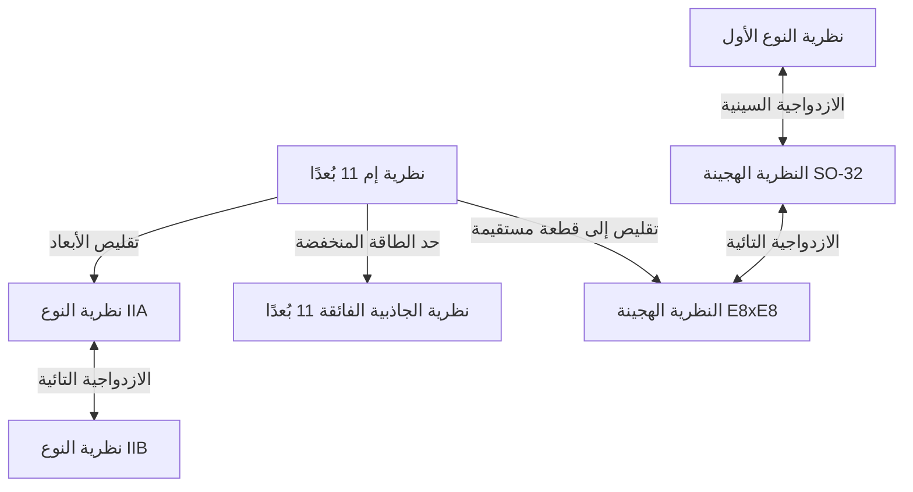

# مقدمة: تحدي الحلم النهائي للفيزياء "نظرية كل شيء (TOE)"

أحد أكثر الأهداف طموحًا في الفيزياء الحديثة هو بناء "نظرية كل شيء (Theory of Everything: TOE)" التي تصف القوى الأساسية الأربع الموجودة في الطبيعة - الجاذبية، والقوة الكهرومغناطيسية، والقوة الضعيفة، والقوة القوية - بطريقة موحدة. نجح النموذج القياسي (Standard Model) في وصف ثلاث من هذه القوى وهي القوة الكهرومغناطيسية، والقوة الضعيفة، والقوة القوية، والجسيمات الأولية المرتبطة بها بدقة عالية للغاية. ومع ذلك، فإن "الجاذبية" وحدها، والتي تصفها نظرية النسبية العامة لأينشتاين، عند محاولة دمجها في إطار ميكانيكا الكم، تؤدي إلى صعوبات لا نهائية (عدم القابلية لإعادة الاستنظام)، مما يسبب انهيارًا قاتلًا للنظرية.

تُعد "نظرية الأوتار الفائقة (Superstring Theory)" المرشح الأبرز والأوحد لحل هذا التناقض العميق. في هذا المقال، سنشرح بشكل شامل الصورة الكاملة الملحمية لنظرية الأوتار الفائقة، بدءًا من التحول النموذجي الذي يعتبر الوحدة الأصغر للمادة "وترًا أحادي البعد" بدلاً من "نقطة"، مرورًا بتقليص الأبعاد الإضافية، ورياضيات متعدد طيات كالابي-ياو، والتكامل النهائي عبر نظرية إم (M-theory)، وصولًا إلى التحديات الحالية للتحقق من صحتها.

---

## الفصل الأول: انهيار الجسيمات النقطية وإدخال الأوتار

### صعوبات اللانهاية في نظرية المجال الكمي وعدم القابلية لإعادة استنظام الجاذبية

في نظرية المجال الكمي التقليدية (Quantum Field Theory: QFT)، التي تعامل الجسيمات الأولية كـ "نقاط" لا حجم لها، لطالما كانت هناك مشكلة مستمرة تتمثل في أنه عندما تتفاعل الجسيمات مع بعضها البعض، فإن طاقة التفاعل تتضخم إلى ما لا نهاية عند النهاية التي تقترب فيها المسافة من الصفر. في القوة الكهرومغناطيسية، والقوة القوية، والقوة الضعيفة، كان من الممكن إلغاء هذه اللانهاية واستخلاص تنبؤات محدودة وذات مغزى فيزيائي من خلال تقنية رياضية تسمى "نظرية إعادة الاستنظام (Renormalization)"، والتي أسسها سين-إيتيرو توموناغا، وريتشارد فاينمان، وجوليان شوينغر وآخرون.

ومع ذلك، إذا حاولنا إدخال جسيم أولي غير معروف يحمل الجاذبية يسمى "الجرافتون (Graviton)" ومحاولة تكميم نظرية النسبية العامة (بناء نظرية الجاذبية الكمية)، فإن طريقة إعادة الاستنظام هذه لا تعمل على الإطلاق. لأن ثابت اقتران الجاذبية (ثابت نيوتن) له أبعاد الطاقة، فكلما تم حساب مخططات فاينمان ذات الحلقات الأعلى، تنشأ تباعدات جديدة لا حصر لها، وتصبح هناك حاجة إلى عدد لا نهائي من المعلمات لإلغائها جميعًا. يُطلق على هذا اسم "عدم القابلية لإعادة استنظام الجاذبية".

### نموذج الرنين المزدوج ليويتشيرو نامبو وهيديهيكو غوتو والأوتار أحادية البعد

بدأ تاريخ نظرية الأوتار الفائقة من مكان لا علاقة له بالجاذبية على الإطلاق. في عام 1968، اكتشف غابرييل فينيزيانو (Gabriele Veneziano) أن سعة التشتت (احتمالية التشتت) للهادرونات التي تتفاعل بقوة يمكن وصفها بشكل مدهش ورائع باستخدام دالة بيتا لأويلر في الرياضيات (سعة فينيزيانو).

الذين اكتشفوا المعنى الفيزيائي لهذه الصيغة الرياضية هم يويتشيرو نامبو، وهيديهيكو غوتو، وهولجر نيلسن، وليونارد ساسكيند وآخرون. في عام 1970، أظهروا أنه بافتراض أن "الهادرونات ليست جسيمات نقطية بل هي أجسام متذبذبة مثل الأربطة المطاطية أحادية البعد ذات طول محدود"، يمكن اشتقاق سعة فينيزيانو بشكل طبيعي (نموذج الرنين المزدوج).

الفعل الأساسي لوصف حركة هذا "الوتر" هو فعل نامبو-غوتو (Nambu-Goto Action). عندما يتحرك الوتر عبر الزمكان، ترسم النقطة خطًا (خط العالم: Worldline)، بينما يرسم الوتر أحادي البعد سطحًا ثنائي الأبعاد (سطح العالم: Worldsheet). يتم تعريف فعل نامبو-غوتو ككمية تتناسب مع مساحة سطح العالم هذا.

$$ S = -T \int d\tau d\sigma \sqrt{- \det(\gamma_{ab})} $$

هنا، $T$ هو توتر الوتر (Tension)، و $\gamma_{ab}$ هو المترية المستحثة على سطح العالم. هذا الفعل جميل جدًا من الناحية الهندسية، ولكن عند تكميمه، فإن التعامل مع الجذر التربيعي ينطوي على صعوبات رياضية.

### فعل بولياكوف (Polyakov Action) والثبات الامتثالي

لذلك، قدم ألكسندر بولياكوف (Alexander Polyakov) مترية مستقلة لسطح العالم $h_{ab}$ كمجال مساعد، واقترح "فعل بولياكوف"، وهو فعل مكافئ لفعل نامبو-غوتو ولكنه أسهل في التعامل معه لأنه لا يحتوي على جذور تربيعية.

$$ S = -\frac{T}{2} \int d^2\sigma \sqrt{-h} h^{ab} \partial_a X^\mu \partial_b X^\nu \eta_{\mu\nu} $$

يتميز فعل بولياكوف بثبات إعادة المعايرة (Diffeomorphism invariance)، بالإضافة إلى أنه غير متغير تحت تحويلات المقياس المحلية، وهو ما يُعرف بـ "ثبات فايل (Weyl invariance)"، أي التناظر الامتثالي. هذه الخصائص كنظرية مجال امتثالي ثنائية الأبعاد (CFT) ستشكل الأساس الرياضي القوي لنظرية الأوتار.

---

## الفصل الثاني: الأوتار المفتوحة والمغلقة، والتناظر الفائق

### الجسيمات الأولية كأنماط اهتزازية للأوتار

الفكرة الأكثر ثورية في نظرية الأوتار هي مفهوم أن "العدد اللانهائي من الجسيمات الأولية الموجودة في الكون ليست سوى أنماط اهتزازية مختلفة (نغمات توافقية) لوتر واحد". تمامًا كما تنتج أوتار الكمان نغمات (ترددات) مختلفة بناءً على كيفية العزف عليها، تتخذ الأوتار الدقيقة حالات اهتزازية مختلفة لتظهر لأعيننا كجسيمات أولية بكتل ولف مغزلي (سبين) مختلف.

هناك نوعان من الأوتار: "الأوتار المفتوحة (Open string)" التي لها نهايات، و"الأوتار المغلقة (Closed string)" التي تلتقي نهاياتها لتشكل حلقة.

### الأوتار المفتوحة تولد جسيمات المقياس، والأوتار المغلقة تولد الجرافتونات

**الوتر المفتوح (Open String):**
لا يتحرك طرفا الوتر المفتوح بحرية في الفضاء، بل هما مثبتان على غشاء يُسمى D-brane (والذي سيتم شرحه لاحقًا). عند تحليل الحالة الأرضية (نمط الاهتزاز ذو الطاقة الأدنى) للوتر المفتوح، يظهر جسيم متجه ذو كتلة صفرية ولف مغزلي مقداره 1. هذا هو بالضبط "بوزون المقياس" مثل الفوتون الذي يتوسط القوة الكهرومغناطيسية، والغلون الذي يتوسط القوة القوية.

**الوتر المغلق (Closed String):**
من ناحية أخرى، لا يحتوي الوتر المغلق على نهايات، لذلك يمكنه الانتشار بحرية عبر الزمكان دون أن تقيده الأغشية. عند تكميم وتحليل أنماط اهتزاز الوتر المغلق، يظهر بشكل مفاجئ وضروري جسيم موتري ذو كتلة صفرية و"لف مغزلي 2". هذا الجسيم لا يوجد في النموذج القياسي، وهو جسيم يمتلك نفس خصائص "الجرافتون (Graviton)" الذي تتنبأ به نظرية النسبية العامة كجسيم حامل للجاذبية.

لم يتم تصميم نظرية الأوتار من البداية لتشمل الجاذبية. على الرغم من أنها بدأت كنظرية للهادرونات، إلا أن صيغها الرياضية تطلبت بشكل عفوي وجود الجرافتون. وبسبب هذه الحقيقة، تحولت نظرية الأوتار بشكل دراماتيكي من مجرد نموذج للقوة القوية إلى المرشح الأبرز لـ "نظرية الجاذبية الكمية" (اقتراح جون شوارز وجويل شيرك عام 1974).

### انهيار نظرية الأوتار البوزونية (ظهور التاكيون) وجبر فيراسورو

كانت نظرية الأوتار في البداية هي "نظرية الأوتار البوزونية" التي تصف البوزونات (الجسيمات الحاملة للقوى) فقط. من أجل التعامل بشكل صحيح مع اهتزازات الأوتار من منظور ميكانيكا الكم، يجب ضمان عدم انهيار الثبات الامتثالي (غياب الشذوذ) أثناء عملية التكميم.

يتم وصف التناظر الامتثالي على سطح العالم ثنائي الأبعاد بواسطة "جبر فيراسورو (Virasoro Algebra)"، وهو جبر لي لا نهائي الأبعاد.
$$ [L_m, L_n] = (m - n)L_{m+n} + \frac{c}{12}m(m^2 - 1)\delta_{m+n, 0} $$
هنا، يُطلق على $c$ اسم الشحنة المركزية (Central charge). لكي تكون نظرية الأوتار البوزونية متسقة رياضياً (بدون ظهور حالات الشبح)، تم إثبات أن أبعاد الزمكان $D$ يجب أن تكون بشكل مفاجئ "26 بُعدًا (25 بُعدًا مكانيًا + بُعد زمني واحد)".

علاوة على ذلك، كمشكلة قاتلة، فإن أدنى حالة طاقة في نظرية الأوتار البوزونية تصبح "تاكيون (Tachyon)"، وهو جسيم كتلته تخيلية (مربع الكتلة سالب). الفراغ الذي يوجد فيه التاكيون غير مستقر، مما يعني أن النظرية لا يمكنها وصف الواقع الفيزيائي.

### إدخال التناظر الفائق (Supersymmetry) ونظرية الأوتار الفائقة (10 أبعاد)

لحل مشكلة التاكيون والعيب المتمثل في أن النظرية لا تشمل الفرميونات (مثل الإلكترونات والكواركات) التي تشكل المادة، تم إدخال "التناظر الفائق (Supersymmetry: SUSY)". التناظر الفائق هو تناظر يبدل بين البوزونات (جسيمات ذات لف مغزلي صحيح) والفرميونات (جسيمات ذات لف مغزلي نصف صحيح).

في "نظرية الأوتار الفائقة (Superstring Theory)" حيث تم إدخال التناظر الفائق على سطح عالم الوتر، من خلال إجراء عملية رياضية تسمى إسقاط GSO (Gliozzi-Scherk-Olive projection)، تم إثبات أنه يتم استبعاد التاكيونات بنجاح من الطيف، وفي الوقت نفسه يتحقق التناظر الفائق للزمكان.

في نظرية الأوتار الفائقة هذه، يتم إلغاء الشذوذ الامتثالي، ويكون عدد أبعاد الزمكان الذي يصبح فيه النظام متسقًا رياضيًا هو "10 أبعاد (9 أبعاد مكانية + بُعد زمني واحد)". يختلف هذا اختلافًا كبيرًا عن الزمكان رباعي الأبعاد (3 أبعاد مكانية + بُعد زمني واحد) الذي نعيش فيه، لكنه يمثل اللحظة التي تم فيها تقليل الأبعاد بشكل جذري من 26 بُعدًا إلى 10 أبعاد، مما جعلنا نقترب خطوة نحو الفيزياء الواقعية.

---

## الفصل الثالث: ثورة نظرية الأوتار الفائقة الأولى

من أواخر السبعينيات إلى أوائل الثمانينيات، تخلى مجتمع الفيزياء تقريبًا عن نظرية الأوتار الفائقة، باستثناء عدد قليل من الباحثين المتحمسين. كان يُعتقد أن التناقضات الرياضية المسماة الشذوذ الكمي (Anomalies) ستحدث حتمًا عند الجمع بين نظريات المقياس والجاذبية.

### عام 1984: الإلغاء المعجزي للشذوذ بواسطة جرين وشوارز

في صيف عام 1984، أنجز مايكل جرين (Michael Green) وجون شوارز (John Schwarz) عملية حسابية تاريخية. أثبتوا أنه في نظرية أوتار فائقة ذات 10 أبعاد تفي بشروط معينة، فإن شذوذ المقياس وشذوذ الجاذبية يلغيان بعضهما البعض تمامًا ويصبحان صفرًا على مستوى مخطط فاينمان السداسي (Hexagon diagram).

من أجل حدوث هذا الإلغاء المعجزي، اتضح أن مجموعة المقياس التي تقف وراء النظرية يجب أن تكون مجموعة تناظر ضخمة محددة. وهما مجموعتان فقط: **$SO(32)$** (المجموعة المتعامدة الخاصة ذات 32 بُعدًا)، و **$E_8 \times E_8$** (حاصل الضرب المباشر للمجموعة الاستثنائية E8).

أحدث هذا الاكتشاف صدمة هائلة في مجتمع الفيزياء، وأطلق شرارة ازدهار بحثي هائل يُعرف باسم "ثورة نظرية الأوتار الفائقة الأولى". لقد فُتح الطريق إلى نظرية كل شيء فجأة وبشكل واضح.

### 5 نظريات أوتار فائقة متسقة

منذ اكتشاف جرين وشوارز، تسارعت الأبحاث بشكل كبير، وأصبح من الواضح أخيرًا أنه يمكن تصنيف نظريات الأوتار الفائقة المتسقة في 10 أبعاد إلى "5 أنواع" كالتالي:

1. **نظرية النوع الأول (Type I)**: تشمل كلاً من الأوتار المفتوحة والمغلقة. التناظر الفائق هو $N=1$. مجموعة المقياس هي $SO(32)$.
2. **نظرية النوع الثاني أ (Type IIA)**: أوتار مغلقة فقط. التناظر الفائق هو $N=2$، وهي غير لايدوية (non-chiral، تحفظ تناظر التكافؤ).
3. **نظرية النوع الثاني ب (Type IIB)**: أوتار مغلقة فقط. التناظر الفائق هو $N=2$، وهي لايدوية (chiral، تكسر تناظر التكافؤ. قريبة من خصائص التفاعلات الضعيفة في العالم الحقيقي).
4. **النظرية الهجينة $SO(32)$ (Heterotic SO(32))**: أوتار مغلقة فقط. نظرية غريبة ولكنها جميلة تهجن بين الاهتزازات المتجهة لليمين (وتر فائق في 10 أبعاد) والاهتزازات المتجهة لليسار (وتر بوزوني في 26 بُعدًا). مجموعة المقياس هي $SO(32)$.
5. **النظرية الهجينة $E_8 \times E_8$ (Heterotic E8xE8)**: هيكل هجين مماثل. مجموعة المقياس هي $E_8 \times E_8$. كانت تُعتبر النظرية الأكثر وعودًا لفترة من الوقت، لأنها قادرة على احتواء تناظرات النموذج القياسي الواقعي ($SU(3) \times SU(2) \times U(1)$) بشكل طبيعي.

كانت كل نظرية من هذه النظريات الخمس تمتلك اتساقًا رياضيًا مثاليًا. من وجهة نظر الفلسفة التي تنص على أن "نظرية كل شيء يجب أن تكون نظرية واحدة فقط"، فإن وجود خمسة مرشحين كان لغزًا كبيرًا لعلماء الفيزياء في ذلك الوقت.

---

## الفصل الرابع: تقليص الأبعاد الإضافية ومتعدد طيات كالابي-ياو

الزمكان ذو "الأبعاد العشرة" الذي تتطلبه نظرية الأوتار الفائقة يتعارض بوضوح مع "الأبعاد المكانية الثلاثة + البُعد الزمني الواحد (بإجمالي 4 أبعاد)" الذي ندركه في حياتنا اليومية. أين تختبئ الأبعاد المكانية الستة المتبقية (الأبعاد الإضافية: Extra Dimensions)؟

### النسب من نظرية كالوزا-كلاين

مفهوم الأبعاد الإضافية في حد ذاته أقدم بكثير من نظرية الأوتار، ويعود إلى عشرينيات القرن الماضي مع ثيودور كالوزا (Theodor Kaluza) وأوسكار كلاين (Oskar Klein). قاموا بتوسيع نظرية النسبية العامة إلى 5 أبعاد (4 أبعاد مكانية + بُعد زمني واحد)، وعبر لف (تقليص) البعد المكاني الرابع إلى حجم دائرة متناهية الصغر، نجحوا في اشتقاق الجاذبية والقوة الكهرومغناطيسية في 4 أبعاد بشكل موحد. يظهر الهيكل الهندسي للأبعاد الإضافية كـ "قوة (مجال المقياس)" في عالم الطاقة المنخفضة.

### متعدد طيات كالر ذو انحناء ريتشي الصفري: فضاء كالابي-ياو

من أجل استخلاص فيزياء رباعية الأبعاد واقعية من نظرية الأوتار الفائقة ذات الـ 10 أبعاد، من الضروري "تقليص (Compactification)" الأبعاد الستة الإضافية إلى حجم متناهي الصغر يقترب من طول بلانك ($10^{-35}$ متر). لا يقتصر الأمر على مجرد طيها، بل يجب أن تلبي قيودًا فيزيائية صارمة تتمثل في الاحتفاظ بتناظر فائق واحد على الأقل $N=1$ في الفضاء رباعي الأبعاد (لحل مشكلة التدرج واشتقاق الفرميونات).

في عام 1985، أثبت كل من فيليب كانديلاس (Philip Candelas)، وغاري هورويتز (Gary Horowitz)، وأندرو سترومينجر (Andrew Strominger)، وإدوارد ويتن (Edward Witten) أن هذا الفضاء المكون من 6 أبعاد إضافية يجب أن يكون متعدد طيات مُركّب خاص يلبي شروطًا رياضية معينة.

هذا الشرط هو أن يكون "متعدد طيات كالر مدمج ذا انحناء ريتشي صفري (Ricci-flat Kähler manifold)". تنبأ عالم الرياضيات يوجينيو كالابي (Eugenio Calabi) بوجود هذا الفضاء الهندسي، وقام شينغ-تونغ ياو (Shing-Tung Yau) بإثباته رياضيًا، ولذلك يُطلق عليه اسم "**متعدد طيات كالابي-ياو (Calabi-Yau manifold)**".

### رقم أويلر وعدد أجيال الكواركات

البنية شديدة التعقيد والصعوبة لـ "الثقوب" و"الطوبولوجيا" في فضاء كالابي-ياو تحدد تمامًا خصائص الجسيمات الأولية في عالمنا رباعي الأبعاد.

على سبيل المثال، تبين أن نصف القيمة المطلقة لـ "رقم أويلر (Euler characteristic)"، وهو ثابت يميز طوبولوجيا متعدد الطيات، يتطابق مع "عدد أجيال الجسيمات الأولية" التي تظهر في العالم الحقيقي. نظرًا لوجود 3 أجيال من الكواركات واللبتونات في النموذج القياسي (علوي-سفلي، ساحر-غريب، قمي-قاعي)، أصبح البحث عن فضاء كالابي-ياو الذي يكون فيه رقم أويلر $\pm 6$ هو المهمة الأهم في علم الظواهر المرتبط بنظرية الأوتار.

### عجائب التناظر المرآتي (Mirror Symmetry)

حققت دراسة متعدد طيات كالابي-ياو اختراقات دراماتيكية في مجال الرياضيات البحتة أيضًا. اكتشف الفيزيائيون أن فضاءين من فضاءات كالابي-ياو (زوج مرآتي) يمتلكان طوبولوجيا مختلفة تمامًا، يصفان في الواقع نفس الظواهر الفيزيائية بالضبط في نظرية الأوتار. هذا هو "التناظر المرآتي".

من الناحية الرياضية، أذهل ذلك علماء الرياضيات، حيث إن إحدى مسائل متعددات الطيات التي كانت حساباتها بالغة الصعوبة (على سبيل المثال، مسألة في الهندسة العدّية لحساب عدد المنحنيات الكسرية)، يمكن حلها بسهولة تامة عن طريق تحويلها باستخدام التناظر المرآتي إلى مسألة تكامل في متعدد الطيات الآخر. لا تعد نظرية الأوتار مجرد نظرية فيزيائية، بل تعمل أيضًا كـ "كاشف نهائي" لاكتشاف رياضيات عميقة ومجهولة.

---

## الفصل الخامس: ثورة نظرية الأوتار الفائقة الثانية ونظرية إم (M-theory)

حتى منتصف التسعينيات، كان يُعتقد أن نظريات الأوتار الفائقة الخمس هي نظريات مستقلة ومنفصلة. ومع ذلك، في عام 1995، في مؤتمر الأوتار الدولي الذي عُقد في جامعة جنوب كاليفورنيا، أدى العرض التاريخي الذي قدمه إدوارد ويتن (Edward Witten) إلى تغيير الوضع بشكل جذري. لقد كانت بداية "ثورة نظرية الأوتار الفائقة الثانية".

### قاموس السحر: الازدواجية (Duality)

باستخدام مفهوم يسمى "الازدواجية (Duality)"، أثبت ويتن ببراعة أن نظريات الأوتار الفائقة الخمس التي تبدو مختلفة تمامًا في الظاهر، ليست في الواقع سوى أوجه مختلفة لـ "نظرية نهائية واحدة". الازدواجيات الرئيسية هي الاثنتان التاليتان:

- **الازدواجية التائية (T-Duality)**: خاصية مذهلة تنص على أنه عندما يكون نصف قطر تقليص الفضاء هو $R$، فإن النظرية ذات نصف القطر $R$ والنظرية ذات نصف القطر $1/R$ متكافئتان فيزيائيًا تمامًا. هذا أظهر أن نظرية النوع IIA ونظرية النوع IIB، بالإضافة إلى النظريتين الهجينتين، متصلة ببعضها البعض. من منظور نظرية الأوتار، لا يمكن التمييز بين الكون المتناهي الصغر والكون العملاق.
- **الازدواجية السينية (S-Duality)**: علاقة تنص على أنه عندما يكون ثابت الاقتران للتفاعل هو $g$، فإن النظرية ذات ثابت الاقتران الكبير (تفاعل قوي) تكون مكافئة لنظرية ضعيفة يكون فيها ثابت الاقتران $1/g$. من خلال هذا، تم ربط نظرية النوع الأول بالنظرية الهجينة SO(32)، وأصبح من الممكن حساب فيزياء منطقة الاقتران القوي غير القابلة للحساب باستخدام منطقة الاقتران الضعيف لنظرية أخرى.

### اكتشاف أغشية دي (D-brane)

في نفس الوقت تقريبًا الذي قدم فيه ويتن عرضه، قام جوزيف بولشينسكي (Joseph Polchinski) بتعريف مفهوم واضح لـ "**أغشية دي (D-brane)**" وأثبت أهميتها في نظرية الأوتار. D-brane هو كيان يشبه "غشاءً متعدد الأبعاد" يمكن أن تلتصق به نهايات الأوتار المفتوحة (يأتي الحرف D من شروط حد ديريشليه).

أصبح D-brane مكونًا لا غنى عنه في نظرية الأوتار، حيث أدى إلى توضيح الأصل المجهري لإنتروبيا الثقوب السوداء (إنجاز سترومينجر وفافا في عام 1996). وتشتق من هذا أيضًا "فرضية عالم الأغشية (Braneworld)" التي تقترح احتمال أن يكون كوننا نفسه غشاء D3 ضخمًا (غشاء مكاني ثلاثي الأبعاد).

### "نظرية إم (M-theory)" ذات الأبعاد الأحد عشر التي توحد كل شيء

اقترح ويتن، الذي وحد نظريات الأوتار الفائقة الخمس من خلال شبكة من الازدواجيات، "**نظرية إم (M-theory)**" كنظرية أعلى مستوى توحد هذه النظريات.

بشكل مفاجئ، الزمكان الذي تتكشف فيه نظرية إم هو "11 بُعدًا (10 أبعاد مكانية + بُعد زمني واحد)". عندما نأخذ نهاية ثابت الاقتران إلى اللانهاية في نظرية النوع IIA، يظهر بُعد مكاني آخر لم يكن مرئيًا (البعد الحادي عشر) على شكل دائرة، ويتبين أن "الوتر" أحادي البعد كان في الواقع "غشاءً (Membrane)" ثنائي الأبعاد ملفوفًا.

ماذا يعني حرف "M" في نظرية إم (Membrane، Magic، Mystery، Matrix، Mother، إلخ) تُرك غامضًا عمدًا من قبل ويتن نفسه. حتى يومنا هذا، لم يتم العثور على الصياغة الرياضية الكاملة (المعادلات الأساسية) لنظرية إم، ولا تزال واحدة من أكبر المشكلات التي لم يتم حلها في الفيزياء الحديثة. ومع ذلك، من خلال مبدأ الهولوغرافيا (توافق AdS/CFT) وغيرها، يتم توضيح خصائصها الجزئية تدريجيًا.

*(ملاحظة: رسم تخطيطي لتوحيد نظريات الأوتار الفائقة الخمس المرتبطة بالازدواجية، مع تمركز نظرية إم في المنتصف)*

---

## الفصل السادس: مشهد الأوتار (String Landscape) وتحدي التحقق

منذ فترة طويلة تتربع نظرية الأوتار الفائقة كأبرز مرشح لتكون نظرية كل شيء، ولكن بما أنها فيزياء، فإن التحقق من خلال التجارب والمشاهدات أمر ضروري. ومع ذلك، هناك جدار هائل يقف في طريق ذلك.

### 10^500 فراغ: مشهد الأوتار والمبدأ الإنساني

هناك عدد لا يحصى من التوليفات لطوبولوجيا متعدد طيات كالابي-ياو، وترتيب أغشية D، والتدفقات (مثل خطوط المجال المغناطيسي) التي تلتف حول متعدد الطيات. أظهرت الحسابات في أوائل العقد الأول من القرن الحادي والعشرين أن عدد الفراغات المستقرة أو شبه المستقرة (المرشحة لتكون أنماطًا للكون) التي تسمح بها نظرية الأوتار يبلغ عددًا مذهلًا يتجاوز **$10^{500}$** نوع (مثل سيناريو KKLT).

يُطلق على هذا اسم "**مشهد الأوتار (String Landscape)**". لم تكن نظرية الأوتار نظرية تحدد قوانين كوننا بشكل فريد، بل كانت إطارًا يولد أكوانًا لا حصر لها (أكوان متعددة: Multiverse) تمتلك كل القوانين الممكنة.

أثارت هذه الحقيقة جدلًا حادًا في مجتمع الفيزياء. ففي إجابة على السؤال "لماذا يمتلك كوننا قوانينه الحالية (القيم الدقيقة للثابت الكوني، والتوازن الدقيق لكتل الجسيمات الأولية)؟"، اضطر الفيزيائيون إلى إدخال "المبدأ الإنساني (Anthropic Principle)" الذي ينص على أنه "من بين عدد لا يحصى من الأكوان الموجودة، فمن الحتمي أننا نرصد الكون الذي يمتلك بيئة تسمح بوجود حياة ذكية مثلنا". يدعم ليونارد ساسكيند وآخرون هذا المبدأ بشدة، لكن العديد من الفيزيائيين يعارضونه بشدة بحجة أنه غير قابل للدحض.

### حدسية المستنقع (Swampland)

في السنوات الأخيرة، اكتسبت "**حدسية المستنقع (Swampland)**" التي اقترحها كامران فافا (Cumrun Vafa) وآخرون اهتمامًا سريعًا كنهج جديد للتعامل مع المشهد.

حتى وإن كانت نظرية المجال الفعالة (نموذج فيزياء الطاقة المنخفضة) تبدو متسقة للوهلة الأولى، فإن مجموعة النماذج التي لا يمكن دمجها بشكل متسق في نظرية الجاذبية الكمية (نظرية الأوتار) تُسمى "المستنقع". يطرح فافا وزملاؤه معايير قوية متتالية (شروط المستنقع) مثل "يجب أن تكون الجاذبية دائمًا أضعف قوة (حدسية الجاذبية الضعيفة)"، و"هناك قيود صارمة على التوسع المتسارع للكون بسبب الطاقة المظلمة (حدسية دي سيتر)".

من خلال هذا، يُؤمل أن يتم تضييق الظروف الخاصة بالكون الذي يمكن رصده فعليًا من بين المشهد الهائل الذي يقال إنه يحتوي على $10^{500}$ فراغ.

### التحدي اللانهائي للتحقق التجريبي

يتطلب الإثبات المباشر لنظرية الأوتار مقياس طاقة بلانك (مما يتطلب مسرع جسيمات عملاق بحجم مجرة درب التبانة)، وهو أمر شبه مستحيل عمليًا. ومع ذلك، لا تزال طرق التحقق غير المباشرة قيد البحث الجاد.

1. **رصد موجات الجاذبية البدائية:**
   هناك خطط (مثل قمر LiteBIRD الصناعي) لرصد الآثار التي تركتها "موجات الجاذبية البدائية" المتولدة خلال فترة التضخم الكوني في استقطاب إشعاع الخلفية الكونية الميكروي (نمط-B). من خلال هذا، قد يكون من الممكن التحقق من نماذج التضخم الخاصة بنظرية الأوتار.
2. **الأشعة الكونية فائقة الطاقة والثقوب السوداء الدقيقة:**
   في مصادم الهادرونات الكبير (LHC) التابع لـ CERN، كان يُؤمل رصد توليد "ثقوب سوداء دقيقة" تشير إلى وجود أبعاد إضافية، ورصد فقدان الطاقة (الطاقة المفقودة) بسبب الجرافتونات التي تهرب إلى الأبعاد الإضافية. في الوقت الحالي، لم يتم العثور على أي دليل واضح، وتم فرض قيود صارمة للغاية على حجم الأبعاد الإضافية.
3. **الأوتار الكونية (Cosmic String):**
   احتمالية رصد الأوتار الكبيرة الحجم (الأوتار الكونية) المتكونة خلال انتقال الطور في الكون المبكر، من خلال تأثير عدسات الجاذبية أو كانفجارات لموجات الجاذبية.

## الخاتمة: رحلة لا نهاية لها نحو الحقيقة المطلقة

مما لا شك فيه أن نظرية الأوتار الفائقة هي أعظم وأجمل بلورة معرفية رياضية توصلت إليها البشرية. إن القفزة المفاهيمية من الجسيمات النقطية إلى الأوتار، ومن الأبعاد الإضافية إلى الأغشية (نظرية إم)، تضع أمامنا احتمال أن المكان والزمان نفسهما ليسا أساسيين، بل قد يكونان مجرد "وهم" ينبثق من هندسة أبعاد أعمق.

من الصحيح أيضًا أن هناك انتقادات قاسية تقول إن "نظرية الأوتار ليست فيزياء بل مجرد رياضيات أو فلسفة" بسبب افتقارها إلى الأدلة التجريبية المباشرة. ومع ذلك، من خلال توفير أدلة لحل مفارقة معلومات الثقب الأسود، وتقديم طرق حسابية جديدة تمامًا لفيزياء المادة المكثفة ذات الاقتران القوي (مثل الموصلية الفائقة) من خلال توافق AdS/CFT، ترسخت نظرية الأوتار بالفعل بعمق كلغة لا غنى عنها في مجالات واسعة من الفيزياء النظرية.

لا نزال لا نملك المعادلات الحقيقية لنظرية إم. وما زال علماء الفيزياء يواصلون تحديهم الذي لا ينتهي اليوم، سعيًا نحو اليوم الذي يتم فيه الكشف عن الصورة الكاملة: كيف تبدو الأبعاد الإضافية الستة المخبأة في ظلام فضاء كالابي-ياو، وأين يقع كوننا الذي نعيش فيه داخل مشهد الأوتار المكون من $10^{500}$ احتمال.

---

## الملحق: الخلفية الرياضية المتقدمة التي تدعم نظرية الأوتار الفائقة

على الرغم من أننا فضلنا الفهم البديهي في النص الرئيسي، إلا أننا سنقوم هنا بتفصيل المعادلات والهياكل الهندسية التي تشكل الأساس المتين لنظرية الأوتار الفائقة على مستوى أعمق.

### أ. الصياغة الكاملة لفعل بولياكوف ونظرية المجال الامتثالي ثنائية الأبعاد (CFT)

يُعطى فعل بولياكوف، الذي يصف الديناميكيات على سطح العالم (Worldsheet) الذي يمثل مسار الوتر عبر الزمكان، على النحو التالي:

$$ S_P = -\frac{T}{2} \int d^2\sigma \sqrt{-h} h^{\alpha\beta} \partial_\alpha X^\mu \partial_\beta X^\nu \eta_{\mu\nu} $$

هنا، $X^\mu(\tau, \sigma)$ هو التعيين من إحداثيات سطح العالم $(\tau, \sigma)$ إلى زمكان الهدف (أي إحداثيات الوتر في الزمكان). أهم خاصية لهذا الفعل هي أنه يمتلك التناظرات المحلية الثلاثة التالية:
1. **ثبات تماثل الشكل التفاضلي ثنائي الأبعاد (Diffeomorphism invariance):** غير متغير تحت تحويل الإحداثيات على سطح العالم $\sigma^\alpha \to \sigma^{\prime\alpha}(\sigma)$.
2. **ثبات بوانكاريه ثنائي الأبعاد:** الثبات تحت الانزلاق وتحويلات لورنتز لزمكان الهدف.
3. **ثبات فايل (Weyl invariance):** الثبات تحت تحويل المقياس المحلي للموتر المتري $h_{\alpha\beta}(\sigma) \to e^{2\omega(\sigma)}h_{\alpha\beta}(\sigma)$.

كلاسيكيًا، يتم الحفاظ على ثبات فايل، ولكن عند إجراء التكميم باستخدام تكامل المسار، ينشأ "الشذوذ الامتثالي (Conformal Anomaly)" من اليعقوبي في تحويل المقياس. عند حساب الشروط اللازمة لإلغاء هذا الشذوذ والحفاظ على ثبات فايل على المستوى الكمي، يجب أن تلغي المساهمة من مجالات الأشباح (Faddeev-Popov ghosts) المساهمة من مجالات المادة ($X^\mu$). هذا بالضبط هو المحرك الرياضي الذي يتطلب $D=26$ في الأوتار البوزونية و $D=10$ في الأوتار الفائقة.

### ب. رياضيات متعدد طيات كالابي-ياو وانحناء ريتشي الصفري

كشرط للتقليص لاشتقاق نظرية فعالة رباعية الأبعاد من نظرية الأوتار الفائقة ذات الـ 10 أبعاد، من الضروري الاحتفاظ بالتناظر الفائق (بحيث يصبح مجال السبينور ثابتًا متغايرًا) على الفضاء المكون من 6 أبعاد إضافية $K$. أي أنه يجب أن يفي بالمعادلة التفاضلية $\nabla_m \eta = 0$ ($\eta$ هو السبينور الداخلي).

لكي يتم تلبية هذا الشرط، يجب أن تكون مجموعة الهولونومي للفضاء $K$ محتواة في $SU(3)$، وهذا يعادل هندسيًا الشروط التالية:
1. أن يكون $K$ متعدد طيات كالر (Kähler manifold). أي أن يمتلك صيغة تربيعية مغلقة وغير منحطة (صيغة كالر $J$).
2. أن تكون فئة تشيرن الأولى لـ $K$ وهي $c_1(K)$ تساوي صفرًا.

بناءً على نظرية ياو (إثبات حدسية كالابي)، فإن متعدد طيات كالر المدمج الذي يفي بـ $c_1(K)=0$ يمتلك دائمًا "مترية كالر ذات انحناء ريتشي صفري" بشكل فريد حيث يكون موتر ريتشي $R_{mn}$ صفرًا. هذا هو متعدد طيات كالابي-ياو.

تتميز هندسة متعدد طيات كالابي-ياو بأبعاد مجموعات الكوهومولوجي الخاصة بها $H^{p,q}(K)$ (أعداد هودج $h^{p,q}$). على وجه الخصوص، يعتبر الرقمان $h^{2,1}$ و $h^{1,1}$ من أعداد هودج في غاية الأهمية.
- يتوافق $h^{1,1}$ مع عدد درجات تشوه (معاملات) بنية كالر (معلمات "الحجم" و"الشكل" لمتعدد الطيات).
- يتوافق $h^{2,1}$ مع عدد درجات تشوه البنية المعقدة.

فيزيائياً، ترتبط قيمة رقم أويلر $\chi = 2(h^{1,1} - h^{2,1})$ بشكل مباشر بالفرق في عدد أجيال الفرميونات اللايدوية (الكواركات واللبتونات) في العالم رباعي الأبعاد. على سبيل المثال، من أجل اشتقاق "الأجيال الثلاثة" للنموذج القياسي، من الضروري العثور على متعدد طيات كالابي-ياو حيث $\chi = \pm 6$، وقد تم بناء مثل هذه الفضاءات باستخدام تقنيات مثل الأوربيفولد Z3.

### ج. توافق AdS/CFT: التجسيد النهائي لمبدأ الهولوغرافيا

المنتج الثانوي الأكبر المستمد من أبحاث نظرية إم وأغشية دي هو "توافق AdS/CFT (Anti-de Sitter/Conformal Field Theory correspondence)" الذي اقترحه خوان مالداسينا (Juan Maldacena) في عام 1997.

هذه حدسية مذهلة تنص على أن "نظرية الجاذبية (نظرية الأوتار الفائقة) في فضاء مضاد-دي سيتر (فضاء AdS) خماسي الأبعاد" تعادل تمامًا "نظرية المجال الامتثالي (CFT: نظرية مقياس لا تشمل الجاذبية) المعرفة على حدوده رباعية الأبعاد".

$$ Z_{\text{AdS}}[J] = \langle e^{\int \mathcal{O} J} \rangle_{\text{CFT}} $$

هذا التكافؤ هو مثال صارم رياضيًا على تحقيق "مبدأ الهولوغرافيا" حيث تصف نظريتان من أبعاد مختلفة نفس الفيزياء. ونظرًا لأنه يمكن ترجمة وحل نظريات المقياس ذات الاقتران القوي (التي لا يمكن حسابها) إلى جاذبية كلاسيكية ذات اقتران ضعيف (يمكن حسابها باستخدام النسبية العامة)، فقد أدى ذلك حاليًا إلى تطبيقات واسعة النطاق ليس فقط في فيزياء الجسيمات الأولية، ولكن أيضًا في فيزياء المادة المكثفة (مثل الموصلية الفائقة في درجات الحرارة العالية وحسابات لزوجة بلازما الكوارك-غلوون) وصولًا إلى نظرية المعلومات الكمية. كان هذا تحولًا نموذجيًا رمزيًا حيث تطورت نظرية الأوتار الفائقة من مجرد "فرضية" إلى "أداة مفيدة" للفيزياء ككل.
