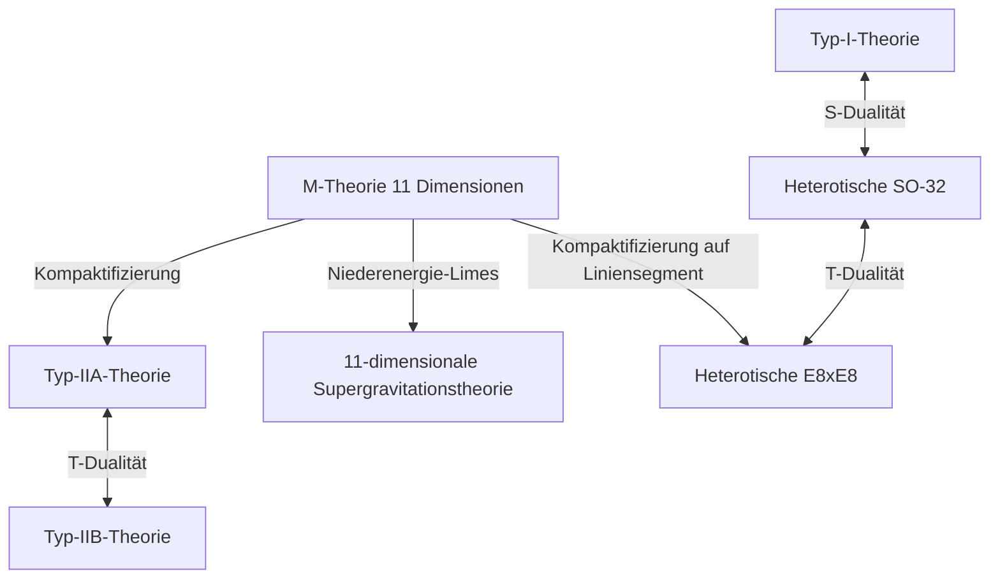

# Einleitung: Die Herausforderung des ultimativen Traums der Physik, der „Theorie von Allem (TOE)“

Eines der ehrgeizigsten Ziele der modernen Physik ist die Konstruktion einer „Theorie von Allem (Theory of Everything: TOE)“, die die vier in der Natur existierenden fundamentalen Kräfte – Gravitation, Elektromagnetismus, schwache Kernkraft und starke Kernkraft – einheitlich beschreibt. Das Standardmodell (Standard Model) beschreibt drei dieser Kräfte (Elektromagnetismus, schwache und starke Kernkraft) sowie die damit verbundenen Elementarteilchen mit extrem hoher Präzision. Wenn man jedoch versucht, die durch Einsteins Allgemeine Relativitätstheorie beschriebene „Gravitation“ in den Rahmen der Quantenmechanik zu integrieren, entstehen unendliche Schwierigkeiten (Nicht-Renormierbarkeit) und es kommt zu einem fatalen Zusammenbruch.

Als einzig vielversprechender Kandidat zur Lösung dieses tiefliegenden Widerspruchs steht die „Superstringtheorie (Superstring Theory)“ im Mittelpunkt der Aufmerksamkeit. In diesem Artikel werden wir das gewaltige Gesamtbild der Superstringtheorie umfassend erläutern, beginnend mit dem Paradigmenwechsel, die kleinste Einheit der Materie nicht als „Punkt“, sondern als „eindimensionalen Faden (String)“ zu betrachten, über die Kompaktifizierung von Extradimensionen, die Mathematik der Calabi-Yau-Mannigfaltigkeiten, die ultimative Integration durch die M-Theorie bis hin zu den neuesten Herausforderungen bei der Überprüfung.

---

## Kapitel 1: Das Scheitern von Punktteilchen und die Einführung von Strings

### Unendliche Schwierigkeiten in der Quantenfeldtheorie und die Nicht-Renormierbarkeit der Gravitation

In der herkömmlichen Quantenfeldtheorie (Quantum Field Theory: QFT), die Elementarteilchen als „Punkte (Points)“ ohne Volumen behandelt, bestand immer das Problem, dass die Wechselwirkungsenergie ins Unendliche divergiert, wenn sich Teilchen in einem Grenzwert nähern, bei dem die Entfernung gegen Null geht. Für Elektromagnetismus, starke und schwache Kernkräfte war es möglich, diese Unendlichkeiten aufzuheben und endliche, physikalisch sinnvolle Vorhersagen durch eine mathematische Methode namens „Renormierungstheorie (Renormalization)“ abzuleiten, die von Shin'ichiro Tomonaga, Richard Feynman, Julian Schwinger und anderen etabliert wurde.

Wenn man jedoch das unbekannte Elementarteilchen, das die Gravitation vermittelt, das „Graviton“, einführt und versucht, die Allgemeine Relativitätstheorie zu quantisieren (Aufbau einer Quantengravitationstheorie), funktioniert diese Renormierungsmethode überhaupt nicht mehr. Da die Kopplungskonstante der Gravitation (Newton-Konstante) die Dimension von Energie hat, entstehen unendlich viele neue Divergenzen, je mehr Feynman-Diagramme mit Schleifen höherer Ordnung man berechnet, was unendlich viele Parameter erfordern würde, um sie alle aufzuheben. Dies wird als „Nicht-Renormierbarkeit der Gravitation“ bezeichnet.

### Das Duale Resonanzmodell von Yoichiro Nambu, Tetsuo Goto et al. und eindimensionale Strings

Die Geschichte der Superstringtheorie begann in einem Bereich, der völlig unabhängig von der Gravitation war. 1968 entdeckte Gabriele Veneziano, dass sich die Streuamplitude (Streuwahrscheinlichkeit) stark wechselwirkender Hadronen mit Hilfe der Eulerschen Betafunktion aus der Mathematik überraschend gut beschreiben lässt (Veneziano-Amplitude).

Es waren Yoichiro Nambu, Tetsuo Goto sowie Holger Nielsen und Leonard Susskind, die die physikalische Bedeutung dieser Formel entdeckten. 1970 zeigten sie, dass sich die Veneziano-Amplitude auf natürliche Weise ableiten lässt, wenn man annimmt: „Hadronen sind keine Punktteilchen, sondern vibrierende Objekte, vergleichbar mit eindimensionalen Gummibändern von endlicher Länge“ (Duales Resonanzmodell).

Die grundlegendste Wirkung zur Beschreibung der Bewegung dieses „Strings (Fadens)“ ist die Nambu-Goto-Wirkung (Nambu-Goto Action). Während ein Punkt, der sich durch die Raumzeit bewegt, eine Linie (Weltlinie) zeichnet, zeichnet ein eindimensionaler String eine zweidimensionale Fläche (Weltfläche: Worldsheet). Die Nambu-Goto-Wirkung ist als eine Größe definiert, die proportional zum Flächeninhalt dieser Weltfläche ist.

$$ S = -T \int d\tau d\sigma \sqrt{- \det(\gamma_{ab})} $$

Hierbei ist $T$ die Spannung (Tension) des Strings und $\gamma_{ab}$ die induzierte Metrik auf der Weltfläche. Diese Wirkung ist geometrisch sehr elegant, aber bei der Quantisierung bereitet die Handhabung der Quadratwurzel mathematische Schwierigkeiten.

### Polyakov-Wirkung (Polyakov Action) und konforme Invarianz

Daher führte Alexander Polyakov eine unabhängige Weltflächenmetrik $h_{ab}$ als Hilfsfeld ein und schlug die „Polyakov-Wirkung“ vor, eine leichter handhabbare Wirkung, die der Nambu-Goto-Wirkung äquivalent ist, aber keine Quadratwurzel enthält.

$$ S = -\frac{T}{2} \int d^2\sigma \sqrt{-h} h^{ab} \partial_a X^\mu \partial_b X^\nu \eta_{\mu\nu} $$

Die Polyakov-Wirkung besitzt neben der Reparametrisierungsinvarianz (Diffeomorphism invariance) auch die Eigenschaft, unter lokalen Skalentransformationen invariant zu sein, die sogenannte „Weyl-Invarianz (Weyl invariance)“, also konforme Symmetrie. Diese Eigenschaft als zweidimensionale konforme Feldtheorie (CFT) wird das mächtige mathematische Fundament der Stringtheorie bilden.

---

## Kapitel 2: Offene und geschlossene Strings, Supersymmetrie

### Elementarteilchen als Schwingungsmoden von Strings

Die revolutionärste Idee der Stringtheorie ist das Konzept, dass „die unzähligen im Universum existierenden Elementarteilchen nichts anderes als verschiedene Schwingungsmoden (Obertöne) eines einzigen Strings sind“. So wie eine Geigensaite durch verschiedene Spielweisen unterschiedliche Klangfarben (Frequenzen) erzeugt, so manifestieren sich winzige Strings durch unterschiedliche Schwingungszustände für uns als Elementarteilchen mit jeweils unterschiedlicher Masse und unterschiedlichem Spin.

Es gibt zwei Arten von Strings: „offene Strings (Open strings)“, die Enden haben, und „geschlossene Strings (Closed strings)“, deren Enden zu einem Ring verbunden sind.

### Durch offene Strings erzeugte Eichbosonen und durch geschlossene Strings erzeugte Gravitonen

**Offener String (Open String):**
Die beiden Enden eines offenen Strings können sich nicht frei im Raum bewegen, sondern sind auf einer Membran fixiert, die als D-Brane bezeichnet und später erläutert wird. Wenn man den Grundzustand (den Schwingungsmodus mit der geringsten Energie) eines offenen Strings analysiert, tritt ein Vektorteilchen mit der Masse Null und dem Spin 1 auf. Dies ist genau ein „Eichboson“ wie das Photon, das den Elektromagnetismus vermittelt, oder das Gluon, das die starke Kernkraft vermittelt.

**Geschlossener String (Closed String):**
Andererseits haben geschlossene Strings keine Enden und können sich daher frei durch die Raumzeit ausbreiten, ohne an eine Brane gebunden zu sein. Wenn man die Schwingungsmoden eines geschlossenen Strings quantisiert und analysiert, entsteht erstaunlicherweise zwangsläufig ein Tensorteilchen mit der Masse Null und dem „Spin 2“. Dies ist ein Teilchen, das im Standardmodell nicht existiert und genau dieselben Eigenschaften besitzt wie das von der Allgemeinen Relativitätstheorie vorhergesagte Vermittlungsteilchen der Gravitation, das „Graviton“.

Die Stringtheorie war ursprünglich nicht darauf ausgelegt, die Gravitation einzubeziehen. Obwohl sie als Theorie der Hadronen begann, forderten ihre Gleichungen spontan die Existenz von Gravitonen. Durch diese Tatsache vollzog die Stringtheorie eine dramatische Transformation von einem bloßen Modell der starken Kernkraft zum aussichtsreichsten Kandidaten für eine „Theorie der Quantengravitation“ (vorgeschlagen 1974 von John Schwarz und Joël Scherk).

### Das Scheitern der bosonischen Stringtheorie (Auftreten von Tachyonen) und die Virasoro-Algebra

Die frühe Stringtheorie war eine „bosonische Stringtheorie“, die nur Bosonen (kraftvermittelnde Teilchen) beschrieb. Um die Schwingungen von Strings quantenmechanisch korrekt zu behandeln, muss sichergestellt sein, dass die konforme Invarianz während des Quantisierungsprozesses nicht gebrochen wird (keine Anomalien aufweist).

Die konforme Symmetrie auf der zweidimensionalen Weltfläche wird durch die „Virasoro-Algebra (Virasoro Algebra)“ beschrieben, eine unendlichdimensionale Lie-Algebra.
$$ [L_m, L_n] = (m - n)L_{m+n} + \frac{c}{12}m(m^2 - 1)\delta_{m+n, 0} $$
Hierbei wird $c$ als Zentralladung (central charge) bezeichnet. Es wurde bewiesen, dass die Dimension der Raumzeit $D$ erstaunlicherweise „26 Dimensionen (25 Raumdimensionen + 1 Zeitdimension)“ betragen muss, damit die bosonische Stringtheorie ohne mathematische Widersprüche (Auftreten von Geisterzuständen) gültig ist.

Ein noch schwerwiegenderes Problem war, dass der niedrigste Energiezustand der bosonischen Stringtheorie zu einem „Tachyon“ wird, dessen Masse eine imaginäre Zahl ist (Masse im Quadrat ist negativ). Ein Vakuum, in dem Tachyonen existieren, ist instabil, was bedeutet, dass die Theorie die physikalische Realität nicht beschreiben kann.

### Die Einführung von Supersymmetrie (Supersymmetry) und Superstringtheorie (10 Dimensionen)

Um das Tachyon-Problem und den Mangel zu beheben, dass Fermionen (wie Elektronen und Quarks), aus denen Materie besteht, nicht in der Theorie enthalten waren, wurde die „Supersymmetrie (Supersymmetry: SUSY)“ eingeführt. Supersymmetrie ist eine Symmetrie, die Bosonen (Teilchen mit ganzzahligem Spin) und Fermionen (Teilchen mit halbzahligem Spin) austauscht.

In der „Superstringtheorie (Superstring Theory)“, bei der Supersymmetrie auf der Weltfläche des Strings eingeführt wurde, konnte durch eine mathematische Operation namens GSO-Projektion (Gliozzi-Scherk-Olive projection) gezeigt werden, dass Tachyonen elegant aus dem Spektrum eliminiert werden und gleichzeitig die Supersymmetrie der Raumzeit realisiert wird.

Die Anzahl der Raumzeitdimensionen, bei der konforme Anomalien in dieser Superstringtheorie aufgehoben werden und die mathematisch konsistent ist, beträgt „10 Dimensionen (9 Raumdimensionen + 1 Zeitdimension)“. Obwohl dies stark von der 4-dimensionalen Raumzeit (3 Raumdimensionen + 1 Zeitdimension), in der wir leben, abweicht, wurde die Dimensionsanzahl von 26 auf 10 drastisch reduziert, was ein Moment war, in dem man der realen Physik einen Schritt näher kam.

---

## Kapitel 3: Die Erste Superstring-Revolution

Von den späten 1970er bis zu den frühen 1980er Jahren wurde die Superstringtheorie, mit Ausnahme einiger enthusiastischer Forscher, von der Physik-Gemeinschaft halb aufgegeben. Man glaubte, dass mathematische Widersprüche, sogenannte Quantenanomalien (Anomalien), unvermeidlich auftreten würden, wenn man Eichtheorien und Gravitation kombiniert.

### 1984: Die wundersame Anomalie-Aufhebung durch Green und Schwarz

Im Sommer 1984 vollbrachten Michael Green und John Schwarz eine historische Berechnung. Sie bewiesen, dass sich in einer 10-dimensionalen Superstringtheorie, die bestimmte Bedingungen erfüllt, Eichanomalien und Gravitationsanomalien auf der Ebene der hexagonalen (Sechseck) Feynman-Diagramme perfekt gegenseitig aufheben und exakt Null ergeben.

Es stellte sich heraus, dass für dieses wundersame Aufheben die Eichgruppe hinter der Theorie eine spezifische, riesige Symmetriegruppe sein musste. Es gab nur zwei davon: **$SO(32)$** (spezielle orthogonale Gruppe in 32 Dimensionen) und **$E_8 \times E_8$** (das direkte Produkt der exzeptionellen Gruppe E8).

Diese Entdeckung versetzte der Physik-Gemeinschaft einen gewaltigen Schock und löste einen explosiven Forschungsboom aus, der als „Erste Superstring-Revolution“ bezeichnet wird. Der Weg zu einer Theorie von Allem wurde plötzlich klar eröffnet.

### 5 konsistente Superstringtheorien

Nach der Entdeckung von Green und Schwarz beschleunigte sich die Forschung rasant, und es wurde schließlich klar, dass konsistente Superstringtheorien in 10 Dimensionen in die folgenden „5 Typen“ klassifiziert werden können.

1. **Typ-I-Theorie**: Enthält sowohl offene als auch geschlossene Strings. Die Supersymmetrie ist $N=1$. Die Eichgruppe ist $SO(32)$.
2. **Typ-IIA-Theorie**: Nur geschlossene Strings. Die Supersymmetrie ist $N=2$ und nicht-chiral (erhält die Paritätssymmetrie).
3. **Typ-IIB-Theorie**: Nur geschlossene Strings. Die Supersymmetrie ist $N=2$ und chiral (bricht die Parität; nah an der Natur der realen schwachen Wechselwirkung).
4. **Heterotische (Heterotic) $SO(32)$ Theorie**: Nur geschlossene Strings. Eine unkonventionelle, aber schöne Theorie, die rechtslaufende Schwingungen (10-dimensionale Superstrings) und linkslaufende Schwingungen (26-dimensionale bosonische Strings) hybridisiert. Die Eichgruppe ist $SO(32)$.
5. **Heterotische (Heterotic) $E_8 \times E_8$ Theorie**: Ähnliche Hybridstruktur. Die Eichgruppe ist $E_8 \times E_8$. Da sie die Symmetrien des realen Standardmodells ($SU(3) \times SU(2) \times U(1)$) natürlich einschließen kann, galt sie eine Zeit lang als die vielversprechendste.

Jede dieser 5 Theorien besaß eine perfekte mathematische Konsistenz. Ausgehend von der Philosophie, dass „es nur eine einzige Theorie von Allem geben sollte“, wurde die Existenz von gleich 5 Kandidaten für die damaligen Physiker zu einem großen Rätsel.

---

## Kapitel 4: Kompaktifizierung der Extradimensionen und Calabi-Yau-Mannigfaltigkeiten

Die von der Superstringtheorie geforderte „10-dimensionale“ Raumzeit widerspricht offensichtlich den „3 Raumdimensionen + 1 Zeitdimension (insgesamt 4 Dimensionen)“, die wir im Alltag wahrnehmen. Wo um alles in der Welt verstecken sich die verbleibenden 6 Raumdimensionen (Extradimensionen: Extra Dimensions)?

### Die Genealogie aus der Kaluza-Klein-Theorie

Das Konzept der Extradimensionen selbst ist viel älter als die Stringtheorie und geht auf Theodor Kaluza und Oskar Klein in den 1920er Jahren zurück. Sie erweiterten die Allgemeine Relativitätstheorie auf 5 Dimensionen (4 Raumdimensionen + 1 Zeitdimension) und indem sie die 4. Raumdimension auf die Größe eines extrem kleinen Kreises aufrollten (kompaktifizierten), gelang es ihnen, Gravitation und Elektromagnetismus in 4 Dimensionen einheitlich abzuleiten. Die geometrische Struktur der Extradimension manifestiert sich in der niedrigenergetischen Welt als „Kraft (Eichfeld)“.

### Ricci-flache Kähler-Mannigfaltigkeiten: Calabi-Yau-Räume

Um eine realistische 4-dimensionale Physik aus der 10-dimensionalen Superstringtheorie abzuleiten, ist eine „Kompaktifizierung (Compactification)“ erforderlich, bei der die 6 überschüssigen Dimensionen auf eine winzige Größe in der Größenordnung der Planck-Länge ($10^{-35}$ Meter) zusammengerollt werden. Man kann sie nicht einfach beliebig aufrollen, sondern muss strenge physikalische Einschränkungen erfüllen, um im 4-dimensionalen Raum mindestens eine $N=1$ Supersymmetrie zu bewahren (um das Hierarchieproblem zu lösen und Fermionen abzuleiten).

1985 bewiesen Philip Candelas, Gary Horowitz, Andrew Strominger und Edward Witten, dass dieser überschüssige 6-dimensionale Raum eine spezielle komplexe Mannigfaltigkeit sein muss, die bestimmte mathematische Bedingungen erfüllt.

Diese Bedingung lautet: Eine „Ricci-flache (Ricci-flat), kompakte Kähler-Mannigfaltigkeit (Kähler manifold)“. Dieser geometrische Raum wird „**Calabi-Yau-Mannigfaltigkeit (Calabi-Yau manifold)**“ genannt, da der Mathematiker Eugenio Calabi ihre Existenz vermutete und Shing-Tung Yau sie mathematisch bewies.

### Euler-Charakteristik und die Anzahl der Quark-Generationen

Die extrem schwer verständliche und komplexe Struktur der „Löcher“ und der „Topologie“ der Calabi-Yau-Räume bestimmt vollständig die Eigenschaften der Elementarteilchen in der 4-dimensionalen Welt, in der wir leben.

Zum Beispiel wurde gezeigt, dass der absolute Wert der Hälfte der „Euler-Charakteristik (Euler characteristic)“, einer Invariante, die die Topologie der Mannigfaltigkeit charakterisiert, mit der „Anzahl der Elementarteilchen-Generationen“ übereinstimmt, die in der realen Welt auftreten. Da im Standardmodell 3 Generationen von Quarks und Leptonen (Up/Down, Charm/Strange, Top/Bottom) existieren, wurde die Suche nach Calabi-Yau-Räumen mit einer Euler-Charakteristik von $\pm 6$ zum wichtigsten Thema in der Phänomenologie der Stringtheorie.

### Das Wunder der Spiegelsymmetrie (Mirror Symmetry)

Die Erforschung der Calabi-Yau-Mannigfaltigkeiten brachte auch in der reinen Mathematik dramatische Durchbrüche. Physiker entdeckten, dass zwei Calabi-Yau-Räume mit völlig unterschiedlichen Topologien (Spiegelpaare) in der Stringtheorie exakt identische physikalische Phänomene beschreiben. Dies ist die „Spiegelsymmetrie (Mirror Symmetry)“.

Ein Phänomen nach dem anderen trat auf, bei dem mathematisch extrem schwer zu berechnende Probleme für die eine Mannigfaltigkeit (z. B. Probleme der abzählenden Geometrie, um die Anzahl rationaler Kurven zu zählen) mithilfe der Spiegelsymmetrie in Integrationsprobleme der anderen Mannigfaltigkeit umgewandelt und so ganz einfach gelöst werden konnten, was die Mathematiker verblüffte. Die Stringtheorie ist nicht nur eine physikalische Theorie, sondern fungiert auch als „ultimativer Detektor“ zur Entdeckung unbekannter, tiefgründiger Mathematik.

---

## Kapitel 5: Die Zweite Superstring-Revolution und die M-Theorie

Bis Mitte der 1990er Jahre glaubte man, dass die 5 Superstringtheorien jeweils unabhängige, separate Theorien seien. 1995 änderte sich die Situation jedoch durch einen historischen Vortrag von Edward Witten auf der internationalen Strings-Konferenz an der University of Southern California drastisch. Es war der Beginn der „Zweiten Superstring-Revolution“.

### Das magische Wörterbuch der Dualität (Duality)

Witten demonstrierte brillant mithilfe des Konzepts der „Dualität (Duality)“, dass die 5 scheinbar völlig unterschiedlichen Superstringtheorien in Wirklichkeit nur verschiedene Facetten einer „einzigen ultimativen Theorie“ sind. Es gibt zwei primäre Dualitäten:

- **T-Dualität (Target-space Duality)**: Die erstaunliche Eigenschaft, dass, wenn der Radius der Raumkompaktifizierung $R$ ist, die Theorie mit Radius $R$ und die Theorie mit Radius $1/R$ physikalisch vollkommen äquivalent werden. Dadurch wurde gezeigt, dass die Typ-IIA-Theorie und die Typ-IIB-Theorie sowie die beiden heterotischen Theorien jeweils miteinander verbunden sind. Ein winziges Universum und ein riesiges Universum sind aus der Sicht der Stringtheorie ununterscheidbar.
- **S-Dualität (Strong-weak Duality)**: Die Beziehung, bei der, wenn die Kopplungskonstante der Wechselwirkung $g$ ist, eine Theorie mit großer Kopplungskonstante (starke Wechselwirkung) äquivalent zu einer schwachen Theorie mit der Kopplungskonstante $1/g$ wird. Dadurch wurden die Typ-I-Theorie und die Heterotische SO(32)-Theorie miteinander in Verbindung gebracht, was es ermöglichte, die Physik von nicht berechenbaren stark gekoppelten Regionen mithilfe von schwach gekoppelten Regionen einer anderen Theorie zu berechnen.

### Entdeckung der D-Branen (D-branes)

Gleichzeitig mit Wittens Ankündigung definierte Joseph Polchinski klar das Konzept der „**D-Branen (D-brane)**“ und bewies dessen Bedeutung in der Stringtheorie. Eine D-Brane ist ein Objekt wie eine „höherdimensionale Membran“, an der die Endpunkte offener Strings haften können (Das D leitet sich von Dirichlet-Randbedingungen ab).

D-Branen wurden zu unverzichtbaren Komponenten in der Stringtheorie, beispielsweise um den mikroskopischen Ursprung der Entropie Schwarzer Löcher zu klären (eine Errungenschaft von Strominger und Vafa im Jahr 1996). Die „Branenwelt-Hypothese“, die vorschlägt, dass unser Universum selbst eine riesige D3-Brane (eine 3-dimensionale räumliche Membran) sein könnte, stammt ebenfalls von hier ab.

### Die 11-dimensionale „M-Theorie“, die alles integriert

Nachdem Witten die 5 Superstringtheorien durch ein Netzwerk von Dualitäten integriert hatte, schlug er die „**M-Theorie (M-theory)**“ als eine noch höherstufige Theorie vor, die diese Theorien vereint.

Erstaunlicherweise ist die Raumzeit, in der sich die M-Theorie entfaltet, „11-dimensional (10 Raumdimensionen + 1 Zeitdimension)“. Wenn man den Grenzwert der Kopplungskonstante in der Typ-IIA-Theorie gegen unendlich nimmt, erscheint eine weitere, bisher unsichtbare Raumdimension (die 11. Dimension) als Kreis, und es stellte sich heraus, dass der eindimensionale „String“ tatsächlich eine aufgerollte zweidimensionale „Membran (Membrane)“ war.

Was das „M“ in der M-Theorie bedeutet (Membrane, Magic, Mystery, Matrix, Mother etc.), wurde von Witten selbst absichtlich vage gehalten. Bis heute ist keine vollständige mathematische Formulierung (Grundgleichungen) der M-Theorie gefunden worden, und sie bleibt eines der größten ungelösten Probleme der modernen Physik. Jedoch werden ihre fragmentarischen Eigenschaften allmählich durch Dinge wie das holografische Prinzip (AdS/CFT-Korrespondenz) geklärt.

*(Anmerkung: Diagramm zur Vereinheitlichung der 5 Superstringtheorien, verbunden durch Dualitäten mit der M-Theorie im Zentrum)*

---

## Kapitel 6: Die String-Landschaft und die Herausforderung der Überprüfung

Die Superstringtheorie herrscht schon lange als aussichtsreichster Kandidat für eine Theorie von Allem, aber solange es Physik ist, ist eine Überprüfung durch Experimente und Beobachtungen unerlässlich. Hier steht man jedoch vor einer gigantischen Mauer.

### $10^{500}$ Vakua: Die String-Landschaft und das anthropische Prinzip

Es gibt unzählige Kombinationen von Topologien der Calabi-Yau-Mannigfaltigkeiten, Konfigurationen von D-Branen und Flüssen (ähnlich magnetischen Feldlinien), die sich um die Mannigfaltigkeiten wickeln. Berechnungen aus den frühen 2000er Jahren zeigten, dass die Anzahl der stabilen und metastabilen Vakua (Kandidaten für Universumsmuster), die von der Stringtheorie zugelassen werden, schockierende **$10^{500}$** Typen überschreitet (KKLT-Szenario etc.).

Dies wird die „**String-Landschaft (String Landscape)**“ genannt. Die Stringtheorie war keine Theorie, die die Gesetze unseres Universums eindeutig bestimmt, sondern ein Rahmenwerk, das unzählige Universen (Multiversum) mit allen denkbaren Gesetzen hervorbringt.

Diese Tatsache löste in der Physik-Gemeinschaft eine ernsthafte Debatte aus. Auf die Frage: „Warum hat unser Universum seine derzeitigen Gesetze (wie den winzigen Wert der kosmologischen Konstanten oder die feine Abstimmung der Teilchenmassen)?“ war man gezwungen, das „anthropische Prinzip (Anthropic Principle)“ einzuführen, welches besagt: „Da unzählige Universen existieren, ist es unvermeidlich, dass wir dasjenige Universum beobachten, das eine Umgebung bietet, in der intelligentes Leben wie wir existieren kann.“ Leonard Susskind und andere unterstützen dies nachdrücklich, aber viele Physiker wehren sich heftig dagegen, da es nicht falsifizierbar ist.

### Die Swampland-Vermutung (Swampland Conjecture)

In den letzten Jahren hat ein neuer Ansatz zur Landschaft rasch an Aufmerksamkeit gewonnen: die „**Swampland-Vermutung (Swampland: Sumpfland)**“, die von Cumrun Vafa und anderen vorgeschlagen wurde.

Die Menge der Modelle, die, obwohl sie als effektive Feldtheorien (niederenergetische physikalische Modelle) auf den ersten Blick konsistent erscheinen mögen, nicht konsistent in eine Theorie der Quantengravitation (Stringtheorie) eingebettet werden können, wird Swampland genannt. Vafa und Kollegen schlagen nacheinander starke Kriterien (Swampland-Bedingungen) vor, wie etwa: „Die Gravitation muss immer die schwächste Kraft sein (Weak Gravity Conjecture)“ oder „Es gibt strenge Beschränkungen für die beschleunigte Expansion des Universums durch dunkle Energie (de Sitter Conjecture)“.

Dadurch erhofft man sich, aus der gewaltigen Landschaft, von der man sagte, sie umfasse $10^{500}$ Möglichkeiten, die Bedingungen für das real beobachtbare Universum streng einzugrenzen.

### Die endlose Herausforderung der experimentellen Überprüfung

Ein direkter Beweis der Stringtheorie würde die Planck-Energieskala erfordern (eine Anlage von der Größe einer Galaxie für einen gigantischen Teilchenbeschleuniger), was praktisch unmöglich ist. Es wird jedoch immer noch ernsthaft nach indirekten Überprüfungsmethoden gesucht.

1. **Beobachtung primordialer Gravitationswellen:**
   Pläne zur Beobachtung der Spuren, die „primordiale Gravitationswellen“, die während der Inflationsphase des Universums erzeugt wurden, in der Polarisation (B-Moden) der kosmischen Mikrowellenhintergrundstrahlung (CMB) hinterlassen (z.B. der LiteBIRD-Satellit). Dies könnte es ermöglichen, für die Stringtheorie spezifische Inflationsmodelle zu überprüfen.
2. **Hochenergetische kosmische Strahlung und winzige Schwarze Löcher:**
   Man erwartete am Large Hadron Collider (LHC) am CERN Beobachtungen wie die Erzeugung von „Mini-Schwarzen-Löchern“, die auf die Existenz von Extradimensionen hinweisen, oder einen Energieverlust (fehlende Energie) durch Gravitonen, die in Extradimensionen entweichen. Bislang wurden keine eindeutigen Beweise gefunden, was dem Volumen der Extradimensionen strenge Obergrenzen auferlegt.
3. **Kosmische Strings (Cosmic String):**
   Die Möglichkeit, riesige, makroskopische Strings (kosmische Strings), die in den Phasenübergängen des frühen Universums gebildet wurden, als Gravitationslinseneffekte oder Bursts von Gravitationswellen zu beobachten.

## Fazit: Eine endlose Reise zur ultimativen Wahrheit

Die Superstringtheorie ist zweifellos die großartigste und mathematisch schönste Kristallisation des Wissens, die die Menschheit erreicht hat. Der konzeptionelle Sprung von Punktteilchen zu Strings und von Extradimensionen zu Membranen (M-Theorie) konfrontiert uns sogar mit der Möglichkeit, dass Raum und Zeit selbst nicht fundamental sind, sondern eine aus tieferdimensionaler Geometrie emergierende „Illusion“.

Aufgrund des Mangels an direkten experimentellen Beweisen ist es wahr, dass es scharfe Kritik gibt, wie etwa: „Die Stringtheorie ist keine Physik, sondern nur Mathematik oder Philosophie.“ Durch Hinweise zur Lösung des Informationsparadoxons Schwarzer Löcher oder die Bereitstellung völlig neuer Berechnungsmethoden für stark gekoppelte Festkörperphysik (wie Supraleitung) über die AdS/CFT-Korrespondenz, hat die Stringtheorie jedoch bereits in weiten Bereichen der theoretischen Physik tiefe Wurzeln als unverzichtbare Sprache geschlagen.

Wir haben die wahren Gleichungen der M-Theorie noch nicht in Händen. Physiker setzen ihre endlose Herausforderung auch heute fort, in der Hoffnung auf den Tag, an dem das gesamte Bild enthüllt wird: Welche Form haben die 6 Extradimensionen, die in der Dunkelheit der Calabi-Yau-Räume lauern, und wo in der Landschaft der $10^{500}$ Möglichkeiten befindet sich unser Universum?

---

## Anhang: Der fortgeschrittene mathematische Hintergrund der Superstringtheorie

Während wir im Hauptteil einem intuitiven Verständnis den Vorrang gaben, werden wir hier auf einer tieferen Ebene die mathematischen Formeln und geometrischen Strukturen detailliert beschreiben, die das solide Fundament der Superstringtheorie bilden.

### A. Vollständige Formulierung der Polyakov-Wirkung und der 2-dimensionalen Konformen Feldtheorie (CFT)

Die Polyakov-Wirkung, die die Dynamik auf der Weltfläche (Worldsheet) beschreibt, der Bahn, auf der sich der String durch die Raumzeit bewegt, ist wie folgt gegeben:

$$ S_P = -\frac{T}{2} \int d^2\sigma \sqrt{-h} h^{\alpha\beta} \partial_\alpha X^\mu \partial_\beta X^\nu \eta_{\mu\nu} $$

Hierbei ist $X^\mu(\tau, \sigma)$ eine Abbildung von den Weltflächenkoordinaten $(\tau, \sigma)$ auf die Zielraumzeit (d.h. die Koordinaten des Strings in der Raumzeit). Die wichtigste Eigenschaft dieser Wirkung ist, dass sie die folgenden 3 lokalen Symmetrien besitzt:
1. **2-dimensionale Reparametrisierungsinvarianz (Diffeomorphism invariance):** Invariant unter Koordinatentransformationen auf der Weltfläche $\sigma^\alpha \to \sigma^{\prime\alpha}(\sigma)$.
2. **2-dimensionale Poincaré-Invarianz:** Invariant unter Translationen und Lorentz-Transformationen in der Zielraumzeit.
3. **Weyl-Invarianz (Weyl invariance):** Invariant unter lokalen Skalentransformationen des metrischen Tensors $h_{\alpha\beta}(\sigma) \to e^{2\omega(\sigma)}h_{\alpha\beta}(\sigma)$.

Klassisch bleibt die Weyl-Invarianz erhalten, aber wenn die Quantisierung mittels Pfadintegralen durchgeführt wird, entsteht eine „konforme Anomalie (Conformal Anomaly)“ aus der Funktionaldeterminante der Maßtransformation. Berechnet man die Bedingungen, um diese Anomalie aufzuheben und die Weyl-Invarianz auch auf Quantenebene zu bewahren, so müssen sich die Beiträge von Geisterfeldern (Faddeev-Popov-Geister) und von Materiefeldern ($X^\mu$) gegenseitig aufheben. Dies ist exakt der mathematische Antrieb, der $D=26$ für den bosonischen String und $D=10$ für den Superstring erfordert.

### B. Mathematik der Calabi-Yau-Mannigfaltigkeiten und Ricci-Flachheit

Als Kompaktifizierungsbedingung, um eine effektive 4-dimensionale Theorie aus der 10-dimensionalen Superstringtheorie abzuleiten, muss Supersymmetrie auf dem überschüssigen 6-dimensionalen Raum $K$ erhalten bleiben (das Spinorfeld muss kovariant konstant sein). Das heißt, die Differentialgleichung $\nabla_m \eta = 0$ (wobei $\eta$ ein intrinsischer Spinor ist) muss erfüllt sein.

Um diese Bedingung zu erfüllen, muss die Holonomiegruppe des Raums $K$ in $SU(3)$ enthalten sein, was geometrisch äquivalent zu den folgenden Bedingungen ist:
1. $K$ ist eine Kähler-Mannigfaltigkeit (Kähler manifold). Das heißt, sie besitzt eine geschlossene, nicht-entartete 2-Form (Kähler-Form $J$).
2. Die erste Chern-Klasse $c_1(K)$ von $K$ ist Null.

Nach dem Satz von Yau (dem Beweis der Calabi-Vermutung) gibt es auf einer kompakten Kähler-Mannigfaltigkeit, die $c_1(K)=0$ erfüllt, immer eine eindeutige „Ricci-flache Kähler-Metrik“, bei der der Ricci-Tensor $R_{mn}$ Null ist. Dies ist eine Calabi-Yau-Mannigfaltigkeit.

Die Geometrie von Calabi-Yau-Mannigfaltigkeiten wird durch die Dimension (Hodge-Zahlen $h^{p,q}$) ihrer Kohomologiegruppen $H^{p,q}(K)$ charakterisiert. Insbesondere die beiden Hodge-Zahlen $h^{2,1}$ und $h^{1,1}$ sind extrem wichtig.
- $h^{1,1}$ entspricht der Anzahl der Deformationsgrade (Moduli) der Kähler-Struktur (Parameter für „Größe“ und „Form“ der Mannigfaltigkeit).
- $h^{2,1}$ entspricht der Anzahl der Deformationsgrade der komplexen Struktur.

Physikalisch ist der Wert der Euler-Charakteristik $\chi = 2(h^{1,1} - h^{2,1})$ direkt mit der Differenz der Generationenzahlen chiraler Fermionen (Quarks und Leptonen) in der 4-dimensionalen Welt verknüpft. Um beispielsweise die „3 Generationen“ des Standardmodells abzuleiten, ist es notwendig, eine Calabi-Yau-Mannigfaltigkeit mit $\chi = \pm 6$ zu finden, und solche Räume wurden unter Verwendung von Methoden wie Z3-Orbifolds konstruiert.

### C. AdS/CFT-Korrespondenz: Die ultimative Verkörperung des holografischen Prinzips

Das größte Nebenprodukt, das aus der Erforschung der M-Theorie und von D-Branen hervorging, ist die „AdS/CFT-Korrespondenz (Anti-de Sitter/Conformal Field Theory correspondence)“, die 1997 von Juan Maldacena vorgeschlagen wurde.

Es handelt sich um eine erstaunliche Vermutung, dass „eine Gravitationstheorie (Superstringtheorie) im 5-dimensionalen Anti-de-Sitter-Raum (AdS-Raum)“ vollkommen äquivalent ist zu „einer konformen Feldtheorie (CFT: einer Eichtheorie ohne Gravitation), die auf dessen 4-dimensionalem Rand definiert ist“.

$$ Z_{\text{AdS}}[J] = \langle e^{\int \mathcal{O} J} \rangle_{\text{CFT}} $$

Diese Äquivalenz ist ein mathematisch rigoroses Realisierungsbeispiel des „holografischen Prinzips“, bei dem zwei Theorien in unterschiedlichen Dimensionen dieselbe Physik beschreiben. Da es möglich ist, unberechenbare stark gekoppelte Eichtheorien zu lösen, indem man sie in eine berechenbare schwach gekoppelte klassische Gravitation (mit der Allgemeinen Relativitätstheorie) übersetzt, generiert dies heutzutage extrem breite Anwendungen, nicht nur in der Teilchenphysik, sondern auch in der Festkörperphysik (wie Hochtemperatursupraleitung und Viskositätsberechnungen des Quark-Gluon-Plasmas) bis hin zur Quanteninformationstheorie. Dies war ein symbolischer Paradigmenwechsel, bei dem sich die Superstringtheorie von einer bloßen „Hypothese“ zu einem „nützlichen Werkzeug“ für die gesamte Physik entwickelte.
