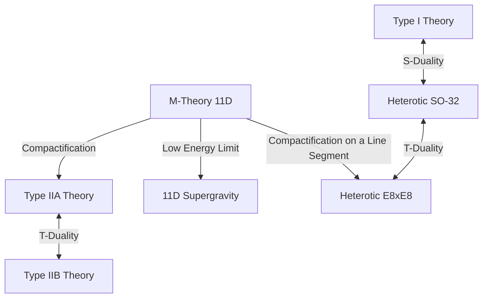

# Introduction: The Challenge Toward Physics' Ultimate Dream, the "Theory of Everything (TOE)"

One of the most ambitious goals of modern physics is the construction of a "Theory of Everything (TOE)" that uniformly describes the four fundamental forces existing in nature—gravity, the electromagnetic force, the weak force, and the strong force. The Standard Model has succeeded in describing three of these—the electromagnetic, weak, and strong forces—and their associated elementary particles with extremely high precision. However, when attempting to incorporate "gravity," described by Einstein's general theory of relativity, into the framework of quantum mechanics, insurmountable difficulties of infinities (non-renormalizability) arise, leading to a fatal breakdown.

As the sole promising candidate to resolve this deeply rooted contradiction, "Superstring Theory" has garnered attention. In this article, starting from the paradigm shift that regards the fundamental unit of matter not as a "point" but as a "1-dimensional string," we will thoroughly explain the grand overarching picture of superstring theory, covering the compactification of extra dimensions, the mathematics of Calabi-Yau manifolds, the ultimate integration via M-theory, and the latest challenges towards its verification.

---

## Chapter 1: Breakdown of Point Particles and the Introduction of Strings

### Infinite Difficulties in Quantum Field Theory and the Non-Renormalizability of Gravity

In conventional Quantum Field Theory (QFT), which treats elementary particles as volumeless "points," there has always been a persistent problem: when particles interact, the energy of the interaction diverges to infinity in the limit where the distance approaches zero. For the electromagnetic, strong, and weak forces, a mathematical technique called "Renormalization," established by Sin-Itiro Tomonaga, Richard Feynman, Julian Schwinger, and others, allowed physicists to cancel out these infinities and derive finite, physically meaningful predictions.

However, when attempting to quantize the general theory of relativity (building a quantum theory of gravity) by introducing an unknown elementary particle called the "graviton" that mediates gravity, this renormalization technique completely fails to function. Because the coupling constant of gravity (Newton's constant) has the dimension of energy, the more one calculates higher-order loop Feynman diagrams, the more new divergences infinitely arise, necessitating an infinite number of parameters to cancel them all out. This is called the "non-renormalizability of gravity."

### The Dual Resonance Model of Yoichiro Nambu, Hidehiko Goto, and 1-Dimensional Strings

The history of superstring theory began in a place completely unrelated to gravity. In 1968, Gabriele Veneziano discovered that the scattering amplitude (scattering probability) of strongly interacting hadrons could be described incredibly well using Euler's beta function in mathematics (the Veneziano amplitude).

It was Yoichiro Nambu, Hidehiko Goto, along with Holger Nielsen and Leonard Susskind, who found the physical meaning behind this formula. In 1970, they showed that if one assumes "hadrons are not point particles, but 1-dimensional rubber-band-like vibrating entities with finite length," the Veneziano amplitude is naturally derived (the Dual Resonance Model).

The most fundamental action for describing the motion of this "string" is the Nambu-Goto Action. While a point draws a line (worldline) as it moves through spacetime, a 1-dimensional string sweeps out a 2-dimensional surface (worldsheet). The Nambu-Goto action is defined as a quantity proportional to the area of this worldsheet.

$$ S = -T \int d\tau d\sigma \sqrt{- \det(\gamma_{ab})} $$

Here, $T$ is the string tension, and $\gamma_{ab}$ is the induced metric on the worldsheet. Although this action is geometrically very beautiful, handling the square root mathematically poses difficulties during quantization.

### Polyakov Action and Conformal Invariance

Therefore, Alexander Polyakov introduced an independent worldsheet metric $h_{ab}$ as an auxiliary field and proposed the "Polyakov action," which is equivalent to the Nambu-Goto action but is easier to handle because it does not contain a square root.

$$ S = -\frac{T}{2} \int d^2\sigma \sqrt{-h} h^{ab} \partial_a X^\mu \partial_b X^\nu \eta_{\mu\nu} $$

The Polyakov action has "Weyl invariance"—meaning it is invariant under local scale transformations—in addition to diffeomorphism invariance, endowing it with conformal symmetry. These properties as a 2-dimensional conformal field theory (CFT) would come to form the powerful mathematical foundation of string theory.

---

## Chapter 2: Open Strings, Closed Strings, and Supersymmetry

### Elementary Particles as Vibrational Modes of Strings

The most revolutionary idea of string theory is the concept that "the countless elementary particles existing in the universe are nothing more than different vibrational modes (harmonics) of a single string." Just as a violin string produces different tones (frequencies) depending on how it is played, the extremely small string takes on different vibrational states, appearing to our eyes as elementary particles with varying masses and spins.

There are two types of strings: "open strings," which have ends, and "closed strings," whose ends are connected to form a loop.

### Gauge Particles from Open Strings and Gravitons from Closed Strings

**Open String:**
The two ends of an open string cannot move freely through space but are fixed onto membranes called D-branes, which will be discussed later. When the ground state (the lowest energy vibrational mode) of an open string is analyzed, a massless vector particle with spin 1 emerges. This is exactly a "gauge boson," such as a photon that mediates the electromagnetic force or a gluon that mediates the strong force.

**Closed String:**
On the other hand, since a closed string has no ends, it can freely propagate through spacetime without being constrained by a brane. When the vibrational modes of a closed string are quantized and analyzed, surprisingly, a massless tensor particle with "spin 2" inevitably emerges. This particle does not exist in the Standard Model but possesses precisely the same properties as the "graviton," the mediating particle of gravity predicted by general relativity.

String theory was not originally designed to include gravity. Despite starting as a theory for hadrons, its mathematics spontaneously demanded the existence of the graviton. Due to this fact, string theory underwent a dramatic transformation from a mere model of the strong force to the most promising candidate for a "quantum theory of gravity" (a proposal made by John Schwarz and Joël Scherk in 1974).

### The Breakdown of Bosonic String Theory (Emergence of Tachyons) and the Virasoro Algebra

Early string theory was "bosonic string theory," describing only bosons (force-mediating particles). To correctly handle string vibrations in quantum mechanics, one must ensure that conformal invariance is not broken during the quantization process (i.e., there is no anomaly).

The conformal symmetry on the 2-dimensional worldsheet is described by the "Virasoro Algebra," an infinite-dimensional Lie algebra.
$$ [L_m, L_n] = (m - n)L_{m+n} + \frac{c}{12}m(m^2 - 1)\delta_{m+n, 0} $$
Here, $c$ is called the central charge. For bosonic string theory to hold without mathematical contradictions (the appearance of ghost states), it was proven that the spacetime dimension $D$ must astonishingly be "26 dimensions (25 spatial dimensions + 1 time dimension)."

Even more fatally, the lowest energy state of bosonic string theory becomes a "Tachyon," a particle whose mass is imaginary (mass squared is negative). The existence of a tachyon means the vacuum is unstable, and the theory cannot describe physical reality.

### The Introduction of Supersymmetry and Superstring Theory (10 Dimensions)

To resolve the tachyon problem and the defect that fermions (such as electrons and quarks), which make up matter, were not included in the theory, "Supersymmetry (SUSY)" was introduced. Supersymmetry is a symmetry that interchanges bosons (particles with integer spin) and fermions (particles with half-integer spin).

In "Superstring Theory," which introduces supersymmetry onto the worldsheet of the string, it was shown that performing a mathematical operation called the GSO projection (Gliozzi-Scherk-Olive projection) successfully eliminates the tachyon from the spectrum while simultaneously realizing spacetime supersymmetry.

In this superstring theory, the conformal anomaly is canceled out, and the number of spacetime dimensions required to be mathematically consistent is "10 dimensions (9 spatial dimensions + 1 time dimension)." Although significantly different from our 4-dimensional spacetime (3 spatial + 1 time), this was a moment where the dimensions were drastically reduced from 26 to 10, bringing the theory one step closer to actual physics.

---

## Chapter 3: The First Superstring Revolution

From the late 1970s to the early 1980s, superstring theory was largely abandoned by the physics community, except for a few enthusiastic researchers. This was because it was believed that mathematical contradictions, called quantum anomalies, would inevitably arise when combining gauge theory with gravity.

### 1984: The Miraculous Anomaly Cancellation by Green and Schwarz

In the summer of 1984, Michael Green and John Schwarz accomplished a historical calculation. They proved that in a 10-dimensional superstring theory meeting specific conditions, gauge anomalies and gravitational anomalies perfectly cancel each other out at the level of the Feynman hexagon diagrams, resulting exactly in zero.

For this miraculous cancellation to occur, it was discovered that the gauge group behind the theory must be a specific, massive symmetry group. There were only two possibilities: **$SO(32)$** (the 32-dimensional special orthogonal group) and **$E_8 \times E_8$** (the direct product of the exceptional group E8).

This discovery sent a tremendous shockwave through the physics community, igniting an explosive research boom known as the "First Superstring Revolution." The path toward a Theory of Everything had suddenly and clearly opened.

### The Five Consistent Superstring Theories

Following Green and Schwarz's discovery, research accelerated rapidly, ultimately revealing that consistent 10-dimensional superstring theories could be classified into the following "five types."

1. **Type I Theory**: Contains both open and closed strings. Supersymmetry is $N=1$. The gauge group is $SO(32)$.
2. **Type IIA Theory**: Closed strings only. Supersymmetry is $N=2$ and is non-chiral (preserves parity symmetry).
3. **Type IIB Theory**: Closed strings only. Supersymmetry is $N=2$ and is chiral (breaks parity; close to the nature of the actual weak interaction).
4. **Heterotic $SO(32)$ Theory**: Closed strings only. A bizarre yet beautiful theory that hybridizes right-moving vibrations (10-dimensional superstring) and left-moving vibrations (26-dimensional bosonic string). The gauge group is $SO(32)$.
5. **Heterotic $E_8 \times E_8$ Theory**: Has a similar hybrid structure. The gauge group is $E_8 \times E_8$. It was considered the most promising for a time because it could naturally incorporate the symmetries of the real Standard Model ($SU(3) \times SU(2) \times U(1)$).

Each of these five theories possessed mathematically perfect consistency. From the philosophical standpoint that "a Theory of Everything should be unique," the existence of five candidates became a major mystery for physicists at the time.

---

## Chapter 4: Compactification of Extra Dimensions and Calabi-Yau Manifolds

The "10 dimensions" of spacetime required by superstring theory evidently contradict the "3 spatial dimensions + 1 time dimension (totaling 4 dimensions)" that we perceive daily. Where could the remaining 6 spatial dimensions (Extra Dimensions) be hiding?

### Lineage from Kaluza-Klein Theory

The concept of extra dimensions is far older than string theory, dating back to Theodor Kaluza and Oskar Klein in the 1920s. They extended general relativity to 5 dimensions (4 spatial + 1 time) and successfully derived both gravity and electromagnetism uniformly in 4 dimensions by curling up (compactifying) the fourth spatial dimension into an extremely small circle. The geometric structure of the extra dimension manifests in the low-energy world as a "force (gauge field)."

### Ricci-flat Kähler Manifolds: Calabi-Yau Spaces

To extract realistic 4-dimensional physics from the 10-dimensional superstring theory, it is necessary to "compactify" the extra 6 dimensions by curling them up to microscopic sizes on the order of the Planck length ($10^{-35}$ meters). It is not enough to simply curl them up; they must satisfy the stringent physical constraint of leaving at least one $N=1$ supersymmetry in 4-dimensional space (to solve the hierarchy problem and derive fermions).

In 1985, Philip Candelas, Gary Horowitz, Andrew Strominger, and Edward Witten proved that these extra 6-dimensional spaces must be special complex manifolds satisfying specific mathematical conditions.

That condition is a "Ricci-flat compact Kähler manifold." Because mathematician Eugenio Calabi conjectured its existence, and Shing-Tung Yau mathematically proved it, this geometric space is known as a "**Calabi-Yau manifold**."

### Euler Characteristic and the Number of Quark Generations

The extremely difficult and complex "holes" and "topology" of Calabi-Yau spaces completely determine the properties of elementary particles in our 4-dimensional world.

For instance, it has been shown that half the absolute value of the "Euler characteristic," an invariant characterizing the manifold's topology, matches the "number of elementary particle generations" appearing in the real world. Because quarks and leptons exist in 3 generations (up/down, charm/strange, top/bottom) in the Standard Model, searching for a Calabi-Yau space with an Euler characteristic of $\pm 6$ became the most critical task in string theory phenomenology.

### The Marvel of Mirror Symmetry

Research on Calabi-Yau manifolds brought dramatic breakthroughs to pure mathematics as well. Physicists discovered that two Calabi-Yau spaces (a mirror pair) with completely different topologies describe exactly the same physical phenomena in string theory. This is "Mirror Symmetry."

Phenomena occurred one after another where a problem in one manifold that was mathematically extremely difficult to compute (such as counting the number of rational curves in enumerative geometry) could be easily solved by using mirror symmetry to transform it into an integration problem on the other manifold, astonishing mathematicians. String theory functions not only as a theory of physics but also as the "ultimate detector" for discovering unknown and profound mathematics.

---

## Chapter 5: The Second Superstring Revolution and M-Theory

Until the mid-1990s, the five superstring theories were considered distinct and independent theories. However, in 1995, a historic lecture given by Edward Witten at the Strings conference held at the University of Southern California drastically changed the situation. This was the dawn of the "Second Superstring Revolution."

### The Magic Dictionary called Duality

Using a concept called "Duality," Witten brilliantly proved that the seemingly completely different five superstring theories are actually just different facets of a "single ultimate theory." The main dualities include the following two:

- **T-Duality (Target-space Duality)**: Let the compactification radius of space be $R$. This is the astonishing property where a theory at radius $R$ and a theory at radius $1/R$ are physically completely equivalent. This demonstrated that the Type IIA and Type IIB theories, as well as the two Heterotic theories, are respectively connected. From the perspective of string theory, the infinitesimal universe and the gigantic universe are indistinguishable.
- **S-Duality (Strong-weak Duality)**: Let the coupling constant of the interaction be $g$. This is the relationship where a theory with a large coupling constant (strong interaction) is equivalent to a weak theory with a coupling constant $1/g$. This connected the Type I theory with the Heterotic SO(32) theory, making it possible to calculate the physics in an incalculable strong-coupling regime using the weak-coupling regime of another theory.

### The Discovery of D-branes

Around the same time as Witten's announcement, Joseph Polchinski clearly defined the concept of "**D-branes**" and proved their importance in string theory. A D-brane is an entity akin to a "higher-dimensional membrane" to which the endpoints of an open string can attach (the D comes from Dirichlet boundary conditions).

D-branes became indispensable components in string theory, such as in unraveling the microscopic origin of black hole entropy (an achievement by Strominger and Vafa in 1996). The "Braneworld hypothesis," which proposes the possibility that our universe itself is a gigantic D3-brane (a 3-dimensional spatial membrane), also stems from this.

### "M-Theory": The 11-Dimensional Theory that Unifies Everything

Witten, having unified the five superstring theories through a network of dualities, proposed "**M-theory**" as a higher-level theory that integrates them.

Surprisingly, the spacetime in which M-theory unfolds is "11 dimensions (10 spatial dimensions + 1 time dimension)." When the coupling constant in the Type IIA theory is taken to infinity in a limit operation, an unseen extra spatial dimension (the 11th dimension) emerges as a circle, revealing that the 1-dimensional "string" was actually a rolled-up 2-dimensional "membrane."

What the "M" in M-theory stands for (Membrane, Magic, Mystery, Matrix, Mother, etc.) has been intentionally left ambiguous by Witten himself. Even today, a complete mathematical formulation (fundamental equations) of M-theory has not been found, remaining one of the greatest unsolved problems in modern physics. However, through principles like the holographic principle (AdS/CFT correspondence), its fragmentary properties are gradually being elucidated.

*(Note: A unification diagram of the five superstring theories connected by dualities, centered on M-theory)*

---

## Chapter 6: The String Landscape and the Challenge of Verification

Superstring theory has reigned as the most promising candidate for the Theory of Everything for a long time, but since it is physics, verification through experiments and observations is essential. However, a massive wall stands in the way.

### 10^500 Vacua: The String Landscape and the Anthropic Principle

There are countless combinations of Calabi-Yau manifold topologies, D-brane arrangements, and fluxes (similar to magnetic field lines) wrapping around the manifolds. Calculations in the early 2000s revealed that the number of stable and metastable vacua (candidate universe patterns) allowed by string theory amounts to a staggering **$10^{500}$** or more (e.g., the KKLT scenario).

This is called the "**String Landscape**." String theory turned out not to be a theory that uniquely determines the laws of our universe, but a framework that gives rise to countless universes (multiverse) with every conceivable law.

This fact provoked serious debate within the physics community. In response to the question, "Why does our universe have its current laws (the minute value of the cosmological constant and the exquisite balance of elementary particle masses)?", physicists were forced to introduce the "Anthropic Principle," which argues, "Out of the countless universes that exist, it is inevitable that we observe a universe equipped with an environment where intelligent life like us can exist." Leonard Susskind and others strongly support this, but many physicists vehemently oppose it, citing its unfalsifiability.

### The Swampland Conjecture

In recent years, the "**Swampland** conjecture," advocated by Cumrun Vafa and others as a new approach to the landscape, has rapidly garnered attention.

The set of effective field theories (low-energy physical models) that appear consistent at first glance but cannot be consistently incorporated into a quantum theory of gravity (string theory) is called the swampland. Vafa and others have put forward strong criteria (swampland conditions) one after another, such as "gravity must always be the weakest force (Weak Gravity Conjecture)" and "there are severe constraints on the accelerating expansion of the universe due to dark energy (de Sitter Conjecture)."

This is expected to strictly narrow down the conditions for universes that can actually be observed from the massive landscape once said to contain $10^{500}$ possibilities.

### The Endless Challenge of Experimental Verification

Direct proof of string theory requires the Planck energy scale (which would require a massive particle accelerator the size of the Milky Way galaxy), making it practically impossible. However, indirect methods of verification are still being earnestly explored.

1. **Observation of Primordial Gravitational Waves:**
   Plans to observe the imprint (B-modes) that "primordial gravitational waves" generated during the cosmic inflation period left on the polarization of the Cosmic Microwave Background (CMB) (e.g., the LiteBIRD satellite). This has the potential to verify inflation models specific to string theory.
2. **Ultra-High-Energy Cosmic Rays and Microscopic Black Holes:**
   It was anticipated that the Large Hadron Collider (LHC) at CERN might observe the generation of "mini black holes," suggesting the existence of extra dimensions, or energy deficits (missing energy) caused by gravitons escaping into extra dimensions. At present, no clear evidence has been found, placing stringent upper limits on the size of extra dimensions.
3. **Cosmic Strings:**
   The possibility that gigantic, macro-scale strings (cosmic strings) formed during phase transitions in the early universe might be observed as gravitational lensing effects or bursts of gravitational waves.

## Conclusion: An Unending Journey Toward Ultimate Truth

Superstring theory is undeniably one of the grandest and mathematically most beautiful crystalline achievements of human intellect. The conceptual leap from point particles to strings, and from extra dimensions to membranes (M-theory), confronts us with the possibility that space and time themselves are not fundamental but are merely "illusions" emerging from the geometry of deeper dimensions.

Because it lacks direct experimental evidence, it is true that severe criticism exists, stating that "string theory is not physics, but merely mathematics or philosophy." However, by providing clues to solving the black hole information paradox and offering entirely new computational techniques for strongly coupled condensed matter physics (such as superconductivity) through the AdS/CFT correspondence, string theory has already deeply taken root as an indispensable language across broad areas of theoretical physics.

We do not yet possess the true equations of M-theory. The endless challenge of physicists continues today, aiming for the day when the full picture is unraveled: what shape the 6 extra dimensions hiding in the darkness of Calabi-Yau spaces take, and where our universe is located within the landscape of $10^{500}$ possibilities.

---

## Appendix: The Advanced Mathematical Foundation Supporting Superstring Theory

While the main text prioritized intuitive understanding, this appendix provides a more detailed explanation of the formulas and geometric structures that form the firm foundation of superstring theory.

### A. The Polyakov Action and the Complete Formulation of 2D Conformal Field Theory (CFT)

The Polyakov action, which describes the dynamics on the worldsheet—the trajectory of a string as it moves through spacetime—is given as follows:

$$ S_P = -\frac{T}{2} \int d^2\sigma \sqrt{-h} h^{\alpha\beta} \partial_\alpha X^\mu \partial_\beta X^\nu \eta_{\mu\nu} $$

Here, $X^\mu(\tau, \sigma)$ is a mapping from the worldsheet coordinates $(\tau, \sigma)$ to the target spacetime (i.e., the coordinates of the string in spacetime). The most important property of this action is that it possesses the following three local symmetries:
1. **2D Diffeomorphism Invariance:** Invariant under coordinate transformations on the worldsheet $\sigma^\alpha \to \sigma^{\prime\alpha}(\sigma)$.
2. **2D Poincaré Invariance:** Invariance under translations and Lorentz transformations in the target spacetime.
3. **Weyl Invariance:** Invariance under local scale transformations of the metric tensor $h_{\alpha\beta}(\sigma) \to e^{2\omega(\sigma)}h_{\alpha\beta}(\sigma)$.

Classically, Weyl invariance is preserved, but when quantizing using path integrals, a "Conformal Anomaly" arises from the transformation Jacobian of the measure. Calculating the conditions to cancel this anomaly and preserve Weyl invariance at the quantum level requires that the contribution from the ghost fields (Faddeev-Popov ghosts) and the contribution from the matter fields ($X^\mu$) cancel each other out. This is exactly the mathematical driving force demanding $D=26$ for the bosonic string and $D=10$ for the superstring.

### B. The Mathematics of Calabi-Yau Manifolds and Ricci-Flatness

As a compactification condition for deriving a 4-dimensional effective theory from a 10-dimensional superstring theory, it is necessary to leave supersymmetry unbroken on the extra 6-dimensional space $K$ (i.e., the spinor field must be covariantly constant). In other words, it must satisfy the differential equation $\nabla_m \eta = 0$ (where $\eta$ is the internal spinor).

For this condition to be met, the holonomy group of the space $K$ must be contained in $SU(3)$, which is geometrically equivalent to the following conditions:
1. $K$ is a Kähler manifold. That is, it possesses a closed, non-degenerate 2-form (Kähler form $J$).
2. The first Chern class $c_1(K)$ of $K$ is zero.

According to Yau's theorem (the proof of the Calabi conjecture), a compact Kähler manifold satisfying $c_1(K)=0$ is guaranteed to uniquely possess a "Ricci-flat Kähler metric" where the Ricci tensor $R_{mn}$ is zero. This is a Calabi-Yau manifold.

The geometry of a Calabi-Yau manifold is characterized by the dimensions of its cohomology groups $H^{p,q}(K)$ (the Hodge numbers $h^{p,q}$). In particular, the two Hodge numbers $h^{2,1}$ and $h^{1,1}$ are extremely important.
- $h^{1,1}$ corresponds to the number of deformations (moduli) of the Kähler structure (parameters for the "size" and "shape" of the manifold).
- $h^{2,1}$ corresponds to the number of deformations of the complex structure.

Physically, the value of the Euler characteristic $\chi = 2(h^{1,1} - h^{2,1})$ is directly linked to the difference in the number of generations of chiral fermions (quarks and leptons) in the 4-dimensional world. For example, to derive the "3 generations" of the Standard Model, it is necessary to find a Calabi-Yau manifold where $\chi = \pm 6$, and such spaces have been constructed using methods like Z3 orbifolds.

### C. AdS/CFT Correspondence: The Ultimate Embodiment of the Holographic Principle

The greatest byproduct derived from the study of M-theory and D-branes is the "AdS/CFT correspondence" (Anti-de Sitter/Conformal Field Theory correspondence), proposed by Juan Maldacena in 1997.

This is an astonishing conjecture stating that a "gravity theory (superstring theory) in a 5-dimensional Anti-de Sitter space (AdS space)" is completely equivalent to a "conformal field theory (CFT: a gauge theory without gravity) defined on its 4-dimensional boundary."

$$ Z_{\text{AdS}}[J] = \langle e^{\int \mathcal{O} J} \rangle_{\text{CFT}} $$

This equivalence stands as a mathematically rigorous realization of the "holographic principle," where two theories of different dimensions describe the same physics. Because it allows a strongly coupled gauge theory (which is incalculable) to be translated and solved as a weakly coupled classical gravity theory (calculable with general relativity), it is currently producing extremely broad applications—not only in particle physics but ranging from condensed matter physics (such as viscosity calculations of high-temperature superconductivity and quark-gluon plasmas) to quantum information theory. This was a symbolic paradigm shift where superstring theory evolved from a mere "hypothesis" to a "useful tool" for the entirety of physics.
