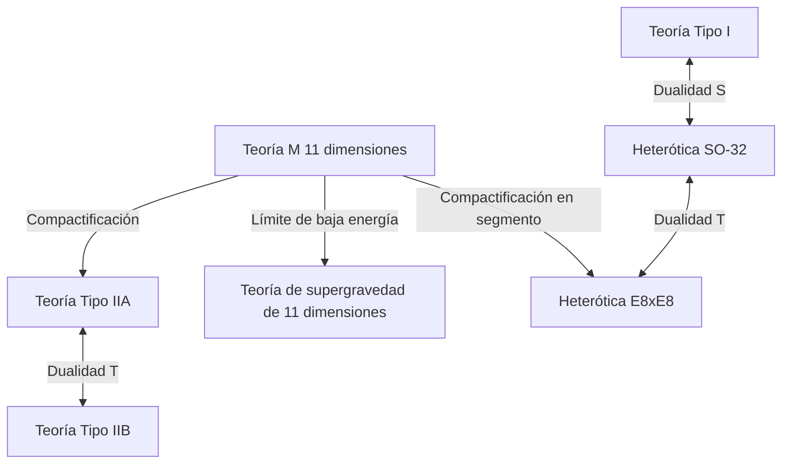

# Introducción: El desafío del sueño supremo de la física, la "Teoría del Todo (TOE)"

Uno de los objetivos más ambiciosos de la física moderna es la construcción de una "Teoría del Todo (Theory of Everything: TOE)" que describa de manera unificada las cuatro fuerzas fundamentales de la naturaleza: la gravedad, la fuerza electromagnética, la fuerza débil y la fuerza fuerte. El Modelo Estándar (Standard Model) ha logrado describir con altísima precisión tres de ellas: la electromagnética, la débil y la fuerte, junto con sus partículas elementales asociadas. Sin embargo, cuando se intenta incorporar la "gravedad", descrita por la teoría de la relatividad general de Einstein, al marco de la mecánica cuántica, surgen dificultades de infinitos (no renormalizabilidad) que conducen a un colapso fatal.

El "Teoría de supercuerdas (Superstring Theory)" ha captado la atención como el único candidato prometedor para resolver esta profunda contradicción. En este artículo, explicaremos exhaustivamente la visión grandiosa de la teoría de supercuerdas, comenzando por el cambio de paradigma de considerar la unidad mínima de la materia no como un "punto", sino como una "cuerda unidimensional", pasando por la compactificación de las dimensiones extra, las matemáticas de las variedades de Calabi-Yau, la unificación definitiva mediante la teoría M y el estado de los desafíos para su comprobación.

---

## Capítulo 1: El colapso de las partículas puntuales y la introducción de las cuerdas

### Las dificultades de los infinitos en la teoría cuántica de campos y la no renormalizabilidad de la gravedad

En la teoría cuántica de campos tradicional (Quantum Field Theory: QFT), que trata a las partículas elementales como "puntos" sin volumen, siempre ha existido el problema de que cuando las partículas interactúan, la energía de la interacción diverge a infinito en el límite cuando la distancia se acerca a cero. Para la fuerza electromagnética, la fuerza fuerte y la fuerza débil, mediante la técnica matemática llamada "Teoría de renormalización (Renormalization)" establecida por Shinichiro Tomonaga, Richard Feynman y Julian Schwinger, fue posible cancelar estos infinitos y extraer predicciones finitas con significado físico.

Sin embargo, cuando se intenta introducir una partícula elemental desconocida que media la gravedad, el "gravitón", y cuantizar la teoría de la relatividad general (construcción de una teoría de gravedad cuántica), este método de renormalización deja de funcionar por completo. Debido a que la constante de acoplamiento de la gravedad (constante de Newton) tiene dimensiones de energía, cuantos más diagramas de Feynman de bucles de orden superior se calculan, surgen infinitas nuevas divergencias, requiriendo un número infinito de parámetros para cancelarlas todas. A esto se le llama "no renormalizabilidad de la gravedad".

### El modelo de resonancia dual de Yoichiro Nambu, Hidehiko Goto y la cuerda unidimensional

La historia de la teoría de supercuerdas comenzó en un lugar totalmente ajeno a la gravedad. En 1968, Gabriele Veneziano descubrió que la amplitud de dispersión (probabilidad de dispersión) de los hadrones que interactúan fuertemente podía describirse de manera sorprendentemente perfecta utilizando la función beta de Euler (amplitud de Veneziano).

Fueron Yoichiro Nambu, Hidehiko Goto, y Holger Nielsen, Leonard Susskind, quienes encontraron el significado físico de esta fórmula. En 1970, demostraron que si se asume que "los hadrones no son partículas puntuales, sino osciladores como cuerdas elásticas unidimensionales de longitud finita", la amplitud de Veneziano se deriva naturalmente (modelo de resonancia dual).

La acción más fundamental para describir el movimiento de esta "cuerda" es la Acción de Nambu-Goto (Nambu-Goto Action). Mientras que un punto dibuja una línea (línea de mundo) al moverse por el espacio-tiempo, una cuerda unidimensional dibuja una superficie bidimensional (hoja de mundo: Worldsheet). La acción de Nambu-Goto se define como una cantidad proporcional al área de esta hoja de mundo.

$$ S = -T \int d\tau d\sigma \sqrt{- \det(\gamma_{ab})} $$

Aquí, $T$ es la tensión de la cuerda (Tension), y $\gamma_{ab}$ es la métrica inducida en la hoja de mundo. Esta acción es geométricamente muy bella, pero al cuantizarla, el manejo de la raíz cuadrada conlleva dificultades matemáticas.

### La Acción de Polyakov (Polyakov Action) y la invariancia conforme

Entonces, Alexander Polyakov introdujo una métrica independiente de la hoja de mundo $h_{ab}$ como un campo auxiliar, y propuso la "acción de Polyakov", una acción manejable que es equivalente a la acción de Nambu-Goto pero no incluye la raíz cuadrada.

$$ S = -\frac{T}{2} \int d^2\sigma \sqrt{-h} h^{ab} \partial_a X^\mu \partial_b X^\nu \eta_{\mu\nu} $$

La acción de Polyakov posee la simetría de "invariancia de Weyl (Weyl invariance)", es decir, invariancia ante transformaciones de escala locales, además de la invariancia ante reparametrizaciones (Diffeomorphism invariance). Esta propiedad como teoría de campos conforme (CFT) en 2 dimensiones formaría la poderosa base matemática de la teoría de cuerdas.

---

## Capítulo 2: Cuerdas abiertas y cerradas, supersimetría

### Las partículas elementales como modos de vibración de las cuerdas

La idea más revolucionaria de la teoría de cuerdas es el concepto de que "las innumerables partículas elementales que existen en el universo no son más que diferentes modos de vibración (armónicos) de una única cuerda". Al igual que las cuerdas de un violín producen diferentes tonos (frecuencias) según cómo se toquen, las cuerdas minúsculas adoptan diferentes estados vibratorios y aparecen ante nuestros ojos como partículas elementales con masas y espines diferentes.

Existen dos tipos de cuerdas: "cuerdas abiertas (Open string)" que tienen extremos, y "cuerdas cerradas (Closed string)" cuyos extremos están unidos formando un anillo.

### Las partículas de gauge producidas por cuerdas abiertas y los gravitones producidos por cuerdas cerradas

**Cuerdas abiertas (Open String):**
Los extremos de una cuerda abierta no pueden moverse libremente por el espacio, sino que están fijados sobre membranas llamadas D-branas, que se describirán más adelante. Al analizar el estado fundamental (el modo de vibración de menor energía) de una cuerda abierta, aparece una partícula vectorial de masa cero y espín 1. Esto es exactamente un "bosón de gauge", como el fotón que media la fuerza electromagnética o el gluón que media la fuerza fuerte.

**Cuerdas cerradas (Closed String):**
Por otro lado, como las cuerdas cerradas no tienen extremos, pueden propagarse libremente por el espacio-tiempo sin estar restringidas a las branas. Al cuantizar y analizar los modos de vibración de una cuerda cerrada, sorprendentemente aparece de manera inevitable una partícula tensorial de masa cero y "espín 2". Esta es una partícula que no existe en el Modelo Estándar y que tiene exactamente las mismas propiedades que la partícula mediadora de la gravedad predicha por la relatividad general, el "gravitón".

La teoría de cuerdas no fue diseñada desde el principio para incluir la gravedad. A pesar de haber comenzado como un modelo de la fuerza fuerte, sus fórmulas matemáticas exigían espontáneamente la existencia del gravitón. Por este hecho, la teoría de cuerdas experimentó una transformación dramática de ser un simple modelo de la fuerza fuerte a convertirse en el candidato más destacado para la "teoría de la gravedad cuántica" (propuesta en 1974 por John Schwarz y Joël Scherk).

### El fracaso de la teoría de cuerdas bosónicas (la aparición de taquiones) y el álgebra de Virasoro

La primera teoría de cuerdas era la "teoría de cuerdas bosónicas" que solo describía bosones (partículas mediadoras de fuerzas). Para tratar adecuadamente la vibración de las cuerdas cuánticamente, debe garantizarse que la invariancia conforme no se rompa (que no haya anomalías) en el proceso de cuantización.

La simetría conforme en la hoja de mundo bidimensional se describe mediante el "Álgebra de Virasoro (Virasoro Algebra)", que es un álgebra de Lie de dimensión infinita.
$$ [L_m, L_n] = (m - n)L_{m+n} + \frac{c}{12}m(m^2 - 1)\delta_{m+n, 0} $$
Aquí, $c$ se llama carga central (central charge). Para que la teoría de cuerdas bosónicas se sostenga sin contradicciones matemáticas (la aparición de estados fantasma), se demostró sorprendentemente que la dimensión del espacio-tiempo $D$ debe ser de "26 dimensiones (25 dimensiones espaciales + 1 dimensión temporal)".

Además, como un problema fatal, el estado de energía más bajo de la teoría de cuerdas bosónicas resulta ser un "Taquión (Tachyon)" cuya masa es imaginaria (el cuadrado de la masa es negativo). Un vacío donde existen taquiones es inestable, lo que significa que la teoría no puede describir la realidad física.

### La introducción de la supersimetría (Supersymmetry) y la teoría de supercuerdas (10 dimensiones)

Para resolver el problema del taquión y el defecto de que la teoría no incluía fermiones (como electrones y quarks) que componen la materia, se introdujo la "Supersimetría (Supersymmetry: SUSY)". La supersimetría es una simetría que intercambia bosones (partículas con espín entero) y fermiones (partículas con espín semientero).

En la "Teoría de supercuerdas (Superstring Theory)", que introduce la supersimetría en la hoja de mundo de la cuerda, mediante una operación matemática llamada proyección GSO (Gliozzi-Scherk-Olive projection), se demostró que el taquión es eliminado magistralmente del espectro y al mismo tiempo se logra la supersimetría del espacio-tiempo.

En esta teoría de supercuerdas, la anomalía conforme se cancela y el número de dimensiones del espacio-tiempo en las que no hay contradicciones matemáticas es de "10 dimensiones (9 dimensiones espaciales + 1 dimensión temporal)". Aunque difiere enormemente del espacio-tiempo de 4 dimensiones (3 dimensiones espaciales + 1 dimensión temporal) en el que vivimos, fue el momento en que las dimensiones se redujeron drásticamente de 26 a 10 dimensiones, acercándose un paso más a la física real.

---

## Capítulo 3: La primera revolución de la teoría de supercuerdas

Desde finales de los años 70 hasta principios de los 80, la física había abandonado casi por completo la teoría de supercuerdas, excepto por unos pocos investigadores entusiastas. Esto se debía a que se pensaba que inevitablemente surgirían contradicciones matemáticas llamadas anomalías cuánticas al combinar la teoría de gauge y la gravedad.

### 1984: La milagrosa cancelación de anomalías de Green y Schwarz

En el verano de 1984, Michael Green y John Schwarz lograron un cálculo histórico. Demostraron que, en una teoría de supercuerdas de 10 dimensiones que cumpla ciertas condiciones, las anomalías de gauge y las anomalías gravitacionales se cancelan magistralmente entre sí en el nivel de los diagramas hexagonales de Feynman, volviéndose completamente cero.

Para que se produjera esta milagrosa cancelación, resultó que el grupo de gauge detrás de la teoría debía ser un grupo de simetría enorme y específico. Estos eran solo dos: **$SO(32)$** (grupo ortogonal especial de 32 dimensiones) y **$E_8 \times E_8$** (producto directo del grupo excepcional E8).

Este descubrimiento causó un impacto tremendo en la comunidad física, desencadenando un auge explosivo de investigación conocido como la "Primera revolución de la teoría de supercuerdas". El camino hacia la Teoría del Todo se abrió clara y repentinamente.

### 5 teorías de supercuerdas consistentes

A partir del descubrimiento de Green y Schwarz, la investigación se aceleró rápidamente y finalmente se aclaró que las teorías de supercuerdas de 10 dimensiones consistentes se clasifican en los siguientes "5 tipos".

1. **Teoría Tipo I**: Incluye cuerdas abiertas y cerradas. La supersimetría es $N=1$. El grupo de gauge es $SO(32)$.
2. **Teoría Tipo IIA**: Solo cuerdas cerradas. La supersimetría es $N=2$ y es no quiral (conserva la simetría de paridad).
3. **Teoría Tipo IIB**: Solo cuerdas cerradas. La supersimetría es $N=2$ y es quiral (rompe la paridad. Se acerca a la naturaleza de la interacción débil real).
4. **Teoría Heterótica $SO(32)$**: Solo cuerdas cerradas. Una teoría extravagante pero bella que hibrida vibraciones orientadas a la derecha (supercuerda de 10 dimensiones) y orientadas a la izquierda (cuerda bosónica de 26 dimensiones). El grupo de gauge es $SO(32)$.
5. **Teoría Heterótica $E_8 \times E_8$**: Estructura híbrida similar. El grupo de gauge es $E_8 \times E_8$. Fue considerada la más prometedora durante un tiempo porque podía incorporar de manera natural la simetría del Modelo Estándar real ($SU(3) \times SU(2) \times U(1)$).

Estas cinco teorías poseían, cada una, una perfecta coherencia matemática. Desde la filosofía de que "la Teoría del Todo debería ser única", la existencia de cinco candidatos supuso un gran misterio para los físicos de la época.

---

## Capítulo 4: La compactificación de las dimensiones extra y las variedades de Calabi-Yau

El espacio-tiempo de "10 dimensiones" que exige la teoría de supercuerdas contradice claramente las "3 dimensiones espaciales + 1 dimensión temporal (4 dimensiones en total)" que percibimos cotidianamente. ¿Dónde se esconden las 6 dimensiones espaciales restantes (dimensiones extra: Extra Dimensions)?

### El linaje de la teoría de Kaluza-Klein

El concepto mismo de dimensiones extra es mucho más antiguo que la teoría de cuerdas, remontándose a Theodor Kaluza y Oskar Klein en la década de 1920. Ellos lograron derivar unificadamente la gravedad y la fuerza electromagnética en 4 dimensiones extendiendo la teoría de la relatividad general a 5 dimensiones (4 espaciales + 1 temporal) y enrollando (compactificando) la cuarta dimensión espacial a un tamaño circular extremadamente pequeño. La estructura geométrica de la dimensión extra se manifiesta como "fuerzas (campos de gauge)" en el mundo de baja energía.

### Variedades de Kähler métricamente planas de Ricci: El espacio de Calabi-Yau

Para extraer la física realista de 4 dimensiones a partir de la teoría de supercuerdas de 10 dimensiones, es necesaria una "compactificación (Compactification)" que enrolle las 6 dimensiones extra en un tamaño minúsculo cercano a la longitud de Planck (unos $10^{-35}$ metros). No basta simplemente con enrollarlas; deben cumplir estrictas restricciones físicas, como mantener al menos una supersimetría $N=1$ en el espacio de 4 dimensiones (para resolver el problema de jerarquía y derivar los fermiones).

En 1985, Philip Candelas, Gary Horowitz, Andrew Strominger y Edward Witten demostraron que este espacio de 6 dimensiones extra debía ser una variedad compleja especial que cumpliera ciertas condiciones matemáticas.

Esa condición es ser una "variedad de Kähler compacta plana de Ricci (Ricci-flat Kähler manifold)". Este espacio geométrico es llamado "**variedad de Calabi-Yau (Calabi-Yau manifold)**", ya que el matemático Eugenio Calabi conjeturó su existencia, y Shing-Tung Yau la demostró matemáticamente.

### La característica de Euler y el número de generaciones de quarks

La estructura de los "agujeros" y la "topología" extremadamente intrincada y compleja del espacio de Calabi-Yau determina por completo las propiedades de las partículas elementales en nuestro mundo de 4 dimensiones.

Por ejemplo, se ha demostrado que la mitad del valor absoluto de la "característica de Euler (Euler characteristic)", una invariante que caracteriza la topología de la variedad, coincide con el "número de generaciones de partículas elementales" que aparecen en el mundo real. En el Modelo Estándar existen 3 generaciones de quarks y leptones (arriba/abajo, encanto/extraño, cima/fondo), por lo que encontrar un espacio de Calabi-Yau cuya característica de Euler sea $\pm 6$ se ha convertido en el desafío más importante de la fenomenología de la teoría de cuerdas.

### La maravilla de la simetría especular (Mirror Symmetry)

La investigación de las variedades de Calabi-Yau produjo un gran avance también en el campo de las matemáticas puras. Los físicos descubrieron que dos espacios de Calabi-Yau con topologías completamente diferentes (pares especulares) describen exactamente el mismo fenómeno físico en la teoría de cuerdas. Esto es la "simetría especular".

Cálculos sobre una variedad que eran extremadamente difíciles matemáticamente (por ejemplo, el problema de geometría enumerativa de contar el número de curvas racionales) sucedían uno tras otro resolviéndose muy fácilmente al traducirlos en un problema de integración en la otra variedad utilizando la simetría especular, asombrando a los matemáticos. La teoría de cuerdas funciona no solo como una teoría de la física, sino también como el "detector definitivo" para descubrir matemáticas profundas y desconocidas.

---

## Capítulo 5: La segunda revolución de la teoría de supercuerdas y la teoría M

Hasta mediados de la década de 1990, se pensaba que las cinco teorías de supercuerdas eran teorías separadas e independientes. Sin embargo, en 1995, la situación cambió drásticamente gracias a una histórica conferencia impartida por Edward Witten en la conferencia internacional sobre cuerdas celebrada en la Universidad del Sur de California. Fue el amanecer de la "Segunda revolución de la teoría de supercuerdas".

### El diccionario mágico de la dualidad (Duality)

Witten utilizó un concepto llamado "dualidad (Duality)" para demostrar brillantemente que las cinco teorías de supercuerdas, aparentemente diferentes, eran en realidad facetas diferentes de una "única teoría suprema". Las dualidades principales son las dos siguientes:

- **Dualidad T (Target-space Duality)**: Una propiedad asombrosa donde, si el radio de compactificación del espacio es $R$, la teoría con radio $R$ es física y completamente equivalente a la teoría con radio $1/R$. Con esto se demostró que la Teoría Tipo IIA y la Teoría Tipo IIB, así como las dos teorías Heteróticas, están respectivamente conectadas. El universo microscópico y el universo gigantesco son indistinguibles desde la perspectiva de la teoría de cuerdas.
- **Dualidad S (Strong-weak Duality)**: Una relación donde, si la constante de acoplamiento de la interacción es $g$, una teoría con una constante de acoplamiento grande (interacción fuerte) es equivalente a una teoría débil donde la constante de acoplamiento es $1/g$. Esto vinculó a la Teoría Tipo I con la teoría Heterótica SO(32), posibilitando el cálculo de la física en regiones de acoplamiento fuerte, previamente incalculables, usando la región de acoplamiento débil de la otra teoría.

### El descubrimiento de la D-brana (D-brane)

Al mismo tiempo que el anuncio de Witten, Joseph Polchinski definió claramente el concepto de "**D-brana (D-brane)**" y demostró su importancia en la teoría de cuerdas. Una D-brana es una entidad similar a una "membrana de alta dimensión" a la cual los extremos de las cuerdas abiertas pueden adherirse (la "D" proviene de las condiciones de contorno de Dirichlet).

Las D-branas se han convertido en componentes indispensables de la teoría de cuerdas, resolviendo, por ejemplo, el origen microscópico de la entropía de los agujeros negros (trabajo de Strominger y Vafa en 1996). La "hipótesis del mundo brana", que propone que nuestro universo mismo podría ser una gigantesca D3-brana (membrana espacial de 3 dimensiones), también se deriva de esto.

### La "Teoría M" de 11 dimensiones que integra todo

Witten, quien integró las cinco teorías de supercuerdas a través de la red de dualidades, propuso la "**Teoría M (M-theory)**" como una teoría de nivel aún más superior que unificaba estas teorías.

Sorprendentemente, el espacio-tiempo en el que se desarrolla la Teoría M es de "11 dimensiones (10 dimensiones espaciales + 1 dimensión temporal)". Cuando se manipula la constante de acoplamiento en la Teoría Tipo IIA llevándola al límite del infinito, aparece otra dimensión espacial (la undécima dimensión) que era invisible como un círculo, revelando que la "cuerda" unidimensional era en realidad una "membrana (membrane)" bidimensional enrollada.

El propio Witten ha mantenido intencionadamente la ambigüedad sobre el significado de la "M" en la Teoría M (Membrane, Magic, Mystery, Matrix, Mother, etc.). Incluso en la actualidad, no se ha encontrado la formulación matemática completa (ecuaciones fundamentales) de la Teoría M, permaneciendo como uno de los mayores problemas sin resolver de la física moderna. Sin embargo, a través de conceptos como el principio holográfico (correspondencia AdS/CFT), se están dilucidando gradualmente fragmentos de sus propiedades.

*(Nota: Diagrama de unificación de las 5 teorías de supercuerdas conectadas por dualidad, con la Teoría M en el centro)*

---

## Capítulo 6: El paisaje de cuerdas y el desafío de la comprobación

La teoría de supercuerdas ha reinado durante mucho tiempo como el candidato principal para la Teoría del Todo, pero siendo física, su comprobación mediante experimentación y observación es indispensable. Sin embargo, aquí se interpone un inmenso muro.

### $10^{500}$ vacíos: El paisaje de cuerdas y el principio antrópico

Existen infinitas combinaciones de la topología de las variedades de Calabi-Yau, la disposición de las D-branas, y el flujo (semejante a las líneas de campo magnético) enrollado en las variedades. Los cálculos a principios de los años 2000 revelaron que el número de vacíos estables o metaestables (candidatos a patrones del universo) permitidos por la teoría de cuerdas asciende a la asombrosa cifra de más de **$10^{500}$** tipos (como el escenario KKLT).

A esto se le llama el "**Paisaje de cuerdas (String Landscape)**". La teoría de cuerdas resultó no ser una teoría que determine unívocamente las leyes de nuestro universo, sino un marco que produce incontables universos (multiverso) con todas las leyes concebibles.

Este hecho provocó un profundo debate en la comunidad física. Ante la pregunta "¿Por qué nuestro universo tiene las leyes actuales (el minúsculo valor de la constante cosmológica o el exquisito equilibrio de la masa de las partículas elementales)?", se hizo ineludible la introducción del "Principio antrópico (Anthropic Principle)": "Dado que existe un sinfín de universos, es inevitable que nosotros observemos un universo que posea un entorno donde pueda existir vida inteligente como la nuestra". Aunque Leonard Susskind y otros apoyan fuertemente esto, muchos físicos se oponen enérgicamente alegando que no es falsable.

### La conjetura del Swampland (pantano)

En años recientes, la conjetura del "**Swampland (pantano)**", propuesta por Cumrun Vafa y otros como un nuevo enfoque al paisaje, ha estado atrayendo rápidamente la atención.

Se denomina Swampland al conjunto de modelos de la teoría de campo efectiva (modelos físicos de baja energía) que, aunque aparentemente carezcan de contradicciones, no pueden integrarse consistentemente en una teoría de gravedad cuántica (teoría de cuerdas). Vafa y sus colaboradores han presentado uno tras otro criterios potentes (condiciones de Swampland) como "la gravedad debe ser siempre la fuerza más débil (Conjetura de la gravedad débil)" y "hay restricciones severas para la expansión acelerada del universo por energía oscura (Conjetura de de Sitter)".

Se espera que mediante esto se logren acotar estrictamente las condiciones del universo observable real desde el enorme paisaje de $10^{500}$.

### El desafío interminable de la comprobación experimental

Una prueba directa de la teoría de cuerdas requiere alcanzar la escala de energía de Planck (requiriendo un acelerador de partículas gigantesco del tamaño de la Vía Láctea), lo cual es prácticamente imposible. Sin embargo, actualmente se buscan seriamente métodos de verificación indirecta.

1. **Observación de ondas gravitacionales primordiales:**
   Proyectos para observar el rastro (modo B) que las "ondas gravitacionales primordiales", generadas durante el período de inflación del universo, dejaron en la polarización del fondo cósmico de microondas (CMB) (como el satélite LiteBIRD). Esto podría verificar los modelos de inflación específicos de la teoría de cuerdas.
2. **Rayos cósmicos de energía ultraalta y agujeros negros minúsculos:**
   En el Gran Colisionador de Hadrones (LHC) del CERN se esperaba observar la creación de "mini agujeros negros" que sugerirían la existencia de dimensiones extra, o el déficit de energía (energía faltante) causado por gravitones escapando a dimensiones extra. Hasta el momento no se han encontrado pruebas claras, imponiendo un límite estricto superior al tamaño de las dimensiones extra.
3. **Cuerdas cósmicas (Cosmic String):**
   La posibilidad de observar cuerdas macroscópicas gigantes (cuerdas cósmicas) formadas por transiciones de fase en el universo temprano, como efectos de lentes gravitacionales o estallidos de ondas gravitacionales.

## Conclusión: El viaje interminable hacia la verdad suprema

La teoría de supercuerdas es, sin lugar a dudas, la cristalización intelectual más grandiosa y matemáticamente hermosa alcanzada por la humanidad. El salto conceptual desde partículas puntuales hacia cuerdas, y desde dimensiones extra hacia membranas (Teoría M), incluso nos confronta con la posibilidad de que el espacio y el tiempo en sí no sean fundamentales, sino una "ilusión" que emerge de la geometría en dimensiones más profundas.

Debido a la falta de pruebas experimentales directas, es cierto que existe una dura crítica que afirma que "la teoría de cuerdas no es física, sino meramente matemáticas o filosofía". Sin embargo, proporcionando pistas para resolver la paradoja de la información de los agujeros negros, u ofreciendo métodos de cálculo completamente nuevos a la física del estado sólido en regímenes de acoplamiento fuerte (como la superconductividad) mediante la correspondencia AdS/CFT, la teoría de cuerdas ya se ha arraigado profundamente como un lenguaje indispensable en un área amplia de la física teórica.

Todavía no tenemos en nuestras manos las verdaderas ecuaciones de la Teoría M. Qué forma tienen las 6 dimensiones extra escondidas en la oscuridad del espacio de Calabi-Yau, o dónde se ubica el universo en el que vivimos en el paisaje de $10^{500}$, son misterios cuyo esclarecimiento pleno es el objetivo por el cual el desafío interminable de los físicos continúa hasta hoy.

---

## Apéndice: El fundamento matemático avanzado que sustenta la teoría de supercuerdas

En la sección principal dimos prioridad a una comprensión intuitiva y general, pero aquí detallaremos a un nivel más profundo las fórmulas y la estructura geométrica que constituyen los cimientos firmes de la teoría de supercuerdas.

### A. Formulación completa de la acción de Polyakov y la Teoría de Campos Conformes (CFT) en 2 dimensiones

La acción de Polyakov, que describe la dinámica sobre la hoja de mundo (Worldsheet) que es la trayectoria de la cuerda avanzando por el espacio-tiempo, viene dada por:

$$ S_P = -\frac{T}{2} \int d^2\sigma \sqrt{-h} h^{\alpha\beta} \partial_\alpha X^\mu \partial_\beta X^\nu \eta_{\mu\nu} $$

Aquí, $X^\mu(\tau, \sigma)$ es el mapeo de las coordenadas de la hoja de mundo $(\tau, \sigma)$ hacia el espacio-tiempo objetivo (es decir, las coordenadas de la cuerda en el espacio-tiempo). La propiedad más importante de esta acción es tener las siguientes 3 simetrías locales:
1. **Invariancia por difeomorfismo en 2 dimensiones (Diffeomorphism invariance):** Invariante ante la transformación de coordenadas $\sigma^\alpha \to \sigma^{\prime\alpha}(\sigma)$ sobre la hoja de mundo.
2. **Invariancia de Poincaré en 2 dimensiones:** Invariancia respecto a las traslaciones y transformaciones de Lorentz del espacio-tiempo objetivo.
3. **Invariancia de Weyl (Weyl invariance):** Invariancia ante transformaciones de escala locales del tensor métrico $h_{\alpha\beta}(\sigma) \to e^{2\omega(\sigma)}h_{\alpha\beta}(\sigma)$.

Clásicamente, se mantiene la invariancia de Weyl, pero al realizar la cuantización usando integrales de camino, surge una "anomalía conforme (Conformal Anomaly)" proveniente del jacobiano de transformación de la medida. Al calcular las condiciones para cancelar esta anomalía y mantener la invariancia de Weyl a nivel cuántico, se halla que la contribución del campo fantasma (fantasma de Faddeev-Popov) y la contribución de los campos de materia ($X^\mu$) deben cancelarse mutuamente. Esta es precisamente la fuerza impulsora matemática que exige $D=26$ en las cuerdas bosónicas y $D=10$ en las supercuerdas.

### B. Matemáticas de las variedades de Calabi-Yau y la planitud de Ricci

Como condición de compactificación para derivar la teoría efectiva de 4 dimensiones a partir de la teoría de supercuerdas de 10 dimensiones, es necesario dejar supersimetría sobre el espacio de las 6 dimensiones extra $K$ (el campo espinorial debe ser covariantemente constante). Es decir, debe satisfacer la ecuación diferencial $\nabla_m \eta = 0$ ($\eta$ es el espinor intrínseco).

Para cumplir esta condición, el grupo de holonomía del espacio $K$ debe estar incluido en $SU(3)$, lo cual es equivalente geométricamente a las siguientes condiciones.
1. Que $K$ sea una variedad de Kähler (Kähler manifold). Esto es, que tenga una forma de grado 2 cerrada y no degenerada (forma de Kähler $J$).
2. Que la primera clase de Chern de $K$, $c_1(K)$, sea cero.

Según el teorema de Yau (demostración de la conjetura de Calabi), se ha demostrado que existe obligatoriamente y de manera única una "métrica de Kähler métricamente plana de Ricci", cuyo tensor de Ricci $R_{mn}$ es cero, en variedades de Kähler compactas que satisfacen $c_1(K)=0$. Esta es la variedad de Calabi-Yau.

La geometría de una variedad de Calabi-Yau se caracteriza por la dimensión (número de Hodge $h^{p,q}$) de su grupo de cohomología $H^{p,q}(K)$. En particular, los números de Hodge $h^{2,1}$ y $h^{1,1}$ son extremadamente importantes.
- $h^{1,1}$ corresponde al número del grado de deformación (módulos) de la estructura de Kähler (los parámetros de "tamaño" o "forma" de la variedad).
- $h^{2,1}$ corresponde al número del grado de deformación de la estructura compleja.

Físicamente, el valor de la característica de Euler $\chi = 2(h^{1,1} - h^{2,1})$ está directamente vinculado con la diferencia del número de generaciones de fermiones quirales (quarks y leptones) en el mundo de 4 dimensiones. Por ejemplo, para derivar las "3 generaciones" del Modelo Estándar, es necesario hallar una variedad de Calabi-Yau con $\chi = \pm 6$, y se han construido tales espacios empleando técnicas como los orbifolds Z3.

### C. Correspondencia AdS/CFT: La máxima encarnación del principio holográfico

El mayor subproducto derivado del estudio de la Teoría M y las D-branas es la "Correspondencia AdS/CFT (Anti-de Sitter/Conformal Field Theory correspondence)" propuesta en 1997 por Juan Maldacena.

Se trata de una asombrosa conjetura que plantea que "la teoría gravitatoria (teoría de supercuerdas) en un espacio anti-de Sitter de 5 dimensiones (espacio AdS)" es completamente equivalente a la "teoría de campos conformes (CFT: teoría de gauge que no incluye la gravedad) definida en su frontera de 4 dimensiones".

$$ Z_{\text{AdS}}[J] = \langle e^{\int \mathcal{O} J} \rangle_{\text{CFT}} $$

Esta equivalencia se ha convertido en un ejemplo de la realización matemática rigurosa del "principio holográfico", donde dos teorías de diferentes dimensiones describen la misma física. Debido a que permite traducir la teoría de gauge de acoplamiento fuerte (que es incalculable) a gravedad clásica de acoplamiento débil (calculable usando relatividad general) para poder resolverla, en la actualidad ha originado aplicaciones extremadamente variadas, no sólo en física de partículas elementales, sino también en física de materia condensada (cálculo de la viscosidad del plasma de quarks-gluones o superconductividad de alta temperatura) e incluso en teoría de la información cuántica. Este fue el cambio de paradigma simbólico donde la teoría de supercuerdas evolucionó de una mera "hipótesis" a una "herramienta útil" para toda la física.
