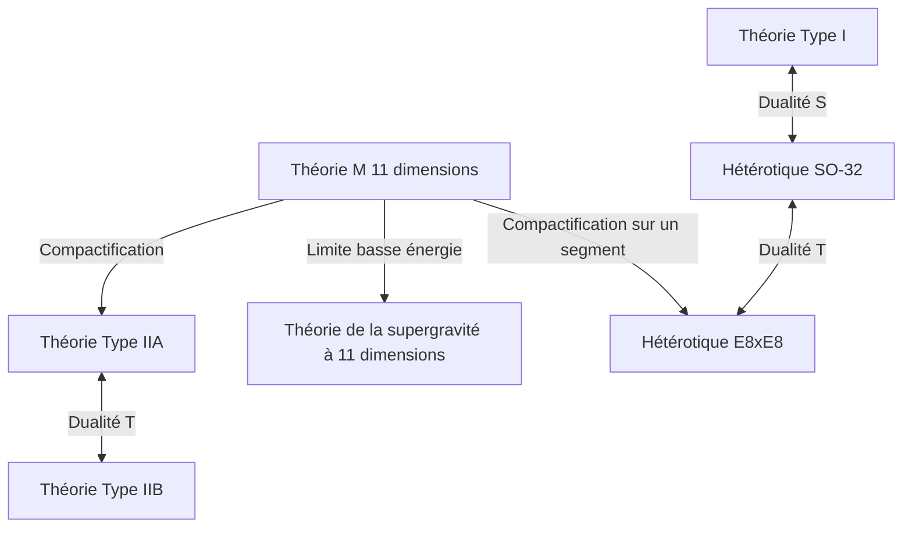

# Introduction : Le défi du rêve ultime de la physique, la « Théorie du tout (TOE) »

L'un des objectifs les plus ambitieux de la physique moderne est la construction d'une « Théorie du tout (Theory of Everything : TOE) » qui décrirait de manière unifiée les quatre forces fondamentales existant dans la nature : la gravité, la force électromagnétique, la force faible et la force forte. Le modèle standard (Standard Model) a réussi à décrire avec une précision extrêmement élevée les trois forces (électromagnétique, faible, et forte) ainsi que les particules élémentaires qui y sont associées. Cependant, lorsque l'on tente d'intégrer la « gravité », décrite par la théorie de la relativité générale d'Einstein, dans le cadre de la mécanique quantique, des difficultés d'infinis (non-renormalisabilité) surgissent, conduisant à un effondrement fatal.

La « Théorie des supercordes (Superstring Theory) » attire l'attention comme l'unique candidat sérieux capable de résoudre cette profonde contradiction. Dans cet article, nous expliquerons en détail la vue d'ensemble grandiose de la théorie des supercordes : en commençant par le changement de paradigme qui considère l'unité minimale de la matière non pas comme un « point » mais comme une « corde unidimensionnelle », en passant par la compactification des dimensions supplémentaires, les mathématiques des variétés de Calabi-Yau, l'unification ultime par la théorie M, jusqu'aux défis récents de sa vérification.

---

## Chapitre 1 : L'effondrement des particules ponctuelles et l'introduction des cordes

### Les difficultés de l'infini dans la théorie quantique des champs et la non-renormalisabilité de la gravité

Dans la théorie quantique des champs classique (Quantum Field Theory : QFT) qui traite les particules élémentaires comme des « points » sans volume, le problème d'une énergie d'interaction divergeant vers l'infini lorsque la distance se rapproche de zéro lors de l'interaction entre particules a toujours persisté. Pour les forces électromagnétique, forte et faible, une méthode mathématique appelée « théorie de la renormalisation (Renormalization) », établie par Sin-Itiro Tomonaga, Richard Feynman et Julian Schwinger, a permis de compenser ces infinis et d'en tirer des prédictions finies et physiquement significatives.

Cependant, si l'on introduit le « graviton », particule élémentaire inconnue médiatrice de la gravité, et que l'on tente de quantifier la théorie de la relativité générale (construction de la théorie de la gravité quantique), cette méthode de renormalisation ne fonctionne plus du tout. La constante de couplage de la gravité (constante de Newton) ayant la dimension de l'énergie, plus on calcule de diagrammes de Feynman à des boucles d'ordre supérieur, plus de nouvelles divergences infinies apparaissent, nécessitant un nombre infini de paramètres pour tout compenser. C'est ce qu'on appelle la « non-renormalisabilité de la gravité ».

### Le modèle de résonance duale de Yoichiro Nambu et Hidehiko Goto, et les cordes unidimensionnelles

L'histoire de la théorie des supercordes a commencé dans un domaine totalement indépendant de la gravité. En 1968, Gabriele Veneziano a découvert que l'amplitude de diffusion (probabilité de diffusion) des hadrons, qui subissent l'interaction forte, pouvait être décrite de manière étonnamment parfaite à l'aide de la fonction bêta d'Euler en mathématiques (amplitude de Veneziano).

Ce sont Yoichiro Nambu, Hidehiko Goto, ainsi que Holger Nielsen et Leonard Susskind, qui ont trouvé la signification physique de cette formule. En 1970, ils ont montré que l'amplitude de Veneziano se déduisait naturellement si l'on supposait que « les hadrons ne sont pas des particules ponctuelles, mais des oscillateurs unidimensionnels semblables à des élastiques de longueur finie » (modèle de résonance duale).

L'action la plus fondamentale pour décrire le mouvement de cette « corde » est l'action de Nambu-Goto (Nambu-Goto Action). Lorsqu'une corde se déplace dans l'espace-temps, alors qu'un point trace une ligne (ligne d'univers), une corde unidimensionnelle trace une surface bidimensionnelle (surface d'univers : Worldsheet). L'action de Nambu-Goto est définie comme une quantité proportionnelle à l'aire de cette surface d'univers.

$$ S = -T \int d\tau d\sigma \sqrt{- \det(\gamma_{ab})} $$

Ici, $T$ est la tension de la corde (Tension), et $\gamma_{ab}$ est la métrique induite sur la surface d'univers. Bien que cette action soit très belle géométriquement, sa quantification s'accompagne de difficultés mathématiques liées à la manipulation de la racine carrée.

### L'action de Polyakov (Polyakov Action) et l'invariance conforme

Ainsi, Alexander Polyakov a introduit une métrique de surface d'univers indépendante $h_{ab}$ en tant que champ auxiliaire, et a proposé l'« action de Polyakov », une action facile à manipuler qui ne contient pas de racine carrée tout en étant équivalente à l'action de Nambu-Goto.

$$ S = -\frac{T}{2} \int d^2\sigma \sqrt{-h} h^{ab} \partial_a X^\mu \partial_b X^\nu \eta_{\mu\nu} $$

L'action de Polyakov possède une symétrie conforme, c'est-à-dire l'« invariance de Weyl (Weyl invariance) » qui la rend invariante sous une transformation d'échelle locale, en plus de l'invariance par reparamétrisation (Diffeomorphism invariance). Cette propriété en tant que théorie des champs conformes (CFT) en deux dimensions formera la puissante fondation mathématique de la théorie des cordes.

---

## Chapitre 2 : Cordes ouvertes et cordes fermées, la supersymétrie

### Les particules élémentaires en tant que modes de vibration des cordes

L'idée la plus révolutionnaire de la théorie des cordes est le concept selon lequel « les innombrables particules élémentaires existant dans l'univers ne sont que différents modes de vibration (harmoniques) d'une seule et même corde ». Tout comme les cordes d'un violon produisent différents timbres (fréquences) selon la façon dont elles sont jouées, les cordes microscopiques prennent différents états vibratoires pour apparaître à nos yeux comme des particules élémentaires ayant des masses et des spins différents.

Il existe deux types de cordes : les « cordes ouvertes (Open string) » qui ont des extrémités, et les « cordes fermées (Closed string) » dont les extrémités sont reliées pour former une boucle.

### Les bosons de jauge issus des cordes ouvertes, et les gravitons engendrés par les cordes fermées

**Corde ouverte (Open String) :**
Les deux extrémités d'une corde ouverte ne peuvent pas se déplacer librement dans l'espace, mais sont fixées sur une membrane appelée D-brane que nous décrirons plus loin. L'analyse de l'état fondamental d'une corde ouverte (le mode de vibration de plus basse énergie) révèle l'apparition d'une particule vectorielle de masse nulle et de spin 1. Il s'agit précisément des « bosons de jauge » tels que les photons médiateurs de la force électromagnétique et les gluons médiateurs de la force forte.

**Corde fermée (Closed String) :**
D'autre part, comme la corde fermée n'a pas d'extrémités, elle peut se propager librement dans l'espace-temps sans être contrainte par une brane. Lorsqu'on quantifie et analyse les modes de vibration des cordes fermées, une particule tensorielle de masse nulle et de « spin 2 » émerge inévitablement, ce qui est surprenant. Il s'agit d'une particule qui n'existe pas dans le modèle standard et qui possède exactement les mêmes propriétés que le « graviton », la particule médiatrice de la gravité prédite par la théorie de la relativité générale.

La théorie des cordes n'a pas été conçue au départ pour inclure la gravité. Bien qu'elle ait commencé comme une théorie des hadrons, ses formules mathématiques ont spontanément exigé l'existence des gravitons. Grâce à ce fait, la théorie des cordes a subi une transformation spectaculaire, passant d'un simple modèle de la force forte au candidat le plus prometteur pour une « théorie de la gravité quantique » (proposition de 1974 par John Schwarz et Joël Scherk).

### L'effondrement de la théorie des cordes bosoniques (apparition du tachyon) et l'algèbre de Virasoro

La première théorie des cordes était une « théorie des cordes bosoniques » qui décrivait uniquement les bosons (particules médiatrices des forces). Pour traiter correctement la vibration des cordes du point de vue de la mécanique quantique, il faut garantir que l'invariance conforme n'est pas brisée (qu'il n'y a pas d'anomalie) pendant le processus de quantification.

La symétrie conforme sur la surface d'univers bidimensionnelle est décrite par l'« algèbre de Virasoro (Virasoro Algebra) », une algèbre de Lie de dimension infinie.
$$ [L_m, L_n] = (m - n)L_{m+n} + \frac{c}{12}m(m^2 - 1)\delta_{m+n, 0} $$
Ici, $c$ est appelé la charge centrale (central charge). Pour que la théorie des cordes bosoniques soit mathématiquement cohérente (sans apparition d'états fantômes), il a été prouvé que la dimension $D$ de l'espace-temps devait, de manière surprenante, être de « 26 dimensions (25 dimensions spatiales + 1 dimension temporelle) ».

De plus, et c'est un problème fatal, l'état d'énergie le plus bas de la théorie des cordes bosoniques devient un « tachyon (Tachyon) » dont la masse est un nombre imaginaire (la masse au carré est négative). Un vide où des tachyons existent est instable, ce qui signifie que la théorie ne peut pas décrire la réalité physique.

### L'introduction de la supersymétrie (Supersymmetry) et la théorie des supercordes (10 dimensions)

Pour résoudre le problème du tachyon et le défaut selon lequel les fermions composant la matière (électrons, quarks, etc.) n'étaient pas inclus dans la théorie, la « supersymétrie (Supersymmetry : SUSY) » a été introduite. La supersymétrie est une symétrie qui échange les bosons (particules de spin entier) et les fermions (particules de spin demi-entier).

Dans la « théorie des supercordes (Superstring Theory) » qui introduit la supersymétrie sur la surface d'univers de la corde, il a été montré qu'en effectuant une opération mathématique appelée projection GSO (Gliozzi-Scherk-Olive projection), le tachyon est brillamment éliminé du spectre, et que la supersymétrie de l'espace-temps est simultanément réalisée.

Dans cette théorie des supercordes, les anomalies conformes s'annulent, et le nombre de dimensions spatio-temporelles pour qu'elle soit mathématiquement cohérente est de « 10 dimensions (9 dimensions spatiales + 1 dimension temporelle) ». Bien que ce soit très différent de l'espace-temps à 4 dimensions (3 dimensions spatiales + 1 dimension temporelle) dans lequel nous vivons, le nombre de dimensions a été drastiquement réduit de 26 à 10, marquant un moment de rapprochement vers la physique réelle.

---

## Chapitre 3 : La première révolution des supercordes

De la fin des années 1970 au début des années 1980, la théorie des supercordes a été à moitié abandonnée par la communauté physique, à l'exception de quelques chercheurs enthousiastes. La raison en était que l'on pensait que des contradictions mathématiques appelées anomalies quantiques apparaissaient inévitablement lorsque l'on combinait la théorie de jauge et la gravité.

### 1984 : L'annulation miraculeuse des anomalies par Green et Schwarz

Durant l'été 1984, Michael Green et John Schwarz ont accompli des calculs historiques. Ils ont prouvé que dans les théories des supercordes à 10 dimensions remplissant certaines conditions, les anomalies de jauge et les anomalies gravitationnelles s'annulaient parfaitement au niveau des diagrammes hexagonaux de Feynman, devenant complètement nulles.

Il s'est avéré que pour que cette annulation miraculeuse se produise, le groupe de jauge derrière la théorie devait être un groupe de symétrie immense spécifique. Il n'y en avait que deux : **$SO(32)$** (le groupe orthogonal spécial de dimension 32) et **$E_8 \times E_8$** (le produit direct du groupe exceptionnel E8).

Cette découverte a causé un choc formidable dans la communauté de la physique et a déclenché un boom de recherche explosif connu sous le nom de « Première révolution des supercordes ». La voie vers la théorie du tout s'était soudainement dégagée.

### Les 5 théories des supercordes cohérentes

Après la découverte de Green et Schwarz, les recherches se sont accélérées et il est finalement apparu qu'il y avait « 5 types » de théories des supercordes cohérentes en 10 dimensions, classées comme suit.

1. **Théorie de Type I** : Comprend à la fois des cordes ouvertes et fermées. La supersymétrie est $N=1$. Le groupe de jauge est $SO(32)$.
2. **Théorie de Type IIA** : Cordes fermées uniquement. La supersymétrie est $N=2$ et elle est non chirale (conserve la symétrie de parité).
3. **Théorie de Type IIB** : Cordes fermées uniquement. La supersymétrie est $N=2$ et elle est chirale (brise la parité. Proche de la nature de l'interaction faible réelle).
4. **Théorie hétérotique $SO(32)$** : Cordes fermées uniquement. Une théorie excentrique mais belle qui hybride les vibrations se déplaçant vers la droite (supercorde à 10 dimensions) et celles se déplaçant vers la gauche (corde bosonique à 26 dimensions). Le groupe de jauge est $SO(32)$.
5. **Théorie hétérotique $E_8 \times E_8$** : Structure hybride similaire. Le groupe de jauge est $E_8 \times E_8$. Elle fut un temps considérée comme la plus prometteuse car elle peut naturellement inclure les symétries du modèle standard de la réalité ($SU(3) \times SU(2) \times U(1)$).

Chacune de ces cinq théories possédait une cohérence mathématique parfaite. Du point de vue philosophique selon lequel « il ne devrait y avoir qu'une seule théorie du tout », l'existence de cinq candidates est devenue un grand mystère pour les physiciens de l'époque.

---

## Chapitre 4 : Compactification des dimensions supplémentaires et variétés de Calabi-Yau

L'espace-temps à « 10 dimensions » exigé par la théorie des supercordes est manifestement en contradiction avec nos « 3 dimensions spatiales + 1 dimension temporelle (4 dimensions au total) » perçues au quotidien. Où se cachent donc les 6 dimensions spatiales restantes (dimensions supplémentaires : Extra Dimensions) ?

### La généalogie issue de la théorie de Kaluza-Klein

Le concept des dimensions supplémentaires est bien plus ancien que la théorie des cordes, remontant aux années 1920 avec Theodor Kaluza et Oskar Klein. Ils ont réussi à déduire de manière unifiée la gravité et l'électromagnétisme en 4 dimensions en étendant la théorie de la relativité générale à 5 dimensions (4 dimensions spatiales + 1 dimension temporelle), et en enroulant (compactifiant) la 4ème dimension spatiale en un cercle de taille extrêmement petite. La structure géométrique de la dimension supplémentaire apparaît sous forme de « force (champ de jauge) » dans le monde à basse énergie.

### Variétés kählériennes à courbure de Ricci nulle : les espaces de Calabi-Yau

Pour extraire une physique réaliste à 4 dimensions de la théorie des supercordes à 10 dimensions, il est nécessaire de « compactifier (Compactification) » les 6 dimensions supplémentaires en les enroulant à une taille minuscule, de l'ordre de la longueur de Planck ($10^{-35}$ mètres). Il ne suffit pas de les enrouler n'importe comment ; il faut satisfaire des contraintes physiques strictes, comme la préservation d'au moins une supersymétrie $N=1$ dans l'espace à 4 dimensions (pour résoudre le problème de la hiérarchie et déduire les fermions).

En 1985, Philip Candelas, Gary Horowitz, Andrew Strominger et Edward Witten ont prouvé que cet espace à 6 dimensions supplémentaires devait être une variété complexe spéciale satisfaisant des conditions mathématiques spécifiques.

Cette condition est d'être une « variété kählérienne compacte à courbure de Ricci nulle (Ricci-flat Kähler manifold) ». Cet espace géométrique est appelé « **Variété de Calabi-Yau (Calabi-Yau manifold)** », du nom du mathématicien Eugenio Calabi qui a conjecturé son existence, et de Shing-Tung Yau qui l'a mathématiquement prouvée.

### La caractéristique d'Euler et le nombre de générations de quarks

Les structures extrêmement difficiles et complexes de « trous » et de « topologie » de l'espace de Calabi-Yau déterminent complètement les propriétés des particules élémentaires dans notre monde à 4 dimensions.

Par exemple, il a été démontré que la valeur absolue de la moitié de la « caractéristique d'Euler (Euler characteristic) », un invariant caractérisant la topologie de la variété, correspond au « nombre de générations de particules élémentaires » apparaissant dans le monde réel. Le modèle standard possédant 3 générations de quarks et de leptons (up/down, charm/strange, top/bottom), la recherche d'espaces de Calabi-Yau ayant une caractéristique d'Euler de $\pm 6$ est devenue la tâche la plus importante en phénoménologie de la théorie des cordes.

### La merveille de la symétrie miroir (Mirror Symmetry)

L'étude des variétés de Calabi-Yau a également apporté une percée dramatique dans le domaine des mathématiques pures. Les physiciens ont découvert que deux espaces de Calabi-Yau ayant des topologies complètement différentes (paires miroir) décrivent en réalité exactement les mêmes phénomènes physiques dans la théorie des cordes. C'est ce qu'on appelle la « symétrie miroir ».

Des problèmes de calcul géométrique extrêmement difficiles sur l'une des variétés (par exemple, le comptage du nombre de courbes rationnelles en géométrie énumérative) pouvaient être résolus très facilement en se convertissant en problèmes d'intégration sur l'autre variété grâce à la symétrie miroir, une série de phénomènes qui a stupéfié les mathématiciens. La théorie des cordes, tout en étant une théorie de la physique, fonctionne également comme un « détecteur ultime » pour découvrir de profondes mathématiques inconnues.

---

## Chapitre 5 : La deuxième révolution des supercordes et la théorie M

Jusqu'au milieu des années 1990, on pensait que les cinq théories des supercordes étaient des théories indépendantes et distinctes. Cependant, en 1995, lors de la conférence internationale sur les cordes tenue à l'Université de Californie du Sud, une conférence historique donnée par Edward Witten a radicalement changé la situation. Ce fut le début de la « Deuxième révolution des supercordes ».

### Le dictionnaire magique de la dualité (Duality)

En utilisant un concept appelé « dualité (Duality) », Witten a brillamment prouvé que les cinq théories des supercordes, qui semblaient totalement différentes à première vue, n'étaient en fait que différents aspects d'une « unique théorie ultime ». Les principales dualités sont les deux suivantes :

- **Dualité T (Target-space Duality)** : Une propriété étonnante selon laquelle, si le rayon de compactification de l'espace est $R$, la théorie de rayon $R$ et la théorie de rayon $1/R$ sont physiquement totalement équivalentes. Cela a montré que les théories de Type IIA et de Type IIB, ainsi que les deux théories hétérotiques, sont respectivement liées. L'univers microscopique et l'univers gigantesque sont indiscernables du point de vue de la théorie des cordes.
- **Dualité S (Strong-weak Duality)** : Une relation où, si la constante de couplage de l'interaction est $g$, une théorie à grande constante de couplage (interaction forte) est équivalente à une théorie faible à constante de couplage $1/g$. Cela a permis de relier la théorie de Type I à la théorie hétérotique SO(32), rendant possible le calcul de la physique du régime de couplage fort, incalculable auparavant, en utilisant le régime de couplage faible d'une autre théorie.

### La découverte des D-branes (D-brane)

À la même époque que l'annonce de Witten, Joseph Polchinski a défini clairement le concept de « **D-brane (D-brane)** » et a prouvé son importance dans la théorie des cordes. Une D-brane est une entité telle qu'une « membrane de dimension supérieure » sur laquelle les extrémités des cordes ouvertes peuvent s'attacher (le D vient de la condition aux limites de Dirichlet).

Les D-branes sont devenues des composants essentiels de la théorie des cordes, élucidant l'origine microscopique de l'entropie des trous noirs (résultat de Strominger et Vafa en 1996). L'« hypothèse des mondes branaires (braneworld) », suggérant que notre univers lui-même pourrait être une immense D3-brane (une membrane spatiale tridimensionnelle), en est également dérivée.

### La « théorie M » à 11 dimensions qui unifie tout

Witten, ayant unifié les cinq théories des supercordes à travers le réseau de dualités, a proposé la « **théorie M (M-theory)** » comme théorie de niveau supérieur unifiant ces théories.

Étonnamment, l'espace-temps dans lequel se déploie la théorie M est de « 11 dimensions (10 dimensions spatiales + 1 dimension temporelle) ». Il a été révélé qu'en prenant la limite de la constante de couplage vers l'infini dans la théorie de Type IIA, une autre dimension spatiale invisible (la 11ème dimension) apparaissait sous forme de cercle, et que la « corde » unidimensionnelle était en réalité une « membrane (membrane) » bidimensionnelle enroulée.

La signification du « M » de la théorie M (Membrane, Magic, Mystery, Matrix, Mother, etc.) a été délibérément laissée ambiguë par Witten lui-même. Même aujourd'hui, la formulation mathématique complète (les équations fondamentales) de la théorie M n'a pas été trouvée, et elle reste l'un des plus grands problèmes non résolus de la physique moderne. Cependant, par le biais du principe holographique (correspondance AdS/CFT), ses propriétés fragmentaires sont progressivement élucidées.

*(Note : Diagramme de l'unification des 5 théories des supercordes reliées par les dualités, autour de la théorie M)*

---

## Chapitre 6 : Le paysage des cordes (String Landscape) et le défi de la vérification

La théorie des supercordes règne depuis longtemps comme le principal candidat à la théorie du tout, mais en tant que physique, une vérification par des expériences ou des observations est indispensable. Cependant, un mur immense se dresse ici.

### $10^{500}$ vides : Le paysage des cordes et le principe anthropique

Il existe une infinité de combinaisons possibles pour la topologie des variétés de Calabi-Yau, la disposition des D-branes et les flux (semblables à des lignes de champ magnétique) s'enroulant autour des variétés. Des calculs effectués au début des années 2000 ont révélé que le nombre de vides stables et métastables (candidats pour le modèle de l'univers) autorisés par la théorie des cordes s'élevait à un nombre stupéfiant de plus de **$10^{500}$** (comme le scénario KKLT).

C'est ce qu'on appelle le « **Paysage des cordes (String Landscape)** ». La théorie des cordes n'était pas une théorie déterminant de manière unique les lois de notre univers, mais un cadre engendrant une infinité d'univers (multivers) dotés de toutes les lois concevables.

Ce fait a provoqué une profonde controverse dans la communauté des physiciens. À la question « pourquoi notre univers possède-t-il les lois actuelles (les valeurs infimes de la constante cosmologique et l'équilibre parfait des masses des particules élémentaires) ? », il a fallu recourir à l'introduction du « principe anthropique (Anthropic Principle) », selon lequel « parmi la multitude d'univers existants, il est inévitable que nous observions un univers possédant un environnement permettant l'existence d'une vie intelligente comme la nôtre ». Leonard Susskind et d'autres le soutiennent fortement, mais de nombreux physiciens s'y opposent farouchement en raison de son infalsifiabilité.

### La conjecture du Swampland (marécage)

Récemment, la « conjecture du **Swampland (marécage)** » proposée par Cumrun Vafa et d'autres attire rapidement l'attention en tant que nouvelle approche face au paysage (Landscape).

L'ensemble des modèles de théories effectives des champs (modèles physiques à basse énergie) qui semblent cohérents à première vue, mais qui ne peuvent pas être intégrés sans contradiction dans une théorie de la gravité quantique (théorie des cordes), est appelé le Swampland. Vafa et d'autres proposent successivement des critères forts (conditions du Swampland) tels que « la gravité doit toujours être la force la plus faible (conjecture de la gravité faible) » ou « il y a des restrictions strictes sur l'expansion accélérée de l'univers due à l'énergie noire (conjecture de de Sitter) ».

Grâce à cela, on espère restreindre considérablement les conditions de notre univers observable parmi l'immense paysage (Landscape) qui aurait contenu $10^{500}$ possibilités.

### Le défi sans fin de la vérification expérimentale

La preuve directe de la théorie des cordes nécessiterait l'échelle d'énergie de Planck (requérant un gigantesque accélérateur de particules de la taille de notre galaxie), ce qui est pratiquement impossible. Néanmoins, des méthodes de vérification indirecte sont encore sérieusement explorées aujourd'hui.

1. **L'observation des ondes gravitationnelles primordiales :**
   Des projets (comme le satellite LiteBIRD) visent à observer les traces laissées par les « ondes gravitationnelles primordiales », générées lors de la phase d'inflation cosmique, dans la polarisation (mode B) du fond diffus cosmologique (CMB). Cela pourrait permettre de vérifier les modèles d'inflation spécifiques à la théorie des cordes.
2. **Rayons cosmiques d'ultra-haute énergie et trous noirs microscopiques :**
   On espérait observer, avec le Grand collisionneur de hadrons (LHC) du CERN, la création de « mini-trous noirs » suggérant l'existence de dimensions supplémentaires, ou un déficit d'énergie (énergie manquante) dû aux gravitons s'échappant dans les dimensions supplémentaires. Actuellement, aucune preuve claire n'a été trouvée, et des limites supérieures strictes ont été imposées à la taille des dimensions supplémentaires.
3. **Cordes cosmiques (Cosmic String) :**
   La possibilité que d'immenses cordes macroscopiques (cordes cosmiques), formées lors des transitions de phase de l'univers primordial, soient observées sous forme de lentilles gravitationnelles ou de sursauts d'ondes gravitationnelles.

## Conclusion : Un voyage sans fin vers la vérité ultime

La théorie des supercordes est sans doute la cristallisation de l'intellect la plus grandiose et la plus mathématiquement belle que l'humanité ait jamais atteinte. Le saut conceptuel de la particule ponctuelle à la corde, puis de la dimension supplémentaire à la membrane (théorie M), nous confronte à la possibilité que l'espace et le temps eux-mêmes ne soient pas fondamentaux, mais qu'ils soient de simples « illusions » émergeant d'une géométrie dimensionnelle plus profonde.

En raison de l'absence de preuves expérimentales directes, il est vrai qu'il existe de vives critiques selon lesquelles « la théorie des cordes n'est pas de la physique, mais seulement des mathématiques, voire de la philosophie ». Cependant, en fournissant des pistes pour résoudre le paradoxe de l'information des trous noirs, et en offrant des méthodes de calcul totalement nouvelles pour la physique de la matière condensée à couplage fort (comme la supraconductivité) grâce à la correspondance AdS/CFT, la théorie des cordes a déjà pris de profondes racines comme langage indispensable dans de vastes domaines de la physique théorique.

Nous ne possédons pas encore les véritables équations de la théorie M. Quelle forme prennent les six dimensions supplémentaires tapies dans l'obscurité de l'espace de Calabi-Yau, et où se situe notre univers dans le paysage (Landscape) des $10^{500}$ possibilités ? Les physiciens poursuivent aujourd'hui leur défi sans fin dans l'espoir qu'un jour toute l'image de cette théorie soit élucidée.

---

## Annexe : Le contexte mathématique avancé soutenant la théorie des supercordes

Bien que nous ayons privilégié une compréhension intuitive dans le corps principal, nous détaillerons ici plus en profondeur les formules et la structure géométrique qui constituent la base solide de la théorie des supercordes.

### A. L'action de Polyakov et la formulation complète de la théorie des champs conformes à 2 dimensions (CFT)

L'action de Polyakov, qui décrit la dynamique sur la surface d'univers (Worldsheet), c'est-à-dire la trajectoire de la corde se déplaçant dans l'espace-temps, est donnée par :

$$ S_P = -\frac{T}{2} \int d^2\sigma \sqrt{-h} h^{\alpha\beta} \partial_\alpha X^\mu \partial_\beta X^\nu \eta_{\mu\nu} $$

Ici, $X^\mu(\tau, \sigma)$ est une application des coordonnées de la surface d'univers $(\tau, \sigma)$ vers l'espace-temps cible (c'est-à-dire les coordonnées de la corde dans l'espace-temps). La propriété la plus importante de cette action est qu'elle possède les trois symétries locales suivantes.
1. **Invariance par difféomorphisme en 2 dimensions (Diffeomorphism invariance) :** Invariante par rapport aux transformations de coordonnées sur la surface d'univers $\sigma^\alpha \to \sigma^{\prime\alpha}(\sigma)$.
2. **Invariance de Poincaré en 2 dimensions :** Invariance par rapport aux translations et aux transformations de Lorentz dans l'espace-temps cible.
3. **Invariance de Weyl (Weyl invariance) :** Invariance par rapport à une transformation d'échelle locale du tenseur métrique $h_{\alpha\beta}(\sigma) \to e^{2\omega(\sigma)}h_{\alpha\beta}(\sigma)$.

Classiquement, l'invariance de Weyl est conservée, mais lors de la quantification à l'aide de l'intégrale de chemin, une « anomalie conforme (Conformal Anomaly) » apparaît à partir du jacobien de transformation de la mesure. Lorsqu'on calcule les conditions pour annuler cette anomalie et conserver l'invariance de Weyl au niveau quantique, la contribution des champs fantômes (fantômes de Faddeev-Popov) doit annuler la contribution des champs de matière ($X^\mu$). C'est précisément le moteur mathématique qui exige $D=26$ pour la corde bosonique et $D=10$ pour la supercorde.

### B. Variétés de Calabi-Yau et mathématiques de la courbure de Ricci nulle

Pour déduire une théorie effective à 4 dimensions à partir de la théorie des supercordes à 10 dimensions, il est nécessaire, comme condition de compactification, de préserver la supersymétrie sur l'espace à 6 dimensions supplémentaires $K$ (le champ de spineurs doit être covariantement constant). En d'autres termes, il faut satisfaire l'équation différentielle $\nabla_m \eta = 0$ ($\eta$ étant un spineur intrinsèque).

Pour que cette condition soit remplie, le groupe d'holonomie de l'espace $K$ doit être inclus dans $SU(3)$, ce qui est géométriquement équivalent aux conditions suivantes :
1. $K$ doit être une variété kählérienne (Kähler manifold). C'est-à-dire, posséder une forme bilinéaire fermée non dégénérée (forme de Kähler $J$).
2. La première classe de Chern $c_1(K)$ de $K$ doit être nulle.

D'après le théorème de Yau (la preuve de la conjecture de Calabi), pour toute variété kählérienne compacte satisfaisant $c_1(K)=0$, il existe toujours de manière unique une « métrique kählérienne à courbure de Ricci nulle » où le tenseur de Ricci $R_{mn}$ est nul. C'est cela, une variété de Calabi-Yau.

La géométrie des variétés de Calabi-Yau est caractérisée par les dimensions (nombres de Hodge $h^{p,q}$) de leurs groupes de cohomologie $H^{p,q}(K)$. En particulier, les deux nombres de Hodge $h^{2,1}$ et $h^{1,1}$ sont extrêmement importants.
- $h^{1,1}$ correspond au nombre de degrés de déformation (modules) de la structure kählérienne (paramètres de « taille » et de « forme » de la variété).
- $h^{2,1}$ correspond au nombre de degrés de déformation de la structure complexe.

Physiquement, la valeur de la caractéristique d'Euler $\chi = 2(h^{1,1} - h^{2,1})$ est directement liée à la différence du nombre de générations de fermions chiraux (quarks et leptons) dans le monde à 4 dimensions. Par exemple, pour déduire les « 3 générations » du modèle standard, il faut trouver une variété de Calabi-Yau telle que $\chi = \pm 6$, et de tels espaces ont été construits à l'aide de méthodes comme les orbifolds Z3.

### C. Correspondance AdS/CFT : L'incarnation ultime du principe holographique

Le plus grand sous-produit dérivé de la recherche sur la théorie M et les D-branes est la « correspondance AdS/CFT (Anti-de Sitter/Conformal Field Theory correspondence) » proposée par Juan Maldacena en 1997.

Il s'agit de la conjecture stupéfiante selon laquelle la « théorie de la gravité (théorie des supercordes) dans un espace anti-de Sitter à 5 dimensions (espace AdS) » est totalement équivalente à la « théorie des champs conformes (CFT : théorie de jauge n'incluant pas la gravité) définie sur sa frontière à 4 dimensions ».

$$ Z_{\text{AdS}}[J] = \langle e^{\int \mathcal{O} J} \rangle_{\text{CFT}} $$

Cette équivalence est une réalisation mathématiquement rigoureuse du « principe holographique », selon lequel deux théories de dimensions différentes décrivent la même physique. Étant donné qu'elle permet de traduire et de résoudre une théorie de jauge à couplage fort (incalculable) en une gravité classique à couplage faible (calculable avec la relativité générale), elle génère aujourd'hui des applications extrêmement vastes, non seulement en physique des particules, mais aussi en physique de la matière condensée (supraconductivité à haute température, calculs de viscosité du plasma de quarks et de gluons, etc.) et jusqu'à la théorie de l'information quantique. Ce fut un changement de paradigme symbolique qui a fait évoluer la théorie des supercordes du statut de simple « hypothèse » à celui d'un « outil utile » pour l'ensemble de la physique.
