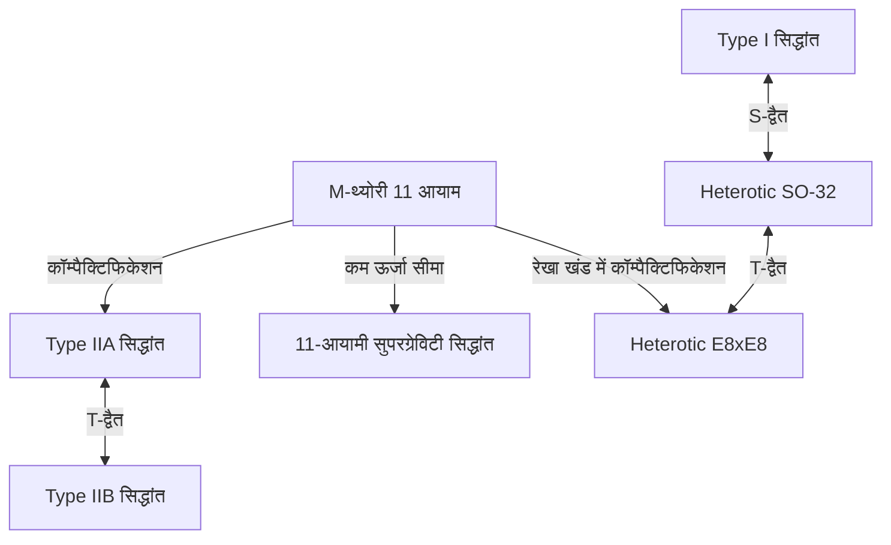

# प्रस्तावना: भौतिकी के अंतिम सपने 'थ्योरी ऑफ एवरीथिंग (TOE)' की चुनौती

आधुनिक भौतिकी के सबसे महत्वाकांक्षी लक्ष्यों में से एक प्रकृति में मौजूद 4 मूलभूत बलों- गुरुत्वाकर्षण, विद्युत चुम्बकीय बल, कमजोर बल और मजबूत बल को एकीकृत रूप से वर्णित करने वाली 'थ्योरी ऑफ एवरीथिंग (Theory of Everything: TOE)' का निर्माण करना है। मानक मॉडल (Standard Model) विद्युत चुम्बकीय बल, कमजोर बल, मजबूत बल और इनसे संबंधित प्राथमिक कणों का अत्यंत उच्च सटीकता के साथ वर्णन करने में सफल रहा है। हालांकि, आइंस्टीन के सामान्य सापेक्षता के सिद्धांत द्वारा वर्णित केवल 'गुरुत्वाकर्षण' को क्वांटम यांत्रिकी के ढांचे में शामिल करने का प्रयास करने पर, अनंत कठिनाइयाँ (गैर-पुनर्सामान्यता, Non-renormalizability) उत्पन्न होती हैं, जिससे यह गंभीर रूप से विफल हो जाता है।

इस गहरी निहित विसंगति को हल करने के लिए एकमात्र मजबूत उम्मीदवार के रूप में 'सुपरस्ट्रिंग थ्योरी (Superstring Theory)' पर ध्यान आकर्षित किया गया है। इस लेख में, पदार्थ की सबसे छोटी इकाई को 'बिंदु' के बजाय '1-आयामी स्ट्रिंग (तार)' मानने के प्रतिमान बदलाव (paradigm shift) से शुरू करके, अतिरिक्त आयामों के कॉम्पैक्टिफिकेशन, कैलाबी-याउ मैनिफोल्ड के गणित, M-थ्योरी द्वारा अंतिम एकीकरण, और नवीनतम सत्यापन की चुनौतियों तक, सुपरस्ट्रिंग सिद्धांत की भव्य संपूर्ण तस्वीर का गहराई से वर्णन किया जाएगा।

---

## अध्याय 1: बिंदु कणों की विफलता और स्ट्रिंग का परिचय

### क्वांटम फील्ड थ्योरी में अनंत की कठिनाई और गुरुत्वाकर्षण की गैर-पुनर्सामान्यता

पारंपरिक क्वांटम फील्ड थ्योरी (Quantum Field Theory: QFT) में, जो प्राथमिक कणों को बिना आयतन वाले 'बिंदु (point)' के रूप में मानती है, एक समस्या हमेशा बनी रहती है कि जब कण एक-दूसरे के साथ परस्पर क्रिया करते हैं, तो दूरी के शून्य तक पहुंचने की सीमा पर परस्पर क्रिया की ऊर्जा अनंत तक विचलित हो जाती है। विद्युत चुम्बकीय बल, मजबूत बल और कमजोर बल में, सिन-इतिरो तोमोनागा, रिचर्ड फेनमैन और जूलियन श्विंगर जैसे वैज्ञानिकों द्वारा स्थापित 'पुनर्सामान्यता सिद्धांत (Renormalization)' नामक एक गणितीय तकनीक के माध्यम से इस अनंत को रद्द करना और परिमित, भौतिक अर्थ वाली भविष्यवाणियां प्राप्त करना संभव था।

हालांकि, जब गुरुत्वाकर्षण को मध्यस्थ करने वाले एक अज्ञात प्राथमिक कण 'ग्रेविटॉन' को पेश किया जाता है और सामान्य सापेक्षता को परिमाणित (क्वांटाइज़) करने का प्रयास किया जाता है (क्वांटम गुरुत्वाकर्षण सिद्धांत का निर्माण), तो यह पुनर्सामान्यता तकनीक बिल्कुल भी काम नहीं करती है। चूंकि गुरुत्वाकर्षण का युग्मन स्थिरांक (न्यूटन स्थिरांक) ऊर्जा के आयाम का होता है, इसलिए उच्च क्रम के लूप वाले फेनमैन आरेखों की जितनी अधिक गणना की जाती है, उतने ही नए अनंत विचलन उत्पन्न होते हैं, और उन सभी को रद्द करने के लिए अनंत संख्या में मापदंडों की आवश्यकता होती है। इसे 'गुरुत्वाकर्षण की गैर-पुनर्सामान्यता (Non-renormalizability of gravity)' कहा जाता है।

### योइचिरो नंबू, हिदेहीको गोतो और अन्य का दोहरी अनुनाद मॉडल और 1-आयामी स्ट्रिंग

सुपरस्ट्रिंग थ्योरी का इतिहास गुरुत्वाकर्षण से पूरी तरह असंबंधित बिंदु से शुरू हुआ। 1968 में, गेब्रियल वेनेज़ियानो (Gabriele Veneziano) ने खोज की कि मजबूत अंतःक्रिया करने वाले हैड्रॉन के प्रकीर्णन आयाम (प्रकीर्णन संभावना) को गणित के यूलर बीटा फ़ंक्शन का उपयोग करके आश्चर्यजनक रूप से अच्छी तरह से वर्णित किया जा सकता है (वेनेज़ियानो आयाम)।

इस सूत्र का भौतिक अर्थ योइचिरो नंबू, हिदेहीको गोतो, होल्गर नीलसन और लियोनार्ड ससकिंड द्वारा खोजा गया था। 1970 में, उन्होंने दिखाया कि यदि कोई यह मान ले कि "हैड्रॉन बिंदु कण नहीं हैं, बल्कि परिमित लंबाई के 1-आयामी रबर बैंड की तरह एक कंपन करने वाली वस्तु हैं", तो वेनेज़ियानो आयाम को स्वाभाविक रूप से प्राप्त किया जा सकता है (दोहरी अनुनाद मॉडल, Dual Resonance Model)।

इस 'स्ट्रिंग' की गति का वर्णन करने के लिए सबसे बुनियादी क्रिया नंबू-गोतो क्रिया (Nambu-Goto Action) है। जब एक स्ट्रिंग अंतरिक्ष-समय (spacetime) के माध्यम से आगे बढ़ती है, तो एक बिंदु एक रेखा (विश्वरेखा, Worldline) खींचता है, जबकि एक 1-आयामी स्ट्रिंग 2-आयामी सतह (विश्वसतह, Worldsheet) खींचती है। नंबू-गोतो क्रिया को इस विश्वसतह के क्षेत्रफल के आनुपातिक मात्रा के रूप में परिभाषित किया जाता है।

$$ S = -T \int d\tau d\sigma \sqrt{- \det(\gamma_{ab})} $$

यहाँ, $T$ स्ट्रिंग का तनाव (Tension) है, और $\gamma_{ab}$ विश्वसतह पर प्रेरित मीट्रिक (induced metric) है। ज्यामितीय रूप से यह क्रिया बहुत सुंदर है, लेकिन जब इसे परिमाणित (क्वांटाइज़) किया जाता है, तो वर्गमूल को संभालने में गणितीय कठिनाइयाँ उत्पन्न होती हैं।

### पॉलाकोव क्रिया (Polyakov Action) और अनुरूप निश्चरता (Conformal Invariance)

इसलिए, अलेक्जेंडर पॉलाकोव (Alexander Polyakov) ने एक स्वतंत्र विश्वसतह मीट्रिक $h_{ab}$ को एक सहायक क्षेत्र के रूप में पेश किया और एक आसानी से प्रबंधनीय क्रिया, "पॉलाकोव क्रिया" का प्रस्ताव रखा, जो नंबू-गोतो क्रिया के समतुल्य है लेकिन इसमें वर्गमूल शामिल नहीं है।

$$ S = -\frac{T}{2} \int d^2\sigma \sqrt{-h} h^{ab} \partial_a X^\mu \partial_b X^\nu \eta_{\mu\nu} $$

पॉलाकोव क्रिया में री-पैरामीटराइजेशन इनवेरिएंस (Diffeomorphism invariance) के अलावा, स्थानीय पैमाने के रूपांतरणों के प्रति निश्चर होने का गुण "वेइल इनवेरिएंस (Weyl invariance)" भी होता है, अर्थात इसमें अनुरूप समरूपता (conformal symmetry) होती है। 2-आयामी अनुरूप क्षेत्र सिद्धांत (CFT) के रूप में यह गुण स्ट्रिंग सिद्धांत के शक्तिशाली गणितीय आधार का निर्माण करता है।

---

## अध्याय 2: ओपन स्ट्रिंग, क्लोज्ड स्ट्रिंग और सुपरसिमेट्री (Supersymmetry)

### स्ट्रिंग के कंपन मोड के रूप में प्राथमिक कण

स्ट्रिंग थ्योरी का सबसे क्रांतिकारी विचार यह अवधारणा है कि "ब्रह्मांड में मौजूद अनगिनत प्राथमिक कण एक ही स्ट्रिंग के विभिन्न कंपन मोड (overtones) मात्र हैं।" जिस तरह से एक वायलिन की तार अलग-अलग तरीकों से बजाए जाने पर अलग-अलग स्वर (आवृत्तियां) उत्पन्न करती है, उसी तरह बहुत छोटी स्ट्रिंग विभिन्न कंपन अवस्थाओं को अपनाकर हमारे सामने अलग-अलग द्रव्यमान और स्पिन वाले प्राथमिक कणों के रूप में प्रकट होती है।

स्ट्रिंग दो प्रकार की होती हैं: "ओपन स्ट्रिंग (Open string)", जिसके सिरे होते हैं, और "क्लोज्ड स्ट्रिंग (Closed string)", जिसके सिरे जुड़े होकर एक लूप बनाते हैं।

### ओपन स्ट्रिंग द्वारा उत्पन्न गेज कण और क्लोज्ड स्ट्रिंग द्वारा उत्पन्न ग्रेविटॉन

**ओपन स्ट्रिंग (Open String):**
ओपन स्ट्रिंग के दोनों सिरे अंतरिक्ष में स्वतंत्र रूप से नहीं घूम सकते हैं, वे एक झिल्ली से जुड़े होते हैं जिसे D-ब्रेन कहा जाता है (जिसका वर्णन बाद में किया जाएगा)। जब ओपन स्ट्रिंग की मूल अवस्था (सबसे कम ऊर्जा वाले कंपन मोड) का विश्लेषण किया जाता है, तो शून्य द्रव्यमान और स्पिन 1 वाला एक वेक्टर कण सामने आता है। यह बिल्कुल 'गेज बोसॉन' के समान है, जैसे कि विद्युत चुम्बकीय बल की मध्यस्थता करने वाले फोटॉन और मजबूत बल की मध्यस्थता करने वाले ग्लूऑन।

**क्लोज्ड स्ट्रिंग (Closed String):**
दूसरी ओर, क्लोज्ड स्ट्रिंग के कोई सिरे नहीं होने के कारण, यह ब्रेन से बंधे बिना अंतरिक्ष-समय में स्वतंत्र रूप से प्रसारित हो सकती है। आश्चर्यजनक रूप से, जब क्लोज्ड स्ट्रिंग के कंपन मोड को क्वांटाइज़ किया जाता है और विश्लेषण किया जाता है, तो शून्य द्रव्यमान और "स्पिन 2" वाला एक टेंसर कण अनिवार्य रूप से उभर कर आता है। यह कण मानक मॉडल में मौजूद नहीं है, और इसमें गुरुत्वाकर्षण के मध्यस्थ कण 'ग्रेविटॉन' के समान गुण होते हैं, जिसकी भविष्यवाणी सामान्य सापेक्षता के सिद्धांत द्वारा की गई थी।

स्ट्रिंग थ्योरी को शुरू से गुरुत्वाकर्षण को शामिल करने के लिए डिज़ाइन नहीं किया गया था। यद्यपि यह हैड्रॉन के एक सिद्धांत के रूप में शुरू हुआ, इसके गणितीय सूत्रों ने स्वाभाविक रूप से ग्रेविटॉन के अस्तित्व की मांग की। इस तथ्य के कारण, स्ट्रिंग थ्योरी एक मजबूत बल के मॉडल से "क्वांटम ग्रेविटी थ्योरी" के सबसे मजबूत उम्मीदवार के रूप में नाटकीय रूप से बदल गई (1974 में जॉन श्वार्ज़ और जोएल शर्क द्वारा प्रस्ताव)।

### बोसोनिक स्ट्रिंग थ्योरी की विफलता (टैकियॉन की उपस्थिति) और विरसोरो बीजगणित

प्रारंभिक स्ट्रिंग थ्योरी "बोसोनिक स्ट्रिंग थ्योरी" थी, जो केवल बोसॉन (बल की मध्यस्थता करने वाले कण) का वर्णन करती थी। स्ट्रिंग के कंपन को क्वांटम यांत्रिक रूप से सही ढंग से संभालने के लिए, यह गारंटी दी जानी चाहिए कि क्वांटाइज़ेशन प्रक्रिया के दौरान अनुरूप निश्चरता नष्ट न हो (कोई विसंगति या anomaly न हो)।

2-आयामी विश्वसतह पर अनुरूप समरूपता (conformal symmetry) एक अनंत-आयामी लाई बीजगणित "विरसोरो बीजगणित (Virasoro Algebra)" द्वारा वर्णित है।
$$ [L_m, L_n] = (m - n)L_{m+n} + \frac{c}{12}m(m^2 - 1)\delta_{m+n, 0} $$
यहाँ, $c$ को सेंट्रल चार्ज कहा जाता है। यह साबित हो गया था कि बोसोनिक स्ट्रिंग थ्योरी के बिना गणितीय विरोधाभासों (भूत अवस्थाओं या ghost states की उपस्थिति) के स्थापित होने के लिए, अंतरिक्ष-समय का आयाम $D$ आश्चर्यजनक रूप से "26 आयाम (25 स्थानिक आयाम + 1 समय का आयाम)" होना चाहिए।

इससे भी अधिक गंभीर समस्या यह थी कि बोसोनिक स्ट्रिंग थ्योरी की सबसे कम ऊर्जा अवस्था एक "टैकियॉन (Tachyon)" बन जाती है, जिसमें द्रव्यमान एक काल्पनिक संख्या (द्रव्यमान का वर्ग ऋणात्मक) होता है। टैकियॉन वाली शून्यता (vacuum) अस्थिर होती है, जिसका अर्थ है कि यह सिद्धांत भौतिक वास्तविकता का वर्णन नहीं कर सकता है।

### सुपरसिमेट्री (Supersymmetry) का परिचय और सुपरस्ट्रिंग थ्योरी (10 आयाम)

टैकियॉन की समस्या और सिद्धांत में पदार्थ बनाने वाले फर्मिऑन (इलेक्ट्रॉन और क्वार्क आदि) के शामिल न होने की कमी को हल करने के लिए "सुपरसिमेट्री (Supersymmetry: SUSY)" पेश की गई थी। सुपरसिमेट्री एक समरूपता है जो बोसॉन (पूर्णांक स्पिन वाले कण) और फर्मिऑन (अर्ध-पूर्णांक स्पिन वाले कण) को आपस में बदलती है।

स्ट्रिंग की विश्वसतह पर सुपरसिमेट्री को पेश करने वाली "सुपरस्ट्रिंग थ्योरी (Superstring Theory)" में, यह दिखाया गया था कि GSO प्रोजेक्शन (Gliozzi-Scherk-Olive projection) नामक एक गणितीय प्रक्रिया करके स्पेक्ट्रम से टैकियॉन को सफलतापूर्वक समाप्त कर दिया गया था, और साथ ही अंतरिक्ष-समय की सुपरसिमेट्री भी प्राप्त की गई थी।

इस सुपरस्ट्रिंग सिद्धांत में, अनुरूप विसंगतियां (conformal anomalies) रद्द हो जाती हैं, और अंतरिक्ष-समय के आयामों की संख्या जो गणितीय रूप से सुसंगत हो जाती है, वह "10 आयाम (9 स्थानिक आयाम + 1 समय का आयाम)" है। हालांकि यह हमारे 4-आयामी अंतरिक्ष-समय (3 स्थानिक आयाम + 1 समय का आयाम) से बहुत अलग है, यह वह क्षण था जब आयामों को 26 से 10 तक नाटकीय रूप से कम कर दिया गया था, जिससे यह वास्तविक भौतिकी के एक कदम करीब आ गया।

---

## अध्याय 3: पहली सुपरस्ट्रिंग थ्योरी क्रांति

1970 के दशक के उत्तरार्ध से 1980 के दशक के प्रारंभ तक, कुछ उत्साही शोधकर्ताओं को छोड़कर भौतिकी समुदाय द्वारा सुपरस्ट्रिंग सिद्धांत को काफी हद तक छोड़ दिया गया था। ऐसा इसलिए था क्योंकि यह माना जाता था कि गेज थ्योरी और गुरुत्वाकर्षण को मिलाते समय 'क्वांटम विसंगति (Anomaly)' नामक एक गणितीय विरोधाभास अनिवार्य रूप से उत्पन्न होगा।

### 1984: ग्रीन और श्वार्ज़ का चमत्कारी विसंगति रद्दीकरण

1984 की गर्मियों में, माइकल ग्रीन (Michael Green) और जॉन श्वार्ज़ (John Schwarz) ने एक ऐतिहासिक गणना पूरी की। उन्होंने साबित किया कि कुछ शर्तों को पूरा करने वाले 10-आयामी सुपरस्ट्रिंग सिद्धांत में, गेज विसंगति और गुरुत्वाकर्षण विसंगति फेनमैन आरेखों के हेक्सागोन (षट्भुज) आरेख स्तर पर एक-दूसरे को शानदार ढंग से रद्द कर देते हैं, और पूरी तरह से शून्य हो जाते हैं।

यह पता चला कि इस चमत्कारी रद्दीकरण के होने के लिए, सिद्धांत के पीछे का गेज समूह एक विशिष्ट, बहुत बड़ा समरूपता समूह होना चाहिए। ये केवल दो ही थे: **$SO(32)$** (32-आयामी विशेष ऑर्थोगोनल समूह) और **$E_8 \times E_8$** (असाधारण समूह E8 का प्रत्यक्ष उत्पाद)।

इस खोज ने भौतिकी समुदाय को एक जबरदस्त झटका दिया और एक विस्फोटक शोध उछाल को जन्म दिया जिसे "पहली सुपरस्ट्रिंग थ्योरी क्रांति" कहा जाता है। 'थ्योरी ऑफ एवरीथिंग' का रास्ता अचानक स्पष्ट रूप से खुल गया था।

### 5 सुसंगत सुपरस्ट्रिंग सिद्धांत

ग्रीन और श्वार्ज़ की खोज के बाद, शोध में तेजी आई, और अंततः यह स्पष्ट हो गया कि 10 आयामों में सुसंगत सुपरस्ट्रिंग सिद्धांतों को निम्नलिखित "5 प्रकारों" में वर्गीकृत किया जा सकता है:

1. **Type I सिद्धांत**: इसमें ओपन और क्लोज्ड दोनों स्ट्रिंग शामिल हैं। सुपरसिमेट्री $N=1$ है। गेज समूह $SO(32)$ है।
2. **Type IIA सिद्धांत**: केवल क्लोज्ड स्ट्रिंग। सुपरसिमेट्री $N=2$ है, और यह नॉन-कायरल है (पैरिटी समरूपता को संरक्षित करता है)।
3. **Type IIB सिद्धांत**: केवल क्लोज्ड स्ट्रिंग। सुपरसिमेट्री $N=2$ है, और यह कायरल है (पैरिटी को तोड़ता है। जो वास्तविकता में कमजोर अंतःक्रियाओं की प्रकृति के करीब है)।
4. **Heterotic $SO(32)$ सिद्धांत**: केवल क्लोज्ड स्ट्रिंग। यह दाएं हाथ के कंपन (10-आयामी सुपरस्ट्रिंग) और बाएं हाथ के कंपन (26-आयामी बोसोनिक स्ट्रिंग) को मिलाने वाला एक अजीब लेकिन सुंदर संकर सिद्धांत है। गेज समूह $SO(32)$ है।
5. **Heterotic $E_8 \times E_8$ सिद्धांत**: एक समान संकर संरचना। गेज समूह $E_8 \times E_8$ है। चूँकि यह स्वाभाविक रूप से वास्तविक मानक मॉडल ($SU(3) \times SU(2) \times U(1)$) की समरूपता को समाहित कर सकता है, इसलिए इसे एक समय के लिए सबसे आशाजनक माना जाता था।

इन 5 सिद्धांतों में से प्रत्येक में पूर्ण गणितीय निरंतरता थी। इस दर्शन से कि "थ्योरी ऑफ एवरीथिंग केवल एक ही होनी चाहिए," 5 उम्मीदवारों का अस्तित्व उस समय भौतिकविदों के लिए एक बड़ा रहस्य बन गया।

---

## अध्याय 4: अतिरिक्त आयामों का कॉम्पैक्टिफिकेशन और कैलाबी-याउ मैनिफोल्ड

सुपरस्ट्रिंग सिद्धांत द्वारा आवश्यक "10-आयामी" अंतरिक्ष-समय "3 स्थानिक आयाम + 1 समय का आयाम (कुल 4 आयाम)" के स्पष्ट रूप से विपरीत है, जिसे हम प्रतिदिन महसूस करते हैं। शेष 6 स्थानिक आयाम (अतिरिक्त आयाम: Extra Dimensions) कहाँ छिपे हैं?

### कलुज़ा-क्लेन थ्योरी से वंशावली

अतिरिक्त आयामों की अवधारणा स्वयं स्ट्रिंग सिद्धांत से बहुत पुरानी है, जो 1920 के दशक में थियोडोर कलुज़ा (Theodor Kaluza) और ऑस्कर क्लेन (Oskar Klein) से जुड़ी है। उन्होंने सामान्य सापेक्षता के सिद्धांत को 5 आयामों (4 स्थानिक आयाम + 1 समय का आयाम) में विस्तारित किया और 4थे स्थानिक आयाम को एक अत्यंत छोटे वृत्त के आकार में समेट कर (कॉम्पैक्टिफाई करके), 4 आयामों में गुरुत्वाकर्षण और विद्युत चुम्बकत्व को सफलतापूर्वक प्राप्त किया। अतिरिक्त आयामों की ज्यामितीय संरचना कम ऊर्जा वाले ब्रह्मांड में "बल (गेज क्षेत्र)" के रूप में प्रकट होती है।

### रिक्की-फ़्लैट काहलर मैनिफोल्ड: कैलाबी-याउ स्पेस

10-आयामी सुपरस्ट्रिंग सिद्धांत से यथार्थवादी 4-आयामी भौतिकी निकालने के लिए, अतिरिक्त 6 आयामों को प्लैंक लंबाई (लगभग $10^{-35}$ मीटर) के अत्यंत छोटे आकार में समेटने वाले "कॉम्पैक्टिफिकेशन (Compactification)" की आवश्यकता होती है। यह केवल समेटना भर नहीं है, बल्कि इसे एक सख्त भौतिक बाधा को पूरा करना चाहिए: 4-आयामी स्थान में कम से कम $N=1$ सुपरसिमेट्री (पदानुक्रम समस्या को हल करने और फर्मिऑन प्राप्त करने के लिए) को बनाए रखना।

1985 में, फिलिप कैंडेलास (Philip Candelas), गैरी होरोविट्ज़ (Gary Horowitz), एंड्रयू स्ट्रोमिंगर (Andrew Strominger) और एडवर्ड विटन (Edward Witten) ने साबित किया कि यह अतिरिक्त 6-आयामी स्थान एक विशेष जटिल मैनिफोल्ड होना चाहिए जो विशिष्ट गणितीय शर्तों को पूरा करता हो।

वह शर्त एक "रिक्की-फ़्लैट (Ricci-flat) कॉम्पैक्ट काहलर मैनिफोल्ड (Kähler manifold)" है। इस ज्यामितीय स्थान को गणितज्ञ यूजेनियो कैलाबी (Eugenio Calabi) ने अनुमानित किया था और शिंग-तुंग याउ (Shing-Tung Yau) ने इसे गणितीय रूप से सिद्ध किया था, इसलिए इसे "**कैलाबी-याउ मैनिफोल्ड (Calabi-Yau manifold)**" कहा जाता है।

### यूलर संख्या और क्वार्क की पीढ़ियों की संख्या

कैलाबी-याउ स्पेस के अत्यंत कठिन और जटिल "छेद" और "टोपोलॉजी" की संरचना हमारे 4-आयामी ब्रह्मांड में प्राथमिक कणों के गुणों को पूरी तरह से निर्धारित करती है।

उदाहरण के लिए, यह दिखाया गया है कि मैनिफोल्ड की टोपोलॉजी को दर्शाने वाले एक अपरिवर्तनीय मान "यूलर कैरेक्टरिस्टिक (Euler characteristic)" के आधे का पूर्ण मान वास्तविक दुनिया में दिखाई देने वाले "प्राथमिक कणों की पीढ़ियों की संख्या" से मेल खाता है। चूंकि मानक मॉडल में क्वार्क और लेप्टॉन की 3 पीढ़ियां (अप-डाउन, चार्म-स्ट्रेंज, और टॉप-बॉटम) होती हैं, इसलिए एक ऐसे कैलाबी-याउ स्पेस की खोज करना जिसकी यूलर संख्या $\pm 6$ हो, स्ट्रिंग थ्योरी फेनोमेनोलॉजी में सबसे महत्वपूर्ण कार्य बन गया है।

### मिरर सिमेट्री (Mirror Symmetry) का आश्चर्य

कैलाबी-याउ मैनिफोल्ड के अध्ययन ने शुद्ध गणित के क्षेत्र में भी नाटकीय सफलताएँ दिलाईं। भौतिकविदों ने पाया कि पूरी तरह से भिन्न टोपोलॉजी वाले दो कैलाबी-याउ स्पेस (मिरर जोड़े) स्ट्रिंग सिद्धांत में ठीक उसी भौतिक घटना का वर्णन करते हैं। इसे "मिरर सिमेट्री (Mirror Symmetry)" कहा जाता है।

एक घटना बार-बार हुई जिसने गणितज्ञों को चकित कर दिया: एक मैनिफोल्ड जिसकी गणितीय गणना बेहद कठिन थी (उदाहरण के लिए, परिमेय वक्रों की संख्या गिनने वाली एन्यूमरेटिव ज्योमेट्री समस्या), उसे मिरर सिमेट्री का उपयोग करके दूसरे मैनिफोल्ड की समाकलन (integral) समस्या में परिवर्तित करके आसानी से हल किया जा सकता था। स्ट्रिंग थ्योरी न केवल भौतिकी का एक सिद्धांत है, बल्कि अज्ञात और गहरे गणित की खोज के लिए एक "परम डिटेक्टर" के रूप में भी कार्य कर रही है।

---

## अध्याय 5: दूसरी सुपरस्ट्रिंग थ्योरी क्रांति और M-थ्योरी

1990 के दशक के मध्य तक, 5 सुपरस्ट्रिंग सिद्धांतों को स्वतंत्र और अलग सिद्धांत माना जाता था। हालांकि, 1995 में दक्षिणी कैलिफोर्निया विश्वविद्यालय में आयोजित स्ट्रिंग्स अंतर्राष्ट्रीय सम्मेलन में एडवर्ड विटन (Edward Witten) के एक ऐतिहासिक व्याख्यान ने स्थिति को नाटकीय रूप से बदल दिया। यह "दूसरी सुपरस्ट्रिंग थ्योरी क्रांति" की शुरुआत थी।

### द्वैत (Duality) का जादुई शब्दकोश

विटन ने "द्वैत (Duality)" नामक अवधारणा का उपयोग करते हुए शानदार ढंग से साबित किया कि 5 प्रतीत होने वाले पूरी तरह से अलग सुपरस्ट्रिंग सिद्धांत वास्तव में "एक एकल अंतिम सिद्धांत" के अलग-अलग पहलू मात्र थे। मुख्य द्वैत में निम्नलिखित दो शामिल हैं:

- **T-द्वैत (Target-space Duality)**: यह एक आश्चर्यजनक गुण है जहां यदि स्थान के कॉम्पैक्टिफिकेशन की त्रिज्या $R$ है, तो त्रिज्या $R$ वाला सिद्धांत और त्रिज्या $1/R$ वाला सिद्धांत भौतिक रूप से पूरी तरह समतुल्य हो जाते हैं। इससे यह पता चला कि Type IIA थ्योरी और Type IIB थ्योरी, साथ ही दो हेटेरोटिक (Heterotic) थ्योरी आपस में जुड़े हुए हैं। स्ट्रिंग सिद्धांत के दृष्टिकोण से अत्यंत सूक्ष्म ब्रह्मांड और विशाल ब्रह्मांड में अंतर नहीं किया जा सकता है।
- **S-द्वैत (Strong-weak Duality)**: यह वह संबंध है जहां एक सिद्धांत जिसमें अंतःक्रिया युग्मन स्थिरांक $g$ बड़ा है (मजबूत अंतःक्रिया) एक कमजोर सिद्धांत के समतुल्य है जिसका युग्मन स्थिरांक $1/g$ है। इसके माध्यम से, Type I सिद्धांत और हेटेरोटिक SO(32) सिद्धांत आपस में जुड़ गए, जिससे एक गणना न किए जा सकने वाले मजबूत युग्मन शासन की भौतिकी की गणना दूसरे सिद्धांत के कमजोर युग्मन शासन का उपयोग करके करना संभव हो गया।

### D-ब्रेन (D-brane) की खोज

विटन की प्रस्तुति के साथ ही, जोसेफ पोलचिन्स्की (Joseph Polchinski) ने "**D-ब्रेन (D-brane)**" की अवधारणा को स्पष्ट रूप से परिभाषित किया और स्ट्रिंग सिद्धांत में इसके महत्व को साबित किया। D-ब्रेन एक "उच्च-आयामी झिल्ली (मेम्ब्रेन)" जैसी इकाई है जिससे ओपन स्ट्रिंग के सिरे जुड़ सकते हैं (D डिरिचलेट सीमा स्थितियों से आता है)।

D-ब्रेन स्ट्रिंग सिद्धांत में एक आवश्यक घटक बन गया, जिसने ब्लैक होल की एन्ट्रापी की सूक्ष्म उत्पत्ति को हल किया (1996 में स्ट्रोमिंगर और वाफा का काम)। "ब्रेनवर्ल्ड परिकल्पना", जो यह बताती है कि हमारा ब्रह्मांड स्वयं एक विशाल D3-ब्रेन (एक 3-आयामी स्थानिक झिल्ली) हो सकता है, भी यहीं से उत्पन्न हुई है।

### सब कुछ एकीकृत करने वाला 11-आयामी "M-थ्योरी"

द्वैत के एक नेटवर्क के माध्यम से 5 सुपरस्ट्रिंग सिद्धांतों को एकीकृत करने वाले विटन ने "**M-थ्योरी (M-theory)**" का प्रस्ताव दिया, जो इन सिद्धांतों को एकीकृत करने वाला एक उच्च-स्तरीय सिद्धांत है।

आश्चर्यजनक रूप से, अंतरिक्ष-समय जिसमें M-थ्योरी प्रकट होती है, वह "11 आयाम (10 स्थानिक आयाम + 1 समय का आयाम)" है। जब Type IIA सिद्धांत में युग्मन स्थिरांक को अनंत तक ले जाया गया, तो एक और अदृश्य स्थानिक आयाम (11वां आयाम) एक वृत्त के रूप में दिखाई दिया, और यह पता चला कि 1-आयामी "स्ट्रिंग" वास्तव में 2-आयामी "झिल्ली (मेम्ब्रेन)" थी जो एक साथ लिपटी हुई थी।

M-थ्योरी में 'M' का क्या अर्थ है (Membrane, Magic, Mystery, Matrix, Mother, आदि), इसे विटन ने स्वयं जानबूझकर अस्पष्ट रखा है। आज भी, M-थ्योरी का पूर्ण गणितीय सूत्रीकरण (बुनियादी समीकरण) नहीं मिला है, और यह आधुनिक भौतिकी की सबसे बड़ी अनसुलझी समस्याओं में से एक बनी हुई है। हालांकि, होलोग्राफिक सिद्धांत (AdS/CFT पत्राचार) के माध्यम से इसकी खंडित प्रकृति को धीरे-धीरे स्पष्ट किया जा रहा है।

*(नोट: M-थ्योरी पर केंद्रित द्वैत द्वारा जुड़े 5 सुपरस्ट्रिंग सिद्धांतों का एकीकृत आरेख)*

---

## अध्याय 6: स्ट्रिंग लैंडस्केप और सत्यापन की चुनौती

सुपरस्ट्रिंग सिद्धांत लंबे समय से 'थ्योरी ऑफ एवरीथिंग' के लिए शीर्ष उम्मीदवार के रूप में सर्वोच्च स्थान पर है, लेकिन चूंकि यह भौतिकी है, इसलिए प्रयोग और अवलोकन द्वारा इसका सत्यापन आवश्यक है। हालांकि, यहां एक विशाल बाधा खड़ी है।

### 10^500 शून्यताएं: स्ट्रिंग लैंडस्केप और मानविक सिद्धांत (Anthropic Principle)

कैलाबी-याउ मैनिफोल्ड की टोपोलॉजी, D-ब्रेन की व्यवस्था, और मैनिफोल्ड के चारों ओर लपेटे गए फ्लक्स (चुंबकीय क्षेत्र रेखाओं जैसी) के संयोजनों की अनगिनत संख्याएं हैं। 2000 के दशक की शुरुआत में की गई गणनाओं से पता चला कि स्ट्रिंग सिद्धांत द्वारा अनुमत स्थिर और अर्ध-स्थिर शून्यताएं (ब्रह्मांडीय पैटर्न के उम्मीदवार) की संख्या आश्चर्यजनक रूप से **$10^{500}$** से अधिक प्रकार की है (KKLT परिदृश्य आदि)।

इसे "**स्ट्रिंग लैंडस्केप (String Landscape)**" कहा जाता है। स्ट्रिंग सिद्धांत कोई ऐसा सिद्धांत नहीं है जो विशिष्ट रूप से हमारे ब्रह्मांड के नियमों को निर्धारित करता हो, बल्कि यह एक ऐसा ढांचा है जो सभी संभावित नियमों के साथ अनगिनत ब्रह्मांड (मल्टीवर्स) उत्पन्न करता है।

इस तथ्य ने भौतिकी समुदाय में एक गंभीर विवाद खड़ा कर दिया। इस प्रश्न के जवाब में, "हमारा ब्रह्मांड अपने वर्तमान नियमों (ब्रह्मांड संबंधी स्थिरांक के सूक्ष्म मूल्य और प्राथमिक कण द्रव्यमान के उत्तम संतुलन) को क्यों धारण करता है," इसने भौतिकविदों को "मानविक सिद्धांत (Anthropic Principle)" को पेश करने के लिए मजबूर किया, जो कहता है, "चूंकि अनगिनत ब्रह्मांड हैं, यह अपरिहार्य है कि हम उस ब्रह्मांड का निरीक्षण कर रहे हैं जिसमें हमारे जैसे बुद्धिमान जीवन के अस्तित्व के लिए उपयुक्त वातावरण है।" लियोनार्ड ससकिंड और अन्य इसका पुरजोर समर्थन करते हैं, लेकिन कई भौतिकविद इसके असत्य साबित न हो पाने (Falsifiability) के कारण इसका कड़ा विरोध करते हैं।

### स्वैम्पलैंड (Swampland) अनुमान

हाल के वर्षों में, लैंडस्केप के एक नए दृष्टिकोण के रूप में, कमरुन वाफा (Cumrun Vafa) और अन्य द्वारा प्रस्तावित "**स्वैम्पलैंड (Swampland: दलदल)** अनुमान" तेजी से ध्यान आकर्षित कर रहा है।

भले ही पहली नज़र में एक प्रभावी क्षेत्र सिद्धांत (कम ऊर्जा भौतिकी मॉडल) सुसंगत लगता हो, उन मॉडलों का समूह जिन्हें बिना विरोधाभास के क्वांटम गुरुत्वाकर्षण सिद्धांत (स्ट्रिंग सिद्धांत) में शामिल नहीं किया जा सकता है, उन्हें स्वैम्पलैंड कहा जाता है। वाफा और अन्य लोगों ने एक के बाद एक मजबूत मानदंड (स्वैम्पलैंड स्थितियां) पेश किए हैं, जैसे "गुरुत्वाकर्षण हमेशा सबसे कमजोर बल होना चाहिए (कमजोर गुरुत्वाकर्षण अनुमान)" और "डार्क एनर्जी के कारण ब्रह्मांड के त्वरित विस्तार पर सख्त सीमाएं हैं (डी सिटर अनुमान)।"

इसकी मदद से, $10^{500}$ जैसे विशाल लैंडस्केप में से, वास्तव में देखने योग्य ब्रह्मांड की स्थितियों को सख्ती से संकीर्ण करने की उम्मीद है।

### प्रयोगात्मक सत्यापन की अंतहीन चुनौती

स्ट्रिंग सिद्धांत के प्रत्यक्ष प्रमाण के लिए प्लैंक ऊर्जा पैमाने (मंदाकिनी के आकार की सुविधा वाले एक विशाल कण त्वरक) की आवश्यकता होगी, जो लगभग असंभव है। हालांकि, अप्रत्यक्ष सत्यापन के तरीकों पर अभी भी गंभीरता से विचार किया जा रहा है।

1. **आदिम गुरुत्वाकर्षण तरंगों का अवलोकन:**
   उन निशानों का निरीक्षण करने की योजना (जैसे लाइटबर्ड-LiteBIRD उपग्रह) जो ब्रह्मांडीय मुद्रास्फीति (inflation) अवधि के दौरान उत्पन्न "आदिम गुरुत्वाकर्षण तरंगों" द्वारा ब्रह्मांडीय माइक्रोवेव पृष्ठभूमि (CMB) के ध्रुवीकरण (B-मोड) पर छोड़े गए हैं। इसके माध्यम से, स्ट्रिंग सिद्धांत के लिए विशिष्ट मुद्रास्फीति मॉडलों को सत्यापित किया जा सकता है।
2. **अति-उच्च-ऊर्जा ब्रह्मांडीय किरणें और सूक्ष्म ब्लैक होल:**
   CERN के लार्ज हैड्रॉन कोलाइडर (LHC) और अन्य स्थानों पर, अतिरिक्त आयामों के अस्तित्व को दर्शाने वाले "मिनी ब्लैक होल" के निर्माण, और अतिरिक्त आयामों में भाग जाने वाले ग्रेविटॉन के कारण ऊर्जा के नुकसान (लापता ऊर्जा) को देखने की उम्मीद थी। वर्तमान में, कोई स्पष्ट प्रमाण नहीं मिला है, और अतिरिक्त आयामों के आकार पर सख्त ऊपरी सीमाएँ लगाई गई हैं।
3. **कॉस्मिक स्ट्रिंग (Cosmic String):**
   प्रारंभिक ब्रह्मांड में चरण संक्रमण (phase transition) द्वारा गठित एक विशाल मैक्रो-स्केल स्ट्रिंग (कॉस्मिक स्ट्रिंग) को गुरुत्वाकर्षण लेंसिंग प्रभाव या गुरुत्वाकर्षण तरंग फटने (bursts) के रूप में देखे जाने की संभावना है।

## निष्कर्ष: अंतिम सत्य की ओर अंतहीन यात्रा

सुपरस्ट्रिंग सिद्धांत निस्संदेह ज्ञान का सबसे भव्य और सबसे गणितीय रूप से सुंदर क्रिस्टल है जिस तक मानवता पहुंच पाई है। बिंदु कणों से स्ट्रिंग तक, और अतिरिक्त आयामों से झिल्लियों (M-थ्योरी) तक वैचारिक छलांग हमें इस संभावना का भी सामना कराती है कि स्थान और समय स्वयं मौलिक नहीं हैं, बल्कि गहरे आयामों की ज्यामिति से उभरने वाले "भ्रम" हैं।

यह सच है कि प्रत्यक्ष प्रयोगात्मक साक्ष्य की कमी के कारण, कड़ी आलोचनाएं भी मौजूद हैं जो दावा करती हैं कि "स्ट्रिंग सिद्धांत भौतिकी नहीं है, बल्कि केवल गणित या दर्शन है।" हालांकि, ब्लैक होल सूचना विरोधाभास को सुलझाने के लिए एक सुराग प्रदान करके, और AdS/CFT पत्राचार के माध्यम से मजबूत-युग्मन संघनित-पदार्थ भौतिकी (सुपरकंडक्टिविटी आदि) को पूरी तरह से नए कम्प्यूटेशनल तरीके प्रदान करके, स्ट्रिंग सिद्धांत ने पहले ही सैद्धांतिक भौतिकी के व्यापक क्षेत्रों में एक आवश्यक भाषा के रूप में गहरी जड़ें जमा ली हैं।

हमारे पास अभी भी M-थ्योरी का सही समीकरण नहीं है। कैलाबी-याउ स्पेस के अंधेरे में छिपे 6 अतिरिक्त आयाम कैसा आकार लेते हैं, और हमारा ब्रह्मांड $10^{500}$ लैंडस्केप में कहां स्थित है - उस दिन का लक्ष्य रखते हुए जब यह पूरी तस्वीर सामने आएगी, भौतिकविदों की अंतहीन चुनौती आज भी जारी है।

---

## परिशिष्ट: सुपरस्ट्रिंग थ्योरी का समर्थन करने वाली उन्नत गणितीय पृष्ठभूमि

मुख्य पाठ में सहज ज्ञान युक्त समझ को प्राथमिकता देते हुए एक सिंहावलोकन प्रदान किया गया था, लेकिन यहां हम उन गणितीय सूत्रों और ज्यामितीय संरचनाओं का गहरे स्तर पर विस्तार से वर्णन करेंगे जो सुपरस्ट्रिंग सिद्धांत का ठोस आधार बनाते हैं।

### A. पॉलाकोव क्रिया और 2-आयामी अनुरूप क्षेत्र सिद्धांत (CFT) का पूर्ण सूत्रीकरण

पॉलाकोव क्रिया, जो विश्वसतह (Worldsheet) पर गतिशीलता का वर्णन करती है, जो वह प्रक्षेपवक्र है जिसके साथ स्ट्रिंग अंतरिक्ष-समय के माध्यम से चलती है, इस प्रकार दी गई है:

$$ S_P = -\frac{T}{2} \int d^2\sigma \sqrt{-h} h^{\alpha\beta} \partial_\alpha X^\mu \partial_\beta X^\nu \eta_{\mu\nu} $$

यहाँ, $X^\mu(\tau, \sigma)$ विश्वसतह निर्देशांक $(\tau, \sigma)$ से लक्षित अंतरिक्ष-समय (यानी, अंतरिक्ष-समय पर स्ट्रिंग के निर्देशांक) का मानचित्रण है। इस क्रिया की सबसे महत्वपूर्ण विशेषता यह है कि इसमें निम्नलिखित 3 स्थानीय समरूपताएं हैं:
1. **2-आयामी डिफोमोर्फिज्म इनवेरिएंस (Diffeomorphism invariance):** विश्वसतह पर समन्वय परिवर्तन $\sigma^\alpha \to \sigma^{\prime\alpha}(\sigma)$ के प्रति निश्चर।
2. **2-आयामी पोइंकरे इनवेरिएंस (Poincaré invariance):** लक्षित अंतरिक्ष-समय के समानांतर अनुवाद और लोरेंत्ज़ परिवर्तनों के प्रति निश्चरता।
3. **वेइल इनवेरिएंस (Weyl invariance):** मीट्रिक टेंसर के स्थानीय पैमाने परिवर्तन $h_{\alpha\beta}(\sigma) \to e^{2\omega(\sigma)}h_{\alpha\beta}(\sigma)$ के प्रति निश्चरता।

शास्त्रीय रूप से वेइल इनवेरिएंस बरकरार रहता है, लेकिन जब पथ अभिन्न (path integral) का उपयोग करके क्वांटाइजेशन किया जाता है, तो उपाय के जैकोबियन परिवर्तन से एक "अनुरूप विसंगति (Conformal Anomaly)" उत्पन्न होती है। जब कोई इस विसंगति को रद्द करने और क्वांटम स्तर पर भी वेइल इनवेरिएंस बनाए रखने की शर्तों की गणना करता है, तो भूत क्षेत्र (फेदेव-पोपोव घोस्ट) से योगदान और पदार्थ क्षेत्र ($X^\mu$) से योगदान रद्द होना चाहिए। यह वही गणितीय प्रेरक शक्ति है जो बोसोनिक स्ट्रिंग के लिए $D=26$ और सुपरस्ट्रिंग के लिए $D=10$ की आवश्यकता तय करती है।

### B. कैलाबी-याउ मैनिफोल्ड और रिक्की-फ़्लैटनेस का गणित

10-आयामी सुपरस्ट्रिंग सिद्धांत से 4-आयामी प्रभावी सिद्धांत प्राप्त करने के लिए कॉम्पैक्टिफिकेशन स्थिति के रूप में, अतिरिक्त 6-आयामी स्थान $K$ (स्पिनर क्षेत्र सह-रूप से स्थिर हो जाता है) पर सुपरसिमेट्री छोड़ना आवश्यक है। यानी, विभेदक समीकरण $\nabla_m \eta = 0$ ($\eta$ आंतरिक स्पिनर है) को पूरा किया जाना चाहिए।

इस शर्त को पूरा करने के लिए, स्थान $K$ का होलोनोमी समूह $SU(3)$ में शामिल होना चाहिए, जो ज्यामितीय रूप से निम्नलिखित शर्तों के समतुल्य है:
1. कि $K$ एक काहलर मैनिफोल्ड (Kähler manifold) है। यानी, इसके पास एक बंद, गैर-पतित द्विघात रूप (काहलर रूप $J$) है।
2. $K$ का पहला चेर्न वर्ग $c_1(K)$ शून्य है।

याउ के प्रमेय (कैलाबी अनुमान का प्रमाण) के अनुसार, $c_1(K)=0$ को पूरा करने वाले एक कॉम्पैक्ट काहलर मैनिफोल्ड में, विशिष्ट रूप से एक "रिक्की-फ़्लैट काहलर मीट्रिक" होता है, जहां रिक्की टेंसर $R_{mn}$ हमेशा शून्य होता है। यही कैलाबी-याउ मैनिफोल्ड है।

कैलाबी-याउ मैनिफोल्ड की ज्यामिति की विशेषता इसके कोहोलॉजी समूह $H^{p,q}(K)$ के आयाम (हॉज संख्या $h^{p,q}$) द्वारा होती है। विशेष रूप से, दो हॉज संख्याएं $h^{2,1}$ और $h^{1,1}$ अत्यंत महत्वपूर्ण हैं।
- $h^{1,1}$ काहलर संरचना (मैनिफोल्ड के "आकार" और "रूप" मापदंडों) के विरूपण (मोड्यूली) की डिग्री की संख्या से मेल खाता है।
- $h^{2,1}$ जटिल संरचनाओं के विरूपण की डिग्री की संख्या से मेल खाता है।

भौतिक रूप से, यूलर संख्या $\chi = 2(h^{1,1} - h^{2,1})$ का मान 4-आयामी ब्रह्मांड में कायरल फर्मिऑन (क्वार्क और लेप्टॉन) की पीढ़ियों की संख्या में अंतर से सीधे जुड़ा हुआ है। उदाहरण के लिए, मानक मॉडल की "3 पीढ़ियों" को प्राप्त करने के लिए, ऐसे कैलाबी-याउ मैनिफोल्ड को खोजना आवश्यक है जहां $\chi = \pm 6$ हो, और ऐसे स्थानों का निर्माण Z3 ऑर्बीफोल्ड जैसे तरीकों का उपयोग करके किया गया है।

### C. AdS/CFT पत्राचार: होलोग्राफिक सिद्धांत का अंतिम अवतार

M-थ्योरी और D-ब्रेन पर शोध का सबसे बड़ा उपोत्पाद 1997 में जुआन मालदासेना (Juan Maldacena) द्वारा प्रस्तावित "AdS/CFT पत्राचार (Anti-de Sitter/Conformal Field Theory correspondence)" है।

यह एक आश्चर्यजनक अनुमान है कि "5-आयामी एंटी-डी सिटर स्पेस (AdS स्पेस) में गुरुत्वाकर्षण सिद्धांत (सुपरस्ट्रिंग सिद्धांत)" पूरी तरह से "इसकी 4-आयामी सीमा पर परिभाषित अनुरूप क्षेत्र सिद्धांत (CFT: गुरुत्वाकर्षण को छोड़कर एक गेज सिद्धांत)" के समतुल्य है।

$$ Z_{\text{AdS}}[J] = \langle e^{\int \mathcal{O} J} \rangle_{\text{CFT}} $$

यह समतुल्यता "होलोग्राफिक सिद्धांत" का एक गणितीय रूप से कठोर बोध है, जहां विभिन्न आयामों के दो सिद्धांत समान भौतिकी का वर्णन करते हैं। चूंकि यह एक मजबूत-युग्मन गेज सिद्धांत (जिसकी गणना नहीं की जा सकती) का अनुवाद एक कमजोर-युग्मन शास्त्रीय गुरुत्वाकर्षण (जिसकी गणना सामान्य सापेक्षता के साथ की जा सकती है) में करके हल किया जा सकता है, यह अब न केवल कण भौतिकी, बल्कि संघनित-पदार्थ भौतिकी (जैसे उच्च तापमान सुपरकंडक्टिविटी और क्वार्क-ग्लूऑन प्लाज्मा की श्यानता गणना) से लेकर क्वांटम सूचना सिद्धांत तक अत्यंत व्यापक अनुप्रयोग उत्पन्न कर रहा है। यह एक प्रतीकात्मक प्रतिमान बदलाव था जहां सुपरस्ट्रिंग सिद्धांत एक मात्र "परिकल्पना" से संपूर्ण भौतिकी के लिए एक "उपयोगी उपकरण" के रूप में विकसित हुआ।
