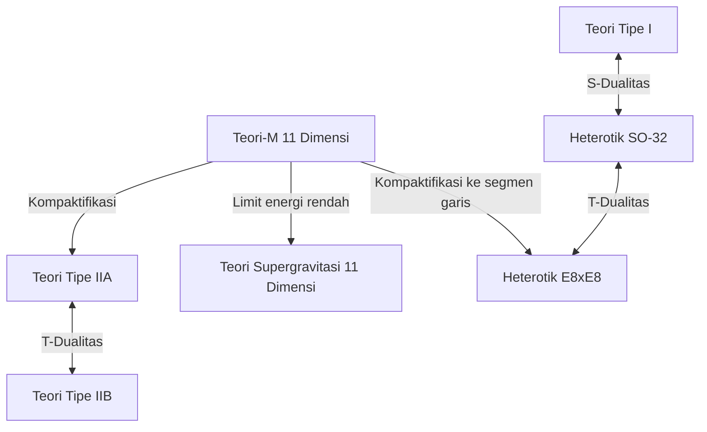

# Pendahuluan: Tantangan Menuju Mimpi Pamungkas Fisika "Teori Segala Sesuatu (TOE)"

Salah satu tujuan paling ambisius dalam fisika modern adalah membangun "Teori Segala Sesuatu (Theory of Everything: TOE)" yang mendeskripsikan secara terpadu empat gaya fundamental di alam semesta——gravitasi, gaya elektromagnetik, gaya lemah, dan gaya kuat. Model Standar (Standard Model) telah berhasil mendeskripsikan tiga gaya: elektromagnetik, gaya lemah, dan gaya kuat, serta partikel elementer yang terkait dengannya dengan tingkat presisi yang sangat tinggi. Namun, jika kita mencoba memasukkan "gravitasi" yang dideskripsikan oleh teori relativitas umum Einstein ke dalam kerangka mekanika kuantum, akan muncul kesulitan berupa nilai tak terhingga (ketidakmampuan renormalisasi), yang berujung pada keruntuhan teori yang fatal.

Sebagai satu-satunya kandidat terkemuka yang menjanjikan untuk memecahkan kontradiksi mendalam ini adalah "Teori Superstring (Superstring Theory)". Artikel ini akan mengupas tuntas gambaran epik teori superstring, dimulai dari pergeseran paradigma yang memandang unit terkecil materi bukan sebagai "titik" melainkan "dawai 1 dimensi", kompaktifikasi dimensi ekstra, matematika manifold Calabi-Yau, integrasi pamungkas melalui teori-M, hingga tantangan pengujian terbarunya.

---

## Bab 1: Keruntuhan Partikel Titik dan Pengenalan Dawai

### Kesulitan Nilai Tak Terhingga dalam Teori Medan Kuantum dan Ketidakmampuan Renormalisasi Gravitasi

Dalam Teori Medan Kuantum (Quantum Field Theory: QFT) konvensional, di mana partikel elementer diperlakukan sebagai "titik" tak bervolume, terdapat masalah bawaan: saat partikel berinteraksi satu sama lain, energi interaksi akan memancar hingga tak terhingga (divergen) pada batas jarak yang mendekati nol. Untuk gaya elektromagnetik, gaya kuat, dan gaya lemah, masalah ini bisa diatasi melalui metode matematika yang disebut "Teori Renormalisasi (Renormalization)"—yang dikembangkan oleh Sin-Itiro Tomonaga, Richard Feynman, dan Julian Schwinger. Metode ini memungkinkan nilai tak terhingga tersebut saling menghilangkan sehingga menghasilkan prediksi terhingga yang bermakna secara fisik.

Namun, jika kita memperkenalkan "graviton", sebuah partikel elementer yang belum diketahui pembawa gaya gravitasi, dalam upaya mengkuantisasi teori relativitas umum (membangun teori gravitasi kuantum), metode renormalisasi ini tidak berfungsi sama sekali. Karena konstanta kopling gravitasi (konstanta Newton) memiliki dimensi energi, semakin tinggi orde diagram Feynman (diagram loop) yang dihitung, akan semakin banyak divergensi tak terhingga yang baru muncul, sehingga dibutuhkan jumlah parameter tak terhingga untuk meniadakan semuanya. Hal ini disebut sebagai "ketidakmampuan renormalisasi gravitasi".

### Model Resonansi Ganda Yoichiro Nambu, Hidehiko Okada dkk., dan Dawai 1 Dimensi

Sejarah teori superstring dimulai dari sesuatu yang sama sekali tidak berkaitan dengan gravitasi. Pada tahun 1968, Gabriele Veneziano menemukan bahwa amplitudo hamburan (probabilitas hamburan) hadron, yang berinteraksi melalui gaya kuat, dapat dijelaskan secara luar biasa indah menggunakan fungsi beta Euler dalam matematika (Amplitudo Veneziano).

Makna fisik dari rumus matematika ini ditemukan oleh Yoichiro Nambu, Tetsuo Goto, serta Holger Nielsen dan Leonard Susskind. Pada tahun 1970, mereka menunjukkan bahwa jika kita berasumsi "hadron bukanlah partikel titik, melainkan benda bergetar seperti pita karet 1 dimensi dengan panjang terbatas," maka amplitudo Veneziano dapat diturunkan secara alami (Model Resonansi Ganda).

Aksi paling mendasar untuk mendeskripsikan gerakan "dawai" ini adalah Aksi Nambu-Goto (Nambu-Goto Action). Saat dawai bergerak melalui ruang-waktu, partikel titik akan menggambar garis (garis dunia), sedangkan dawai 1 dimensi menggambar permukaan 2 dimensi (lembar dunia: Worldsheet). Aksi Nambu-Goto didefinisikan sebagai besaran yang sebanding dengan luas dari lembar dunia ini.

$$ S = -T \int d\tau d\sigma \sqrt{- \det(\gamma_{ab})} $$

Di sini, $T$ adalah tegangan (Tension) dawai, dan $\gamma_{ab}$ adalah metrik terinduksi di atas lembar dunia. Meskipun aksi ini sangat indah secara geometris, kuantisasinya melibatkan penanganan akar kuadrat yang membawa kesulitan matematis.

### Aksi Polyakov (Polyakov Action) dan Invariansi Konformal

Oleh karena itu, Alexander Polyakov mengusulkan "Aksi Polyakov", sebuah aksi yang lebih mudah dikelola tanpa melibatkan akar kuadrat, namun setara dengan Aksi Nambu-Goto, dengan memperkenalkan metrik lembar dunia $h_{ab}$ sebagai medan bantu (auxiliary field).

$$ S = -\frac{T}{2} \int d^2\sigma \sqrt{-h} h^{ab} \partial_a X^\mu \partial_b X^\nu \eta_{\mu\nu} $$

Aksi Polyakov, selain memiliki invariansi reparametrisasi (Diffeomorphism invariance), juga memiliki "invariansi Weyl (Weyl invariance)" yaitu invarian terhadap transformasi skala lokal, yang berarti memiliki simetri konformal. Sifat sebagai Teori Medan Konformal (CFT) 2 dimensi ini kelak akan membentuk dasar matematis yang kuat dari teori dawai.

---

## Bab 2: Dawai Terbuka, Dawai Tertutup, dan Supersimetri

### Partikel Elementer sebagai Mode Getaran Dawai

Gagasan paling revolusioner dari teori dawai adalah konsep bahwa "partikel-partikel elementer yang jumlahnya tak terhingga di alam semesta ini hanyalah mode getaran (nada atas) yang berbeda dari satu dawai yang sama." Sama seperti dawai biola yang menghasilkan nada (frekuensi) berbeda dengan cara petikan yang berbeda, dawai-dawai sangat kecil yang mengambil keadaan getaran berbeda, akan tampak oleh kita sebagai partikel elementer dengan massa dan spin yang berbeda-beda.

Terdapat dua jenis dawai: "dawai terbuka (Open string)" yang memiliki ujung, dan "dawai tertutup (Closed string)" di mana ujung-ujungnya terhubung membentuk cincin.

### Partikel Gauge yang Dihasilkan oleh Dawai Terbuka dan Graviton oleh Dawai Tertutup

**Dawai Terbuka (Open String):**
Kedua ujung dawai terbuka tidak dapat bergerak bebas di ruang, melainkan menempel pada sebuah membran yang disebut D-brane. Jika kita menganalisis keadaan dasar (mode getaran energi terendah) dari dawai terbuka, akan muncul partikel vektor dengan massa nol dan spin 1. Hal ini merupakan perwujudan dari foton yang memediasi gaya elektromagnetik, dan gluon yang memediasi gaya kuat, yang disebut "boson gauge".

**Dawai Tertutup (Closed String):**
Di sisi lain, karena dawai tertutup tidak memiliki ujung, ia dapat merambat secara bebas melalui ruang-waktu tanpa terikat oleh brane. Jika kita mengkuantisasi dan menganalisis mode getaran dawai tertutup, secara mengejutkan partikel tensor dengan massa nol dan "spin 2" pasti akan muncul. Ini adalah partikel yang sama sekali tidak ada dalam Model Standar, dan memiliki sifat yang sama persis dengan "graviton", partikel perantara gravitasi yang diprediksi oleh teori relativitas umum.

Teori dawai pada awalnya tidak dirancang untuk mencakup gravitasi. Meskipun bermula sebagai teori gaya kuat, rumus matematikanya secara spontan menuntut keberadaan gravitasi. Fakta ini mengubah teori dawai dari sekadar model gaya kuat menjadi kandidat terkuat untuk "teori gravitasi kuantum" (sebuah usulan tahun 1974 oleh John Schwarz dan Joel Scherk).

### Keruntuhan Teori Dawai Bosonik (Kemunculan Tachyon) dan Aljabar Virasoro

Teori dawai generasi awal adalah "Teori Dawai Bosonik" yang hanya mendeskripsikan boson (partikel perantara gaya). Untuk menangani getaran dawai secara mekanika kuantum dengan benar, kita harus memastikan bahwa invariansi konformal tidak rusak (tidak ada anomali) dalam proses kuantisasi.

Simetri konformal pada lembar dunia 2 dimensi dideskripsikan oleh Aljabar Lie dimensi tak hingga, yaitu "Aljabar Virasoro (Virasoro Algebra)".
$$ [L_m, L_n] = (m - n)L_{m+n} + \frac{c}{12}m(m^2 - 1)\delta_{m+n, 0} $$
Di sini, $c$ disebut muatan pusat (central charge). Agar Teori Dawai Bosonik dapat berlaku tanpa kontradiksi matematis (kemunculan keadaan ghost), telah dibuktikan bahwa secara mengejutkan dimensi ruang-waktu $D$ haruslah "26 dimensi (25 dimensi ruang + 1 dimensi waktu)".

Namun masalah yang lebih fatal adalah keadaan energi terendah dari Teori Dawai Bosonik menjadi "Tachyon", yang massanya bernilai imajiner (massa kuadratnya bernilai negatif). Vakum di mana Tachyon berada tidaklah stabil, yang berarti teori ini gagal untuk menggambarkan realitas fisik.

### Pengenalan Supersimetri (Supersymmetry) dan Teori Superstring (10 Dimensi)

Untuk menyelesaikan masalah tachyon, dan kecacatan teori ini yang tidak mencakup fermion penyusun materi (seperti elektron dan quark), diperkenalkanlah "Supersimetri (Supersymmetry: SUSY)". Supersimetri adalah simetri yang mempertukarkan boson (partikel berspin bilangan bulat) dan fermion (partikel berspin bilangan setengah bulat).

Dalam "Teori Superstring (Superstring Theory)" yang memperkenalkan supersimetri ke dalam lembar dunia dawai, melalui operasi matematis yang disebut proyeksi GSO (Gliozzi-Scherk-Olive projection), telah ditunjukkan bahwa tachyon berhasil dihilangkan dari spektrum, dan pada saat yang sama supersimetri ruang-waktu direalisasikan.

Jumlah dimensi ruang-waktu yang menghilangkan anomali konformal dan menjadikan teori superstring konsisten secara matematis adalah "10 dimensi (9 dimensi ruang + 1 dimensi waktu)". Walaupun masih jauh berbeda dengan ruang-waktu 4 dimensi yang kita tinggali (3 dimensi ruang + 1 dimensi waktu), pengurangan drastis dari 26 dimensi menjadi 10 dimensi ini merupakan momen bersejarah ketika fisika semakin dekat dengan kenyataan.

---

## Bab 3: Revolusi Teori Superstring Pertama

Sejak akhir 1970-an hingga awal 1980-an, teori superstring hampir saja ditinggalkan oleh komunitas fisika, kecuali oleh segelintir peneliti yang sangat bersemangat. Ini karena mereka yakin bahwa kontradiksi matematis yang disebut anomali (anomaly) kuantum pasti akan muncul setiap kali teori gauge digabungkan dengan gravitasi.

### 1984: Keajaiban Penghapusan Anomali oleh Green dan Schwarz

Pada musim panas tahun 1984, Michael Green dan John Schwarz mencapai perhitungan bersejarah. Mereka membuktikan bahwa dalam teori superstring 10 dimensi yang memenuhi kondisi tertentu, anomali gauge dan anomali gravitasi dapat saling meniadakan secara sempurna di tingkat diagram segi enam (hexagon) Feynman, menjadi nol sama sekali.

Untuk mewujudkan keajaiban penghapusan ini, terungkap bahwa grup gauge yang berada di balik teori tersebut haruslah grup simetri raksasa tertentu. Ternyata hanya ada dua yang mungkin: **$SO(32)$** (grup ortogonal khusus dimensi 32) dan **$E_8 \times E_8$** (produk langsung grup pengecualian E8).

Penemuan ini mengguncang komunitas fisika secara luar biasa, dan memicu tren penelitian eksplosif yang disebut "Revolusi Teori Superstring Pertama". Jalan menuju Teori Segala Sesuatu pun seketika terbuka dengan jelas.

### 5 Teori Superstring yang Konsisten

Sejak penemuan Green dan Schwarz, penelitian melaju sangat pesat, dan pada akhirnya terungkap bahwa teori superstring 10 dimensi yang konsisten dapat diklasifikasikan ke dalam "5 jenis" berikut:

1. **Teori Tipe I**: Mencakup dawai terbuka dan dawai tertutup. Supersimetri adalah $N=1$. Grup gauge adalah $SO(32)$.
2. **Teori Tipe IIA**: Hanya dawai tertutup. Supersimetri adalah $N=2$, non-kiral (mempertahankan simetri paritas).
3. **Teori Tipe IIB**: Hanya dawai tertutup. Supersimetri adalah $N=2$, kiral (memecah paritas, mendekati sifat gaya interaksi lemah yang sesungguhnya).
4. **Teori Heterotik $SO(32)$**: Hanya dawai tertutup. Sebuah teori ganjil namun indah, hibrida antara getaran kanan (superstring 10 dimensi) dan getaran kiri (dawai bosonik 26 dimensi). Grup gauge adalah $SO(32)$.
5. **Teori Heterotik $E_8 \times E_8$**: Struktur hibrida serupa. Grup gauge adalah $E_8 \times E_8$. Teori ini sempat dianggap paling menjanjikan karena secara alami mampu memuat simetri Model Standar ($SU(3) \times SU(2) \times U(1)$).

Masing-masing dari kelima teori ini memiliki konsistensi yang sempurna secara matematis. Berdasarkan filosofi bahwa "Teori Segala Sesuatu harusnya hanya ada satu," keberadaan 5 kandidat ini menjadi misteri besar bagi para fisikawan di masa itu.

---

## Bab 4: Kompaktifikasi Dimensi Ekstra dan Manifold Calabi-Yau

Ruang-waktu "10 dimensi" yang dituntut oleh teori superstring jelas bertentangan dengan dunia "3 dimensi ruang + 1 dimensi waktu (total 4 dimensi)" yang biasa kita rasakan. Lalu, di manakah sisa 6 dimensi ruang tersebut (Dimensi Ekstra: Extra Dimensions) bersembunyi?

### Silsilah dari Teori Kaluza-Klein

Konsep tentang dimensi ekstra sendiri sebenarnya jauh lebih tua dari teori dawai, berawal dari Theodor Kaluza dan Oskar Klein pada 1920-an. Mereka memperluas teori relativitas umum menjadi 5 dimensi (4 dimensi ruang + 1 dimensi waktu), dan menggulung dimensi ruang ke-4 menjadi ukuran lingkaran yang sangat kecil (kompaktifikasi), sehingga berhasil menurunkan gravitasi dan gaya elektromagnetik secara menyatu dalam ruang 4 dimensi. Struktur geometri dimensi ekstra pada energi rendah akan muncul sebagai "gaya (medan gauge)".

### Manifold Kähler yang Datar-Ricci: Ruang Calabi-Yau

Untuk menarik keluar fisika 4 dimensi realistis dari teori superstring 10 dimensi, sisa 6 dimensi tersebut harus digulung menjadi ukuran sangat kecil mendekati panjang Planck ($10^{-35}$ meter), yang disebut "Kompaktifikasi (Compactification)". Penggulungan ini tidak bisa sembarangan dilakukan, melainkan harus memenuhi batasan fisik yang ketat, yaitu menyisakan setidaknya satu supersimetri $N=1$ di ruang 4 dimensi (untuk menyelesaikan masalah hierarki dan menurunkan fermion).

Pada tahun 1985, Philip Candelas, Gary Horowitz, Andrew Strominger, dan Edward Witten membuktikan bahwa 6 dimensi ekstra ruang ini harus berupa manifold kompleks khusus yang memenuhi syarat matematis tertentu.

Syaratnya adalah ia harus berupa "manifold Kähler kompak yang datar-Ricci (Ricci-flat)". Ruang geometris ini diprediksi keberadaannya oleh matematikawan Eugenio Calabi, dan secara matematis dibuktikan oleh Shing-Tung Yau, sehingga ruang ini disebut sebagai "**Manifold Calabi-Yau (Calabi-Yau manifold)**".

### Karakteristik Euler dan Jumlah Generasi Quark

Struktur topologi dan "lubang" yang sangat rumit serta sulit dipahami pada ruang Calabi-Yau inilah yang sepenuhnya menentukan sifat-sifat partikel elementer di dunia 4 dimensi tempat kita tinggal.

Sebagai contoh, telah ditunjukkan bahwa setengah nilai absolut dari "karakteristik Euler (Euler characteristic)"—besaran invarian yang mengkarakterisasi topologi manifold—setara dengan "jumlah generasi partikel elementer" yang muncul di dunia nyata. Karena Model Standar memiliki 3 generasi quark dan lepton (Up-Down, Charm-Strange, Top-Bottom), maka mencari ruang Calabi-Yau dengan karakteristik Euler $\pm 6$ menjadi tugas paling krusial dalam fenomenologi teori dawai.

### Keajaiban Simetri Cermin (Mirror Symmetry)

Penelitian manifold Calabi-Yau juga membawa terobosan luar biasa di bidang matematika murni. Fisikawan menemukan bahwa dua ruang Calabi-Yau dengan topologi yang sama sekali berbeda (pasangan cermin), dalam teori dawai ternyata menggambarkan fenomena fisika yang persis sama. Inilah yang disebut "Simetri Cermin".

Secara matematis, persoalan perhitungan yang tadinya sangat sulit di satu manifold (misalnya menghitung jumlah kurva rasional dalam geometri enumeratif) secara mengejutkan dapat diselesaikan dengan mudah melalui simetri cermin dengan mengubahnya menjadi persoalan integral di manifold pasangannya. Fenomena ini mengejutkan para matematikawan. Teori dawai bukan hanya sebuah teori fisika, melainkan juga berfungsi sebagai "alat deteksi pamungkas" untuk menemukan matematika mendalam yang belum diketahui.

---

## Bab 5: Revolusi Teori Superstring Kedua dan Teori-M

Hingga pertengahan 1990-an, kelima teori superstring tersebut dianggap sebagai teori yang terpisah satu sama lain. Namun pada tahun 1995, melalui presentasi bersejarah oleh Edward Witten di Konferensi Internasional Strings di University of Southern California, situasi tersebut berubah drastis. Itulah pembuka dari "Revolusi Teori Superstring Kedua".

### Kamus Ajaib Bernama Dualitas (Duality)

Witten membuktikan secara elegan, dengan menggunakan konsep yang disebut "Dualitas (Duality)", bahwa 5 teori superstring yang tampaknya sama sekali berbeda itu sebenarnya hanyalah sisi berbeda dari sebuah "teori pamungkas tunggal". Dua dualitas utama adalah:

- **T-Dualitas (Target-space Duality)**: Jika jari-jari ruang yang dikompaktifikasi adalah $R$, maka teori dengan jari-jari $R$ secara fisik akan sepenuhnya ekuivalen dengan teori berjari-jari $1/R$. Melalui dualitas ini, ditunjukkan bahwa Teori Tipe IIA berhubungan dengan Tipe IIB, begitu pula kedua teori Heterotik. Lewat sudut pandang teori dawai, alam semesta super kecil dan raksasa pada dasarnya tidak bisa dibedakan.
- **S-Dualitas (Strong-weak Duality)**: Jika konstanta kopling interaksi dimisalkan $g$, maka teori dengan konstanta kopling besar (interaksi kuat) ekuivalen dengan teori lemah yang konstantanya $1/g$. Ini menghubungkan Teori Tipe I dengan Teori Heterotik SO(32), dan memungkinkan kalkulasi di wilayah interaksi kuat yang sebelumnya tak dapat dihitung, dengan menggunakan ekuivalensinya di teori interaksi lemah.

### Penemuan D-brane

Bertepatan dengan penemuan Witten, Joseph Polchinski mendefinisikan dengan jelas konsep "**D-brane (D-brane)**" dan membuktikan peran pentingnya dalam teori dawai. D-brane adalah "membran berdimensi lebih tinggi" yang wujudnya merupakan tempat menempelnya titik-titik ujung dawai terbuka (huruf D berasal dari syarat batas Dirichlet).

D-brane menjadi komponen tak terpisahkan dari teori dawai, misalnya dalam mengungkap asal-usul mikroskopis entropi lubang hitam (pencapaian Strominger dan Vafa pada tahun 1996). "Hipotesis Brane World", yang mengajukan probabilitas bahwa alam semesta kita adalah sebuah D3-brane raksasa (membran spasial berdimensi 3), juga bersumber dari konsep ini.

### "Teori-M" Dimensi 11 yang Menyatukan Segalanya

Witten, yang telah merangkum kelima teori superstring melalui jaringan dualitas, mengajukan "**Teori-M (M-theory)**" sebagai teori tingkat lebih tinggi yang mengintegrasikannya.

Secara mengejutkan, ruang-waktu tempat teori-M beroperasi adalah "11 dimensi (10 dimensi ruang + 1 dimensi waktu)". Saat kita mendorong konstanta kopling teori Tipe IIA menuju tak hingga, sebuah dimensi ruang ekstra (dimensi ke-11) yang tersembunyi akan muncul sebagai lingkaran, dan terungkaplah bahwa "dawai" 1 dimensi tersebut sebenarnya merupakan manifestasi "membran (membrane)" 2 dimensi yang menggulung.

Makna sebenarnya dari huruf "M" dalam teori-M (Membrane, Magic, Mystery, Matrix, Mother, dll.) sengaja dibiarkan membingungkan oleh Witten sendiri. Bahkan hingga saat ini perumusan matematis lengkap dari teori-M (persamaan dasar) masih belum ditemukan, menjadikannya salah satu problem tak terpecahkan terbesar di fisika modern. Meski begitu, berkat prinsip holografi (Korespondensi AdS/CFT), berbagai potongan sifatnya secara bertahap mulai bisa dipahami.

*(Catatan: Diagram kesatuan dari 5 teori superstring yang terikat oleh dualitas, dengan berpusat pada Teori-M)*

---

## Bab 6: Lanskap Dawai dan Tantangan Pengujian

Teori superstring telah sekian lama berjaya sebagai kandidat terkuat Teori Segala Sesuatu, namun karena teori ini adalah fisika, pengujian lewat eksperimen maupun observasi mutlak diperlukan. Tapi, dinding raksasa berdiri menghadang jalan tersebut.

### $10^{500}$ Jumlah Vakum: Lanskap Dawai dan Prinsip Antropik

Terdapat kombinasi yang tak terhingga dari konfigurasi topologi manifold Calabi-Yau, penempatan letak D-brane, hingga formasi flux (mirip garis medan magnet) yang meliliti manifold tersebut. Berdasarkan perhitungan di awal tahun 2000-an (seperti dalam skenario KKLT), terungkaplah bahwa jumlah keadaan vakum stabil maupun metastabil (kandidat pola alam semesta) yang dimungkinkan oleh teori dawai bisa mencapai jumlah luar biasa yang melebihi angka **$10^{500}$** kemungkinan.

Hal ini disebut sebagai "**Lanskap Dawai (String Landscape)**". Ini berarti teori dawai bukan lagi teori yang berhak menentukan secara tunggal satu-satunya hukum alam semesta kita, tetapi merupakan sebuah tatanan kerangka pembuat multiverse (alam semesta ganda/beragam alam semesta yang tak terhitung jumlahnya) yang mengandung segala ragam bentuk hukum fisika yang dapat dibayangkan.

Fakta tersebut lantas menyulut perdebatan luar biasa tajam dalam dunia fisika. Untuk menjawab pertanyaan "Mengapa alam semesta kita memiliki keseimbangan hukum yang begitu apik saat ini (seperti presisi nilai konstanta kosmologis yang sangat kecil, serta keseimbangan luar biasa tepat pada massa-massa partikel)," para pakar terpaksa melontarkan gagasan penerapan perumusan "Prinsip Antropik (Anthropic Principle)". Ini berbunyi, "Dari begitu banyak jagad raya tak terhitung jumlahnya yang eksis di alam eksistensi kemajemukan ini, sudahlah menjadi suatu kepastian tak terbantahkan (keniscayaan) kalau kita bisa mengobservasi keberadaan diri kita di dalam jagad raya yang memang diberkahi dan dirancang mendukung serta menyediakan kelayakan bagi kehidupan entitas cerdas seperti kita ini". Walaupun pandangan argumen hal tersebut disokong dengan dukungan amat kuat salah satunya oleh para pemikir terkemuka seperti Leonard Susskind, tak kurang banyak pula barisan para fisikawan yang serentak menentangnya mentah-mentah atas landasan prinsip anggapan ketidakmampuan hal itu untuk difalsifikasi.

### Konjektur Swampland (Rawa-rawa)

Dalam kurun waktu beberapa tahun terakhir ini, mengemuka sebuah konsep terusan tawaran alternatif rancangan pendekatan guna mencoba merespon keadaan lanskap yang diajukan oleh Cumrun Vafa dan kawan-kawannya, yang diberi tajuk perumusan "**Konjektur Swampland (Swampland/Rawa-rawa)**" yang mendadak melesat menyita perhatian.

Model teori efektif (model penjabaran tatanan fisika bagi batas ukuran energi skala rendah) yang sekilas jika dilihat tampak konsisten secara utuh tak terbantahkan, tetapi jika dilihat secara teliti ternyata tidak akan mampu disatukan secara rapi ke dalam panggung perumusan teori gravitasi kuantum (teori dawai) tersebut; lalu kumpulan model tak berkorelasi inilah yang dinamai sebagai himpunan Swampland. Berbekal landasan konjektur inilah, barisan tim peneliti yang dipimpin oleh Vafa terus secara intens menyusun serta mengemukakan rentetan ketetapan berbekalkan prasyarat kriteria-kriteria pembatas (Kriteria Swampland) yang sifatnya mutlak sangat mengikat secara kuat. Salah satunya seperti "gravitasi diharuskan selalu menempati kedudukan takar porsi wujud kekuatan yang paling terlemah (Konjektur Gravitasi Lemah)", serta persyaratan lainnya semisal "adanya ketetapan pembatas yang sedemikian kuat dalam ekspansi penggelembungan peregangan akselerasi laju jagad raya yang disorong oleh energi gelap (Konjektur de Sitter)".

Dengan bantuan konjektur Swampland, diprediksikan bahwa himpunan kemungkinan Lanskap Dawai yang maha dahsyat yang disebut-sebut jumlahnya melebihi $10^{500}$ itu akan sanggup terus ditekan menyusut dipersempit rentang jangkauan jumlah batasannya untuk ditarik menuju kepada kriteria persyaratan letak kemungkinan semesta jagad raya yang nyata bisa di-verifikasi dalam observasi saja.

### Tantangan Tanpa Henti Melakukan Verifikasi Eksperimen

Bukti mutlak teramat sangat langsung dari terkuaknya eksistensi keberadaan teori dawai menuntut keberadaan pembuktian dalam takaran Skala Energi Planck (yakni kebutuhan wujud pemercepat partikel/kolider berskala seukuran jagad benua galaksi), dan dalam praktek kenyataannya secara gamblang memang sesuatu yang mutlak teramat mustahil. Namun, pencarian ragam jalan perwujudan verifikasi dari terusan wujud metode pendekatan uji pencarian kebenaran tidak langsung senantiasa gigih diusahakan dengan segenap tenaga hingga masa kini.

1. **Pengamatan Gelombang Gravitasi Primordial:**
   Pengamatan yang menitikberatkan pengawasan berjalannya pantauan jejak peninggalan keberadaan sisa rentang getaran "gelombang gravitasi primordial" yang disinyalir terpancar terlahir saat awal fase proses era inflasi kosmik saat semesta diciptakan yang mana terekam tercetak membekas di atas sisa wujud polarisasi (B-mode) dari rentangan sebaran gelombang Latar Belakang Gelombang Mikro Kosmik (Cosmic Microwave Background/CMB) yang kelak diekspektasikan sukses tertangkap di pengamatannya (seperti terproyeksi melalui bantuan satelit semisal LiteBIRD). Keberhasilannya kelak bakal mampu menyediakan fasilitas sarana memverifikasi rumusan pemetaan tatanan formasi model inflasi yang berkarakteristik kekhasan unik hanya kepunyaan penjabaran struktur tatanan usulan dari teori dawai saja.
2. **Sinar Kosmik Ultra-Energi Tinggi dan Lubang Hitam Mini:**
   Eksperimen pembuktian yang ditujukan atas pengujian yang dilaksanakan pada perwujudan akselerator supercanggih milik CERN di fasilitas mesin raksasanya "Large Hadron Collider (LHC)" pernah amat diharapkan berpotensi menjadi ajang pembuktian wujud pemicuan terciptanya pendaratan eksistensi "lubang hitam mini" yang mengisyaratkan sinyal terbuktinya eksistensi keberadaan letak alam keberadaan struktur dimensi ekstra, tak lupa ditujukan membuktikan kriteria temuan pantauan adanya kemungkinan hilangnya rentang sebaran besaran rentangan ukuran perwujudan tatanan energi (missing energy) yang tersinyalir diakibatkan 'lari lepas lenyapnya' eksistensi rentang jelajah si graviton tersebut menuju menyusup lari memasuki alam ruang di dimensi eksistensi alam batas dimensi ekstranya. Situasi rupa wujud kenyataannya di saat sekarang malah sama sekali menyajikan bukti nihil ditemukannya pemetaan bukti tak terbantahkan, dan hasil pengamatan ini alih-alih justru kian menempatkan batasan takaran batas maksimum atas nilai ukuran skala batas wujud letak keberadaan si dimensi ekstra yang makin menciut ukurannya.
3. **Dawai Kosmik (Cosmic String):**
   Ini bertumpu mengandalkan peluang pembuktian akan berwujudnya potensi pendaratan eksistensi perwujudan observasi pada keberadaan semacam peninggalan bentuk bentang dawai kosmik yang amat luar biasa berukuran gigantik tak terhingga berwujud skala makro yang merentang wujud membentang di angkasa (Dawai Kosmik/Cosmic String), yang keberadaannya dipercaya terekam terlahir wujud terbentuk dalam hasil jejak terusan pancaran tahap awal masa fase proses transisi dari penguraian kosmos masa lalu semesta; yang keberadaannya diharapkan sanggup dibuktikan melalui pemantauan munculnya rekaman fenomena lentur pelensaan gravitasi (Gravitational Lensing) atau lewat rekaman letupan (burst) pada gelombang gravitasi.

## Kesimpulan: Perjalanan Tiada Henti Menuju Kebenaran Pamungkas

Teori superstring diyakini dan tak diragukan lagi adalah satu struktur penguraian pencapaian wujud tertinggi hasil pengetahuan intelektual pemikiran pemahaman otak pemahaman kognitif wujud perwujudan hasil peradaban kemanusiaan yang tertinggi, agung, serta yang sungguh menempati perwujudan kasta nilai kedudukan tertinggi dari kacamata hitungan pesona nilai matematisnya. Lompatan secara terkonseptual berkat revolusi pandang pergeseran penjabaran pergeseran yang bermula mengalihkan tata perwujudan perlakuan bagi si titik partikel hingga menyuguhkannya mewujud tampil jadi lilitan dawai, berlanjut terus beruntun diiringi peralihan tatanan yang menyajikan pergeseran rupa konsepsi turunan rentang pandangan dimensi ekstra-nya hingga disulap menyuguhkan kemunculan tawaran formasi penguraian perumusan wujud selubung membran (Teori-M), bahkan menyodorkan rentang sajian letak usulan bahwasanya perumusan struktur susunan ruang-waktu pada intinya tidak lagi diakui berdiri sebagai wujud penyusunan bingkai fundamental yang mutlak; alih-alih ia mengajukan sebuah konsep tawaran yang menyuguhkan gagasan seolah rupa kerangka ruang waktu ini diyakini tiada lain sekadar hanya satu rupa cerminan "ilusi penampakan/hologram" belaka yang tak lain pancaran muncul (emergence) sebagai hasil dari konsekuensi bentukan bentangan geometri tatanan keberadaan wujud letak alam dimensi yang nilainya jauh lebih mendalam letaknya dari yang bisa tergambarkan.

Kurangnya keberadaan wujud ketersediaan pembuktian penyediaan landasan hasil rekaman observasi pendaratan data yang tak terbantahkan langsung dalam verifikasi praktisnya dari pembuktian alat uji tak ayal merupakan poin terlemahnya yang mengundang hantaman badai gelombang terjangan rupa tajam hujaman kritikan deras menghakiminya bahwa "Teori dawai ini tak lebih tak kurang sejatinya bukanlah wujud tatanan hitungan hasil ranah ilmu fisika murni melainkan sekadar kalkulasi tatanan perwujudan teori peramalan matematika semata, tak ubahnya hanya sejajar kedudukan posisi martabatnya bak perumusan tatanan wujud buah rumusan falsafah sekadar obrolan konsep diskusi perdebatan argumen filsafat". Walaupun demikian faktanya, rupa tawaran tatanan rupa pemecahan usulan formulasi gagasannya memegang andil memberikan panduan pencerahan mengurai rupa misteri sengkarut atas jalan mencari pencerahan rumusan atas kebuntuan hal misteri wujud terusan jalan penyelesaian paradoks informasi dalam masalah di ranah keberadaan lubang hitam; demikian juga tawaran kerangka hitungannya melesat berhasil berprestasi mengibarkan jasa penyediaan pemecahan rupa perangkat sumbangsih sarana berhitung dari keberadaan rumusan prinsip Korespondensi AdS/CFT yang sanggup merumuskan rentang terusan bentang kerangka penjabaran sarana taktik penyelesaian secara utuh benar-benar wujud hal rupa hitungan serba mutlak paling baru yang amat berguna dipergunakan meretas rumusannya pada penjabaran ragam ranah fisika sub-ilmu penyebaran hitungan pengkajian rentang bentukan material tatanan benda yang berkorelasi interaksi hitung berangka kriteria kopling tingkat kuat nilainya (antara lain di kajian superkonduktor); semuanya berhasil menegaskan posisi letak keberadaan sumbangsih peran mutlak penting bagi struktur panggung eksistensi dari perwujudan bentuk pemanfaatan nilai hitungan nilai guna teori dawai yang secara sah sungguh telah mampu begitu merasuk sukses dalam mengukir tancapan jejak akarnya secara mapan nan lekat menyusup merajai wujud panggung pengerjaan penyelesaian ragam luas terapan penjabaran ranah ranah bentang fisika-teori, menjadikannya seakan rupa tata kosa kata 'bahasa perantara' yang sedemikian sungguh mutlak teramat absolut vital diperlukan penggunaannya di zaman modern ini.

Kini dan hingga saat ini pun umat peradaban manusia masih belum jua sukses sepenuhnya memegang formulasi wujud turunan hitungan struktur utuh wujud kebenaran sejati nilai yang terselubung menyusun atas rupa raut jati diri murni wajah kepastian untuk kebulatan atas panggung tatanan eksistensi seutuhnya dari si Teori-M. Lalu, wujud rupa konfigurasi pemetaan macam apatah sejatinya bentuk profil tata raut sesungguhnya perihal wujud ke-enam tambahan letak lipatan ranah ekstra ekstra dimensi tersebut bersemayam berkerut berpilin melipat mendekam bersarang membenam tak kentara dalam balutan gelap teka teki lorong sempit kordinat struktur jajaran di ranah sebaran perwujudan dimensi spasial bentukan milik semesta dimensi di ruang letak perwujudan milik ruang tatanan kordinat Calabi-Yau itu, bersanding dengan misteri tanda tanya terbesar penantian pendaratan pada rentangan rupa tata pembagian batasan peta yang di posisi wilayah berapakah kiranya ruang letak kordinat pasti pendaratan tak terbantahkan tempat mendaratnya bumi semesta tempat kita memijak di antara besaran rincian kalkulasi total atas segenap keseluruhan himpunan peta formasi tata ruang keberadaan keseluruhan total jumlah tak berhingga tak tertakar berisikan $10^{500}$ perihal rincian sebaran perwujudan wujud lanskap ini berada; guna meretas rincian pemahaman guna demi tibanya satu detik hari tatkala kelak rahasia misteri seluruh teka-teki raksasanya rincinya ini berhasil akhirnya dipahami dicerna dilucuti ditiadakan keraguannya hingga sirna musnahnya misterinya menemu jalan cerah keberhasilannya terjawab diretas, gairah dan ikhtiar perjuangan yang teriring tak ayal pantang menyerah tiada lelah pudar lekas mundur sirna dalam jerih payah meretasnya tak henti berkelanjutan tak reda ditorehkan dipikul digelorakan tiada padam senantiasa berkobar ditekuni tiada henti oleh segenap pelopor peneliti pahlawan pahlawan para fisikawan hari ini hingga di hari-hari di depan nanti.

---

## Lampiran: Latar Belakang Matematika Tingkat Lanjut Penopang Teori Superstring

Dalam bab bahasan tulisan penjabaran bahasan inti di atas bahasan memang khusus telah memprioritaskan mendahulukan menyajikannya membedah rupa pemaparan berpusatkan sajian titik poin pengertian penjelasan penguraian berwujud bahasan pendaratan di tataran pandangan pengertian intuitif saja; lantas dalam rentang bagian ranah sesi pelengkap pamungkas rupa di bagian sini kita kini menyajikan menjabarkannya memperluas bentang pengupasan pada rupa rentang wujud paparan penjabaran rincian spesifik yang sedemikian wujudnya menyangkut menguliti menjabarkan detail pembedahan peruntukan wujud mendalam perihal rumusan-rumusan tata formasi kalkulasi perumusan hitungan matematika beserta pilar formasi landasan panggung tatanan struktural rumusan bentuk dimensi secara geometris pilar pengokoh perwujudan penahan kekokohan berdirinya panggung absolut tatanan dari rupa teori dawai-super ini.

### A. Formulasi Lengkap Aksi Polyakov dan Teori Medan Konformal 2 Dimensi (CFT)

Formulasi yang membidani rupa usulan perumusan penjabaran dari rupa hukum letak tatanan rincian kalkulasi yang mensimulasikan wujud usulan pergerakan lintas jejak kordinat letak penyusuran turunan arah jejak tatanan bagi letak rentang si dawai sepanjang tata kordinat di dalam batasan tatanan formasi dimensi letaknya dalam tata perwujudan ruang dan waktu, yang terekam pada perwujudan rupa hamparan kanvas dimensi formasi penjabaran bagi rentang struktur dimensi bentangan hamparan di wujud tatanan "Lembar Dunia-nya (Worldsheet)", maka tata penyusunan rupa hukum pembatas perhitungan panggung turunan atas "Aksi Polyakov" diformulasikan turunannya disajikan ke dalam besaran wujud struktur rumus matematika sedemikian berikut ini wujud rumusannya:

$$ S_P = -\frac{T}{2} \int d^2\sigma \sqrt{-h} h^{\alpha\beta} \partial_\alpha X^\mu \partial_\beta X^\nu \eta_{\mu\nu} $$

Sebagai penjabarannya, nilai di rincian rumusan $X^\mu(\tau, \sigma)$ tersebut wujudnya merupakan perwujudan wujud bentuk formasi sarana rentangan pemetaan yang bermula ditujukan melesat mentranslasikan menyalin tata letak koordinat awal formasi nilai dari kordinat aslinya di wujud letak di bagian ranah lembar dunia (Worldsheet) senilai letak kordinat dalam ukuran awal rupa aslinya dari tatanan bentukan asal nilainya dengan tata formasi ukuran nilainya yang ditunjuk bernilai sebesar ukuran kordinat yang tertulis di dalam struktur nilai parameter perwujudannya dari rentangan awal dimensi awal mula letak koefisiennya dengan ukuran terhitung sejumlah sebarannya bernilai pada rentang posisi parameter formasi awalnya terlukis bernilai koefisien rincian hitung $(\tau, \sigma)$ agar lantas kelak nilainya itu diteruskan di petakan menyebrang menerjemahkan titik keberadaannya diteruskan menembus lantas memancar ditujukan dilanjutkan terpetakan tatanan salinan wujud translasinya menempati menyasar pada kedudukan rincian ruang kordinat salinan pendaratannya ditujukan pendaratan titik kordinat posisi terusan rentangnya itu terproyeksikan tatanan tempat pendaratan salinan letak kordinat salinan posisi akhirnya ke dalam wujud ranah penyusunan tatanan di kordinat bagi letak penampang susunan dari rupa posisi tatanan bagi bingkai susunan dari dimensi turunan bagian letak bagi bentukan kerangka bentangan perumusan letak dimensi target pendaratan akhir rupa kordinat ruang letak pada ruang formasi rupa pendaratan rentang bagi kordinat ruang penampang letak dimensi pendaratan letak salinannya tatanannya pada "Ruang-waktu sasarannya (Target Space)". Sifat paling mendasar nan tak boleh tak musti dipenuhi wajib mutlak selalu dijaga terpelihara tak tergoyahkan tak terlanggar cacat nilai di wujud pembatas struktur letak rupa aksi nilai hitungan pada pembuktian rumusan dari perwujudan kriteria turunan rumus nilai koefisiennya ini; adalah kepastian terjaganya tak cacat seutuhnya atas kepatuhan memenuhi pemenuhan berpegang rupa persyaratan kepemilikan mengikat bagi tiga perwujudan rentang pilar struktur ketetapan wujud simetri bersyarat yang mengikat di panggung lokal pembatasnya dengan paparan kriteria seperti dirangkum rincian syaratnya sebagai di rupa syarat berikut di uraian paparan wujud pembagian syarat lokal-nya ini:
1. **Invariansi Difeomorfisma 2 Dimensi (Diffeomorphism invariance):** Bentuk yang tak terguncang nilainya/invarian menghadapi rentang penanganan turunan perwujudan pergeseran transformasi di sumbu titik kordinat lembar dunianya yang disajikan dalam bentangan bentuk ukuran transformasi dengan penulisan format rincian rumusan formasi perhitungannya direpresentasikan nilainya berwujud rentang hitungannya sejumlah transformasi di wujud kalkulasi angka hitungan perwujudan koefisien ukur bernilai tertulis sebagai $\sigma^\alpha \to \sigma^{\prime\alpha}(\sigma)$.
2. **Invariansi Poincaré 2 Dimensi:** Rincian wujud nilai tidak terganggu invarian (invarian) bagi wujud perwujudan proses penanganan berlakunya pengaplikasian dari penerapan rupa transformasi secara paralel menyilang menembus tatanan perwujudan letak rupa struktur di koordinat ruang tatanan waktu sasaran destinasinya itu; begitupula senantiasa tidak tergoyah (invarian) nilai keutuhan kriteria nilainya sewaktu dilaksanakannya formasi berlakunya tahapan dari pelaksanaan turunan proses perhitungan pada tahapan perwujudan proses pemberlakuan kriteria formasi dari metode rupa turunan di rumusan hitungan turunan dalam transformasi berdasar rupa penerapan nilai rupa transformasi metode milik ranah kriteria hitungan dari rupa bentukan turunan metode hitungan wujud penjabaran transformasi milik ranah "Lorentz".
3. **Invariansi Weyl (Weyl invariance):** Wujud kepatuhan konsistensi rincian invarian/ketidakterpengaruhan terhadap pengaplikasian turunan bentukan transformasi bernilai skala ukuran nilai di tatanan teritori perhitungan turunan nilainya di ranah bagian kawasan perlakuan berskala di lokasi lokal terbatas khusus untuk hitungan koefisien turunan bagi ukuran bagian nilai bentuk tata letak bentukan hitung pada turunan besaran formasi turunan letak besaran ukuran metrik bentuk ukuran rincian metrik besaran dari besaran perhitungan turunan tensor-nya yang dikenai nilai wujud ukuran pengaliannya tersajikan pada parameter hitungan turunan penulisan koefisien bentukan yang ditulis bernilai sebagai rupa perhitungan $h_{\alpha\beta}(\sigma) \to e^{2\omega(\sigma)}h_{\alpha\beta}(\sigma)$.

Meskipun dalam pandangan fisika klasik besaran "Invariansi Weyl" terus tertahan utuh, sewaktu dilangsungkannya kuantisasi dengan memanfaatkan penerapan kalkulasi pengintegrasian jejak (Path Integral), dari turunan perhitungan Jacobian maka suatu "Anomali Konformal (Conformal Anomaly)" terlahir memunculkan rupa rinciannya. Untuk membatalkan munculnya anomali dan menuntut tetap terjaganya Invariansi Weyl, kalkulasi membuktikan perlunya kontribusi bawaan dari keberadaan "Ghost Field (Faddeev-Popov ghost)" yang wajib menetralkan unsur materi tersebut secara sempurna bersandingan dengan unsur wujud dari (sebagaimana dipetakan dalam perhitungan wujud $X^\mu$). Perkara inilah yang secara tepatnya merumuskan kebulatan pendorong kekuatan matematis penentu, di mana dalam Dawai Bosonik memutlakkan dimensi $D=26$, dan bagi bingkai panggung Teori Superstring menjadi $D=10$.

### B. Manifold Calabi-Yau dan Kerataan Ricci (Ricci-flat) dalam Matematika

Demi tujuan membuktikan kerangka penjabaran turunan valid mendesak rupa formulasi perumusan wujud turunan dari panggung asal mula 10 dimensi dari Teori Superstring lantas ditarik meretas menyasar diteruskan penjabarannya berujung bermuara menuju kerangka penguraian atas rupa pengupasan perihal bentang hitungan teori dari rupa penjabaran dimensi kordinat batas ukuran teori perhitungan panggung secara efektif pada batasan ukuran perumusan turunan 4 dimensi yang rupa kenyataannya bisa tercerna tertampak sebagai satu keniscayaan bagi pendaratan muaranya, tak lain menuntut dipatuhinya wujud kriteria satu persyaratan khusus akan pengkompaktifikasian batasan dimensinya. Untuk menembus menaati tuntutan prasyarat dalam kaidah skema formasi wujud dari kriteria tata bentuk rupa pengajuan pengerjaan tahapan untuk pengerjaan "Kompaktifikasi" ini, maka wujud formasi yang disyaratkan wajib ada adalah sebuah tuntutan mutlak yang menegaskan keniscayaan kepastian prasyarat yang begitu krusial, yang wajib tersajikan keberadaannya melekat pada penataan perihal struktur kerangka bagian tatanan sisa peruntukan perwujudan wujud letak di bagian ke-6 keberadaan wujud rupa tatanan di dalam formasi letak batasan penyebaran sebaran rupa kordinat perwujudan wujud dimensi ekstra (di tatanan dimensi tambahan) miliknya tersebut yaitu pada (kordinat formasi peruntukan batasan perwujudannya dari $K$). Rincian prasyarat absolut pemenuhannya mutlak mensyaratkan dipastikannya dipeliharanya secara mutlak keberadaan kemunculan keberadaan penyediaan perwujudan letak kedudukan keberadaan bentukan perihal berlakunya letak eksistensi bagi sebentuk nilai hitung penyusunan penjabaran tatanan bagi batasan ukuran rupa penjabaran pembatas untuk sebuah kriteria ukuran syarat tatanan keberadaan wujud bagian Supersimetri yang utuh (yaitu parameter penjabaran perihal tatanan wujud yang diartikan wujud formasi parameter besaran kordinat ukuran nilai dari struktur tatanan perwujudan letak koefisien dari hitungan ukuran turunan besaran pendaratan nilainya dari bagian kordinat ukuran nilai wujud si struktur letak perhitungan kordinat dari turunan dari panggung hitung si medan spinor itu pada kenyataannya harus wujudnya terus-terusan wajib terbukti berwujud tetap konstan secara nilai penjabaran dari ukuran hitungan dari rupa formasi rupa kovariannya tersebut secara mutlak mematuhinya utuh) maka wujud kriteria tersebut benar-benar adalah sebuah ketetapan kriteria batas syarat yang pada kenyataan realitasnya sungguh sedemikian patuh menuntut pembuktian dipatuhinya rincian formasi peruntukannya. Sebagai kelanjutan penyusunan formasi prasyaratnya ini; lantas perihal pembuktian formasi di kelanjutan tahapan pemenuhannya, hal kriteria itu maka wajiblah hukumnya untuk formasi pemenuhan wujud pembuktian tersebut benar-benar wajib mutlak berujung mensyaratkan pemenuhan atas berlakunya terbukti dipenuhinya kepatuhan terhadap perhitungan rupa kriteria tuntutan pembatas perwujudan kepatuhan terwujudnya rincian penjabaran kalkulasi rumusan rincian persamaan di diferensial bersyarat rincian turunan yang wajib membuktikan bernilainya parameter rincian kordinat bagi pembuktian nilai pada si $\nabla_m \eta = 0$ (untuk si kordinat formasi penjabaran dari nilainya dari $\eta$ tiada lain wujudnya ialah besaran perwujudan wujud tatanan bagi wujud formasi keberadaan rincian si spinor intrinsik).

Maka demi mampu patuh dalam mematuhi kondisi perlakuan hal persyaratannya, formasi grup wujud turunan klasifikasi besaran tatanan rupa bagi ukuran nilai himpunan di grup kriteria bagi besaran turunan parameter grup untuk nilai grup bagi batasan penampang holonomi-nya, yang sedemikian letaknya bertaut pada formasi struktur di tata kordinat panggung wujud nilai letaknya di kordinat tatanan ruang ukuran letak di kordinat di $K$ ini pastilah mutlak akan terus-terusan wajib harus bernaung mengikat nilainya tergabung disertakan bersyarat berposisi menjadi berdiam bernaung tergabung membaur wajib berdiam menyatu berpadu lebur pada bagian pengelompokan yang mengikatnya ke barisan dalam bagian kelompok bagian ke perwujudan tatanan dari anggota-anggota jajaran yang sedari awal terdaftar bernaung dari ikatan grup dalam jajaran himpunannya grup nilai himpunan $SU(3)$, hal mana bila dilihat disandingkan dari rupa wujud pandangan sudut letak wujud sisi cerminan sisi pandang sudut pilar pengamatan secara wujud hitungan secara penjabaran wujud pemaparannya berdasar wujud pandangan di sisi bentuk dari turunan pilar perumusan wujud ukuran geometri, maka hal-hal batasan kepatuhan ini secara langsung menyajikannya dipandang telah sah duduk wujudnya terbukti berdiri tegak menyamai wujudnya terbukti tersajikan terhitung nilainya bernilai telah sukses terukur setara di nilai ukuran hasil besaran patokannya ini menunjuk angka-angka di mana nilainya sejajar setaraf senilai seimbang setimpal selevel sepadan bobot nilainya dengan kriteria patokan pembatas wujud turunan untuk nilai dari batasan wujud kriteria-kriteria pembatas sebagai berikut di bawah ini:
1. $K$ harus merupakan manifold Kähler (Kähler manifold). Maksudnya menuntut perwujudan bentuk dua tingkat (bentuk 2-form) non-degenerat yang tertutup (formasi metrik Kähler $J$).
2. Kelas Chern pertama $c_1(K)$ dari $K$ harus bernilai nol.

Mematuhi keabsahan kaidah Teorema Yau (pembuktian dugaan Calabi), terbukti bahwa bila $c_1(K)=0$ telah terpenuhi untuk manifold Kähler kompak, maka dipastikan akan selalu ada "Metrik Kähler Datar Ricci" yang unik dengan tensor Ricci $R_{mn}$ bernilai nol. Inilah Manifold Calabi-Yau.

Geometri Manifold Calabi-Yau, dikarakterisasi oleh dimensi Grup Kohomologi $H^{p,q}(K)$ (Nilai Hodge $h^{p,q}$). Terutama 2 angka hitungan Hodge $h^{2,1}$ dan $h^{1,1}$ sangatlah penting.
- $h^{1,1}$ korespondensi jumlah modulus struktur deformasi parameter Kähler ("ukuran" dan "bentuk" keseluruhan dari diversifikasi manifold).
- $h^{2,1}$ korespondensi kepada parameter struktur yang berhubungan terhadap pengubahan keragaman dimensi kompleks.

Secara fisis, Karakteristik Euler $\chi = 2(h^{1,1} - h^{2,1})$ berkorespondensi langsung dengan perbedaan jumlah generasi fermion kiral (quark dan lepton) di dunia 4 dimensi. Misalnya, Model Standar punya 3 generasi, kita butuh $\chi = \pm 6$. Metode Z3 Orbifold banyak digunakan untuk mengkonstruksinya.

### C. Korespondensi AdS/CFT: Perwujudan Nyata Pamungkas Atas Rumusan Kaidah Prinsip Holografi

Gagasan produk terbesar riset Teori-M berserta D-brane adalah "Korespondensi AdS/CFT (Anti-de Sitter/Conformal Field Theory correspondence)" dari Juan Maldacena tahun 1997.

Ini adalah hipotesis luar biasa di mana "teori gravitasi di Ruang Anti-de Sitter (AdS) 5 dimensi (yakni teori superstring)" sepenuhnya setara dengan "Teori Medan Konformal (CFT: teori gauge yang tidak melibatkan gravitasi) yang berwujud di tepian pembatas dimensi 4".

$$ Z_{\text{AdS}}[J] = \langle e^{\int \mathcal{O} J} \rangle_{\text{CFT}} $$

Jalinan ini telah sukses merumuskan terkaan Prinsip Holografi. Dengannya teori gauge interaksi kuat yang tadinya mustahil dikerjakan matematis, sukses dikonversikan pada batas interaksi kopling klasik (relativitas umum bisa pecahkan masalah ini); melahirkan beragam manfaat luar biasa, dari menguak viskositas kuark-gluon plasma, benda superkonduktor suhu tinggi, hingga menjalar hingga perhitungan kuantum informatif. Sebuah paradigma "Alat Bantu Fisika Terbaik" bagi jagat pengetahuan modern saat ini.
