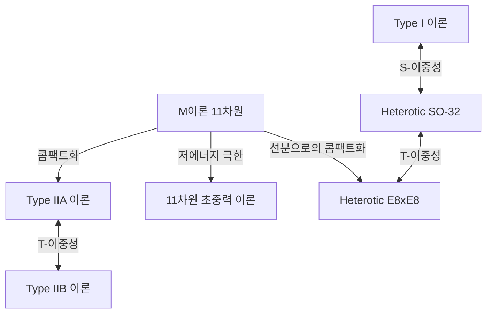

# 서론: 물리학의 궁극적인 꿈 '만물의 이론(TOE)'을 향한 도전

현대 물리학의 가장 야심 찬 목표 중 하나는 자연계에 존재하는 4가지 기본 힘인 중력, 전자기력, 약한 힘, 강한 힘을 통합적으로 기술하는 '만물의 이론(Theory of Everything: TOE)'의 구축이다. 표준 모형(Standard Model)은 전자기력, 약한 힘, 강한 힘의 3가지와 이와 관련된 기본 입자들을 매우 높은 정밀도로 기술하는 데 성공했다. 하지만 아인슈타인의 일반 상대성 이론으로 기술되는 '중력'만은 양자 역학의 틀에 통합하려고 하면 무한대의 어려움(재규격화 불가능성)이 발생하여 치명적인 파탄을 초래하고 만다.

이 깊게 깔린 모순을 해결할 유일하고 유력한 후보로 주목받고 있는 것이 '초끈 이론(Superstring Theory)'이다. 본 기사에서는 물질의 최소 단위를 '점'이 아닌 '1차원의 끈'으로 간주하는 패러다임 전환부터 시작하여 여분 차원의 콤팩트화, 칼라비-야우 다양체의 수리, M이론을 통한 궁극적인 통합, 그리고 최신 검증에 대한 도전까지 초끈 이론의 장대한 전모를 철저히 해설한다.

---

## 제1장: 점 입자의 파탄과 끈의 도입

### 장의 양자론에서 무한대의 어려움과 중력의 재규격화 불가능성

기본 입자를 부피가 없는 '점(Point)'으로 다루는 기존의 장의 양자론(Quantum Field Theory: QFT)에서는 입자들끼리 상호작용할 때 거리가 0에 가까워지는 극한에서 상호작용의 에너지가 무한대로 발산해 버린다는 문제가 항상 따라다녔다. 전자기력이나 강한 힘, 약한 힘에서는 도모나가 신이치로, 리처드 파인만, 줄리언 슈윙거 등에 의해 확립된 '재규격화 이론(Renormalization)'이라는 수학적인 기법을 통해 이 무한대를 상쇄하고 유한하고 물리적 의미가 있는 예측을 이끌어내는 것이 가능했다.

하지만 중력을 매개하는 미지의 기본 입자인 '중력자(그라비톤)'를 도입하여 일반 상대성 이론을 양자화하려고 시도하면(양자 중력 이론의 구축) 이 재규격화 기법이 전혀 작동하지 않게 된다. 중력의 결합 상수(뉴턴 상수)가 에너지 차원을 가지기 때문에 고차 루프의 파인만 다이어그램을 계산하면 할수록 새로운 발산이 무한히 발생하여 모든 것을 상쇄하기 위한 매개변수가 무한개 필요하게 되기 때문이다. 이를 '중력의 비재규격화성'이라고 부른다.

### 난부 요이치로·고토 히데히코 등의 이중 공명 모형(Dual Resonance Model)과 1차원의 끈

초끈 이론의 역사는 중력과는 전혀 무관한 곳에서 시작되었다. 1968년 가브리엘레 베네치아노(Gabriele Veneziano)는 강한 상호작용을 하는 하드론의 산란 진폭(산란 확률)이 수학의 오일러 베타 함수를 사용하여 놀라울 정도로 훌륭하게 기술할 수 있음을 발견했다(베네치아노 진폭).

이 수식의 물리적 의미를 찾아낸 사람이 난부 요이치로, 고토 히데히코, 그리고 홀거 닐센, 레너드 서스킨드 등이었다. 1970년 이들은 '하드론은 점 입자가 아니라 유한한 길이를 가진 1차원의 고무줄 같은 진동체이다'라고 가정하면 베네치아노 진폭이 자연스럽게 도출됨을 보여주었다(이중 공명 모형).

이 '끈'의 운동을 기술하기 위한 가장 기본적인 작용이 난부-고토 작용(Nambu-Goto Action)이다. 끈이 시공간을 운동할 때 점이 선을 그리는(세계선) 반면, 1차원의 끈은 2차원의 면(세계면: Worldsheet)을 그린다. 난부-고토 작용은 이 세계면의 면적에 비례하는 양으로 정의된다.

$$ S = -T \int d\tau d\sigma \sqrt{- \det(\gamma_{ab})} $$

여기서 $T$는 끈의 장력(Tension), $\gamma_{ab}$는 세계면 상의 유도 계량이다. 이 작용은 기하학적으로 매우 아름답지만, 양자화할 때에는 제곱근의 취급이 수학적 어려움을 수반한다.

### 폴랴코프 작용(Polyakov Action)과 등각 불변성

그래서 알렉산드르 폴랴코프(Alexander Polyakov)는 보조 장으로서 독립적인 세계면 계량 $h_{ab}$를 도입하여 난부-고토 작용과 등가이면서 제곱근을 포함하지 않아 다루기 쉬운 작용인 '폴랴코프 작용'을 제창했다.

$$ S = -\frac{T}{2} \int d^2\sigma \sqrt{-h} h^{ab} \partial_a X^\mu \partial_b X^\nu \eta_{\mu\nu} $$

폴랴코프 작용은 재매개변수화 불변성(Diffeomorphism invariance)에 더하여 국소적인 스케일 변환에 대해 불변이라는 '바일 불변성(Weyl invariance)', 즉 등각 대칭성을 가진다. 이 2차원의 등각 장론(CFT)으로서의 성질이 끈 이론의 강력한 수학적 기반을 형성하게 된다.

---

## 제2장: 열린 끈과 닫힌 끈, 초대칭성

### 끈의 진동 모드로서의 기본 입자

끈 이론의 가장 혁명적인 아이디어는 '우주에 존재하는 무수한 기본 입자는 단일한 끈의 서로 다른 진동 모드(배음)에 불과하다'는 개념이다. 바이올린 끈이 켜는 방법에 따라 다른 음색(주파수)을 연주하듯, 극미한 끈이 서로 다른 진동 상태를 가짐으로써 각각 질량이나 스핀이 다른 기본 입자로서 우리 눈에 보이는 것이다.

끈에는 끝이 존재하는 '열린 끈(Open string)'과 끝이 이어져 고리가 된 '닫힌 끈(Closed string)'의 두 종류가 존재한다.

### 열린 끈이 낳는 게이지 입자와 닫힌 끈이 낳는 중력자

**열린 끈(Open String):**
열린 끈의 양끝은 공간을 자유롭게 움직일 수 있는 것이 아니라 뒤에서 설명할 D-브레인이라고 불리는 막 위에 고정되어 있다. 열린 끈의 바닥 상태(가장 에너지가 낮은 진동 모드)를 해석하면 질량이 0이고 스핀이 1인 벡터 입자가 나타난다. 이것은 바로 전자기력을 매개하는 광자(광자)나 강한 힘을 매개하는 글루온 등의 '게이지 보손' 그 자체이다.

**닫힌 끈(Closed String):**
반면 닫힌 끈은 끝이 없기 때문에 브레인에 구속되지 않고 시공간을 자유롭게 전파할 수 있다. 닫힌 끈의 진동 모드를 양자화하여 해석하면 놀랍게도 질량이 0이고 '스핀 2'인 텐서 입자가 필연적으로 출현한다. 표준 모형에는 존재하지 않고 일반 상대성 이론이 예언하는 중력의 매개 입자인 '중력자(그라비톤)'와 완전히 같은 성질을 가진 입자이다.

끈 이론은 처음부터 중력을 포함하려고 설계된 것이 아니었다. 하드론의 이론으로 출발했음에도 불구하고 그 수식이 자발적으로 중력자의 존재를 요구했던 것이다. 이 사실로 인해 끈 이론은 단순한 강한 힘의 모형에서 '양자 중력 이론'의 가장 유력한 후보로 극적인 전환을 이루게 되었다(존 슈워츠와 조엘 셔크에 의한 1974년의 제안).

### 보손 끈 이론의 파탄(타키온의 출현)과 비라소로 대수

초기 끈 이론은 보손(힘을 매개하는 입자)만을 기술하는 '보손 끈 이론'이었다. 끈의 진동을 양자 역학적으로 올바르게 다루기 위해서는 등각 불변성이 양자화 과정에서 깨지지 않는(변칙이 없는) 것을 보장해야 한다.

2차원 세계면 상의 등각 대칭성은 무한 차원 리 대수인 '비라소로 대수(Virasoro Algebra)'로 기술된다.
$$ [L_m, L_n] = (m - n)L_{m+n} + \frac{c}{12}m(m^2 - 1)\delta_{m+n, 0} $$
여기서 $c$는 중심 전하(Central charge)라고 불린다. 보손 끈 이론이 수학적 모순(고스트 상태의 출현) 없이 성립하기 위해서는 시공간의 차원 $D$가 놀랍게도 '26차원(공간 25차원 + 시간 1차원)'이어야 한다는 것이 증명되었다.

더욱 치명적인 문제로서 보손 끈 이론의 가장 낮은 에너지 상태가 질량이 허수(질량의 제곱이 마이너스)가 되는 '타키온(Tachyon)'이 되어 버린다. 타키온이 존재하는 진공은 불안정하며 이론으로서 물리적 현실을 기술할 수 없음을 의미한다.

### 초대칭성(Supersymmetry)의 도입과 초끈 이론(10차원)

타키온 문제와 물질을 구성하는 페르미온(전자나 쿼크 등)이 이론에 포함되어 있지 않다는 결함을 해결하기 위해 도입된 것이 '초대칭성(Supersymmetry: SUSY)'이다. 초대칭성은 보손(스핀이 정수인 입자)과 페르미온(스핀이 반정수인 입자)을 맞바꾸는 대칭성이다.

끈의 세계면 상에 초대칭성을 도입한 '초끈 이론(Superstring Theory)'에서는 GSO 사영(Gliozzi-Scherk-Olive projection)이라 불리는 수학적 조작을 수행함으로써 스펙트럼에서 보기 좋게 타키온이 배제되고 동시에 시공간의 초대칭성이 실현된다는 것이 보여졌다.

이 초끈 이론에서 등각 변칙이 상쇄되어 수학적으로 무모순이 되는 시공간의 차원 수는 '10차원(공간 9차원 + 시간 1차원)'이다. 우리가 사는 4차원 시공간(공간 3차원 + 시간 1차원)과는 크게 다르지만 26차원에서 10차원으로 극적으로 차원이 감소하며 현실 물리에 한 걸음 다가간 순간이었다.

---

## 제3장: 제1차 초끈 이론 혁명

1970년대 후반부터 1980년대 전반에 걸쳐 초끈 이론은 일부 열성적인 연구자들을 제외하고는 물리학계에서 반쯤 버림받은 상태였다. 양자 이상(변칙)이라 불리는 수학적 모순이 게이지 이론과 중력을 결합할 때 아무래도 발생해 버린다고 생각되었기 때문이다.

### 1984년: 그린과 슈워츠의 기적적인 변칙 상쇄

1984년 여름 마이클 그린(Michael Green)과 존 슈워츠(John Schwarz)는 역사적인 계산을 이루어냈다. 그들은 특정 조건을 만족하는 10차원의 초끈 이론에서는 게이지 변칙과 중력 변칙이 파인만 다이어그램의 육각형(헥사곤) 다이어그램 수준에서 훌륭하게 서로 상쇄되어 완전히 0이 됨을 증명한 것이다.

이 기적적인 상쇄가 일어나기 위해서는 이론의 배후에 있는 게이지 군이 특정한 거대한 대칭성 군이어야 한다는 것이 판명되었다. 그것이 바로 **$SO(32)$**(32차원 특수 직교군)와 **$E_8 \times E_8$**(예외군 E8의 직적)의 두 가지뿐이었다.

이 발견은 물리학계에 엄청난 충격을 주었고 '제1차 초끈 이론 혁명'이라고 불리는 폭발적인 연구 붐을 일으켰다. 만물의 이론으로 가는 길이 갑자기 명확하게 열린 것이다.

### 5가지의 무모순인 초끈 이론

그린과 슈워츠의 발견 이후 연구가 급가속되어 최종적으로 10차원에서 무모순인 초끈 이론은 다음의 '5종류'로 분류된다는 것이 밝혀졌다.

1. **Type I 이론**: 열린 끈과 닫힌 끈을 모두 포함한다. 초대칭성은 $N=1$. 게이지 군은 $SO(32)$.
2. **Type IIA 이론**: 닫힌 끈만. 초대칭성은 $N=2$이고, 비카이랄(패리티 대칭성을 보존한다).
3. **Type IIB 이론**: 닫힌 끈만. 초대칭성은 $N=2$이고, 카이랄(패리티를 깬다. 현실의 약한 상호작용의 성질에 가깝다).
4. **Heterotic (헤테로틱) $SO(32)$ 이론**: 닫힌 끈만. 우권 진동(10차원의 초끈)과 좌권 진동(26차원의 보손 끈)을 하이브리드시킨 기발하지만 아름다운 이론. 게이지 군은 $SO(32)$.
5. **Heterotic (헤테로틱) $E_8 \times E_8$ 이론**: 같은 하이브리드 구조. 게이지 군은 $E_8 \times E_8$. 현실의 표준 모형의 대칭성($SU(3) \times SU(2) \times U(1)$)을 자연스럽게 내포할 수 있기 때문에 한때 가장 유망시되었다.

이 5개의 이론은 각각 수학적으로 완벽한 일관성을 가지고 있었다. '만물의 이론은 단 하나여야 한다'는 철학에서 볼 때 5개나 되는 후보가 존재하는 것은 당시의 물리학자들에게 큰 수수께끼가 되었다.

---

## 제4장: 여분 차원의 콤팩트화와 칼라비-야우 다양체

초끈 이론이 요구하는 '10차원'이라는 시공간은 우리가 일상적으로 지각하고 있는 '공간 3차원 + 시간 1차원(총 4차원)'과 명백히 모순된다. 나머지 공간 6차원(여분 차원: Extra Dimensions)은 대체 어디에 숨어 있는 것일까?

### 칼루차-클라인 이론으로부터의 계보

여분 차원의 개념 자체는 끈 이론보다 훨씬 오래되었으며 1920년대의 테오도어 칼루차(Theodor Kaluza)와 오스카르 클라인(Oskar Klein)으로 거슬러 올라간다. 그들은 일반 상대성 이론을 5차원(공간 4차원 + 시간 1차원)으로 확장하고 제4의 공간 차원을 아주 작은 원 크기로 말아 넣음으로써(콤팩트화함으로써) 4차원에서의 중력과 전자기력을 통합적으로 도출하는 데 성공했다. 여분 차원의 기하학적인 구조가 저에너지의 세계에서 '힘(게이지 장)'으로서 나타나는 것이다.

### 리치 평탄한 켈러 다양체: 칼라비-야우 공간

10차원의 초끈 이론에서 현실적인 4차원의 물리를 이끌어내기 위해서는 여분의 6차원을 플랑크 길이($10^{-35}$미터) 정도의 극소 크기로 말아 넣는 '콤팩트화(Compactification)'가 필요하다. 단순히 말아 넣기만 하면 되는 것이 아니라 4차원 공간에서 $N=1$의 초대칭성을 적어도 1개 남긴다(계층성 문제를 해결하고 페르미온을 도출하기 위해)는 엄격한 물리적 제약을 만족해야 한다.

1985년 필립 칸델라스(Philip Candelas), 게리 호로위츠(Gary Horowitz), 앤드루 스트로민저(Andrew Strominger), 에드워드 위튼(Edward Witten) 등 네 사람은 이 여분 6차원의 공간이 특정한 수학적 조건을 만족하는 특수한 복소 다양체여야 함을 증명했다.

그 조건이란 '리치 평탄(Ricci-flat)한 콤팩트 켈러 다양체(Kähler manifold)'이다. 이 기하학 공간은 수학자인 에우제니오 칼라비(Eugenio Calabi)가 그 존재를 예상하고 싱퉁 야우(Shing-Tung Yau)가 수학적으로 증명했기 때문에 '**칼라비-야우 다양체(Calabi-Yau manifold)**'라고 불린다.

### 오일러 수와 쿼크의 세대 수

칼라비-야우 공간의 극히 난해하고 복잡한 '구멍'이나 '위상(토폴로지)' 구조가 우리가 사는 4차원 세계에서의 기본 입자의 성질을 완전히 결정짓는다.

예를 들어 다양체의 위상을 특징짓는 불변량인 '오일러 수(Euler characteristic)' 절반의 절댓값이 현실 세계에 나타나는 '기본 입자의 세대 수'와 일치함이 증명되어 있다. 표준 모형에서는 쿼크와 렙톤이 3세대(업·다운, 참·스트레인지, 톱·바텀) 존재하므로 오일러 수가 $\pm 6$이 되는 칼라비-야우 공간을 찾는 것이 끈 이론 현상론의 최중요 과제가 되었다.

### 거울 대칭성(Mirror Symmetry)의 경이

칼라비-야우 다양체의 연구는 순수 수학 분야에도 극적인 돌파구를 가져왔다. 물리학자들은 전혀 다른 위상을 가진 2개의 칼라비-야우 공간(거울 쌍)이 끈 이론에서는 완전히 동일한 물리 현상을 기술한다는 것을 발견한 것이다. 이것이 '거울 대칭성'이다.

수학적으로는 계산이 매우 곤란했던 한쪽 다양체(예를 들어 유리 곡선의 수를 세는 계수 기하학의 문제)가 거울 대칭성을 이용해 다른 쪽 다양체의 적분 문제로 변환함으로써 아주 쉽게 풀려버리는 현상이 연달아 일어나 수학자들을 경악하게 만들었다. 끈 이론은 물리학 이론인 동시에 미지의 심오한 수학을 발견하기 위한 '궁극의 탐지기'로도 기능하고 있는 것이다.

---

## 제5장: 제2차 초끈 이론 혁명과 M이론

1990년대 중반까지 5개의 초끈 이론은 각각 독립된 별개의 이론으로 생각되었다. 그러나 1995년 남캘리포니아 대학에서 열린 스트링 국제 회의에서 에드워드 위튼(Edward Witten)이 행한 역사적인 강연에 의해 사태는 극적으로 변화했다. '제2차 초끈 이론 혁명'의 막이 오른 것이다.

### 이중성(Duality)이라는 마법의 사전

위튼은 '이중성(Duality)'이라는 개념을 사용하여 얼핏 전혀 달라 보이는 5개의 초끈 이론이 사실은 '단일한 궁극 이론'의 다른 측면에 불과함을 선명하게 증명해 보였다. 주요한 이중성으로는 다음 두 가지가 있다.

- **T-이중성(Target-space Duality)**: 공간의 콤팩트화 반지름을 $R$이라 할 때 반지름 $R$의 이론과 반지름 $1/R$의 이론이 물리적으로 완전히 등가가 된다는 놀라운 성질. 이에 의해 Type IIA 이론과 Type IIB 이론, 그리고 2개의 Heterotic 이론이 각각 연결되어 있음이 밝혀졌다. 극미의 우주와 거대한 우주는 끈 이론의 관점에서는 구별할 수 없는 것이다.
- **S-이중성(Strong-weak Duality)**: 상호작용의 결합 상수를 $g$라 할 때 결합 상수가 큰(상호작용이 강한) 이론과 결합 상수가 $1/g$가 되는 약한 이론이 등가가 되는 관계. 이에 의해 Type I 이론과 Heterotic SO(32) 이론이 관련지어졌고 계산 불가능한 강결합 영역의 물리를 다른 이론의 약결합 영역을 사용하여 계산하는 것이 가능해졌다.

### D-브레인(D-brane)의 발견

위튼의 발표와 같은 시기에 조지프 폴친스키(Joseph Polchinski)는 '**D-브레인(D-brane)**'이라는 개념을 명확하게 정의하고 끈 이론에서의 그 중요성을 증명했다. D-브레인이란 열린 끈의 끝점이 들러붙을 수 있는 '고차원의 막(멤브레인)'과 같은 실체이다(D는 디리클레 경계 조건에서 유래한다).

D-브레인은 블랙홀의 엔트로피 미시적 기원을 규명하는 등(스트로민저와 바파에 의한 1996년의 성과) 끈 이론에서 필수불가결한 구성 요소가 되었다. 우리 우주 자체가 거대한 D3-브레인(3차원 공간적인 막)일 가능성을 제시하는 '브레인 월드 가설'도 여기서 파생되었다.

### 모든 것을 통합하는 11차원의 'M이론'

이중성의 네트워크를 통해 5개의 초끈 이론을 통합한 위튼은 이들 이론을 통일하는 한 단계 더 상위 이론으로서 '**M이론(M-theory)**'을 제창했다.

놀랍게도 M이론이 전개되는 시공간은 '11차원(공간 10차원 + 시간 1차원)'이다. Type IIA 이론에서 결합 상수를 무한대로 극한 조작하면 보이지 않던 또 하나의 공간 차원(제11의 차원)이 원으로서 나타나고 1차원의 '끈'은 사실 2차원의 '막(멤브레인)'이 둥글게 말린 것이었음이 판명된 것이다.

M이론의 'M'이 무엇을 의미하는지(Membrane, Magic, Mystery, Matrix, Mother 등)는 위튼 자신에 의해 의도적으로 모호하게 남아 있다. 현재도 M이론의 완전한 수학적 정식화(기초 방정식)는 발견되지 않았으며 현대 물리학의 가장 큰 미해결 문제 중 하나로 남아 있다. 하지만 홀로그래피 원리(AdS/CFT 대응) 등을 통해 그 단편적인 성질은 점차 해명되고 있다.

*(참고: M이론을 중심으로, 이중성으로 묶인 5개의 초끈 이론의 통일 그림)*

---

## 제6장: 끈 풍경(String Landscape)과 검증에의 도전

초끈 이론이 만물의 이론의 가장 유력한 후보로 군림한 지 오래지만 물리학인 이상 실험이나 관측에 의한 검증이 필수적이다. 하지만 여기에는 거대한 벽이 가로막고 있다.

### 10^500개의 진공: 끈 풍경과 인류 원리

칼라비-야우 다양체의 위상이나 D-브레인의 배치, 다양체에 감기는 플럭스(자기력선 같은 것)의 조합은 무수히 존재한다. 2000년대 초반의 계산에 의해 끈 이론이 허용하는 안정 또는 준안정한 진공(우주의 패턴 후보)의 수는 놀랍게도 **$10^{500}$** 종류 이상에 달한다는 것이 밝혀졌다(KKLT 시나리오 등).

이것을 '**끈 풍경(String Landscape)**'이라고 부른다. 끈 이론은 우리 우주의 법칙을 유일하게 결정하는 이론이 아니라 생각할 수 있는 모든 법칙을 가진 무수한 우주(다중우주)를 낳는 틀이었던 것이다.

이 사실은 물리학계에 심각한 논쟁을 일으켰다. '왜 우리 우주는 지금의 법칙(우주 상수의 미세한 값이나 기본 입자의 질량의 절묘한 균형)을 가지고 있는가'라는 질문에 대해 '무수한 우주가 존재하는 가운데 우리와 같은 지적 생명체가 존재할 수 있는 환경을 가진 우주를 우리가 관측하고 있는 것은 필연적이다'라는 '인류 원리(Anthropic Principle)'의 도입이 불가피해졌기 때문이다. 레너드 서스킨드 등은 이를 강력히 지지하고 있으나 반증 불가능성을 이유로 맹반발하는 물리학자도 많다.

### 늪지(Swampland) 추측

최근 풍경에 대한 새로운 접근 방식으로 캄란 바파(Cumrun Vafa) 등이 제창하는 '**늪지(Swampland)** 추측'이 급속히 주목을 받고 있다.

얼핏 보기에 모순이 없는 유효 장론(저에너지 물리 모델)이라도 양자 중력 이론(끈 이론)에 모순 없이 끼워 넣을 수 없는 모델의 집합을 늪지라고 부른다. 바파 등은 '중력은 항상 가장 약한 힘이어야 한다(약한 중력 추측)'나 '암흑 에너지에 의한 우주의 가속 팽창에는 엄격한 제한이 있다(드 지터 추측)'와 같은 강력한 기준(늪지 조건)을 연이어 제시하고 있다.

이를 통해 $10^{500}$이라고도 했던 방대한 풍경 속에서 현실에 관측 가능한 우주의 조건을 엄격하게 좁혀 나갈 수 있을 것으로 기대된다.

### 실험적 검증을 향한 끝없는 도전

끈 이론의 직접적인 증명에는 플랑크 에너지 스케일(거대한 입자 가속기로 은하계 크기의 시설이 필요)이 필요하다고 여겨져 사실상 불가능에 가깝다. 하지만 간접적인 검증 방법은 현재도 진지하게 모색되고 있다.

1. **원시 중력파의 관측:**
   우주의 인플레이션 시기에 생성된 '원시 중력파'가 우주 마이크로파 배경 복사(CMB)의 편광(B-모드)에 새기는 흔적을 관측하는 계획(LiteBIRD 위성 등). 이를 통해 끈 이론 특유의 인플레이션 모델을 검증할 수 있을 가능성이 있다.
2. **초고에너지 우주선과 극미의 블랙홀:**
   CERN의 거대 강입자 충돌기(LHC) 등에서 여분 차원의 존재를 시사하는 '미니 블랙홀'의 생성이나 여분 차원으로 빠져나가는 중력자에 의한 에너지 결손(미싱 에너지)의 관측이 기대되었다. 현재로서는 명확한 증거가 발견되지 않았으며 여분 차원의 크기에 엄격한 상한이 부과되어 있다.
3. **우주 끈(Cosmic String):**
   초기 우주의 상전이로 형성된 거대한 거시적 끈(우주 끈)이 중력 렌즈 효과나 중력파의 버스트로서 관측될 가능성.

## 결론: 궁극의 진리를 향한 끝나지 않는 여행

초끈 이론은 틀림없이 인류가 도달한 가장 장대하고 가장 수학적으로 아름다운 지의 결정체이다. 점 입자에서 끈으로, 그리고 여분 차원에서 막(M이론)으로의 개념적 비약은 공간과 시간 자체가 근본적이지 않고 더 깊은 차원의 기하학에서 창발하는 '환영'일 가능성마저 우리에게 들이밀고 있다.

직접적인 실험적 증거가 부족하기 때문에 '끈 이론은 물리학이 아니라 수학 혹은 철학에 불과하다'는 가혹한 비판이 존재하는 것도 사실이다. 그러나 블랙홀 정보 역설 해결의 실마리나 AdS/CFT 대응을 통해 강결합 응집물질 물리학(초전도 등)에 완전히 새로운 계산 기법을 제공하는 등 끈 이론은 이미 이론 물리학의 광범위한 영역에 필수불가결한 언어로서 깊게 뿌리를 내리고 있다.

우리는 아직 M이론의 진짜 방정식을 손에 넣지 못했다. 칼라비-야우 공간의 암흑 속에 숨어 있는 6개의 여분 차원이 어떤 형태를 하고 있는지, 우리가 사는 우주가 $10^{500}$의 풍경 어디에 위치하고 있는지 그 전모가 해명될 날을 향해 물리학자들의 끝없는 도전은 오늘도 계속되고 있다.

---

## 부록: 초끈 이론을 뒷받침하는 고도의 수리적 배경

본편에서는 직관적인 이해를 우선하여 개설하였으나 여기서는 초끈 이론의 확고한 기반을 이루는 수식과 기하학적 구조에 대해 한층 더 깊은 수준에서 상술한다.

### A. 폴랴코프 작용과 2차원 등각 장론(CFT)의 완전한 정식화

끈이 시공간을 나아가는 궤적인 세계면(Worldsheet) 상의 역학을 기술하는 폴랴코프 작용은 다음과 같이 주어진다.

$$ S_P = -\frac{T}{2} \int d^2\sigma \sqrt{-h} h^{\alpha\beta} \partial_\alpha X^\mu \partial_\beta X^\nu \eta_{\mu\nu} $$

여기서 $X^\mu(\tau, \sigma)$는 세계면 좌표 $(\tau, \sigma)$에서 타겟 시공간으로의 매핑(즉 시공간 상의 끈의 좌표)이다. 이 작용의 가장 중요한 성질은 다음 3가지의 국소적 대칭성을 가진다는 것이다.
1. **2차원 미분 동형 사상 불변성(Diffeomorphism invariance):** 세계면 상의 좌표 변환 $\sigma^\alpha \to \sigma^{\prime\alpha}(\sigma)$에 대해 불변.
2. **2차원 푸앵카레 불변성:** 타겟 시공간의 평행 이동 및 로런츠 변환에 대한 불변성.
3. **바일 불변성(Weyl invariance):** 계량 텐서의 국소적인 스케일 변환 $h_{\alpha\beta}(\sigma) \to e^{2\omega(\sigma)}h_{\alpha\beta}(\sigma)$에 대한 불변성.

고전적으로는 바일 불변성이 유지되지만 경로 적분을 이용해 양자화를 수행할 때 측도의 변환 야코비안에서 '등각 변칙(Conformal Anomaly)'이 발생한다. 이 변칙을 상쇄하고 양자 수준에서도 바일 불변성을 유지하기 위한 조건을 계산하면 고스트 장(파데예프-포포프 고스트)으로부터의 기여와 물질 장($X^\mu$)으로부터의 기여가 상쇄되어야 한다. 이것이 바로 보손 끈에서 $D=26$, 초끈에서 $D=10$을 요구하는 수학적 원동력이다.

### B. 칼라비-야우 다양체와 리치 평탄성의 수리

10차원 초끈 이론에서 4차원 유효 이론을 도출하기 위한 콤팩트화 조건으로서 여분 6차원 공간 $K$ 위에 초대칭성을 남길(스피너 장이 공변적으로 상수가 되는) 필요가 있다. 즉 미분 방정식 $\nabla_m \eta = 0$($\eta$는 내재적 스피너)을 만족해야 한다.

이 조건을 만족하기 위해서는 공간 $K$의 홀로노미 군이 $SU(3)$에 포함되어야 하며 이는 기하학적으로 다음 조건과 동치이다.
1. $K$가 켈러 다양체(Kähler manifold)일 것. 즉 닫힌 비퇴화 2차 형식(켈러 형식 $J$)을 가질 것.
2. $K$의 제1 천 류 $c_1(K)$가 0일 것.

야우의 정리(칼라비 추측의 증명)에 의해 $c_1(K)=0$을 만족하는 콤팩트한 켈러 다양체에는 반드시 리치 텐서 $R_{mn}$이 0이 되는 '리치 평탄한 켈러 계량'이 유일하게 존재한다. 이것이 칼라비-야우 다양체이다.

칼라비-야우 다양체의 기하학은 그 코호몰로지 군 $H^{p,q}(K)$의 차원(호지 수 $h^{p,q}$)에 의해 특징지어진다. 특히 $h^{2,1}$과 $h^{1,1}$이라는 두 개의 호지 수는 매우 중요하다.
- $h^{1,1}$은 켈러 구조(다양체의 '크기'나 '모양'의 파라미터)의 변형 정도(모듈라이)의 수에 대응한다.
- $h^{2,1}$은 복소 구조의 변형 정도의 수에 대응한다.

물리적으로는 오일러 수 $\chi = 2(h^{1,1} - h^{2,1})$의 값이 4차원 세계에서의 카이랄 페르미온(쿼크나 렙톤)의 세대 수 차이와 직결된다. 예를 들어 표준 모형의 '3세대'를 도출하기 위해서는 $\chi = \pm 6$이 되는 칼라비-야우 다양체를 찾아야 하며 Z3 오비폴드 등의 기법을 사용하여 그러한 공간이 구성되어 왔다.

### C. AdS/CFT 대응: 홀로그래피 원리의 궁극적 구현

M이론이나 D-브레인 연구에서 파생된 최대의 부산물이 1997년 후안 말다세나(Juan Maldacena)에 의해 제창된 'AdS/CFT 대응(Anti-de Sitter/Conformal Field Theory correspondence)'이다.

이것은 '5차원 반 드 지터 공간(AdS 공간)에서의 중력 이론(초끈 이론)'이 '그 4차원 경계 상에서 정의된 등각 장론(CFT: 중력을 포함하지 않는 게이지 이론)'과 완전히 등가라는 경이로운 추측이다.

$$ Z_{\text{AdS}}[J] = \langle e^{\int \mathcal{O} J} \rangle_{\text{CFT}} $$

이 등가성은 차원이 다른 2개의 이론이 동일한 물리를 기술한다는 '홀로그래피 원리'의 수학적으로 엄밀한 실현 예가 되고 있다. 강결합 게이지 이론(계산 불가능)을 약결합 고전 중력(일반 상대론으로 계산 가능)으로 번역하여 풀 수 있기 때문에 현재는 입자 물리학뿐만 아니라 응집물질 물리학(고온 초전도나 쿼크-글루온 플라스마의 점성 계산 등)에서 양자 정보 이론에 이르기까지 매우 광범위한 응용을 낳고 있다. 이것은 초끈 이론이 단순한 '가설'에서 물리학 전체의 '유용한 도구'로 진화한 상징적인 패러다임 전환이었다.
