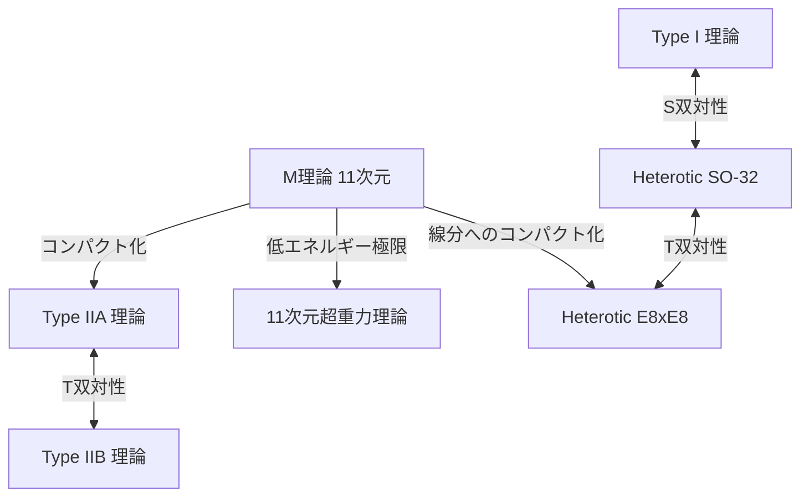

# 序論：物理学の究極の夢「万物の理論（TOE）」への挑戦

現代物理学の最も野心的な目標の一つは、自然界に存在する4つの基本的な力——重力、電磁気力、弱い力、強い力——を統一的に記述する「万物の理論（Theory of Everything: TOE）」の構築である。標準模型（Standard Model）は、電磁気力、弱い力、強い力の3つと、これらに関連する素粒子を極めて高い精度で記述することに成功している。しかし、アインシュタインの一般相対性理論によって記述される「重力」だけは、量子力学の枠組みに組み込もうとすると、無限大の困難（繰り込み不可能性）が生じ、致命的な破綻をきたしてしまう。

この深く横たわる矛盾を解決する唯一の有力な候補として注目されているのが「超弦理論（Superstring Theory）」である。本記事では、物質の最小単位を「点」ではなく「1次元のひも（弦）」とみなすパラダイムシフトから始まり、余剰次元のコンパクト化、カラビ・ヤウ多様体の数理、M理論による究極の統合、そして最新の検証への挑戦まで、超弦理論の壮大な全貌を徹底的に解説する。

---

## 第1章：点粒子の破綻と弦の導入

### 場の量子論における無限大の困難と重力の繰り込み不可能性

素粒子を体積を持たない「点（ポイント）」として扱う従来の場の量子論（Quantum Field Theory: QFT）では、粒子同士が相互作用する際に、距離がゼロに近づく極限で相互作用のエネルギーが無限大に発散してしまうという問題が常につきまとってきた。電磁気力や強い力、弱い力においては、朝永振一郎、リチャード・ファインマン、ジュリアン・シュウィンガーらによって確立された「繰り込み理論（Renormalization）」という数学的な手法により、この無限大を相殺し、有限で物理的意味のある予測を引き出すことが可能であった。

しかし、重力を媒介する未知の素粒子「重力子（グラビトン）」を導入し、一般相対性理論を量子化しようと試みると（量子重力理論の構築）、この繰り込み手法が全く機能しなくなる。重力の結合定数（ニュートン定数）がエネルギーの次元を持つため、高次ループのファインマン図を計算すればするほど新たな発散が無限に生じ、すべてを相殺するためのパラメータが無限個必要になってしまうのである。これを「重力の非繰り込み性」と呼ぶ。

### 南部陽一郎・後藤英彦らのデュアルレゾナンスモデルと1次元の弦

超弦理論の歴史は、重力とは全く無関係のところから始まった。1968年、ガブリエーレ・ヴェネツィアーノ（Gabriele Veneziano）は、強い相互作用をするハドロンの散乱振幅（散乱確率）が、数学のオイラーのベータ関数を用いて驚くほど見事に記述できることを発見した（ヴェネツィアーノ振幅）。

この数式の物理的意味を見出したのが、南部陽一郎、後藤英彦、そしてホルガー・ニールセン、レオナルド・サスキンドらであった。1970年、彼らは「ハドロンは点粒子ではなく、有限の長さを持つ1次元のゴムひものような振動体である」と仮定すれば、ヴェネツィアーノ振幅が自然に導出されることを示したのである（デュアルレゾナンスモデル）。

この「弦（ひも）」の運動を記述するための最も基本的な作用が、南部・後藤作用（Nambu-Goto Action）である。弦が時空を運動する際、点が線を描く（世界線）のに対し、1次元の弦は2次元の面（世界面：Worldsheet）を描く。南部・後藤作用は、この世界面の面積に比例する量として定義される。

$$ S = -T \int d\tau d\sigma \sqrt{- \det(\gamma_{ab})} $$

ここで、$T$ は弦の張力（Tension）、$\gamma_{ab}$ は世界面上の誘導計量である。この作用は幾何学的に非常に美しいが、量子化する際には平方根の扱いが数学的困難を伴う。

### ポリアコフ作用（Polyakov Action）と共形不変性

そこで、アレクサンドル・ポリアコフ（Alexander Polyakov）は、補助場としての独立な世界面計量 $h_{ab}$ を導入し、南部・後藤作用と等価でありながら平方根を含まない扱いやすい作用「ポリアコフ作用」を提唱した。

$$ S = -\frac{T}{2} \int d^2\sigma \sqrt{-h} h^{ab} \partial_a X^\mu \partial_b X^\nu \eta_{\mu\nu} $$

ポリアコフ作用は、再パラメータ化不変性（Diffeomorphism invariance）に加えて、局所的なスケール変換に対して不変であるという「ワイル不変性（Weyl invariance）」、すなわち共形対称性を持つ。この2次元の共形場理論（CFT）としての性質が、弦理論の強力な数学的基盤を形成していくことになる。

---

## 第2章：開いた弦と閉じた弦、超対称性

### 弦の振動モードとしての素粒子

弦理論の最も革命的なアイデアは、「宇宙に存在する無数の素粒子は、単一の弦の異なる振動モード（倍音）に過ぎない」という概念である。バイオリンの弦が異なる弾き方によって異なる音色（周波数）を奏でるように、極小の弦が異なる振動状態をとることで、それぞれ質量やスピンの異なる素粒子として我々の目に映るのである。

弦には、端が存在する「開いた弦（Open string）」と、端が繋がって輪になった「閉じた弦（Closed string）」の2種類が存在する。

### 開いた弦が生むゲージ粒子と、閉じた弦が生み出す重力子

**開いた弦（Open String）：**
開いた弦の両端は空間を自由に動けるわけではなく、後述するDブレインと呼ばれる膜の上に固定されている。開いた弦の基底状態（最もエネルギーの低い振動モード）を解析すると、質量ゼロでスピン1のベクトル粒子が現れる。これはまさに、電磁気力を媒介する光子（フォトン）や、強い力を媒介するグルーオンなどの「ゲージボソン」そのものである。

**閉じた弦（Closed String）：**
一方、閉じた弦は端がないため、ブレインに拘束されることなく時空間を自由に伝播することができる。閉じた弦の振動モードを量子化して解析すると、驚くべきことに、質量ゼロで「スピン2」のテンソル粒子が必然的に出現する。標準模型には存在せず、一般相対性理論が予言する重力の媒介粒子「重力子（グラビトン）」と全く同じ性質を持つ粒子である。

弦理論は最初から重力を含めようとして設計されたわけではない。ハドロンの理論として出発したにもかかわらず、その数式が自発的に重力子の存在を要求したのである。この事実により、弦理論は単なる強い力のモデルから、「量子重力理論」の最有力候補へと劇的な転換を遂げることになった（ジョン・シュワルツとジョエル・シャークによる1974年の提案）。

### ボソン弦理論の破綻（タキオンの出現）とヴィラソロ代数

初期の弦理論は、ボソン（力を媒介する粒子）のみを記述する「ボソン弦理論」であった。弦の振動を量子力学的に正しく扱うためには、共形不変性が量子化の過程で壊れない（アノマリーがない）ことを保証しなければならない。

2次元の世界面上の共形対称性は、無限次元のリー代数である「ヴィラソロ代数（Virasoro Algebra）」によって記述される。
$$ [L_m, L_n] = (m - n)L_{m+n} + \frac{c}{12}m(m^2 - 1)\delta_{m+n, 0} $$
ここで、$c$ はセントラルチャージ（中心電荷）と呼ばれる。ボソン弦理論が数学的矛盾（ゴースト状態の出現）なく成立するためには、時空の次元 $D$ が驚くべきことに「26次元（空間25次元＋時間1次元）」でなければならないことが証明された。

さらに致命的な問題として、ボソン弦理論の最も低いエネルギー状態が、質量が虚数（質量の2乗がマイナス）となる「タキオン（Tachyon）」になってしまう。タキオンが存在する真空は不安定であり、理論として物理的現実を記述できないことを意味している。

### 超対称性（Supersymmetry）の導入と超弦理論（10次元）

タキオンの問題と、物質を構成するフェルミオン（電子やクォークなど）が理論に含まれていないという欠陥を解決するために導入されたのが「超対称性（Supersymmetry: SUSY）」である。超対称性は、ボソン（スピンが整数の粒子）とフェルミオン（スピンが半整数の粒子）を入れ替える対称性である。

弦の世界面上に超対称性を導入した「超弦理論（Superstring Theory）」では、GSO射影（Gliozzi-Scherk-Olive projection）と呼ばれる数学的操作を行うことで、スペクトルから見事にタキオンが排除され、同時に時空の超対称性が実現されることが示された。

この超弦理論において共形アノマリーが相殺され、数学的に無矛盾となる時空の次元数は「10次元（空間9次元＋時間1次元）」である。我々の住む4次元時空（空間3次元＋時間1次元）とは大きく異なるが、26次元から10次元へと劇的に次元が削減され、現実の物理へ一歩近づいた瞬間であった。

---

## 第3章：第一次超弦理論革命

1970年代後半から1980年代前半にかけて、超弦理論は一部の熱心な研究者を除いて物理学界から半ば見放されていた。量子異常（アノマリー）と呼ばれる数学的矛盾が、ゲージ理論と重力を組み合わせた際にどうしても生じてしまうと考えられていたからだ。

### 1984年：グリーンとシュワルツの奇跡のアノマリー相殺

1984年の夏、マイケル・グリーン（Michael Green）とジョン・シュワルツ（John Schwarz）は、歴史的な計算を成し遂げた。彼らは、特定の条件を満たす10次元の超弦理論においては、ゲージアノマリーと重力アノマリーが、ファインマン図の六角形（ヘキサゴン）ダイアグラムのレベルで見事に相殺し合い、完全にゼロになることを証明したのである。

この奇跡的な相殺が起こるためには、理論の背後にあるゲージ群が、特定の巨大な対称性群でなければならないことが判明した。それが、**$SO(32)$**（32次元の特殊直交群）と、**$E_8 \times E_8$**（例外群E8の直積）の2つのみであった。

この発見は物理学界に凄まじい衝撃を与え、「第一次超弦理論革命」と呼ばれる爆発的な研究ブームを巻き起こした。万物の理論への道が、突如として明確に開かれたのである。

### 5つの無矛盾な超弦理論

グリーンとシュワルツの発見以降、研究が急加速し、最終的に10次元で無矛盾な超弦理論は以下の「5種類」に分類されることが明らかになった。

1. **Type I 理論**：開いた弦と閉じた弦の両方を含む。超対称性は $N=1$。ゲージ群は $SO(32)$。
2. **Type IIA 理論**：閉じた弦のみ。超対称性は $N=2$ で、非カイラル（パリティ対称性を保存する）。
3. **Type IIB 理論**：閉じた弦のみ。超対称性は $N=2$ で、カイラル（パリティを破る。現実の弱い相互作用の性質に近い）。
4. **Heterotic (ヘテロティック) $SO(32)$ 理論**：閉じた弦のみ。右巻きの振動（10次元の超弦）と左巻きの振動（26次元のボソン弦）をハイブリッドさせた奇抜だが美しい理論。ゲージ群は $SO(32)$。
5. **Heterotic (ヘテロティック) $E_8 \times E_8$ 理論**：同様のハイブリッド構造。ゲージ群は $E_8 \times E_8$。現実の標準模型の対称性（$SU(3) \times SU(2) \times U(1)$）を自然に内包できるため、一時期最も有望視された。

これら5つの理論は、それぞれが数学的に完璧な一貫性を持っていた。「万物の理論はただ1つであるべき」という哲学からすると、5つも候補が存在することは、当時の物理学者にとって大きな謎となった。

---

## 第4章：余剰次元のコンパクト化とカラビ・ヤウ多様体

超弦理論が要求する「10次元」という時空は、我々が日常的に知覚している「空間3次元＋時間1次元（合計4次元）」と明らかに矛盾している。残りの空間6次元（余剰次元：Extra Dimensions）は、一体どこに隠れているのだろうか？

### カルツァ＝クライン理論からの系譜

余剰次元の概念自体は、弦理論よりはるかに古く、1920年代のテオドール・カルツァ（Theodor Kaluza）とオスカル・クライン（Oskar Klein）に遡る。彼らは、一般相対性理論を5次元（空間4次元＋時間1次元）に拡張し、第4の空間次元を極めて小さな円のサイズに丸め込む（コンパクト化する）ことで、4次元における重力と電磁気力を統一的に導出することに成功した。余剰次元の幾何学的な構造が、低エネルギーの世界において「力（ゲージ場）」として現れるのである。

### リッチ平坦なケーラー多様体：カラビ・ヤウ空間

10次元の超弦理論から現実的な4次元の物理を引き出すためには、余剰な6次元をプランク長（$10^{-35}$メートル）程度の極小サイズに丸め込む「コンパクト化（Compactification）」が必要である。単に丸め込めば良いというわけではなく、4次元空間で$N=1$の超対称性を少なくとも1つ残す（階層性問題を解決し、フェルミオンを導出するため）という厳しい物理的制約を満たさなければならない。

1985年、フィリップ・キャンデラス（Philip Candelas）、ゲイリー・ホロウィッツ（Gary Horowitz）、アンドリュー・ストロミンジャー（Andrew Strominger）、エドワード・ウィッテン（Edward Witten）の4人は、この余剰6次元の空間が、特定の数学的条件を満たす特殊な複素多様体でなければならないことを証明した。

その条件とは、「リッチ平坦（Ricci-flat）なコンパクト・ケーラー多様体（Kähler manifold）」である。この幾何学空間は、数学者のエウジェニオ・カラビ（Eugenio Calabi）がその存在を予想し、シン＝トゥン・ヤウ（Shing-Tung Yau）が数学的に証明したことから、「**カラビ・ヤウ多様体（Calabi-Yau manifold）**」と呼ばれている。

### オイラー数とクォークの世代数

カラビ・ヤウ空間の極めて難解で複雑な「穴」や「トポロジー（位相幾何学）」の構造が、我々の住む4次元世界での素粒子の性質を完全に決定づける。

例えば、多様体のトポロジーを特徴づける不変量である「オイラー数（Euler characteristic）」の半分の絶対値が、現実世界に現れる「素粒子の世代数」に一致することが示されている。標準模型ではクォークとレプトンは3世代（アップ・ダウン、チャーム・ストレンジ、トップ・ボトム）存在するため、オイラー数が $\pm 6$ となるようなカラビ・ヤウ空間を探すことが、弦理論現象論における最重要課題となった。

### ミラー対称性（Mirror Symmetry）の驚異

カラビ・ヤウ多様体の研究は、純粋数学の分野にも劇的なブレイクスルーをもたらした。物理学者たちは、全く異なるトポロジーを持つ2つのカラビ・ヤウ空間（ミラー対）が、弦理論においては全く同一の物理現象を記述することを発見したのである。これが「ミラー対称性」である。

数学的には計算が極めて困難であった一方の多様体（例えば有理曲線の数を数え上げる数え上げ幾何学の問題）が、ミラー対称性を用いてもう一方の多様体の積分問題に変換することで、いとも簡単に解けてしまうという現象が次々と起こり、数学者たちを驚愕させた。弦理論は物理学の理論であると同時に、未知の深遠な数学を発見するための「究極の探知機」としても機能しているのである。

---

## 第5章：第二次超弦理論革命とM理論

1990年代半ばまで、5つの超弦理論はそれぞれ独立した別々の理論だと考えられていた。しかし1995年、南カリフォルニア大学で開催されたストリングス国際会議において、エドワード・ウィッテン（Edward Witten）が行った歴史的な講演により、事態は劇的に変化した。「第二次超弦理論革命」の幕開けである。

### 双対性（Duality）という魔法の辞書

ウィッテンは、「双対性（Duality）」と呼ばれる概念を用いて、一見全く異なる5つの超弦理論が、実は「単一の究極理論」の異なる側面に過ぎないことを鮮やかに証明してみせた。主要な双対性には以下の2つがある。

- **T双対性（Target-space Duality）**：空間のコンパクト化の半径を $R$ としたとき、半径 $R$ の理論と半径 $1/R$ の理論が物理的に完全に等価になるという驚くべき性質。これにより、Type IIA理論とType IIB理論、および2つのHeterotic理論がそれぞれ繋がっていることが示された。極微の宇宙と巨大な宇宙は、弦理論の視点からは区別がつかないのである。
- **S双対性（Strong-weak Duality）**：相互作用の結合定数を $g$ としたとき、結合定数が大きい（相互作用が強い）理論と、結合定数が $1/g$ となる弱い理論が等価になる関係。これにより、Type I 理論と Heterotic SO(32) 理論が関連付けられ、計算不可能な強結合領域の物理を、別の理論の弱結合領域を用いて計算することが可能になった。

### Dブレイン（D-brane）の発見

ウィッテンの発表と同時期に、ジョセフ・ポルチンスキー（Joseph Polchinski）は、「**Dブレイン（D-brane）**」という概念を明確に定義し、弦理論におけるその重要性を証明した。Dブレインとは、開いた弦の端点が張り付くことができる「高次元の膜（メンブレーン）」のような実体である（Dはディリクレ境界条件に由来する）。

Dブレインは、ブラックホールのエントロピーの微視的起源を解明する（ストロミンジャーとヴァーファによる1996年の成果）など、弦理論において不可欠な構成要素となった。我々の宇宙自体が、巨大なD3ブレイン（3次元の空間的な膜）である可能性を提示する「ブレーンワールド仮説」もここから派生している。

### すべてを統合する11次元の「M理論」

双対性のネットワークを通じて5つの超弦理論を統合したウィッテンは、これらの理論を統一するさらに上位の理論として「**M理論（M-theory）**」を提唱した。

驚くべきことに、M理論が展開される時空は「11次元（空間10次元＋時間1次元）」である。Type IIA理論において結合定数を無限大に極限操作すると、見えなかったもう1つの空間次元（第11の次元）が円として現れ、1次元の「弦」は、実は2次元の「膜（メンブレーン）」が丸まったものであったことが判明したのである。

M理論の「M」が何を意味するのか（Membrane, Magic, Mystery, Matrix, Motherなど）はウィッテン自身によって意図的に曖昧にされている。現在でもM理論の完全な数学的定式化（基礎方程式）は見つかっておらず、現代物理学の最大の未解決問題の一つとして残されている。しかし、ホログラフィック原理（AdS/CFT対応）などを通じて、その断片的な性質は徐々に解明されつつある。

*(注：M理論を中心に、双対性によって結ばれる5つの超弦理論の統一図)*

---

## 第6章：ストリング・ランドスケープと検証への挑戦

超弦理論が万物の理論の最有力候補として君臨して久しいが、物理学である以上、実験や観測による検証が不可欠である。しかし、ここには巨大な壁が立ちはだかっている。

### 10^500個の真空：ストリング・ランドスケープと人間原理

カラビ・ヤウ多様体のトポロジーや、Dブレインの配置、多様体に巻き付くフラックス（磁力線のようなもの）の組み合わせは無数に存在する。2000年代初頭の計算により、弦理論が許容する安定・準安定な真空（宇宙のパターンの候補）の数は、驚愕の **$10^{500}$** 種類以上にも上ることが明らかになった（KKLTシナリオなど）。

これを「**ストリング・ランドスケープ（String Landscape）**」と呼ぶ。弦理論は我々の宇宙の法則を一意に決定する理論ではなく、考え得るあらゆる法則を持った無数の宇宙（マルチバース）を生み出す枠組みだったのである。

この事実は物理学界に深刻な論争を引き起こした。「なぜ我々の宇宙は今の法則（宇宙項の微小な値や、素粒子の質量の絶妙なバランス）を持っているのか」という問いに対し、「無数の宇宙が存在する中で、我々のような知的生命体が存在できる環境を持つ宇宙を我々が観測しているのは必然である」という「人間原理（Anthropic Principle）」の導入を余儀なくされたからである。レオナルド・サスキンドらはこれを強力に支持しているが、反証不可能性を理由に猛反発する物理学者も多い。

### スワンプランド（Swampland）予想

近年、ランドスケープに対する新たなアプローチとして、カムラン・ヴァーファ（Cumrun Vafa）らが提唱する「**スワンプランド（Swampland：沼地）**予想」が急速に注目を集めている。

一見すると矛盾のない有効場の理論（低エネルギーの物理モデル）であっても、量子重力理論（弦理論）に矛盾なく組み込むことができないモデルの集合をスワンプランドと呼ぶ。ヴァーファらは、「重力は常に最も弱い力でなければならない（弱重力予想）」や、「ダークエネルギーによる宇宙の加速膨張には厳しい制限がある（ド・ジッター予想）」といった強力な基準（スワンプランド条件）を次々と打ち出している。

これにより、$10^{500}$とも言われた膨大なランドスケープの中から、現実に観測可能な宇宙の条件を厳しく絞り込むことが期待されている。

### 実験的検証への果てなき挑戦

弦理論の直接的な証明にはプランクエネルギースケール（巨大な粒子加速器で銀河系サイズの施設が必要）が必要とされ、事実上不可能に近い。しかし、間接的な検証方法は現在も真剣に模索されている。

1. **原始重力波の観測：**
   宇宙のインフレーション期に生成された「原始重力波」が、宇宙マイクロ波背景放射（CMB）の偏光（Bモード）に刻み込む痕跡を観測する計画（LiteBIRD衛星など）。これにより、弦理論に特有のインフレーションモデルを検証できる可能性がある。
2. **超高エネルギー宇宙線と極微のブラックホール：**
   CERNの大型ハドロン衝突型加速器（LHC）などで、余剰次元の存在を示唆する「ミニ・ブラックホール」の生成や、余剰次元へ逃げる重力子によるエネルギー欠損（ミッシング・エネルギー）の観測が期待されていた。現状では明確な証拠は見つかっておらず、余剰次元のサイズに厳しい上限が課されている。
3. **宇宙ひも（Cosmic String）：**
   初期宇宙の相転移で形成された巨大なマクロスケールの弦（宇宙ひも）が、重力レンズ効果や重力波のバーストとして観測される可能性。

## 結論：究極の真理への終わりのない旅

超弦理論は、間違いなく人類が到達した最も壮大で、最も数学的に美しい知の結晶である。点粒子から弦へ、そして余剰次元から膜（M理論）への概念の飛躍は、空間と時間そのものが根本的ではなく、より深い次元の幾何学から創発する「幻影」である可能性すら我々に突きつけている。

直接的な実験的証拠が欠如していることから、「弦理論は物理学ではなく数学、あるいは哲学に過ぎない」という厳しい批判が存在することも事実である。しかし、ブラックホールの情報パラドックスの解決への糸口や、AdS/CFT対応を通じて強結合の物性物理学（超伝導など）に全く新しい計算手法を提供するなど、弦理論は既に理論物理学の広範な領域に不可欠な言語として深く根を下ろしている。

我々はまだ、M理論の真の方程式を手にしていない。カラビ・ヤウ空間の暗闇に潜む6つの余剰次元がどのような形をしているのか、我々の住む宇宙が $10^{500}$ のランドスケープのどこに位置しているのか、その全貌が解明される日を目指して、物理学者たちの果てなき挑戦は今日も続いている。

---

## 付録：超弦理論を支える高度な数理的背景

本編では直感的な理解を優先して概説したが、ここでは超弦理論の確固たる基盤を成す数式と幾何学的構造について、さらに深いレベルでの詳述を行う。

### A. ポリアコフ作用と2次元共形場理論（CFT）の完全な定式化

弦が時空を進む軌跡である世界面（Worldsheet）上の力学を記述するポリアコフ作用は、以下のように与えられる。

$$ S_P = -\frac{T}{2} \int d^2\sigma \sqrt{-h} h^{\alpha\beta} \partial_\alpha X^\mu \partial_\beta X^\nu \eta_{\mu\nu} $$

ここで、$X^\mu(\tau, \sigma)$ は世界面座標 $(\tau, \sigma)$ からターゲット時空への写像（すなわち時空上の弦の座標）である。この作用の最も重要な性質は、次の3つの局所的対称性を持つことである。
1. **2次元の微分同相写像不変性（Diffeomorphism invariance）：** 世界面上の座標変換 $\sigma^\alpha \to \sigma^{\prime\alpha}(\sigma)$ に対して不変。
2. **2次元のポアンカレ不変性：** ターゲット時空の平行移動およびローレンツ変換に対する不変性。
3. **ワイル不変性（Weyl invariance）：** 計量テンソルの局所的なスケール変換 $h_{\alpha\beta}(\sigma) \to e^{2\omega(\sigma)}h_{\alpha\beta}(\sigma)$ に対する不変性。

古典的にはワイル不変性が保たれるが、経路積分を用いて量子化を行う際、測度の変換ヤコビアンから「共形アノマリー（Conformal Anomaly）」が生じる。このアノマリーを相殺し、量子レベルでもワイル不変性を保つための条件を計算すると、ゴースト場（Faddeev-Popovゴースト）からの寄与と物質場（$X^\mu$）からの寄与が相殺しなければならない。これがまさに、ボソン弦で $D=26$、超弦で $D=10$ を要求する数学的な原動力である。

### B. カラビ・ヤウ多様体とリッチ平坦性の数理

10次元の超弦理論から4次元の有効理論を導出するためのコンパクト化条件として、余剰6次元空間 $K$ 上に超対称性を残す（スピノル場が共変的に定数となる）必要がある。すなわち、微分方程式 $\nabla_m \eta = 0$（$\eta$ は内在的スピノル）を満たさなければならない。

この条件を満たすためには、空間 $K$ のホロノミー群が $SU(3)$ に含まれる必要があり、これは幾何学的に以下の条件と同値である。
1. $K$ がケーラー多様体（Kähler manifold）であること。すなわち、閉じた非退化な2次形式（ケーラー形式 $J$）を持つこと。
2. $K$ の第一チャーン類 $c_1(K)$ がゼロであること。

ヤウの定理（カラビ予想の証明）により、$c_1(K)=0$ を満たすコンパクトなケーラー多様体には、必ずリッチテンソル $R_{mn}$ がゼロとなる「リッチ平坦なケーラー計量」が一意に存在する。これがカラビ・ヤウ多様体である。

カラビ・ヤウ多様体の幾何学は、そのコホモロジー群 $H^{p,q}(K)$ の次元（ホッジ数 $h^{p,q}$）によって特徴づけられる。特に、$h^{2,1}$ と $h^{1,1}$ という2つのホッジ数は極めて重要である。
- $h^{1,1}$ は、ケーラー構造（多様体の「大きさ」や「形」のパラメータ）の変形度合い（モジュライ）の数に対応する。
- $h^{2,1}$ は、複素構造の変形度合いの数に対応する。

物理的には、オイラー数 $\chi = 2(h^{1,1} - h^{2,1})$ の値が、4次元世界におけるキラルなフェルミオン（クォークやレプトン）の世代数の差に直結する。例えば、標準模型の「3世代」を導出するためには、$\chi = \pm 6$ となるカラビ・ヤウ多様体を見つける必要があり、Z3オービフォールドなどの手法を用いてそのような空間が構成されてきた。

### C. AdS/CFT対応：ホログラフィック原理の究極の具現化

M理論やDブレインの研究から派生した最大の副産物が、1997年にフアン・マルダセナ（Juan Maldacena）によって提唱された「AdS/CFT対応（Anti-de Sitter/Conformal Field Theory correspondence）」である。

これは、「5次元の反ド・ジッター空間（AdS空間）における重力理論（超弦理論）」が、「その4次元の境界上で定義された共形場理論（CFT：重力を含まないゲージ理論）」と完全に等価であるという驚異的な予想である。

$$ Z_{\text{AdS}}[J] = \langle e^{\int \mathcal{O} J} \rangle_{\text{CFT}} $$

この等価性は、次元の異なる2つの理論が同一の物理を記述するという「ホログラフィック原理」の数学的に厳密な実現例となっている。強結合のゲージ理論（計算不可能）を、弱結合の古典重力（一般相対論で計算可能）に翻訳して解くことができるため、現在では素粒子物理学のみならず、物性物理学（高温超伝導やクォーク・グルーオン・プラズマの粘性計算など）から量子情報理論に至るまで、極めて広範な応用を生み出している。これは超弦理論が単なる「仮説」から、物理学全体の「有用な道具」へと進化した象徴的なパラダイムシフトであった。
