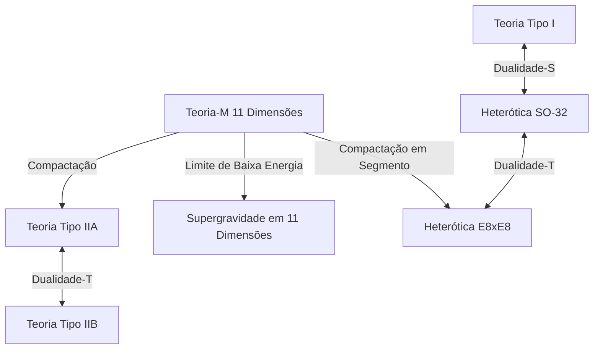

# Introdução: O Desafio do Sonho Definitivo da Física, a "Teoria de Tudo (TOE)"

Um dos objetivos mais ambiciosos da física moderna é a construção de uma "Teoria de Tudo" (Theory of Everything: TOE), que descreva de forma unificada as quatro forças fundamentais existentes na natureza — gravidade, força eletromagnética, força fraca e força forte. O Modelo Padrão (Standard Model) tem tido sucesso em descrever com extrema precisão três delas: a força eletromagnética, a força fraca e a força forte, juntamente com as partículas elementares a elas associadas. No entanto, quando se tenta incorporar apenas a "gravidade", descrita pela teoria da relatividade geral de Einstein, no âmbito da mecânica quântica, surgem dificuldades infinitas (não renormabilidade), causando um colapso fatal.

A "Teoria das Supercordas" (Superstring Theory) tem chamado a atenção como a única candidata promissora capaz de resolver essa profunda contradição. Neste artigo, explicaremos exaustivamente o quadro grandioso da teoria das supercordas, começando pela mudança de paradigma de considerar a unidade mínima da matéria não como um "ponto", mas como uma "corda unidimensional" (string), passando pela compactação das dimensões extras, a matemática das variedades de Calabi-Yau, a integração definitiva pela teoria-M, até o desafio das verificações mais recentes.

---

## Capítulo 1: O Colapso das Partículas Pontuais e a Introdução das Cordas

### As Dificuldades Infinitas na Teoria Quântica de Campos e a Não Renormalizabilidade da Gravidade

Na teoria quântica de campos convencional (Quantum Field Theory: QFT), que trata as partículas elementares como "pontos" sem volume, sempre houve o problema de que a energia da interação diverge para o infinito no limite em que a distância entre as partículas se aproxima de zero. Para as forças eletromagnética, forte e fraca, foi possível cancelar esse infinito e extrair previsões finitas e fisicamente significativas através de um método matemático chamado "teoria de renormalização" (Renormalization), estabelecido por Sin-Itiro Tomonaga, Richard Feynman, Julian Schwinger e outros.

No entanto, ao introduzir a partícula elementar desconhecida "gráviton" (graviton), que medeia a gravidade, e tentar quantizar a relatividade geral (construção da teoria da gravitação quântica), esse método de renormalização deixa de funcionar completamente. Como a constante de acoplamento da gravidade (constante de Newton) tem dimensão de energia, quanto mais se calculam os diagramas de Feynman de laços de ordem superior, mais surgem infinitamente novas divergências, exigindo um número infinito de parâmetros para cancelar tudo. Isso é chamado de "não renormalizabilidade da gravidade".

### O Modelo de Ressonância Dual de Yoichiro Nambu, Tetsuo Goto e a Corda Unidimensional

A história da teoria das supercordas começou em um ponto totalmente alheio à gravidade. Em 1968, Gabriele Veneziano descobriu que a amplitude de espalhamento (probabilidade de espalhamento) dos hádrons que interagem fortemente poderia ser surpreendentemente e brilhantemente descrita usando a função beta de Euler da matemática (amplitude de Veneziano).

Aqueles que descobriram o significado físico dessa fórmula matemática foram Yoichiro Nambu, Tetsuo Goto, Holger Nielsen, Leonard Susskind e outros. Em 1970, eles mostraram que a amplitude de Veneziano é deduzida naturalmente se for assumido que "os hádrons não são partículas pontuais, mas sim corpos vibrantes como cordas elásticas unidimensionais de comprimento finito" (Modelo de Ressonância Dual).

A ação mais básica para descrever o movimento dessa "corda" (string) é a ação de Nambu-Goto (Nambu-Goto Action). Enquanto o movimento de um ponto no espaço-tempo traça uma linha (linha de mundo), uma corda unidimensional traça uma superfície bidimensional (folha de mundo: Worldsheet). A ação de Nambu-Goto é definida como uma quantidade proporcional à área dessa folha de mundo.

$$ S = -T \int d\tau d\sigma \sqrt{- \det(\gamma_{ab})} $$

Aqui, $T$ é a tensão da corda (Tension) e $\gamma_{ab}$ é a métrica induzida na folha de mundo. Essa ação é geometricamente muito bela, mas lidar com a raiz quadrada ao quantizar traz dificuldades matemáticas.

### A Ação de Polyakov (Polyakov Action) e a Invariância Conforme

Por isso, Alexander Polyakov introduziu uma métrica de folha de mundo independente $h_{ab}$ como um campo auxiliar, propondo a "ação de Polyakov", uma ação mais fácil de manipular, equivalente à ação de Nambu-Goto, mas sem incluir a raiz quadrada.

$$ S = -\frac{T}{2} \int d^2\sigma \sqrt{-h} h^{ab} \partial_a X^\mu \partial_b X^\nu \eta_{\mu\nu} $$

A ação de Polyakov possui, além da invariância por reparametrização (Diffeomorphism invariance), a "invariância de Weyl" (Weyl invariance), que é invariante em relação a transformações locais de escala, ou seja, simetria conforme. Essa propriedade como uma teoria de campo conforme bidimensional (CFT) formará a poderosa base matemática da teoria das cordas.

---

## Capítulo 2: Cordas Abertas e Fechadas, Supersimetria

### Partículas Elementares como Modos de Vibração da Corda

A ideia mais revolucionária da teoria das cordas é o conceito de que "as inumeráveis partículas elementares que existem no universo não passam de diferentes modos de vibração (harmônicos) de uma única corda". Assim como a corda de um violino produz diferentes tons (frequências) dependendo de como é tocada, cordas minúsculas, assumindo diferentes estados vibracionais, aparecem aos nossos olhos como partículas elementares com diferentes massas e spins.

Existem dois tipos de cordas: as "cordas abertas" (Open string), que possuem extremidades, e as "cordas fechadas" (Closed string), onde as pontas se unem formando um anel.

### Partículas de Calibre Geradas por Cordas Abertas e Grávitons Gerados por Cordas Fechadas

**Cordas Abertas (Open String):**
As duas extremidades das cordas abertas não podem se mover livremente pelo espaço, mas estão fixadas sobre membranas chamadas D-branas, que serão descritas mais adiante. Ao analisar o estado fundamental (o modo de vibração de menor energia) da corda aberta, surge uma partícula vetorial de massa zero e spin 1. Trata-se exatamente de "bósons de calibre" (gauge bosons), como os fótons que medeiam a força eletromagnética e os glúons que medeiam a força forte.

**Cordas Fechadas (Closed String):**
Por outro lado, como as cordas fechadas não possuem extremidades, elas podem se propagar livremente pelo espaço-tempo sem serem restritas pelas branas. Ao quantizar e analisar os modos de vibração das cordas fechadas, de forma surpreendente, emerge inevitavelmente uma partícula tensorial de massa zero e "spin 2". É uma partícula que não existe no Modelo Padrão e possui exatamente as mesmas propriedades do "gráviton" (graviton), a partícula mediadora da gravidade prevista pela teoria da relatividade geral.

A teoria das cordas não foi projetada inicialmente com a intenção de incluir a gravidade. Embora tenha começado como uma teoria de hádrons, suas fórmulas matemáticas espontaneamente exigiram a existência do gráviton. Devido a este fato, a teoria das cordas sofreu uma mudança drástica, passando de um simples modelo para a força forte a candidata mais promissora para a "teoria da gravitação quântica" (proposta por John Schwarz e Joël Scherk em 1974).

### O Colapso da Teoria das Cordas Bosônicas (O Surgimento dos Táquions) e a Álgebra de Virasoro

A teoria das cordas inicial era a "teoria das cordas bosônicas", que descrevia apenas bósons (partículas que medeiam forças). Para tratar quanticamente as vibrações das cordas de forma correta, é preciso garantir que a invariância conforme não seja quebrada (que não haja anomalias) durante o processo de quantização.

A simetria conforme na folha de mundo bidimensional é descrita pela "álgebra de Virasoro" (Virasoro Algebra), que é uma álgebra de Lie de dimensão infinita.
$$ [L_m, L_n] = (m - n)L_{m+n} + \frac{c}{12}m(m^2 - 1)\delta_{m+n, 0} $$
Aqui, $c$ é chamado de carga central (central charge). Para que a teoria das cordas bosônicas se sustente sem contradições matemáticas (sem o surgimento de estados fantasmas), foi provado que a dimensão do espaço-tempo $D$, de forma surpreendente, deve ser de "26 dimensões (25 dimensões espaciais + 1 dimensão temporal)".

Como um problema ainda mais fatal, o estado de energia mais baixa na teoria das cordas bosônicas torna-se um "táquion" (Tachyon), cuja massa é um número imaginário (a massa ao quadrado é negativa). Um vácuo onde existem táquions é instável, significando que a teoria não pode descrever a realidade física.

### A Introdução da Supersimetria (Supersymmetry) e a Teoria das Supercordas (10 Dimensões)

Para resolver o problema dos táquions e o defeito de que a teoria não incluía os férmions (como elétrons e quarks) que compõem a matéria, foi introduzida a "supersimetria" (Supersymmetry: SUSY). A supersimetria é uma simetria que permuta bósons (partículas com spin inteiro) e férmions (partículas com spin semi-inteiro).

Na "Teoria das Supercordas" (Superstring Theory), que introduziu a supersimetria na folha de mundo da corda, mostrou-se que, ao realizar uma operação matemática chamada de projeção GSO (Gliozzi-Scherk-Olive projection), o táquion é brilhantemente excluído do espectro, e, simultaneamente, a supersimetria do espaço-tempo é alcançada.

Nesta teoria das supercordas, onde a anomalia conforme é cancelada e se torna matematicamente consistente, o número de dimensões do espaço-tempo é de "10 dimensões (9 dimensões espaciais + 1 dimensão temporal)". Embora isso seja muito diferente do espaço-tempo de 4 dimensões (3 dimensões espaciais + 1 dimensão temporal) em que vivemos, as dimensões foram drasticamente reduzidas de 26 para 10, e foi um momento em que nos aproximamos mais da física realista.

---

## Capítulo 3: A Primeira Revolução da Teoria das Supercordas

Do final dos anos 1970 até o início dos anos 1980, a teoria das supercordas havia sido quase abandonada pela comunidade de físicos, exceto por alguns pesquisadores dedicados. Isso porque acreditava-se que contradições matemáticas chamadas de anomalias quânticas inevitavelmente surgiriam quando se combinassem a teoria de calibre e a gravidade.

### 1984: O Milagroso Cancelamento de Anomalias de Green e Schwarz

No verão de 1984, Michael Green e John Schwarz alcançaram um cálculo histórico. Eles provaram que, em uma teoria de supercordas de 10 dimensões que atenda a condições específicas, as anomalias de calibre e da gravidade se cancelam perfeitamente no nível dos diagramas de hexágonos de Feynman, tornando-se completamente zero.

Ficou evidente que, para que esse cancelamento milagroso ocorresse, o grupo de calibre por trás da teoria devia ser um grupo de simetria gigante específico. Descobriu-se que existiam apenas dois: o **$SO(32)$** (grupo ortogonal especial de 32 dimensões) e o **$E_8 \times E_8$** (produto direto do grupo excepcional E8).

Esta descoberta causou um tremendo impacto na comunidade da física e desencadeou um boom explosivo de pesquisas conhecido como a "Primeira Revolução da Teoria das Supercordas". De repente, o caminho para a Teoria de Tudo abriu-se de forma clara.

### As 5 Teorias das Supercordas Consistentes

Após a descoberta de Green e Schwarz, as pesquisas aceleraram rapidamente e, no final, ficou claro que as teorias de supercordas consistentes em 10 dimensões são classificadas em "5 tipos".

1. **Teoria Tipo I (Type I)**: Contém cordas abertas e fechadas. A supersimetria é $N=1$. O grupo de calibre é $SO(32)$.
2. **Teoria Tipo IIA (Type IIA)**: Apenas cordas fechadas. A supersimetria é $N=2$ e não quiral (conserva a simetria de paridade).
3. **Teoria Tipo IIB (Type IIB)**: Apenas cordas fechadas. A supersimetria é $N=2$ e quiral (quebra a paridade; semelhante à natureza das interações fracas no mundo real).
4. **Teoria Heterótica $SO(32)$**: Apenas cordas fechadas. Uma teoria bizarra, porém bela, que hibridiza vibrações para a direita (supercordas em 10 dimensões) e para a esquerda (cordas bosônicas em 26 dimensões). O grupo de calibre é $SO(32)$.
5. **Teoria Heterótica $E_8 \times E_8$**: Estrutura híbrida similar. O grupo de calibre é $E_8 \times E_8$. Por poder englobar naturalmente a simetria do Modelo Padrão real ($SU(3) \times SU(2) \times U(1)$), chegou a ser considerada a mais promissora por um tempo.

Cada uma destas cinco teorias tinha uma consistência matemática perfeita. Pela filosofia de que "a Teoria de Tudo deveria ser apenas uma", a existência de cinco candidatas tornou-se um grande mistério para os físicos da época.

---

## Capítulo 4: A Compactação de Dimensões Extras e as Variedades de Calabi-Yau

O espaço-tempo de "10 dimensões" exigido pela teoria das supercordas é obviamente contraditório com as "3 dimensões espaciais + 1 dimensão temporal (4 dimensões no total)" que percebemos no dia a dia. Afinal, onde estão escondidas as 6 dimensões espaciais restantes (Dimensões Extras: Extra Dimensions)?

### A Genealogia da Teoria de Kaluza-Klein

O próprio conceito de dimensões extras é muito mais antigo do que a teoria das cordas e remonta a Theodor Kaluza e Oskar Klein na década de 1920. Eles expandiram a teoria da relatividade geral para 5 dimensões (4 dimensões espaciais + 1 dimensão temporal) e, ao enrolar (compactar) a quarta dimensão espacial em um círculo extremamente pequeno, conseguiram deduzir unificadamente a gravidade e o eletromagnetismo em 4 dimensões. A estrutura geométrica das dimensões extras manifesta-se como uma "força (campo de calibre)" no mundo de baixas energias.

### Variedades de Kähler Ricci-Planas: Espaços de Calabi-Yau

Para extrair uma física realista de 4 dimensões da teoria das supercordas de 10 dimensões, é necessária a "compactação" (Compactification) para enrolar as 6 dimensões extras em um tamanho minúsculo, em torno do comprimento de Planck (cerca de $10^{-35}$ metros). Não basta simplesmente enrolá-las, mas é preciso satisfazer restrições físicas rigorosas, como a de preservar pelo menos uma supersimetria com $N=1$ no espaço de 4 dimensões (para resolver o problema de hierarquia e deduzir os férmions).

Em 1985, Philip Candelas, Gary Horowitz, Andrew Strominger e Edward Witten provaram que este espaço extra de 6 dimensões deve ser uma variedade complexa especial que satisfaz condições matemáticas específicas.

Essa condição é ser uma "variedade de Kähler compacta Ricci-plana (Ricci-flat)". Como o matemático Eugenio Calabi conjecturou a existência de tal espaço geométrico e Shing-Tung Yau a provou matematicamente, eles são chamados de "**Variedades de Calabi-Yau (Calabi-Yau manifold)**".

### O Número de Euler e o Número de Gerações de Quarks

As estruturas extremamente abstrusas e complexas dos "buracos" e a "topologia" dos espaços de Calabi-Yau determinam completamente as propriedades das partículas elementares em nosso mundo de 4 dimensões.

Por exemplo, demonstrou-se que o valor absoluto da metade do "número de Euler" (Euler characteristic), um invariante que caracteriza a topologia da variedade, corresponde ao "número de gerações de partículas elementares" que aparecem no mundo real. No Modelo Padrão, já que existem 3 gerações de quarks e léptons (up/down, charm/strange, top/bottom), procurar por um espaço de Calabi-Yau cujo número de Euler seja $\pm 6$ tornou-se a tarefa mais importante na fenomenologia da teoria das cordas.

### A Maravilha da Simetria de Espelho (Mirror Symmetry)

O estudo das variedades de Calabi-Yau trouxe avanços dramáticos também para o campo da matemática pura. Físicos descobriram que dois espaços de Calabi-Yau com topologias completamente diferentes (um par de espelho) descrevem exatamente o mesmo fenômeno físico na teoria das cordas. Isso é a "simetria de espelho".

O fenômeno em que o cálculo sobre uma das variedades, extremamente difícil matematicamente (por exemplo, o problema de geometria enumerativa de contar o número de curvas racionais), era facilmente resolvido convertendo-o em um problema de integração sobre a outra variedade através da simetria de espelho, ocorreu repetidamente e surpreendeu os matemáticos. A teoria das cordas não é apenas uma teoria física, mas também atua como um "detector definitivo" para descobrir matemáticas profundas e desconhecidas.

---

## Capítulo 5: A Segunda Revolução da Teoria das Supercordas e a Teoria-M

Até meados da década de 1990, acreditava-se que as cinco teorias de supercordas eram teorias separadas e independentes. No entanto, em 1995, na conferência internacional de cordas realizada na Universidade do Sul da Califórnia, uma palestra histórica feita por Edward Witten mudou a situação drasticamente. Foi o início da "Segunda Revolução da Teoria das Supercordas".

### O Dicionário Mágico Chamado Dualidade (Duality)

Witten usou o conceito de "dualidade" (Duality) para provar brilhantemente que as 5 teorias de supercordas, à primeira vista completamente diferentes, na verdade não passavam de diferentes aspectos de uma "única teoria definitiva". Existem duas dualidades principais:

- **Dualidade-T (Target-space Duality)**: Uma propriedade surpreendente onde, considerando que o raio de compactação do espaço é $R$, uma teoria de raio $R$ e uma teoria de raio $1/R$ tornam-se fisicamente e perfeitamente equivalentes. Com isso, mostrou-se que as teorias Tipo IIA e Tipo IIB, bem como as duas teorias Heteróticas, estão interligadas, respectivamente. Um universo minúsculo e um universo gigante são indistinguíveis do ponto de vista da teoria das cordas.
- **Dualidade-S (Strong-weak Duality)**: Uma relação onde, sendo $g$ a constante de acoplamento da interação, uma teoria com uma grande constante de acoplamento (interação forte) é equivalente a uma teoria fraca com uma constante de acoplamento igual a $1/g$. Graças a isso, a teoria Tipo I e a teoria Heterótica SO(32) foram conectadas, e tornou-se possível calcular a física de regiões de forte acoplamento (até então incalculáveis) usando as regiões de fraco acoplamento da outra teoria.

### A Descoberta da D-brana (D-brane)

Na mesma época do anúncio de Witten, Joseph Polchinski definiu claramente o conceito de "**D-brana (D-brane)**" e provou a sua importância na teoria das cordas. A D-brana é uma entidade semelhante a uma "membrana de alta dimensão" à qual os extremos das cordas abertas podem se fixar (o "D" vem de condições de contorno de Dirichlet).

A D-brana tornou-se um componente indispensável na teoria das cordas, por exemplo, na elucidação da origem microscópica da entropia de buracos negros (resultado de Strominger e Vafa em 1996). A "Hipótese de Mundos-Brana" (Braneworld), que sugere a possibilidade de que o próprio nosso universo seja uma gigante D3-brana (membrana espacial tridimensional), também deriva daí.

### A "Teoria-M" de 11 Dimensões Que Integra Tudo

Witten, que integrou as 5 teorias de supercordas através de uma rede de dualidades, propôs a "**Teoria-M (M-theory)**" como uma teoria de nível superior para unificar essas teorias.

Surpreendentemente, o espaço-tempo em que a teoria-M se desenvolve tem "11 dimensões (10 dimensões espaciais + 1 dimensão temporal)". Quando a constante de acoplamento na teoria Tipo IIA é levada ao limite do infinito, mais uma dimensão espacial invisível (a 11ª dimensão) surge na forma de um círculo, revelando que a "corda" de 1 dimensão, na verdade, era o resultado de uma "membrana" (membrane) de 2 dimensões enrolada.

O significado do "M" na teoria-M (Membrane, Magic, Mystery, Matrix, Mother, etc.) foi deixado intencionalmente ambíguo pelo próprio Witten. Até hoje, a formulação matemática completa (as equações fundamentais) da teoria-M ainda não foi encontrada, permanecendo como um dos maiores problemas não resolvidos da física moderna. No entanto, sua natureza fragmentada vem sendo gradualmente elucidada por meio do Princípio Holográfico (Correspondência AdS/CFT) e afins.

*(Nota: Diagrama de unificação centrado na teoria-M, ligando as 5 teorias de supercordas através da dualidade)*

---

## Capítulo 6: Paisagem das Cordas (String Landscape) e os Desafios de Verificação

Já faz muito tempo que a teoria das supercordas reina como a candidata mais promissora a Teoria de Tudo, mas por ser uma ciência física, a sua verificação por meio de experimentos e observações é essencial. Contudo, há um enorme obstáculo pela frente.

### 10^500 Vácuos: A Paisagem das Cordas e o Princípio Antrópico

As combinações de topologias das variedades de Calabi-Yau, configurações de D-branas e fluxos (como linhas de campos magnéticos) envolvendo as variedades são incontáveis. Cálculos do início da década de 2000 revelaram que o número de vácuos estáveis e metaestáveis (candidatos a padrões de universos) permitidos pela teoria das cordas atinge a surpreendente marca de mais de **$10^{500}$** tipos (como o cenário KKLT).

Isso é conhecido como a "**Paisagem das Cordas (String Landscape)**". A teoria das cordas não é uma teoria que determina as leis de nosso universo de maneira única, mas é sim uma estrutura que dá origem a inúmeros universos (multiverso), com todas as leis concebíveis.

Esse fato causou profundos debates na comunidade física. Isso ocorreu pois, diante da pergunta "Por que nosso universo tem as leis atuais (o valor minúsculo da constante cosmológica, o requintado equilíbrio das massas das partículas elementares)?", fomos forçados a introduzir o "Princípio Antrópico (Anthropic Principle)", de que "em meio aos incontáveis universos, é inevitável que observemos um universo cujas condições permitem a existência de formas de vida inteligentes como nós". Leonard Susskind e outros apoiam fortemente isso, mas também há muitos físicos que se opõem vigorosamente, argumentando a infalsificabilidade da teoria.

### A Conjectura do Swampland (Swampland)

Nos últimos anos, como uma nova abordagem frente à Paisagem, a "conjectura do **Swampland (Pântano)**", proposta por Cumrun Vafa e colaboradores, tem ganhado rápida atenção.

O Swampland refere-se ao conjunto de teorias de campos efetivos (modelos físicos de baixas energias) que, embora pareçam não ter contradições à primeira vista, não podem ser acoplados de maneira consistente à teoria de gravitação quântica (teoria das cordas). Vafa e seus colegas vêm estabelecendo continuamente rigorosos critérios (condições do Swampland), tais como "a gravidade deve ser sempre a força mais fraca (Conjectura da Gravidade Fraca)" e "existem restrições rígidas quanto à expansão acelerada do universo causada pela energia escura (Conjectura de de Sitter)".

Com isso, espera-se poder restringir severamente as condições para os universos que podem ser de fato observados na realidade, em meio à imensa Paisagem com estimados $10^{500}$ cenários.

### Desafios Intermináveis Para a Verificação Experimental

Uma prova direta para a teoria das cordas exige a escala de energia de Planck (um gigantesco acelerador de partículas do tamanho da Via Láctea é necessário), tornando-se quase impossível na prática. No entanto, métodos para verificações indiretas continuam sendo procurados ativamente.

1. **Observação de Ondas Gravitacionais Primordiais:**
   Projetos (como o satélite LiteBIRD) para observar os traços que as "ondas gravitacionais primordiais", geradas durante a época inflacionária do universo, gravaram na polarização (Modo-B) da radiação cósmica de fundo em micro-ondas (CMB). Pode haver a possibilidade de verificar modelos inflacionários que são exclusivos da teoria das cordas.
2. **Raios Cósmicos de Altíssima Energia e Buracos Negros Minúsculos:**
   Esperava-se observar, com o Grande Colisor de Hádrons (LHC) da CERN e similares, a geração de "mini-buracos negros" que indicariam a presença de dimensões extras, ou o déficit de energia (missing energy) causado por grávitons escapando para essas dimensões extras. Atualmente, evidências concretas não foram encontradas, e limites estritos para o tamanho das dimensões extras foram impostos.
3. **Cordas Cósmicas (Cosmic String):**
   A possibilidade de cordas gigantes de macroescala (cordas cósmicas), formadas pelas transições de fase no universo primitivo, serem observadas através do efeito de lentes gravitacionais ou de emissões (bursts) de ondas gravitacionais.

## Conclusão: Uma Jornada sem Fim Rumo à Verdade Absoluta

A teoria das supercordas é, sem dúvida, a consolidação do conhecimento mais imponente e matematicamente belo que a humanidade já alcançou. Os saltos conceituais de partículas pontuais para as cordas, e de dimensões extras para membranas (teoria-M), trazem a nós a possibilidade de que o espaço e o tempo em si não sejam fundamentais, mas sim uma "ilusão" que emerge da geometria de dimensões mais profundas.

O fato de haver uma dura crítica de que "a teoria das cordas não é física, mas meramente matemática ou filosofia", devido à falta de evidências experimentais diretas, é uma realidade. No entanto, por oferecer dicas para a resolução do paradoxo da informação nos buracos negros e fornecer abordagens de cálculo completamente novas para a física do estado sólido fracamente acoplada (como na supercondutividade) através da correspondência AdS/CFT, a teoria das cordas já está profundamente enraizada como uma linguagem indispensável para as vastas áreas da física teórica.

Nós ainda não colocamos as mãos na verdadeira equação da teoria-M. Qual forma têm as seis dimensões extras ocultas na escuridão dos espaços de Calabi-Yau e onde nosso universo está posicionado em meio à Paisagem de $10^{500}$ possibilidades? Com o objetivo de esclarecer esse panorama total, os incessantes desafios dos físicos ainda continuam nos dias de hoje.

---

## Apêndice: O Plano de Fundo Matemático Avançado que Sustenta a Teoria das Supercordas

Este material principal foi delineado priorizando a intuição matemática, contudo, as fórmulas e as estruturas geométricas que fundamentam as bases concretas da teoria das supercordas serão descritas num patamar mais avançado e em mais detalhes.

### A. A Formulação Completa da Ação de Polyakov e da Teoria de Campo Conforme (CFT) Bidimensional

A ação de Polyakov, que descreve a dinâmica da superfície gerada pela trajetória da corda conforme ela caminha pelo espaço-tempo (folha de mundo - Worldsheet), é dada a seguir:

$$ S_P = -\frac{T}{2} \int d^2\sigma \sqrt{-h} h^{\alpha\beta} \partial_\alpha X^\mu \partial_\beta X^\nu \eta_{\mu\nu} $$

Aqui, $X^\mu(\tau, \sigma)$ é o mapeamento das coordenadas da folha de mundo $(\tau, \sigma)$ para o espaço-tempo alvo (isto é, as coordenadas da corda no espaço-tempo). A característica mais importante dessa ação é o fato dela possuir as três seguintes simetrias locais.
1. **Invariância por Difeomorfismo em 2 dimensões (Diffeomorphism invariance):** Invariância frente à transformação de coordenadas na folha de mundo $\sigma^\alpha \to \sigma^{\prime\alpha}(\sigma)$.
2. **Invariância de Poincaré em 2 dimensões:** Invariância frente a translações e transformações de Lorentz no espaço-tempo alvo.
3. **Invariância de Weyl (Weyl invariance):** Invariância frente a transformações locais de escala do tensor métrico $h_{\alpha\beta}(\sigma) \to e^{2\omega(\sigma)}h_{\alpha\beta}(\sigma)$.

Classicamente a invariância de Weyl é mantida, entretanto, no momento em que a quantização usando a integração de trajetória é conduzida, uma "Anomalia Conforme (Conformal Anomaly)" emerge a partir da transformação Jacobiana da medida. Calculando a condição para cancelar essa anomalia e manter a invariância de Weyl mesmo a nível quântico, as contribuições do campo fantasma (fantasmas de Faddeev-Popov) e as contribuições do campo material ($X^\mu$) devem se cancelar. É precisamente isso que representa a força matriz matemática que exige a adoção de $D=26$ na teoria das cordas bosônicas e de $D=10$ na teoria das supercordas.

### B. Variedades de Calabi-Yau e a Matemática do Plano de Ricci

Como condição para a compactação e derivação de teorias efetivas em 4 dimensões a partir de uma teoria das supercordas de 10 dimensões, é necessário deixar a supersimetria em cima do espaço residual de 6 dimensões $K$ (no qual o campo de espinor seja covariante e constante). Ou seja, a equação diferencial $\nabla_m \eta = 0$ ($\eta$ é um espinor intrínseco) tem de ser atendida.

A fim de suprir a referida condição, o grupo de holonomia do espaço $K$ tem de estar inserido em $SU(3)$, fato esse que é geometricamente equivalente às condições abaixo:
1. $K$ é uma variedade de Kähler (Kähler manifold). Isto significa possuir um feixe quadrático fechado não-degenerado (Forma de Kähler $J$).
2. A primeira classe de Chern $c_1(K)$ de $K$ ser zero.

Em virtude do teorema de Yau (Prova da conjectura de Calabi), para qualquer variedade de Kähler com a propriedade de que $c_1(K)=0$, haverá certamente a presença única da chamada "Métrica de Kähler Plana de Ricci", na qual o tensor de Ricci $R_{mn}$ se iguala a zero. Isso é o que vem a ser a variedade de Calabi-Yau.

A geometria atinente à variedade de Calabi-Yau é caraterizada pelas dimensões (números de Hodge $h^{p,q}$) formadoras de seu grupo de co-homologia $H^{p,q}(K)$. Em especial, a extrema importância dos dois números de Hodge denominados $h^{2,1}$ e $h^{1,1}$.
- $h^{1,1}$ é equivalente ao número representativo do grau de modificação (moduli) no tocante à estrutura de Kähler (o "Tamanho" da Variedade e Parâmetros em seu formato).
- $h^{2,1}$ é correspondente aos números que indicam a deformação da estrutura complexa.

Num olhar embasado em parâmetros físicos, constata-se a relação íntima de união na qual o valor correspondente ao Número de Euler de $\chi = 2(h^{1,1} - h^{2,1})$ está associado diretamente a defasagem no número correspondente as gerações envolvendo as estruturas de componentes férmions quirais (quarks, léptons etc.) dispostas em 4 dimensões. A título de exemplo, com vistas a propiciar a derivação nas chamadas "3 Gerações", necessita-se encontrar e fazer uso de conjuntos dimensionais de modo que $\chi = \pm 6$. Através de mecanismos que incorporaram técnicas em variedades Z3 Orbifold e variados modelos teóricos, tem-se tentado instituir configurações estruturais em tais espaços.

### C. A Correspondência AdS/CFT: A Materialização Plena do Princípio Holográfico

A principal sub-teoria decorrente das pesquisas que se voltaram a abordar a Teoria-M e o modelo envolto em D-Branas reside na chamada "Correspondência AdS/CFT (Anti-de Sitter/Conformal Field Theory correspondence)", que em 1997 fora aventada pela primeira vez através dos trabalhos conduzidos por Juan Maldacena.

Isso repousa numa predição fantástica na qual alega-se que "Uma Teoria de Gravitação (Teoria das Supercordas) alocada em um Universo-Espaço 5D de Anti-de Sitter (Espaço AdS)" vem a exibir caráter equivalente frente a uma "Teoria de Campo Conforme que se apresente configurada em intermédios envoltos ao seu contorno 4D (CFT: Teoria de Calibre omissa à Gravidade)".

$$ Z_{\text{AdS}}[J] = \langle e^{\int \mathcal{O} J} \rangle_{\text{CFT}} $$

Essa equivalência tornou-se um exemplo de realização matematicamente rigorosa do "Princípio Holográfico", onde duas teorias com diferentes dimensões descrevem a mesma física. Como é possível traduzir e resolver uma teoria de calibre fortemente acoplada (incalculável) usando uma gravidade clássica fracamente acoplada (calculável pela relatividade geral), hoje em dia gera aplicações extremamente amplas, não apenas na física de partículas elementares, mas também na física do estado sólido (como supercondutividade de alta temperatura e cálculo da viscosidade do plasma de quarks e glúons) e até na teoria da informação quântica. Esta foi uma mudança de paradigma simbólica, onde a teoria das supercordas evoluiu de uma mera "hipótese" para uma "ferramenta útil" para toda a física.
