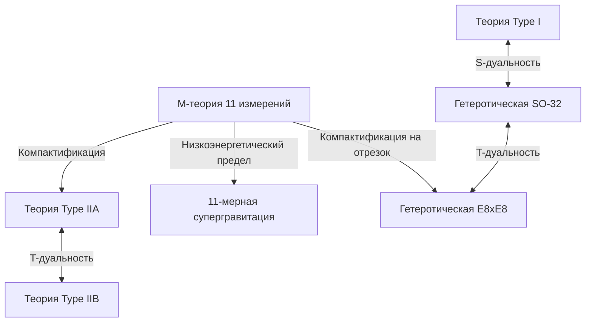

# Введение: Вызов величайшей мечте физики — «Теории всего (TOE)»

Одной из самых амбициозных целей современной физики является создание «Теории всего» (Theory of Everything: TOE), которая бы единым образом описывала четыре фундаментальные силы природы — гравитацию, электромагнитизм, слабое и сильное взаимодействия. Стандартная модель (Standard Model) с невероятно высокой точностью описывает три из них (электромагнитное, слабое и сильное), а также связанные с ними элементарные частицы. Однако, когда физики пытаются включить в квантовую структуру «гравитацию», описываемую общей теорией относительности Эйнштейна, возникают непреодолимые трудности с бесконечностями (неперенормируемость), что приводит к фатальному краху.

Единственным перспективным кандидатом, способным разрешить это глубокое противоречие, в настоящее время считается «Теория суперструн» (Superstring Theory). В этой статье мы подробно рассмотрим грандиозную картину теории суперструн, начиная со смены парадигмы, при которой мельчайшими единицами материи считаются не «точки», а «одномерные струны», и заканчивая компактификацией дополнительных измерений, математикой многообразий Калаби-Яу, окончательным объединением через М-теорию и новейшими вызовами в области экспериментальных проверок.

---

## Глава 1: Крах точечных частиц и введение струн

### Проблема бесконечностей в квантовой теории поля и неперенормируемость гравитации

В традиционной квантовой теории поля (Quantum Field Theory: QFT), где элементарные частицы рассматриваются как «точки» (point) без объема, всегда существовала проблема: при взаимодействии частиц, когда расстояние между ними стремится к нулю, энергия взаимодействия расходится до бесконечности. Для электромагнитного, сильного и слабого взаимодействий математический метод, названный «теорией перенормировки» (Renormalization), разработанный Синъитиро Томонагой, Ричардом Фейнманом и Джулианом Швингером, позволил компенсировать эти бесконечности и получать конечные, физически значимые предсказания.

Однако, если попытаться ввести неизвестную элементарную частицу «гравитон» (graviton), передающую гравитацию, и проквантовать общую теорию относительности (построить теорию квантовой гравитации), этот метод перенормировки совершенно перестает работать. Поскольку константа связи гравитации (постоянная Ньютона) имеет размерность, зависящую от энергии, то чем больше петель диаграмм Фейнмана высших порядков мы вычисляем, тем больше новых расходимостей возникает до бесконечности, и для их компенсации потребовалось бы бесконечное число параметров. Это называется «неперенормируемостью гравитации».

### Дуальная резонансная модель Ёитиро Намбу, Тэцуо Гото и других и одномерные струны

История теории суперструн началась в области, совершенно не связанной с гравитацией. В 1968 году Габриэле Венециано (Gabriele Veneziano) обнаружил, что амплитуда рассеяния (вероятность рассеяния) адронов, участвующих в сильном взаимодействии, может быть на удивление блестяще описана с помощью математической бета-функции Эйлера (амплитуда Венециано).

Физический смысл в этой формуле нашли Ёитиро Намбу, Тэцуо Гото, а также Хольгер Нильсен и Леонард Сасскинд. В 1970 году они показали, что амплитуда Венециано возникает естественным образом, если предположить, что «адроны — это не точечные частицы, а колеблющиеся объекты, подобные одномерным резиновым струнам конечной длины» (Дуальная резонансная модель).

Самым фундаментальным действием для описания движения этой «струны» является действие Намбу-Гото (Nambu-Goto Action). В то время как точка при движении в пространстве-времени описывает линию (мировую линию), одномерная струна описывает двумерную поверхность (мировой лист: Worldsheet). Действие Намбу-Гото определяется как величина, пропорциональная площади этого мирового листа.

$$ S = -T \int d\tau d\sigma \sqrt{- \det(\gamma_{ab})} $$

Здесь $T$ — это натяжение струны (Tension), а $\gamma_{ab}$ — индуцированная метрика на мировом листе. Это действие очень красиво с геометрической точки зрения, но наличие квадратного корня вызывает математические трудности при квантовании.

### Действие Полякова (Polyakov Action) и конформная инвариантность

Тогда Александр Поляков (Alexander Polyakov) предложил ввести независимую метрику мирового листа $h_{ab}$ в качестве вспомогательного поля и выдвинул более удобное для работы «действие Полякова», которое эквивалентно действию Намбу-Гото, но не содержит квадратного корня.

$$ S = -\frac{T}{2} \int d^2\sigma \sqrt{-h} h^{ab} \partial_a X^\mu \partial_b X^\nu \eta_{\mu\nu} $$

Действие Полякова, помимо инвариантности относительно перепараметризации (Diffeomorphism invariance), обладает инвариантностью по отношению к локальным масштабным преобразованиям — «вейлевской инвариантностью» (Weyl invariance), то есть конформной симметрией. Эти свойства двумерной конформной теории поля (CFT) в дальнейшем сформируют мощный математический фундамент теории струн.

---

## Глава 2: Открытые и замкнутые струны, суперсимметрия

### Элементарные частицы как моды колебаний струны

Самая революционная идея теории струн заключается в том, что «бесчисленные элементарные частицы, существующие во Вселенной, — это просто различные моды колебаний (обертоны) одной и той же струны». Подобно тому, как струна скрипки при разном способе игры издает разные звуки (частоты), крошечные струны, принимая различные вибрационные состояния, предстают перед нами в виде элементарных частиц с различными массами и спинами.

Существует два типа струн: «открытые струны» (Open string), у которых есть концы, и «замкнутые струны» (Closed string), концы которых соединены, образуя кольцо.

### Калибровочные частицы, рождаемые открытыми струнами, и гравитоны, рождаемые замкнутыми струнами

**Открытые струны (Open String):**
Концы открытых струн не могут свободно перемещаться в пространстве; они прикреплены к мембранам, называемым D-бранами, о которых пойдет речь позже. Анализ основного состояния (состояния колебаний с наименьшей энергией) открытой струны выявляет появление векторных частиц с нулевой массой и спином 1. Это в точности «калибровочные бозоны», такие как фотоны (переносчики электромагнитного взаимодействия) или глюоны (переносчики сильного взаимодействия).

**Замкнутые струны (Closed String):**
С другой стороны, поскольку у замкнутой струны нет концов, она не привязана к бранам и может свободно распространяться в пространстве-времени. Квантование и анализ колебательных мод замкнутых струн удивительным образом показывает, что неизбежно появляются тензорные частицы с нулевой массой и «спином 2». Это частица, обладающая точно такими же свойствами, как «гравитон», переносчик гравитации, предсказанный общей теорией относительности, но не существующий в Стандартной модели.

Теория струн изначально не проектировалась для включения в нее гравитации. Несмотря на то, что она зародилась как теория адронов, ее формулы спонтанно потребовали существования гравитона. Этот факт позволил теории струн совершить драматический переход от простой модели сильного взаимодействия к главному кандидату на роль «теории квантовой гравитации» (что было предложено Джоном Шварцем и Жоэлем Шерком в 1974 году).

### Крах бозонной теории струн (появление тахионов) и алгебра Вирасоро

Ранняя теория струн была «бозонной теорией струн», описывающей только бозоны (частицы-переносчики взаимодействий). Для того чтобы квантово-механически корректно работать с колебаниями струны, необходимо убедиться, что конформная инвариантность не нарушается (отсутствие аномалий) в процессе квантования.

Конформная симметрия на двумерном мировом листе описывается бесконечномерной алгеброй Ли — «алгеброй Вирасоро» (Virasoro Algebra).
$$ [L_m, L_n] = (m - n)L_{m+n} + \frac{c}{12}m(m^2 - 1)\delta_{m+n, 0} $$
Здесь $c$ называется центральным зарядом (central charge). Было доказано, что для того чтобы бозонная теория струн работала без математических противоречий (появления духовых состояний), размерность пространства-времени $D$, как это ни удивительно, должна быть равна «26 измерениям (25 пространственных + 1 временное)».

Более фатальной проблемой является то, что состояние с наименьшей энергией в бозонной теории струн оказывается «тахионом» (Tachyon), масса которого является мнимой (квадрат массы отрицателен). Вакуум, в котором существуют тахионы, нестабилен, что означает невозможность описания физической реальности такой теорией.

### Введение суперсимметрии (Supersymmetry) и теория суперструн (10 измерений)

Для решения проблемы тахионов и устранения недостатка, заключающегося в том, что теория не включала фермионы (такие как электроны и кварки), из которых состоит материя, была введена «суперсимметрия» (Supersymmetry: SUSY). Суперсимметрия — это симметрия, меняющая местами бозоны (частицы с целым спином) и фермионы (частицы с полуцелым спином).

В «теории суперструн» (Superstring Theory), где суперсимметрия была введена на мировом листе струны, было показано, что применение математической операции, называемой проекцией Глиоцци-Шерка-Олива (GSO projection), успешно исключает тахионы из спектра и одновременно реализует суперсимметрию пространства-времени.

В этой теории суперструн конформная аномалия взаимно уничтожается, и число измерений пространства-времени, при котором теория становится математически непротиворечивой, равно «10 (9 пространственных + 1 временное)». Это сильно отличается от нашего 4-мерного пространства-времени (3 пространственных + 1 временное), однако это был момент, когда размерность резко сократилась с 26 до 10, приблизив теорию на шаг к реальной физике.

---

## Глава 3: Первая революция суперструн

С конца 1970-х по начало 1980-х годов теория суперструн была наполовину заброшена физическим сообществом, за исключением нескольких преданных исследователей. Считалось, что при объединении калибровочных теорий и гравитации неизбежно возникают математические противоречия, называемые квантовыми аномалиями (anomalies).

### 1984 год: Чудесное сокращение аномалий Грина и Шварца

Летом 1984 года Майкл Грин (Michael Green) и Джон Шварц (John Schwarz) совершили исторические вычисления. Они доказали, что в 10-мерной теории суперструн, удовлетворяющей определенным условиям, калибровочные и гравитационные аномалии удивительным образом компенсируют друг друга на уровне шестиугольных диаграмм Фейнмана (хексагонов) и становятся точно равными нулю.

Выяснилось, что для этого чудесного сокращения калибровочная группа, лежащая в основе теории, должна быть конкретной огромной группой симметрии. Таких было только две: **$SO(32)$** (специальная ортогональная группа размерности 32) и **$E_8 \times E_8$** (прямое произведение исключительной группы E8).

Это открытие потрясло физическое сообщество и вызвало взрывной исследовательский бум, который назвали «Первой революцией суперструн». Путь к Теории всего внезапно стал ясен.

### 5 непротиворечивых теорий суперструн

После открытия Грина и Шварца исследования резко ускорились, и в конечном итоге выяснилось, что непротиворечивые 10-мерные теории суперструн можно классифицировать на следующие «5 видов»:

1. **Теория типа I (Type I)**: Включает как открытые, так и замкнутые струны. Суперсимметрия $N=1$. Калибровочная группа $SO(32)$.
2. **Теория типа IIA (Type IIA)**: Только замкнутые струны. Суперсимметрия $N=2$, некиральная (сохраняет симметрию четности).
3. **Теория типа IIB (Type IIB)**: Только замкнутые струны. Суперсимметрия $N=2$, киральная (нарушает четность, что близко к свойствам реального слабого взаимодействия).
4. **Гетеротическая (Heterotic) теория $SO(32)$**: Только замкнутые струны. Причудливая, но красивая теория, объединяющая правосторонние колебания (10-мерная суперструна) и левосторонние колебания (26-мерная бозонная струна). Калибровочная группа $SO(32)$.
5. **Гетеротическая (Heterotic) теория $E_8 \times E_8$**: Похожая гибридная структура. Калибровочная группа $E_8 \times E_8$. Одно время считалась наиболее многообещающей, так как может естественным образом включать в себя симметрию реальной Стандартной модели ($SU(3) \times SU(2) \times U(1)$).

Каждая из этих 5 теорий обладала идеальной математической согласованностью. С точки зрения философии «Теория всего должна быть только одна», существование целых 5 кандидатов стало большой загадкой для физиков того времени.

---

## Глава 4: Компактификация дополнительных измерений и многообразия Калаби-Яу

Пространство-время «10 измерений», требуемое теорией суперструн, явно противоречит тем «3 пространственным + 1 временному (в сумме 4 измерениям)», которые мы повседневно воспринимаем. Где же скрыты остальные 6 пространственных измерений (дополнительные измерения: Extra Dimensions)?

### Наследие теории Калуцы-Клейна

Сама концепция дополнительных измерений намного старше теории струн и восходит к Теодору Калуце (Theodor Kaluza) и Оскару Клейну (Oskar Klein) в 1920-х годах. Они расширили общую теорию относительности до 5 измерений (4 пространственных + 1 временное) и, свернув (компактифицировав) 4-е пространственное измерение в крошечную окружность, смогли единым образом вывести гравитацию и электромагнетизм в 4 измерениях. Геометрическая структура дополнительных измерений проявляется в низкоэнергетическом мире как «силы (калибровочные поля)».

### Риччи-плоские кэлеровы многообразия: пространства Калаби-Яу

Чтобы извлечь из 10-мерной теории суперструн реалистичную 4-мерную физику, необходима «компактификация» (Compactification) — сворачивание лишних 6 измерений до микроскопического размера, сопоставимого с планковской длиной (около $10^{-35}$ метров). Однако нельзя просто их свернуть; необходимо выполнить строгое физическое ограничение: сохранить хотя бы одну суперсимметрию $N=1$ в 4-мерном пространстве (чтобы решить проблему иерархии и вывести фермионы).

В 1985 году Филип Канделас (Philip Candelas), Гэри Горовиц (Gary Horowitz), Эндрю Строминджер (Andrew Strominger) и Эдвард Виттен (Edward Witten) доказали, что это 6-мерное пространство дополнительных измерений должно быть особым комплексным многообразием, удовлетворяющим определенным математическим условиям.

Это условие — «риччи-плоское (Ricci-flat) компактное кэлерово многообразие (Kähler manifold)». Поскольку математик Эудженио Калаби (Eugenio Calabi) предположил существование такого пространства, а Шин-Тун Яу (Shing-Tung Yau) математически это доказал, это геометрическое пространство называют «**многообразием Калаби-Яу (Calabi-Yau manifold)**».

### Эйлерова характеристика и число поколений кварков

Чрезвычайно сложная и запутанная структура «дыр» и «топологии» пространств Калаби-Яу полностью определяет свойства элементарных частиц в нашем 4-мерном мире.

Например, было показано, что половина абсолютного значения «эйлеровой характеристики» (Euler characteristic), инварианта, характеризующего топологию многообразия, совпадает с «числом поколений элементарных частиц», появляющихся в реальном мире. Поскольку в Стандартной модели существуют 3 поколения кварков и лептонов (up/down, charm/strange, top/bottom), поиск пространства Калаби-Яу с эйлеровой характеристикой, равной $\pm 6$, стал важнейшей задачей в феноменологии теории струн.

### Чудо зеркальной симметрии (Mirror Symmetry)

Исследования многообразий Калаби-Яу привели к потрясающим прорывам и в области чистой математики. Физики обнаружили, что два пространства Калаби-Яу с совершенно разной топологией (зеркальные пары) в теории струн описывают абсолютно идентичные физические явления. Это и есть «зеркальная симметрия».

Математики были поражены, когда задачи для одного из многообразий, вычисления в которых были чрезвычайно сложными (например, задачи исчислительной геометрии по подсчету числа рациональных кривых), легко решались путем их преобразования с помощью зеркальной симметрии в интегральные задачи на другом многообразии. Теория струн не только является физической теорией, но и служит «идеальным радаром» для открытия глубокой неизведанной математики.

---

## Глава 5: Вторая революция суперструн и М-теория

Вплоть до середины 1990-х годов 5 теорий суперструн считались независимыми друг от друга. Однако в 1995 году на международной конференции по струнам, проходившей в Университете Южной Калифорнии, Эдвард Виттен (Edward Witten) выступил с исторической лекцией, которая кардинально изменила ситуацию. Это стало началом «Второй революции суперструн».

### Волшебный словарь под названием Дуальность (Duality)

Используя концепцию «дуальности» (Duality), Виттен блестяще доказал, что на первый взгляд совершенно разные 5 теорий суперструн на самом деле являются просто различными аспектами «единой окончательной теории». Выделяют две основные дуальности:

- **T-дуальность (Target-space Duality)**: Поразительное свойство, при котором теория с радиусом компактификации пространства $R$ и теория с радиусом $1/R$ физически полностью эквивалентны. Было показано, что это связывает теорию Type IIA и Type IIB, а также две гетеротические теории соответственно. С точки зрения теории струн, бесконечно малая вселенная и гигантская вселенная неразличимы.
- **S-дуальность (Strong-weak Duality)**: Связь, при которой теория с большой константой связи $g$ (сильное взаимодействие) эквивалентна теории со слабой константой связи $1/g$. Это связало теорию Type I и гетеротическую теорию SO(32), что позволило вычислять физику в невычислимой области сильной связи с использованием области слабой связи другой теории.

### Открытие D-бран (D-brane)

Примерно в то же время, когда Виттен сделал свое заявление, Джозеф Полчински (Joseph Polchinski) четко определил понятие «**D-браны (D-brane)**» и доказал ее важность в теории струн. D-брана — это объект, похожий на «многомерную мембрану», к которому могут прикрепляться конечные точки открытых струн (буква D происходит от граничного условия Дирихле).

D-браны стали неотъемлемым компонентом теории струн; например, они позволили прояснить микроскопическое происхождение энтропии черных дыр (достижение Строминджера и Вафы в 1996 году). Гипотеза о том, что сама наша Вселенная является гигантской D3-браной (3-мерной пространственной мембраной) («гипотеза браного мира»), также берет свое начало отсюда.

### 11-мерная «М-теория», объединяющая всё

Виттен, объединив 5 теорий суперструн с помощью сети дуальностей, предложил «**М-теория (M-theory)**» как теорию более высокого уровня, обобщающую их.

Удивительно, но пространство-время, в котором разворачивается М-теория, является «11-мерным (10 пространственных + 1 временное)». Когда в теории Type IIA предел константы связи стремится к бесконечности, появляется еще одно скрытое пространственное измерение (11-е измерение) в виде окружности, и выясняется, что одномерная «струна» на самом деле была свернутой двумерной «мембраной» (membrane).

Что означает буква «М» в М-теории (Membrane — мембрана, Magic — магия, Mystery — тайна, Matrix — матрица, Mother — мать и т. д.), Виттен намеренно оставил неясным. Полная математическая формулировка (фундаментальные уравнения) М-теории до сих пор не найдена и остается одной из величайших нерешенных проблем современной физики. Однако ее фрагментарные свойства постепенно раскрываются с помощью таких концепций, как голографический принцип (AdS/CFT-соответствие).

*(Примечание: Схема объединения 5 теорий суперструн, связанных дуальностями вокруг М-теории)*

---

## Глава 6: Струнный ландшафт и вызовы верификации

Теория суперструн давно является главным кандидатом на роль Теории всего, но поскольку это физика, необходима верификация с помощью экспериментов или наблюдений. Однако здесь возвышается гигантская стена.

### $10^{500}$ вакуумов: Струнный ландшафт и антропный принцип

Существует бесчисленное множество комбинаций топологии многообразий Калаби-Яу, расположения D-бран и потоков (подобных магнитным линиям), намотанных на многообразия. Расчеты начала 2000-х годов показали, что количество стабильных и метастабильных вакуумов (кандидатов на шаблоны вселенных), допускаемых теорией струн, достигает ошеломляющей цифры — более **$10^{500}$** видов (сценарий KKLT и т.д.).

Это называется «**Струнным ландшафтом (String Landscape)**». Оказалось, что теория струн — это не теория, которая однозначно определяет законы нашей Вселенной, а структура, порождающая бесчисленные вселенные (мультивселенную) с любыми мыслимыми законами.

Этот факт вызвал серьезные споры в физическом сообществе. В ответ на вопрос: «Почему наша Вселенная имеет именно такие законы (крошечное значение космологической постоянной и идеальный баланс масс элементарных частиц)?» — пришлось ввести «антропный принцип (Anthropic Principle)»: «Среди бесчисленных существующих вселенных мы неизбежно наблюдаем ту, среда которой позволяет существовать разумной жизни вроде нас». Леонард Сасскинд и другие активно поддерживают это, но многие физики яростно противятся, ссылаясь на невозможность фальсификации.

### Гипотеза Свампленда (Swampland)

В последние годы в качестве нового подхода к проблеме ландшафта быстро привлекает внимание «гипотеза **Свампленда (Swampland: болото)**», предложенная Камраном Вафой (Cumrun Vafa) и другими.

Свамплендом называют набор эффективных теорий поля (низкоэнергетических физических моделей), которые на первый взгляд кажутся непротиворечивыми, но не могут быть без противоречий включены в теорию квантовой гравитации (теорию струн). Вафа и его коллеги выдвигают одно за другим строгие критерии (условия свампленда), такие как «гравитация всегда должна быть самой слабой силой» (гипотеза слабой гравитации) и «существуют жесткие ограничения на ускоренное расширение Вселенной за счет темной энергии» (гипотеза де Ситтера).

Ожидается, что это позволит жестко сузить условия для реально наблюдаемой Вселенной из огромного ландшафта размером в $10^{500}$.

### Бесконечный вызов экспериментальной проверки

Для прямого доказательства теории струн необходим масштаб энергий Планка (потребовался бы гигантский ускоритель частиц размером с галактику), что фактически невозможно. Однако поиски косвенных методов проверки всерьез продолжаются и сейчас.

1. **Наблюдение первичных гравитационных волн:**
   Проекты (такие как спутник LiteBIRD) по наблюдению следов «первичных гравитационных волн», сгенерированных в период космической инфляции и отпечатанных в поляризации (B-моды) реликтового излучения (CMB). Это может позволить проверить инфляционные модели, характерные для теории струн.
2. **Космические лучи сверхвысоких энергий и микроскопические черные дыры:**
   Ожидалось, что на Большом адронном коллайдере (LHC) в ЦЕРН будет наблюдаться рождение «мини-черных дыр», указывающих на наличие дополнительных измерений, или дефицит энергии (missing energy) из-за гравитонов, ускользающих в дополнительные измерения. На данный момент четких доказательств не найдено, и на размеры дополнительных измерений наложены жесткие верхние ограничения.
3. **Космические струны (Cosmic String):**
   Существует вероятность того, что гигантские макроскопические струны (космические струны), образовавшиеся в результате фазовых переходов в ранней Вселенной, могут быть обнаружены в виде эффектов гравитационного линзирования или всплесков гравитационных волн.

## Заключение: Бесконечное путешествие к абсолютной истине

Теория суперструн — это, несомненно, самый грандиозный и математически красивый кристалл знаний, которого достигло человечество. Скачок от точечных частиц к струнам, а затем от дополнительных измерений к мембранам (М-теория) ставит нас перед возможностью того, что пространство и время сами по себе не фундаментальны, а являются «иллюзиями», эмерджентно возникающими из геометрии более глубоких измерений.

Из-за отсутствия прямых экспериментальных доказательств существует жесткая критика, что «теория струн — это не физика, а всего лишь математика или философия». Однако теория струн уже глубоко укоренилась как незаменимый язык в широких областях теоретической физики, давая ключ к разрешению информационного парадокса черных дыр и предоставляя совершенно новые методы расчетов в физике сильно связанных конденсированных сред (таких как сверхпроводимость) через AdS/CFT-соответствие.

У нас все еще нет истинных уравнений М-теории. Какую форму принимают 6 дополнительных измерений, скрывающихся во тьме пространств Калаби-Яу, и где наша Вселенная расположена в ландшафте из $10^{500}$ возможностей? В надежде на тот день, когда вся картина будет раскрыта, бесконечный вызов физиков продолжается и сегодня.

---

## Приложение: Продвинутый математический фундамент теории суперструн

Хотя в основной части статьи приоритет отдавался интуитивному пониманию, здесь мы подробнее остановимся на более глубоком уровне формул и геометрических структур, составляющих прочную основу теории суперструн.

### A. Полная формулировка действия Полякова и двумерной конформной теории поля (CFT)

Действие Полякова, описывающее динамику на мировом листе (Worldsheet), который является траекторией струны, движущейся в пространстве-времени, задается следующим образом:

$$ S_P = -\frac{T}{2} \int d^2\sigma \sqrt{-h} h^{\alpha\beta} \partial_\alpha X^\mu \partial_\beta X^\nu \eta_{\mu\nu} $$

Здесь $X^\mu(\tau, \sigma)$ — это отображение из координат мирового листа $(\tau, \sigma)$ в целевое пространство-время (то есть координаты струны в пространстве-времени). Самым важным свойством этого действия является то, что оно обладает следующими тремя локальными симметриями:
1. **Инвариантность относительно двумерных диффеоморфизмов (Diffeomorphism invariance):** инвариантность относительно преобразования координат на мировом листе $\sigma^\alpha \to \sigma^{\prime\alpha}(\sigma)$.
2. **Двумерная пуанкаре-инвариантность:** инвариантность относительно трансляций и преобразований Лоренца целевого пространства-времени.
3. **Вейлевская инвариантность (Weyl invariance):** инвариантность относительно локального масштабного преобразования метрического тензора $h_{\alpha\beta}(\sigma) \to e^{2\omega(\sigma)}h_{\alpha\beta}(\sigma)$.

Классически вейлевская инвариантность сохраняется, но при квантовании с помощью интегралов по путям из якобиана преобразования меры возникает «конформная аномалия (Conformal Anomaly)». Если вычислить условие для компенсации этой аномалии и сохранения вейлевской инвариантности на квантовом уровне, вклад от духовых полей (духов Фаддеева-Попова) и вклад от полей материи ($X^\mu$) должны компенсировать друг друга. Именно это является математической движущей силой, требующей $D=26$ для бозонных струн и $D=10$ для суперструн.

### B. Математика многообразий Калаби-Яу и риччи-плоскости

В качестве условия компактификации для вывода 4-мерной эффективной теории из 10-мерной теории суперструн необходимо сохранить суперсимметрию на 6 дополнительных измерениях пространства $K$ (спинорное поле должно быть ковариантно постоянным). То есть оно должно удовлетворять дифференциальному уравнению $\nabla_m \eta = 0$ (где $\eta$ — внутренний спинор).

Для выполнения этого условия группа голономии пространства $K$ должна содержаться в $SU(3)$, что геометрически эквивалентно следующим условиям:
1. $K$ должно быть кэлеровым многообразием (Kähler manifold). То есть оно должно иметь замкнутую невырожденную квадратичную форму (кэлерову форму $J$).
2. Первый класс Черна $c_1(K)$ должен быть равен нулю.

Согласно теореме Яу (доказательство гипотезы Калаби), для компактного кэлерова многообразия, удовлетворяющего условию $c_1(K)=0$, всегда уникально существует «риччи-плоская кэлерова метрика», при которой тензор Риччи $R_{mn}$ равен нулю. Это и есть многообразие Калаби-Яу.

Геометрия многообразия Калаби-Яу характеризуется размерностью его групп когомологий $H^{p,q}(K)$ (числами Ходжа $h^{p,q}$). В частности, крайне важны два числа Ходжа: $h^{2,1}$ и $h^{1,1}$.
- $h^{1,1}$ соответствует количеству деформаций (модулей) кэлеровой структуры (параметры «размера» и «формы» многообразия).
- $h^{2,1}$ соответствует количеству деформаций комплексной структуры.

С физической точки зрения значение эйлеровой характеристики $\chi = 2(h^{1,1} - h^{2,1})$ напрямую связано с разностью числа поколений киральных фермионов (кварков и лептонов) в 4-мерном мире. Например, чтобы получить «3 поколения» Стандартной модели, необходимо найти многообразие Калаби-Яу с $\chi = \pm 6$, и такие пространства были построены с использованием таких методов, как орбифолды Z3.

### C. AdS/CFT-соответствие: конечное воплощение голографического принципа

Самым крупным побочным продуктом исследований М-теории и D-бран стала гипотеза «AdS/CFT-соответствия (Anti-de Sitter/Conformal Field Theory correspondence)», предложенная Хуаном Малдасеной (Juan Maldacena) в 1997 году.

Это поразительная гипотеза о том, что «теория гравитации (теория суперструн) в 5-мерном пространстве анти-де Ситтера (AdS пространство)» полностью эквивалентна «конформной теории поля (CFT: калибровочной теории без гравитации), определенной на его 4-мерной границе».

$$ Z_{\text{AdS}}[J] = \langle e^{\int \mathcal{O} J} \rangle_{\text{CFT}} $$

Эта эквивалентность является математически строгим воплощением «голографического принципа», согласно которому две теории с разным числом измерений описывают одну и ту же физику. Поскольку сильно связанную калибровочную теорию (которую невозможно вычислить) можно перевести в слабо связанную классическую гравитацию (которую можно вычислить в рамках общей теории относительности) и решить, сегодня она находит чрезвычайно широкое применение — от физики элементарных частиц до физики конденсированных сред (высокотемпературная сверхпроводимость, расчеты вязкости кварк-глюонной плазмы и т.д.) и теории квантовой информации. Это стало символической сменой парадигмы, при которой теория суперструн превратилась из простой «гипотезы» в «полезный инструмент» для всей физики.
