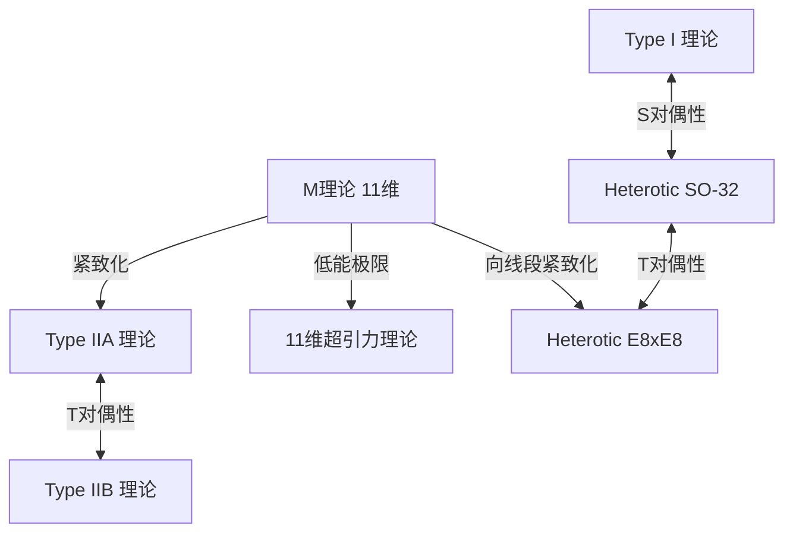

# 导论：挑战物理学的终极梦想“万有理论（TOE）”

现代物理学最具野心的目标之一，是构建一个统一描述自然界中存在的4种基本作用力——引力、电磁力、弱相互作用力、强相互作用力——的“万有理论（Theory of Everything: TOE）”。标准模型（Standard Model）以极高的精度成功描述了电磁力、弱相互作用力、强相互作用力这3种力以及与之相关的基本粒子。然而，唯独由爱因斯坦的广义相对论所描述的“引力”，一旦试图将其纳入量子力学的框架，就会产生无穷大的困难（不可重整化性），从而导致致命的崩溃。

作为解决这一深层矛盾的唯一有力候选者而备受瞩目的，便是“超弦理论（Superstring Theory）”。本文将从把物质的最小单位视为“1维的弦（弦）”而非“点”的范式转变开始，到额外维度的紧致化、卡拉比-丘流形的数学原理、M理论带来的终极统一，以及最新验证的挑战，彻底解说超弦理论的宏伟全貌。

---

## 第1章：点粒子的崩溃与弦的引入

### 量子场论中的无穷大困难与引力的不可重整化性

在将基本粒子作为没有体积的“点（Point）”来处理的传统量子场论（Quantum Field Theory: QFT）中，一直存在这样一个问题：当粒子之间发生相互作用时，在距离趋近于零的极限下，相互作用的能量会发散至无穷大。在电磁力、强相互作用力、弱相互作用力中，通过朝永振一郎、理查德·费曼、朱利安·施温格等人确立的“重整化理论（Renormalization）”这一数学手法，可以抵消这种无穷大，推导出有限且具有物理意义的预测。

然而，一旦试图引入传递引力的未知基本粒子“引力子（Graviton）”，对广义相对论进行量子化（构建量子引力理论），这种重整化手法就完全失效了。因为引力的耦合常数（牛顿常数）具有能量的维度，越是计算高阶环路的费曼图，就会不断产生新的发散，从而需要无穷多个参数来抵消一切。这被称为“引力的不可重整化性”。

### 南部阳一郎、后藤英彦等人的双共振模型与1维的弦

超弦理论的历史，是从与引力完全无关的地方开始的。1968年，加布里埃莱·韦内齐亚诺（Gabriele Veneziano）发现，发生强相互作用的强子的散射振幅（散射概率），令人惊叹地可以通过数学上的欧拉贝塔函数来完美描述（韦内齐亚诺振幅）。

发现这个数学公式背后物理意义的，是南部阳一郎、后藤英彦，以及霍尔格·尼尔森、伦纳德·萨斯坎德等人。1970年，他们指出：如果假设“强子不是点粒子，而是具有有限长度的1维橡皮筋般的振动体”，就能自然地推导出韦内齐亚诺振幅（双共振模型）。

为了描述这种“弦（弦）”的运动，最基本的物理作用量就是南部-后藤作用量（Nambu-Goto Action）。当弦在时空中运动时，不同于点描绘出线（世界线），1维的弦会描绘出2维的面（世界面：Worldsheet）。南部-后藤作用量被定义为与这个世界面的面积成正比的量。

$$ S = -T \int d\tau d\sigma \sqrt{- \det(\gamma_{ab})} $$

这里，$T$ 是弦的张力（Tension），$\gamma_{ab}$ 是世界面上的诱导度规。这个作用量在几何学上非常优美，但在进行量子化时，平方根的处理会伴随数学上的困难。

### 泊里雅科夫作用量（Polyakov Action）与共形不变性

于是，亚历山大·泊里雅科夫（Alexander Polyakov）引入了作为辅助场的独立世界面度规 $h_{ab}$，提出了一种与南部-后藤作用量等价、但不含平方根且易于处理的作用量，即“泊里雅科夫作用量”。

$$ S = -\frac{T}{2} \int d^2\sigma \sqrt{-h} h^{ab} \partial_a X^\mu \partial_b X^\nu \eta_{\mu\nu} $$

泊里雅科夫作用量除了具备重新参数化不变性（Diffeomorphism invariance）之外，还对局域尺度变换保持不变，即具有“外尔不变性（Weyl invariance）”，也就是共形对称性。作为2维共形场论（CFT）的这种性质，将构成弦理论强大的数学基础。

---

## 第2章：开弦与闭弦，超对称性

### 作为弦振动模式的基本粒子

弦理论最具革命性的理念，就是“宇宙中存在的无数基本粒子，不过是单根弦的不同振动模式（泛音）而已”这一概念。就像小提琴的琴弦因不同的弹奏方式而奏出不同的音色（频率）一样，极小的弦呈现不同的振动状态，在我们的眼中便化作了质量和自旋各异的基本粒子。

弦存在两种类型：有端点的“开弦（Open string）”，以及两端相连成环的“闭弦（Closed string）”。

### 开弦产生的规范粒子与闭弦产生的引力子

**开弦（Open String）：**
开弦的两端并不能在空间中自由移动，而是固定在后文所述的被称为D膜（D-brane）的膜上。通过解析开弦的基态（能量最低的振动模式），会出现质量为零、自旋为1的矢量粒子。这正是传递电磁力的光子（Photon）以及传递强相互作用力的胶子等“规范玻色子”本身。

**闭弦（Closed String）：**
另一方面，闭弦因为没有端点，不受膜的束缚，可以在时空中自由传播。对闭弦的振动模式进行量子化解析后，令人惊讶的是，必然会出现质量为零、“自旋为2”的张量粒子。在标准模型中并不存在，且拥有与广义相对论所预言的引力传递粒子“引力子（Graviton）”完全相同性质的粒子。

弦理论最初并不是为了包含引力而设计的。尽管它是作为强子理论出发的，但其数学公式自发地要求了引力子的存在。这一事实使得弦理论发生剧烈转变，从单纯的强相互作用力模型，一跃成为“量子引力理论”的最有力候选者（由约翰·施瓦茨和乔尔·舍克于1974年提出）。

### 玻色弦理论的崩溃（快子的出现）与维拉索罗代数

早期的弦理论，是仅仅描述玻色子（传递力的粒子）的“玻色弦理论”。为了在量子力学上正确处理弦的振动，必须保证共形不变性在量子化过程中不被破坏（没有反常）。

2维世界面上的共形对称性，由无限维的李代数“维拉索罗代数（Virasoro Algebra）”来描述。
$$ [L_m, L_n] = (m - n)L_{m+n} + \frac{c}{12}m(m^2 - 1)\delta_{m+n, 0} $$
这里，$c$ 被称为中心电荷（Central charge）。为了使玻色弦理论在没有数学矛盾（出现鬼态）的情况下成立，令人惊奇的是，时空的维度 $D$ 必须被证明为“26维（空间25维+时间1维）”。

此外，作为一个更致命的问题，玻色弦理论中能量最低的状态，变成了质量为虚数（质量的平方为负数）的“快子（Tachyon）”。快子存在的真空是不稳定的，这意味着该理论无法描述物理现实。

### 超对称性（Supersymmetry）的引入与超弦理论（10维）

为了解决快子的问题，以及弥补理论中未包含构成物质的费米子（如电子、夸克等）这一缺陷，人们引入了“超对称性（Supersymmetry: SUSY）”。超对称性，是一种将玻色子（自旋为整数的粒子）与费米子（自旋为半整数的粒子）相互交换的对称性。

在弦的世界面上引入了超对称性的“超弦理论（Superstring Theory）”中，通过进行被称为GSO投影（Gliozzi-Scherk-Olive projection）的数学操作，成功地将快子从谱系中完美排除，同时被证明实现了时空的超对称性。

在这个超弦理论中，抵消了共形反常并且在数学上无矛盾的时空维度数是“10维（空间9维+时间1维）”。虽然与我们居住的4维时空（空间3维+时间1维）大相径庭，但从26维急剧缩减到10维，这是向现实物理迈出重要一步的瞬间。

---

## 第3章：第一次超弦理论革命

从1970年代后期到1980年代前期，除了少数狂热的研究者之外，超弦理论几乎被物理学界半抛弃了。因为人们认为，将规范理论与引力结合时，不可避免地会产生被称为量子反常（Anomaly）的数学矛盾。

### 1984年：格林与施瓦茨奇迹般的反常相消

1984年夏天，迈克尔·格林（Michael Green）与约翰·施瓦茨（John Schwarz）完成了历史性的计算。他们证明了，在满足特定条件的10维超弦理论中，规范反常与引力反常在费曼图的六边形（Hexagon）图表层面上，奇迹般地完美相互抵消，完全变为零。

要发生这种奇迹般的抵消，人们发现该理论背后的规范群必须是特定的巨大对称群。那只有两个，即**$SO(32)$**（32维特殊正交群）与**$E_8 \times E_8$**（例外群E8的直积）。

这一发现给物理学界带来了极其强烈的冲击，掀起了被称为“第一次超弦理论革命”的爆炸性研究热潮。通往万有理论的道路，突然变得清晰可见。

### 5种无矛盾的超弦理论

在格林与施瓦茨的发现之后，研究急剧加速，最终阐明了在10维无矛盾的超弦理论可分类为以下“5种”。

1. **Type I 理论**：包含开弦与闭弦两者。超对称性为 $N=1$。规范群为 $SO(32)$。
2. **Type IIA 理论**：仅有闭弦。超对称性为 $N=2$，非手征性（保留宇称对称性）。
3. **Type IIB 理论**：仅有闭弦。超对称性为 $N=2$，手征性（破坏宇称。接近现实中弱相互作用的性质）。
4. **Heterotic (杂交) $SO(32)$ 理论**：仅有闭弦。将右旋振动（10维的超弦）与左旋振动（26维的玻色弦）混合起来的奇特但优美的理论。规范群为 $SO(32)$。
5. **Heterotic (杂交) $E_8 \times E_8$ 理论**：同样的混合结构。规范群为 $E_8 \times E_8$。因为能自然地内含现实中标准模型的对称性（$SU(3) \times SU(2) \times U(1)$），所以曾一度被认为最被看好。

这5种理论，各自都拥有数学上完美的一致性。如果从“万有理论应当只有一个”的哲学角度来看，存在多达5个候选者，成为了当时物理学家面临的巨大谜团。

---

## 第4章：额外维度的紧致化与卡拉比-丘流形

超弦理论所要求的“10维”时空，明显与我们日常感知到的“空间3维+时间1维（合计4维）”相矛盾。那么剩下的空间6维（额外维度：Extra Dimensions），究竟藏在哪里呢？

### 源自卡鲁扎-克莱因理论的谱系

额外维度的概念本身，比弦理论要古老得多，可以追溯到1920年代的西奥多·卡鲁扎（Theodor Kaluza）与奥斯卡·克莱因（Oskar Klein）。他们将广义相对论扩展至5维（空间4维+时间1维），通过将第4空间维度卷曲成极小的圆形尺寸（紧致化），成功地统一推导出了4维中的引力与电磁力。额外维度的几何学结构，在低能世界中作为“力（规范场）”显现出来。

### 里奇平坦的卡勒流形：卡拉比-丘空间

为了从10维的超弦理论中提取出現实的4维物理，需要将多余的6维卷曲至普朗克长度（$10^{-35}$米）左右的极小尺寸，即进行“紧致化（Compactification）”。并不是随随便便卷起来就可以的，必须满足在4维空间中至少保留1个$N=1$的超对称性（为了解决层次问题，并推导出费米子）这一严格的物理限制。

1985年，菲利普·坎德拉斯（Philip Candelas）、加里·霍罗威茨（Gary Horowitz）、安德鲁·斯特罗明格（Andrew Strominger）、爱德华·威滕（Edward Witten）4人证明了，这个多余的6维空间必须是满足特定数学条件的特殊复流形。

这个条件，就是“里奇平坦（Ricci-flat）的紧致卡勒流形（Kähler manifold）”。由于数学家欧金尼奥·卡拉比（Eugenio Calabi）预测了这种几何空间的存在，而丘成桐（Shing-Tung Yau）在数学上证明了这一点，因此它被称为“**卡拉比-丘流形（Calabi-Yau manifold）**”。

### 欧拉数与夸克的世代数

卡拉比-丘空间极其艰深复杂的“孔洞”及“拓扑学（位相几何学）”结构，完全决定了我们所居住的4维世界中基本粒子的性质。

例如，表征流形拓扑学不变量的“欧拉数（Euler characteristic）”绝对值的一半，被证明与现实世界中出现的“基本粒子的世代数”相一致。在标准模型中，夸克和轻子存在3个世代（上·下、粲·奇异、顶·底），因此寻找欧拉数为 $\pm 6$ 的卡拉比-丘空间，成为了弦理论现象学中的最重要课题。

### 镜像对称性（Mirror Symmetry）的惊异

卡拉比-丘流形的研究，也为纯粹数学领域带来了戏剧性的突破。物理学家们发现，拥有完全不同拓扑学的两个卡拉比-丘空间（镜像对），在弦理论中却描述了完全相同的物理现象。这就是“镜像对称性”。

在数学上计算极其困难的一方流形（例如计算有理曲线数目的枚举几何学问题），通过使用镜像对称性转化为另一方流形的积分问题，竟然变得轻而易举，这一现象接连发生，让数学家们感到震惊。弦理论在作为物理学理论的同时，也作为发现未知深奥数学的“终极探测器”发挥着作用。

---

## 第5章：第二次超弦理论革命与M理论

直到1990年代中期，5种超弦理论仍被认为是各自独立的理论。但是1995年，在南加州大学举办的弦国际会议上，爱德华·威滕（Edward Witten）进行的具有历史意义的演讲，使事态发生了戏剧性的变化。“第二次超弦理论革命”拉开了帷幕。

### 对偶性（Duality）这本魔法词典

威滕利用被称为“对偶性（Duality）”的概念，精彩地证明了乍看之下完全不同的5种超弦理论，实际上只不过是“单一终极理论”的不同侧面。主要的对偶性包含以下2种。

- **T对偶性（Target-space Duality）**：当空间的紧致化半径为 $R$ 时，半径 $R$ 的理论与半径 $1/R$ 的理论在物理上完全等价的惊人性质。由此证明了，Type IIA理论与Type IIB理论，以及2个Heterotic理论是分别联系在一起的。极微的宇宙与巨大的宇宙，从弦理论的视角来看是无法区分的。
- **S对偶性（Strong-weak Duality）**：当相互作用的耦合常数为 $g$ 时，耦合常数大（相互作用强）的理论，与耦合常数为 $1/g$ 的弱理论变得等价的关系。由此将Type I理论与Heterotic SO(32)理论联系了起来，使得原本无法计算的强耦合区域的物理，可以使用另一个理论的弱耦合区域来进行计算。

### D膜（D-brane）的发现

在威滕发表的同一时期，约瑟夫·波尔钦斯基（Joseph Polchinski）明确定义了“**D膜（D-brane）**”的概念，并证明了其在弦理论中的重要性。D膜是开弦的端点可以附着其上的类似“高维膜（Membrane）”的实体（D来源于狄利克雷边界条件）。

D膜解明了黑洞熵的微观起源（斯特罗明格与瓦法于1996年的成果）等，成为了弦理论中不可或缺的组成部分。认为我们的宇宙本身就是一个巨大D3膜（3维的空间性膜）的“膜宇宙学假说”也是由此派生出来的。

### 统合一切的11维“M理论”

通过对偶性网络将5种超弦理论统一起来的威滕，提出“**M理论（M-theory）**”作为统一这些理论的更高层次理论。

令人惊讶的是，M理论展开的时空是“11维（空间10维+时间1维）”。在Type IIA理论中将耦合常数取趋于无穷大的极限操作时，原本看不见的另一个空间维度（第11维）作为一个圆出现了，原本1维的“弦”，实际上是被证明是2维的“膜（Membrane）”卷曲而成的东西。

M理论中的“M”到底意味着什么（Membrane, Magic, Mystery, Matrix, Mother等），威滕本人有意使其保持模糊。即使是现在，M理论完全的数学公式化（基础方程）也仍未被找到，成为了现代物理学最大的未解难题之一。然而，通过全息原理（AdS/CFT对偶）等，其片段性的性质正在被逐渐解明。

*(注：以M理论为中心、由对偶性连接的5种超弦理论的统一图)*

---

## 第6章：弦景观与验证的挑战

超弦理论作为万有理论的最有力候选者君临已久，但既然是物理学，通过实验和观测进行验证便是不可或缺的。然而，这里竖立着一堵巨大的高墙。

### 10^500个真空：弦景观与人择原理

卡拉比-丘流形的拓扑学、D膜的配置、缠绕在流形上的通量（类似磁力线）的组合有无数种。根据2000年代初期的计算，弦理论允许存在的稳定·亚稳定真空（宇宙模式的候选者）的数量，令人震惊地被证明多达 **$10^{500}$** 种以上（如KKLT方案等）。

这被称为“**弦景观（String Landscape）**”。弦理论并不是唯一决定我们宇宙法则的理论，而是一个能产生拥有各种可能法则的无数宇宙（多元宇宙）的框架。

这一事实在物理学界引起了严重的争议。对于“为什么我们的宇宙拥有现在的法则（宇宙常数的极小值、基本粒子质量的绝妙平衡）”这个问题，物理学家们被迫引入“人择原理（Anthropic Principle）”，即“在存在无数宇宙之中，我们正在观测拥有适合我们这样的智慧生命存在的环境的宇宙，是必然的”。伦纳德·萨斯坎德等人强烈支持这一点，但也有许多物理学家以不可证伪性为由予以强烈反对。

### 沼泽地（Swampland）猜想

近年来，作为应对景观问题的一种新方法，由卡姆兰·瓦法（Cumrun Vafa）等人提出的“**沼泽地（Swampland：沼泽）**猜想”正迅速受到瞩目。

即便乍看之下是没有矛盾的有效场论（低能物理模型），但不能无矛盾地纳入量子引力理论（弦理论）的模型集合，就被称为沼泽地。瓦法等人接连提出了诸如“引力必须始终是最弱的力（弱引力猜想）”或“由暗能量引起的宇宙加速膨胀有着严格的限制（德西特猜想）”等强有力的标准（沼泽地条件）。

借此，人们期望能从据说多达$10^{500}$的庞大景观中，严格筛选出現实中可观测宇宙的条件。

### 对实验验证的无尽挑战

弦理论的直接证明需要普朗克能量尺度（需要巨大的粒子加速器，甚至是银河系规模的设施），这在事实上几乎是不可能的。但是，目前人们仍在认真探索间接的验证方法。

1. **原初引力波的观测：**
   通过观测在宇宙暴胀期产生的“原初引力波”在宇宙微波背景辐射（CMB）偏振（B模式）中刻下的痕迹的计划（如LiteBIRD卫星等）。由此，有可能验证弦理论特有的暴胀模型。
2. **超高能宇宙射线与极微黑洞：**
   在CERN的大型强子对撞机（LHC）等设施中，人们期待能观测到暗示额外维度存在的“微型黑洞”的生成，以及因引力子逃逸到额外维度而导致的能量缺失（Missing Energy）。目前尚未发现明确的证据，且对额外维度的尺寸设定了严格的上限。
3. **宇宙弦（Cosmic String）：**
   在早期宇宙相变中形成的巨大宏观尺度上的弦（宇宙弦），有可能作为引力透镜效应或引力波的爆发而被观测到。

## 结论：通往终极真理的无尽旅程

超弦理论，毫无疑问是人类所能达到的最宏大、最具有数学之美的智慧结晶。从点粒子到弦，再从额外维度到膜（M理论）的概念飞跃，甚至向我们提出了空间与时间本身并非根本，而是从更深维度的几何学中创生出的“幻影”的可能性。

由于缺乏直接的实验证据，确实存在着“弦理论不是物理学而是数学，或者只不过是哲学”这样严厉的批评。然而，无论是解决黑洞信息悖论的线索，还是通过AdS/CFT对偶为强耦合的凝聚态物理（如超导等）提供全新的计算方法，弦理论已经作为一种不可或缺的语言，深深扎根于理论物理学的广泛领域。

我们尚未掌握M理论的真正方程。潜藏在卡拉比-丘空间黑暗处的6个额外维度到底呈什么形状，我们居住的宇宙位于$10^{500}$景观的哪个位置，以解明全貌的那一天为目标，物理学家们的无尽挑战在今天依然继续。

---

## 附录：支撑超弦理论的高深数学背景

虽然本篇优先考虑直观理解进行了概述，但在这一部分，将针对构成超弦理论坚实基础的数学公式与几何学结构，进行更深层次的详细阐述。

### A. 泊里雅科夫作用量与2维共形场论（CFT）的完整公式化

描述弦在时空中行进轨迹，即世界面（Worldsheet）上动力学的泊里雅科夫作用量，给出如下。

$$ S_P = -\frac{T}{2} \int d^2\sigma \sqrt{-h} h^{\alpha\beta} \partial_\alpha X^\mu \partial_\beta X^\nu \eta_{\mu\nu} $$

在这里，$X^\mu(\tau, \sigma)$ 是从世界面坐标 $(\tau, \sigma)$ 到靶时空的映射（即时空上弦的坐标）。这个作用量最重要的性质，是拥有以下3种局域对称性。
1. **2维微分同胚不变性（Diffeomorphism invariance）：** 对于世界面上的坐标变换 $\sigma^\alpha \to \sigma^{\prime\alpha}(\sigma)$ 保持不变。
2. **2维庞加莱不变性：** 对于靶时空的平移及洛伦兹变换的保持不变性。
3. **外尔不变性（Weyl invariance）：** 对于度规张量的局域尺度变换 $h_{\alpha\beta}(\sigma) \to e^{2\omega(\sigma)}h_{\alpha\beta}(\sigma)$ 保持不变性。

在经典层面上保持了外尔不变性，但在利用路径积分进行量子化时，会从测度变换的雅可比行列式中产生“共形反常（Conformal Anomaly）”。计算抵消该反常并在量子层面保持外尔不变性的条件时，来自鬼场（法捷耶夫-波波夫鬼场）的贡献必须与来自物质场（$X^\mu$）的贡献相抵消。这正是要求玻色弦为 $D=26$、超弦为 $D=10$ 的数学原动力。

### B. 卡拉比-丘流形与里奇平坦性的数学

作为从10维超弦理论推导4维有效理论的紧致化条件，必须在额外6维空间 $K$ 上保留超对称性（旋量场协变不变为常数）。即，必须满足微分方程 $\nabla_m \eta = 0$（$\eta$ 为内秉旋量）。

为了满足这一条件，空间 $K$ 的和乐群（Holonomy group）必须包含在 $SU(3)$ 中，这在几何学上等价于以下条件。
1. $K$ 是卡勒流形（Kähler manifold）。即，拥有闭合的非退化二次形式（卡勒形式 $J$）。
2. $K$ 的第一陈类（First Chern class） $c_1(K)$ 为零。

根据丘定理（卡拉比猜想的证明），在满足 $c_1(K)=0$ 的紧致卡勒流形上，必定唯一存在里奇张量 $R_{mn}$ 为零的“里奇平坦卡勒度规”。这就是卡拉比-丘流形。

卡拉比-丘流形的几何学，由其上同调群 $H^{p,q}(K)$ 的维数（霍奇数 $h^{p,q}$）来表征。特别地，$h^{2,1}$ 和 $h^{1,1}$ 这两个霍奇数极其重要。
- $h^{1,1}$ 对应于卡勒结构（流形的“大小”与“形状”参数）形变的自由度（模）数。
- $h^{2,1}$ 对应于复结构形变的自由度数。

在物理学上，欧拉数 $\chi = 2(h^{1,1} - h^{2,1})$ 的值，直接联系着4维世界中手征费米子（夸克与轻子）世代数的差异。例如，为了推导出标准模型中的“3代”，需要找到使 $\chi = \pm 6$ 的卡拉比-丘流形，利用 $Z_3$ 轨形（Orbifold）等方法已经构造出了这样的空间。

### C. AdS/CFT对偶：全息原理的终极体现

从M理论与D膜的研究中派生出的最大副产品，是1997年胡安·马尔达西那（Juan Maldacena）提出的“AdS/CFT对偶（Anti-de Sitter/Conformal Field Theory correspondence）”。

这是一个惊人的猜想，认为“5维反德西特空间（AdS空间）中的引力理论（超弦理论）”，与“在其4维边界上定义的共形场论（CFT：不含引力的规范理论）”是完全等价的。

$$ Z_{\text{AdS}}[J] = \langle e^{\int \mathcal{O} J} \rangle_{\text{CFT}} $$

这种等价性，成为了不同维度的两个理论描述同一物理学这一“全息原理”数学上严格的实现范例。由于可以将强耦合的规范理论（无法计算）翻译成弱耦合的经典引力（可以用广义相对论计算）来求解，目前不仅在粒子物理学，从凝聚态物理（高温超导、夸克-胶子等离子体的粘性计算等）到量子信息理论，都产生了极其广泛的应用。这是超弦理论从单纯的“假说”，进化为整个物理学“有用工具”的标志性范式转变。
