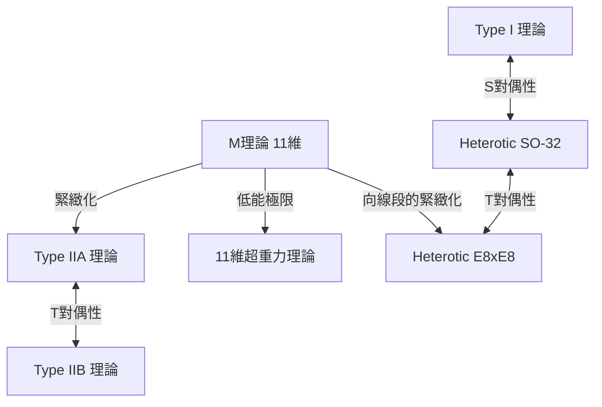

# 導論：挑戰物理學的終極夢想「萬物理論（TOE）」

現代物理學最具野心的目標之一，是建構一個能統一描述自然界四種基本作用力——重力、電磁力、弱作用力與強作用力的「萬物理論（Theory of Everything: TOE）」。標準模型（Standard Model）已成功且極具精確度地描述了電磁力、弱作用力與強作用力這三種力，以及與它們相關的基本粒子。然而，由愛因斯坦廣義相對論所描述的「重力」，一旦試圖納入量子力學的框架中，便會產生無限大的困難（不可重整化性），導致致命的破綻。

要解決這個根深蒂固的矛盾，「超弦理論（Superstring Theory）」被視為唯一有力的候選者而備受矚目。本篇文章將從把物質最小單位由「點」視為「一維的弦」的典範轉移開始，徹底解說超弦理論宏大的全貌，涵蓋額外維度的緊緻化、卡拉比-丘流形的數學理論、M理論的終極統一，以及最新驗證的挑戰。

---

## 第1章：點粒子的破綻與弦的引入

### 量子場論中無限大的困難與重力的不可重整化性

在將基本粒子視為不具體積之「點」的傳統量子場論（Quantum Field Theory: QFT）中，當粒子之間發生交互作用時，隨著距離趨近於零，交互作用的能量會發散至無限大，這個問題一直如影隨形。在電磁力、強作用力與弱作用力方面，藉由朝永振一郎、理查·費曼、朱利安·施溫格等人所建立的「重整化理論（Renormalization）」這一數學手法，抵消了這個無限大，從而能導出有限且具物理意義的預測。

但是，當引入媒介重力的未知基本粒子「重力子（Graviton）」，試圖將廣義相對論量子化（建構量子重力理論）時，這個重整化手法便完全失效。由於重力的耦合常數（牛頓常數）具有能量的維度，因此當計算越高階迴圈的費曼圖時，就會產生無窮無盡的發散，導致需要無限多個參數來抵消一切。這被稱為「重力的非重整化性」。

### 南部陽一郎、後藤英彥等人的對偶共振模型與一維的弦

超弦理論的歷史，是從與重力完全無關的地方開始的。1968年，加布里埃萊·威尼齊亞諾（Gabriele Veneziano）發現，發生強交互作用的強子散射振幅（散射機率），竟然可以極度完美地用數學中的尤拉貝塔函數來描述（威尼齊亞諾振幅）。

找出這個數學公式背後物理意義的，是南部陽一郎、後藤英彥，以及霍爾格·尼爾森、李奧納特·蘇士侃等人。1970年，他們指出，只要假設「強子並非點粒子，而是具有有限長度、像一維橡皮筋般的振動體」，便能自然導出威尼齊亞諾振幅（對偶共振模型）。

用來描述這個「弦」之運動的最基本作用量，即為南部-後藤作用量（Nambu-Goto Action）。當弦在時空中運動時，點會描繪出線（世界線），而一維的弦則會描繪出二維的面（世界面：Worldsheet）。南部-後藤作用量被定義為與此世界面面積成正比的量。

$$ S = -T \int d\tau d\sigma \sqrt{- \det(\gamma_{ab})} $$

這裡，$T$ 是弦的張力（Tension），$\gamma_{ab}$ 是世界面上的誘導度規。這個作用量在幾何學上非常優美，但在進行量子化時，處理平方根會伴隨著數學上的困難。

### 泊里雅科夫作用量（Polyakov Action）與共形不變性

因此，亞歷山大·泊里雅科夫（Alexander Polyakov）引入了作為輔助場的獨立世界面度規 $h_{ab}$，提出了一個與南部-後藤作用量等價，卻不包含平方根而更易於處理的作用量，即「泊里雅科夫作用量」。

$$ S = -\frac{T}{2} \int d^2\sigma \sqrt{-h} h^{ab} \partial_a X^\mu \partial_b X^\nu \eta_{\mu\nu} $$

泊里雅科夫作用量除了具備重參數化不變性（Diffeomorphism invariance）之外，還具有對於局部尺度變換保持不變的「外爾不變性（Weyl invariance）」，也就是共形對稱性。這種作為二維共形場論（CFT）的性質，將形成弦理論強大的數學基礎。

---

## 第2章：開弦與閉弦、超對稱性

### 作為弦振動模式的基本粒子

弦理論最具革命性的概念是：「宇宙中存在的無數基本粒子，都不過是單一弦的不同振動模式（泛音）而已」。就像小提琴的弦會因為不同的彈奏方式而奏出不同的音色（頻率）一樣，極小的弦藉由採取不同的振動狀態，便會以具有不同質量或自旋的基本粒子之姿呈現在我們眼前。

弦分為兩種：存在端點的「開弦（Open string）」與端點相連成環狀的「閉弦（Closed string）」。

### 開弦產生的規範粒子與閉弦產生的重力子

**開弦（Open String）：**
開弦的兩端並不能在空間中自由移動，而是被固定在後文會提到的D膜（D-brane）上。分析開弦的基態（能量最低的振動模式）時，會出現質量為零、自旋為1的向量粒子。這正是媒介電磁力的光子（Photon），以及媒介強作用力的膠子（Gluon）等「規範玻色子」本身。

**閉弦（Closed String）：**
另一方面，由於閉弦沒有端點，因此不受膜的束縛，可以在時空中自由傳播。當量子化並分析閉弦的振動模式時，令人驚訝的是，必然會出現質量為零、自旋為「2」的張量粒子。標準模型中並不存在這種粒子，而它卻擁有與廣義相對論所預言之重力媒介粒子「重力子（Graviton）」完全相同的性質。

弦理論並非從一開始就被設計為要包含重力。儘管它是作為強子理論起步，但其數學方程式卻自發地要求了重力子的存在。這個事實使得弦理論經歷了戲劇性的轉變，從單純的強作用力模型，一躍成為「量子重力理論」的最有力候選者（約翰·施瓦茨與喬爾·舍克於1974年提出）。

### 玻色弦理論的破綻（快子的出現）與維拉宿代數

早期的弦理論是只描述玻色子（媒介力的粒子）的「玻色弦理論」。為了以量子力學的方式正確處理弦的振動，必須保證共形不變性在量子化過程中不會遭到破壞（無反常現象）。

二維世界面上的共形對稱性，由被稱為「維拉宿代數（Virasoro Algebra）」的無限維李代數來描述。
$$ [L_m, L_n] = (m - n)L_{m+n} + \frac{c}{12}m(m^2 - 1)\delta_{m+n, 0} $$
這裡，$c$ 被稱為中心電荷（Central charge）。已經證明，為了讓玻色弦理論能在沒有數學矛盾（出現鬼態）的情況下成立，時空的維度 $D$ 必須驚人地是「26維（空間25維＋時間1維）」。

此外，一個更致命的問題是，玻色弦理論最低的能量狀態會成為質量是虛數（質量的平方為負數）的「快子（Tachyon）」。存在快子的真空是不穩定的，這意味著該理論無法描述物理現實。

### 引入超對稱性（Supersymmetry）與超弦理論（10維）

為了解決快子問題，以及理論中未包含構成物質的費米子（如電子與夸克等）的缺陷，所引入的概念就是「超對稱性（Supersymmetry: SUSY）」。超對稱性是一種將玻色子（自旋為整數的粒子）與費米子（自旋為半整數的粒子）互換的對稱性。

在弦的世界面上引入超對稱性的「超弦理論（Superstring Theory）」中，透過進行稱為 GSO投影（Gliozzi-Scherk-Olive projection）的數學操作，成功地從光譜中排除了快子，同時展現出時空超對稱性的實現。

在這個超弦理論中，共形反常現象被抵消，且在數學上自洽的時空維度數為「10維（空間9維＋時間1維）」。這雖然與我們居住的4維時空（空間3維＋時間1維）大相逕庭，但維度從26維大幅縮減至10維，是向現實物理邁進了一步的瞬間。

---

## 第3章：第一次超弦理論革命

從1970年代末期到1980年代初期，除了少數熱心的研究者之外，超弦理論幾乎被物理學界所放棄。因為當時認為，當把規範理論與重力結合時，必然會產生稱為量子反常（Anomaly）的數學矛盾。

### 1984年：格林與施瓦茨奇蹟般的反常抵消

1984年夏天，麥可·格林（Michael Green）與約翰·施瓦茨（John Schwarz）完成了歷史性的計算。他們證明，在滿足特定條件的10維超弦理論中，規範反常與重力反常會在費曼圖的六邊形（Hexagon）圖層級完美地互相抵消，完全歸零。

要發生這種奇蹟般的抵消，理論背後的規範群必須是特定的巨大對稱群。結果發現，只有 **$SO(32)$**（32維的特殊正交群）與 **$E_8 \times E_8$**（例外群E8的直積）這兩種。

這項發現給物理學界帶來了極大的震撼，並引發了被稱為「第一次超弦理論革命」的爆發性研究熱潮。通往萬物理論的道路，突然間被清晰地敞開了。

### 5種自洽的超弦理論

自格林與施瓦茨的發現之後，研究急遽加速，最終明確得知，在10維空間中自洽的超弦理論可分類為以下的「5種」。

1. **Type I 理論**：同時包含開弦與閉弦。超對稱性為 $N=1$。規範群為 $SO(32)$。
2. **Type IIA 理論**：僅有閉弦。超對稱性為 $N=2$，且為非手徵性（保存宇稱對稱性）。
3. **Type IIB 理論**：僅有閉弦。超對稱性為 $N=2$，且為手徵性（破壞宇稱，接近現實弱交互作用的性質）。
4. **Heterotic (雜交) $SO(32)$ 理論**：僅有閉弦。將右旋振動（10維超弦）與左旋振動（26維玻色弦）混合的奇特而優美的理論。規範群為 $SO(32)$。
5. **Heterotic (雜交) $E_8 \times E_8$ 理論**：同樣的混合結構。規範群為 $E_8 \times E_8$。由於能自然內含現實標準模型的對稱性（$SU(3) \times SU(2) \times U(1)$），曾有一段時間被認為是最有希望的。

這5種理論都各自具有數學上完美的自洽性。但從「萬物理論應該只有一個」的哲學來看，竟然存在5種候選理論，這對當時的物理學家來說成了一個巨大的謎團。

---

## 第4章：額外維度的緊緻化與卡拉比-丘流形

超弦理論所要求的「10維」時空，明顯與我們日常所感知的「空間3維＋時間1維（合計4維）」相矛盾。剩下的空間6維（額外維度：Extra Dimensions）到底藏在哪裡呢？

### 源自卡魯扎-克萊因理論的系譜

額外維度的概念本身，比弦理論古老得多，可以追溯到1920年代的特奧多爾·卡魯扎（Theodor Kaluza）與奧斯卡·克萊因（Oskar Klein）。他們將廣義相對論擴展到5維（空間4維＋時間1維），並將第4個空間維度捲曲成極小的圓（緊緻化），成功地統一導出了4維空間中的重力與電磁力。額外維度的幾何結構，在低能量世界中會以「力（規範場）」的形式出現。

### 里奇平坦的凱勒流形：卡拉比-丘空間

為能從10維的超弦理論中導出現實的4維物理，必須將額外的6個維度捲曲至大約普朗克長度（$10^{-35}$公尺）大小的極小尺寸，這稱為「緊緻化（Compactification）」。然而，並非隨便捲曲即可，必須滿足在4維空間中至少保留一個 $N=1$ 超對稱性（為了解決階層問題並導出費米子）的嚴格物理限制。

1985年，菲利普·坎德拉斯（Philip Candelas）、蓋瑞·霍羅威茨（Gary Horowitz）、安德魯·斯特羅明格（Andrew Strominger）與愛德華·威滕（Edward Witten）等四人證明，這個額外的6維空間必須是滿足特定數學條件的特殊複流形。

那個條件就是「里奇平坦（Ricci-flat）的緊緻凱勒流形（Kähler manifold）」。由於數學家歐金尼奧·卡拉比（Eugenio Calabi）預測了它的存在，並由丘成桐（Shing-Tung Yau）在數學上證明，因此這個幾何空間被稱為「**卡拉比-丘流形（Calabi-Yau manifold）**」。

### 尤拉數與夸克的世代數

卡拉比-丘空間極度艱澀且複雜的「孔洞」與「拓樸學（相位幾何學）」結構，完全決定了我們所居住的4維世界中基本粒子的性質。

例如，作為表徵流形拓樸結構的不變數「尤拉數（Euler characteristic）」，其絕對值的一半已被證明會等於現實世界中出現的「基本粒子世代數」。由於在標準模型中，夸克與輕子存在3個世代（上・下，魅・奇，頂・底），因此尋找尤拉數為 $\pm 6$ 的卡拉比-丘空間，成為弦理論現象學中最重要的課題。

### 鏡像對稱性（Mirror Symmetry）的驚異

對卡拉比-丘流形的研究，也為純數學領域帶來了戲劇性的突破。物理學家發現，具有完全不同拓樸結構的兩個卡拉比-丘空間（鏡像對），在弦理論中竟然描述著完全相同的物理現象。這就是「鏡像對稱性」。

原本在數學上計算極度困難的流形問題（例如計算有理曲線數量的計數幾何學問題），藉由鏡像對稱性將其轉換為另一個流形的積分問題後，竟然輕而易舉地解開了，這種現象接二連三地發生，讓數學家們驚愕不已。弦理論既是物理學的理論，同時也作為發現未知深奧數學的「終極探測器」而發揮著作用。

---

## 第5章：第二次超弦理論革命與M理論

直到1990年代中期，5種超弦理論都被認為是各自獨立、互不相干的理論。然而在1995年，於南加州大學舉行的國際弦理論會議上，愛德華·威滕（Edward Witten）發表了歷史性的演講，讓事態產生了戲劇性的變化。這就是「第二次超弦理論革命」的序幕。

### 對偶性（Duality）這本魔法辭典

威滕運用被稱為「對偶性（Duality）」的概念，鮮明地證明了看似完全不同的5種超弦理論，其實都只是「單一終極理論」的不同面向而已。主要的對偶性包含以下兩種：

- **T對偶性（Target-space Duality）**：當空間緊緻化的半徑為 $R$ 時，半徑為 $R$ 的理論與半徑為 $1/R$ 的理論在物理上會變得完全等價，這是一種令人驚訝的性質。藉此證明了 Type IIA 理論與 Type IIB 理論，以及兩種 Heterotic 理論之間分別有著關聯。從弦理論的觀點來看，極微小的宇宙與巨大的宇宙是無法區分的。
- **S對偶性（Strong-weak Duality）**：當交互作用的耦合常數為 $g$ 時，耦合常數大（交互作用強）的理論與耦合常數為 $1/g$ 之弱理論會變得等價的關係。藉此將 Type I 理論與 Heterotic SO(32) 理論聯繫起來，使得利用另一個理論的弱耦合區域來計算無法計算的強耦合區域之物理現象成為可能。

### D膜（D-brane）的發現

與威滕發表研究的同時期，約瑟夫·波爾欽斯基（Joseph Polchinski）明確定義了「**D膜（D-brane）**」的概念，並證明了它在弦理論中的重要性。D膜是開弦的端點可以附著於其上的「高維膜（Membrane）」狀實體（D源自狄利克雷邊界條件）。

D膜解開了黑洞熵的微觀起源（斯特羅明格與瓦法於1996年的成果），成為了弦理論中不可或缺的組成要素。甚至提出了我們宇宙本身就是一個巨大D3膜（3維空間膜）的「膜宇宙學假說」，這也是由此衍生的。

### 統合一切的11維「M理論」

透過對偶性的網路將5種超弦理論統合起來的威滕，提出了一個更高層次的理論——「**M理論（M-theory）**」來統一這些理論。

令人驚訝的是，M理論展開的時空是「11維（空間10維＋時間1維）」。當在 Type IIA 理論中對耦合常數取無限大的極限操作時，一個原先看不見的空間維度（第11維度）會以圓的形式出現，這才讓人發現，1維的「弦」其實是2維的「膜（Membrane）」捲曲而成的。

M理論的「M」究竟代表什麼（Membrane、Magic、Mystery、Matrix、Mother等），被威滕本人刻意地模糊處理。直到現在，M理論的完整數學表述（基礎方程式）仍未被找到，這仍是現代物理學中最大的未解問題之一。不過，透過全像原理（AdS/CFT對偶）等，其片段的性質正逐漸被解明。

*(註：以M理論為中心，透過對偶性連結的5種超弦理論之統一圖)*

---

## 第6章：弦景與驗證的挑戰

雖然超弦理論作為萬物理論的最有力候選者已久，但既然是物理學，就必須有來自實驗或觀測的驗證。然而，這裡卻橫亙著一道巨大的障礙。

### $10^{500}$個真空：弦景與人擇原理

卡拉比-丘流形的拓樸結構、D膜的配置，以及纏繞流形的通量（類似磁力線）的組合有無數種。根據2000年代初期的計算，弦理論所容許的穩定、亞穩定真空（宇宙模式的候選者）數量，竟然多達驚人的 **$10^{500}$** 種以上（如KKLT機制等）。

這被稱為「**弦景（String Landscape）**」。弦理論並不是一個能唯一決定我們宇宙法則的理論，而是一個能產生無數具有各種可能法則的宇宙（多重宇宙）的框架。

這個事實引發了物理學界嚴重的爭論。對於「為什麼我們的宇宙具有現在的法則（宇宙常數的微小數值，以及基本粒子質量的絕妙平衡）」這個問題，物理學家被迫引入了「人擇原理（Anthropic Principle）」，即「在存在著無數個宇宙之中，我們必然會觀測到一個具備能讓像我們這樣的智慧生命存在的環境的宇宙」。李奧納特·蘇士侃等人強烈支持此觀點，但也有許多物理學家以其不具可證偽性為由強烈反對。

### 沼澤地（Swampland）猜想

近年來，作為應對弦景的新方法，由卡姆朗·瓦法（Cumrun Vafa）等人所提出的「**沼澤地（Swampland）猜想**」迅速引起了關注。

即使是乍看之下沒有矛盾的有效場論（低能量的物理模型），但如果無法在沒有矛盾的情況下將其納入量子重力理論（弦理論），這些模型的集合就被稱為沼澤地。瓦法等人接連提出了強力的標準（沼澤地條件），例如「重力必須始終是最弱的力（弱重力猜想）」或「暗能量造成的宇宙加速膨脹受到嚴格限制（德西特猜想）」。

藉由這樣的方法，有望能從據稱高達 $10^{500}$ 個的龐大弦景中，嚴格篩選出現實可觀測宇宙的條件。

### 邁向實驗驗證的無盡挑戰

要直接證明弦理論，需要普朗克能量尺度（這需要一個銀河系大小的巨大粒子加速器），因此幾乎是不可能的。然而，人們至今仍在認真尋求間接的驗證方法。

1. **原始重力波的觀測：**
   計畫（如LiteBIRD衛星等）觀測宇宙暴脹時期產生的「原始重力波」在宇宙微波背景輻射（CMB）極化（B模）上留下的痕跡。藉此，有可能驗證弦理論特有的暴脹模型。
2. **超高能宇宙射線與極微小黑洞：**
   原本期望在歐洲核子研究組織（CERN）的大型強子對撞機（LHC）等實驗中，能產生暗示額外維度存在的「微型黑洞」，或者觀測到重力子逃逸到額外維度造成的能量缺失（Missing Energy）。目前為止尚未發現明確的證據，因此對額外維度的大小設定了嚴格的上限。
3. **宇宙弦（Cosmic String）：**
   在早期宇宙相變中形成的巨大巨觀尺度的弦（宇宙弦），有可能作為重力透鏡效應或重力波爆發被觀測到。

## 結論：邁向終極真理的無盡之旅

超弦理論毫無疑問是人類所達到最宏偉、且在數學上最優美的智慧結晶。從點粒子到弦，再從額外維度到膜（M理論）的概念飛躍，甚至向我們提出了這樣一種可能性：空間和時間本身並非根本，而是從更深層維度的幾何學中湧現出來的「幻影」。

因為缺乏直接的實驗證據，確實存在著「弦理論不是物理學，而只是數學或哲學」這樣嚴厲的批評。但是，無論是作為解決黑洞資訊悖論的線索，還是透過 AdS/CFT 對偶為強耦合的凝聚態物理學（如超導等）提供全新的計算方法，弦理論已經作為不可或缺的語言深深扎根於廣泛的理論物理學領域。

我們還沒有掌握M理論真正的方程式。隱藏在卡拉比-丘空間黑暗中的6個額外維度究竟是什麼形狀，我們居住的宇宙在 $10^{500}$ 的弦景中處於什麼位置，為了迎來這些全貌被解開的那一天，物理學家們無盡的挑戰在今天依然持續著。

---

## 附錄：支撐超弦理論的高深數學背景

在正文中我們優先以直觀的方式進行了概述，但在這裡，我們將針對構成超弦理論堅實基礎的數學公式與幾何學結構，進行更深層次的詳細說明。

### A. 泊里雅科夫作用量與二維共形場論（CFT）的完整定式化

描述弦在時空中前進軌跡之世界面（Worldsheet）上動力學的泊里雅科夫作用量，由下式給出：

$$ S_P = -\frac{T}{2} \int d^2\sigma \sqrt{-h} h^{\alpha\beta} \partial_\alpha X^\mu \partial_\beta X^\nu \eta_{\mu\nu} $$

這裡，$X^\mu(\tau, \sigma)$ 是從世界面座標 $(\tau, \sigma)$ 到目標時空的映射（即時空上弦的座標）。這個作用量最重要的性質，是擁有以下三個局部對稱性：
1. **二維的微分同胚不變性（Diffeomorphism invariance）：** 對於世界面上的座標變換 $\sigma^\alpha \to \sigma^{\prime\alpha}(\sigma)$ 保持不變。
2. **二維的龐加萊不變性：** 對目標時空平移及勞侖茲變換的保持不變性。
3. **外爾不變性（Weyl invariance）：** 對度規張量的局部尺度變換 $h_{\alpha\beta}(\sigma) \to e^{2\omega(\sigma)}h_{\alpha\beta}(\sigma)$ 的保持不變性。

雖然在古典上外爾不變性是被保留的，但在使用路徑積分進行量子化時，會從測度變換的雅可比行列式中產生「共形反常（Conformal Anomaly）」。若計算抵消此反常，以在量子層級也保持外爾不變性的條件，來自鬼場（法捷耶夫-波波夫鬼場）的貢獻與來自物質場（$X^\mu$）的貢獻必須互相抵消。這正是要求玻色弦中 $D=26$、超弦中 $D=10$ 的數學原動力。

### B. 卡拉比-丘流形與里奇平坦性的數學原理

作為從10維超弦理論導出4維有效理論的緊緻化條件，必須在額外的6維空間 $K$ 上保留超對稱性（旋量場協變常數）。也就是說，必須滿足微分方程式 $\nabla_m \eta = 0$（$\eta$ 為內在旋量）。

為了滿足這個條件，空間 $K$ 的和樂群（Holonomy group）必須包含於 $SU(3)$ 之中，這在幾何學上等價於以下條件：
1. $K$ 是凱勒流形（Kähler manifold）。也就是說，具有封閉且非退化的二次形式（凱勒形式 $J$）。
2. $K$ 的第一陳類 $c_1(K)$ 為零。

根據丘成桐定理（卡拉比猜想的證明），滿足 $c_1(K)=0$ 的緊緻凱勒流形上，必定唯一存在一個里奇張量 $R_{mn}$ 為零的「里奇平坦凱勒度規」。這就是卡拉比-丘流形。

卡拉比-丘流形的幾何學，由其上同調群 $H^{p,q}(K)$ 的維度（霍奇數 $h^{p,q}$）所決定。特別是，$h^{2,1}$ 與 $h^{1,1}$ 這兩個霍奇數極為重要。
- $h^{1,1}$ 對應於凱勒結構（流形的「大小」或「形狀」之參數）變形程度（模）的數量。
- $h^{2,1}$ 對應於複結構變形程度的數量。

在物理上，尤拉數 $\chi = 2(h^{1,1} - h^{2,1})$ 的值，直接關係到4維世界中手徵費米子（夸克與輕子）的世代數差。例如，為了導出標準模型的「3世代」，必須找到能讓 $\chi = \pm 6$ 的卡拉比-丘流形，而這類空間已利用 $Z_3$ 軌形（Orbifold）等方法被建構出來。

### C. AdS/CFT對偶：全像原理的終極具體化

從M理論和D膜的研究中所衍生出最大的副產物，是1997年由胡安·馬爾達西那（Juan Maldacena）所提出的「AdS/CFT對偶（Anti-de Sitter/Conformal Field Theory correspondence）」。

這是一個驚人的猜想，指出「5維反德西特空間（AdS空間）中的重力理論（超弦理論）」與「定義在其4維邊界上的共形場論（CFT：不含重力的規範理論）」是完全等價的。

$$ Z_{\text{AdS}}[J] = \langle e^{\int \mathcal{O} J} \rangle_{\text{CFT}} $$

這種等價性，是「全像原理」在數學上嚴格實現的例子，該原理認為兩個不同維度的理論描述的是同一個物理。由於它可以將強耦合的規範理論（無法計算）翻譯成弱耦合的古典重力（可以用廣義相對論計算）來求解，目前不只在粒子物理學中，從凝聚態物理學（高溫超導或夸克-膠子電漿的黏滯係數計算等）到量子資訊理論，都產生了極其廣泛的應用。這是超弦理論從單純的「假說」進化為整個物理學的「實用工具」之象徵性典範轉移。
