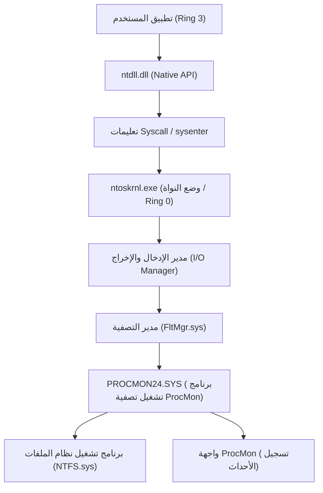
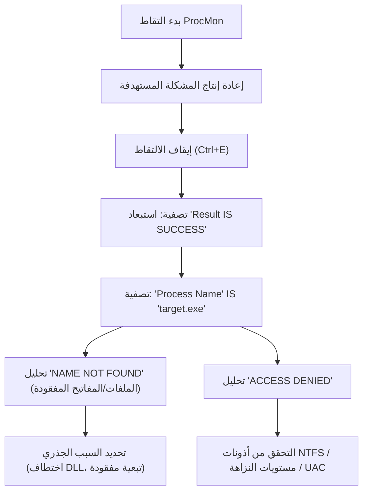
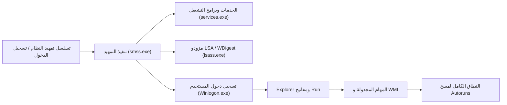

في بيئة Windows، عند مواجهة مشاكل مثل تعطل النظام، انخفاض الأداء، الإصابة بالبرامج الضارة، أو السلوك غير المفهوم للتطبيقات، غالباً ما تكون الأدوات المدمجة مثل مدير المهام (Task Manager) وعارض الأحداث (Event Viewer) غير كافية لتحديد السبب الجذري (Root Cause). في مثل هذا المستوى المتقدم من استكشاف الأخطاء وإصلاحها، يعتمد متخصصو تكنولوجيا المعلومات ومستجيبو الحوادث ومديرو الأنظمة حول العالم على مجموعة أدوات "**Windows Sysinternals**".

في هذه المقالة، سنشرح بشكل شامل تقنيات استكشاف الأخطاء وإصلاحها المتقدمة التي تتعمق في نظام التشغيل Windows (الحدود بين وضع النواة (Kernel Mode) ووضع المستخدم (User Mode)، معالجة المقاطعات (Interrupts)، ETW، برامج تشغيل التسجيل/نظام الملفات) باستخدام الأدوات الرئيسية لـ Sysinternals وهي **Process Explorer** و **Process Monitor (ProcMon)** و **Autoruns** و **TCPView**.

---

## 1. بنية أدوات Sysinternals وأساسيات نواة Windows

لفهم سبب قوة أدوات Sysinternals، من الضروري استيعاب المفاهيم الأساسية لبنية Windows. يعمل Windows بشكل أساسي في مستويين من الصلاحيات: "وضع المستخدم (Ring 3)" و "وضع النواة (Ring 0)".

أدوات مثل Process Monitor و Process Explorer لا تكتفي باستدعاء واجهات برمجة التطبيقات (API) الخاصة بوضع المستخدم فحسب، بل تقوم أيضاً بتحميل برامج تشغيل خاصة بوضع النواة ديناميكياً (مثل `PROCMON24.SYS`) لتتبع أو اعتراض (Hook) الأحداث التي تحدث في أعماق نظام التشغيل مباشرةً.

يوضح المخطط المعماري أدناه كيف يقوم Process Monitor بالتقاط نشاط نظام الملفات.

يتم تسجيل برنامج تشغيل ProcMon كبرنامج تشغيل تصفية مصغر (Minifilter Driver)، ويراقب جميع حزم طلبات الإدخال/الإخراج (IRP) التي تمر بين مدير الإدخال/الإخراج وبرنامج تشغيل NTFS. يتيح هذا كشف جميع عمليات الوصول التي قد تحاول التطبيقات إخفاءها.

---

## 2. التعمق في العمليات وتحليل البرامج الضارة باستخدام Process Explorer (ProcExp)

يُعد Process Explorer "مدير مهام فائق القوة". لا يعرض فقط استخدام وحدة المعالجة المركزية (CPU)/الذاكرة، بل يصور أيضاً شجرة العمليات، والمقابض (Handles)، وملفات DLL المحملة، وحتى مكدس الاستدعاء (Call Stack) للخيوط (Threads).

### 2.1 تحديد تسرب المقابض (Handle Leaks) والأقفال
تحدث المشاكل بشكل متكرر عندما يتعطل التطبيق تاركاً ملفاً مفتوحاً، مما يمنع حذفه أو نقله لاحقاً. إذا واجهت خطأ "الملف مفتوح بواسطة برنامج آخر"، استخدم ميزة **Find** (البحث) في ProcExp (بالضغط على `Ctrl+F`) للبحث عن اسم الملف أو الدليل.
بمجرد تحديد العملية التي تحتفظ بالمقبض المعني (مثل ملف، مقطع، Mutex، حدث، إلخ)، يمكنك النقر بزر الماوس الأيمن على العملية المستهدفة وفرض تنفيذ `Close Handle` لفك قفل الملف دون قتل العملية (ولكن يجب الحذر من خطر أن يصبح سلوك التطبيق غير مستقر).

### 2.2 تحديد اعتراضات (Hooks) البرامج الضارة والتحقق من التوقيعات
عندما تختبئ برامج ضارة أو برامج روتكيت (Rootkits) خبيثة في النظام، قد تقوم بحقن ملفات DLL الخاصة بها (DLL Injection) داخل عمليات شرعية (مثل `svchost.exe` أو `explorer.exe`).

في ProcExp، يمكنك إبراز العمليات الخبيثة من خلال تفعيل الإعدادات التالية:
1. **Options** -> **Verify Image Signatures**: للتحقق من التوقيعات الرقمية للملفات التنفيذية وملفات DLL. سيتم تمييز الملفات غير الموقعة أو ذات التوقيعات التالفة.
2. **Options** -> **VirusTotal.com** -> **Check VirusTotal.com**: يرسل قيم التجزئة (Hash) لجميع العمليات تلقائياً إلى موقع VirusTotal، ويعرض معدل اكتشاف البرامج الضارة (مثل: `5/72`) كنتيجة.

إذا تم العثور على `svchost.exe` مشبوه، انقر نقراً مزدوجاً على العملية وتحقق من علامة التبويب **Strings** (السلاسل النصية) للبحث عن أي اختلافات في السلاسل بين الذاكرة (Memory) والقرص (Image). إذا كان هناك اختلاف كبير، فمن المحتمل جداً أن يكون الملف التنفيذي مضغوطاً (Packed) أو أنه تعرض لهجوم تفريغ العملية (Process Hollowing).

### 2.3 تحليل المقاطعات العتادية (Hardware Interrupts) وارتفاع استخدام المعالج إلى 100%
عندما يتجمد النظام بالكامل لثوانٍ معدودة، أو يتقطع الصوت (Stutter)، فقد تلاحظ في مدير المهام أن "System Interrupts" تستهلك وحدة المعالجة المركزية بالكامل.

في جدولة Windows، يتم تنفيذ المقاطعات العتادية (ISR: Interrupt Service Routine) واستدعاءات الإجراءات المؤجلة (DPC) بأولوية أعلى (IRQL: Interrupt Request Level) من خيوط المستخدم العادية. بعبارة أخرى، إذا تسبب برنامج تشغيل معيب في إطالة فترة الـ DPC، فلن يتمكن المعالج من تنفيذ أي مهام أخرى على هذا النواة (Core).

إذا كان استخدام المعالج لـ `Interrupts` أو `DPCs` الموجود في أعلى قائمة العمليات في ProcExp مرتفعاً، يمكنك استخدامه مع Windows Performance Analyzer (WPA) لتحديد برنامج التشغيل (الملف `.sys`) المسبب. يمكن صياغة حساب وقت وحدة المعالجة المركزية على النحو التالي:

$$ U_{cpu} = \left( 1 - \frac{T_{idle}}{T_{total}} \right) \times 100 $$
$$ T_{interrupt\_overhead} = \sum_{i=1}^{n} \left( T_{ISR(i)} + T_{DPC(i)} \right) $$

إذا كان $T_{interrupt\_overhead}$ يستهلك الجزء الأكبر من وقت المعالج، فمن المحتمل وجود خطأ في برنامج تشغيل NDIS (الشبكة)، أو برنامج تشغيل Storport (التخزين)، أو برنامج تشغيل الرسوميات.

---

## 3. التتبع فائق الدقة باستخدام Process Monitor (ProcMon)

يسجل Process Monitor نشاط نظام الملفات، والتسجيل (Registry)، والشبكة، وإنشاء العمليات/الخيوط بدقة الميكروثانية. يُعد الأداة الأقوى في استكشاف الأخطاء وإصلاحها، ولكن نظراً لأنه يسجل ملايين الأحداث في غضون دقائق فقط من التشغيل، فإن التحدي يكمن في "كيفية تصفية الضوضاء".

### 3.1 منهجية التصفية المتقدمة

يوضح مخطط Mermaid التالي سير العمل الأساسي لإتقان استخدام ProcMon.

**الاستفادة من مرشح الإسقاط (Drop Filter):**
عند تفعيل `Filter` -> `Drop Filtered Events`، لا يتم حفظ الأحداث المصفاة في الذاكرة أو على القرص. هذا يمنع ProcMon من التعطل بسبب نفاد الذاكرة (OOM) حتى عند إجراء تتبع لفترة طويلة (مثل مراقبة المشاكل التي تحدث بشكل متقطع).

### 3.2 سيناريو عملي: تصحيح أخطاء فشل تحميل DLL (التحميل الجانبي / DLL مفقود)
لنفترض حالة يتعطل فيها تطبيق أعمال `AppServer.exe` بشكل غير طبيعي وبصمت (Silent Crash) فور تشغيله دون إظهار أي مربع حوار للخطأ. ولا توجد معلومات مفيدة في عارض الأحداث (سجل التطبيق).

1. قم بتشغيل ProcMon وابدأ الالتقاط.
2. قم بتشغيل `AppServer.exe` واجعله يتعطل.
3. أوقف الالتقاط في ProcMon.
4. قم بتعيين الفلتر: `Process Name is AppServer.exe`.
5. قم بتعيين الفلتر: `Result is not SUCCESS`.

عند تحليل السجل، يجب أن تجد أحداثاً مثل هذه تحدث بشكل متتالي:

*   `CreateFile` | `C:\Program Files\MyApp\lib\CoreCrypto.dll` | `NAME NOT FOUND`
*   `CreateFile` | `C:\Windows\System32\CoreCrypto.dll` | `NAME NOT FOUND`
*   `CreateFile` | `C:\Windows\CoreCrypto.dll` | `NAME NOT FOUND`
*   `CreateFile` | `C:\Users\Kenji\AppData\Local\Microsoft\WindowsApps\CoreCrypto.dll` | `NAME NOT FOUND`

هذا سلوك نموذجي لـ **نقص تبعيات DLL** و **ترتيب بحث DLL (DLL Search Order)**. يحتاج التطبيق إلى `CoreCrypto.dll`، ولكن نظراً لعدم وجوده في أي مكان في النظام، تفشل عملية التهيئة، ويتم إنهاء التطبيق دون وجود معالج استثناءات (Exception Handler). يمكن حل هذه المشكلة على الفور عن طريق وضع ملف DLL المفقود في الدليل المناسب.

### 3.3 استكشاف أخطاء فشل التمهيد وإصلاحها عبر Boot Logging
إذا كان تمهيد Windows بطيئاً، أو إذا ظهرت شاشة سوداء فور تسجيل الدخول، فإن ميزة **Enable Boot Logging** (تمكين تسجيل التمهيد) في ProcMon تكون مفيدة. عند تمكين هذا الخيار وإعادة التشغيل، يقوم برنامج تشغيل التمهيد المخصص الخاص بـ ProcMon بتسجيل كافة استدعاءات النظام بدءاً من المراحل الأولى لنظام Windows (وقت تحميل `smss.exe`) وحفظها في ملف. عند فتح ProcMon بعد تسجيل الدخول في المرة التالية، يتم تحويل السجل، ويمكنك تحليل أي برنامج تشغيل أو خدمة يتسبب في اختناق الإدخال/الإخراج (I/O Bottleneck) أثناء عملية التمهيد بالتفصيل.

من خلال صياغة زمن انتقال الإدخال/الإخراج (Latency) ومعدل النقل (Throughput) في معادلة رياضية، يمكنك معرفة مدى احتكار جهاز أو برنامج تشغيل معين لنطاق التخزين.
$$ \text{Throughput (MB/s)} = \frac{\sum_{i=1}^{N} \text{Size}(I/O_i)}{\Delta T_{capture}} \times \frac{1}{1024^2} $$
باستخدام `Tools` -> `File Summary` في ProcMon، يمكنك إجراء هذا التجميع في لحظة عبر واجهة المستخدم الرسومية.

---

## 4. تحليل آليات الثبات (Persistence) وتأخيرات التمهيد باستخدام Autoruns

مواقع التشغيل التلقائي في Windows لا تقتصر فقط على مجلد بدء التشغيل (Startup Folder) أو مفتاح التسجيل `Run`. تقوم البرامج الضارة (خاصة حمولات هجمات APT المتقدمة وبرامج الروتكيت المعقدة) بإخفاء نفسها في أماكن يصعب على مسؤولي النظام ملاحظتها، وتهيئ نفسها للعمل حتى بعد إعادة التشغيل (Persistence - الثبات).

تقوم أداة Autoruns بمسح شامل لـ **كافة إدخالات التشغيل التلقائي (ASE: Auto-Start Extensibility Points)** على النظام.

### 4.1 علامات التبويب الهامة التي يجب فحصها والميزات المتقدمة
*   **Logon**: مفاتيح Run/RunOnce القياسية، ومجلد بدء التشغيل.
*   **Scheduled Tasks**: جدولة مهام Windows. غالباً ما تُنشئ البرامج الضارة مهاماً مزيفة تتنكر في شكل "Adobe Update" أو "Google Update" وما إلى ذلك.
*   **Services / Drivers**: برامج التشغيل التي تبدأ في وضع النواة. يمكنك هنا تعطيل ملفات `.sys` المشبوهة التي تتسبب في ارتفاع استخدام المعالج إلى 100% المذكور سابقاً.
*   **WMI**: موقع ثبات البرامج الضارة الخالية من الملفات (Fileless Malware) التي تستخدم مرشحات الأحداث والمستهلكين في WMI (Windows Management Instrumentation). غالباً ما يتم التغاضي عنها.
*   **AppInit_DLLs / KnownDLLs**: قائمة بملفات DLL التي يتم حقنها إجبارياً في كل مرة يتم فيها تشغيل أحد التطبيقات. تُعد بيئة خصبة للاعتراضات (Hooks) عبر حقن DLL.

**ممارسة استكشاف الأخطاء وإصلاحها:**
في Autoruns أيضاً، كما هو الحال في ProcExp، قم بتمكين `Verify Code Signatures` و `Check VirusTotal.com` من `Options`. إذا وجدت إدخالات باللون الوردي في القائمة (غير موقعة أو منشئ غير معروف)، أو إدخالات بدرجة حمراء في VirusTotal، فيمكنك تعطيل تشغيلها بأمان ببساطة عن طريق إلغاء تحديد خانة الاختيار دون حذف مفتاح التسجيل. قم بإعادة التشغيل واختبر ما إذا كانت المشكلة (سلوك البرامج الضارة أو الشاشة الزرقاء/السوداء) قد تم حلها (اختبار A/B)، وهذه هي الطريقة الكلاسيكية للتحليل.

---

## 5. تتبع اتصالات الشبكة المخفية باستخدام TCPView

يمكنك أيضاً التحقق من حالة الاتصال في علامة تبويب الشبكة بمدير المهام أو عبر أمر `netstat -ano`، ولكن التحديث قد يكون بطيئاً، كما أن عملية تعيين أسماء العمليات لمعرفات PID يدوياً أمر متعب.
يراقب TCPView جميع نقاط نهاية TCP و UDP في الوقت الفعلي، ويدرج العمليات التي تتصل بأي عناوين ومنافذ بعيدة.

### 5.1 تحديد اتصالات C2 الخبيثة
إذا قامت البرامج الضارة بتثبيت باب خلفي (Backdoor) وإرسال إشارات (Beacon) إلى خادم تحكم وسيطرة (C2: Command and Control) خارجي، فابحث عن الخصائص التالية في TCPView:

*   **اسم العملية غير طبيعي**: على سبيل المثال، عملية `svchost.exe` تعمل بصلاحيات المستخدم بدلاً من صلاحيات النظام، وتحافظ على اتصال في حالة `ESTABLISHED` مع عنوان IP أجنبي غير مألوف.
*   **اتصالات من عمليات لا تتصل عادةً**: على سبيل المثال، الآلة الحاسبة (`calc.exe`) أو المفكرة (`notepad.exe`) ترسل وتستقبل كميات كبيرة من الحزم على المنافذ 443 أو 80 (علامة نموذجية لعملية تفريغ العملية - Process Hollowing).

إذا وجدت اتصالاً مشبوهاً، يمكنك قطع جلسة TCP قسراً بإرسال `Close Connection` مباشرة من TCPView (إصدار حزمة RST)، أو يمكنك إغلاق العملية المعنية قسراً باستخدام `End Process`.

---

## 6. الخلاصة: جوهر التحليل باستخدام Sysinternals

مجموعة أدوات Sysinternals هي بمثابة جهاز "أشعة سينية" قوي لتصور كافة السلوكيات التي يقوم بها نظام التشغيل Windows في الخلفية. للاستفادة الفعالة من هذه الأدوات، يرجى الالتزام بأفضل الممارسات التالية:

1.  **تكوين الرموز (Symbols)**:
    من الضروري تكوين خادم رموز Microsoft العام لتحليل مكدسات الاستدعاء بشكل صحيح في ProcExp و ProcMon. قم بتعيين ما يلي في متغيرات البيئة:
    `_NT_SYMBOL_PATH = srv*c:\symbols*https://msdl.microsoft.com/download/symbols`
2.  **استخراج الإشارة من الضوضاء (تحسين نسبة الإشارة إلى الضوضاء Signal-to-Noise Ratio)**:
    تمتد سجلات ProcMon إلى ملايين الأسطر. استخدم مرشح الاستبعاد (`Exclude`) بفعالية لإزالة "العمليات الطبيعية (SUCCESS)" و "العمليات الآمنة المعروفة (مثل System و explorer.exe)"، وركز على جوهر المشكلة (مثل ACCESS DENIED و NAME NOT FOUND).
3.  **استخدم أحدث إصدار دائماً**:
    يتم تحديث أدوات Sysinternals بشكل متكرر. قم بالوصول مباشرة إلى `https://live.sysinternals.com/` عبر متصفحك واستخدم دائماً أحدث الملفات الثنائية (أو إصدارات سطر الأوامر مثل `procdump`، `psexec`، إلخ).

في استكشاف أخطاء Windows المتقدمة وإصلاحها، لا معنى للحدس أو التخمين (Guesswork). باستخدام أدوات Sysinternals للتحقيق المنطقي في السبب بناءً على الحقائق (العمليات، الخيوط، المقابض، استدعاءات النظام، أحداث التسجيل)، ستتمكن بلا شك من الوصول إلى السبب الجذري مهما كانت المشكلة معقدة أو كانت الإصابة بالبرامج الضارة غامضة.
