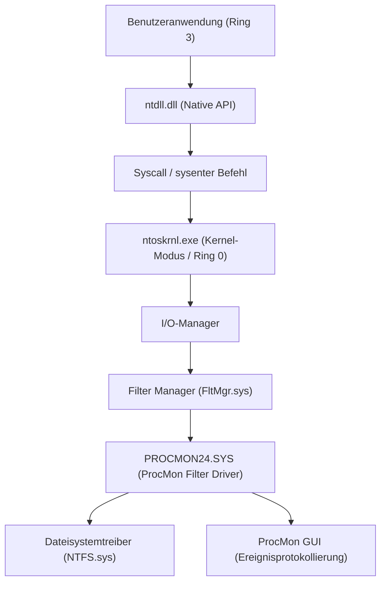
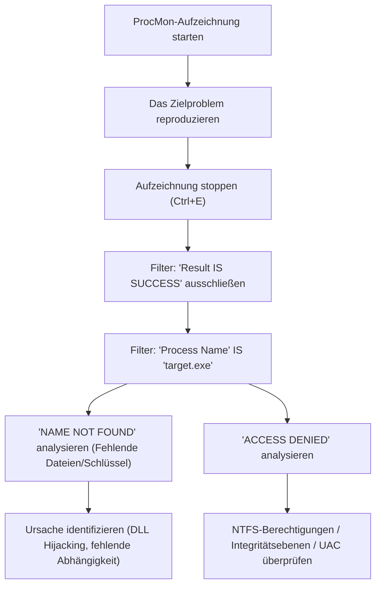
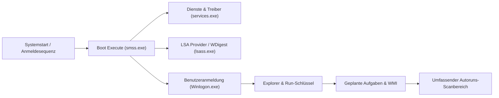

In einer Windows-Umgebung, wenn man mit Problemen wie Systemabstürzen, Leistungseinbußen, Malware-Infektionen oder unerklärlichem Verhalten von Anwendungen konfrontiert wird, können der standardmäßige Task-Manager und die Ereignisanzeige oft nicht die wahre Ursache (Root Cause) identifizieren. Bei einer derart fortgeschrittenen Fehlerbehebung greifen IT-Profis, Incident Responder und Systemadministratoren auf der ganzen Welt auf die **Windows Sysinternals**-Tools zurück.

In diesem Artikel werden wir die wichtigsten Tools von Sysinternals, nämlich **Process Explorer**, **Process Monitor (ProcMon)**, **Autoruns** und **TCPView**, einsetzen und die fortgeschrittenen Methoden zur Fehlerbehebung gründlich erklären, die bis in die Tiefen des Windows-Betriebssystems (die Grenze zwischen Kernel-Modus und Benutzermodus, Interrupt-Verarbeitung, ETW, Registrierungs-/Dateisystemtreiber) vordringen.

---

## 1. Architektur der Sysinternals-Tools und Grundlagen des Windows-Kernels

Um zu verstehen, warum die Sysinternals-Tools so leistungsstark sind, ist es notwendig, die grundlegenden Konzepte der Windows-Architektur zu begreifen. Windows arbeitet im Wesentlichen auf zwei Berechtigungsebenen: "Benutzermodus (Ring 3)" und "Kernel-Modus (Ring 0)".

Tools wie Process Monitor und Process Explorer rufen nicht nur APIs im Benutzermodus auf, sondern laden dynamisch dedizierte Kernel-Modus-Treiber (z. B. `PROCMON24.SYS`), um tief im Betriebssystem auftretende Ereignisse direkt einzuhaken (Hook) oder zu verfolgen (Trace).

Das folgende Diagramm zeigt die Architektur, wie Process Monitor Dateisystemaktivitäten erfasst.

Der ProcMon-Treiber wird als Minifilter-Treiber registriert und überwacht alle IRPs (I/O Request Packets), die zwischen dem I/O-Manager und dem NTFS-Treiber ausgetauscht werden. Dadurch können selbst Zugriffe aufgedeckt werden, die eine Anwendung zu verbergen versucht.

---

## 2. Detaillierte Prozessanalyse und Malware-Analyse mit Process Explorer (ProcExp)

Process Explorer ist ein "supermächtiger Task-Manager". Er visualisiert nicht nur die CPU-/Speicherauslastung, sondern auch Prozessbäume, Handles, geladene DLLs und Thread-Call-Stacks.

### 2.1 Identifizierung von Handle-Lecks und Sperren
Es kommt häufig vor, dass eine Anwendung abstürzt, während eine Datei noch geöffnet ist, und die Datei anschließend nicht mehr gelöscht oder verschoben werden kann. Wenn der Fehler "Die Datei ist in einem anderen Programm geöffnet" angezeigt wird, kann man die **Find**-Funktion (`Ctrl+F`) von ProcExp verwenden, um nach dem Datei- oder Verzeichnisnamen zu suchen.
Sobald der Prozess identifiziert ist, der das entsprechende Handle (File, Section, Mutex, Event usw.) hält, kann man mit der rechten Maustaste auf den Zielprozess klicken und `Close Handle` erzwingen. Dadurch wird die Dateisperre aufgehoben, ohne den Prozess zu beenden (beachten Sie jedoch das Risiko, dass die Anwendung instabil werden könnte).

### 2.2 Identifizierung von Malware-Hooks und Signaturprüfung
Wenn Malware oder bösartige Rootkits im System verborgen sind, injizieren sie oft ihre eigenen DLLs in legitime Prozesse (z. B. `svchost.exe`, `explorer.exe`) (DLL-Injection).

In ProcExp können Sie die folgenden Einstellungen aktivieren, um bösartige Prozesse aufzudecken:
1. **Options** -> **Verify Image Signatures**: Überprüft die digitalen Signaturen von ausführbaren Dateien und DLLs. Unsichtbare Dateien oder Dateien mit beschädigten Signaturen werden hervorgehoben.
2. **Options** -> **VirusTotal.com** -> **Check VirusTotal.com**: Sendet automatisch die Hash-Werte aller Prozesse an VirusTotal und zeigt die Malware-Erkennungsrate (z. B. `5/72`) als Punktzahl an.

Wenn eine verdächtige `svchost.exe` gefunden wird, doppelklicken Sie auf den Prozess, überprüfen Sie den Reiter **Strings** und untersuchen Sie, ob es Unterschiede zwischen den Zeichenfolgen im Speicher (Memory) und auf dem Datenträger (Image) gibt. Wenn die Unterschiede signifikant sind, ist es sehr wahrscheinlich, dass die ausführbare Datei gepackt (Packed) ist oder Opfer von Process Hollowing wurde.

### 2.3 Analyse von Hardware-Interrupts und 100% CPU-Spitzen
Wenn das gesamte System für einige Sekunden einfriert oder der Ton stottert (Stottern), zeigt der Task-Manager manchmal, dass "System Interrupts" die CPU verbrauchen.

Im Windows-Scheduling werden Hardware-Interrupts (ISR: Interrupt Service Routine) und DPCs (Deferred Procedure Call) mit höherer Priorität (IRQL: Interrupt Request Level) ausgeführt als normale Benutzer-Threads. Das heißt, wenn ein fehlerhafter Treiber einen DPC in die Länge zieht, kann die CPU keine anderen Aufgaben auf diesem Kern ausführen.

Wenn die CPU-Auslastung von `Interrupts` oder `DPCs` ganz oben in der Prozessliste von ProcExp hoch ist, verwenden Sie den Windows Performance Analyzer (WPA) in Kombination, um den verursachenden Treiber (`.sys`) zu identifizieren. Die Berechnung der CPU-Zeit kann wie folgt formuliert werden:

$$ U_{cpu} = \left( 1 - \frac{T_{idle}}{T_{total}} \right) \times 100 $$
$$ T_{interrupt\_overhead} = \sum_{i=1}^{n} \left( T_{ISR(i)} + T_{DPC(i)} \right) $$

Wenn $T_{interrupt\_overhead}$ den Großteil der CPU-Zeit beansprucht, wird ein Fehler in einem NDIS-Treiber (Netzwerk), Storport-Treiber (Speicher) oder Grafiktreiber vermutet.

---

## 3. Hochpräzises Tracing mit Process Monitor (ProcMon)

Process Monitor zeichnet Dateisystem-, Registrierungs-, Netzwerk- und Prozess-/Thread-Erstellungsaktivitäten auf die Mikrosekunde genau auf. Es ist das mächtigste Tool zur Fehlerbehebung, aber da es in nur wenigen Minuten Laufzeit Millionen von Ereigniszeilen aufzeichnet, liegt die Herausforderung darin, "wie man das Rauschen herausfiltert".

### 3.1 Methodik der fortgeschrittenen Filterung

Der grundlegende Workflow zur Beherrschung von ProcMon ist im folgenden Mermaid-Diagramm dargestellt.

**Verwendung des Drop-Filters (Drop Filter):**
Wenn Sie `Filter` -> `Drop Filtered Events` aktivieren, werden gefilterte Ereignisse nicht mehr im Speicher oder auf der Festplatte gespeichert. Dies verhindert, dass ProcMon aufgrund von Speichermangel (OOM) abstürzt, selbst wenn Sie lange Traces durchführen (z. B. Überwachung auf intermittierende Probleme).

### 3.2 Praxisszenario: Debugging von fehlgeschlagenen DLL-Ladevorgängen (Side-Loading / Missing DLL)
Betrachten wir einen Fall, in dem eine Geschäftsanwendung, `AppServer.exe`, direkt nach dem Start ohne Fehlerdialog abnormal beendet wird (stiller Absturz). Auch die Ereignisanzeige (Anwendungsprotokoll) liefert keine nützlichen Informationen.

1. Starten Sie ProcMon und beginnen Sie die Aufzeichnung (Capture).
2. Starten Sie `AppServer.exe` und lassen Sie sie abstürzen.
3. Stoppen Sie die ProcMon-Aufzeichnung.
4. Setzen Sie den Filter: `Process Name is AppServer.exe`.
5. Setzen Sie den Filter: `Result is not SUCCESS`.

Wenn Sie das Protokoll analysieren, sollten Sie feststellen, dass Ereignisse wie die folgenden wiederholt auftreten:

*   `CreateFile` | `C:\Program Files\MyApp\lib\CoreCrypto.dll` | `NAME NOT FOUND`
*   `CreateFile` | `C:\Windows\System32\CoreCrypto.dll` | `NAME NOT FOUND`
*   `CreateFile` | `C:\Windows\CoreCrypto.dll` | `NAME NOT FOUND`
*   `CreateFile` | `C:\Users\Kenji\AppData\Local\Microsoft\WindowsApps\CoreCrypto.dll` | `NAME NOT FOUND`

Dies ist ein typisches Verhalten für **fehlende DLL-Abhängigkeiten** und die **DLL-Suchreihenfolge (DLL Search Order)**. Die Anwendung benötigt `CoreCrypto.dll`, aber da sie nirgendwo auf dem System existiert, schlägt die Initialisierung fehl und sie wird ohne Ausnahmebehandlung (Exception Handler) beendet. Durch Platzieren der fehlenden DLL im entsprechenden Verzeichnis wird dieses Problem sofort gelöst.

### 3.3 Fehlerbehebung bei Startproblemen mit Boot Logging
Wenn Windows langsam startet oder direkt nach der Anmeldung ein schwarzer Bildschirm angezeigt wird, ist die Funktion **Enable Boot Logging** von ProcMon sehr nützlich. Wenn Sie dies aktivieren und neu starten, zeichnet der dedizierte Boot-Treiber von ProcMon alle Systemaufrufe von den frühesten Phasen von Windows (wenn `smss.exe` geladen wird) auf und speichert sie in einer Datei. Wenn Sie ProcMon bei der nächsten Anmeldung öffnen, wird das Protokoll konvertiert und Sie können detailliert analysieren, welche Treiber oder Dienste den I/O-Engpass während des Startvorgangs verursachen.

Wenn man I/O-Latenz und -Durchsatz in einer Formel ausdrückt, kann man erkennen, wie viel Speicherbandbreite ein bestimmtes Gerät oder ein bestimmter Treiber verbraucht.

$$ \text{Throughput (MB/s)} = \frac{\sum_{i=1}^{N} \text{Size}(I/O_i)}{\Delta T_{capture}} \times \frac{1}{1024^2} $$

Mit `Tools` -> `File Summary` in ProcMon können Sie diese Aggregation im Handumdrehen über die GUI durchführen.

---

## 4. Analyse von Persistenzmechanismen (Persistence) und Startverzögerungen mit Autoruns

Die Autostart-Orte in Windows beschränken sich nicht nur auf den Autostart-Ordner (Startup Folder) oder die `Run`-Registrierungsschlüssel. Malware (insbesondere Payloads für APT-Angriffe und fortschrittliche Rootkits) versteckt sich oft an Orten, die für Systemadministratoren schwer zu entdecken sind, und konfiguriert sich so, dass sie nach einem Neustart ausgeführt wird (Persistence).

Autoruns scannt umfassend **alle Autostart-Einträge (ASE: Auto-Start Extensibility Points)** auf dem System.

### 4.1 Wichtige zu überprüfende Reiter und erweiterte Funktionen
*   **Logon**: Standardmäßige Run/RunOnce-Schlüssel und der Autostart-Ordner.
*   **Scheduled Tasks**: Der Windows-Aufgabenplaner. Malware erstellt oft gefälschte Aufgaben, die als "Adobe Update" oder "Google Update" getarnt sind.
*   **Services / Drivers**: Treiber, die im Kernel-Modus starten. Hier können Sie verdächtige `.sys`-Dateien deaktivieren, die für die oben genannten 100% CPU-Spitzen verantwortlich sind.
*   **WMI**: Orte für die Persistenz von dateiloser Malware (Fileless Malware) über WMI (Windows Management Instrumentation)-Ereignisfilter und -Consumer. Wird extrem oft übersehen.
*   **AppInit_DLLs / KnownDLLs**: Eine Liste von DLLs, die bei jedem Start einer Anwendung zwangsweise injiziert werden. Ein Nährboden für Hooks durch DLL-Injection.

**Fehlerbehebung in der Praxis:**
Ähnlich wie in ProcExp aktivieren Sie auch in Autoruns `Verify Code Signatures` und `Check VirusTotal.com` unter `Options`. Wenn Sie in der Liste rosafarbene Einträge (unsigniert oder unbekannter Autor) oder Einträge mit einer roten VirusTotal-Punktzahl finden, deaktivieren Sie das Kontrollkästchen, um den Start sicher zu deaktivieren, ohne die Registrierung zu löschen. Anschließend starten Sie neu, um zu testen (A/B-Testing), ob das Problem (Malware-Verhalten oder Blue/Black Screen) gelöst wurde. Dies ist der Königsweg der Analyse.

---

## 5. Verfolgung versteckter Netzwerkverbindungen mit TCPView

Man kann die Kommunikationsaktivität auch über den Netzwerk-Tab im Task-Manager oder den Befehl `netstat -ano` überprüfen, aber die Aktualisierung ist langsam und das manuelle Zuordnen von Prozessnamen zu PIDs ist mühsam.
TCPView überwacht alle TCP- und UDP-Endpunkte in Echtzeit und listet auf, welcher Prozess mit welcher Remote-Adresse und welchem Port kommuniziert.

### 5.1 Identifizierung von bösartiger C2-Kommunikation
Wenn Malware eine Hintertür (Backdoor) installiert hat und ein Beacon an einen externen C2-Server (Command and Control) sendet, achten Sie in TCPView auf die folgenden Merkmale:

*   **Unnatürlicher Prozessname**: Obwohl es sich um eine `svchost.exe` handelt, läuft sie mit Benutzerrechten anstelle von Systemrechten und unterhält eine Verbindung im Zustand `ESTABLISHED` zu einer unbekannten ausländischen IP-Adresse.
*   **Kommunikation durch Prozesse, die normalerweise nicht kommunizieren**: Beispielsweise der Taschenrechner (`calc.exe`) oder der Editor (`notepad.exe`), die eine große Anzahl von Paketen über Port 443 oder 80 senden/empfangen (typisches Zeichen für Process Hollowing).

Wenn Sie verdächtige Kommunikation finden, können Sie direkt in TCPView `Close Connection` senden, um die TCP-Sitzung zwangsweise zu trennen (durch Senden eines RST-Pakets), oder den entsprechenden Prozess mit `End Process` gewaltsam beenden.

---

## 6. Fazit: Die Essenz der Analyse mit Sysinternals

Die Sysinternals-Tools sind ein leistungsstarkes "Röntgenbild", um alle Aktivitäten, die im Hintergrund des Windows-Betriebssystems stattfinden, zu visualisieren. Um diese Tools effektiv nutzen zu können, beachten Sie bitte die folgenden Best Practices:

1.  **Konfiguration von Symbolen (Symbols)**:
    Um den Call-Stack in ProcExp oder ProcMon genau aufzulösen, ist es zwingend erforderlich, den öffentlichen Symbolserver von Microsoft zu konfigurieren. Setzen Sie die folgende Umgebungsvariable:
    `_NT_SYMBOL_PATH = srv*c:\symbols*https://msdl.microsoft.com/download/symbols`
2.  **Extrahieren von Signalen aus dem Rauschen (Verbesserung des Signal-to-Noise Ratio)**:
    Die Protokolle von ProcMon umfassen Millionen von Zeilen. Schließen Sie proaktiv "normales Verhalten (SUCCESS)" oder "bekannt sichere Prozesse (System, explorer.exe usw.)" mit dem `Exclude`-Filter aus und konzentrieren Sie sich auf den Kern des Problems (ACCESS DENIED, NAME NOT FOUND).
3.  **Immer die neueste Version verwenden**:
    Die Sysinternals-Tools werden häufig aktualisiert. Greifen Sie direkt aus dem Browser auf `https://live.sysinternals.com/` zu und verwenden Sie immer die neuesten Binärdateien (oder Kommandozeilenversionen wie `procdump`, `psexec` usw.).

Bei der fortgeschrittenen Windows-Fehlerbehebung sind Intuition und Raten (Guesswork) nutzlos. Durch eine logische Ursachenermittlung basierend auf Fakten (Prozesse, Threads, Handles, Systemaufrufe, Registrierungsereignisse) mithilfe der Sysinternals-Tools können Sie definitiv die wahre Ursache für jede noch so komplexe Störung oder schwer zu durchschauende Malware-Infektion finden.
