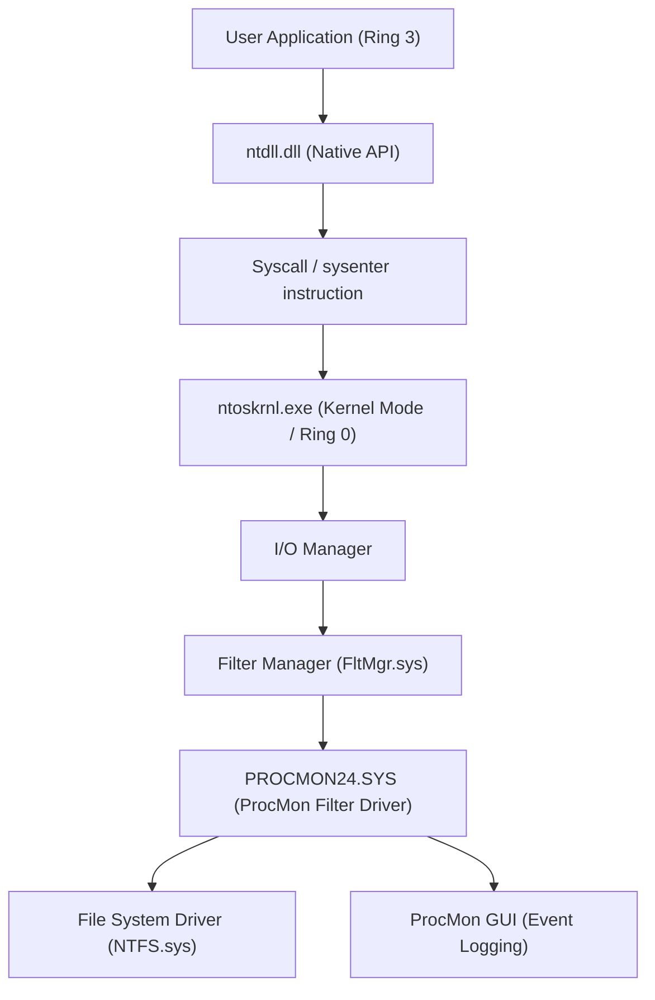
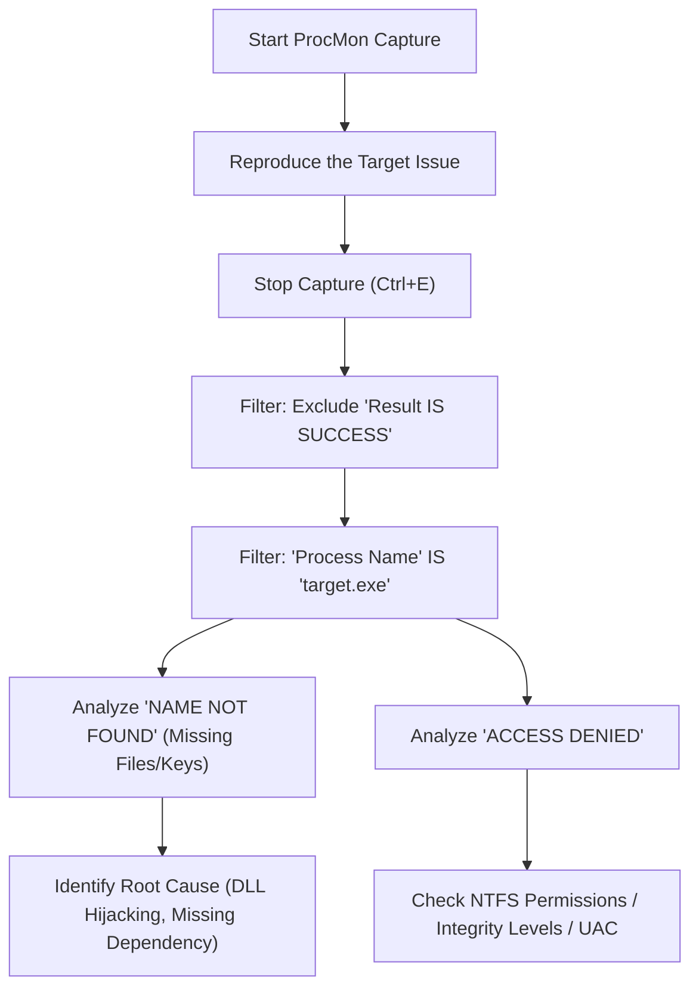
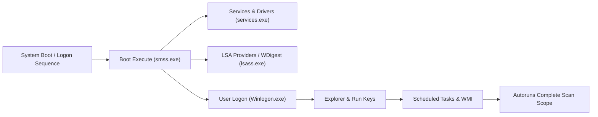

When facing problems in a Windows environment, such as system crashes, performance degradation, malware infections, or inexplicable application behavior, the built-in Task Manager and Event Viewer are often insufficient to identify the Root Cause. In such advanced troubleshooting, IT professionals, incident responders, and system administrators worldwide rely on the "**Windows Sysinternals**" suite of tools.

In this article, we will thoroughly explain advanced troubleshooting techniques that delve into the depths of the Windows OS (the boundary between kernel mode and user mode, interrupt processing, ETW, registry/file system drivers) by fully utilizing the core Sysinternals tools: **Process Explorer**, **Process Monitor (ProcMon)**, **Autoruns**, and **TCPView**.

---

## 1. Sysinternals Tools Architecture and Windows Kernel Basics

To understand why the Sysinternals suite is so powerful, it is necessary to grasp the basic concepts of Windows architecture. Windows broadly operates on two privilege levels: "User Mode (Ring 3)" and "Kernel Mode (Ring 0)".

Tools like Process Monitor and Process Explorer do not merely call user-mode APIs; they dynamically load dedicated kernel-mode drivers (e.g., `PROCMON24.SYS`) to hook or trace events occurring deep within the OS directly.

The following architecture diagram shows how Process Monitor captures file system activity.

ProcMon's driver registers as a minifilter driver and monitors all IRPs (I/O Request Packets) passing between the I/O Manager and the NTFS driver. This allows it to uncover all accesses, even those an application tries to hide.

---

## 2. Process Deep Dive and Malware Analysis with Process Explorer (ProcExp)

Process Explorer is a "supercharged Task Manager." It visualizes not just CPU/memory usage, but also process trees, handles, loaded DLLs, and thread call stacks.

### 2.1 Identifying Handle Leaks and Locks
A common issue occurs when an application crashes while keeping a file open, preventing the file from being subsequently deleted or moved. When you get the error "The file is open in another program," use ProcExp's **Find** feature (`Ctrl+F`) to search for the file or directory name.
Once you identify the process holding the corresponding handle (File, Section, Mutex, Event, etc.), you can right-click the target process and forcefully execute `Close Handle` to release the file lock without killing the process (however, be aware of the risk that the app's behavior may become unstable).

### 2.2 Identifying Malware Hooks and Verifying Signatures
When malware or an unauthorized rootkit is lurking in the system, it may inject its own DLL (DLL Injection) into legitimate processes (e.g., `svchost.exe`, `explorer.exe`).

In ProcExp, you can highlight unauthorized processes by enabling the following settings:
1. **Options** -> **Verify Image Signatures**: Verifies the digital signatures of executables and DLLs. Unsigned files or files with broken signatures are highlighted.
2. **Options** -> **VirusTotal.com** -> **Check VirusTotal.com**: Automatically sends the hash values of all processes to VirusTotal and displays the malware detection rate (e.g., `5/72`) as a score.

If a suspicious `svchost.exe` is found, double-click the process, check the **Strings** tab, and look for differences between the strings in Memory and on Disk (Image). If the difference is significant, it is highly likely that the executable is Packed or has fallen victim to Process Hollowing.

### 2.3 Analyzing Hardware Interrupts and 100% CPU Spikes
If the entire system freezes for a few seconds or audio stutters, checking the Task Manager might show "System Interrupts" consuming the CPU.

In Windows scheduling, hardware interrupts (ISR: Interrupt Service Routine) and DPCs (Deferred Procedure Call) execute at a higher priority (IRQL: Interrupt Request Level) than normal user threads. In other words, if a faulty driver prolongs a DPC, the CPU cannot execute any other tasks on that core.

If the CPU usage of `Interrupts` or `DPCs` at the top of the ProcExp process list is high, use it in conjunction with the Windows Performance Analyzer (WPA) to identify the driver (`.sys`) causing it. CPU time calculation can be formulated as follows:

$$ U_{cpu} = \left( 1 - \frac{T_{idle}}{T_{total}} \right) \times 100 $$
$$ T_{interrupt\_overhead} = \sum_{i=1}^{n} \left( T_{ISR(i)} + T_{DPC(i)} \right) $$

If $T_{interrupt\_overhead}$ accounts for most of the CPU time, a bug in an NDIS driver (network), Storport driver (storage), or graphics driver is suspected.

---

## 3. Ultra-Precision Tracing with Process Monitor (ProcMon)

Process Monitor records file system, registry, network, and process/thread creation activity at the microsecond level. It is the most powerful tool for troubleshooting, but because running it for just a few minutes logs millions of events, the challenge becomes "how to filter the noise."

### 3.1 Advanced Filtering Methodology

The basic workflow for mastering ProcMon is shown in the following Mermaid diagram.

**Utilizing the Drop Filter:**
By enabling `Filter` -> `Drop Filtered Events`, filtered events are no longer saved to memory or disk. This prevents ProcMon from crashing due to Out of Memory (OOM) errors even during long traces (e.g., monitoring intermittent issues).

### 3.2 Practical Scenario: Debugging DLL Load Failures (Side-Loading / Missing DLL)
Consider a case where a business application `AppServer.exe` terminates abnormally (silent crash) immediately after launch without displaying any error dialog. There is no useful information in the Event Viewer (Application log) either.

1. Launch ProcMon and start capture.
2. Launch `AppServer.exe` and cause it to crash.
3. Stop ProcMon capture.
4. Set filter: `Process Name is AppServer.exe`.
5. Set filter: `Result is not SUCCESS`.

Analyzing the logs, you should find a sequence of events like the following:

*   `CreateFile` | `C:\Program Files\MyApp\lib\CoreCrypto.dll` | `NAME NOT FOUND`
*   `CreateFile` | `C:\Windows\System32\CoreCrypto.dll` | `NAME NOT FOUND`
*   `CreateFile` | `C:\Windows\CoreCrypto.dll` | `NAME NOT FOUND`
*   `CreateFile` | `C:\Users\Kenji\AppData\Local\Microsoft\WindowsApps\CoreCrypto.dll` | `NAME NOT FOUND`

This is typical behavior for **Missing DLL Dependencies** and the **DLL Search Order**. The application requires `CoreCrypto.dll`, but because it does not exist anywhere on the system, initialization fails, and the application terminates without an exception handler. Placing the missing DLL in the appropriate directory resolves this issue immediately.

### 3.3 Troubleshooting Boot Failures with Boot Logging
If Windows boot is slow or results in a black screen immediately after login, ProcMon's **Enable Boot Logging** feature is useful. By enabling this and restarting, ProcMon's dedicated boot driver records all system calls from the earliest stages of Windows (when `smss.exe` is loaded) and saves them to a file. When you open ProcMon upon the next login, the log is converted, allowing you to perform a detailed analysis of which drivers or services are causing I/O bottlenecks during the boot process.

By formulating I/O latency and throughput, you can see how much storage bandwidth a specific device or driver is occupying.
$$ \text{Throughput (MB/s)} = \frac{\sum_{i=1}^{N} \text{Size}(I/O_i)}{\Delta T_{capture}} \times \frac{1}{1024^2} $$
Using ProcMon's `Tools` -> `File Summary`, you can instantly perform this aggregation on the GUI.

---

## 4. Analyzing Persistence Mechanisms and Boot Delays with Autoruns

Windows auto-start locations are not limited to just the Startup Folder or the `Run` registry key. Malware (especially advanced rootkits and APT payloads) configures itself to execute after a reboot (Persistence) by hiding in places that system administrators are less likely to notice.

Autoruns exhaustively scans **all Auto-Start Extensibility Points (ASEs)** on the system.

### 4.1 Important Tabs to Check and Advanced Features
*   **Logon**: Standard Run/RunOnce keys and the Startup folder.
*   **Scheduled Tasks**: Windows Task Scheduler. Malware often creates fake tasks disguised as "Adobe Update" or "Google Update."
*   **Services / Drivers**: Drivers that start in kernel mode. Here, you can disable the suspicious `.sys` files causing the 100% CPU spikes mentioned earlier.
*   **WMI**: Persistence locations for Fileless Malware utilizing WMI (Windows Management Instrumentation) event filters and consumers. These are very often overlooked.
*   **AppInit_DLLs / KnownDLLs**: A list of DLLs forcibly injected every time an application launches. It becomes a hotbed for hooks via DLL injection.

**Troubleshooting in Practice:**
In Autoruns, similar to ProcExp, enable `Verify Code Signatures` and `Check VirusTotal.com` from `Options`. If you find entries highlighted in pink (unsigned or unknown publisher) or entries with a red VirusTotal score in the list, you can safely disable their startup by simply unchecking the box without deleting the registry. A standard analytical approach is to perform A/B testing by restarting to see if the issue (malware behavior or blue/black screens) is resolved.

---

## 5. Tracking Hidden Network Connections with TCPView

While you can check the network status in the Task Manager's Network tab or with the `netstat -ano` command, updates are slow, and manually mapping PIDs to process names is tedious.
TCPView monitors all TCP and UDP endpoints in real-time, listing which processes are communicating with which remote addresses and ports.

### 5.1 Identifying Unauthorized C2 Communications
If malware has installed a backdoor and is sending Beacons to an external C2 (Command and Control) server, look for the following characteristics in TCPView:

*   **Unnatural Process Names**: For example, a process named `svchost.exe` operating with user privileges instead of system privileges, and maintaining communication in an `ESTABLISHED` state with an unfamiliar overseas IP address.
*   **Communication from Processes that Normally Don't Communicate**: For instance, Calculator (`calc.exe`) or Notepad (`notepad.exe`) sending and receiving large numbers of packets on port 443 or 80 (a typical sign of Process Hollowing).

If you spot suspicious communication, you can forcefully close the TCP session (issuing an RST packet) by sending `Close Connection` directly from TCPView, or forcefully terminate the corresponding process with `End Process`.

---

## 6. Conclusion: The Essence of Analysis with Sysinternals

The Sysinternals suite of tools serves as a powerful "X-ray" that visualizes all the underlying behaviors of the Windows OS. To use these tools effectively, adhere to the following best practices:

1.  **Configuring Symbols**:
    To accurately resolve call stacks in ProcExp and ProcMon, it is mandatory to configure Microsoft's public symbol server. Set the following environment variable:
    `_NT_SYMBOL_PATH = srv*c:\symbols*https://msdl.microsoft.com/download/symbols`
2.  **Improving the Signal-to-Noise Ratio**:
    ProcMon logs span millions of lines. Actively use the `Exclude` filter to remove "normal behaviors (SUCCESS)" and "known safe processes (System, explorer.exe, etc.)", and focus on the core of the issue (ACCESS DENIED, NAME NOT FOUND).
3.  **Always Use the Latest Version**:
    Sysinternals tools are frequently updated. Access `https://live.sysinternals.com/` directly from your browser to always use the latest binaries (or command-line versions like `procdump`, `psexec`, etc.).

In advanced Windows troubleshooting, intuition and guesswork are meaningless. By conducting a logical root cause analysis based on facts (processes, threads, handles, system calls, registry events) using Sysinternals tools, you will invariably be able to get to the root cause, no matter how complex the failure or how obscure the malware infection.
