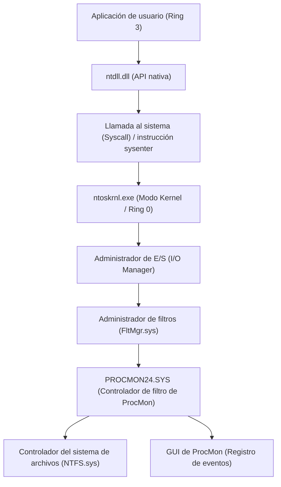
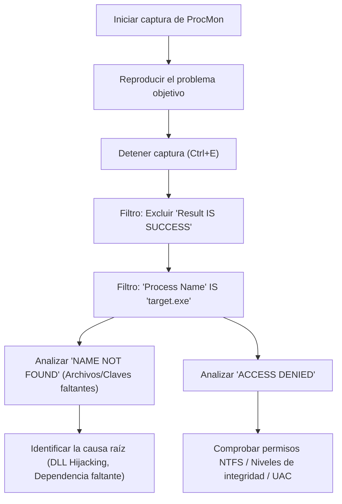
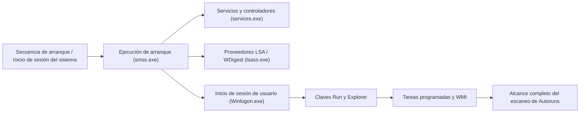

En entornos Windows, cuando se enfrentan problemas como fallos del sistema, degradación del rendimiento, infecciones de malware o comportamientos inexplicables de las aplicaciones, a menudo es imposible identificar la causa raíz (Root Cause) utilizando únicamente el Administrador de tareas o el Visor de eventos integrados. Para este tipo de resolución de problemas avanzados, la suite de herramientas "**Windows Sysinternals**" es utilizada de forma unánime por profesionales de TI, respondedores a incidentes y administradores de sistemas en todo el mundo.

En este artículo, explicaremos exhaustivamente técnicas de resolución de problemas avanzadas que profundizan en el abismo del sistema operativo Windows (el límite entre el modo kernel y el modo de usuario, el procesamiento de interrupciones, ETW, y los controladores del sistema de archivos/registro) haciendo uso completo de las herramientas principales de Sysinternals: **Process Explorer**, **Process Monitor (ProcMon)**, **Autoruns** y **TCPView**.

---

## 1. Arquitectura de las herramientas Sysinternals y fundamentos del kernel de Windows

Para comprender por qué la suite de herramientas Sysinternals es tan poderosa, es necesario tener una comprensión de los conceptos básicos de la arquitectura de Windows. En términos generales, Windows opera en dos niveles de privilegios: "Modo de usuario (Ring 3)" y "Modo kernel (Ring 0)".

Las herramientas como Process Monitor o Process Explorer no se limitan a llamar a las API del modo de usuario, sino que cargan dinámicamente controladores de modo kernel dedicados (por ejemplo, `PROCMON24.SYS`) para enlazar (hook) o rastrear directamente los eventos que ocurren en las profundidades del sistema operativo.

El siguiente diagrama muestra la arquitectura de cómo Process Monitor captura la actividad del sistema de archivos.

El controlador de ProcMon se registra como un controlador de minifiltro y supervisa todos los IRP (I/O Request Packets) que pasan entre el Administrador de E/S y el controlador NTFS. Esto permite descubrir todos los accesos, incluso aquellos que una aplicación intenta ocultar.

---

## 2. Análisis profundo de procesos y análisis de malware con Process Explorer (ProcExp)

Process Explorer es un "Administrador de tareas superpoderoso". No solo visualiza el uso de CPU/memoria, sino también el árbol de procesos, los identificadores (handles), las DLL cargadas y las pilas de llamadas (call stacks) de los subprocesos.

### 2.1 Identificación de fugas de handles y bloqueos (locks)
Es frecuente que una aplicación falle dejando un archivo abierto, lo que posteriormente impide que dicho archivo sea eliminado o movido. Cuando aparece el error "El archivo está abierto en otro programa", puedes usar la función **Find** (`Ctrl+F`) de ProcExp para buscar el nombre del archivo o directorio.
Una vez identificado el proceso que mantiene el handle (File, Section, Mutex, Event, etc.), puedes hacer clic derecho en el proceso en cuestión y ejecutar forzosamente `Close Handle` para desbloquear el archivo sin necesidad de matar el proceso (sin embargo, debes tener cuidado, ya que existe el riesgo de que el comportamiento de la aplicación se vuelva inestable).

### 2.2 Identificación de hooks de malware y verificación de firmas
Cuando un malware o rootkit malicioso se oculta en el sistema, puede inyectar su propia DLL (DLL Injection) en un proceso legítimo (por ejemplo, `svchost.exe`, `explorer.exe`).

En ProcExp, puedes revelar procesos maliciosos habilitando las siguientes configuraciones:
1. **Options** -> **Verify Image Signatures**: Verifica las firmas digitales de los archivos ejecutables y DLL. Se resaltarán los archivos sin firma o con firmas corruptas.
2. **Options** -> **VirusTotal.com** -> **Check VirusTotal.com**: Envía automáticamente los valores hash de todos los procesos a VirusTotal y muestra la tasa de detección de malware (por ejemplo, `5/72`) como una puntuación.

Si encuentras un `svchost.exe` sospechoso, haz doble clic en el proceso y revisa la pestaña **Strings** para comprobar si hay diferencias entre las cadenas en memoria (Memory) y en el disco (Image). Si la diferencia es significativa, es muy probable que el archivo ejecutable esté empaquetado (Packed) o que haya sido víctima de un ahuecamiento de proceso (Process Hollowing).

### 2.3 Interrupciones de hardware y análisis de picos del 100% en la CPU
Si todo el sistema se congela durante unos segundos o si el audio se entrecorta (stuttering), al revisar el Administrador de tareas podrías notar que "System Interrupts" está consumiendo toda la CPU.

En la programación de Windows, las interrupciones de hardware (ISR: Interrupt Service Routine) y las llamadas a procedimientos diferidos (DPC: Deferred Procedure Call) se ejecutan con una prioridad mayor (IRQL: Interrupt Request Level) que los subprocesos de usuario normales. Esto significa que, si un controlador defectuoso prolonga una DPC, la CPU no podrá ejecutar ninguna otra tarea en ese núcleo.

Si el uso de CPU por parte de `Interrupts` o `DPCs` en la parte superior de la lista de procesos de ProcExp es alto, puedes usarlo junto con Windows Performance Analyzer (WPA) para identificar el controlador causal (`.sys`). El cálculo del tiempo de CPU puede formularse de la siguiente manera:

$$ U_{cpu} = \left( 1 - \frac{T_{idle}}{T_{total}} \right) \times 100 $$
$$ T_{interrupt\_overhead} = \sum_{i=1}^{n} \left( T_{ISR(i)} + T_{DPC(i)} \right) $$

Si $T_{interrupt\_overhead}$ ocupa la mayor parte del tiempo de CPU, es probable que haya un error en el controlador NDIS (red), en el controlador Storport (almacenamiento) o en el controlador de gráficos.

---

## 3. Seguimiento ultrapreciso con Process Monitor (ProcMon)

Process Monitor registra la actividad del sistema de archivos, el registro, la red y la creación de procesos/subprocesos en microsegundos. Es la herramienta más potente para la resolución de problemas, pero como en tan solo unos minutos de ejecución puede registrar millones de eventos, la clave está en "cómo filtrar el ruido".

### 3.1 Metodología de filtrado avanzado

El diagrama de Mermaid a continuación muestra el flujo de trabajo básico para dominar ProcMon.

**Uso del filtro de descarte (Drop Filter):**
Al habilitar `Filter` -> `Drop Filtered Events`, los eventos filtrados ya no se guardarán en la memoria ni en el disco. Esto evita que ProcMon se bloquee por falta de memoria (OOM) al realizar rastreos prolongados (por ejemplo, al monitorear un problema intermitente).

### 3.2 Escenario práctico: Depuración de fallos de carga de DLL (Side-Loading / Missing DLL)
Consideremos un caso en el que una aplicación empresarial `AppServer.exe` termina anormalmente (falla silenciosamente) inmediatamente después de iniciarse, sin mostrar ningún cuadro de diálogo de error. El Visor de eventos (registro de aplicaciones) tampoco contiene información útil.

1. Inicia ProcMon y comienza la captura.
2. Inicia `AppServer.exe` y haz que falle.
3. Detén la captura en ProcMon.
4. Establece el filtro: `Process Name is AppServer.exe`.
5. Establece el filtro: `Result is not SUCCESS`.

Al analizar los registros, deberías encontrar eventos consecutivos como los siguientes:

*   `CreateFile` | `C:\Program Files\MyApp\lib\CoreCrypto.dll` | `NAME NOT FOUND`
*   `CreateFile` | `C:\Windows\System32\CoreCrypto.dll` | `NAME NOT FOUND`
*   `CreateFile` | `C:\Windows\CoreCrypto.dll` | `NAME NOT FOUND`
*   `CreateFile` | `C:\Users\Kenji\AppData\Local\Microsoft\WindowsApps\CoreCrypto.dll` | `NAME NOT FOUND`

Este es un comportamiento típico de **falta de dependencias de DLL** y de la **orden de búsqueda de DLL (DLL Search Order)**. La aplicación necesita `CoreCrypto.dll`, pero como no existe en ningún lugar del sistema, la inicialización falla y la aplicación se cierra sin un manejador de excepciones. Colocar la DLL faltante en el directorio apropiado resolverá este problema de inmediato.

### 3.3 Resolución de problemas de fallos de inicio con Boot Logging
Si el inicio de Windows es lento o aparece una pantalla negra justo después de iniciar sesión, la función **Enable Boot Logging** de ProcMon resulta muy útil. Al habilitar esto y reiniciar, un controlador de arranque dedicado de ProcMon registrará todas las llamadas al sistema desde la etapa más temprana de Windows (el momento en que se carga `smss.exe`) y las guardará en un archivo. Al abrir ProcMon en el siguiente inicio de sesión, el registro se convertirá y podrás analizar en detalle qué controlador o servicio está causando el cuello de botella de E/S durante el proceso de arranque.

Si formulamos matemáticamente la latencia o el rendimiento de E/S, podemos ver cuánto ancho de banda de almacenamiento está ocupando un dispositivo o controlador específico.
$$ \text{Throughput (MB/s)} = \frac{\sum_{i=1}^{N} \text{Size}(I/O_i)}{\Delta T_{capture}} \times \frac{1}{1024^2} $$
Utilizando `Tools` -> `File Summary` de ProcMon, puedes realizar esta suma de forma instantánea en la GUI.

---

## 4. Análisis de mecanismos de persistencia (Persistence) y retrasos en el arranque con Autoruns

Los lugares de inicio automático de Windows no se limitan simplemente a la carpeta de inicio (Startup Folder) o a las claves de registro `Run`. El malware (especialmente las cargas útiles de ataques APT y los rootkits avanzados) se oculta en lugares que son difíciles de notar para los administradores de sistemas para configurarse de manera que se ejecuten incluso después de reiniciar (Persistence).

Autoruns escanea exhaustivamente **todos los puntos de extensibilidad de inicio automático (ASE: Auto-Start Extensibility Points)** del sistema.

### 4.1 Pestañas importantes a revisar y funciones avanzadas
*   **Logon**: Claves Run/RunOnce estándar, carpeta de inicio.
*   **Scheduled Tasks**: Programador de tareas de Windows. El malware a menudo crea tareas falsificadas bajo nombres como "Adobe Update" o "Google Update".
*   **Services / Drivers**: Controladores que se inician en el modo kernel. Aquí puedes deshabilitar los archivos `.sys` sospechosos que están causando el pico del 100% de CPU mencionado anteriormente.
*   **WMI**: Ubicaciones de persistencia de malware sin archivos (Fileless Malware) que utilizan filtros de eventos y consumidores de WMI (Windows Management Instrumentation). Es un área que a menudo se pasa por alto.
*   **AppInit_DLLs / KnownDLLs**: Listas de DLL que se inyectan forzosamente cada vez que se inicia una aplicación. Son un caldo de cultivo para hooks mediante la inyección de DLL.

**Práctica de resolución de problemas:**
Al igual que en ProcExp, en Autoruns puedes habilitar `Verify Code Signatures` y `Check VirusTotal.com` desde `Options`. Si encuentras entradas resaltadas en rosa (sin firma o con autor desconocido) o entradas con puntuaciones rojas en VirusTotal en la lista, simplemente puedes desmarcar la casilla de verificación para deshabilitar su inicio de forma segura sin eliminar el registro. Luego, la técnica de análisis estándar (prueba A/B) consiste en reiniciar y probar si el problema (el comportamiento del malware o la pantalla azul/negra) se ha resuelto.

---

## 5. Seguimiento de conexiones de red ocultas con TCPView

Aunque es posible comprobar el estado de las conexiones en la pestaña de red del Administrador de tareas o con el comando `netstat -ano`, las actualizaciones pueden ser lentas y mapear manualmente los nombres de los procesos con los PID es tedioso.
TCPView monitorea en tiempo real todos los puntos finales de TCP y UDP, y muestra una lista de qué procesos se están comunicando con qué direcciones y puertos remotos.

### 5.1 Identificación de comunicaciones C2 ilícitas
Si un malware ha instalado una puerta trasera (backdoor) y está enviando señales (Beacon) a un servidor C2 (Command and Control) externo, busca las siguientes características en TCPView:

*   **Nombre de proceso poco natural**: Un `svchost.exe` que, en lugar de ejecutarse con privilegios del sistema, opera con privilegios de usuario y mantiene una comunicación en estado `ESTABLISHED` con una dirección IP extranjera desconocida.
*   **Comunicación de procesos que normalmente no se comunican**: Por ejemplo, la calculadora (`calc.exe`) o el bloc de notas (`notepad.exe`) enviando y recibiendo una gran cantidad de paquetes por los puertos 443 o 80 (una señal típica de ahuecamiento de procesos).

Si encuentras una conexión sospechosa, puedes enviar `Close Connection` directamente desde TCPView para forzar la desconexión de la sesión TCP (emitiendo un paquete RST), o forzar el cierre del proceso en cuestión con `End Process`.

---

## 6. Conclusión: La esencia del análisis mediante Sysinternals

La suite de herramientas de Sysinternals es un poderoso "rayos X" para visualizar todo el comportamiento que el sistema operativo Windows realiza en segundo plano. Para aprovechar eficazmente estas herramientas, sigue las siguientes mejores prácticas:

1.  **Configuración de símbolos (Symbols)**:
    Para resolver correctamente la pila de llamadas (call stack) en ProcExp o ProcMon, es indispensable configurar el servidor de símbolos públicos de Microsoft. Establece la siguiente variable de entorno:
    `_NT_SYMBOL_PATH = srv*c:\symbols*https://msdl.microsoft.com/download/symbols`
2.  **Extracción de señales del ruido (Mejora del Signal-to-Noise Ratio)**:
    Los registros de ProcMon pueden abarcar millones de líneas. Utiliza activamente los filtros de exclusión (`Exclude`) para eliminar "comportamientos normales (SUCCESS)" o "procesos que se sabe que son seguros (System, explorer.exe, etc.)" y concéntrate en el núcleo del problema (ACCESS DENIED, NAME NOT FOUND).
3.  **Utiliza siempre la última versión**:
    Las herramientas de Sysinternals se actualizan con frecuencia. Accede directamente a `https://live.sysinternals.com/` desde tu navegador y utiliza siempre los binarios más recientes (o las versiones de línea de comandos como `procdump`, `psexec`, etc.).

En la resolución de problemas avanzados de Windows, la intuición y las conjeturas (Guesswork) son inútiles. Al llevar a cabo una investigación lógica basada en hechos (procesos, subprocesos, handles, llamadas al sistema, eventos de registro) utilizando las herramientas de Sysinternals, definitivamente podrás llegar a la causa raíz de cualquier fallo complejo o infección de malware difícil de descifrar.
