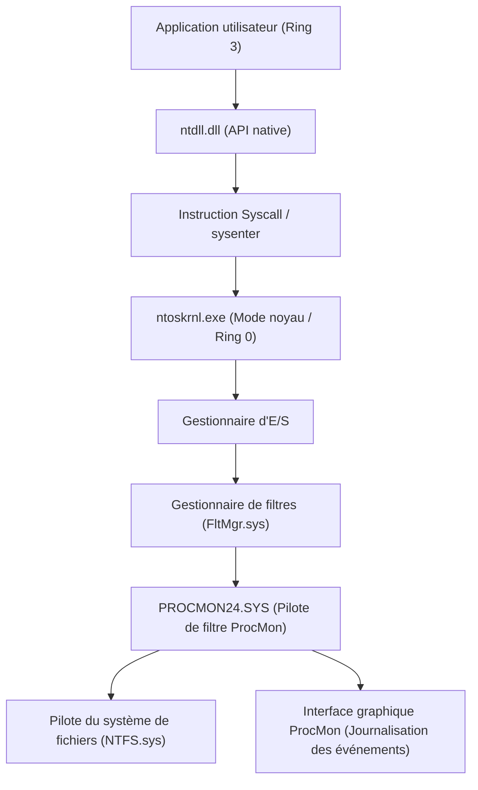
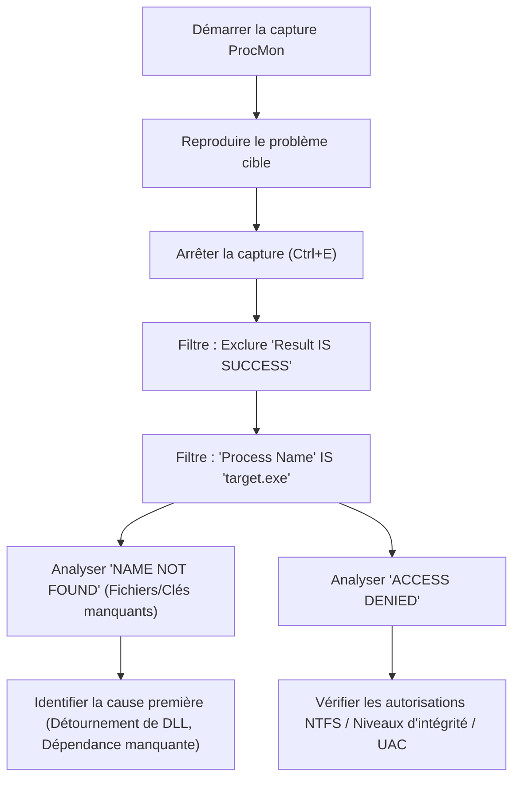

Dans un environnement Windows, lorsque vous êtes confronté à des problèmes tels que des plantages du système, une dégradation des performances, des infections par des logiciels malveillants ou le comportement inexplicable d'une application, il arrive souvent que le Gestionnaire des tâches ou l'Observateur d'événements intégrés ne suffisent pas à en identifier la cause première (Root Cause). Pour un tel dépannage avancé, la suite d'outils "**Windows Sysinternals**" est massivement utilisée par les professionnels de l'informatique, les intervenants en cas d'incident et les administrateurs système du monde entier.

Dans cet article, nous utiliserons les principaux outils de Sysinternals — **Process Explorer**, **Process Monitor (ProcMon)**, **Autoruns** et **TCPView** — pour expliquer en profondeur des techniques de dépannage avancé qui plongent dans les abysses du système d'exploitation Windows (la frontière entre le mode noyau et le mode utilisateur, le traitement des interruptions, l'ETW et les pilotes de registre / système de fichiers).

---

## 1. Architecture des outils Sysinternals et bases du noyau Windows

Pour comprendre pourquoi les outils Sysinternals sont si puissants, il est nécessaire de saisir les concepts fondamentaux de l'architecture de Windows. Windows fonctionne globalement sur deux niveaux de privilèges : le "mode utilisateur" (Ring 3) et le "mode noyau" (Ring 0).

Les outils comme Process Monitor ou Process Explorer ne se contentent pas d'appeler de simples API en mode utilisateur, ils chargent dynamiquement des pilotes dédiés en mode noyau (par exemple : `PROCMON24.SYS`) pour intercepter (hook) ou tracer directement les événements se produisant dans les profondeurs de l'OS.

Le diagramme ci-dessous illustre comment Process Monitor capture l'activité du système de fichiers.

Le pilote de ProcMon est enregistré en tant que pilote mini-filtre et surveille tous les IRP (I/O Request Packets) passant entre le Gestionnaire d'E/S et le pilote NTFS. Cela permet de révéler tous les accès, même ceux qu'une application tenterait de dissimuler.

---

## 2. Exploration approfondie des processus et analyse des malwares avec Process Explorer (ProcExp)

Process Explorer est un "Gestionnaire des tâches surpuissant". Il ne visualise pas seulement l'utilisation du CPU ou de la mémoire, mais affiche également l'arborescence des processus, les handles (descripteurs), les DLL chargées et les piles d'appels (call stacks) des threads.

### 2.1 Identification des fuites de handles et des verrous (locks)
Il arrive fréquemment qu'une application plante tout en gardant un fichier ouvert, rendant ensuite ce fichier impossible à supprimer ou à déplacer. Lorsque vous rencontrez l'erreur "Le fichier est ouvert dans un autre programme", vous pouvez utiliser la fonction **Find** (`Ctrl+F`) de ProcExp pour rechercher le nom du fichier ou du répertoire.
Une fois que vous avez identifié le processus détenant le handle correspondant (File, Section, Mutex, Event, etc.), vous pouvez faire un clic droit sur celui-ci et exécuter de force `Close Handle` pour déverrouiller le fichier sans tuer le processus (attention toutefois, cette action risque de rendre le fonctionnement de l'application instable).

### 2.2 Identification des hooks de malwares et vérification des signatures
Lorsqu'un malware ou un rootkit malveillant se cache dans le système, il peut injecter ses propres DLL (DLL Injection) dans des processus légitimes (par exemple : `svchost.exe`, `explorer.exe`).

Dans ProcExp, l'activation des paramètres suivants permet de mettre en évidence les processus suspects :
1. **Options** -> **Verify Image Signatures** : Vérifie la signature numérique des exécutables et des DLL. Les fichiers non signés ou dont la signature est corrompue seront mis en surbrillance.
2. **Options** -> **VirusTotal.com** -> **Check VirusTotal.com** : Envoie automatiquement la valeur de hachage de tous les processus à VirusTotal et affiche le taux de détection de malware sous forme de score (par exemple : `5/72`).

Si vous trouvez un `svchost.exe` suspect, double-cliquez sur le processus pour vérifier l'onglet **Strings** et recherchez d'éventuelles différences entre les chaînes de caractères en mémoire (Memory) et celles sur le disque (Image). Si la différence est importante, il est très probable que l'exécutable soit compressé (Packed) ou qu'il ait été victime d'un "Process Hollowing".

### 2.3 Analyse des interruptions matérielles et des pics d'utilisation du processeur à 100 %
Si le système tout entier gèle pendant quelques secondes ou si le son saute (stuttering), vous remarquerez peut-être dans le Gestionnaire des tâches que les "System Interrupts" (Interruptions système) consomment le CPU.

Dans l'ordonnancement de Windows, les interruptions matérielles (ISR : Interrupt Service Routine) et les DPC (Deferred Procedure Call) s'exécutent avec une priorité (IRQL : Interrupt Request Level) plus élevée que les threads utilisateur classiques. Par conséquent, si un pilote défectueux prolonge un DPC, le CPU ne peut plus exécuter aucune autre tâche sur ce cœur.

Si l'utilisation du CPU par `Interrupts` ou `DPCs` en haut de la liste des processus de ProcExp est élevée, utilisez-le conjointement avec Windows Performance Analyzer (WPA) pour identifier le pilote en cause (`.sys`). Le calcul du temps CPU peut être formulé comme suit :

$$ U_{cpu} = \left( 1 - \frac{T_{idle}}{T_{total}} \right) \times 100 $$
$$ T_{interrupt\_overhead} = \sum_{i=1}^{n} \left( T_{ISR(i)} + T_{DPC(i)} \right) $$

Si $T_{interrupt\_overhead}$ occupe la majeure partie du temps CPU, il est probable qu'il y ait un bug dans le pilote NDIS (réseau), le pilote Storport (stockage) ou le pilote graphique.

---

## 3. Traçage ultra-précis avec Process Monitor (ProcMon)

Process Monitor enregistre l'activité du système de fichiers, du registre, du réseau et la création de processus/threads à la microseconde près. Bien que ce soit l'outil le plus puissant pour le dépannage, une simple exécution de quelques minutes générera des millions de lignes d'événements ; le grand défi consiste donc à savoir "comment filtrer le bruit".

### 3.1 Méthodologie de filtrage avancée

Le workflow de base pour maîtriser ProcMon est illustré dans le diagramme Mermaid ci-dessous :

**Utilisation du filtre d'exclusion (Drop Filter) :**
L'activation de `Filter` -> `Drop Filtered Events` empêche les événements filtrés d'être sauvegardés en mémoire ou sur le disque. Cela évite que ProcMon ne plante suite à un manque de mémoire (OOM) lors de traces de longue durée (par exemple : surveillance de problèmes intermittents).

### 3.2 Scénario pratique : Débogage des échecs de chargement de DLL (Side-Loading / Missing DLL)
Considérons le cas où une application métier `AppServer.exe` se termine anormalement (plantage silencieux) immédiatement après son lancement sans afficher de boîte de dialogue d'erreur. L'Observateur d'événements (Journal d'application) ne contient aucune information utile non plus.

1. Démarrez ProcMon et lancez la capture.
2. Lancez `AppServer.exe` et laissez-le planter.
3. Arrêtez la capture dans ProcMon.
4. Configurez le filtre : `Process Name is AppServer.exe`.
5. Configurez le filtre : `Result is not SUCCESS`.

En analysant les journaux, vous devriez trouver une série d'événements similaires à ceux-ci :

*   `CreateFile` | `C:\Program Files\MyApp\lib\CoreCrypto.dll` | `NAME NOT FOUND`
*   `CreateFile` | `C:\Windows\System32\CoreCrypto.dll` | `NAME NOT FOUND`
*   `CreateFile` | `C:\Windows\CoreCrypto.dll` | `NAME NOT FOUND`
*   `CreateFile` | `C:\Users\Kenji\AppData\Local\Microsoft\WindowsApps\CoreCrypto.dll` | `NAME NOT FOUND`

C'est le comportement typique d'une **absence de dépendance DLL** et de l'**ordre de recherche des DLL (DLL Search Order)**. L'application requiert `CoreCrypto.dll`, mais comme il n'existe nulle part sur le système, l'initialisation échoue et elle se termine sans gestionnaire d'exceptions. Ce problème se résout instantanément en plaçant la DLL manquante dans le répertoire approprié.

### 3.3 Dépannage des problèmes de démarrage via Boot Logging
Si le démarrage de Windows est lent ou s'il affiche un écran noir juste après la connexion, la fonction **Enable Boot Logging** (Activer la journalisation au démarrage) de ProcMon est très utile. Une fois activée et après redémarrage, le pilote de démarrage dédié de ProcMon enregistre tous les appels système depuis les toutes premières étapes de Windows (au moment où `smss.exe` est chargé) et les sauvegarde dans un fichier. En ouvrant ProcMon lors de la prochaine connexion, les journaux sont convertis, vous permettant d'analyser en détail quel pilote ou service a causé un goulot d'étranglement d'E/S durant le processus de démarrage.

La formalisation de la latence et du débit (throughput) d'E/S permet de comprendre dans quelle mesure un périphérique ou un pilote spécifique accapare la bande passante de stockage.
$$ \text{Throughput (MB/s)} = \frac{\sum_{i=1}^{N} \text{Size}(I/O_i)}{\Delta T_{capture}} \times \frac{1}{1024^2} $$
En utilisant `Tools` -> `File Summary` dans ProcMon, cette agrégation peut être effectuée instantanément via l'interface graphique.

---

## 4. Analyse des mécanismes de persistance (Persistence) et des retards au démarrage avec Autoruns

Les emplacements de démarrage automatique de Windows ne se limitent pas au dossier de démarrage (Startup Folder) ou aux clés de registre `Run`. Les malwares (en particulier les charges utiles d'attaques APT ou les rootkits avancés) se cachent dans des endroits difficiles à repérer pour les administrateurs système, afin de s'exécuter de nouveau après un redémarrage (Persistance).

Autoruns analyse de manière exhaustive **tous les points d'extensibilité de démarrage automatique (ASE : Auto-Start Extensibility Points)** du système.

```mermaid
flowchart LR
  A["Séquence de démarrage / de connexion du système"] --> B["Exécution au démarrage (smss.exe)"]
  B --> C["Services et pilotes (services.exe)"]
  B --> D["Fournisseurs LSA / WDigest (lsass.exe)"]
  B --> E["Connexion utilisateur (Winlogon.exe)"]
  E --> F["Explorateur et clés d'exécution (Run Keys)"]
  F --> G["Tâches planifiées et WMI"]
  G --> H["Portée de l'analyse complète d'Autoruns"]
```

### 4.1 Onglets importants à vérifier et fonctionnalités avancées
*   **Logon** : Clés Run/RunOnce standards, dossier de démarrage.
*   **Scheduled Tasks** : Planificateur de tâches Windows. Les malwares créent souvent de fausses tâches camouflées sous des noms tels que "Adobe Update" ou "Google Update".
*   **Services / Drivers** : Pilotes démarrés en mode noyau. C'est ici que vous pouvez désactiver les fichiers `.sys` suspects causant les pics de CPU à 100 % mentionnés précédemment.
*   **WMI** : Emplacements de persistance pour les malwares sans fichier (Fileless Malware) exploitant les filtres d'événements et les consommateurs WMI (Windows Management Instrumentation). Ils sont très souvent négligés.
*   **AppInit_DLLs / KnownDLLs** : Liste de DLL injectées de force à chaque lancement d'une application. Elles constituent un terrain propice pour les hooks par injection de DLL.

**Pratique de dépannage :**
Tout comme pour ProcExp, activez `Verify Code Signatures` et `Check VirusTotal.com` depuis les `Options` d'Autoruns. Si vous trouvez des entrées colorées en rose (non signées ou dont le créateur est inconnu) ou avec un score VirusTotal en rouge dans la liste, il suffit de décocher la case pour désactiver leur démarrage en toute sécurité sans avoir à supprimer de clés de registre. Vous pouvez ensuite redémarrer pour tester si le problème (comportement d'un malware, écran bleu ou noir) est résolu (test A/B) ; c'est la méthode d'analyse par excellence.

---

## 5. Suivi des connexions réseau cachées avec TCPView

Bien qu'il soit possible de vérifier l'état des communications via l'onglet réseau du Gestionnaire des tâches ou la commande `netstat -ano`, les mises à jour peuvent être lentes et la correspondance manuelle entre les noms de processus et les PID est fastidieuse.
TCPView surveille en temps réel tous les points finaux (endpoints) TCP et UDP, et répertorie quel processus communique avec quelle adresse distante et quel port.

### 5.1 Identification des communications C2 illicites
Si un malware a installé une porte dérobée (backdoor) et envoie des balises (beacons) à un serveur C2 (Command and Control) externe, recherchez les caractéristiques suivantes avec TCPView :

*   **Nom de processus peu naturel** : Un `svchost.exe` qui s'exécute avec les privilèges de l'utilisateur au lieu de ceux du système, et maintient une communication dans l'état `ESTABLISHED` avec une adresse IP étrangère inconnue.
*   **Communication par des processus qui ne communiquent pas habituellement** : Par exemple, la calculatrice (`calc.exe`) ou le bloc-notes (`notepad.exe`) envoyant et recevant un grand nombre de paquets sur le port 443 ou 80 (un signe typique de Process Hollowing).

Si vous repérez une communication suspecte, vous pouvez forcer la déconnexion de la session TCP en envoyant `Close Connection` (émission d'un paquet RST) directement depuis TCPView, ou forcer la fermeture du processus avec `End Process`.

---

## 6. Conclusion : L'essence de l'analyse avec Sysinternals

La suite d'outils Sysinternals constitue une puissante "radiographie" permettant de visualiser tout ce que le système d'exploitation Windows fait en arrière-plan. Pour utiliser ces outils efficacement, veuillez respecter les bonnes pratiques suivantes :

1.  **Configuration des symboles (Symbols)** :
    Afin de résoudre correctement les piles d'appels dans ProcExp ou ProcMon, il est indispensable de configurer le serveur de symboles public de Microsoft. Définissez la variable d'environnement suivante :
    `_NT_SYMBOL_PATH = srv*c:\symbols*https://msdl.microsoft.com/download/symbols`
2.  **Extraction du signal du bruit (Amélioration du ratio signal/bruit)** :
    Les journaux de ProcMon comptent des millions de lignes. Excluez de manière proactive les "fonctionnements normaux (SUCCESS)" et les "processus connus comme sûrs (System, explorer.exe, etc.)" avec le filtre `Exclude`, et concentrez-vous sur le cœur du problème (ACCESS DENIED, NAME NOT FOUND).
3.  **Toujours utiliser la dernière version** :
    Les outils Sysinternals sont fréquemment mis à jour. Accédez directement à `https://live.sysinternals.com/` depuis votre navigateur et utilisez toujours les fichiers binaires les plus récents (ou leurs versions en ligne de commande comme `procdump`, `psexec`, etc.).

Dans le domaine du dépannage avancé de Windows, l'intuition et les suppositions (Guesswork) n'ont pas leur place. En menant une investigation logique des causes basée sur des faits (processus, threads, handles, appels système, événements de registre) à l'aide des outils Sysinternals, vous parviendrez sans aucun doute à la cause première, peu importe la complexité du problème ou de l'infection par un malware.
