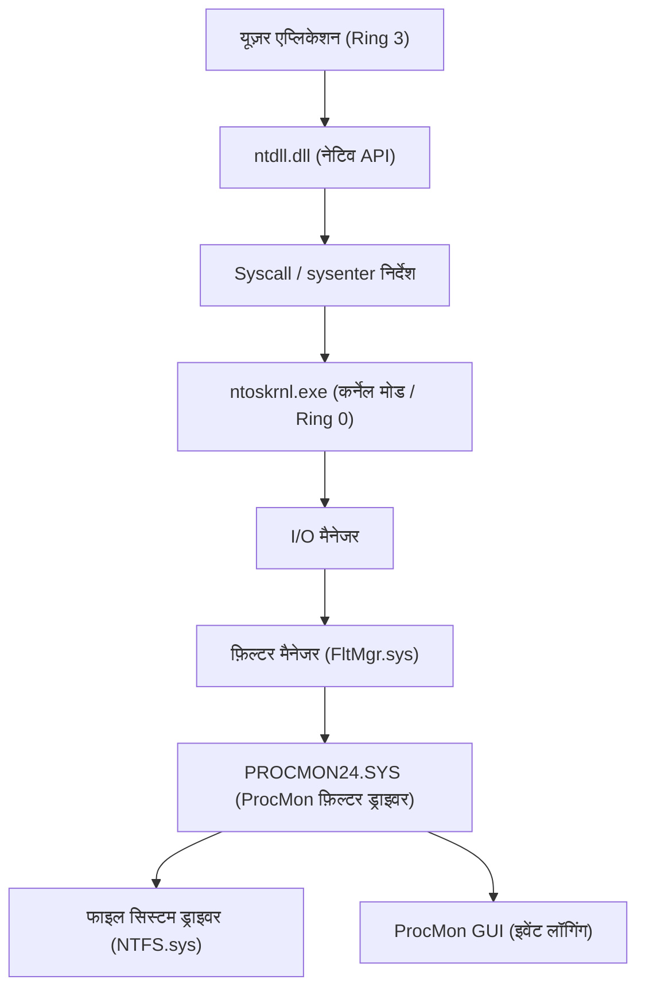
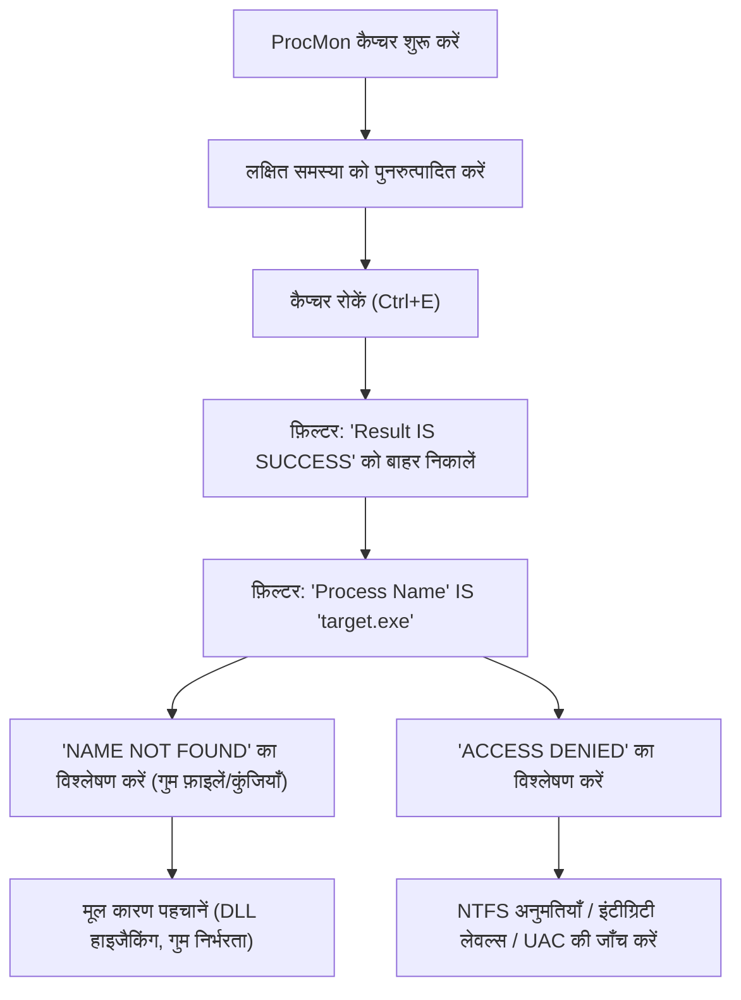
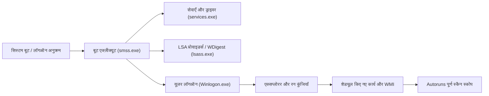

विंडोज़ पर्यावरण में, जब सिस्टम क्रैश, प्रदर्शन में गिरावट, मैलवेयर संक्रमण, या एप्लिकेशन के रहस्यमय व्यवहार जैसी समस्याओं का सामना करना पड़ता है, तो अक्सर केवल मानक टास्क मैनेजर या इवेंट व्यूअर से मूल कारण (Root Cause) की पहचान करना संभव नहीं होता है। इस प्रकार की उन्नत ट्रबलशूटिंग में, दुनिया भर के आईटी पेशेवर, इंसिडेंट रिस्पॉन्डर्स और सिस्टम एडमिनिस्ट्रेटर समान रूप से "**Windows Sysinternals**" टूल्स के सूट का उपयोग करते हैं।

इस लेख में, हम Sysinternals के प्रमुख टूल्स—**Process Explorer**, **Process Monitor (ProcMon)**, **Autoruns**, और **TCPView**—का पूरा उपयोग करके विंडोज़ ओएस की गहराइयों (कर्नेल मोड और यूज़र मोड के बीच की सीमा, इंटरप्ट प्रोसेसिंग, ETW, रजिस्ट्री/फाइल सिस्टम ड्राइवर्स) तक पहुंचने वाली उन्नत ट्रबलशूटिंग तकनीकों की विस्तृत व्याख्या करेंगे।

---

## 1. Sysinternals टूल्स का आर्किटेक्चर और विंडोज़ कर्नेल की मूल बातें

Sysinternals टूल्स इतने शक्तिशाली क्यों हैं, यह समझने के लिए विंडोज़ आर्किटेक्चर की बुनियादी अवधारणाओं को समझना आवश्यक है। विंडोज़ मुख्य रूप से दो विशेषाधिकार स्तरों पर काम करता है: "यूज़र मोड (Ring 3)" और "कर्नेल मोड (Ring 0)"।

Process Monitor और Process Explorer जैसे टूल्स केवल यूज़र मोड API को कॉल नहीं करते हैं, बल्कि वे गतिशील रूप से समर्पित कर्नेल मोड ड्राइवर्स (उदाहरण: `PROCMON24.SYS`) लोड करते हैं, और OS की गहराई में होने वाली घटनाओं को सीधे हुक या ट्रेस करते हैं।

नीचे दिया गया आरेख यह दर्शाता है कि Process Monitor फाइल सिस्टम गतिविधियों को कैसे कैप्चर करता है।

ProcMon का ड्राइवर एक मिनी-फ़िल्टर ड्राइवर के रूप में पंजीकृत होता है और I/O मैनेजर तथा NTFS ड्राइवर के बीच से गुज़रने वाले सभी IRP (I/O Request Packet) की निगरानी करता है। इसके परिणामस्वरूप, उन एक्सेस को भी उजागर किया जा सकता है जिन्हें एप्लिकेशन छिपाने की कोशिश करते हैं।

---

## 2. Process Explorer (ProcExp) के माध्यम से प्रक्रियाओं की गहन जांच और मैलवेयर विश्लेषण

Process Explorer एक "अति-शक्तिशाली टास्क मैनेजर" है। यह केवल CPU/मेमोरी उपयोग ही नहीं, बल्कि प्रोसेस ट्री, हैंडल्स, लोड की गई DLL, और थ्रेड के कॉल स्टैक तक को विज़ुअलाइज़ करता है।

### 2.1 हैंडल लीक और लॉक्स की पहचान
अक्सर ऐसा होता है कि कोई एप्लिकेशन किसी फाइल को खुला छोड़ कर क्रैश हो जाता है, और उसके बाद उस फाइल को डिलीट या मूव नहीं किया जा सकता। यदि आपको "फ़ाइल किसी अन्य प्रोग्राम द्वारा खोली गई है" (The file is open in another program) जैसी त्रुटि मिलती है, तो ProcExp की **Find** सुविधा (`Ctrl+F`) का उपयोग करके फ़ाइल या डायरेक्टरी का नाम खोजें।
जब आप उस प्रोसेस की पहचान कर लें जो संबंधित हैंडल (File, Section, Mutex, Event आदि) को होल्ड किए हुए है, तो उस प्रोसेस पर राइट-क्लिक करके `Close Handle` को ज़बरदस्ती निष्पादित करें, जिससे आप प्रोसेस को मारे बिना फ़ाइल का लॉक हटा सकते हैं (हालांकि, ध्यान रहे कि इससे ऐप का संचालन अस्थिर हो सकता है)।

### 2.2 मैलवेयर हुक्स की पहचान और हस्ताक्षर सत्यापन
जब मैलवेयर या दुर्भावनापूर्ण रूटकिट सिस्टम में छिपे होते हैं, तो वे कभी-कभी वैध प्रक्रियाओं (उदाहरण: `svchost.exe`, `explorer.exe`) में अपनी DLL इंजेक्ट (DLL Injection) करते हैं।

ProcExp में, निम्नलिखित सेटिंग्स को सक्षम करके संदिग्ध प्रक्रियाओं को उजागर किया जा सकता है:
1. **Options** -> **Verify Image Signatures**: निष्पादन योग्य फ़ाइलों और DLLs के डिजिटल हस्ताक्षरों का सत्यापन करता है। अहस्ताक्षरित, या टूटे हुए हस्ताक्षर वाली फ़ाइलें हाइलाइट हो जाती हैं।
2. **Options** -> **VirusTotal.com** -> **Check VirusTotal.com**: स्वचालित रूप से सभी प्रक्रियाओं के हैश मान VirusTotal को भेजता है, और मैलवेयर डिटेक्शन रेट (उदाहरण: `5/72`) को स्कोर के रूप में प्रदर्शित करता है।

यदि कोई संदिग्ध `svchost.exe` मिलता है, तो प्रोसेस पर डबल-क्लिक करें, **Strings** टैब जांचें, और देखें कि मेमोरी में मौजूद स्ट्रिंग्स (Memory) और डिस्क पर मौजूद स्ट्रिंग्स (Image) के बीच कोई अंतर तो नहीं है। यदि यहाँ बड़ा अंतर है, तो इस बात की बहुत अधिक संभावना है कि निष्पादन योग्य फ़ाइल पैक्ड (Packed) है, या वह प्रोसेस होलोइंग (Process Hollowing) का शिकार हुई है।

### 2.3 हार्डवेयर इंटरप्ट्स और 100% CPU स्पाइक्स का विश्लेषण
जब पूरा सिस्टम कुछ सेकंड के लिए फ्रीज़ हो जाता है, या ऑडियो रुक-रुक कर आता है (स्टटर), तो टास्क मैनेजर को देखने पर पता चल सकता है कि "System Interrupts" CPU को खा रहे हैं।

विंडोज़ शेड्यूलिंग में, हार्डवेयर इंटरप्ट्स (ISR: Interrupt Service Routine) और DPC (Deferred Procedure Call) को सामान्य यूज़र थ्रेड्स की तुलना में उच्च प्राथमिकता (IRQL: Interrupt Request Level) पर निष्पादित किया जाता है। अर्थात, यदि कोई खराब ड्राइवर DPC को लंबा खींचता है, तो CPU उस कोर पर कोई अन्य कार्य बिल्कुल नहीं कर पाएगा।

यदि ProcExp की प्रोसेस लिस्ट में सबसे ऊपर मौजूद `Interrupts` या `DPCs` का CPU उपयोग अधिक है, तो विंडोज़ परफॉरमेंस एनालाइज़र (WPA) के साथ संयोजन में इसका उपयोग करके अपराधी ड्राइवर (`.sys`) की पहचान करें। CPU समय की गणना को निम्न प्रकार से तैयार किया जा सकता है:

$$ U_{cpu} = \left( 1 - \frac{T_{idle}}{T_{total}} \right) \times 100 $$
$$ T_{interrupt\_overhead} = \sum_{i=1}^{n} \left( T_{ISR(i)} + T_{DPC(i)} \right) $$

यदि $T_{interrupt\_overhead}$ CPU समय का अधिकांश हिस्सा ले लेता है, तो NDIS ड्राइवर (नेटवर्क), Storport ड्राइवर (स्टोरेज), या ग्राफिक्स ड्राइवर में बग होने का संदेह होता है।

---

## 3. Process Monitor (ProcMon) द्वारा अति-सटीक ट्रेसिंग

Process Monitor फ़ाइल सिस्टम, रजिस्ट्री, नेटवर्क, और प्रोसेस/थ्रेड निर्माण गतिविधियों को माइक्रोसेकंड स्तर पर रिकॉर्ड करता है। यद्यपि यह ट्रबलशूटिंग के लिए सबसे शक्तिशाली टूल है, लेकिन इसे कुछ ही मिनटों तक चलाने से लाखों इवेंट्स रिकॉर्ड हो जाते हैं, इसलिए चुनौती यह है कि "शोर (noise) को कैसे फ़िल्टर किया जाए"।

### 3.1 उन्नत फ़िल्टरिंग कार्यप्रणाली

ProcMon का कुशलतापूर्वक उपयोग करने के लिए बुनियादी वर्कफ़्लो को नीचे दिए गए Mermaid आरेख में दिखाया गया है:

**ड्रॉप फ़िल्टर (Drop Filter) का उपयोग:**
यदि आप `Filter` -> `Drop Filtered Events` सक्षम करते हैं, तो फ़िल्टर किए गए इवेंट मेमोरी या डिस्क में सहेजे नहीं जाएँगे। यह ProcMon को मेमोरी की कमी (OOM) के कारण क्रैश होने से बचाता है, तब भी जब आप लंबी अवधि तक ट्रेसिंग कर रहे हों (उदाहरण: रुक-रुक कर होने वाली समस्या की निगरानी)।

### 3.2 व्यावहारिक परिदृश्य: DLL लोड विफलता (Side-Loading / Missing DLL) की डिबगिंग
मान लीजिए कि कोई व्यावसायिक एप्लिकेशन `AppServer.exe` चालू होते ही बिना कोई त्रुटि डायलॉग दिखाए असामान्य रूप से बंद (साइलेंट क्रैश) हो जाता है। इवेंट व्यूअर (Application लॉग) में भी कोई उपयोगी जानकारी नहीं है।

1. ProcMon शुरू करें और कैप्चरिंग शुरू करें।
2. `AppServer.exe` लॉन्च करें और उसे क्रैश होने दें।
3. ProcMon का कैप्चर रोकें।
4. फ़िल्टर सेट करें: `Process Name is AppServer.exe`।
5. फ़िल्टर सेट करें: `Result is not SUCCESS`।

लॉग का विश्लेषण करते समय, आपको लगातार होने वाली निम्नलिखित जैसी घटनाएँ मिलनी चाहिए:

*   `CreateFile` | `C:\Program Files\MyApp\lib\CoreCrypto.dll` | `NAME NOT FOUND`
*   `CreateFile` | `C:\Windows\System32\CoreCrypto.dll` | `NAME NOT FOUND`
*   `CreateFile` | `C:\Windows\CoreCrypto.dll` | `NAME NOT FOUND`
*   `CreateFile` | `C:\Users\Kenji\AppData\Local\Microsoft\WindowsApps\CoreCrypto.dll` | `NAME NOT FOUND`

यह **DLL निर्भरता की कमी** और **DLL सर्च ऑर्डर (DLL Search Order)** का एक विशिष्ट व्यवहार है। एप्लिकेशन को `CoreCrypto.dll` की आवश्यकता है, लेकिन चूँकि यह सिस्टम पर कहीं मौजूद नहीं है, इसलिए इनीशियलाइज़ेशन विफल हो जाता है और ऐप बिना किसी एक्सेप्शन हैंडलर के बंद हो जाता है। लापता DLL को उचित डायरेक्टरी में रखकर इस समस्या को तुरंत हल किया जा सकता है।

### 3.3 बूट लॉगिंग (Boot Logging) के साथ स्टार्टअप विफलताओं की ट्रबलशूटिंग
यदि विंडोज़ को बूट होने में लंबा समय लगता है या लॉग इन करने के तुरंत बाद काली स्क्रीन (Black Screen) दिखाई देती है, तो ProcMon की **Enable Boot Logging** सुविधा उपयोगी है। यदि आप इसे सक्षम करके पुनरारंभ करते हैं, तो ProcMon का समर्पित बूट ड्राइवर विंडोज़ के सबसे शुरुआती चरण (जब `smss.exe` लोड होता है) से सभी सिस्टम कॉल रिकॉर्ड करता है और उन्हें एक फ़ाइल में सहेजता है। जब आप अगले लॉगिन पर ProcMon खोलते हैं, तो लॉग परिवर्तित हो जाता है, और आप विस्तार से विश्लेषण कर सकते हैं कि स्टार्टअप प्रक्रिया के दौरान कौन से ड्राइवर या सेवाएँ I/O बॉटलनेक का कारण बन रहे हैं।

I/O लेटेंसी और थ्रूपुट को सूत्रबद्ध करके, आप देख सकते हैं कि कोई विशिष्ट डिवाइस या ड्राइवर कितना स्टोरेज बैंडविड्थ खपत कर रहा है:
$$ \text{Throughput (MB/s)} = \frac{\sum_{i=1}^{N} \text{Size}(I/O_i)}{\Delta T_{capture}} \times \frac{1}{1024^2} $$
ProcMon के `Tools` -> `File Summary` का उपयोग करके, आप इस एकत्रीकरण को तुरंत GUI में कर सकते हैं।

---

## 4. Autoruns द्वारा पर्सिस्टेंस तंत्र (Persistence) और बूट विलंब का विश्लेषण

विंडोज़ के ऑटो-स्टार्ट स्थान केवल स्टार्टअप फ़ोल्डर (Startup Folder) या `Run` रजिस्ट्री कुंजियाँ नहीं हैं। मैलवेयर (विशेष रूप से APT हमलों के पेलोड और उन्नत रूटकिट) खुद को ऐसी जगहों पर छिपाते हैं जिन्हें सिस्टम एडमिनिस्ट्रेटर आसानी से नहीं देख पाते, ताकि वे रीबूट के बाद भी चलते रहें (Persistence)।

Autoruns सिस्टम पर मौजूद **सभी ऑटो-स्टार्ट एंट्रीज़ (ASE: Auto-Start Extensibility Points)** को व्यापक रूप से स्कैन करता है।

### 4.1 जाँचने योग्य महत्वपूर्ण टैब और उन्नत सुविधाएँ
*   **Logon**: मानक Run/RunOnce कुंजियाँ, स्टार्टअप फ़ोल्डर।
*   **Scheduled Tasks**: विंडोज़ टास्क शेड्यूलर। मैलवेयर अक्सर "Adobe Update" या "Google Update" जैसे नकली कार्य बनाते हैं।
*   **Services / Drivers**: कर्नेल मोड में चलने वाले ड्राइवर। आप यहां उन संदिग्ध `.sys` फाइलों को अक्षम कर सकते हैं जो पहले बताए गए 100% CPU स्पाइक का कारण बनती हैं।
*   **WMI**: WMI (Windows Management Instrumentation) इवेंट फ़िल्टर और कंज़्यूमर्स का उपयोग करने वाले फ़ाइललेस मैलवेयर (Fileless Malware) के लिए पर्सिस्टेंस स्थान। इसे अक्सर नज़रअंदाज़ कर दिया जाता है।
*   **AppInit_DLLs / KnownDLLs**: हर बार किसी एप्लिकेशन के शुरू होने पर जबरदस्ती इंजेक्ट की जाने वाली DLLs की सूची। यह DLL इंजेक्शन हुक्स के लिए एक हॉटबेड बन जाता है।

**ट्रबलशूटिंग अभ्यास:**
Autoruns में भी, ProcExp की तरह, `Options` से `Verify Code Signatures` और `Check VirusTotal.com` सक्षम करें। यदि आपको सूची में गुलाबी रंग (हस्ताक्षरित नहीं, या अज्ञात निर्माता) वाली एंट्री या लाल VirusTotal स्कोर वाली एंट्री मिलती है, तो आप केवल चेकमार्क हटाकर सुरक्षित रूप से उस स्टार्टअप को अक्षम कर सकते हैं, बिना रजिस्ट्री को हटाए। इसके बाद पुनरारंभ करके परीक्षण करना (A/B टेस्टिंग) कि क्या समस्या (मैलवेयर व्यवहार या ब्लू/ब्लैक स्क्रीन) हल हो गई है, विश्लेषण का सबसे अच्छा तरीका है।

---

## 5. TCPView के साथ छिपे हुए नेटवर्क कनेक्शन की ट्रैकिंग

हालाँकि आप टास्क मैनेजर के नेटवर्क टैब या `netstat -ano` कमांड से संचार स्थिति की जाँच कर सकते हैं, लेकिन अपडेट धीमे हो सकते हैं, और प्रोसेस नाम को PID के साथ मैन्युअल रूप से मैप करना थकाऊ है।
TCPView सभी TCP और UDP एंडपॉइंट्स को वास्तविक समय में मॉनिटर करता है, और सूचीबद्ध करता है कि कौन सा प्रोसेस किस रिमोट एड्रेस और पोर्ट के साथ संचार कर रहा है।

### 5.1 अनधिकृत C2 संचार की पहचान
यदि किसी मैलवेयर ने एक बैकडोर स्थापित किया है और बाहरी C2 (Command and Control) सर्वर को बीकन (Beacon) भेज रहा है, तो TCPView में निम्नलिखित विशेषताओं की तलाश करें:

*   **प्रोसेस का नाम अस्वाभाविक है**: यद्यपि यह `svchost.exe` है, यह सिस्टम विशेषाधिकारों के बजाय यूज़र विशेषाधिकारों के साथ काम कर रहा है, और किसी अनजान विदेशी IP पते के साथ `ESTABLISHED` स्थिति में संचार बनाए हुए है।
*   **उन प्रक्रियाओं का संचार जो सामान्य रूप से संचार नहीं करती हैं**: उदाहरण के लिए, कैलकुलेटर (`calc.exe`) या नोटपैड (`notepad.exe`) पोर्ट 443 या 80 पर भारी मात्रा में पैकेट भेज या प्राप्त कर रहे हैं (प्रोसेस होलोइंग का एक सामान्य संकेत)।

यदि आपको कोई संदिग्ध संचार मिलता है, तो आप TCP सत्र को जबरन डिस्कनेक्ट (RST पैकेट जारी करना) करने के लिए TCPView से सीधे `Close Connection` भेज सकते हैं, या `End Process` का उपयोग करके संबंधित प्रोसेस को जबरदस्ती समाप्त कर सकते हैं।

---

## 6. निष्कर्ष: Sysinternals के साथ विश्लेषण का सार

Sysinternals टूल्स का सूट विंडोज़ OS द्वारा पृष्ठभूमि में की जाने वाली सभी गतिविधियों को विज़ुअलाइज़ करने के लिए एक शक्तिशाली "एक्स-रे" है। इन उपकरणों का प्रभावी ढंग से उपयोग करने के लिए, कृपया निम्नलिखित सर्वोत्तम प्रथाओं का पालन करें:

1.  **प्रतीकों (Symbols) का कॉन्फ़िगरेशन**:
    ProcExp या ProcMon में कॉल स्टैक को सटीक रूप से हल करने के लिए, Microsoft के सार्वजनिक सिंबल सर्वर को सेट करना आवश्यक है। कृपया पर्यावरण चर में निम्नलिखित सेट करें:
    `_NT_SYMBOL_PATH = srv*c:\symbols*https://msdl.microsoft.com/download/symbols`
2.  **शोर से सिग्नल निकालना (Signal-to-Noise Ratio में सुधार)**:
    ProcMon लॉग लाखों पंक्तियों तक पहुँच सकते हैं। समस्या के मूल (ACCESS DENIED, NAME NOT FOUND) पर ध्यान केंद्रित करने के लिए सक्रिय रूप से `Exclude` फ़िल्टर के साथ "सामान्य व्यवहार (SUCCESS)" और "ज्ञात सुरक्षित प्रक्रियाओं (System, explorer.exe आदि)" को बाहर निकालें।
3.  **हमेशा नवीनतम संस्करण का उपयोग करें**:
    Sysinternals टूल्स को बार-बार अपडेट किया जाता है। सीधे अपने ब्राउज़र से `https://live.sysinternals.com/` पर जाएँ, और हमेशा नवीनतम बायनेरिज़ (या कमांड-लाइन संस्करणों जैसे `procdump`, `psexec`, आदि) का उपयोग करें।

उन्नत विंडोज़ ट्रबलशूटिंग में, अंतर्ज्ञान या अनुमान (Guesswork) अर्थहीन हैं। Sysinternals टूल्स का उपयोग करके तथ्यों (प्रोसेस, थ्रेड्स, हैंडल्स, सिस्टम कॉल्स, रजिस्ट्री इवेंट्स) के आधार पर तार्किक रूप से मूल कारण की जांच करके, आप हमेशा समस्या की जड़ तक पहुंच सकेंगे, चाहे बाधा कितनी भी जटिल हो या मैलवेयर संक्रमण कितना भी अस्पष्ट हो।
