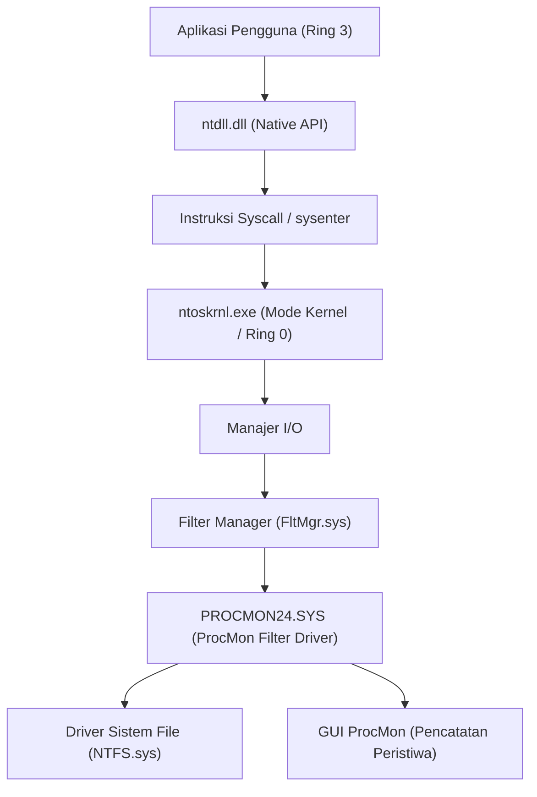
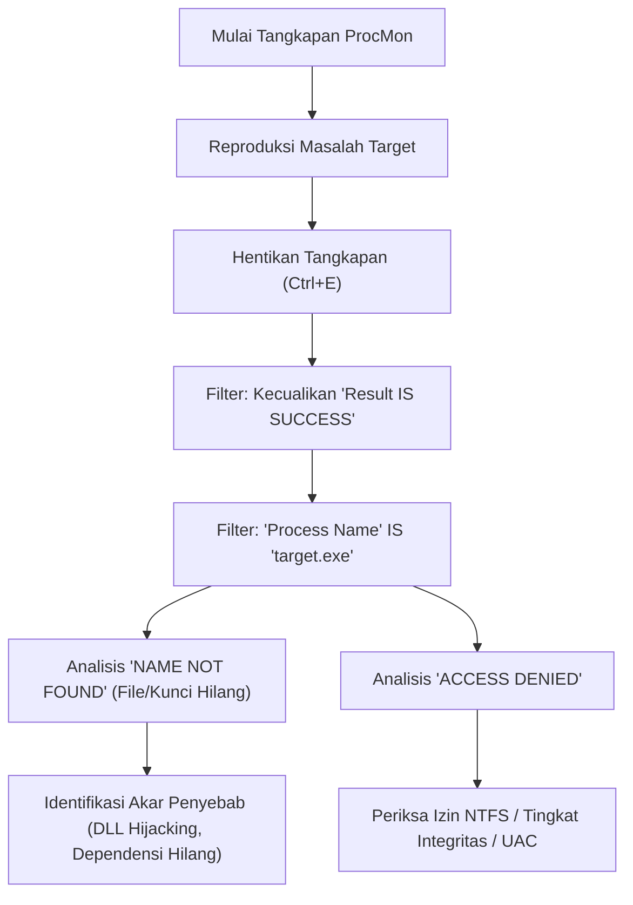
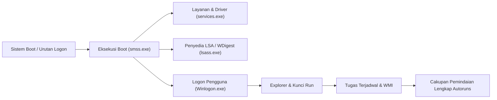

Di lingkungan Windows, ketika menghadapi masalah seperti sistem macet (crash), penurunan performa, infeksi malware, atau perilaku aplikasi yang tidak wajar, sering kali Task Manager atau Event Viewer bawaan saja tidak cukup untuk mengidentifikasi akar penyebab (Root Cause). Dalam pemecahan masalah tingkat lanjut seperti ini, profesional TI, perespons insiden, dan administrator sistem di seluruh dunia menggunakan rangkaian alat "**Windows Sysinternals**".

Artikel ini akan memberikan penjelasan mendalam tentang teknik pemecahan masalah tingkat lanjut yang menggali jauh ke dalam OS Windows (batas antara mode kernel dan mode pengguna, pemrosesan interupsi, ETW, driver sistem file/registri) dengan menggunakan alat utama Sysinternals yaitu **Process Explorer**, **Process Monitor (ProcMon)**, **Autoruns**, dan **TCPView**.

---

## 1. Arsitektur Alat Sysinternals dan Dasar-Dasar Kernel Windows

Untuk memahami mengapa rangkaian alat Sysinternals begitu kuat, Anda perlu memahami konsep dasar arsitektur Windows. Windows pada garis besarnya beroperasi dalam dua tingkat hak istimewa (privilege level): "Mode Pengguna (Ring 3)" dan "Mode Kernel (Ring 0)".

Alat-alat seperti Process Monitor dan Process Explorer tidak hanya memanggil API mode pengguna, tetapi juga memuat driver mode kernel khusus secara dinamis (misalnya: `PROCMON24.SYS`) untuk secara langsung mengaitkan (hook) atau melacak peristiwa yang terjadi jauh di dalam OS.

Diagram berikut menunjukkan arsitektur tentang bagaimana Process Monitor menangkap aktivitas sistem file.

Driver ProcMon didaftarkan sebagai driver minifilter, yang memantau semua IRP (I/O Request Packet) yang melewati manajer I/O dan driver NTFS. Ini memungkinkan alat ini untuk mengungkap semua akses yang coba disembunyikan oleh suatu aplikasi.

---

## 2. Analisis Mendalam Proses dan Analisis Malware dengan Process Explorer (ProcExp)

Process Explorer adalah "Task Manager super kuat". Tidak hanya penggunaan CPU/memori, alat ini juga memvisualisasikan pohon proses, handle, DLL yang dimuat, hingga tumpukan panggilan (call stack) thread.

### 2.1 Mengidentifikasi Kebocoran Handle dan Penguncian (Lock)
Sering terjadi masalah di mana sebuah aplikasi macet (crash) dengan file masih terbuka, dan file tersebut kemudian tidak dapat dihapus atau dipindahkan. Saat Anda menemukan pesan kesalahan "File is open in another program" (File sedang dibuka oleh program lain), Anda dapat menggunakan fitur **Find** (`Ctrl+F`) pada ProcExp untuk mencari nama file atau direktori tersebut.
Setelah Anda mengidentifikasi proses yang menahan handle tersebut (File, Section, Mutex, Event, dll.), Anda dapat mengeklik kanan pada proses tersebut dan menjalankan `Close Handle` secara paksa untuk membuka kunci file tanpa mematikan proses (namun, perlu diingat adanya risiko perilaku aplikasi menjadi tidak stabil).

### 2.2 Mengidentifikasi Hook Malware dan Verifikasi Tanda Tangan
Jika malware atau rootkit berbahaya bersembunyi di sistem Anda, mereka dapat menyuntikkan DLL mereka sendiri (DLL Injection) ke dalam proses yang sah (misalnya: `svchost.exe`, `explorer.exe`).

Di ProcExp, Anda dapat mengekspos proses mencurigakan dengan mengaktifkan pengaturan berikut:
1. **Options** -> **Verify Image Signatures**: Memverifikasi tanda tangan digital dari file yang dapat dieksekusi atau DLL. File yang tidak ditandatangani atau yang tanda tangannya rusak akan disorot.
2. **Options** -> **VirusTotal.com** -> **Check VirusTotal.com**: Mengirimkan nilai hash dari semua proses secara otomatis ke VirusTotal, dan menampilkan tingkat deteksi malware (misalnya: `5/72`) sebagai skor.

Jika menemukan `svchost.exe` yang mencurigakan, klik dua kali pada proses tersebut dan periksa tab **Strings** untuk melihat apakah ada perbedaan antara string dalam memori (Memory) dan pada disk (Image). Jika perbedaannya besar, kemungkinan besar file yang dapat dieksekusi telah dipadatkan (Packed) atau menjadi korban Process Hollowing.

### 2.3 Menganalisis Interupsi Perangkat Keras dan Lonjakan CPU 100%
Ketika seluruh sistem membeku selama beberapa detik atau audio terputus-putus (stuttering), jika Anda melihat ke Task Manager, "System Interrupts" mungkin sedang menguras CPU.

Dalam penjadwalan Windows, interupsi perangkat keras (ISR: Interrupt Service Routine) dan DPC (Deferred Procedure Call) dieksekusi dengan prioritas yang lebih tinggi (IRQL: Interrupt Request Level) daripada thread pengguna normal. Artinya, jika sebuah driver yang buruk memperpanjang DPC, CPU tidak dapat mengeksekusi tugas lain sama sekali pada core tersebut.

Jika penggunaan CPU dari `Interrupts` atau `DPCs` di bagian atas daftar proses ProcExp tinggi, gunakan alat ini bersama dengan Windows Performance Analyzer (WPA) untuk mengidentifikasi driver penyebabnya (`.sys`). Perhitungan waktu CPU dapat dirumuskan sebagai berikut:

$$ U_{cpu} = \left( 1 - \frac{T_{idle}}{T_{total}} \right) \times 100 $$
$$ T_{interrupt\_overhead} = \sum_{i=1}^{n} \left( T_{ISR(i)} + T_{DPC(i)} \right) $$

Jika $T_{interrupt\_overhead}$ mengambil sebagian besar waktu CPU, ini mungkin mengindikasikan bug pada driver NDIS (jaringan), driver Storport (penyimpanan), atau driver grafis.

---

## 3. Pelacakan Super Presisi dengan Process Monitor (ProcMon)

Process Monitor mencatat aktivitas dari sistem file, registri, jaringan, dan pembuatan proses/thread dalam hitungan mikrodetik. Alat ini adalah alat terkuat dalam pemecahan masalah, namun karena jutaan baris peristiwa dicatat hanya dalam beberapa menit dijalankan, tantangannya adalah "bagaimana cara menyaring gangguan (noise)".

### 3.1 Metodologi Pemfilteran Tingkat Lanjut

Alur kerja dasar untuk menguasai ProcMon ditunjukkan dalam diagram Mermaid berikut.

**Memanfaatkan Drop Filter:**
Jika Anda mengaktifkan `Filter` -> `Drop Filtered Events`, peristiwa yang disaring tidak akan lagi disimpan di memori atau disk. Ini mencegah ProcMon macet akibat kehabisan memori (OOM) bahkan selama pelacakan jangka panjang (contoh: memantau masalah intermiten).

### 3.2 Skenario Praktis: Men-debug Kegagalan Muat DLL (Side-Loading / Missing DLL)
Mari pertimbangkan contoh di mana aplikasi bisnis `AppServer.exe` macet secara diam-diam tanpa kotak dialog kesalahan segera setelah dimulai. Tidak ada informasi berguna di Event Viewer (Application Log).

1. Mulai ProcMon, lalu mulai menangkap.
2. Jalankan `AppServer.exe` dan buat aplikasi tersebut macet.
3. Hentikan tangkapan ProcMon.
4. Setel filter: `Process Name is AppServer.exe`.
5. Setel filter: `Result is not SUCCESS`.

Menganalisis log, Anda akan menemukan bahwa peristiwa berikut terjadi secara berurutan:

*   `CreateFile` | `C:\Program Files\MyApp\lib\CoreCrypto.dll` | `NAME NOT FOUND`
*   `CreateFile` | `C:\Windows\System32\CoreCrypto.dll` | `NAME NOT FOUND`
*   `CreateFile` | `C:\Windows\CoreCrypto.dll` | `NAME NOT FOUND`
*   `CreateFile` | `C:\Users\Kenji\AppData\Local\Microsoft\WindowsApps\CoreCrypto.dll` | `NAME NOT FOUND`

Ini adalah perilaku khas dari **kurangnya dependensi DLL** dan **urutan pencarian DLL (DLL Search Order)**. Aplikasi membutuhkan `CoreCrypto.dll`, namun karena tidak ada di mana pun dalam sistem, inisialisasinya gagal dan aplikasi keluar tanpa pengendali pengecualian (exception handler). Dengan menempatkan DLL yang hilang di direktori yang sesuai, masalah ini akan segera teratasi.

### 3.3 Pemecahan Masalah Kegagalan Boot Menggunakan Boot Logging
Jika Windows lambat melakukan booting, atau layar menjadi hitam segera setelah masuk (login), fitur **Enable Boot Logging** pada ProcMon akan sangat membantu. Saat Anda mengaktifkan ini dan memulai ulang, driver boot khusus ProcMon akan mencatat semua panggilan sistem (system call) dari tahap paling awal Windows (saat `smss.exe` dimuat) dan menyimpannya ke sebuah file. Saat masuk berikutnya, ketika Anda membuka ProcMon, log akan dikonversi, dan Anda dapat menganalisis secara detail layanan atau driver mana yang menyebabkan kemacetan (bottleneck) I/O selama proses booting.

Dengan merumuskan latensi dan throughput I/O, Anda dapat melihat seberapa besar lebar pita (bandwidth) penyimpanan yang digunakan oleh perangkat atau driver tertentu.
$$ \text{Throughput (MB/s)} = \frac{\sum_{i=1}^{N} \text{Size}(I/O_i)}{\Delta T_{capture}} \times \frac{1}{1024^2} $$
Anda dapat langsung menghitung ini di GUI menggunakan `Tools` -> `File Summary` di ProcMon.

---

## 4. Menganalisis Mekanisme Persistensi (Persistence) dan Penundaan Booting Menggunakan Autoruns

Tempat memulai otomatis (autostart) di Windows bukan hanya folder Startup atau kunci registri `Run`. Malware (terutama muatan serangan APT dan rootkit tingkat lanjut) menyiapkan diri mereka di tempat yang sulit diperhatikan oleh administrator sistem, memastikan eksekusinya tetap ada (Persistence) bahkan setelah memulai ulang.

Autoruns secara komprehensif memindai **semua entri mulai otomatis (ASE: Auto-Start Extensibility Points)** pada sistem.

### 4.1 Tab Penting untuk Diperiksa dan Fitur Lanjutan
*   **Logon**: Kunci Run/RunOnce standar dan folder startup.
*   **Scheduled Tasks**: Penjadwal Tugas (Task Scheduler) Windows. Malware sering kali membuat tugas palsu yang disamarkan sebagai "Adobe Update" atau "Google Update".
*   **Services / Drivers**: Driver yang berjalan dalam mode kernel. Anda dapat menonaktifkan file `.sys` mencurigakan yang menyebabkan lonjakan CPU 100% di sini.
*   **WMI**: Lokasi persistensi untuk fileless malware yang menggunakan filter peristiwa WMI (Windows Management Instrumentation) atau konsumen. Sering kali terlewatkan.
*   **AppInit_DLLs / KnownDLLs**: Daftar DLL yang disuntikkan secara paksa setiap kali aplikasi dimulai. Ini merupakan sarang untuk hook melalui DLL Injection.

**Praktik Pemecahan Masalah:**
Mirip dengan ProcExp, aktifkan `Verify Code Signatures` dan `Check VirusTotal.com` dari `Options` di Autoruns. Jika Anda menemukan entri yang ditandai merah muda (tidak ditandatangani atau penulis tidak diketahui) atau yang memiliki skor VirusTotal berwarna merah, Anda dapat dengan aman menonaktifkan awalannya dengan menghapus centang pada kotak, tanpa menghapusnya dari registri. Kemudian mulai ulang untuk menguji apakah masalah tersebut (perilaku malware atau layar biru/hitam) teratasi (A/B testing), yang mana merupakan metode analisis utama.

---

## 5. Melacak Koneksi Jaringan Tersembunyi Menggunakan TCPView

Meskipun Anda dapat memeriksa status komunikasi melalui tab Jaringan (Network) di Task Manager atau menggunakan perintah `netstat -ano`, pembaruannya lambat dan melakukan pemetaan nama proses ke PID secara manual sangat merepotkan.
TCPView memantau semua titik akhir TCP dan UDP secara real-time, lalu menampilkan daftar proses yang berkomunikasi dengan alamat jarak jauh dan port tertentu.

### 5.1 Mengidentifikasi Komunikasi C2 yang Berbahaya
Jika malware memasang backdoor (pintu belakang) dan mengirimkan Beacon (suar) ke server C2 (Command and Control) eksternal, Anda harus mencari karakteristik berikut menggunakan TCPView:

*   **Nama proses tidak wajar**: Misalnya `svchost.exe` beroperasi dengan hak pengguna alih-alih hak sistem, dan mempertahankan status koneksi `ESTABLISHED` dengan alamat IP asing yang tidak dikenal.
*   **Komunikasi dari proses yang tidak terduga**: Misalnya, Kalkulator (`calc.exe`) atau Notepad (`notepad.exe`) mengirimkan atau menerima jumlah paket yang besar melalui port 443 atau 80 (tanda khas Process Hollowing).

Jika Anda menemukan komunikasi mencurigakan, Anda dapat secara paksa memutuskan sesi TCP (mengeluarkan paket RST) dengan mengirimkan `Close Connection` secara langsung dari TCPView, atau menghentikan proses tersebut secara paksa dengan mengeklik `End Process`.

---

## 6. Kesimpulan: Esensi Analisis Menggunakan Sysinternals

Rangkaian alat Sysinternals adalah "Sinar-X" kuat yang dirancang untuk memvisualisasikan semua aktivitas yang terjadi di balik layar OS Windows. Untuk memanfaatkan alat-alat ini secara efektif, patuhi praktik terbaik berikut:

1.  **Konfigurasi Simbol (Symbols)**:
    Untuk menguraikan (resolve) tumpukan panggilan (call stack) secara akurat di ProcExp atau ProcMon, sangat penting untuk mengonfigurasi server simbol publik Microsoft. Setel variabel lingkungan berikut:
    `_NT_SYMBOL_PATH = srv*c:\symbols*https://msdl.microsoft.com/download/symbols`
2.  **Mengekstrak Sinyal dari Gangguan (Meningkatkan Signal-to-Noise Ratio)**:
    Log ProcMon dapat berisi jutaan baris. Secara proaktif saring "perilaku normal (SUCCESS)" atau "proses yang diketahui aman (System, explorer.exe, dll.)" menggunakan filter `Exclude`, lalu fokuslah pada inti masalah (ACCESS DENIED, NAME NOT FOUND).
3.  **Selalu Gunakan Versi Terbaru**:
    Alat Sysinternals sering diperbarui. Kunjungi langsung `https://live.sysinternals.com/` dari peramban Anda dan pastikan selalu menggunakan binari terbaru (atau versi baris perintah seperti `procdump`, `psexec`, dll.).

Dalam pemecahan masalah Windows tingkat lanjut, firasat atau tebakan (Guesswork) sama sekali tidak berguna. Dengan menggunakan alat Sysinternals untuk melakukan investigasi akar penyebab secara logis yang didasarkan pada fakta (proses, thread, handle, panggilan sistem, peristiwa registri), Anda pasti akan mampu mencapai akar penyebab dari masalah, betapapun rumitnya gangguan atau sesulit apa pun infeksi malware yang sedang ditangani.
