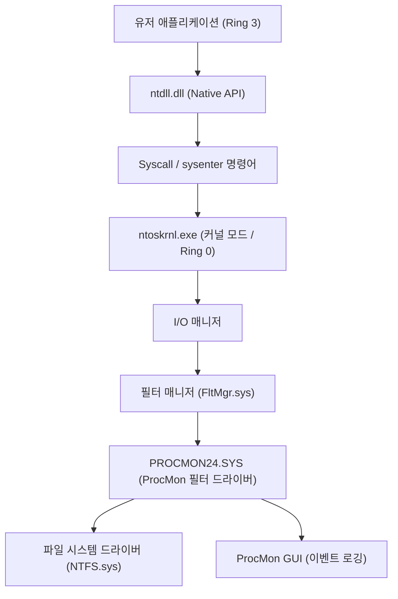
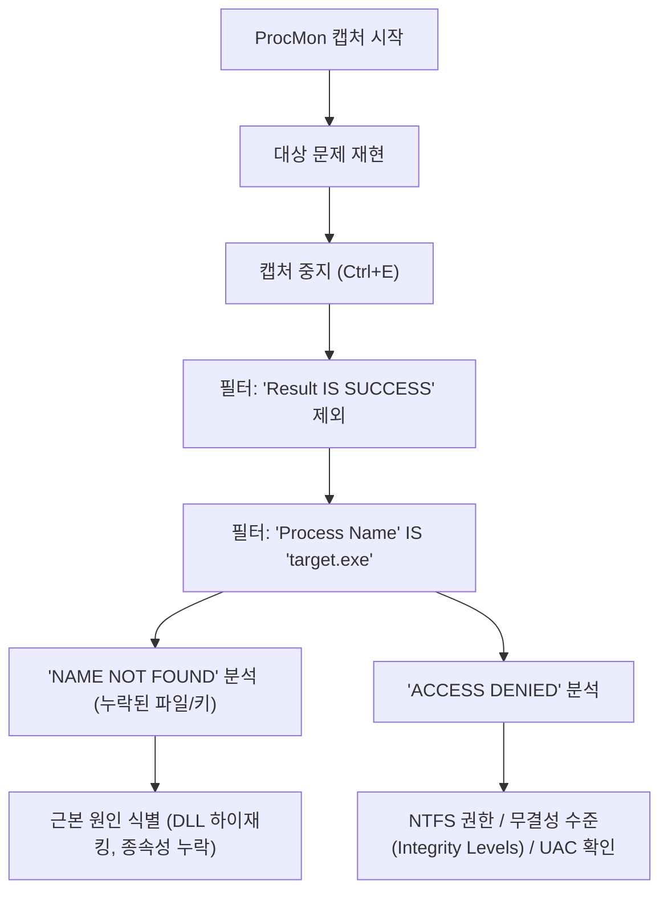
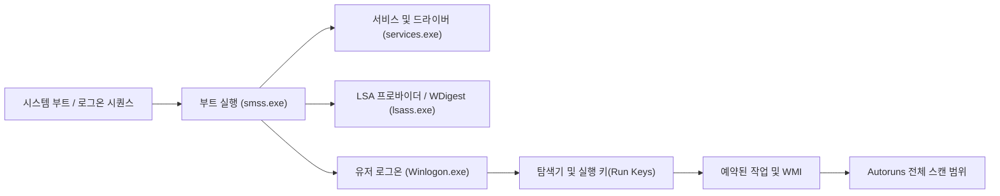

Windows 환경에서 시스템 크래시, 성능 저하, 악성코드 감염 또는 애플리케이션의 알 수 없는 동작과 같은 문제에 직면했을 때, 기본으로 탑재된 작업 관리자나 이벤트 뷰어만으로는 근본 원인(Root Cause)을 특정할 수 없는 경우가 많습니다. 이러한 고급 트러블슈팅에 있어 전 세계의 IT 전문가, 사고 대응 담당자(Incident Responder), 시스템 관리자들이 앞다투어 사용하는 것이 바로 "**Windows Sysinternals**" 도구 모음입니다.

본 문서에서는 Sysinternals의 주요 도구인 **Process Explorer**, **Process Monitor (ProcMon)**, **Autoruns**, **TCPView**를 활용하여 Windows OS의 심연(커널 모드와 유저 모드의 경계, 인터럽트 처리, ETW, 레지스트리/파일 시스템 드라이버)까지 파고드는 고급 트러블슈팅 기법을 철저하게 해설합니다.

---

## 1. Sysinternals 도구의 아키텍처와 Windows 커널의 기초

Sysinternals 도구 모음이 왜 이렇게 강력한지를 이해하기 위해서는 Windows 아키텍처의 기본 개념을 파악해 둘 필요가 있습니다. Windows는 크게 나누어 '유저 모드(Ring 3)'와 '커널 모드(Ring 0)'라는 2개의 권한 레벨에서 동작합니다.

Process Monitor나 Process Explorer 등의 도구는 단순히 유저 모드의 API를 호출하는 것뿐만 아니라, 전용 커널 모드 드라이버(예: `PROCMON24.SYS`)를 동적으로 로드하여 OS의 심층부에서 발생하는 이벤트를 직접 후킹(Hooking)하거나 추적(Trace)합니다.

아래 그림은 Process Monitor가 파일 시스템의 활동을 어떻게 캡처하는지 보여주는 아키텍처도입니다.

ProcMon의 드라이버는 미니 필터 드라이버로 등록되어 I/O 매니저와 NTFS 드라이버 사이를 통과하는 모든 IRP(I/O Request Packet)를 모니터링합니다. 이를 통해 애플리케이션이 은폐하려는 접근까지도 모두 밝혀낼 수 있습니다.

---

## 2. Process Explorer (ProcExp)를 통한 프로세스 심층 분석 및 악성코드 분석

Process Explorer는 "초강력 작업 관리자"입니다. 단순한 CPU/메모리 사용률뿐만 아니라 프로세스 트리, 핸들, 로드된 DLL, 스레드의 콜 스택까지 시각화합니다.

### 2.1 핸들 누수(Handle Leak)와 잠금(Lock) 확인
애플리케이션이 파일을 열어둔 채 크래시되고, 이후 해당 파일을 삭제하거나 이동할 수 없게 되는 문제가 빈번하게 발생합니다. "파일이 다른 프로그램에서 열려 있습니다"라는 오류가 발생한 경우, ProcExp의 **Find** 기능(`Ctrl+F`)을 사용하여 파일명이나 디렉터리명을 검색합니다.
해당 핸들(File, Section, Mutex, Event 등)을 보유한 프로세스가 특정되면, 대상 프로세스를 마우스 오른쪽 버튼으로 클릭하고 `Close Handle`을 강제 실행하여 프로세스를 종료하지 않고 파일 잠금을 해제할 수 있습니다(단, 앱 동작이 불안정해질 위험에 주의해야 합니다).

### 2.2 악성코드 후킹 특정 및 서명 검증
악성코드나 악의적인 루트킷(Rootkit)이 시스템에 숨어 있는 경우, 정상적인 프로세스(예: `svchost.exe`, `explorer.exe`)에 자신의 DLL을 인젝션(DLL Injection)하는 경우가 있습니다.

ProcExp에서는 다음 설정을 활성화하여 악성 프로세스를 부각시킬 수 있습니다.
1. **Options** -> **Verify Image Signatures**: 실행 파일이나 DLL의 디지털 서명을 검증합니다. 서명되지 않았거나 서명이 손상된 파일이 강조 표시됩니다.
2. **Options** -> **VirusTotal.com** -> **Check VirusTotal.com**: 모든 프로세스의 해시값을 VirusTotal에 자동 전송하여, 악성코드 탐지율(예: `5/72`)을 점수로 표시합니다.

의심스러운 `svchost.exe`가 발견된 경우, 프로세스를 더블 클릭하여 **Strings** 탭을 확인하고, 메모리상(Memory)과 디스크상(Image)의 문자열에 차이가 없는지 조사합니다. 여기서 차이가 크다면, 실행 파일이 패킹(Packed)되어 있거나 프로세스 할로잉(Process Hollowing)의 피해를 입었을 가능성이 매우 높습니다.

### 2.3 하드웨어 인터럽트 및 100% CPU 스파이크 분석
시스템 전체가 수 초간 프리징(Freeze)되거나 오디오가 끊기는(Stutter) 현상이 발생했을 때, 작업 관리자를 보면 'System Interrupts'가 CPU를 잠식하고 있는 경우가 있습니다.

Windows의 스케줄링에서 하드웨어 인터럽트(ISR: Interrupt Service Routine)와 DPC(Deferred Procedure Call)는 일반 유저 스레드보다 높은 우선순위(IRQL: Interrupt Request Level)로 실행됩니다. 즉, 불량 드라이버가 DPC를 길게 지연시키면 CPU는 해당 코어에서 다른 작업을 전혀 수행할 수 없게 됩니다.

ProcExp의 프로세스 목록 최상단에 있는 `Interrupts`나 `DPCs`의 CPU 사용률이 높은 경우, Windows Performance Analyzer (WPA)와 병용하여 원인이 되는 드라이버(`.sys`)를 특정합니다. CPU 시간의 계산은 다음과 같이 수식화할 수 있습니다.

$$ U_{cpu} = \left( 1 - \frac{T_{idle}}{T_{total}} \right) \times 100 $$
$$ T_{interrupt\_overhead} = \sum_{i=1}^{n} \left( T_{ISR(i)} + T_{DPC(i)} \right) $$

만약 $T_{interrupt\_overhead}$가 CPU 시간의 대부분을 차지한다면, NDIS 드라이버(네트워크)나 Storport 드라이버(스토리지), 그래픽 드라이버의 버그를 의심해 볼 수 있습니다.

---

## 3. Process Monitor (ProcMon)를 활용한 초정밀 추적

Process Monitor는 파일 시스템, 레지스트리, 네트워크, 프로세스/스레드 생성 활동을 마이크로초 단위로 기록합니다. 트러블슈팅에 있어 최강의 도구이지만, 몇 분만 실행해도 수백만 줄의 이벤트가 기록되기 때문에 '어떻게 노이즈를 필터링할 것인가'가 관건이 됩니다.

### 3.1 고급 필터링 방법론

ProcMon을 자유자재로 다루기 위한 기본 워크플로우를 아래 Mermaid 그림에 나타냈습니다.

**드롭 필터(Drop Filter)의 활용:**
`Filter` -> `Drop Filtered Events`를 활성화하면 필터링된 이벤트가 메모리나 디스크에 저장되지 않습니다. 이를 통해 장시간 추적(예: 간헐적으로 발생하는 문제의 모니터링)을 수행하더라도 ProcMon이 메모리 부족(OOM)으로 크래시되는 것을 방지할 수 있습니다.

### 3.2 실전 시나리오: DLL 로드 실패(Side-Loading / Missing DLL) 디버깅
어떤 업무용 애플리케이션 `AppServer.exe`가 실행 직후 아무런 오류 대화상자도 띄우지 않고 비정상 종료(사일런트 크래시)되는 사례를 가정해 보겠습니다. 이벤트 뷰어(Application 로그)에도 유용한 정보가 없습니다.

1. ProcMon을 실행하고 캡처를 시작합니다.
2. `AppServer.exe`를 실행하여 크래시를 유도합니다.
3. ProcMon의 캡처를 중지합니다.
4. 필터 설정: `Process Name is AppServer.exe`.
5. 필터 설정: `Result is not SUCCESS`.

로그를 분석하면 다음과 같은 이벤트가 연속해서 발생하고 있는 것을 찾을 수 있을 것입니다.

*   `CreateFile` | `C:\Program Files\MyApp\lib\CoreCrypto.dll` | `NAME NOT FOUND`
*   `CreateFile` | `C:\Windows\System32\CoreCrypto.dll` | `NAME NOT FOUND`
*   `CreateFile` | `C:\Windows\CoreCrypto.dll` | `NAME NOT FOUND`
*   `CreateFile` | `C:\Users\Kenji\AppData\Local\Microsoft\WindowsApps\CoreCrypto.dll` | `NAME NOT FOUND`

이는 전형적인 **DLL 종속성 누락** 및 **DLL 검색 순서(DLL Search Order)** 동작입니다. 애플리케이션은 `CoreCrypto.dll`을 필요로 하지만 시스템 상의 어디에도 존재하지 않기 때문에 초기화에 실패하고 예외 핸들러 없이 종료된 것입니다. 누락된 DLL을 적절한 디렉터리에 배치함으로써 이 문제는 즉시 해결됩니다.

### 3.3 Boot Logging을 통한 부팅 장애 트러블슈팅
Windows 부팅이 느리거나 로그인 직후 검은 화면(Black Screen)이 되는 경우, ProcMon의 **Enable Boot Logging** 기능이 유용합니다. 이를 활성화하고 재부팅하면 ProcMon의 전용 부트 드라이버가 Windows의 초기 단계(`smss.exe`가 로드되는 시점)부터 모든 시스템 호출을 기록하여 파일로 저장합니다. 다음 로그인 시 ProcMon을 열면 로그가 변환되어 부팅 프로세스 중 어떤 드라이버나 서비스가 I/O 병목을 일으키고 있는지 상세히 분석할 수 있습니다.

I/O 레이턴시나 처리량(Throughput)을 수식화하면 특정 장치나 드라이버가 스토리지 대역폭을 얼마나 점유하고 있는지 알 수 있습니다.
$$ \text{Throughput (MB/s)} = \frac{\sum_{i=1}^{N} \text{Size}(I/O_i)}{\Delta T_{capture}} \times \frac{1}{1024^2} $$
ProcMon의 `Tools` -> `File Summary`를 사용하면 이러한 집계를 GUI에서 순식간에 수행할 수 있습니다.

---

## 4. Autoruns를 통한 지속성(Persistence) 메커니즘과 부팅 지연 분석

Windows의 자동 실행 위치는 단순한 시작 프로그램(Startup Folder)이나 `Run` 레지스트리 키에 국한되지 않습니다. 악성코드(특히 APT 공격의 페이로드나 고급 루트킷)는 시스템 관리자의 눈에 띄기 어려운 곳에 자신을 숨겨 재부팅 후에도 실행(Persistence)되도록 설정합니다.

Autoruns는 시스템 상의 **모든 자동 실행 항목(ASE: Auto-Start Extensibility Points)**을 망라하여 스캔합니다.

### 4.1 확인해야 할 중요한 탭과 고급 기능
*   **Logon**: 표준 Run/RunOnce 키, 시작 프로그램 폴더.
*   **Scheduled Tasks**: Windows 작업 스케줄러. 악성코드는 종종 "Adobe Update"나 "Google Update" 등으로 위장한 가짜 작업을 생성합니다.
*   **Services / Drivers**: 커널 모드에서 실행되는 드라이버. 앞서 언급한 100% CPU 스파이크의 원인이 되는 의심스러운 `.sys` 파일을 여기서 비활성화할 수 있습니다.
*   **WMI**: WMI (Windows Management Instrumentation)의 이벤트 필터나 컨슈머를 이용한 파일리스 악성코드(Fileless Malware)의 지속성 확보 위치. 매우 간과되기 쉽습니다.
*   **AppInit_DLLs / KnownDLLs**: 애플리케이션이 실행될 때마다 강제로 인젝트되는 DLL 목록. DLL 인젝션에 의한 후킹의 온상이 됩니다.

**트러블슈팅 실전:**
Autoruns에서도 ProcExp와 마찬가지로 `Options`에서 `Verify Code Signatures`와 `Check VirusTotal.com`을 활성화합니다. 목록 중에서 분홍색(서명 없음 또는 작성자 알 수 없음)으로 표시되는 항목이나 VirusTotal 점수가 붉은색인 항목을 발견하면, 체크박스를 해제하는 것만으로 레지스트리를 삭제하지 않고 안전하게 해당 시작을 비활성화할 수 있습니다. 이렇게 한 뒤 재부팅하여 문제(악성코드의 동작이나 블루/블랙 스크린)가 해결되는지 테스트하는(A/B 테스트) 것이 왕도라고 할 수 있는 분석 기법입니다.

---

## 5. TCPView를 통한 숨겨진 네트워크 연결 추적

작업 관리자의 네트워크 탭이나 `netstat -ano` 명령으로도 통신 상태를 확인할 수 있지만, 업데이트가 느리거나 프로세스명과 PID 매핑을 수동으로 수행하는 것은 번거롭습니다.
TCPView는 모든 TCP 및 UDP 엔드포인트를 실시간으로 모니터링하여 어떤 프로세스가 어떤 원격 주소·포트와 통신하고 있는지 목록으로 표시합니다.

### 5.1 악의적인 C2 통신 특정
악성코드가 백도어를 설치하고 외부의 C2(Command and Control) 서버로 비콘(Beacon)을 전송하는 경우, TCPView에서 다음과 같은 특징을 찾습니다.

*   **프로세스명이 부자연스러움**: `svchost.exe`임에도 시스템 권한이 아닌 유저 권한으로 동작하고 있으며, 알 수 없는 해외 IP 주소와 `ESTABLISHED` 상태의 통신을 유지하고 있다.
*   **일반적으로 통신하지 않는 프로세스의 통신**: 예를 들어 계산기(`calc.exe`)나 메모장(`notepad.exe`)이 포트 443이나 80으로 대량의 패킷을 송수신하고 있다(프로세스 할로잉의 전형적인 징후).

의심스러운 통신을 발견한 경우 TCPView에서 직접 `Close Connection`을 보내 TCP 세션을 강제 절단(RST 패킷 발행)하거나, 해당 프로세스를 `End Process`로 강제 종료시킬 수 있습니다.

---

## 6. 요약: Sysinternals를 활용한 분석의 에센스

Sysinternals 도구 모음은 Windows OS가 이면에서 수행하는 모든 동작을 시각화하기 위한 강력한 '엑스레이(X-Ray)'입니다. 이러한 도구를 효과적으로 활용하려면 다음 모범 사례(Best Practice)를 준수하십시오.

1.  **심볼(Symbols) 구성**:
    ProcExp나 ProcMon에서 콜 스택을 정확하게 해석하려면 Microsoft의 퍼블릭 심볼 서버를 설정하는 필수입니다. 환경 변수에 다음을 설정하십시오.
    `_NT_SYMBOL_PATH = srv*c:\symbols*https://msdl.microsoft.com/download/symbols`
2.  **노이즈에서 신호 추출(Signal-to-Noise Ratio 향상)**:
    ProcMon의 로그는 수백만 줄에 달합니다. "정상적인 동작(SUCCESS)"이나 "안전하다고 알려진 프로세스(System, explorer.exe 등)"를 적극적으로 `Exclude` 필터로 제외하고 문제의 핵심(ACCESS DENIED, NAME NOT FOUND)에 초점을 맞추십시오.
3.  **항상 최신 버전 사용**:
    Sysinternals 도구는 자주 업데이트됩니다. 브라우저에서 직접 `https://live.sysinternals.com/`에 접속하여 항상 최신 바이너리(또는 명령줄 버전인 `procdump`, `psexec` 등)를 사용하십시오.

고급 Windows 트러블슈팅에 있어 직감이나 추측(Guesswork)은 무의미합니다. Sysinternals 도구를 사용하여 팩트(프로세스, 스레드, 핸들, 시스템 호출, 레지스트리 이벤트)에 기반한 논리적인 원인 규명을 수행함으로써 아무리 복잡한 장애나 난해한 악성코드 감염이라도 반드시 근본 원인에 도달할 수 있을 것입니다.
