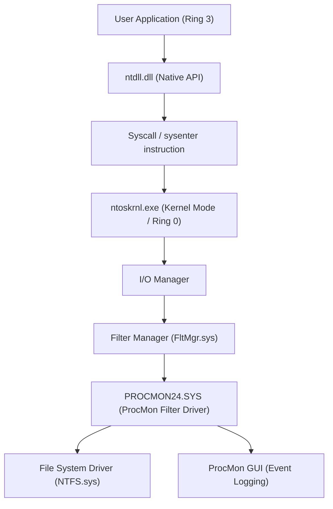
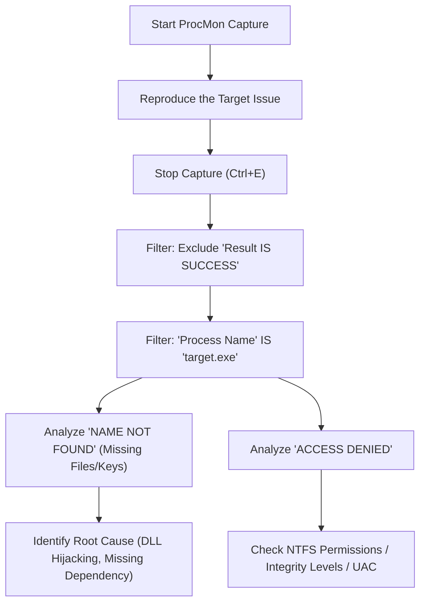
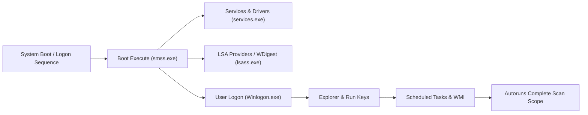

Windows環境において、システムクラッシュ、パフォーマンスの低下、マルウェアの感染、あるいはアプリケーションの不可解な挙動といった問題に直面したとき、標準搭載のタスクマネージャーやイベントビューアーだけでは根本原因（Root Cause）を特定できないことが多々あります。このような高度なトラブルシューティングにおいて、世界中のITプロフェッショナル、インシデントレスポンダー、システム管理者がこぞって利用するのが「**Windows Sysinternals**」ツール群です。

本記事では、Sysinternalsの主要ツールである **Process Explorer**, **Process Monitor (ProcMon)**, **Autoruns**, **TCPView** を駆使し、Windows OSの深淵（カーネルモードとユーザーモードの境界、割り込み処理、ETW、レジストリ/ファイルシステムドライバ）にまで踏み込んだ高度なトラブルシューティング手法を徹底的に解説します。

---

## 1. SysinternalsツールのアーキテクチャとWindowsカーネルの基礎

Sysinternalsツール群がなぜこれほど強力なのかを理解するためには、Windowsアーキテクチャの基本概念を把握しておく必要があります。Windowsは大きく分けて「ユーザーモード（Ring 3）」と「カーネルモード（Ring 0）」の2つの権限レベルで動作します。

Process MonitorやProcess Explorerなどのツールは、単にユーザーモードのAPIを呼び出しているだけでなく、専用のカーネルモードドライバ（例: `PROCMON24.SYS`）を動的にロードし、OSの深層で発生しているイベントを直接フックまたはトレースします。

以下の図は、Process Monitorがどのようにファイルシステムのアクティビティをキャプチャするかを示すアーキテクチャ図です。

ProcMonのドライバはミニフィルタードライバとして登録され、I/OマネージャーとNTFSドライバの間を通過するすべてのIRP（I/O Request Packet）を監視します。これにより、アプリケーションが隠蔽しようとするアクセスもすべて暴き出すことができます。

---

## 2. Process Explorer (ProcExp) によるプロセスの深掘りとマルウェア解析

Process Explorerは「超強力なタスクマネージャー」です。単なるCPU/メモリの使用率だけでなく、プロセスツリー、ハンドル、ロードされているDLL、スレッドのコールスタックまで可視化します。

### 2.1 ハンドルリークとロックの特定
アプリケーションがファイルを開いたままクラッシュし、その後そのファイルを削除・移動できなくなる問題は頻発します。「ファイルは別のプログラムによって開かれています」というエラーが出た場合、ProcExpの **Find** 機能（`Ctrl+F`）を使ってファイル名やディレクトリ名を検索します。
該当するハンドル（File, Section, Mutex, Eventなど）を保持しているプロセスが特定できたら、対象プロセスを右クリックして `Close Handle` を強制実行することで、プロセスをキルせずにファイルのロックを解除できます（ただし、アプリの動作が不安定になるリスクには注意が必要です）。

### 2.2 マルウェア・フックの特定と署名検証
マルウェアや不正なルートキットがシステムに潜んでいる場合、正規のプロセス（例: `svchost.exe`, `explorer.exe`）に自身のDLLをインジェクション（DLL Injection）することがあります。

ProcExpでは、以下の設定を有効化することで不正なプロセスを浮き彫りにできます。
1. **Options** -> **Verify Image Signatures**: 実行ファイルやDLLのデジタル署名を検証します。署名されていない、あるいは署名が壊れているファイルがハイライトされます。
2. **Options** -> **VirusTotal.com** -> **Check VirusTotal.com**: すべてのプロセスのハッシュ値をVirusTotalに自動送信し、マルウェアの検出率（例: `5/72`）をスコアとして表示します。

不審な `svchost.exe` が見つかった場合、プロセスをダブルクリックして **Strings** タブを確認し、メモリ上（Memory）とディスク上（Image）の文字列に差異がないか調べます。ここで差異が大きい場合、実行ファイルがパックされている（Packed）か、プロセスホローイング（Process Hollowing）の被害に遭っている可能性が極めて高くなります。

### 2.3 ハードウェア割り込みと100% CPUスパイクの解析
システム全体が数秒間フリーズしたり、音声が途切れる（スタッター）現象が発生した場合、タスクマネージャーを見ると「System Interrupts」がCPUを食いつぶしていることがあります。

Windowsのスケジューリングにおいて、ハードウェア割り込み（ISR: Interrupt Service Routine）とDPC（Deferred Procedure Call）は、通常のユーザースレッドよりも高い優先度（IRQL: Interrupt Request Level）で実行されます。つまり、不良なドライバがDPCを長引かせると、CPUはそのコアで他のタスクを一切実行できなくなります。

ProcExpのプロセスリスト最上部にある `Interrupts` や `DPCs` のCPU使用率が高い場合、Windows Performance Analyzer (WPA) と併用して原因のドライバ（ `.sys` ）を特定します。CPU時間の計算は以下のように定式化できます。

$$ U_{cpu} = \left( 1 - \frac{T_{idle}}{T_{total}} \right) \times 100 $$
$$ T_{interrupt\_overhead} = \sum_{i=1}^{n} \left( T_{ISR(i)} + T_{DPC(i)} \right) $$

もし $T_{interrupt\_overhead}$ がCPU時間の大部分を占める場合、NDISドライバ（ネットワーク）やStorportドライバ（ストレージ）、グラフィックスドライバのバグが疑われます。

---

## 3. Process Monitor (ProcMon) による超精密トレース

Process Monitorは、ファイルシステム、レジストリ、ネットワーク、プロセス/スレッド生成のアクティビティをマイクロ秒単位で記録します。トラブルシューティングにおいて最強のツールですが、数分間実行するだけで数百万行のイベントが記録されるため、「いかにノイズをフィルタリングするか」が勝負となります。

### 3.1 高度なフィルタリングのメソドロジー

ProcMonを使いこなすための基本ワークフローを以下のMermaid図に示します。

**ドロップフィルター（Drop Filter）の活用:**
`Filter` -> `Drop Filtered Events` を有効にすると、フィルタリングされたイベントがメモリやディスクに保存されなくなります。これにより長時間のトレース（例：断続的に発生する問題の監視）を行っても、ProcMonがメモリ不足（OOM）でクラッシュするのを防げます。

### 3.2 実践シナリオ：DLLロード失敗（Side-Loading / Missing DLL）のデバッグ
ある業務アプリケーション `AppServer.exe` が、起動直後に何のエラーダイアログも出さずに異常終了（サイレントクラッシュ）する事例を考えます。イベントビューアー（Applicationログ）にも有益な情報はありません。

1. ProcMonを起動し、キャプチャを開始。
2. `AppServer.exe` を起動し、クラッシュさせる。
3. ProcMonのキャプチャを停止。
4. フィルターを設定: `Process Name is AppServer.exe`。
5. フィルターを設定: `Result is not SUCCESS`。

ログを解析すると、以下のようなイベントが連続して発生しているのが見つかるはずです。

*   `CreateFile` | `C:\Program Files\MyApp\lib\CoreCrypto.dll` | `NAME NOT FOUND`
*   `CreateFile` | `C:\Windows\System32\CoreCrypto.dll` | `NAME NOT FOUND`
*   `CreateFile` | `C:\Windows\CoreCrypto.dll` | `NAME NOT FOUND`
*   `CreateFile` | `C:\Users\Kenji\AppData\Local\Microsoft\WindowsApps\CoreCrypto.dll` | `NAME NOT FOUND`

これは典型的な **DLLの依存関係欠如** および **DLL検索オーダー（DLL Search Order）** の挙動です。アプリケーションは `CoreCrypto.dll` を必要としていますが、システム上のどこにも存在しないため初期化に失敗し、例外ハンドラを持たないまま終了しています。不足しているDLLを適切なディレクトリに配置することで、この問題は即座に解決します。

### 3.3 Boot Logging による起動障害のトラブルシューティング
Windowsの起動が遅い、あるいはログイン直後にブラックスクリーンになる場合、ProcMonの **Enable Boot Logging** 機能が役立ちます。これを有効にして再起動すると、ProcMonの専用ブートドライバがWindowsの最初期（`smss.exe` がロードされるタイミング）から全システムコールを記録しファイルに保存します。次回ログイン時にProcMonを開くとログが変換され、起動プロセス中のどのドライバやサービスがI/Oボトルネックを引き起こしているかを詳細に分析できます。

I/Oのレイテンシやスループットを数式化すると、特定のデバイスやドライバがストレージ帯域をどれだけ占有しているかがわかります。
$$ \text{Throughput (MB/s)} = \frac{\sum_{i=1}^{N} \text{Size}(I/O_i)}{\Delta T_{capture}} \times \frac{1}{1024^2} $$
ProcMonの `Tools` -> `File Summary` を使えば、この集計をGUI上で一瞬で行うことができます。

---

## 4. Autoruns による永続化メカニズム（Persistence）とブート遅延の解析

Windowsの自動起動箇所は、単にスタートアップフォルダ（Startup Folder）や `Run` レジストリキーだけではありません。マルウェア（特にAPT攻撃のペイロードや高度なルートキット）は、システム管理者の目につきにくい場所に自身を潜ませて再起動後も実行（Persistence）されるように設定します。

Autorunsは、システム上の**あらゆる自動起動エントリ（ASE: Auto-Start Extensibility Points）**を網羅的にスキャンします。

### 4.1 確認すべき重要なタブと高度な機能
*   **Logon**: 標準的な Run/RunOnce キー、スタートアップフォルダ。
*   **Scheduled Tasks**: Windowsタスクスケジューラ。マルウェアはしばしば「Adobe Update」や「Google Update」などを装った偽装タスクを作成します。
*   **Services / Drivers**: カーネルモードで起動するドライバ。前述の 100% CPU スパイクの原因となっている不審な `.sys` ファイルをここで無効化できます。
*   **WMI**: WMI (Windows Management Instrumentation) のイベントフィルターやコンシューマーを利用したファイルレスマルウェア（Fileless Malware）の永続化場所。非常に見落とされがちです。
*   **AppInit_DLLs / KnownDLLs**: アプリケーションが起動するたびに強制的にインジェクトされるDLLリスト。DLLインジェクションによるフックの温床になります。

**トラブルシューティングの実践:**
AutorunsでもProcExpと同様に、`Options` から `Verify Code Signatures` と `Check VirusTotal.com` を有効にします。一覧の中でピンク色（署名なし、または作成者不明）になっているエントリや、VirusTotalのスコアが赤いエントリを見つけたら、チェックボックスを外すだけで、レジストリを削除することなく安全にその起動を無効化できます。これで再起動し、問題（マルウェアの挙動やブルー/ブラックスクリーン）が解決するかどうかをテストする（A/Bテスト）のが王道の解析手法です。

---

## 5. TCPView による隠れたネットワーク接続の追跡

タスクマネージャーのネットワークタブや `netstat -ano` コマンドでも通信状況は確認できますが、更新が遅かったり、プロセス名とPIDのマッピングを手動で行うのは手間です。
TCPViewは、すべてのTCPおよびUDPエンドポイントをリアルタイムで監視し、どのプロセスがどのリモートアドレス・ポートと通信しているかを一覧表示します。

### 5.1 不正なC2通信の特定
マルウェアがバックドアを設置し、外部のC2（Command and Control）サーバーにBeacon（ビーコン）を送信している場合、TCPViewで以下のような特徴を探します。

*   **プロセス名が不自然**: `svchost.exe` なのに、システム権限ではなくユーザー権限で動作しており、見知らぬ海外のIPアドレスに対して `ESTABLISHED` 状態の通信を維持している。
*   **通常通信しないプロセスの通信**: 例えば、電卓（`calc.exe`）やメモ帳（`notepad.exe`）がポート 443 や 80 で大量のパケットを送受信している（プロセスホローイングの典型的な兆候）。

怪しい通信を見つけた場合、TCPViewから直接 `Close Connection` を送ってTCPセッションを強制切断（RSTパケットの発行）したり、該当プロセスを `End Process` で強制終了させることができます。

---

## 6. まとめ：Sysinternalsによる解析のエッセンス

Sysinternalsツール群は、Windows OSが裏側で行っているすべての挙動を可視化するための強力な「レントゲン」です。これらのツールを効果的に活用するためには、以下のベストプラクティスを遵守してください。

1.  **シンボル（Symbols）の構成**:
    ProcExpやProcMonでコールスタックを正確に解決するためには、Microsoftのパブリックシンボルサーバーを設定することが必須です。環境変数に以下を設定してください。
    `_NT_SYMBOL_PATH = srv*c:\symbols*https://msdl.microsoft.com/download/symbols`
2.  **ノイズからの信号抽出（Signal-to-Noise Ratioの向上）**:
    ProcMonのログは数百万行に及びます。「正常な動作（SUCCESS）」や「安全とわかっているプロセス（System, explorer.exeなど）」を積極的に `Exclude` フィルターで除外し、問題の核心（ACCESS DENIED, NAME NOT FOUND）に焦点を当ててください。
3.  **常に最新版を利用する**:
    Sysinternalsツールは頻繁にアップデートされます。ブラウザから直接 `https://live.sysinternals.com/` にアクセスし、常に最新のバイナリ（またはコマンドライン版の `procdump`, `psexec` など）を使用してください。

高度なWindowsトラブルシューティングにおいて、直感や当てずっぽう（Guesswork）は無意味です。Sysinternalsツールを使ってファクト（プロセス、スレッド、ハンドル、システムコール、レジストリイベント）に基づく論理的な原因究明を行うことで、どんなに複雑な障害や難解なマルウェア感染であっても、必ず根本原因にたどり着くことができるでしょう。
