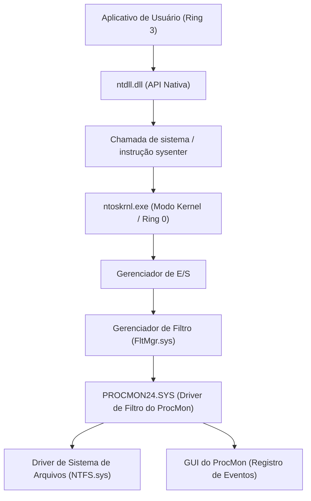
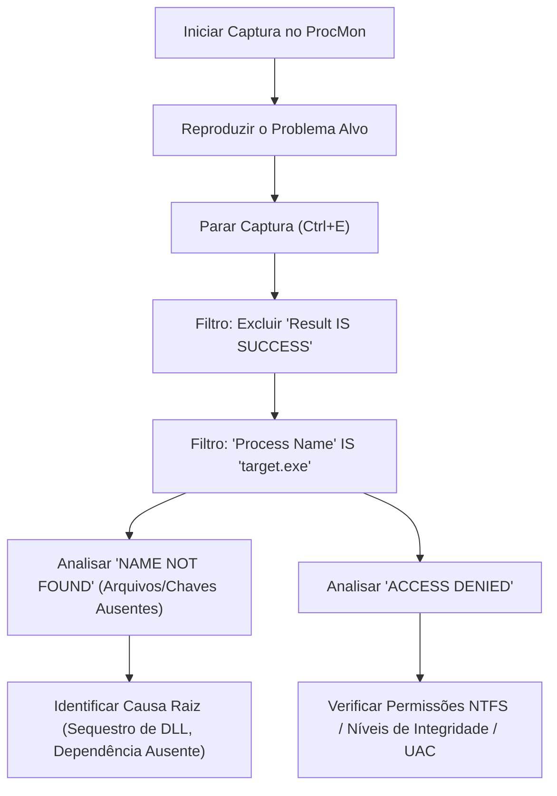
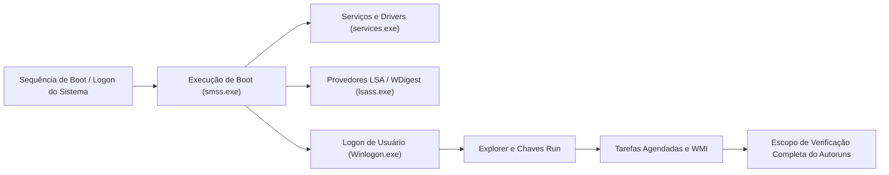

Em ambientes Windows, ao enfrentar problemas como falhas no sistema, degradação de desempenho, infecções por malware ou comportamento inexplicável de aplicativos, muitas vezes é impossível identificar a causa raiz (Root Cause) apenas com o Gerenciador de Tarefas e o Visualizador de Eventos padrão. Para esse tipo de solução de problemas avançada, profissionais de TI, respondentes de incidentes e administradores de sistema em todo o mundo usam o conjunto de ferramentas "**Windows Sysinternals**".

Neste artigo, usaremos as principais ferramentas do Sysinternals, **Process Explorer**, **Process Monitor (ProcMon)**, **Autoruns** e **TCPView**, para explicar detalhadamente métodos avançados de solução de problemas que se aprofundam no abismo do sistema operacional Windows (o limite entre o modo kernel e o modo de usuário, processamento de interrupções, ETW, drivers de sistema de arquivos/registro).

---

## 1. Arquitetura das Ferramentas do Sysinternals e Fundamentos do Kernel do Windows

Para entender por que as ferramentas do Sysinternals são tão poderosas, é necessário compreender os conceitos básicos da arquitetura do Windows. O Windows opera em dois níveis de privilégio principais: "Modo de Usuário (Ring 3)" e "Modo Kernel (Ring 0)".

Ferramentas como Process Monitor e Process Explorer não chamam apenas as APIs do modo de usuário, mas também carregam dinamicamente drivers de modo kernel dedicados (por exemplo, `PROCMON24.SYS`) para capturar ou rastrear diretamente os eventos que ocorrem nas profundezas do sistema operacional.

O diagrama a seguir mostra como o Process Monitor captura a atividade do sistema de arquivos.

O driver do ProcMon é registrado como um driver de minifiltro e monitora todos os IRPs (I/O Request Packets) que passam entre o Gerenciador de E/S e o driver NTFS. Isso permite que ele revele até mesmo os acessos que os aplicativos tentam ocultar.

---

## 2. Análise Profunda de Processos e Análise de Malware com o Process Explorer (ProcExp)

O Process Explorer é um "Gerenciador de Tarefas superpoderoso". Ele não apenas visualiza o uso de CPU/memória, mas também a árvore de processos, identificadores (handles), DLLs carregadas e a pilha de chamadas (call stack) de threads.

### 2.1 Identificação de Vazamentos de Handles e Bloqueios
Problemas onde um aplicativo falha mantendo um arquivo aberto e o arquivo não pode ser excluído ou movido posteriormente são frequentes. Quando ocorrer o erro "O arquivo está aberto em outro programa", use o recurso **Find** (`Ctrl+F`) no ProcExp para procurar o nome do arquivo ou diretório.
Depois de identificar o processo que mantém o handle (File, Section, Mutex, Event, etc.) relevante, você pode clicar com o botão direito no processo alvo e executar `Close Handle` para forçar o desbloqueio do arquivo sem matar o processo (no entanto, esteja ciente do risco do comportamento do aplicativo se tornar instável).

### 2.2 Identificação de Hooks de Malware e Verificação de Assinaturas
Quando malwares ou rootkits maliciosos se escondem no sistema, eles podem injetar suas próprias DLLs (DLL Injection) em processos legítimos (por exemplo, `svchost.exe`, `explorer.exe`).

No ProcExp, você pode destacar processos suspeitos ativando as seguintes configurações:
1. **Options** -> **Verify Image Signatures**: Verifica as assinaturas digitais de arquivos executáveis e DLLs. Arquivos não assinados ou com assinaturas corrompidas serão destacados.
2. **Options** -> **VirusTotal.com** -> **Check VirusTotal.com**: Envia automaticamente as hashes de todos os processos para o VirusTotal e exibe a taxa de detecção de malware (por exemplo, `5/72`) como uma pontuação.

Se encontrar um `svchost.exe` suspeito, clique duas vezes no processo e verifique a guia **Strings** para ver se há discrepâncias entre as strings na memória (Memory) e no disco (Image). Se houver uma grande diferença, é muito provável que o executável esteja empacotado (Packed) ou tenha sido vítima de Process Hollowing.

### 2.3 Análise de Interrupções de Hardware e Picos de CPU a 100%
Se o sistema inteiro congelar por alguns segundos ou ocorrerem gaguejos de áudio (stutter), o Gerenciador de Tarefas pode mostrar que "Interrupções do Sistema" (System Interrupts) estão consumindo a CPU.

No agendamento do Windows, interrupções de hardware (ISR: Interrupt Service Routine) e DPCs (Deferred Procedure Call) são executadas em uma prioridade mais alta (IRQL: Interrupt Request Level) do que threads de usuários normais. Ou seja, se um driver com defeito prolongar um DPC, a CPU não poderá executar nenhuma outra tarefa naquele núcleo.

Se o uso de CPU por `Interrupts` ou `DPCs` no topo da lista de processos do ProcExp for alto, use em conjunto com o Windows Performance Analyzer (WPA) para identificar o driver causador (`.sys`). O cálculo do tempo de CPU pode ser formulado da seguinte maneira:

$$ U_{cpu} = \left( 1 - \frac{T_{idle}}{T_{total}} \right) \times 100 $$
$$ T_{interrupt\_overhead} = \sum_{i=1}^{n} \left( T_{ISR(i)} + T_{DPC(i)} \right) $$

Se $T_{interrupt\_overhead}$ ocupar a maior parte do tempo da CPU, suspeite de bugs em drivers NDIS (rede), drivers Storport (armazenamento) ou drivers de gráficos.

---

## 3. Rastreamento de Ultra Precisão com o Process Monitor (ProcMon)

O Process Monitor registra atividades de sistema de arquivos, registro, rede e criação de processos/threads na escala de microssegundos. É a ferramenta mais forte para a solução de problemas, mas apenas a executando por alguns minutos, milhões de linhas de eventos são registradas, então "como filtrar o ruído" torna-se crucial.

### 3.1 Metodologia de Filtragem Avançada

O fluxo de trabalho básico para dominar o ProcMon é mostrado no diagrama Mermaid abaixo.

**Uso do Filtro de Descartes (Drop Filter):**
Ao habilitar `Filter` -> `Drop Filtered Events`, os eventos filtrados não serão salvos na memória ou no disco. Isso evita que o ProcMon trave por falta de memória (OOM) mesmo ao realizar rastreamentos longos (por exemplo, monitorando problemas intermitentes).

### 3.2 Cenário Prático: Depuração de Falha no Carregamento de DLL (Side-Loading / Missing DLL)
Considere um caso em que um aplicativo de negócios `AppServer.exe` é encerrado anormalmente de forma silenciosa (silent crash) imediatamente após a inicialização, sem nenhuma caixa de diálogo de erro. Não há informações úteis no Visualizador de Eventos (log do Aplicativo).

1. Inicie o ProcMon e comece a captura.
2. Inicie o `AppServer.exe` e deixe-o travar.
3. Pare a captura no ProcMon.
4. Defina o filtro: `Process Name is AppServer.exe`.
5. Defina o filtro: `Result is not SUCCESS`.

Ao analisar o log, você deve encontrar eventos como os seguintes ocorrendo continuamente:

*   `CreateFile` | `C:\Program Files\MyApp\lib\CoreCrypto.dll` | `NAME NOT FOUND`
*   `CreateFile` | `C:\Windows\System32\CoreCrypto.dll` | `NAME NOT FOUND`
*   `CreateFile` | `C:\Windows\CoreCrypto.dll` | `NAME NOT FOUND`
*   `CreateFile` | `C:\Users\Kenji\AppData\Local\Microsoft\WindowsApps\CoreCrypto.dll` | `NAME NOT FOUND`

Este é o comportamento típico de **ausência de dependência de DLL** e **Ordem de Pesquisa de DLL (DLL Search Order)**. O aplicativo precisa do `CoreCrypto.dll`, mas falha ao inicializar porque ele não existe em nenhum lugar do sistema e é encerrado porque não possui um manipulador de exceções. Colocar a DLL ausente no diretório apropriado resolverá esse problema imediatamente.

### 3.3 Solucionando Problemas de Inicialização com o Log de Inicialização (Boot Logging)
Se a inicialização do Windows estiver lenta ou houver uma tela preta imediatamente após o login, o recurso **Enable Boot Logging** do ProcMon será útil. Quando você habilita isso e reinicia, o driver de inicialização dedicado do ProcMon registra todas as chamadas do sistema desde o início do Windows (quando o `smss.exe` é carregado) e salva em um arquivo. Quando você abre o ProcMon no próximo login, o log é convertido e você pode analisar detalhadamente quais drivers ou serviços causaram gargalos de E/S durante o processo de inicialização.

Ao quantificar a latência e a taxa de transferência de E/S usando uma fórmula, você pode descobrir quanto da largura de banda de armazenamento um dispositivo ou driver específico está ocupando.
$$ \text{Throughput (MB/s)} = \frac{\sum_{i=1}^{N} \text{Size}(I/O_i)}{\Delta T_{capture}} \times \frac{1}{1024^2} $$
Usando o `Tools` -> `File Summary` no ProcMon, você pode fazer esse cálculo na GUI instantaneamente.

---

## 4. Analisando Mecanismos de Persistência e Atrasos na Inicialização com o Autoruns

Os locais de inicialização automática no Windows não são apenas a pasta Inicializar (Startup Folder) ou as chaves de registro `Run`. Malwares (especialmente cargas de ataques APT e rootkits avançados) se escondem em locais que não são facilmente percebidos por administradores de sistema e os configuram para serem executados após a reinicialização (Persistence).

O Autoruns varre de forma abrangente **todos os pontos de extensibilidade de início automático (ASE: Auto-Start Extensibility Points)** no sistema.

### 4.1 Guias Importantes a Verificar e Funcionalidades Avançadas
*   **Logon**: Chaves Run/RunOnce padrão, pasta Inicializar.
*   **Scheduled Tasks**: Agendador de Tarefas do Windows. Malwares frequentemente criam tarefas falsas disfarçadas de "Adobe Update" ou "Google Update".
*   **Services / Drivers**: Drivers executados em modo kernel. Aqui você pode desativar os arquivos `.sys` suspeitos que estão causando os picos de CPU de 100% mencionados anteriormente.
*   **WMI**: Locais de persistência para malwares sem arquivo (Fileless Malware) usando filtros e consumidores de eventos WMI (Windows Management Instrumentation). Muitas vezes, eles passam completamente despercebidos.
*   **AppInit_DLLs / KnownDLLs**: Uma lista de DLLs injetadas à força toda vez que um aplicativo é iniciado. Tornam-se um terreno fértil para ganchos (hooks) via injeção de DLL.

**Prática de Solução de Problemas:**
No Autoruns, assim como no ProcExp, ative `Verify Code Signatures` e `Check VirusTotal.com` em `Options`. Se você encontrar uma entrada rosa (sem assinatura ou autor desconhecido) na lista, ou uma entrada com uma pontuação vermelha no VirusTotal, você pode desativar o início dessa entrada com segurança desmarcando a caixa de seleção sem excluir o registro. Reinicie em seguida e teste para ver se o problema (comportamento do malware, tela azul/preta) foi resolvido; esse teste A/B é uma abordagem clássica para análise.

---

## 5. Rastreando Conexões de Rede Ocultas com o TCPView

Você pode verificar o status das comunicações com a guia de rede do Gerenciador de Tarefas ou com o comando `netstat -ano`, mas pode ser demorado devido às atualizações lentas ou à necessidade de mapear manualmente os nomes dos processos e PIDs.
O TCPView monitora todos os endpoints TCP e UDP em tempo real e lista qual processo está se comunicando com qual endereço remoto e porta.

### 5.1 Identificando Comunicações C2 Maliciosas
Quando um malware instala um backdoor e envia um Beacon para um servidor C2 (Command and Control) externo, procure por características como estas no TCPView:

*   **Nomes de processos não naturais**: É o `svchost.exe`, mas está sendo executado com privilégios de usuário e não privilégios de sistema, mantendo uma comunicação no estado `ESTABLISHED` com um endereço IP no exterior desconhecido.
*   **Processos que normalmente não se comunicam**: Por exemplo, a calculadora (`calc.exe`) ou o Bloco de Notas (`notepad.exe`) está enviando e recebendo um grande número de pacotes nas portas 443 ou 80 (um sinal clássico de Process Hollowing).

Se você encontrar comunicações suspeitas, você pode enviar `Close Connection` diretamente do TCPView para cortar à força a sessão TCP (emitindo um pacote RST), ou forçar a finalização do processo afetado com `End Process`.

---

## 6. Conclusão: A Essência da Análise com o Sysinternals

O conjunto de ferramentas do Sysinternals é um poderoso "raio-X" para visualizar todos os comportamentos subjacentes do sistema operacional Windows. Para usar essas ferramentas de forma eficaz, siga estas práticas recomendadas:

1.  **Configuração de Símbolos (Symbols)**:
    Para resolver adequadamente a pilha de chamadas no ProcExp ou no ProcMon, é obrigatório configurar o servidor de símbolos públicos da Microsoft. Defina a seguinte variável de ambiente:
    `_NT_SYMBOL_PATH = srv*c:\symbols*https://msdl.microsoft.com/download/symbols`
2.  **Extração de Sinal do Ruído (Melhoria da Relação Sinal-Ruído/Signal-to-Noise Ratio)**:
    Os logs do ProcMon podem atingir milhões de linhas. Exclua proativamente operações normais (SUCCESS) e processos conhecidos como seguros (System, explorer.exe, etc.) com o filtro `Exclude`, e concentre-se no núcleo do problema (ACCESS DENIED, NAME NOT FOUND).
3.  **Use Sempre a Versão Mais Recente**:
    As ferramentas do Sysinternals são atualizadas frequentemente. Acesse `https://live.sysinternals.com/` diretamente de um navegador e sempre use os binários mais recentes (ou versões de linha de comando como `procdump`, `psexec`, etc.).

Na solução de problemas avançada do Windows, intuição e suposições (Guesswork) não têm sentido. Ao realizar investigações de causa lógicas baseadas em fatos (processos, threads, handles, chamadas de sistema, eventos do registro) usando as ferramentas do Sysinternals, você sem dúvida será capaz de alcançar a causa raiz, por mais complexa que seja a falha ou obscura que seja a infecção de malware.
