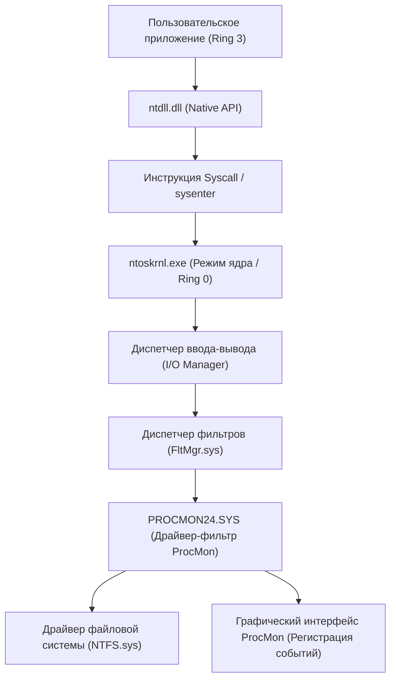
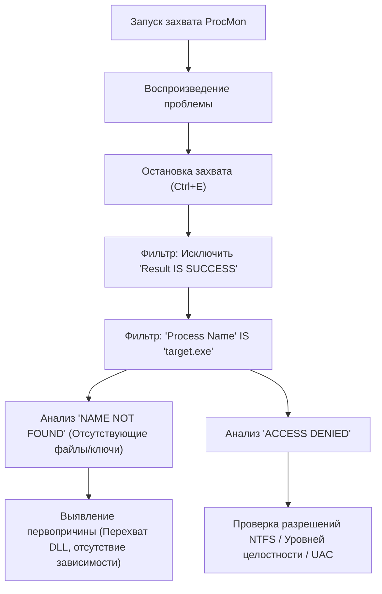
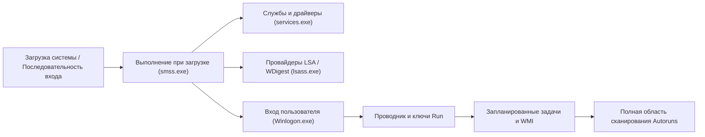

В среде Windows, когда вы сталкиваетесь с такими проблемами, как сбои системы, снижение производительности, заражение вредоносным ПО или непонятное поведение приложений, встроенных Диспетчера задач (Task Manager) и Просмотра событий (Event Viewer) часто бывает недостаточно для определения первопричины (Root Cause). Для такого расширенного устранения неполадок ИТ-специалисты, специалисты по реагированию на инциденты и системные администраторы по всему миру используют набор инструментов «**Windows Sysinternals**».

В этой статье мы подробно рассмотрим методы расширенного устранения неполадок, проникающие в самые глубины ОС Windows (граница между режимом ядра и пользовательским режимом, обработка прерываний, ETW, драйверы реестра и файловой системы), с использованием основных инструментов Sysinternals: **Process Explorer**, **Process Monitor (ProcMon)**, **Autoruns** и **TCPView**.

---

## 1. Архитектура инструментов Sysinternals и основы ядра Windows

Чтобы понять, почему инструменты Sysinternals настолько мощны, необходимо усвоить базовые концепции архитектуры Windows. Windows работает в двух основных уровнях привилегий: «Пользовательский режим» (Ring 3) и «Режим ядра» (Ring 0).

Такие инструменты, как Process Monitor и Process Explorer, не просто вызывают API пользовательского режима, но и динамически загружают специальные драйверы режима ядра (например, `PROCMON24.SYS`), чтобы напрямую перехватывать или отслеживать события, происходящие в глубинах ОС.

На следующей диаграмме архитектуры показано, как Process Monitor перехватывает активность файловой системы.

Драйвер ProcMon регистрируется как драйвер мини-фильтра и отслеживает все IRP (I/O Request Packet), проходящие между диспетчером ввода-вывода и драйвером NTFS. Это позволяет раскрыть все попытки доступа, даже те, которые приложение пытается скрыть.

---

## 2. Глубокий анализ процессов и вредоносного ПО с помощью Process Explorer (ProcExp)

Process Explorer — это «сверхмощный диспетчер задач». Он визуализирует не только использование ЦП/памяти, но и дерево процессов, дескрипторы (handles), загруженные DLL и стеки вызовов потоков.

### 2.1 Выявление утечек дескрипторов и блокировок
Часто возникает проблема, когда приложение дает сбой, оставив файл открытым, из-за чего этот файл невозможно удалить или переместить. Если вы получаете ошибку «Файл открыт в другой программе», используйте функцию **Find** (`Ctrl+F`) в ProcExp для поиска имени файла или каталога.
Как только процесс, удерживающий соответствующий дескриптор (File, Section, Mutex, Event и т. д.), будет найден, вы можете принудительно выполнить `Close Handle`, щелкнув правой кнопкой мыши по целевому процессу. Это разблокирует файл без завершения самого процесса (однако имейте в виду риск нестабильной работы приложения).

### 2.2 Выявление перехватов (Hooking) вредоносного ПО и проверка подписей
Когда вредоносное ПО или сложный руткит скрывается в системе, оно может внедрять собственные DLL (DLL Injection) в легитимные процессы (например, `svchost.exe`, `explorer.exe`).

В ProcExp вы можете выявить подозрительные процессы, включив следующие настройки:
1. **Options** -> **Verify Image Signatures**: Проверяет цифровые подписи исполняемых файлов и DLL. Файлы без подписи или с поврежденной подписью будут выделены.
2. **Options** -> **VirusTotal.com** -> **Check VirusTotal.com**: Автоматически отправляет хеш-значения всех процессов на VirusTotal и отображает показатель обнаружения вредоносного ПО (например, `5/72`) в виде оценки.

Если обнаружен подозрительный процесс `svchost.exe`, дважды щелкните по нему, проверьте вкладку **Strings** и поищите различия между строками в памяти (Memory) и на диске (Image). Если различия значительны, велика вероятность того, что исполняемый файл упакован (Packed) или стал жертвой подмены процесса (Process Hollowing).

### 2.3 Анализ аппаратных прерываний и 100% скачков процессора
Если вся система зависает на несколько секунд или звук прерывается (заикается), в Диспетчере задач можно заметить, что «Системные прерывания» (System Interrupts) потребляют ресурсы процессора.

В планировании Windows аппаратные прерывания (ISR: Interrupt Service Routine) и отложенные вызовы процедур (DPC: Deferred Procedure Call) выполняются с более высоким приоритетом (IRQL: Interrupt Request Level), чем обычные пользовательские потоки. Иными словами, если неисправный драйвер затягивает выполнение DPC, процессор не сможет выполнять никакие другие задачи на этом ядре.

Если использование ЦП процессами `Interrupts` или `DPCs` в верхней части списка ProcExp высокое, используйте Windows Performance Analyzer (WPA) для выявления виновного драйвера (`.sys`). Расчет процессорного времени можно выразить следующей формулой:

$$ U_{cpu} = \left( 1 - \frac{T_{idle}}{T_{total}} \right) \times 100 $$
$$ T_{interrupt\_overhead} = \sum_{i=1}^{n} \left( T_{ISR(i)} + T_{DPC(i)} \right) $$

Если $T_{interrupt\_overhead}$ занимает большую часть процессорного времени, подозреваются ошибки в драйверах NDIS (сеть), Storport (хранилище) или драйверах видеокарты.

---

## 3. Сверхточная трассировка с помощью Process Monitor (ProcMon)

Process Monitor записывает активность файловой системы, реестра, сети, а также создание процессов/потоков с микросекундной точностью. Это самый мощный инструмент для устранения неполадок, но так как за несколько минут работы регистрируются миллионы событий, ключом к успеху является «эффективная фильтрация шума».

### 3.1 Методология расширенной фильтрации

Базовый рабочий процесс эффективного использования ProcMon показан на следующей диаграмме Mermaid.

**Использование фильтра отбрасывания (Drop Filter):**
Если включить `Filter` -> `Drop Filtered Events`, отфильтрованные события больше не будут сохраняться в памяти или на диске. Это предотвратит сбой ProcMon из-за нехватки памяти (OOM) даже при длительной трассировке (например, при мониторинге спорадически возникающих проблем).

### 3.2 Практический сценарий: Отладка сбоя загрузки DLL (Side-Loading / Missing DLL)
Рассмотрим случай, когда бизнес-приложение `AppServer.exe` ненормально завершает работу сразу после запуска без каких-либо диалоговых окон об ошибке (тихий сбой). В Просмотре событий (журнал Application) также нет полезной информации.

1. Запустите ProcMon и начните захват.
2. Запустите `AppServer.exe` и добейтесь сбоя.
3. Остановите захват ProcMon.
4. Установите фильтр: `Process Name is AppServer.exe`.
5. Установите фильтр: `Result is not SUCCESS`.

Проанализировав журнал, вы должны увидеть последовательность следующих событий:

*   `CreateFile` | `C:\Program Files\MyApp\lib\CoreCrypto.dll` | `NAME NOT FOUND`
*   `CreateFile` | `C:\Windows\System32\CoreCrypto.dll` | `NAME NOT FOUND`
*   `CreateFile` | `C:\Windows\CoreCrypto.dll` | `NAME NOT FOUND`
*   `CreateFile` | `C:\Users\Kenji\AppData\Local\Microsoft\WindowsApps\CoreCrypto.dll` | `NAME NOT FOUND`

Это типичное поведение **отсутствия зависимости DLL** и **порядка поиска DLL (DLL Search Order)**. Приложение требует `CoreCrypto.dll`, но не может найти его в системе, поэтому инициализация завершается сбоем, а приложение закрывается без обработчика исключений. Помещение недостающей DLL в нужный каталог немедленно решит эту проблему.

### 3.3 Устранение неполадок загрузки с помощью Boot Logging
Если Windows загружается медленно или сразу после входа в систему появляется черный экран, может помочь функция **Enable Boot Logging** в ProcMon. Если включить ее и перезагрузить компьютер, специальный драйвер загрузки ProcMon будет записывать все системные вызовы с самого начала загрузки Windows (когда загружается `smss.exe`) и сохранять их в файл. При следующем входе в систему открытие ProcMon преобразует журнал, позволяя детально проанализировать, какие драйверы или службы вызывают узкие места ввода-вывода во время процесса загрузки.

Выразив задержку или пропускную способность ввода-вывода математически, можно понять, какую часть пропускной способности хранилища занимает определенное устройство или драйвер.
$$ \text{Throughput (MB/s)} = \frac{\sum_{i=1}^{N} \text{Size}(I/O_i)}{\Delta T_{capture}} \times \frac{1}{1024^2} $$
С помощью функции `Tools` -> `File Summary` в ProcMon вы можете мгновенно выполнить этот расчет в графическом интерфейсе.

---

## 4. Анализ механизмов закрепления (Persistence) и задержек загрузки с помощью Autoruns

Места автозапуска в Windows — это не просто папка «Автозагрузка» (Startup Folder) или ключи реестра `Run`. Вредоносное ПО (особенно полезные нагрузки APT-атак или продвинутые руткиты) прячется в местах, скрытых от глаз системного администратора, чтобы обеспечить выполнение даже после перезагрузки (Persistence).

Autoruns выполняет комплексное сканирование **всех точек расширения автозапуска (ASE: Auto-Start Extensibility Points)** в системе.

### 4.1 Важные вкладки для проверки и расширенные функции
*   **Logon**: Стандартные ключи Run/RunOnce, папка автозагрузки.
*   **Scheduled Tasks**: Планировщик задач Windows. Вредоносное ПО часто создает поддельные задачи, маскируясь под «Adobe Update» или «Google Update».
*   **Services / Drivers**: Драйверы, загружаемые в режиме ядра. Здесь можно отключить подозрительные файлы `.sys`, вызывающие 100% загрузку ЦП, о чем упоминалось ранее.
*   **WMI**: Место закрепления безфайлового вредоносного ПО (Fileless Malware) с использованием фильтров событий и потребителей WMI (Windows Management Instrumentation). Это место очень часто упускают из виду.
*   **AppInit_DLLs / KnownDLLs**: Список DLL, которые принудительно внедряются при каждом запуске приложения. Является рассадником для перехвата с помощью внедрения DLL.

**Практика устранения неполадок:**
В Autoruns, как и в ProcExp, включите `Verify Code Signatures` и `Check VirusTotal.com` в `Options`. Если вы найдете в списке розовые записи (без подписи или неизвестный автор) или записи с красной оценкой VirusTotal, вы можете безопасно отключить их загрузку, просто сняв флажок, без удаления записи из реестра. Классический метод анализа заключается в том, чтобы перезагрузить систему и проверить (A/B тестирование), решена ли проблема (поведение вредоносного ПО или синий/черный экран).

---

## 5. Отслеживание скрытых сетевых подключений с помощью TCPView

Состояние сети можно проверить на вкладке сети в Диспетчере задач или с помощью команды `netstat -ano`, но они могут обновляться медленно, а сопоставление имен процессов с PID вручную утомительно.
TCPView отслеживает все конечные точки TCP и UDP в реальном времени и отображает список, показывающий, какой процесс взаимодействует с каким удаленным адресом и портом.

### 5.1 Выявление незаконного C2-взаимодействия
Если вредоносное ПО установило бэкдор и отправляет маяк (Beacon) на внешний сервер C2 (Command and Control), ищите следующие признаки в TCPView:

*   **Неестественное имя процесса**: Например, `svchost.exe`, но он работает с правами пользователя, а не системы, и поддерживает состояние `ESTABLISHED` для связи с неизвестным зарубежным IP-адресом.
*   **Связь процессов, которые обычно не работают с сетью**: Например, калькулятор (`calc.exe`) или блокнот (`notepad.exe`) отправляют и получают большое количество пакетов через порт 443 или 80 (типичный признак подмены процесса).

При обнаружении подозрительного соединения вы можете принудительно разорвать TCP-сессию (выдать пакет RST), отправив `Close Connection` прямо из TCPView, или принудительно завершить процесс с помощью `End Process`.

---

## 6. Заключение: Суть анализа с использованием Sysinternals

Инструменты Sysinternals — это мощный «рентген» для визуализации всех фоновых процессов, происходящих в ОС Windows. Чтобы эффективно использовать эти инструменты, следуйте следующим передовым практическим рекомендациям (best practices):

1.  **Настройка символов (Symbols)**:
    Для точного разрешения стеков вызовов в ProcExp и ProcMon обязательно необходимо настроить публичный сервер символов Microsoft. Установите следующую переменную среды:
    `_NT_SYMBOL_PATH = srv*c:\symbols*https://msdl.microsoft.com/download/symbols`
2.  **Извлечение сигнала из шума (Повышение Signal-to-Noise Ratio)**:
    Журналы ProcMon могут содержать миллионы строк. Активно используйте фильтр `Exclude`, чтобы отсеивать «нормальное поведение (SUCCESS)» и «безопасные процессы (System, explorer.exe и т. д.)», и сосредоточьтесь на сути проблемы (ACCESS DENIED, NAME NOT FOUND).
3.  **Всегда используйте последние версии**:
    Инструменты Sysinternals часто обновляются. Заходите напрямую на `https://live.sysinternals.com/` из браузера и всегда используйте последние бинарные файлы (или версии для командной строки, такие как `procdump`, `psexec` и т. д.).

В расширенном устранении неполадок Windows интуиция и догадки (Guesswork) бесполезны. Проводя логическое расследование на основе фактов (процессов, потоков, дескрипторов, системных вызовов, событий реестра) с использованием инструментов Sysinternals, вы обязательно доберетесь до первопричины, какой бы сложной ни была проблема или как бы глубоко ни скрывалось вредоносное ПО.
