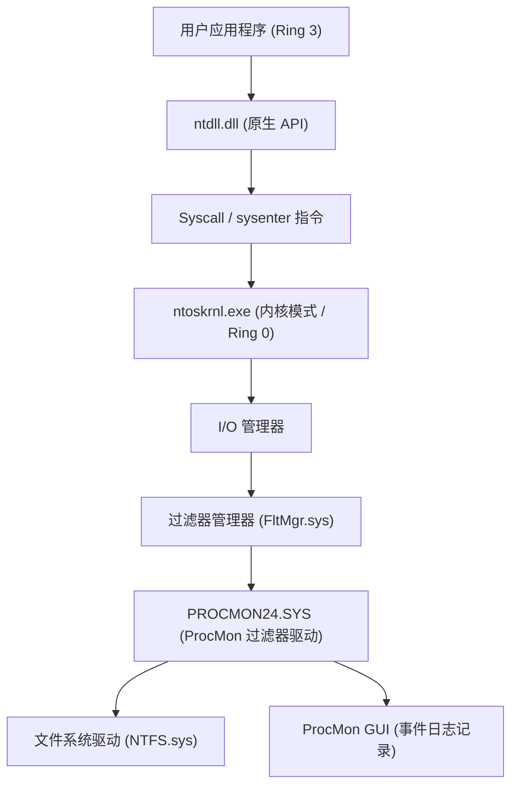
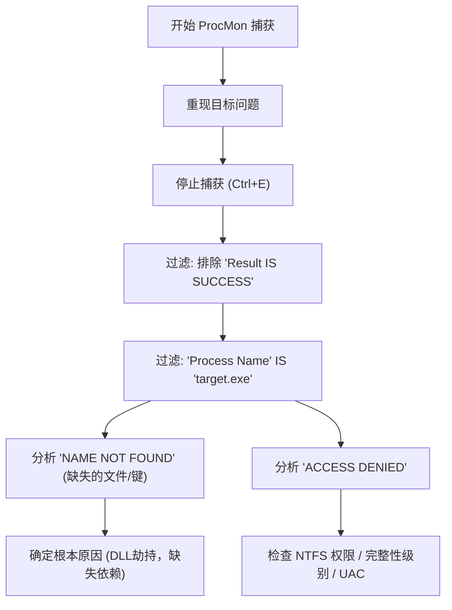
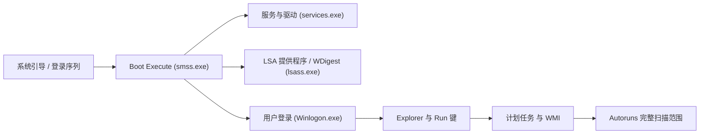

在Windows环境中，当我们面临系统崩溃、性能下降、恶意软件感染或应用程序出现不可思议的行为等问题时，往往无法仅靠系统自带的任务管理器和事件查看器来确定根本原因（Root Cause）。在这种高级别的故障排除中，全球的IT专家、事件响应人员和系统管理员都一致使用“**Windows Sysinternals**”工具集。

本文将充分利用Sysinternals的主要工具：**Process Explorer**、**Process Monitor (ProcMon)**、**Autoruns**、**TCPView**，深入挖掘Windows操作系统的深处（内核模式与用户模式的边界、中断处理、ETW、注册表/文件系统驱动程序），全面解析高级故障排除方法。

---

## 1. Sysinternals工具的架构与Windows内核基础

为了理解Sysinternals工具集为何如此强大，我们需要掌握Windows架构的基本概念。Windows大致分为“用户模式（Ring 3）”和“内核模式（Ring 0）”这两个权限级别运行。

像Process Monitor和Process Explorer这样的工具，不仅仅是调用用户模式的API，还会动态加载专用的内核模式驱动程序（例如：`PROCMON24.SYS`），从而直接钩取（Hook）或跟踪操作系统深层发生的事件。

下图展示了Process Monitor是如何捕获文件系统活动的架构图。

ProcMon的驱动程序被注册为微过滤驱动程序（Minifilter Driver），监视在I/O管理器和NTFS驱动程序之间传递的所有IRP（I/O请求包）。借此，任何应用程序试图隐藏的访问行为都将被彻底曝光。

---

## 2. 使用 Process Explorer (ProcExp) 深入分析进程与恶意软件

Process Explorer是一款“超强版任务管理器”。它不仅能可视化CPU/内存的使用率，还能展示进程树、句柄、加载的DLL，甚至线程的调用栈（Call Stack）。

### 2.1 定位句柄泄漏与锁定
应用程序在保持文件打开的状态下崩溃，导致之后无法删除或移动该文件的问题频频发生。当出现“文件正被另一个程序使用”的错误时，可以使用ProcExp的 **Find** 功能（`Ctrl+F`）搜索文件名或目录名。
一旦确定了持有相关句柄（如 File、Section、Mutex、Event等）的进程，右键点击目标进程并强制执行 `Close Handle`，无需杀掉进程即可解除文件锁定（但需注意这有导致应用程序运行不稳定的风险）。

### 2.2 识别恶意软件注入与签名验证
当恶意软件或非法Rootkit潜伏在系统中时，有时会将自己的DLL注入（DLL Injection）到合法进程（例如：`svchost.exe`, `explorer.exe`）中。

在ProcExp中，启用以下设置可以让非法进程原形毕露。
1. **Options** -> **Verify Image Signatures**: 验证可执行文件或DLL的数字签名。未签名或签名损坏的文件将被高亮显示。
2. **Options** -> **VirusTotal.com** -> **Check VirusTotal.com**: 自动将所有进程的哈希值发送至VirusTotal，并以分数形式显示恶意软件的检测率（例如：`5/72`）。

如果发现了可疑的 `svchost.exe`，双击该进程查看 **Strings** 选项卡，检查内存中（Memory）和磁盘上（Image）的字符串是否存在差异。如果差异很大，那么该可执行文件极有可能被加壳（Packed）或遭受了进程替换（Process Hollowing）攻击。

### 2.3 硬件中断与 100% CPU 占用率峰值分析
当整个系统冻结数秒或出现音频卡顿（Stutter）现象时，查看任务管理器可能会发现“System Interrupts（系统中断）”占满了CPU。

在Windows调度中，硬件中断（ISR: Interrupt Service Routine）和DPC（Deferred Procedure Call）的执行优先级（IRQL: Interrupt Request Level）高于普通的用户线程。也就是说，如果存在缺陷的驱动程序延长了DPC的时间，CPU将在该核心上完全无法执行其他任何任务。

如果在ProcExp进程列表顶部的 `Interrupts` 或 `DPCs` 的CPU使用率居高不下，可以结合 Windows Performance Analyzer (WPA) 来找出导致问题的驱动程序（`.sys`）。CPU时间的计算可以公式化如下：

$$ U_{cpu} = \left( 1 - \frac{T_{idle}}{T_{total}} \right) \times 100 $$
$$ T_{interrupt\_overhead} = \sum_{i=1}^{n} \left( T_{ISR(i)} + T_{DPC(i)} \right) $$

如果 $T_{interrupt\_overhead}$ 占据了大部分的CPU时间，那么就要怀疑NDIS驱动（网络）、Storport驱动（存储）或显卡驱动中存在Bug。

---

## 3. 使用 Process Monitor (ProcMon) 进行超高精度跟踪

Process Monitor能够以微秒为单位记录文件系统、注册表、网络以及进程/线程创建的活动。它是故障排除中最强大的工具，但由于仅运行几分钟就会记录数百万行事件，因此“如何过滤噪音”成为制胜关键。

### 3.1 高级过滤方法论

以下Mermaid图展示了熟练使用ProcMon的基本工作流程。

**利用丢弃过滤器（Drop Filter）:**
启用 `Filter` -> `Drop Filtered Events` 后，被过滤掉的事件将不再保存在内存或磁盘中。这样即使进行长时间的跟踪（例如：监视间歇性发生的问题），也能防止ProcMon因内存不足（OOM）而崩溃。

### 3.2 实践场景：DLL加载失败（Side-Loading / Missing DLL）调试
假设有一个业务应用程序 `AppServer.exe`，在启动后没有任何错误对话框便异常退出（静默崩溃）。事件查看器（Application 日志）中也没有任何有用的信息。

1. 启动ProcMon并开始捕获。
2. 启动 `AppServer.exe`，使其崩溃。
3. 停止ProcMon的捕获。
4. 设置过滤器: `Process Name is AppServer.exe`。
5. 设置过滤器: `Result is not SUCCESS`。

分析日志时，您应该会发现连续发生了如下事件：

*   `CreateFile` | `C:\Program Files\MyApp\lib\CoreCrypto.dll` | `NAME NOT FOUND`
*   `CreateFile` | `C:\Windows\System32\CoreCrypto.dll` | `NAME NOT FOUND`
*   `CreateFile` | `C:\Windows\CoreCrypto.dll` | `NAME NOT FOUND`
*   `CreateFile` | `C:\Users\Kenji\AppData\Local\Microsoft\WindowsApps\CoreCrypto.dll` | `NAME NOT FOUND`

这是典型的**缺乏DLL依赖**及**DLL搜索顺序（DLL Search Order）**行为。应用程序需要 `CoreCrypto.dll`，但由于系统中任何地方都找不到它，导致初始化失败并在没有异常处理程序的情况下退出。只需将缺失的DLL放置在适当的目录下，该问题即可立即解决。

### 3.3 通过 Boot Logging 排除启动故障
如果Windows启动缓慢，或者登录后立刻出现黑屏，ProcMon的 **Enable Boot Logging** 功能将大显身手。启用此功能并重新启动后，ProcMon的专用引导驱动程序会从Windows的最早阶段（加载 `smss.exe` 时）开始记录所有系统调用，并将其保存到文件中。下次登录时打开ProcMon，日志将被转换，您可以详细分析在启动过程中究竟是哪个驱动或服务引起了I/O瓶颈。

将I/O的延迟和吞吐量公式化，就可以了解特定的设备或驱动程序占据了多少存储带宽。
$$ \text{Throughput (MB/s)} = \frac{\sum_{i=1}^{N} \text{Size}(I/O_i)}{\Delta T_{capture}} \times \frac{1}{1024^2} $$
使用ProcMon的 `Tools` -> `File Summary`，即可在GUI上一瞬间完成这项统计。

---

## 4. 使用 Autoruns 解析持久化机制（Persistence）与启动延迟

Windows的自动启动位置绝不仅仅只有启动文件夹（Startup Folder）或 `Run` 注册表键。恶意软件（尤其是APT攻击的有效载荷或高级Rootkit）会将自己隐藏在系统管理员难以察觉的位置，并设置为在重启后仍能执行（Persistence）。

Autoruns能够全面扫描系统上**所有自动启动扩展点（ASE: Auto-Start Extensibility Points）**。

### 4.1 需要检查的重要选项卡与高级功能
*   **Logon**: 标准的 Run/RunOnce 键、启动文件夹。
*   **Scheduled Tasks**: Windows任务计划程序。恶意软件常常创建伪装成“Adobe Update”或“Google Update”的虚假任务。
*   **Services / Drivers**: 在内核模式下启动的驱动程序。之前提到的导致100% CPU峰值的可疑 `.sys` 文件，可以在这里禁用。
*   **WMI**: 利用WMI (Windows Management Instrumentation) 事件过滤器或消费者的无文件恶意软件（Fileless Malware）的持久化位置。这非常容易被忽略。
*   **AppInit_DLLs / KnownDLLs**: 每次应用程序启动时强制注入的DLL列表。这里是DLL注入劫持的温床。

**故障排除实践:**
在Autoruns中也和ProcExp一样，从 `Options` 中启用 `Verify Code Signatures` 和 `Check VirusTotal.com`。如果发现列表中有显示为粉色（未签名或创建者未知）的条目，或者VirusTotal得分为红色的条目，只需取消勾选，无需删除注册表即可安全禁用其启动。这是正统的分析手法：禁用后重新启动，测试问题（恶意软件的行为或蓝/黑屏）是否得到解决（A/B测试）。

---

## 5. 使用 TCPView 追踪隐藏的网络连接

虽然任务管理器的网络选项卡或 `netstat -ano` 命令也能查看网络通信状态，但它们的刷新较慢，且手动进行进程名与PID的映射十分繁琐。
TCPView可实时监视所有TCP和UDP端点，并列表显示哪个进程正在与哪个远程地址和端口进行通信。

### 5.1 识别非法的 C2 通信
当恶意软件植入后门，并向外部的C2（Command and Control）服务器发送Beacon（信标）时，可以在TCPView中寻找以下特征：

*   **进程名不自然**: 比如 `svchost.exe` 却不是以系统权限而是以用户权限运行，并且对一个陌生的海外IP地址维持着 `ESTABLISHED` 状态的通信。
*   **通常不通信的进程却在通信**: 例如，计算器（`calc.exe`）或记事本（`notepad.exe`）在 443 或 80 端口收发大量数据包（进程替换的典型征兆）。

发现可疑通信后，可直接在TCPView中发送 `Close Connection` 强制断开TCP会话（发送RST包），或通过 `End Process` 强制终止相关进程。

---

## 6. 总结：Sysinternals分析的精髓

Sysinternals工具集是一台强大的“X光机”，能将Windows操作系统在后台进行的所有行为可视化。为了有效利用这些工具，请遵守以下最佳实践：

1.  **配置符号（Symbols）**:
    为了在ProcExp和ProcMon中准确解析调用栈，必须配置Microsoft的公共符号服务器。请在环境变量中设置以下内容：
    `_NT_SYMBOL_PATH = srv*c:\symbols*https://msdl.microsoft.com/download/symbols`
2.  **从噪音中提取信号（提升信噪比）**:
    ProcMon的日志多达数百万行。请积极使用 `Exclude` 过滤器排除“正常操作（SUCCESS）”或“已知安全的进程（System, explorer.exe等）”，将焦点集中在问题的核心（ACCESS DENIED, NAME NOT FOUND）。
3.  **始终使用最新版本**:
    Sysinternals工具经常更新。请直接通过浏览器访问 `https://live.sysinternals.com/`，确保始终使用最新的二进制文件（或命令行版的 `procdump`, `psexec` 等）。

在高级Windows故障排除中，直觉或瞎猜（Guesswork）是毫无意义的。通过使用Sysinternals工具进行基于事实（进程、线程、句柄、系统调用、注册表事件）的逻辑性原因追查，无论遇到多么复杂的故障或棘手的恶意软件感染，您最终一定能找到根本原因。
