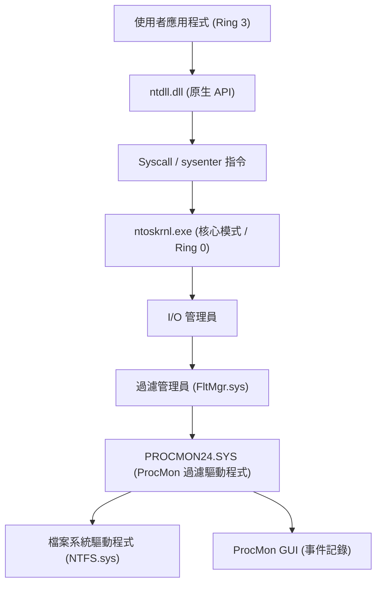
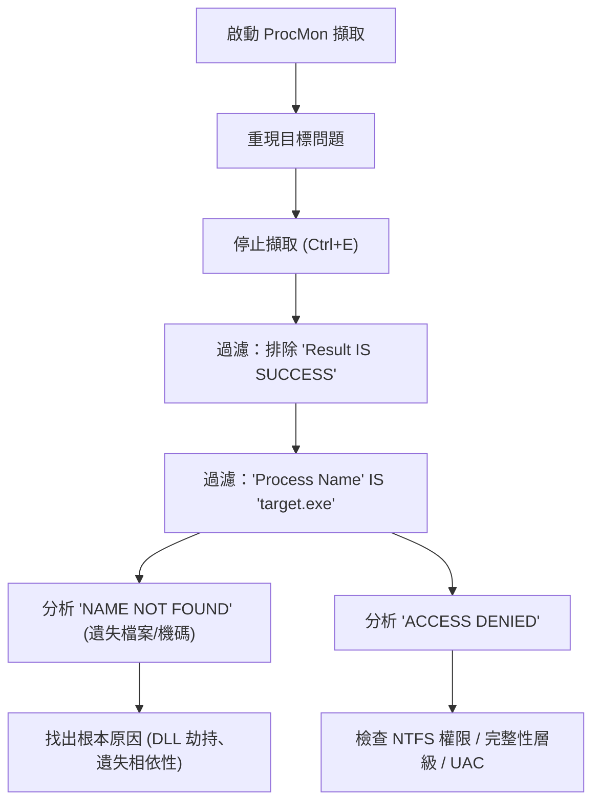
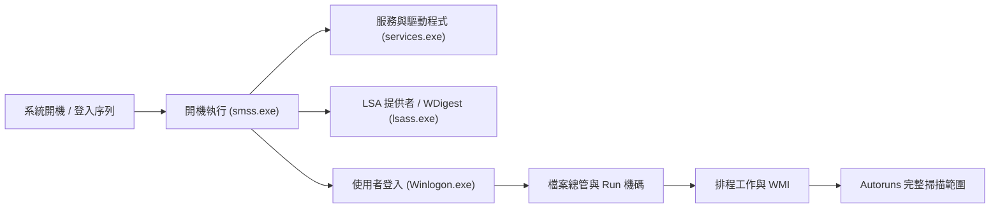

在Windows環境中，當面臨系統崩潰、效能下降、惡意軟體感染或應用程式的不可思議行為等問題時，僅靠內建的工作管理員或事件檢視器通常無法找出根本原因（Root Cause）。在這種進階的疑難排解中，全世界的IT專業人員、事件回應者和系統管理員一致使用的就是「**Windows Sysinternals**」工具集。

本文將徹底解說如何充分運用Sysinternals的主要工具：**Process Explorer**、**Process Monitor (ProcMon)**、**Autoruns**、**TCPView**，深入探討Windows OS的深層（核心模式與使用者模式的邊界、中斷處理、ETW、登錄檔/檔案系統驅動程式），進行進階的疑難排解手法。

---

## 1. Sysinternals工具的架構與Windows核心基礎

要理解Sysinternals工具集為何如此強大，必須先掌握Windows架構的基本概念。Windows大致分為「使用者模式（Ring 3）」和「核心模式（Ring 0）」兩個權限層級來運作。

像Process Monitor或Process Explorer這類工具，不單只是呼叫使用者模式的API，還會動態載入專用的核心模式驅動程式（例如：`PROCMON24.SYS`），直接掛鉤或追蹤OS深層發生的事件。

下圖展示了Process Monitor如何擷取檔案系統活動的架構圖。

ProcMon的驅動程式被註冊為迷你過濾驅動程式（Minifilter Driver），它會監視所有通過I/O管理員與NTFS驅動程式之間的IRP（I/O Request Packet）。因此，即使是應用程式試圖隱藏的存取，也能全部被揭露出來。

---

## 2. 透過 Process Explorer (ProcExp) 深入探究處理程序與惡意軟體分析

Process Explorer是一款「超強工作管理員」。它不僅顯示CPU/記憶體的使用率，還能將處理程序樹狀圖、控制代碼（Handle）、已載入的DLL，甚至是執行緒的呼叫堆疊（Call Stack）視覺化。

### 2.1 找出控制代碼洩漏與鎖定
應用程式在開啟檔案時崩潰，導致之後無法刪除或移動該檔案的問題屢見不鮮。當出現「檔案已由另一個程式開啟」的錯誤時，可以使用ProcExp的 **Find** 功能（`Ctrl+F`）來搜尋檔案名稱或目錄名稱。
當找出持有該控制代碼（如File、Section、Mutex、Event等）的處理程序後，對目標處理程序按右鍵強制執行 `Close Handle`，就能在不強制結束（Kill）處理程序的情況下解除檔案的鎖定（但須注意這可能會讓應用程式的運作變得不穩定）。

### 2.2 找出惡意軟體掛鉤與簽章驗證
當系統潛伏著惡意軟體或惡意Rootkit時，有時會將自身的DLL注入（DLL Injection）到正常的處理程序中（例如：`svchost.exe`、`explorer.exe`）。

在ProcExp中，透過啟用以下設定可以讓異常的處理程序原形畢露：
1. **Options** -> **Verify Image Signatures**：驗證執行檔與DLL的數位簽章。未簽署或簽章損壞的檔案會被反白顯示。
2. **Options** -> **VirusTotal.com** -> **Check VirusTotal.com**：自動將所有處理程序的雜湊值傳送至VirusTotal，並將惡意軟體的偵測率（例如：`5/72`）以分數形式顯示。

若發現可疑的 `svchost.exe`，可連按兩下該處理程序並查看 **Strings** 索引標籤，檢查記憶體中（Memory）與磁碟中（Image）的字串是否存在差異。如果差異很大，則該執行檔極有可能已被加殼（Packed），或是遭受了處理程序掏空（Process Hollowing）的攻擊。

### 2.3 分析硬體中斷與100% CPU突波
當整個系統凍結數秒，或者出現聲音斷斷續續（卡頓）的現象時，查看工作管理員可能會發現「系統中斷（System Interrupts）」耗盡了CPU資源。

在Windows的排程中，硬體中斷（ISR: Interrupt Service Routine）與DPC（Deferred Procedure Call，延遲程序呼叫）會以高於一般使用者執行緒的優先順序（IRQL: Interrupt Request Level）來執行。也就是說，如果不良的驅動程式拖長了DPC的執行時間，CPU在該核心上將無法執行任何其他工作。

如果在ProcExp的處理程序列表最上方的 `Interrupts` 或 `DPCs` 的CPU使用率很高，可以搭配Windows效能分析器（WPA）來找出肇事的驅動程式（`.sys`）。CPU時間的計算可以用以下公式表示：

$$ U_{cpu} = \left( 1 - \frac{T_{idle}}{T_{total}} \right) \times 100 $$
$$ T_{interrupt\_overhead} = \sum_{i=1}^{n} \left( T_{ISR(i)} + T_{DPC(i)} \right) $$

如果 $T_{interrupt\_overhead}$ 佔了CPU時間的大部分，那麼就有理由懷疑是NDIS驅動程式（網路）、Storport驅動程式（儲存裝置）或圖形驅動程式的Bug所引起。

---

## 3. 透過 Process Monitor (ProcMon) 進行超精密追蹤

Process Monitor能以微秒為單位，記錄檔案系統、登錄檔、網路以及處理程序/執行緒建立的活動。它雖然是疑難排解的最強工具，但只需執行幾分鐘就會記錄數百萬行的事件，因此「如何過濾雜訊」便成為決勝關鍵。

### 3.1 進階過濾的方法論

下方的Mermaid圖展示了熟練運用ProcMon的基本工作流程。

**活用捨棄過濾器（Drop Filter）：**
啟用 `Filter` -> `Drop Filtered Events` 後，被過濾掉的事件將不會儲存到記憶體或磁碟中。這可以防止在進行長時間追蹤（例如：監控斷斷續續發生的問題）時，ProcMon因為記憶體不足（OOM）而崩潰。

### 3.2 實戰情境：偵錯DLL載入失敗（Side-Loading / Missing DLL）
假設有一個商務應用程式 `AppServer.exe`，在啟動後沒有顯示任何錯誤對話方塊就異常終止（靜默崩潰）。事件檢視器（Application 記錄）中也沒有提供任何有用的資訊。

1. 啟動 ProcMon 並開始擷取。
2. 啟動 `AppServer.exe` 讓其崩潰。
3. 停止 ProcMon 的擷取。
4. 設定過濾器：`Process Name is AppServer.exe`。
5. 設定過濾器：`Result is not SUCCESS`。

分析記錄後，應該會發現連續發生了如下的事件：

*   `CreateFile` | `C:\Program Files\MyApp\lib\CoreCrypto.dll` | `NAME NOT FOUND`
*   `CreateFile` | `C:\Windows\System32\CoreCrypto.dll` | `NAME NOT FOUND`
*   `CreateFile` | `C:\Windows\CoreCrypto.dll` | `NAME NOT FOUND`
*   `CreateFile` | `C:\Users\Kenji\AppData\Local\Microsoft\WindowsApps\CoreCrypto.dll` | `NAME NOT FOUND`

這是典型的 **DLL相依性遺失** 與 **DLL搜尋順序（DLL Search Order）** 的行為。應用程式需要 `CoreCrypto.dll`，但在系統上任何地方都找不到它，導致初始化失敗，並在沒有例外處理常式的情況下終止。只需將遺失的DLL放置到適當的目錄，此問題就能立即解決。

### 3.3 透過 Boot Logging 進行開機障礙疑難排解
若Windows開機緩慢，或者登入後立刻出現黑畫面，ProcMon的 **Enable Boot Logging** 功能就能派上用場。啟用此功能並重新開機後，ProcMon專屬的開機驅動程式會從Windows最早期階段（載入 `smss.exe` 的時機）開始，記錄所有的系統呼叫並儲存為檔案。下次登入並開啟ProcMon時，記錄會被轉換，這時就能詳細分析是開機過程中的哪個驅動程式或服務導致了I/O瓶頸。

將I/O的延遲與吞吐量予以公式化後，就能看出特定裝置或驅動程式佔用了多少儲存頻寬。
$$ \text{Throughput (MB/s)} = \frac{\sum_{i=1}^{N} \text{Size}(I/O_i)}{\Delta T_{capture}} \times \frac{1}{1024^2} $$
利用ProcMon的 `Tools` -> `File Summary`，便能在GUI上瞬間完成這項統計。

---

## 4. 透過 Autoruns 分析持續性機制（Persistence）與開機延遲

Windows的自動啟動位置不單只有啟動資料夾（Startup Folder）或 `Run` 登錄機碼。惡意軟體（尤其是APT攻擊的Payload或進階Rootkit）會將自己隱藏在系統管理員難以察覺的地方，並設定為在重新開機後仍能繼續執行（Persistence）。

Autoruns會全面掃描系統上**所有的自動啟動項目（ASE: Auto-Start Extensibility Points）**。

### 4.1 應確認的重要索引標籤與進階功能
*   **Logon**：標準的 Run/RunOnce 機碼、啟動資料夾。
*   **Scheduled Tasks**：Windows工作排程器。惡意軟體經常會建立偽裝成「Adobe Update」或「Google Update」等的假工作。
*   **Services / Drivers**：在核心模式啟動的驅動程式。可以在這裡停用前述導致100% CPU突波且可疑的 `.sys` 檔案。
*   **WMI**：利用WMI（Windows Management Instrumentation）事件過濾器或取用者來維持無檔案惡意軟體（Fileless Malware）持續性的地方。這個位置非常容易被忽略。
*   **AppInit_DLLs / KnownDLLs**：每次應用程式啟動時都會被強制注入的DLL清單。這裡是進行DLL注入掛鉤的溫床。

**疑難排解實戰：**
與ProcExp一樣，在Autoruns中也能從 `Options` 啟用 `Verify Code Signatures` 與 `Check VirusTotal.com`。若在清單中發現顯示粉紅色（未簽署或建立者不明）的項目，或是VirusTotal分數顯示紅色的項目，只需取消勾選核取方塊，就能在不刪除登錄檔的情況下安全地停用其啟動。接下來重新開機，測試問題（如惡意軟體的行為或藍白/黑畫面）是否獲得解決（A/B測試），這便是正規的分析手法。

---

## 5. 透過 TCPView 追蹤隱藏的網路連線

雖然透過工作管理員的網路索引標籤或 `netstat -ano` 指令也能確認通訊狀況，但這類方法的更新速度較慢，且手動將處理程序名稱與PID進行對應也相當費時。
TCPView能即時監控所有TCP及UDP端點，並將哪個處理程序正在與哪個遠端位址、連接埠通訊，以清單方式呈現。

### 5.1 找出惡意的C2通訊
當惡意軟體設置了後門，並向外部的C2（Command and Control）伺服器傳送Beacon（信號）時，可以在TCPView中尋找以下特徵：

*   **處理程序名稱不自然**：例如明明是 `svchost.exe`，卻不是以系統權限而是以使用者權限運作，並且對未知的國外IP位址維持著 `ESTABLISHED` 狀態的連線。
*   **不應通訊的處理程序正在通訊**：例如小算盤（`calc.exe`）或記事本（`notepad.exe`）在連接埠 443 或 80 傳送或接收大量封包（這是處理程序掏空的典型徵兆）。

若發現可疑通訊，可以直接從TCPView傳送 `Close Connection` 以強制中斷TCP工作階段（發出RST封包），或使用 `End Process` 強制結束該處理程序。

---

## 6. 總結：透過 Sysinternals 進行分析的精髓

Sysinternals工具集是將Windows OS在背後執行的所有行為視覺化的強大「X光機」。為了有效運用這些工具，請遵守以下最佳實務：

1.  **設定符號（Symbols）**：
    為了在ProcExp或ProcMon中正確解析呼叫堆疊，必須設定微軟的公用符號伺服器。請將環境變數設定如下：
    `_NT_SYMBOL_PATH = srv*c:\symbols*https://msdl.microsoft.com/download/symbols`
2.  **從雜訊中萃取訊號（提升訊號雜訊比）**：
    ProcMon的記錄動輒數百萬行。請積極使用 `Exclude` 過濾器排除「正常的行為（SUCCESS）」或「已知安全的處理程序（如 System、explorer.exe 等）」，並將焦點放在問題的核心（ACCESS DENIED、NAME NOT FOUND）上。
3.  **隨時使用最新版本**：
    Sysinternals工具會頻繁更新。請直接從瀏覽器存取 `https://live.sysinternals.com/`，以確保隨時使用最新的二進位檔（或是命令列版本的 `procdump`、`psexec` 等）。

在進階的Windows疑難排解中，憑直覺或瞎猜（Guesswork）是毫無意義的。透過Sysinternals工具，基於事實（處理程序、執行緒、控制代碼、系統呼叫、登錄檔事件）進行合乎邏輯的原因追查，那麼無論是多麼複雜的障礙或是棘手的惡意軟體感染，必定能夠找出根本原因。
