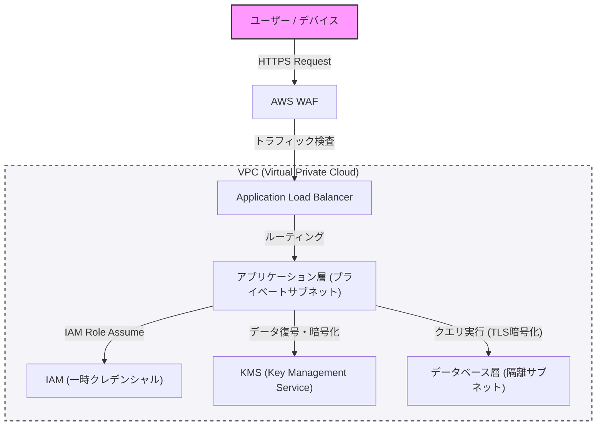

في بناء الأنظمة الحديثة، لا يُعد الأمن شيئًا يُضاف لاحقًا، بل هو عنصر أساسي يجب دمجه منذ المراحل الأولى للتصميم. في هذا المقال، وكمنطلق من البرمجة الدفاعية ومفهوم "انعدام الثقة" (Zero Trust)، سنتعمق في أفضل الممارسات لبناء بنية معمارية قوية، بدءًا من العزل الشبكي باستخدام VPC، مرورا بالدفاع عند الحافة بواسطة WAF، ومبدأ الامتيازات الأقل (PoLP) باستخدام IAM، وصولًا إلى تشفير البيانات باستخدام KMS.

## 1. المفاهيم الأساسية لبنية انعدام الثقة (Zero Trust Architecture)

كان نموذج الدفاع المحيطي (Perimeter Model) في الماضي يعتمد على افتراض أن "الشبكة الداخلية آمنة". ومع ذلك، مع الانتقال إلى السحابة وانتشار العمل عن بُعد، انهار هذا الافتراض.

تستند بنية انعدام الثقة (ZTA) إلى مبدأ "لا تثق أبداً، تحقق دائماً" (Never trust, always verify). وهو نهج يتطلب مصادقة وتفويضًا صارمين لأي طلب، بغض النظر عما إذا كان من داخل الشبكة أو خارجها.

## 2. عزل الشبكات والطبقات الدفاعية المتعددة

### العزل المنطقي بواسطة VPC (Virtual Private Cloud)

أول طبقة دفاعية للبنية التحتية للنظام هي العزل المنطقي للشبكة باستخدام VPC. فبدلًا من وضع جميع الموارد في شبكة مسطحة واحدة، يتم تقسيم الشبكات الفرعية (Subnets) بناءً على الأدوار.

*   **الشبكة الفرعية العامة (Public Subnet)**: نضع فيها فقط الموارد التي تتلقى وصولاً مباشراً من الإنترنت مثل موازنات الحمل (مثل ALB) أو بوابات NAT.
*   **الشبكة الفرعية الخاصة (Private Subnet)**: نضع فيها خوادم التطبيقات ومجموعات الحاويات، ويتم حظر الوصول المباشر إليها من الإنترنت.
*   **الشبكة الفرعية لقواعد البيانات (Database Subnet)**: نضع فيها قواعد البيانات وخوادم التخزين المؤقت (Cache)، ويُسمح بالوصول إليها فقط من طبقة التطبيقات.

من خلال هذه الهيكلة الهرمية، حتى في حال اختراق الطبقة العامة، يمكن منع الأضرار المباشرة التي قد تلحق بقاعدة البيانات.

### الدفاع عند الحافة بواسطة WAF (Web Application Firewall)

عند حدود الشبكة (الحافة/Edge)، نستخدم WAF للدفاع ضد الهجمات الموجهة إلى طبقة التطبيقات. يقوم WAF بتصفية الهجمات التي تستغل الثغرات الشائعة مثل تلك المذكورة في قائمة OWASP Top 10، ومنها حقن SQL (SQL Injection)، والبرمجة عبر المواقع (XSS)، وحقن أوامر نظام التشغيل (OS Command Injection).

بالإضافة إلى ذلك، من الضروري حماية النظام من هجمات حجب الخدمة الموزعة (DDoS) وهجمات القوة الغاشمة (Brute-force) عبر إعداد تحديد المعدل (Rate Limiting) في WAF.

## 3. IAM ومبدأ الامتيازات الأقل (PoLP)

يتطلب التحكم في الوصول بين المكونات المختلفة للنظام إدارة صارمة للصلاحيات باستخدام IAM (Identity and Access Management). وما يهم هنا هو **مبدأ الامتيازات الأقل (Principle of Least Privilege: PoLP)**.

*   **استبعاد بيانات الاعتماد الثابتة**: يجب تجنب تضمين بيانات المصادقة طويلة الأمد مثل مفاتيح الوصول والمفاتيح السرية داخل التطبيقات (Hardcoding).
*   **استخدام بيانات اعتماد مؤقتة**: يتم منح أدوار IAM (IAM Roles) للنسخ (Instances) أو الحاويات التي تشغل التطبيق، واستخدام نهج يعتمد على الحصول على رموز مميزة مؤقتة (Tokens) عبر خدمة STS (Security Token Service) لاستدعاء واجهات برمجة التطبيقات (APIs).
*   **تقليص نطاق الصلاحيات**: لا يجب استخدام سياسات قوية مثل "AmazonS3FullAccess"، بل يجب تقييد الصلاحيات لأدنى حد من الإجراءات والموارد المطلوبة، مثل "السماح فقط بـ `s3:GetObject` و `s3:PutObject` لبادئة (Prefix) محددة داخل حاوية S3 محددة".

## 4. حماية البيانات: Data at Rest و Data in Transit

للحفاظ على سرية البيانات وسلامتها، يجب تطبيق التشفير المناسب على البيانات سواء كانت مخزنة (Data at Rest) أو أثناء انتقالها (Data in Transit).

### Data at Rest (تشفير البيانات المخزنة)

يجب تشفير البيانات المخزنة في قواعد البيانات، ووحدات التخزين (مثل S3)، ووحدات التخزين الكتلية (مثل EBS) باستخدام KMS (Key Management Service). وبالنسبة للأنظمة ذات الحساسية العالية، يوصى باستخدام التشفير المغلف (Envelope Encryption). وهو تقنية يتم فيها تشفير "مفتاح البيانات" الذي يُشفر البيانات نفسها، باستخدام "مفتاح جذر" (مفتاح يُدار بواسطة العميل: CMK) والذي تتم إدارته عبر KMS. يتيح ذلك تدوير مفاتيح البيانات والتحكم في الوصول إليها بشكل آمن وفعال.

### Data in Transit (تشفير البيانات أثناء النقل)

يجب تشفير جميع البيانات المتدفقة عبر الشبكة باستخدام بروتوكول TLS 1.2 أو أعلى (يُوصى بـ TLS 1.3). ولا يقتصر هذا على الاتصالات عبر الإنترنت، بل يُعد فرض التشفير في الاتصالات بين المكونات داخل VPC (مثال: الاتصال من خادم التطبيق إلى قاعدة البيانات) أحد متطلبات بنية انعدام الثقة (Zero Trust).

## 5. تصور البنية المعمارية

يوضح المخطط أدناه نظرة عامة على البنية المعمارية القوية للنظام التي تجمع بين المكونات التي تم شرحها حتى الآن.

## 6. التطبيق الصارم للبرمجة الدفاعية

إلى جانب إعدادات أمان البنية التحتية، يجب أن يتبع كود التطبيق نفسه مبادئ البرمجة الدفاعية.

1.  **التحقق من المدخلات**: يجب التعامل مع جميع المدخلات الخارجية (مدخلات المستخدم، استجابات API، قراءة الملفات) على أنها غير جديرة بالثقة، وإجراء تحقق صارم بناءً على تنسيق القائمة البيضاء (Whitelist).
2.  **القيم الافتراضية الآمنة**: يجب أن تبدأ إعدادات النظام والقيم الأولية للمتغيرات من الحالة الأكثر أمانًا (مثل رفض الوصول، أو تعطيل الميزات)، ولا يتم توسيع الصلاحيات إلا عندما يُسمح بذلك صراحةً.
3.  **التعامل المناسب مع الأخطاء**: يجب ألا تتضمن رسائل الخطأ تتبع التكدس (Stack trace) أو أي معلومات تتيح تخمين الهيكل الداخلي (مثل معلومات مخطط قاعدة البيانات). يجب عرض رسائل خطأ عامة للمستخدمين، وتسجيل السجلات التفصيلية (Logs) فقط في منصة مركزية آمنة للسجلات.

## الخلاصة

إن بناء بنية معمارية قوية للنظام لا يكتمل بمجرد تطبيق أداة أمنية واحدة. بل يتحقق ذلك فقط من خلال الجمع بين طبقات دفاعية متعددة (Defense in Depth)، مثل التحكم في الشبكة عبر VPC، والدفاع عند الحافة بواسطة WAF، والتطبيق الصارم للامتيازات الأقل عبر IAM، وتشفير البيانات عبر KMS، بالإضافة إلى البرمجة الدفاعية.

إن الفهم العميق لمبادئ انعدام الثقة (Zero Trust) ودمج "التحقق" في كل نقطة اتصال داخل النظام هو الطريق الوحيد لحماية النظام والبيانات من التهديدات السيبرانية المتقدمة في العصر الحديث.
