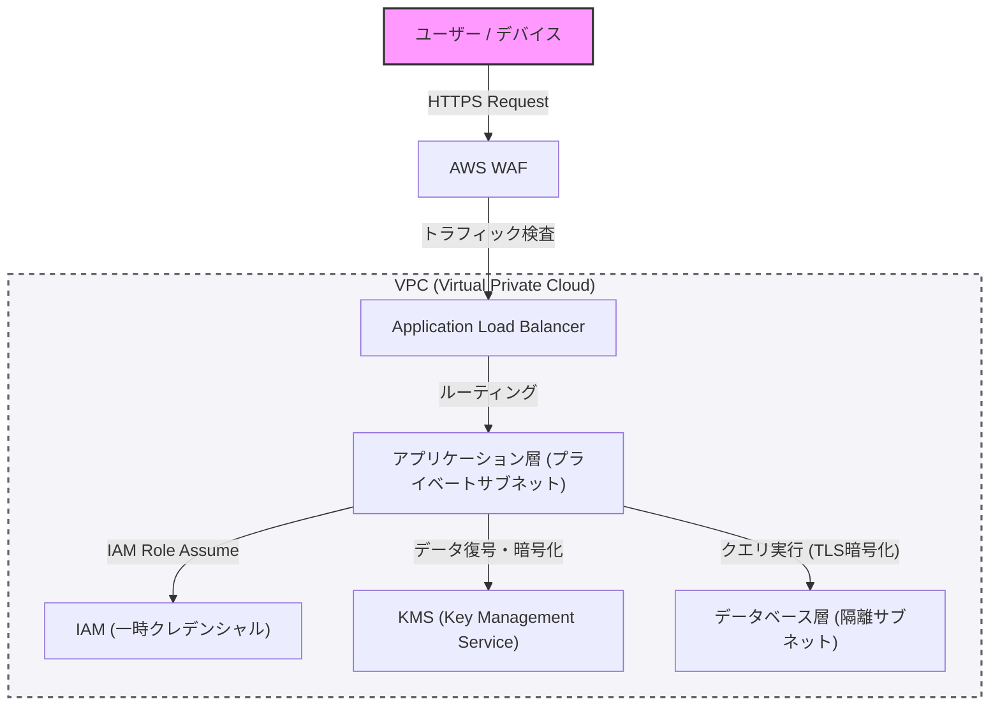

In der modernen Systementwicklung ist Sicherheit kein nachträglicher Zusatz, sondern ein zentrales Element, das von der Anfangsphase des Entwurfs an integriert werden sollte. In diesem Artikel befassen wir uns eingehend mit den Best Practices für den Aufbau einer robusten Architektur, ausgehend von den Konzepten der defensiven Programmierung und "Zero Trust" bis hin zur Netzwerkisolation mit VPC, Edge-Schutz mit WAF, dem Prinzip der geringsten Privilegien (PoLP) mit IAM und der Datenverschlüsselung mit KMS.

## 1. Grundkonzepte der Zero-Trust-Architektur

Das frühere Perimeter-Verteidigungsmodell basierte auf der Annahme, dass das "Unternehmensnetzwerk sicher ist". Mit der Migration in die Cloud und der Verbreitung von Remote-Arbeit ist diese Annahme jedoch zusammengebrochen.

Die Zero-Trust-Architektur (ZTA) basiert auf dem Prinzip "Niemals vertrauen, immer verifizieren (Never trust, always verify)". Dies ist ein Ansatz, der eine strenge Authentifizierung und Autorisierung für jede Anfrage erfordert, unabhängig davon, ob sie innerhalb oder außerhalb des Netzwerks stattfindet.

## 2. Netzwerkisolation und mehrschichtige Verteidigung

### Logische Trennung durch VPC (Virtual Private Cloud)

Die erste Verteidigungsebene der Systeminfrastruktur ist die logische Trennung des Netzwerks mithilfe einer VPC. Anstatt alle Ressourcen in einem flachen Netzwerk zu platzieren, werden Subnetze je nach Rolle aufgeteilt.

*   **Öffentliches Subnetz**: Hier werden nur Load Balancer (wie ALB) oder NAT-Gateways platziert, die direkt Zugriffe aus dem Internet empfangen.
*   **Privates Subnetz**: Hier werden Anwendungsserver und Container-Cluster platziert, und der direkte Zugriff aus dem Internet wird blockiert.
*   **Datenbank-Subnetz**: Hier werden Datenbanken und Cache-Server platziert, und der Zugriff ist nur von der Anwendungsschicht aus zulässig.

Durch diese Hierarchisierung kann ein direkter Schaden an der Datenbank verhindert werden, selbst wenn die öffentliche Schicht kompromittiert wird.

### Edge-Schutz durch WAF (Web Application Firewall)

An der Netzwerkgrenze (Edge) wird WAF eingesetzt, um Angriffe auf die Anwendungsschicht abzuwehren. WAF filtert Angriffe, die häufige Schwachstellen ausnutzen, wie sie in den OWASP Top 10 aufgeführt sind, einschließlich SQL-Injection, Cross-Site Scripting (XSS) und OS-Command-Injection.

Darüber hinaus ist es unerlässlich, das System vor DDoS-Angriffen und Brute-Force-Angriffen zu schützen, indem Ratenbegrenzungen (Rate Limiting) in der WAF konfiguriert werden.

## 3. IAM und das Prinzip der geringsten Privilegien (PoLP)

Die Zugriffskontrolle zwischen den einzelnen Komponenten, aus denen das System besteht, erfordert ein strenges Berechtigungsmanagement durch IAM (Identity and Access Management). Hierbei ist das **Prinzip der geringsten Privilegien (Principle of Least Privilege: PoLP)** wichtig.

*   **Beseitigung statischer Anmeldeinformationen**: Das Hardcodieren von langfristigen Anmeldeinformationen wie Access Keys und Secret Keys in der Anwendung ist unbedingt zu vermeiden.
*   **Verwendung temporärer Anmeldeinformationen**: Es wird ein Ansatz gewählt, bei dem der Instanz oder dem Container, auf dem die Anwendung ausgeführt wird, eine IAM-Rolle zugewiesen wird und über STS (Security Token Service) ein temporäres Token abgerufen wird, um APIs aufzurufen.
*   **Reduzierung des Berechtigungsumfangs**: Richtlinien sollten nicht so mächtig sein wie "AmazonS3FullAccess", sondern auf die minimal erforderlichen Aktionen und Ressourcen beschränkt werden, z. B. "nur `s3:GetObject` und `s3:PutObject` für ein bestimmtes Präfix in einem bestimmten S3-Bucket".

## 4. Datenschutz: Data at Rest und Data in Transit

Um die Vertraulichkeit und Integrität von Daten zu wahren, muss sowohl im Ruhezustand (Data at Rest) als auch während der Übertragung (Data in Transit) eine angemessene Verschlüsselung angewendet werden.

### Data at Rest (Verschlüsselung gespeicherter Daten)

Daten, die in Datenbanken, Speichern (wie S3) oder Block-Volumes (wie EBS) gespeichert sind, werden mithilfe von KMS (Key Management Service) verschlüsselt. Insbesondere für hochgradig vertrauliche Systeme wird die Envelope-Verschlüsselung (Envelope Encryption) empfohlen. Dies ist eine Methode, bei der der "Datenschlüssel", der die Daten selbst verschlüsselt, mit einem von KMS verwalteten "Root-Schlüssel (Customer Managed Key: CMK)" weiter verschlüsselt wird. Dies ermöglicht eine sichere und effiziente Rotation von Datenschlüsseln und Zugriffskontrolle.

### Data in Transit (Verschlüsselung von Kommunikationsdaten)

Alle Daten, die über das Netzwerk fließen, werden mit TLS 1.2 oder höher (empfohlen wird TLS 1.3) verschlüsselt. Es ist eine Anforderung von Zero Trust, die Verschlüsselung nicht nur für die Kommunikation aus dem Internet, sondern auch zwischen Komponenten innerhalb der VPC (z. B. Kommunikation von Anwendungsservern zur Datenbank) zu erzwingen.

## 5. Visualisierung der Architektur

Das folgende Diagramm bietet einen Überblick über eine robuste Systemarchitektur, die die bisher besprochenen Komponenten kombiniert.

## 6. Konsequente defensive Programmierung

Neben den Sicherheitseinstellungen der Infrastruktur muss auch der Anwendungscode selbst den Prinzipien der defensiven Programmierung folgen.

1.  **Eingabevalidierung**: Alle externen Eingaben (Benutzereingaben, API-Antworten, das Lesen von Dateien) werden als nicht vertrauenswürdig behandelt, und es wird eine strikte Validierung in Form einer Whitelist durchgeführt.
2.  **Sichere Standardwerte**: Anfangswerte für Systemeinstellungen und Variablen beginnen im sichersten Zustand (z. B. Zugriff verweigert, Funktion deaktiviert) und erweitern Berechtigungen nur, wenn sie ausdrücklich gewährt werden.
3.  **Angemessene Fehlerbehandlung**: Fehlermeldungen dürfen keine Stack-Traces oder Informationen enthalten, die auf interne Strukturen schließen lassen (z. B. Datenbankschema-Informationen). Dem Benutzer wird eine generische Fehlermeldung zurückgegeben, und detaillierte Protokolle werden nur in einer sicheren zentralen Protokollinfrastruktur aufgezeichnet.

## Fazit

Eine robuste Systemarchitektur ist nicht einfach durch die Einführung eines einzelnen Sicherheitstools abgeschlossen. Sie wird erst durch die Kombination einer mehrschichtigen Verteidigung (Defense in Depth) realisiert, wie z. B. Netzwerkkontrolle mit VPC, Perimeter-Verteidigung mit WAF, Durchsetzung von minimalen Privilegien mit IAM, Datenverschlüsselung mit KMS und defensiver Programmierung.

Ein tiefes Verständnis der Zero-Trust-Prinzipien und die Integration von "Verifizierung" an jedem Kontaktpunkt des Systems können als der einzige Weg angesehen werden, um Systeme und Daten vor den heutigen fortgeschrittenen Cyberbedrohungen zu schützen.
