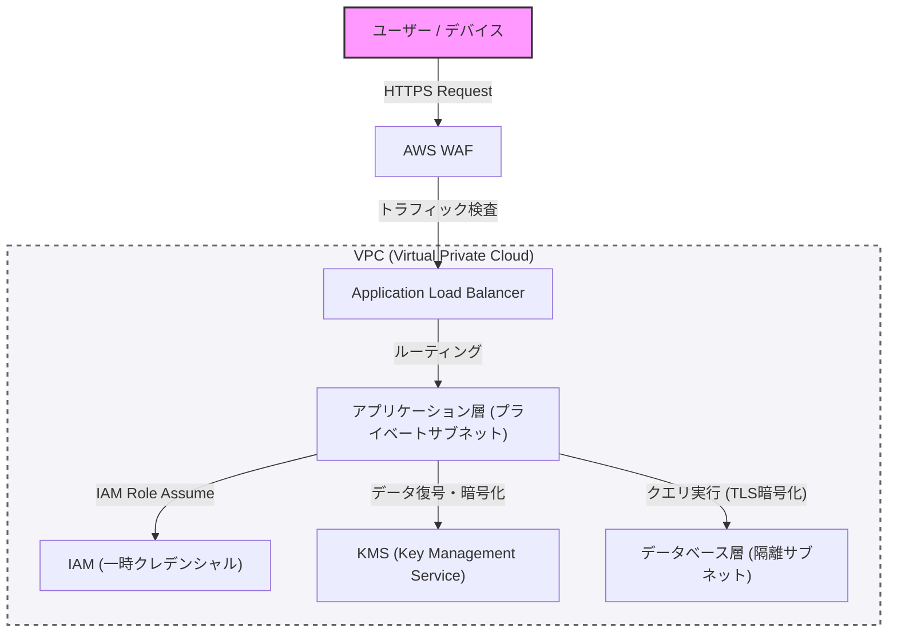

In modern system construction, security is not something to be added as an afterthought, but a core element that should be built in from the initial design phase. In this article, based on the concepts of defensive programming and "Zero Trust", we will dive deep into best practices for building robust architectures, from network separation using VPCs, edge defense with WAFs, the Principle of Least Privilege (PoLP) with IAM, to data encryption using KMS.

## 1. Basic Concepts of Zero Trust Architecture

The perimeter defense model of the past was based on the assumption that "the internal network is secure". However, with the migration to the cloud and the spread of remote work, this assumption has collapsed.

Zero Trust Architecture (ZTA) is based on the principle of "Never trust, always verify". This is an approach that requires strict authentication and authorization for every request, regardless of whether it is inside or outside the network.

## 2. Network Separation and Defense in Depth

### Logical Separation with VPC (Virtual Private Cloud)

The first layer of defense for the system infrastructure is the logical separation of the network using a VPC. Instead of placing all resources on a flat network, subnets are divided according to their roles.

*   **Public Subnets**: Place only load balancers (such as ALBs) and NAT gateways that directly receive access from the internet.
*   **Private Subnets**: Place application servers and container clusters, and block direct access from the internet.
*   **Database Subnets**: Place databases and cache servers, allowing access only from the application layer.

By layering in this way, even if the public layer is compromised, direct damage to the database can be prevented.

### Edge Defense with WAF (Web Application Firewall)

At the network perimeter (edge), WAF is utilized to defend against attacks on the application layer. WAF filters attacks targeting common vulnerabilities listed in the OWASP Top 10, such as SQL Injection, Cross-Site Scripting (XSS), and OS Command Injection.

Additionally, by configuring rate limiting on the WAF, it is essential to protect the system from DDoS attacks and brute-force attacks.

## 3. IAM and the Principle of Least Privilege (PoLP)

Strict permission management using IAM (Identity and Access Management) is necessary for access control between the components that make up the system. What is important here is the **Principle of Least Privilege (PoLP)**.

*   **Elimination of Static Credentials**: Absolutely avoid hard-coding long-term credentials, such as access keys and secret keys, within the application.
*   **Use of Temporary Credentials**: Adopt a method where an IAM role is assigned to the instance or container running the application, and a temporary token is obtained via STS (Security Token Service) to call the API.
*   **Reducing Permission Scope**: Policies should not be powerful ones like "AmazonS3FullAccess", but rather narrowed down to the minimum necessary actions and resources, such as "only `s3:GetObject` and `s3:PutObject` for a specific prefix within a specific S3 bucket".

## 4. Data Protection: Data at Rest and Data in Transit

To maintain the confidentiality and integrity of data, appropriate encryption must be applied both when stored (Data at Rest) and when transmitted (Data in Transit).

### Data at Rest (Encryption of Stored Data)

Data stored in databases, storage (such as S3), and block volumes (such as EBS) is encrypted using KMS (Key Management Service). For particularly highly sensitive systems, Envelope Encryption is recommended. This is a method in which the "data key" that encrypts the data itself is further encrypted with a "root key (Customer Managed Key: CMK)" managed by KMS. This makes it possible to perform data key rotation and access control securely and efficiently.

### Data in Transit (Encryption of Transmitted Data)

All data flowing over the network is encrypted using TLS 1.2 or higher (TLS 1.3 is recommended). Enforcing encryption not only for communication from the internet but also between components within the VPC (e.g., communication from the application server to the database) is a requirement for Zero Trust.

## 5. Architectural Visualization

The following diagram is an overview of a robust system architecture that combines the components discussed so far.

## 6. Enforcing Defensive Programming

In addition to infrastructure security configurations, the application code itself must follow the principles of defensive programming.

1.  **Input Validation**: Treat all external input (user input, API responses, file reads) as untrustworthy and perform strict validation using a allowlist approach.
2.  **Secure Defaults**: System configurations and variable initialization should start from the most secure state (access denied, features disabled, etc.) and broaden permissions only when explicitly permitted.
3.  **Appropriate Error Handling**: Error messages must not include information that could allow guessing of stack traces or internal structures (such as database schema information). Return generic error messages to the user and log detailed logs only to a secure central logging infrastructure.

## Conclusion

A robust system architecture is not completed simply by introducing a single security tool. It is only realized by combining Defense in Depth, such as network control via VPC, perimeter defense via WAF, strict enforcement of least privilege via IAM, data encryption via KMS, and defensive programming.

Deeply understanding the principles of Zero Trust and embedding "verification" at every touchpoint of the system is arguably the only way to protect systems and data from today's sophisticated cyber threats.
