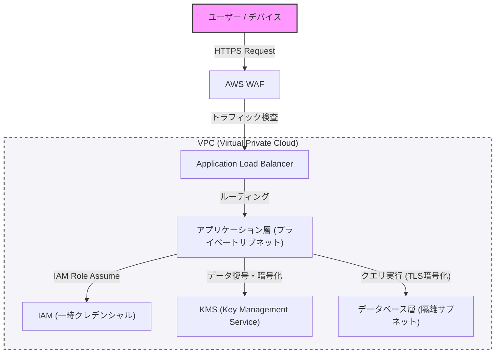

En la construcción de sistemas modernos, la seguridad no es algo que deba agregarse más tarde, sino un elemento central que debe incorporarse desde las etapas iniciales de diseño. En este artículo, basándonos en la programación defensiva y el concepto de "confianza cero" (Zero Trust), profundizaremos en las mejores prácticas para construir una arquitectura robusta, abarcando la separación de redes mediante VPC, la defensa perimetral con WAF, el principio de privilegio mínimo (PoLP) a través de IAM y el cifrado de datos utilizando KMS.

## 1. Conceptos básicos de la arquitectura de confianza cero (Zero Trust)

El antiguo modelo de defensa perimetral se basaba en la premisa de que "la red interna es segura". Sin embargo, con la migración a la nube y la popularización del trabajo remoto, esta premisa se ha desmoronado.

La arquitectura de confianza cero (ZTA) se basa en el principio de "nunca confiar, siempre verificar" (Never trust, always verify). Este es un enfoque que exige una autenticación y autorización estrictas para cada solicitud, sin importar si proviene de dentro o fuera de la red.

## 2. Separación de redes y defensa en profundidad

### Separación lógica mediante VPC (Virtual Private Cloud)

La primera capa de defensa de la infraestructura del sistema es la separación lógica de la red utilizando VPC. En lugar de colocar todos los recursos en una red plana, las subredes se dividen según su función.

*   **Subredes públicas**: Aquí se ubican únicamente los balanceadores de carga (como ALB) y gateways NAT que reciben acceso directo desde Internet.
*   **Subredes privadas**: Aquí se despliegan los servidores de aplicaciones y los clústeres de contenedores, bloqueando el acceso directo desde Internet.
*   **Subredes de bases de datos**: Aquí se ubican las bases de datos y los servidores de caché, permitiendo el acceso únicamente desde la capa de aplicaciones.

Al establecer esta estructura jerárquica, incluso si la capa pública es comprometida, se puede prevenir el daño directo a la base de datos.

### Defensa perimetral con WAF (Web Application Firewall)

En el perímetro (borde) de la red, se utiliza WAF para defenderse de los ataques a la capa de aplicación. WAF filtra los ataques que aprovechan vulnerabilidades comunes, como las enumeradas en el OWASP Top 10, incluyendo inyección SQL, Cross-Site Scripting (XSS) e inyección de comandos del sistema operativo.

Además, es fundamental proteger el sistema contra ataques DDoS y de fuerza bruta mediante la configuración de límites de velocidad (Rate Limiting) en el WAF.

## 3. IAM y el Principio de Privilegio Mínimo (PoLP)

Para controlar el acceso entre los distintos componentes que conforman el sistema, se requiere una gestión estricta de permisos mediante IAM (Identity and Access Management). Aquí es donde el **Principio de Privilegio Mínimo (Principle of Least Privilege: PoLP)** resulta crucial.

*   **Eliminación de credenciales estáticas**: Debe evitarse por completo integrar (hardcodear) en la aplicación información de autenticación a largo plazo, como claves de acceso y claves secretas.
*   **Uso de credenciales temporales**: Se adopta un enfoque en el que se asignan roles de IAM a las instancias o contenedores que ejecutan la aplicación, y se llama a las API obteniendo un token temporal a través de STS (Security Token Service).
*   **Reducción del alcance de los permisos**: Las políticas no deben ser amplias como "AmazonS3FullAccess", sino limitadas a las acciones y recursos estrictamente necesarios, por ejemplo, "solo `s3:GetObject` y `s3:PutObject` para un prefijo específico en un bucket de S3 específico".

## 4. Protección de datos: Data at Rest y Data in Transit

Para mantener la confidencialidad y la integridad de los datos, es necesario aplicar un cifrado adecuado tanto cuando los datos están almacenados (Data at Rest) como cuando están en tránsito (Data in Transit).

### Data at Rest (Cifrado de datos en reposo)

Los datos almacenados en bases de datos, almacenamiento (como S3) y volúmenes de bloques (como EBS) se cifran utilizando KMS (Key Management Service). Especialmente en sistemas altamente confidenciales, se recomienda el cifrado de sobre (Envelope Encryption). Esta es una técnica en la que la "clave de datos" que cifra los datos en sí es cifrada adicionalmente con una "clave raíz" (Clave Administrada por el Cliente: CMK) gestionada por KMS. Esto permite realizar la rotación de claves de datos y el control de acceso de manera segura y eficiente.

### Data in Transit (Cifrado de datos en tránsito)

Todos los datos que fluyen por la red se cifran utilizando TLS 1.2 o superior (se recomienda TLS 1.3). Imponer el cifrado no solo para las comunicaciones desde Internet, sino también entre los componentes dentro de la VPC (por ejemplo, la comunicación desde el servidor de aplicaciones hacia la base de datos), es un requisito fundamental de Zero Trust.

## 5. Visualización de la arquitectura

El siguiente diagrama es un resumen de la arquitectura de sistema robusta que combina los componentes explicados hasta ahora.

## 6. Adopción rigurosa de la programación defensiva

Además de la configuración de seguridad de la infraestructura, el propio código de la aplicación debe seguir los principios de la programación defensiva.

1.  **Validación de entradas**: Todas las entradas externas (entradas de usuario, respuestas de API, lectura de archivos) deben tratarse como no confiables y someterse a una validación estricta utilizando listas blancas.
2.  **Valores predeterminados seguros**: La configuración del sistema y los valores iniciales de las variables deben comenzar en el estado más seguro (acceso denegado, función deshabilitada, etc.) y los permisos solo deben ampliarse cuando se autorice explícitamente.
3.  **Manejo adecuado de errores**: Los mensajes de error no deben incluir trazas de pila (stack traces) ni información que permita deducir la estructura interna (como información del esquema de la base de datos). A los usuarios se les debe devolver un mensaje de error genérico, mientras que los registros detallados solo deben registrarse en una plataforma de registro centralizada y segura.

## Conclusión

Una arquitectura de sistema robusta no se logra simplemente implementando una única herramienta de seguridad. Se hace realidad por primera vez al combinar una defensa en profundidad (Defense in Depth) que incluye el control de red mediante VPC, la defensa perimetral con WAF, la aplicación rigurosa del privilegio mínimo con IAM, el cifrado de datos con KMS y la programación defensiva.

Comprender profundamente los principios de Zero Trust e incorporar la "verificación" en cada punto de contacto del sistema es, sin duda, la única forma de proteger los sistemas y los datos de las avanzadas amenazas cibernéticas modernas.
