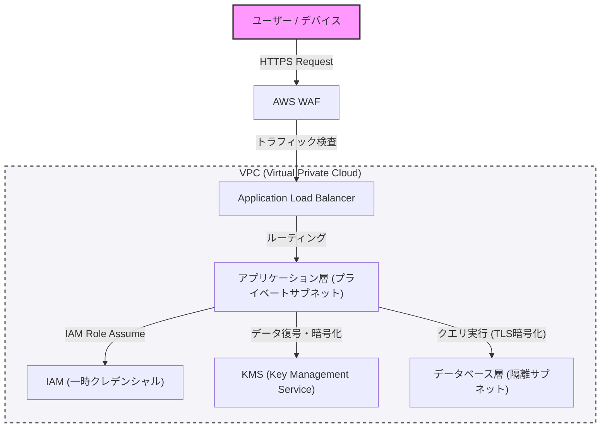

Dans la conception de systèmes modernes, la sécurité n'est pas quelque chose que l'on ajoute après coup, mais un élément central qui doit être intégré dès les premières phases de la conception. Cet article approfondit les meilleures pratiques pour construire une architecture robuste, en se basant sur les concepts de programmation défensive et de "zéro confiance", depuis la ségrégation réseau avec des VPC, la défense en périphérie avec des WAF, le principe du moindre privilège (PoLP) via l'IAM, jusqu'au chiffrement des données à l'aide de KMS.

## 1. Concept fondamental de l'architecture Zéro Confiance

L'ancien modèle de défense périmétrique reposait sur l'hypothèse que "le réseau interne de l'entreprise est sûr". Cependant, avec la migration vers le cloud et la généralisation du télétravail, ce postulat s'est effondré.

L'architecture Zéro Confiance (ZTA) repose sur le principe "Ne jamais faire confiance, toujours vérifier" (Never trust, always verify). Il s'agit d'une approche qui exige une authentification et une autorisation strictes pour chaque requête, qu'elle provienne de l'intérieur ou de l'extérieur du réseau.

## 2. Ségrégation réseau et défense en profondeur

### Ségrégation logique via VPC (Virtual Private Cloud)

La première couche de défense de l'infrastructure d'un système est la ségrégation logique du réseau à l'aide de VPC. Au lieu de placer toutes les ressources sur un réseau plat, les sous-réseaux sont divisés en fonction de leur rôle.

*   **Sous-réseau public** : N'héberge que les équilibreurs de charge (tels que les ALB) et les passerelles NAT qui reçoivent un accès direct depuis Internet.
*   **Sous-réseau privé** : Héberge les serveurs d'application et les clusters de conteneurs, et bloque tout accès direct depuis Internet.
*   **Sous-réseau de base de données** : Héberge les bases de données et les serveurs de cache, en n'autorisant l'accès que depuis la couche applicative.

Cette stratification permet d'éviter des dommages directs à la base de données dans le cas improbable où la couche publique serait compromise.

### Défense en périphérie via WAF (Web Application Firewall)

À la périphérie du réseau (edge), un WAF est utilisé pour se défendre contre les attaques ciblant la couche applicative. Le WAF filtre les attaques exploitant des vulnérabilités courantes telles que celles listées dans le Top 10 de l'OWASP : injections SQL, cross-site scripting (XSS), et injections de commandes OS.

De plus, en configurant une limitation de débit (Rate Limiting) sur le WAF, il est essentiel de protéger le système contre les attaques DDoS et les attaques par force brute.

## 3. IAM et principe du moindre privilège (PoLP)

Pour le contrôle d'accès entre les différents composants du système, une gestion stricte des permissions via l'IAM (Identity and Access Management) est requise. Le point crucial ici est le **principe du moindre privilège (Principle of Least Privilege : PoLP)**.

*   **Élimination des identifiants statiques** : Il faut absolument éviter de coder en dur des informations d'authentification à long terme, telles que les clés d'accès et les clés secrètes, dans l'application.
*   **Utilisation d'identifiants temporaires** : On attribue un rôle IAM aux instances ou aux conteneurs qui exécutent l'application, et on adopte une méthode permettant d'obtenir des jetons temporaires via le STS (Security Token Service) pour appeler les API.
*   **Réduction de la portée des permissions** : Les politiques ne doivent pas être aussi permissives qu'un « AmazonS3FullAccess », mais doivent être limitées au strict minimum d'actions et de ressources nécessaires, par exemple : « uniquement `s3:GetObject` et `s3:PutObject` pour un préfixe spécifique dans un bucket S3 spécifique ».

## 4. Protection des données : Data at Rest et Data in Transit

Pour préserver la confidentialité et l'intégrité des données, un chiffrement approprié doit être appliqué à la fois au repos (Data at Rest) et en transit (Data in Transit).

### Data at Rest (Chiffrement des données au repos)

Les données stockées dans les bases de données, le stockage (comme S3) et les volumes de blocs (comme EBS) sont chiffrées à l'aide de KMS (Key Management Service). Pour les systèmes hautement confidentiels, le chiffrement d'enveloppe (Envelope Encryption) est particulièrement recommandé. Il s'agit d'une technique où la « clé de données » qui chiffre les données elles-mêmes est à son tour chiffrée par une « clé racine (clé gérée par le client : CMK) » gérée par KMS. Cela permet d'effectuer la rotation des clés de données et le contrôle d'accès de manière sécurisée et efficace.

### Data in Transit (Chiffrement des données en transit)

Toutes les données circulant sur le réseau sont chiffrées à l'aide de TLS 1.2 ou supérieur (TLS 1.3 est recommandé). Imposer le chiffrement n'est pas seulement requis pour les communications provenant d'Internet, mais aussi pour les communications entre les composants au sein du VPC (par exemple, la communication entre un serveur d'application et une base de données), ce qui est une exigence du Zéro Confiance.

## 5. Visualisation de l'architecture

Le schéma ci-dessous présente une vue d'ensemble d'une architecture système robuste combinant les composants expliqués jusqu'à présent.

## 6. Application stricte de la programmation défensive

En plus des paramètres de sécurité de l'infrastructure, le code de l'application lui-même doit suivre les principes de la programmation défensive.

1.  **Validation des entrées** : Toutes les entrées provenant de l'extérieur (saisies des utilisateurs, réponses d'API, lectures de fichiers) doivent être traitées comme non fiables et soumises à une validation stricte sur la base d'une liste blanche.
2.  **Valeurs par défaut sécurisées** : Les configurations du système et les valeurs initiales des variables doivent démarrer dans l'état le plus sûr (accès refusé, fonctionnalité désactivée, etc.), et les permissions ne sont étendues que lorsqu'elles sont explicitement autorisées.
3.  **Gestion appropriée des erreurs** : Les messages d'erreur ne doivent jamais inclure de traces d'appels (stack traces) ou d'informations permettant de deviner la structure interne (comme les informations sur le schéma de la base de données). L'utilisateur doit recevoir un message d'erreur générique, tandis que les journaux détaillés ne sont enregistrés que sur une plateforme de journalisation centralisée et sécurisée.

## Résumé

Une architecture système robuste ne s'obtient pas simplement en introduisant un seul outil de sécurité. Elle ne se concrétise qu'en combinant une défense en profondeur (Defense in Depth) impliquant le contrôle du réseau via VPC, la défense périmétrique via WAF, l'application stricte du moindre privilège via IAM, le chiffrement des données via KMS, et enfin la programmation défensive.

Comprendre profondément les principes du Zéro Confiance et intégrer la « vérification » à chaque point de contact du système est sans doute la seule voie pour protéger les systèmes et les données contre les cybermenaces sophistiquées d'aujourd'hui.
