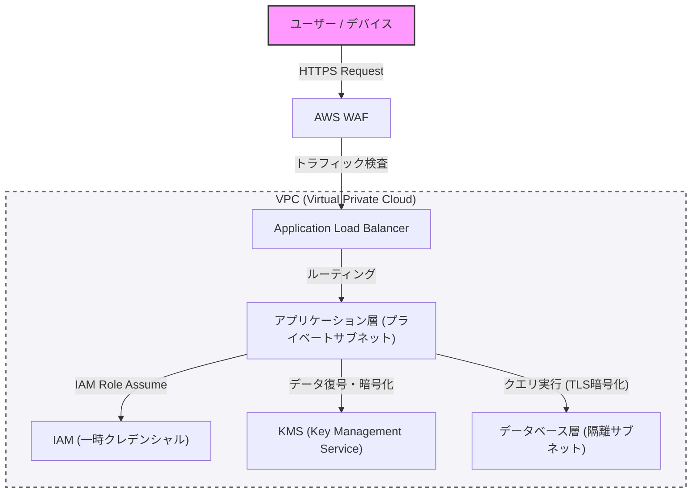

आधुनिक सिस्टम निर्माण में, सुरक्षा कोई ऐसी चीज़ नहीं है जिसे बाद में जोड़ा जाए, बल्कि यह एक मुख्य तत्व है जिसे डिज़ाइन के प्रारंभिक चरण से ही शामिल किया जाना चाहिए। इस लेख में, डिफेंसिव प्रोग्रामिंग (Defensive Programming) और "जीरो ट्रस्ट" (Zero Trust) की अवधारणा को आधार मानते हुए, VPC द्वारा नेटवर्क अलगाव (Network Isolation), WAF द्वारा एज सुरक्षा (Edge Defense), IAM द्वारा न्यूनतम विशेषाधिकार के सिद्धांत (PoLP), और KMS का उपयोग करके डेटा के एन्क्रिप्शन तक, एक मजबूत आर्किटेक्चर के निर्माण के लिए सर्वोत्तम प्रथाओं (Best Practices) पर गहराई से चर्चा की जाएगी।

## 1. जीरो ट्रस्ट आर्किटेक्चर की मूल अवधारणा

पहले के परिधि रक्षा मॉडल (Perimeter Model) में, यह "कॉर्पोरेट नेटवर्क सुरक्षित है" धारणा पर आधारित था। हालाँकि, क्लाउड की ओर प्रवासन और रिमोट वर्क के प्रसार के साथ, यह धारणा ढह गई है।

जीरो ट्रस्ट आर्किटेक्चर (ZTA) "कभी भरोसा न करें, हमेशा सत्यापित करें (Never trust, always verify)" के सिद्धांत पर आधारित है। यह एक ऐसा दृष्टिकोण है जो नेटवर्क के अंदर या बाहर की परवाह किए बिना हर अनुरोध के लिए सख्त प्रमाणीकरण (Authentication) और प्राधिकरण (Authorization) की मांग करता है।

## 2. नेटवर्क अलगाव और सुरक्षा की बहु-स्तरीयता

### VPC (Virtual Private Cloud) द्वारा तार्किक अलगाव

सिस्टम इन्फ्रास्ट्रक्चर की पहली रक्षा परत VPC का उपयोग करके नेटवर्क का तार्किक अलगाव है। सभी संसाधनों को एक सपाट नेटवर्क में रखने के बजाय, हम भूमिकाओं के अनुसार सबनेट (Subnet) को विभाजित करते हैं।

*   **पब्लिक सबनेट**: यहाँ केवल लोड बैलेंसर (जैसे ALB) और NAT गेटवे रखे जाते हैं जो सीधे इंटरनेट से एक्सेस प्राप्त करते हैं।
*   **प्राइवेट सबनेट**: यहाँ एप्लिकेशन सर्वर और कंटेनर क्लस्टर रखे जाते हैं, और इंटरनेट से सीधे एक्सेस को अवरुद्ध कर दिया जाता है।
*   **डेटाबेस सबनेट**: यहाँ डेटाबेस और कैश सर्वर रखे जाते हैं, और केवल एप्लिकेशन परत (Application Layer) से एक्सेस की अनुमति होती है।

इस तरह स्तरीकरण करके, यदि सार्वजनिक परत से कोई छेड़छाड़ होती है, तो भी डेटाबेस को सीधे नुकसान से बचाया जा सकता है।

### WAF (Web Application Firewall) द्वारा एज सुरक्षा

नेटवर्क की परिधि (Edge) पर, WAF का लाभ उठाकर एप्लिकेशन लेयर पर हमलों से बचाव किया जाता है। WAF सामान्य कमजोरियों का फायदा उठाने वाले हमलों को फ़िल्टर करता है जैसे कि SQL इंजेक्शन, क्रॉस-साइट स्क्रिप्टिंग (XSS), और OS कमांड इंजेक्शन, जिन्हें OWASP Top 10 में सूचीबद्ध किया गया है।

इसके अतिरिक्त, WAF में रेट लिमिटिंग (Rate Limiting) को कॉन्फ़िगर करके, सिस्टम को DDoS हमलों और ब्रूट-फोर्स हमलों से बचाना भी अनिवार्य है।

## 3. IAM और न्यूनतम विशेषाधिकार का सिद्धांत (PoLP)

सिस्टम बनाने वाले प्रत्येक घटक के बीच एक्सेस नियंत्रण के लिए, IAM (Identity and Access Management) के माध्यम से सख्त विशेषाधिकार प्रबंधन की आवश्यकता होती है। यहाँ महत्वपूर्ण बात **न्यूनतम विशेषाधिकार का सिद्धांत (Principle of Least Privilege: PoLP)** है।

*   **स्थैतिक क्रेडेंशियल्स का निष्कासन**: एक्सेस कुंजी (Access Key) और गुप्त कुंजी (Secret Key) जैसी दीर्घकालिक प्रमाणीकरण जानकारी को एप्लिकेशन के भीतर हार्ड-कोड करने से हर हाल में बचा जाना चाहिए।
*   **अस्थायी क्रेडेंशियल्स का उपयोग**: उन इंस्टेंस या कंटेनरों को IAM भूमिकाएँ (Roles) सौंपें जो एप्लिकेशन चला रहे हैं, और API कॉल करने के लिए STS (Security Token Service) के माध्यम से अस्थायी टोकन प्राप्त करने की विधि अपनाएं।
*   **विशेषाधिकार का दायरा सीमित करना**: नीतियां (Policies) "AmazonS3FullAccess" जैसी शक्तिशाली नहीं होनी चाहिए, बल्कि उन्हें "विशिष्ट S3 बकेट में विशिष्ट उपसर्ग (Prefix) के लिए केवल `s3:GetObject` और `s3:PutObject`" जैसे आवश्यक न्यूनतम कार्यों और संसाधनों तक सीमित किया जाना चाहिए।

## 4. डेटा की सुरक्षा: Data at Rest और Data in Transit

डेटा की गोपनीयता और अखंडता बनाए रखने के लिए, स्टोरेज के समय (Data at Rest) और संचार के समय (Data in Transit) दोनों पर उचित एन्क्रिप्शन लागू करना आवश्यक है।

### Data at Rest (संग्रहीत डेटा का एन्क्रिप्शन)

डेटाबेस, स्टोरेज (जैसे S3), और ब्लॉक वॉल्यूम (जैसे EBS) में सहेजे गए डेटा को KMS (Key Management Service) का उपयोग करके एन्क्रिप्ट किया जाता है। विशेष रूप से अत्यधिक संवेदनशील सिस्टम में, लिफाफा एन्क्रिप्शन (Envelope Encryption) की सिफारिश की जाती है। यह एक ऐसी तकनीक है जिसमें डेटा को एन्क्रिप्ट करने वाली "डेटा कुंजी (Data Key)" को KMS द्वारा प्रबंधित "रूट कुंजी (कस्टमर मैनेज्ड की: CMK)" के साथ आगे एन्क्रिप्ट किया जाता है। यह डेटा कुंजी के रोटेशन और एक्सेस कंट्रोल को सुरक्षित और कुशलतापूर्वक करने में सक्षम बनाता है।

### Data in Transit (संचार डेटा का एन्क्रिप्शन)

नेटवर्क पर प्रवाहित होने वाले सभी डेटा को TLS 1.2 या उच्चतर (TLS 1.3 अनुशंसित) का उपयोग करके एन्क्रिप्ट किया जाता है। न केवल इंटरनेट से संचार में, बल्कि VPC के भीतर घटकों के बीच (उदाहरण के लिए: एप्लिकेशन सर्वर से डेटाबेस तक संचार) भी एन्क्रिप्शन को लागू करना जीरो ट्रस्ट की आवश्यकता है।

## 5. आर्किटेक्चर का विज़ुअलाइज़ेशन

नीचे दिया गया चित्र अब तक चर्चा किए गए घटकों को मिलाकर एक मजबूत सिस्टम आर्किटेक्चर का अवलोकन है।

## 6. डिफेंसिव प्रोग्रामिंग का कड़ाई से पालन

इन्फ्रास्ट्रक्चर की सुरक्षा सेटिंग्स के अलावा, एप्लिकेशन कोड को भी स्वयं डिफेंसिव प्रोग्रामिंग के सिद्धांतों का पालन करना चाहिए।

1.  **इनपुट का सत्यापन**: बाहरी इनपुट (उपयोगकर्ता इनपुट, API प्रतिक्रियाएं, फ़ाइल पढ़ना) सभी को अविश्वसनीय (Untrusted) माना जाना चाहिए, और वाइटलिस्ट प्रारूप का उपयोग करके सख्त सत्यापन (Validation) किया जाना चाहिए।
2.  **सुरक्षित डिफ़ॉल्ट मान**: सिस्टम सेटिंग्स और चर (Variables) के प्रारंभिक मान सबसे सुरक्षित स्थिति (एक्सेस अस्वीकृत, सुविधा अक्षम, आदि) से शुरू होने चाहिए, और केवल तभी विशेषाधिकार बढ़ाएं जब स्पष्ट रूप से अनुमति दी गई हो।
3.  **उचित त्रुटि प्रबंधन**: त्रुटि संदेशों (Error Messages) में स्टैक ट्रेस या ऐसी जानकारी शामिल नहीं होनी चाहिए जो आंतरिक संरचना का अनुमान लगा सके (जैसे डेटाबेस की स्कीमा जानकारी)। उपयोगकर्ताओं को सामान्य त्रुटि संदेश लौटाएं, और विस्तृत लॉग केवल एक सुरक्षित केंद्रीय लॉगिंग इन्फ्रास्ट्रक्चर में रिकॉर्ड करें।

## निष्कर्ष

एक मजबूत सिस्टम आर्किटेक्चर केवल एक सुरक्षा उपकरण लागू करके पूरा नहीं होता है। यह केवल VPC के माध्यम से नेटवर्क नियंत्रण, WAF के माध्यम से परिधि रक्षा, IAM के माध्यम से न्यूनतम विशेषाधिकार के सख्त पालन, KMS के माध्यम से डेटा एन्क्रिप्शन, और डिफेंसिव प्रोग्रामिंग जैसी बहुस्तरीय रक्षा (Defense in Depth) के संयोजन से ही प्राप्त होता है।

जीरो ट्रस्ट के सिद्धांत को गहराई से समझना और सिस्टम के हर संपर्क बिंदु पर "सत्यापन (Verification)" को शामिल करना आधुनिक उन्नत साइबर खतरों से सिस्टम और डेटा की रक्षा करने का एकमात्र तरीका कहा जा सकता है।
