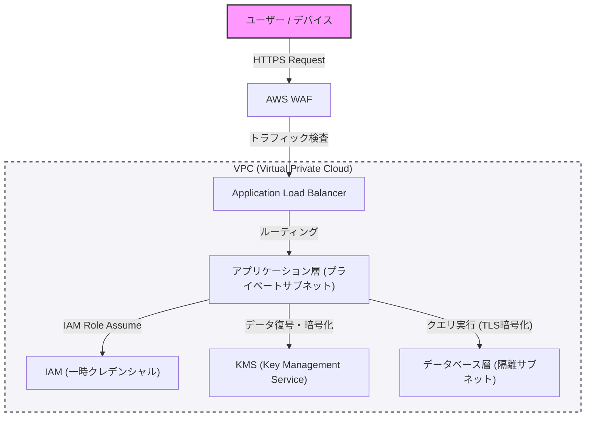

Dalam pembangunan sistem modern, keamanan bukanlah sesuatu yang ditambahkan belakangan, melainkan sebuah elemen inti yang harus diintegrasikan sejak tahap awal desain. Artikel ini akan mendalami praktik terbaik untuk membangun arsitektur yang tangguh, dengan asumsi konsep pemrograman defensif dan "zero trust", mulai dari isolasi jaringan dengan VPC, pertahanan tepi (edge) dengan WAF, prinsip hak akses istimewa minimal (PoLP) dengan IAM, hingga enkripsi data menggunakan KMS.

## 1. Konsep Dasar Arsitektur Zero Trust

Model pertahanan perimeter di masa lalu didasarkan pada asumsi bahwa "jaringan internal perusahaan aman". Namun, dengan migrasi ke cloud dan meluasnya tren kerja jarak jauh (remote work), asumsi ini telah runtuh.

Arsitektur Zero Trust (ZTA) didasarkan pada prinsip "jangan pernah percaya, selalu verifikasi (Never trust, always verify)". Ini adalah pendekatan yang menuntut otentikasi dan otorisasi yang ketat untuk setiap permintaan, baik dari dalam maupun dari luar jaringan.

## 2. Isolasi Jaringan dan Pertahanan Berlapis (Defense in Depth)

### Isolasi Logis menggunakan VPC (Virtual Private Cloud)

Lapisan pertahanan pertama dari infrastruktur sistem adalah isolasi jaringan secara logis menggunakan VPC. Daripada menempatkan semua sumber daya dalam satu jaringan datar (flat network), subnet dibagi berdasarkan perannya.

*   **Subnet Publik**: Hanya menempatkan load balancer (seperti ALB) atau NAT gateway yang menerima akses langsung dari internet.
*   **Subnet Privat**: Menempatkan server aplikasi atau kluster kontainer, dan memblokir akses langsung dari internet.
*   **Subnet Basis Data**: Menempatkan server basis data atau cache, dan hanya mengizinkan akses dari lapisan aplikasi.

Dengan melakukan hierarki seperti ini, bahkan jika lapisan publik disusupi, kerusakan langsung pada basis data dapat dicegah.

### Pertahanan Tepi (Edge Defense) menggunakan WAF (Web Application Firewall)

Di batas jaringan (tepi/edge), WAF dimanfaatkan untuk mempertahankan serangan pada lapisan aplikasi (application layer). WAF memfilter serangan yang mengeksploitasi kerentanan umum seperti yang tercantum dalam OWASP Top 10, termasuk SQL Injection, Cross-Site Scripting (XSS), dan OS Command Injection.

Selain itu, menetapkan pembatasan laju (Rate Limiting) pada WAF juga sangat penting untuk melindungi sistem dari serangan DDoS atau serangan brute-force.

## 3. IAM dan Prinsip Hak Akses Istimewa Minimal (PoLP)

Untuk mengontrol akses di antara setiap komponen yang membentuk sistem, diperlukan manajemen hak akses yang ketat menggunakan IAM (Identity and Access Management). Hal yang paling penting di sini adalah **Prinsip Hak Akses Istimewa Minimal (Principle of Least Privilege: PoLP)**.

*   **Penghapusan Kredensial Statis**: Menuliskan (hardcode) informasi otentikasi jangka panjang secara langsung di dalam aplikasi, seperti access key atau secret key, harus dihindari dengan segala cara.
*   **Penggunaan Kredensial Sementara**: Memberikan peran (IAM role) kepada instans atau kontainer yang menjalankan aplikasi, dan mengadopsi metode untuk memperoleh token sementara melalui STS (Security Token Service) sebelum memanggil API.
*   **Pengurangan Ruang Lingkup Hak Akses**: Kebijakan (policy) tidak boleh terlalu kuat seperti "AmazonS3FullAccess", melainkan harus dipersempit pada aksi dan sumber daya seminimal mungkin yang diperlukan, misalnya "hanya `s3:GetObject` dan `s3:PutObject` untuk prefiks tertentu di dalam bucket S3 tertentu".

## 4. Perlindungan Data: Data at Rest dan Data in Transit

Untuk menjaga kerahasiaan dan integritas data, penting untuk menerapkan enkripsi yang sesuai baik pada saat data disimpan (Data at Rest) maupun pada saat data ditransmisikan (Data in Transit).

### Data at Rest (Enkripsi Data yang Disimpan)

Data yang disimpan dalam basis data, penyimpanan (seperti S3), atau block volume (seperti EBS) dienkripsi menggunakan KMS (Key Management Service). Terutama pada sistem dengan kerahasiaan tinggi, Enkripsi Amplop (Envelope Encryption) sangat direkomendasikan. Ini adalah teknik di mana "kunci data (data key)" yang digunakan untuk mengenkripsi data itu sendiri, dienkripsi lagi menggunakan "kunci akar (root key / Customer Managed Key: CMK)" yang dikelola oleh KMS. Dengan demikian, rotasi kunci data atau kontrol akses dapat dilakukan dengan aman dan efisien.

### Data in Transit (Enkripsi Data dalam Perjalanan)

Semua data yang mengalir di jaringan harus dienkripsi menggunakan TLS 1.2 atau lebih tinggi (direkomendasikan TLS 1.3). Tidak hanya untuk komunikasi dari internet, namun mewajibkan enkripsi pada komunikasi antar komponen di dalam VPC (misalnya: komunikasi dari server aplikasi ke basis data) juga merupakan persyaratan utama dari zero trust.

## 5. Visualisasi Arsitektur

Gambar di bawah ini merupakan gambaran arsitektur sistem yang tangguh dengan menggabungkan komponen-komponen yang telah dijelaskan sejauh ini.

## 6. Penerapan Pemrograman Defensif secara Menyeluruh

Selain dari konfigurasi keamanan infrastruktur, kode aplikasi itu sendiri juga harus mematuhi prinsip pemrograman defensif.

1.  **Validasi Input**: Semua input dari luar (input pengguna, respons API, pembacaan file) harus diperlakukan sebagai sesuatu yang tidak dapat dipercaya, dan validasi yang ketat menggunakan format daftar putih (whitelist) harus dilakukan.
2.  **Nilai Default yang Aman (Secure by Default)**: Pengaturan sistem atau nilai awal variabel harus dimulai dari keadaan yang paling aman (akses ditolak, fitur dinonaktifkan, dll.), dan hak akses hanya diperluas ketika diizinkan secara eksplisit.
3.  **Penanganan Error yang Tepat (Proper Error Handling)**: Pesan error tidak boleh mengandung informasi yang memungkinkan seseorang menebak struktur internal atau stack trace (seperti informasi skema basis data). Kembalikan pesan error umum kepada pengguna, dan catat log terperinci hanya di infrastruktur pencatatan log (log platform) pusat yang aman.

## Kesimpulan

Arsitektur sistem yang tangguh tidak dapat diselesaikan hanya dengan memperkenalkan satu alat keamanan saja. Hal ini baru dapat direalisasikan dengan menggabungkan pertahanan berlapis (Defense in Depth) seperti kontrol jaringan menggunakan VPC, pertahanan tepi dengan WAF, penerapan hak akses istimewa minimal secara menyeluruh dengan IAM, enkripsi data dengan KMS, dan pemrograman defensif.

Memahami prinsip zero trust secara mendalam dan menyematkan "verifikasi" di setiap titik kontak sistem dapat dikatakan sebagai satu-satunya jalan untuk melindungi sistem dan data dari ancaman siber yang canggih di era modern ini.
