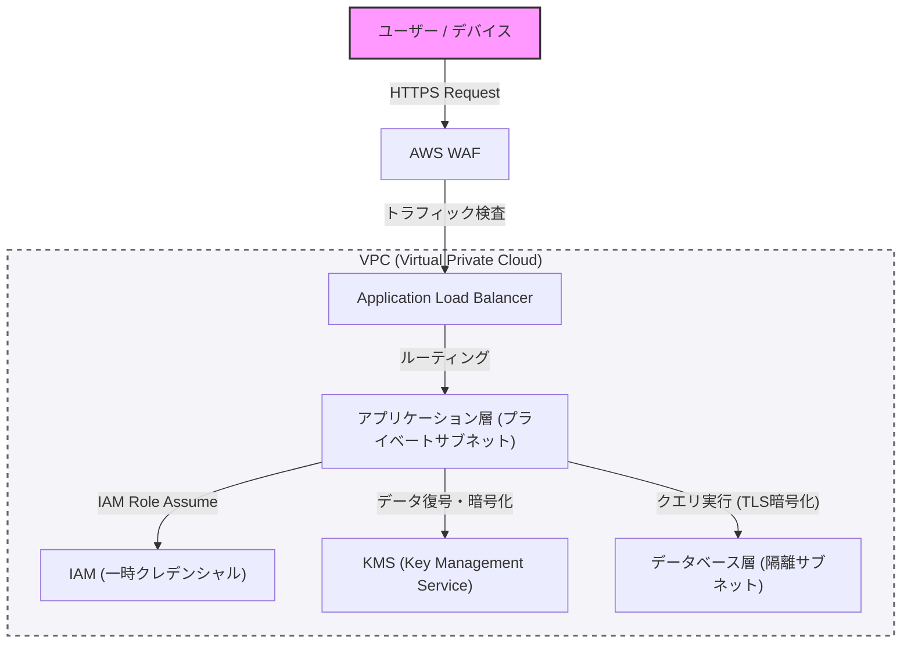

현대의 시스템 구축에서 보안은 나중에 추가하는 것이 아니라 설계의 초기 단계부터 통합되어야 하는 핵심적인 요소입니다. 본 기사에서는 방어적 프로그래밍과 '제로 트러스트' 개념을 전제로, VPC를 통한 네트워크 분리, WAF를 통한 엣지 방어, IAM을 통한 최소 권한의 원칙(PoLP), 그리고 KMS를 사용한 데이터 암호화까지, 견고한 아키텍처를 구축하기 위한 베스트 프랙티스를 깊이 있게 파헤칩니다.

## 1. 제로 트러스트 아키텍처의 기본 개념

과거의 경계 방어 모델(페리미터 모델)에서는 '사내 네트워크는 안전하다'라는 전제를 기반으로 했습니다. 하지만 클라우드로의 전환과 원격 근무의 보급으로 인해 이 전제는 무너졌습니다.

제로 트러스트 아키텍처(ZTA)는 '절대 신뢰하지 말고 항상 검증하라(Never trust, always verify)'라는 원칙을 바탕으로 합니다. 이는 네트워크의 안팎을 불문하고 모든 요청에 대해 엄격한 인증과 인가를 요구하는 접근 방식입니다.

## 2. 네트워크 분리와 방어의 다층화

### VPC(Virtual Private Cloud)를 통한 논리적 분리

시스템 인프라의 첫 번째 방어 계층은 VPC를 사용한 네트워크의 논리적 분리입니다. 모든 리소스를 평면적인 네트워크에 배치하는 것이 아니라, 역할에 따라 서브넷을 분할합니다.

*   **퍼블릭 서브넷**: 인터넷으로부터의 접근을 직접 받는 로드 밸런서(ALB 등)나 NAT 게이트웨이만을 배치합니다.
*   **프라이빗 서브넷**: 애플리케이션 서버나 컨테이너 클러스터를 배치하고, 인터넷으로부터의 직접적인 접근을 차단합니다.
*   **데이터베이스 서브넷**: 데이터베이스나 캐시 서버를 배치하고, 애플리케이션 계층에서만 접근을 허용합니다.

이렇게 계층화함으로써, 만에 하나 퍼블릭 계층이 침해되더라도 데이터베이스에 대한 직접적인 피해를 막을 수 있습니다.

### WAF(Web Application Firewall)를 통한 엣지 방어

네트워크의 경계(엣지)에서는 WAF를 활용하여 애플리케이션 계층에 대한 공격을 방어합니다. WAF는 SQL 인젝션, 크로스 사이트 스크립팅(XSS), OS 명령 인젝션 등 OWASP Top 10에 꼽히는 일반적인 취약점을 노리는 공격을 필터링합니다.

또한, WAF에 속도 제한(Rate Limiting)을 설정하여 DDoS 공격이나 무차별 대입 공격으로부터 시스템을 보호하는 것도 필수적입니다.

## 3. IAM과 최소 권한의 원칙(PoLP)

시스템을 구성하는 각 컴포넌트 간의 접근 제어에는 IAM(Identity and Access Management)을 통한 엄격한 권한 관리가 필요합니다. 여기서 중요한 것이 **최소 권한의 원칙(Principle of Least Privilege: PoLP)**입니다.

*   **정적 크리덴셜의 배제**: 액세스 키나 시크릿 키 등 장기적인 인증 정보를 애플리케이션 내에 하드코딩하는 것은 절대적으로 피해야 합니다.
*   **임시 크리덴셜의 사용**: 애플리케이션을 실행하는 인스턴스나 컨테이너에 IAM 역할을 부여하고, STS(Security Token Service)를 통해 임시 토큰을 얻어 API를 호출하는 방식을 채택합니다.
*   **권한 범위 축소**: 정책은 'AmazonS3FullAccess'와 같이 강력한 것이 아니라, '특정 S3 버킷 내의 특정 접두사에 대한 `s3:GetObject` 및 `s3:PutObject`만'과 같이 필요한 최소한의 작업과 리소스로 좁혀야 합니다.

## 4. 데이터 보호: Data at Rest 및 Data in Transit

데이터의 기밀성과 무결성을 유지하기 위해서는 저장 시(Data at Rest)와 통신 시(Data in Transit) 모두 적절한 암호화를 적용해야 합니다.

### Data at Rest(저장 데이터 암호화)

데이터베이스, 스토리지(S3 등), 블록 볼륨(EBS 등)에 저장되는 데이터는 KMS(Key Management Service)를 사용하여 암호화합니다. 특히 기밀성이 높은 시스템에서는 봉투 암호화(Envelope Encryption)가 권장됩니다. 이는 데이터 자체를 암호화하는 '데이터 키'를 KMS에서 관리하는 '루트 키(고객 관리형 키: CMK)'로 한 번 더 암호화하는 기법입니다. 이를 통해 데이터 키의 교체나 접근 제어를 안전하고 효율적으로 수행할 수 있습니다.

### Data in Transit(통신 데이터 암호화)

네트워크 상으로 흐르는 모든 데이터는 TLS 1.2 이상(권장 사항은 TLS 1.3)을 사용하여 암호화합니다. 인터넷으로부터의 통신뿐만 아니라 VPC 내의 컴포넌트 간(예: 애플리케이션 서버에서 데이터베이스로의 통신)에서도 암호화를 강제하는 것이 제로 트러스트의 요구 사항입니다.

## 5. 아키텍처의 시각화

아래 그림은 지금까지 설명한 컴포넌트들을 결합한 견고한 시스템 아키텍처의 개요입니다.

## 6. 방어적 프로그래밍의 철저

인프라스트럭처의 보안 설정에 더하여, 애플리케이션 코드 자체도 방어적 프로그래밍의 원칙을 따라야 합니다.

1.  **입력 검증**: 외부로부터의 입력(사용자 입력, API 응답, 파일 읽기)은 모두 신뢰할 수 없는 것으로 취급하고, 화이트리스트 방식으로 엄격한 유효성 검사를 수행합니다.
2.  **안전한 기본값**: 시스템의 설정이나 변수의 초기값은 가장 안전한 상태(접근 거부, 기능 비활성화 등)에서 시작하며, 명시적으로 허용된 경우에만 권한을 확대합니다.
3.  **적절한 오류 처리**: 오류 메시지에 스택 트레이스나 내부 구조를 추측할 수 있는 정보(데이터베이스의 스키마 정보 등)를 포함해서는 안 됩니다. 사용자에게는 일반적인 오류 메시지를 반환하고, 상세한 로그는 안전한 중앙 로그 인프라에만 기록합니다.

## 요약

견고한 시스템 아키텍처는 단일 보안 도구를 도입하는 것만으로 완성되는 것이 아닙니다. VPC를 통한 네트워크 제어, WAF를 통한 경계 방어, IAM을 통한 최소 권한의 철저, KMS를 통한 데이터 암호화, 그리고 방어적 프로그래밍과 같은 다층적인 방어(Defense in Depth)를 결합함으로써 비로소 실현됩니다.

제로 트러스트의 원칙을 깊이 이해하고, 시스템의 모든 접점에서 '검증'을 통합하는 것이 현대의 고도화된 사이버 위협으로부터 시스템과 데이터를 보호하기 위한 유일한 방법이라고 할 수 있을 것입니다.
