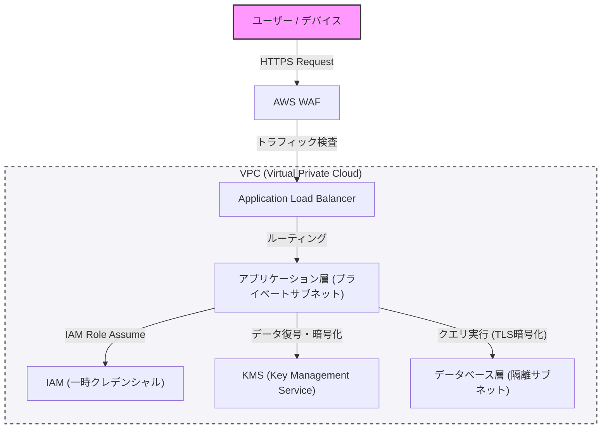

現代のシステム構築において、セキュリティは後から追加するものではなく、設計の初期段階から組み込まれるべき中核的な要素です。本記事では、防御的プログラミングと「ゼロトラスト」の概念を前提とし、VPCによるネットワーク分離、WAFによるエッジ防御、IAMによる最小権限の原則（PoLP）、そしてKMSを用いたデータの暗号化まで、堅牢なアーキテクチャを構築するためのベストプラクティスを深掘りします。

## 1. ゼロトラストアーキテクチャの基本概念

かつての境界防御モデル（ペリメタモデル）では、「社内ネットワークは安全である」という前提に基づいていました。しかし、クラウドへの移行とリモートワークの普及により、この前提は崩壊しました。

ゼロトラストアーキテクチャ（ZTA）は、「決して信頼せず、常に検証する（Never trust, always verify）」という原則に基づいています。これは、ネットワークの内外を問わず、あらゆるリクエストに対して厳密な認証と認可を要求するアプローチです。

## 2. ネットワーク分離と防御の多層化

### VPC（Virtual Private Cloud）による論理的分離

システム基盤の最初の防御層は、VPCを用いたネットワークの論理的な分離です。すべてのリソースをフラットなネットワークに配置するのではなく、役割に応じてサブネットを分割します。

*   **パブリックサブネット**: インターネットからのアクセスを直接受けるロードバランサー（ALBなど）やNATゲートウェイのみを配置します。
*   **プライベートサブネット**: アプリケーションサーバーやコンテナクラスタを配置し、インターネットからの直接アクセスを遮断します。
*   **データベースサブネット**: データベースやキャッシュサーバーを配置し、アプリケーション層からのみアクセスを許可します。

このように階層化することで、万が一パブリック層が侵害された場合でも、データベースへの直接的な被害を防ぐことができます。

### WAF（Web Application Firewall）によるエッジ防御

ネットワークの境界（エッジ）では、WAFを活用してアプリケーションレイヤーへの攻撃を防御します。WAFは、SQLインジェクション、クロスサイトスクリプティング（XSS）、OSコマンドインジェクションなど、OWASP Top 10に挙げられるような一般的な脆弱性を突く攻撃をフィルタリングします。

また、WAFにレート制限（Rate Limiting）を設定することで、DDoS攻撃やブルートフォース攻撃からシステムを保護することも不可欠です。

## 3. IAMと最小権限の原則（PoLP）

システムを構成する各コンポーネント間のアクセス制御には、IAM（Identity and Access Management）による厳格な権限管理が必要です。ここで重要なのが**最小権限の原則（Principle of Least Privilege: PoLP）**です。

*   **静的クレデンシャルの排除**: アクセスキーやシークレットキーなどの長期的な認証情報をアプリケーション内にハードコードすることは絶対に避けます。
*   **一時的なクレデンシャルの利用**: アプリケーションを実行するインスタンスやコンテナに対してIAMロールを付与し、STS（Security Token Service）を通じて一時的なトークンを取得してAPIを呼び出す方式を採用します。
*   **権限のスコープ縮小**: ポリシーは「AmazonS3FullAccess」のような強力なものではなく、「特定のS3バケット内の特定のプレフィックスに対する`s3:GetObject`および`s3:PutObject`のみ」といった具合に、必要最小限のアクションとリソースに絞り込みます。

## 4. データの保護：Data at Rest と Data in Transit

データの機密性と完全性を保つためには、保存時（Data at Rest）と通信時（Data in Transit）の両方で適切な暗号化を施す必要があります。

### Data at Rest（保存データの暗号化）

データベース、ストレージ（S3など）、ブロックボリューム（EBSなど）に保存されるデータは、KMS（Key Management Service）を用いて暗号化します。特に機密性の高いシステムでは、エンベロープ暗号化（Envelope Encryption）が推奨されます。これは、データそのものを暗号化する「データキー」を、さらにKMSで管理される「ルートキー（カスタマー管理型キー：CMK）」で暗号化する手法です。これにより、データキーのローテーションやアクセス制御をセキュアかつ効率的に行うことが可能になります。

### Data in Transit（通信データの暗号化）

ネットワーク上を流れるすべてのデータは、TLS 1.2以上（推奨はTLS 1.3）を使用して暗号化します。インターネットからの通信だけでなく、VPC内のコンポーネント間（例：アプリケーションサーバーからデータベースへの通信）においても、暗号化を強制することがゼロトラストの要件となります。

## 5. アーキテクチャの視覚化

以下の図は、ここまで解説したコンポーネントを組み合わせた堅牢なシステムアーキテクチャの概要です。

## 6. 防御的プログラミングの徹底

インフラストラクチャのセキュリティ設定に加えて、アプリケーションコード自体も防御的プログラミングの原則に従う必要があります。

1.  **入力の検証**: 外部からの入力（ユーザー入力、APIレスポンス、ファイル読み込み）はすべて信頼できないものとして扱い、ホワイトリスト形式で厳密なバリデーションを行います。
2.  **安全なデフォルト値**: システムの設定や変数の初期値は、最も安全な状態（アクセス拒否、機能無効など）から開始し、明示的に許可された場合のみ権限を広げます。
3.  **適切なエラーハンドリング**: エラーメッセージにスタックトレースや内部構造を推測できる情報（データベースのスキーマ情報など）を含めてはなりません。ユーザーには一般的なエラーメッセージを返し、詳細なログはセキュアな中央ログ基盤にのみ記録します。

## まとめ

堅牢なシステムアーキテクチャは、単一のセキュリティツールを導入するだけで完成するものではありません。VPCによるネットワーク制御、WAFによる境界防御、IAMによる最小権限の徹底、KMSによるデータ暗号化、そして防御的プログラミングといった多層的な防御（Defense in Depth）を組み合わせることで、初めて実現されます。

ゼロトラストの原則を深く理解し、システムのあらゆる接点で「検証」を組み込むことが、現代の高度なサイバー脅威からシステムとデータを守るための唯一の道と言えるでしょう。
