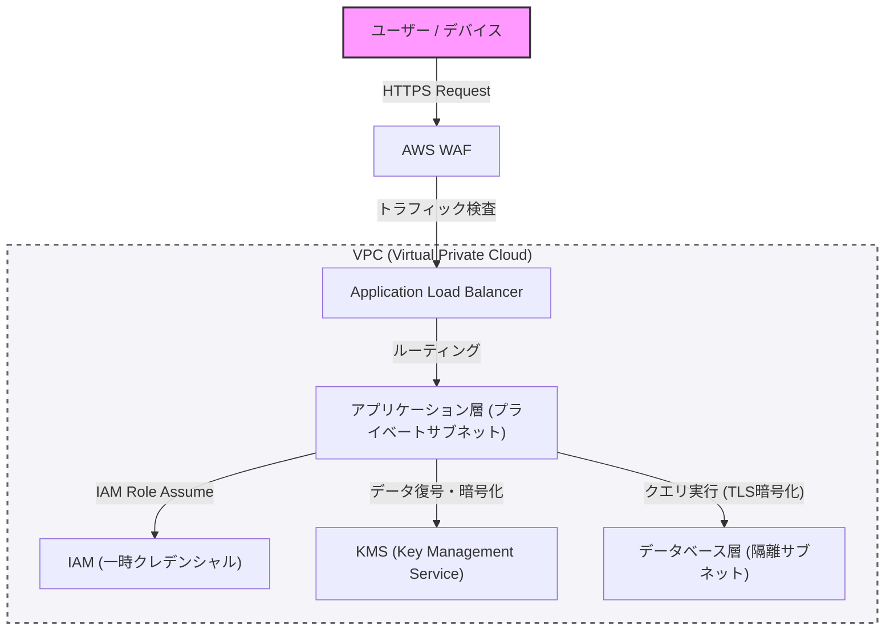

Na construção de sistemas modernos, a segurança não é algo a ser adicionado posteriormente, mas sim um elemento central que deve ser incorporado desde as fases iniciais do projeto. Neste artigo, assumindo os conceitos de programação defensiva e "zero trust", vamos nos aprofundar nas melhores práticas para a construção de uma arquitetura robusta, desde o isolamento de rede via VPC, a defesa de borda com WAF, o princípio do menor privilégio (PoLP) através do IAM e a criptografia de dados com o KMS.

## 1. Conceito Básico da Arquitetura Zero Trust

No modelo de defesa de perímetro do passado, assumia-se que "a rede corporativa é segura". No entanto, com a migração para a nuvem e a popularização do trabalho remoto, essa premissa entrou em colapso.

A arquitetura zero trust (ZTA) baseia-se no princípio de "nunca confiar, sempre verificar" (Never trust, always verify). É uma abordagem que requer autenticação e autorização rigorosas para todas as solicitações, não importando se vêm de dentro ou fora da rede.

## 2. Isolamento de Rede e Defesa em Profundidade

### Isolamento Lógico usando VPC (Virtual Private Cloud)

A primeira camada de defesa da infraestrutura do sistema é o isolamento lógico da rede usando VPC. Em vez de colocar todos os recursos em uma rede plana, dividimos a rede em sub-redes com base em suas funções.

*   **Sub-rede Pública**: Hospeda apenas os balanceadores de carga (como ALB) ou gateways NAT, que recebem acesso direto da internet.
*   **Sub-rede Privada**: Hospeda os servidores de aplicação ou clusters de contêineres, bloqueando o acesso direto a partir da internet.
*   **Sub-rede de Banco de Dados**: Hospeda os bancos de dados ou servidores de cache, permitindo o acesso apenas a partir da camada de aplicação.

Ao hierarquizar desta forma, mesmo na improvável eventualidade da camada pública ser comprometida, é possível evitar danos diretos ao banco de dados.

### Defesa de Borda usando WAF (Web Application Firewall)

Na borda da rede (edge), utilizamos o WAF para nos defender contra ataques na camada de aplicação. O WAF filtra ataques que exploram vulnerabilidades comuns, como as listadas no OWASP Top 10, como Injeção de SQL (SQL Injection), Cross-Site Scripting (XSS) e Injeção de Comando no SO.

Além disso, é essencial proteger o sistema contra ataques DDoS e de força bruta através da configuração de limitação de taxa (Rate Limiting) no WAF.

## 3. IAM e o Princípio do Menor Privilégio (PoLP)

Para o controle de acesso entre cada componente que forma o sistema, um rigoroso gerenciamento de permissões através do IAM (Identity and Access Management) é necessário. O que é importante aqui é o **Princípio do Menor Privilégio (Principle of Least Privilege: PoLP)**.

*   **Eliminação de Credenciais Estáticas**: Evite absolutamente incluir informações de autenticação de longo prazo, como chaves de acesso ou chaves secretas (hardcoded) no aplicativo.
*   **Utilização de Credenciais Temporárias**: Adote a abordagem de atribuir funções (IAM roles) às instâncias ou contêineres que executam os aplicativos, e obtenha tokens temporários através do STS (Security Token Service) para invocar APIs.
*   **Redução do Escopo de Permissões**: As políticas não devem ser amplas como "AmazonS3FullAccess", mas devem ser restritas às ações e recursos mínimos necessários, como "apenas `s3:GetObject` e `s3:PutObject` para um prefixo específico dentro de um bucket S3 específico".

## 4. Proteção de Dados: Data at Rest e Data in Transit

Para manter a confidencialidade e integridade dos dados, é necessário aplicar a criptografia apropriada tanto em repouso (Data at Rest) quanto em trânsito (Data in Transit).

### Data at Rest (Criptografia de Dados em Repouso)

Os dados armazenados em bancos de dados, armazenamento (como S3) e volumes de bloco (como EBS) são criptografados usando o KMS (Key Management Service). Especialmente em sistemas altamente sensíveis, a criptografia de envelope (Envelope Encryption) é recomendada. Esta é uma técnica que criptografa a "chave de dados" que criptografa os próprios dados, com uma "chave raiz (Customer Managed Key: CMK)" adicionalmente gerenciada pelo KMS. Isso permite rotacionar a chave de dados e fazer o controle de acesso de forma segura e eficiente.

### Data in Transit (Criptografia de Dados em Trânsito)

Todos os dados trafegados na rede são criptografados usando o TLS 1.2 ou superior (recomendado TLS 1.3). Forçar a criptografia não apenas para as comunicações pela internet, mas também para as comunicações entre componentes dentro de uma VPC (por exemplo, a comunicação de um servidor de aplicação para um banco de dados) é um requisito do zero trust.

## 5. Visualização da Arquitetura

O diagrama abaixo é uma visão geral de uma arquitetura de sistema robusta combinando os componentes que foram explicados até aqui.

## 6. Implementação Rigorosa de Programação Defensiva

Além da configuração de segurança da infraestrutura, o próprio código do aplicativo também deve seguir os princípios da programação defensiva.

1.  **Validação de Entradas**: Trate todas as entradas externas (entrada do usuário, respostas de API, leitura de arquivos) como não confiáveis e realize validações rigorosas em um formato de lista branca (whitelist).
2.  **Valores Padrão Seguros**: As configurações iniciais de variáveis ou do sistema devem começar no estado mais seguro (acesso negado, função desativada etc.) e ampliar os privilégios apenas se explicitamente permitido.
3.  **Tratamento de Erros Apropriado**: As mensagens de erro não devem conter rastreamento de pilha (stack trace) ou informações que permitam deduzir a estrutura interna (como informações de esquema de banco de dados). Retorne uma mensagem de erro genérica para o usuário e registre logs detalhados apenas em um sistema de infraestrutura central de logs seguro.

## Conclusão

Uma arquitetura de sistema robusta não é alcançada apenas com a introdução de uma única ferramenta de segurança. Ela só é realizada através da combinação de defesa em profundidade (Defense in Depth), como o controle de rede via VPC, defesa de borda usando WAF, implementação rigorosa do menor privilégio com IAM, criptografia de dados com KMS e a programação defensiva.

Compreender profundamente os princípios do zero trust e incorporar a "verificação" em todos os pontos de contato do sistema é possivelmente a única forma de proteger os sistemas e dados contra as ameaças cibernéticas sofisticadas de hoje.
