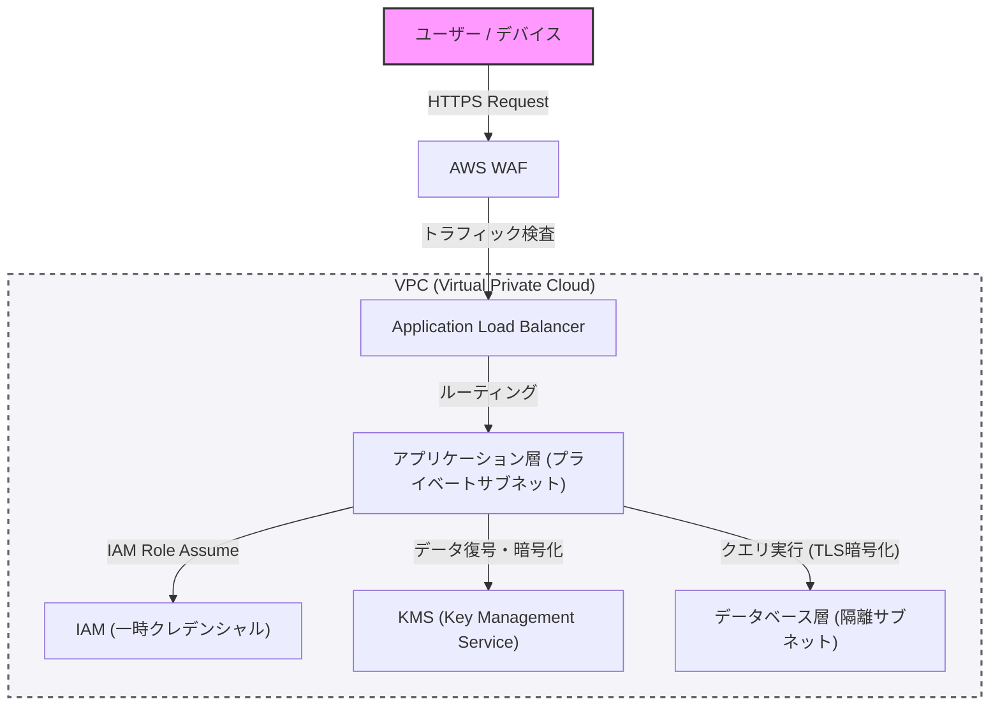

В современных процессах разработки систем безопасность не должна быть чем-то, что добавляется постфактум — это ключевой элемент, который необходимо интегрировать с самых ранних этапов проектирования. В этой статье, основываясь на концепции защитного программирования и модели 'нулевого доверия' (Zero Trust), мы подробно рассмотрим лучшие практики для построения надежной архитектуры: от сетевой изоляции с использованием VPC, защиты на периферии с помощью WAF и применения принципа наименьших привилегий (PoLP) через IAM, до шифрования данных с помощью KMS.

## 1. Базовые концепции архитектуры нулевого доверия

Традиционная модель защиты периметра основывалась на предположении, что 'внутренняя сеть компании безопасна'. Однако с переходом в облако и распространением удаленной работы это предположение перестало быть актуальным.

Архитектура нулевого доверия (ZTA) базируется на принципе 'никогда не доверяй, всегда проверяй' (Never trust, always verify). Это подход, который требует строгой аутентификации и авторизации для любого запроса, независимо от того, исходит ли он изнутри сети или снаружи.

## 2. Сетевая изоляция и многоуровневая защита

### Логическая изоляция с помощью VPC (Virtual Private Cloud)

Первый уровень защиты системной инфраструктуры — это логическая изоляция сети с использованием VPC. Вместо того чтобы размещать все ресурсы в плоской сети, они распределяются по подсетям в зависимости от их роли.

*   **Публичные подсети**: Здесь размещаются только те компоненты, которые принимают прямой трафик из интернета, например балансировщики нагрузки (такие как ALB) и NAT-шлюзы.
*   **Приватные подсети**: Здесь располагаются серверы приложений или кластеры контейнеров, при этом прямой доступ из интернета блокируется.
*   **Подсети баз данных**: Здесь находятся базы данных и серверы кэширования, а доступ разрешен только со стороны уровня приложений.

Такое разделение на уровни гарантирует, что даже в случае компрометации публичного уровня базы данных будут защищены от прямого урона.

### Защита периметра с помощью WAF (Web Application Firewall)

На границе сети (на периферии) используется WAF для защиты от атак на уровне приложений. WAF фильтрует атаки, эксплуатирующие распространенные уязвимости из списка OWASP Top 10, такие как SQL-инъекции, межсайтовый скриптинг (XSS) и внедрение команд ОС.

Кроме того, настройка ограничения скорости (Rate Limiting) в WAF критически важна для защиты системы от DDoS-атак и попыток подбора паролей (Brute Force).

## 3. IAM и принцип наименьших привилегий (PoLP)

Для управления доступом между различными компонентами системы требуется строгий контроль полномочий с использованием IAM (Identity and Access Management). Ключевую роль здесь играет **принцип наименьших привилегий (Principle of Least Privilege: PoLP)**.

*   **Отказ от статических учетных данных**: Категорически следует избегать жесткого кодирования (хардкода) в приложениях долгосрочных учетных данных, таких как ключи доступа и секретные ключи.
*   **Использование временных учетных данных**: Назначайте роли IAM экземплярам или контейнерам, на которых работает приложение, и получайте временные токены через STS (Security Token Service) для вызова API.
*   **Сужение области действия полномочий**: Вместо предоставления широких политик, таких как 'AmazonS3FullAccess', полномочия должны быть ограничены необходимым минимумом действий и ресурсов, например: 'только `s3:GetObject` и `s3:PutObject` для определенного префикса в конкретном S3-бакете'.

## 4. Защита данных: Data at Rest и Data in Transit

Для сохранения конфиденциальности и целостности данных необходимо применять надежное шифрование как в состоянии покоя (Data at Rest), так и при передаче (Data in Transit).

### Data at Rest (Шифрование данных в состоянии покоя)

Данные, хранящиеся в базах данных, объектных хранилищах (например, S3) и блочных томах (например, EBS), шифруются с помощью KMS (Key Management Service). В системах с высокими требованиями к безопасности рекомендуется использовать конвертное шифрование (Envelope Encryption). Этот метод подразумевает шифрование 'ключа данных', которым зашифрованы сами данные, с помощью 'корневого ключа' (ключа, управляемого клиентом, CMK), управляемого в KMS. Это позволяет безопасно и эффективно выполнять ротацию ключей и управлять доступом к ним.

### Data in Transit (Шифрование данных при передаче)

Все данные, передаваемые по сети, должны быть зашифрованы с использованием TLS 1.2 или выше (рекомендуется TLS 1.3). Обязательное шифрование не только для связи через интернет, но и между компонентами внутри VPC (например, от сервера приложений к базе данных) является обязательным требованием модели нулевого доверия.

## 5. Визуализация архитектуры

На диаграмме ниже представлен обзор надежной системной архитектуры, объединяющей все рассмотренные компоненты.

## 6. Строгое соблюдение защитного программирования

Помимо настроек безопасности инфраструктуры, сам код приложения также должен следовать принципам защитного программирования.

1.  **Валидация ввода**: Любой внешний ввод (пользовательский ввод, ответы API, чтение файлов) должен рассматриваться как ненадежный и проходить строгую валидацию по принципу белого списка (whitelist).
2.  **Безопасные значения по умолчанию**: Начальные значения системных настроек и переменных должны находиться в самом безопасном состоянии (доступ запрещен, функции отключены и т. д.), а полномочия должны расширяться только в случае явного разрешения.
3.  **Надлежащая обработка ошибок**: Сообщения об ошибках не должны содержать трассировку стека или информацию, позволяющую угадать внутреннюю структуру (например, информацию о схеме базы данных). Пользователю должны возвращаться общие сообщения об ошибках, а подробные журналы должны сохраняться только в защищенной централизованной системе логирования.

## Заключение

Надежная системная архитектура не может быть построена просто за счет внедрения какого-либо одного инструмента безопасности. Она достигается только путем комбинирования многоуровневой защиты (Defense in Depth), такой как управление сетью через VPC, защита периметра с помощью WAF, строгое соблюдение принципа наименьших привилегий через IAM, шифрование данных с помощью KMS и применение методов защитного программирования.

Глубокое понимание принципов нулевого доверия и внедрение 'проверок' на всех точках взаимодействия в системе — это единственный способ защитить системы и данные от современных изощренных киберугроз.
