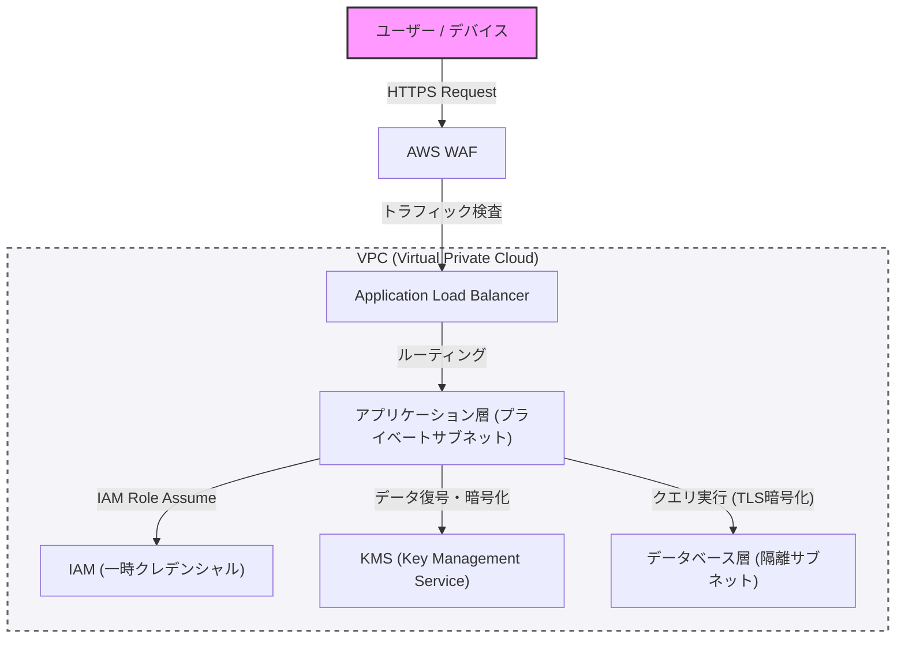

在现代的系统构建中，安全性不是事后追加的东西，而是应该从设计的初期阶段就融入的核心要素。本文将以防御性编程和“零信任”的概念为前提，深入探讨构建坚固架构的最佳实践，包括通过VPC进行的网络隔离、通过WAF进行的边缘防御、通过IAM实施的最小权限原则（PoLP），以及使用KMS进行的数据加密。

## 1. 零信任架构的基本概念

过去的边界防御模型（Perimeter Model）是建立在“公司内部网络是安全的”这一前提之上的。然而，随着向云端的迁移和远程办公的普及，这一前提已经崩溃。

零信任架构（ZTA）基于“从不信任，始终验证（Never trust, always verify）”的原则。这是一种无论在网络内部还是外部，都对所有请求要求严格认证和授权的方法。

## 2. 网络隔离与防御的多层化

### 通过 VPC（Virtual Private Cloud）进行逻辑隔离

系统基础设施的第一层防御是使用VPC进行网络的逻辑隔离。不是将所有资源部署在扁平的网络中，而是根据角色划分不同的子网。

*   **公共子网 (Public Subnet)**: 仅部署直接接受来自互联网访问的负载均衡器（如ALB）或NAT网关。
*   **私有子网 (Private Subnet)**: 部署应用服务器和容器集群，阻断来自互联网的直接访问。
*   **数据库子网 (Database Subnet)**: 部署数据库和缓存服务器，仅允许来自应用层的访问。

通过这种分层化设计，即使公共层遭到破坏，也能防止数据库受到直接的损害。

### 通过 WAF（Web Application Firewall）进行边缘防御

在网络边界（边缘），利用WAF来防御针对应用层的攻击。WAF可以过滤针对OWASP Top 10中列出的常见漏洞的攻击，如SQL注入、跨站脚本（XSS）、OS命令注入等。

此外，通过在WAF上设置速率限制（Rate Limiting），保护系统免受DDoS攻击和暴力破解攻击也是必不可少的。

## 3. IAM 与最小权限原则（PoLP）

对于构成系统的各个组件之间的访问控制，需要通过IAM（Identity and Access Management）进行严格的权限管理。这里的关键是**最小权限原则（Principle of Least Privilege: PoLP）**。

*   **消除静态凭据**: 绝对要避免在应用程序中硬编码访问密钥（Access Key）或秘密密钥（Secret Key）等长期的认证信息。
*   **利用临时凭据**: 为执行应用程序的实例或容器赋予IAM角色，采用通过STS（Security Token Service）获取临时令牌来调用API的方式。
*   **缩小权限范围**: 策略不应使用像“AmazonS3FullAccess”这样强大的权限，而是应该缩减到绝对必要的最小操作和资源，例如“仅对特定S3存储桶中特定前缀的`s3:GetObject`和`s3:PutObject`”。

## 4. 数据的保护：Data at Rest 与 Data in Transit

为了保持数据的机密性和完整性，必须在保存时（Data at Rest）和传输时（Data in Transit）都实施适当的加密。

### Data at Rest（保存数据的加密）

保存在数据库、存储（如S3）和块卷（如EBS）中的数据，应使用KMS（Key Management Service）进行加密。特别是在高度机密的系统中，推荐使用信封加密（Envelope Encryption）。这是一种将加密数据本身的“数据密钥”进一步用由KMS管理的“根密钥（客户管理型密钥：CMK）”进行加密的方法。由此，可以安全且高效地进行数据密钥的轮换和访问控制。

### Data in Transit（传输数据的加密）

在网络中流动的所有数据，都应使用TLS 1.2以上（推荐TLS 1.3）进行加密。不仅是来自互联网的通信，在VPC内的组件之间（例如：从应用服务器到数据库的通信）也强制实施加密，这是零信任的一项要求。

## 5. 架构的可视化

下图是结合了到目前为止所讲解的组件的坚固系统架构的概要。

## 6. 彻底贯彻防御性编程

除了基础设施的安全设置外，应用程序代码本身也必须遵循防御性编程的原则。

1.  **输入验证**: 将所有来自外部的输入（用户输入、API响应、文件读取）都视为不可信，并以白名单形式进行严格的验证。
2.  **安全的默认值**: 系统的设置和变量的初始值应从最安全的状态（拒绝访问、功能禁用等）开始，仅在明确被允许的情况下才扩大权限。
3.  **适当的错误处理**: 错误信息中绝不能包含能够推测出堆栈跟踪或内部结构的信息（如数据库的模式信息等）。只向用户返回一般的错误信息，详细的日志仅记录在安全的中央日志基础设施中。

## 总结

坚固的系统架构并不是仅仅通过引入单一的安全工具就能完成的。只有通过将基于VPC的网络控制、基于WAF的边界防御、基于IAM的最小权限贯彻、基于KMS的数据加密，以及防御性编程等多层防御（Defense in Depth）结合起来，才能得以实现。

可以说，深刻理解零信任的原则，在系统的所有接触点融入“验证”，是保护系统和数据免受现代高级网络威胁的唯一途径。
