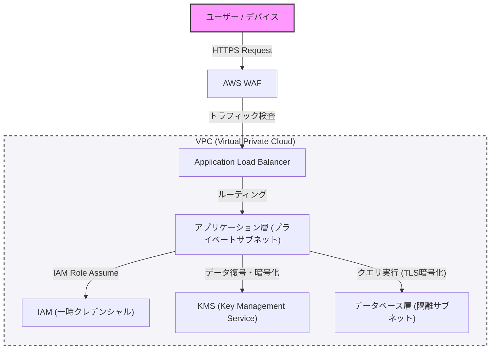

現代的系統建構中，安全性不應該是事後追加的東西，而是應該從設計的初期階段就納入的核心元素。本篇文章將以防禦性程式設計與「零信任（Zero Trust）」概念為前提，深入探討如何透過 VPC 進行網路隔離、使用 WAF 進行邊緣防禦、實施 IAM 的最小權限原則（PoLP），以及利用 KMS 進行資料加密，藉此建構出堅固架構的最佳實踐。

## 1. 零信任架構的基本概念

過去的邊界防禦模型（Perimeter Model）是建立在「公司內部網路是安全的」這個前提之上。然而，隨著系統向雲端轉移以及遠距工作的普及，這個前提已經崩潰。

零信任架構（ZTA）基於「永不信任，始終驗證（Never trust, always verify）」的原則。這是一種無論在網路內部還是外部，都對所有請求要求嚴格身分驗證與授權的方法。

## 2. 網路隔離與多層次防禦

### 透過 VPC（Virtual Private Cloud）進行邏輯隔離

系統基礎設施的第一道防禦層，是使用 VPC 將網路進行邏輯隔離。不是將所有資源放置於扁平的網路中，而是根據角色來劃分次網路（Subnet）。

*   **公有次網路（Public Subnet）**: 僅放置直接接收來自網際網路存取的負載平衡器（例如 ALB）或 NAT 閘道。
*   **私有次網路（Private Subnet）**: 放置應用程式伺服器或容器叢集，阻斷來自網際網路的直接存取。
*   **資料庫次網路（Database Subnet）**: 放置資料庫或快取伺服器，僅允許來自應用程式層的存取。

透過這樣的階層化設計，即使公有層遭到入侵，也能防止資料庫受到直接的損害。

### 透過 WAF（Web Application Firewall）進行邊緣防禦

在網路的邊界（Edge），可活用 WAF 來防禦針對應用程式層的攻擊。WAF 能過濾諸如 SQL 注入（SQL Injection）、跨站指令碼（XSS）、作業系統指令注入（OS Command Injection）等針對 OWASP Top 10 中常見漏洞的攻擊。

此外，為 WAF 設定速率限制（Rate Limiting），也是保護系統免受 DDoS 攻擊與暴力破解攻擊不可或缺的一環。

## 3. IAM 與最小權限原則（PoLP）

為了控制構成系統的各個元件之間的存取，需要透過 IAM（Identity and Access Management）進行嚴格的權限管理。這裡最重要的是**最小權限原則（Principle of Least Privilege: PoLP）**。

*   **排除靜態憑證**: 絕對要避免將存取金鑰（Access Key）或秘密金鑰（Secret Key）等長期有效的認證資訊硬編碼（Hardcode）在應用程式內。
*   **利用臨時憑證**: 應賦予執行應用程式的執行個體或容器 IAM 角色，並採用透過 STS（Security Token Service）取得臨時權杖（Token）來呼叫 API 的方式。
*   **縮小權限範圍**: 政策（Policy）不該設定為像「AmazonS3FullAccess」這種擁有強大權限的政策，而應限縮在必要的最少動作與資源上，例如「僅允許針對特定 S3 儲存體中特定前綴的 `s3:GetObject` 與 `s3:PutObject`」。

## 4. 資料保護：Data at Rest 與 Data in Transit

為了保持資料的機密性與完整性，必須在儲存時（Data at Rest）與傳輸時（Data in Transit）兩方面都實施適當的加密。

### Data at Rest（儲存資料的加密）

儲存於資料庫、儲存空間（例如 S3）、區塊儲存體（例如 EBS）中的資料，應使用 KMS（Key Management Service）進行加密。特別是在機密性較高的系統中，推薦使用信封加密（Envelope Encryption）。這是一種將用來加密資料本身的「資料金鑰（Data Key）」，再利用 KMS 所管理的「根金鑰（客戶管理型金鑰：CMK）」進行加密的手法。這使得資料金鑰的輪替與存取控制能以安全且高效率的方式進行。

### Data in Transit（傳輸資料的加密）

所有在網路上流動的資料，應使用 TLS 1.2 以上（建議為 TLS 1.3）進行加密。這不僅限於來自網際網路的通訊，即使在 VPC 內部的元件之間（例如：從應用程式伺服器到資料庫的通訊），強制加密也是零信任的要求。

## 5. 架構視覺化

下圖是結合了到目前為止所解說的各個元件，所構成之堅固系統架構的概觀。

## 6. 貫徹防禦性程式設計

除了基礎設施的安全設定外，應用程式碼本身也必須遵循防禦性程式設計的原則。

1.  **輸入驗證**: 必須將所有來自外部的輸入（使用者輸入、API 回應、檔案讀取）視為不可信，並透過白名單（Whitelist）形式進行嚴格的驗證。
2.  **安全的預設值**: 系統的設定與變數的初始值，應從最安全的狀態（拒絕存取、停用功能等）開始，僅在明確被允許的情況下才擴大權限。
3.  **適當的錯誤處理**: 錯誤訊息中絕不能包含可以推測出堆疊追蹤（Stack Trace）或內部結構的資訊（例如資料庫的綱要資訊等）。應向使用者回傳一般的錯誤訊息，並將詳細日誌僅記錄在安全的中央日誌基礎設施中。

## 總結

堅固的系統架構並非單靠導入單一的安全工具就能完成。只有結合透過 VPC 進行的網路控制、透過 WAF 進行的邊界防禦、透過 IAM 貫徹的最小權限原則、透過 KMS 進行的資料加密，以及防禦性程式設計等多層次防禦（Defense in Depth），才能真正實現。

深入理解零信任的原則，並在系統的每一個接觸點納入「驗證」，可以說是在現代高度網路威脅下，保護系統與資料的唯一途徑。
