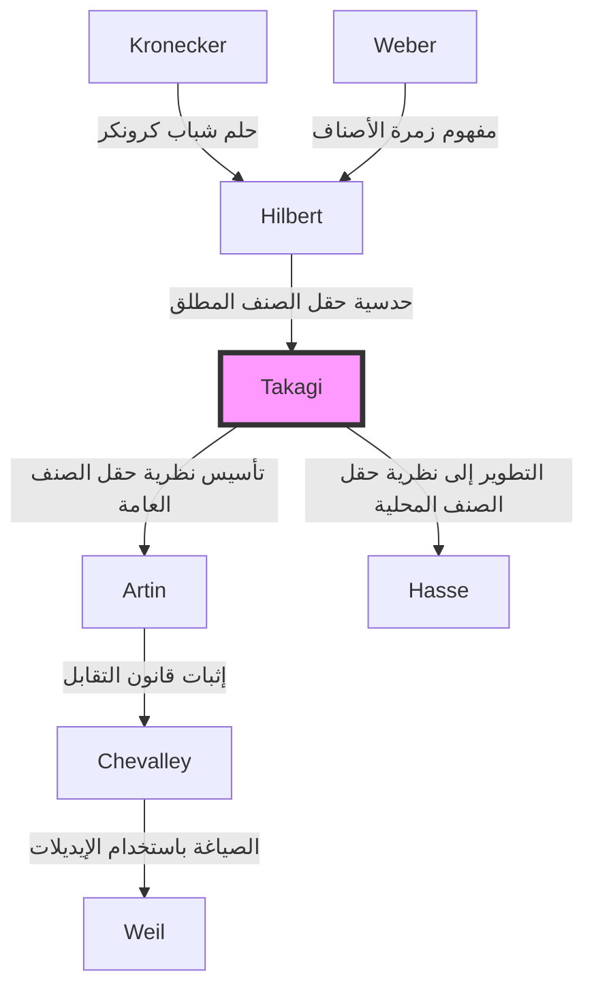

## مقدمة

واحدة من أجمل الأطر النظرية وأكثرها قوة في نظرية الأعداد الحديثة، لا سيما في نظرية الأعداد الجبرية، هي **نظرية حقل الصنف**. الشخص الذي قام بمفرده ببناء هذا النظام النظري الرائع ورفع الرياضيات اليابانية فجأة إلى أعلى مستوى في العالم كان **تيجي تاكاغي** (1875-1960).

الإنجاز الهائل الذي حققه لم يكن مجرد حل مسألة مفتوحة واحدة. لقد صوّر ببراعة المشهد الرياضي الذي حلم به العمالقة الغربيون مثل كرونكر وهيلبرت، بينما كان معزولًا في الشرق الأقصى، وبذلك أظهر المسار الذي يجب أن يتبعه المجتمع الرياضي بعد ذلك. في هذه المقالة، سنتعمق في مسار حياة تيجي تاكاغي وجوهر نظرية حقل الصنف التي أسسها.

## 1. الحياة المبكرة والوعي بالرياضيات

### من قرية زراعية في غيفو إلى الجامعة الإمبراطورية

ولد تيجي تاكاغي في عام 1875 (ميجي 8) في قرية زراعية هادئة تسمى قرية كازويا في منطقة أونو، محافظة غيفو (مدينة موتوسو الحالية). أظهر موهبة غير عادية منذ صغره، والتحق بالمدارس المحلية وتقدم إلى المدرسة المتوسطة العليا الثالثة (التي أصبحت لاحقًا المدرسة العليا الثالثة) في كيوتو. هنا، أصبح زميلًا لكيتارو نيشيدا، الذي سيقود لاحقًا العالم الفلسفي الياباني.

ثم التحق بقسم الرياضيات في كلية العلوم بالجامعة الإمبراطورية (جامعة طوكيو الآن). كانت اليابان في ذلك الوقت قد مرت عليها بضعة عقود فقط منذ استعراش ميجي، وكانت قد بدأت للتو في تبني الرياضيات الغربية الحديثة بالكامل. بتوجيه من مرشديه، دايروكو كيكوتشي وريكيتارو فوجيساوا، الذين دعموا فجر تعليم الرياضيات في اليابان، ازدهرت مواهب تاكاغي الرياضية بسرعة.

### الدراسة في الخارج والأيام في غوتينغن

في عام 1898، سافر تاكاغي إلى ألمانيا كطالب مبتعث من قبل وزارة التعليم. درس في البداية في جامعة برلين، ثم انتقل لاحقًا إلى جامعة غوتينغن، التي كانت مركز الرياضيات في العالم في ذلك الوقت.

كان في انتظاره هناك علماء رياضيات عظماء تركوا أسماءهم في تاريخ الرياضيات، مثل [ديفيد هيلبرت](https://kenji.blog/ar/p/hilbert/) وفيليكس كلاين. على وجه الخصوص، كان هيلبرت قد نشر لتوه "Zahlbericht" (تقرير حول الأعداد)، والذي كان تتويجًا لنظرية الأعداد الجبرية، وكان لمحتواه تأثير عميق على تاكاغي. تحت إشراف هيلبرت، قام بحل جزء من "حلم شباب كرونكر" (مسألة تتعلق بنظرية الضرب المركب)، وحصل على درجة الدكتوراه في عام 1903، وعاد إلى اليابان.

## 2. اختراق في العزلة: ميلاد نظرية حقل الصنف

### العزلة الأكاديمية بسبب الحرب العالمية الأولى

بعد عودته إلى اليابان، واصل تاكاغي أبحاثه الخاصة أثناء قيامه بتدريس العلماء الشباب بصفته أستاذًا في جامعة طوكيو الإمبراطورية. ومع ذلك، عندما اندلعت الحرب العالمية الأولى في عام 1914، انقطعت التبادلات الأكاديمية بين اليابان وأوروبا تمامًا. بدون تلقي أحدث الأوراق البحثية أو المجلات، لم يكن أمام تاكاغي خيار سوى تعميق أفكاره الخاصة بمفرده في مختبره.

هذه "العزلة" أصبحت بشكل مثير للسخرية التربة التي أنتجت إبداعًا عظيمًا. بدأ تاكاغي في إعادة فحص المسائل المتعلقة بالتوسعات الأبيلية النسبية التي اقترحها هيلبرت من منظوره الفريد.

### تصور نظرية حقل الصنف

كان هيلبرت قد حدس وأثبت جزئيًا وجود "حقل صنف مطلق" لحقل أعداد جبري معين $K$، وهو توسيع أبيلي أقصى غير متفرع تكون زمرة غالوا الخاصة به متماثلة مع زمرة أصناف المثاليات لـ $K$.

اعتقد تاكاغي أنه من خلال إزالة قيد "عدم التفرع" هذا، قد يظل تطابق جميل مماثل صالحًا لأي توسيع أبيلي. كانت هذه هي الفكرة الأساسية لـ **نظرية حقل الصنف** الخاصة بتاكاغي.

## 3. قمة الرياضيات: جوهر نظرية حقل الصنف

دعونا نلقي نظرة على ادعاءات نظرية حقل الصنف باستخدام الصيغ الرياضية. ضع في اعتبارك توسيعًا أبيليًا منتهيًا $L$ لحقل أعداد جبري $K$. أثبت تاكاغي أنه من خلال النظر في زمرة مثاليات التطابق $H$ ضمن زمرة المثاليات لـ $K$ والتي تستوفي شروطًا محددة، هناك تطابق واحد لواحد بين $L$ و $H$.

### مبرهنة الوجود لمبرهنة تاكاغي الأساسية

المبرهنات الرئيسية التي أثبتها تيجي تاكاغي هي كما يلي:

1. **مبرهنة التماثل**: لأي توسيع أبيلي $L/K$، توجد زمرة مثاليات تطابق مناسبة $H$ من $K$، وتكون زمرة غالوا $\text{Gal}(L/K)$ متماثلة مع زمرة القسمة $I/H$.
   
   $$ \text{Gal}(L/K) \cong I/H $$
   
   هنا، $I$ هي زمرة مثاليات بتردد معامل معين.

2. **مبرهنة الوجود**: على العكس، لأي زمرة مثاليات تطابق $H$ من $K$، يوجد دائمًا توسيع أبيلي $L$ (حقل صنف) يتوافق مع $H$.

3. **مبرهنة الانشطار الكامل**: الشرط الضروري والكافي لكي ينشطر مثالي أولي $\mathfrak{p}$ لـ $K$ بالكامل في $L$ هو أن ينتمي $\mathfrak{p}$ إلى الزمرة $H$.

يتم تضمين حدسية هيلبرت كحالة خاصة حيث يكون المعامل بديهيًا (عندما لا يكون هناك تفرع). قام تاكاغي بتعميم ذلك إلى نموذج يسمح بالتفرع العشوائي، وتأسيس نظرية كاملة فيما يتعلق بالتوسعات الأبيلية لحقول الأعداد الجبرية.

### الجمال الرياضي: تعميم مبرهنة كرونكر-فيبر

يكمن جمال نظرية حقل الصنف في توسيع **مبرهنة كرونكر-فيبر** لحقل الأعداد الكسرية $\mathbb{Q}$ إلى حقول الأعداد الجبرية العامة. تنص مبرهنة كرونكر-فيبر على أن "أي توسيع أبيلي منتهي لحقل الأعداد الكسرية محتوى في حقل جزئي من حقل دائري معين $\mathbb{Q}(\zeta_n)$".

$$ L \subset \mathbb{Q}(\zeta_n) \quad (\text{حيث } \zeta_n \text{ هو جذر بدائي من الدرجة } n \text{ للوحدة}) $$

حددت نظرية حقل الصنف لتاكاغي تمامًا نوع الحقل الذي يلعب دور الحقل الدائري عندما يتم استبدال $\mathbb{Q}$ هذا بحقل أعداد جبري عشوائي $K$.

## 4. الاعتراف العالمي وقانون التقابل لآرتين

في عام 1920، في المؤتمر الدولي لعلماء الرياضيات الذي عقد في ستراسبورغ بعد نهاية الحرب العالمية الأولى، قدم تاكاغي نظرية حقل الصنف هذه. ومع ذلك، نظرًا لأن المحتوى كان مبتكرًا للغاية في البداية، لم يتم فهمه بالكامل.

في وقت لاحق، أدى إرسال نسخة من بحثه إلى كارل سيغل في ألمانيا إلى جذب انتباه علماء الرياضيات الواعدين مثل إميل آرتين و[هيلموت هاسه](https://kenji.blog/ar/p/hasse/). فهموا على الفور عظمة نظرية تاكاغي وقدموا المزيد من الأبحاث بناءً على هذا الأساس.

على وجه الخصوص، أثبت آرتين **قانون التقابل لآرتين** باستخدام نظرية تاكاغي، وبذلك أكمل صياغة نظرية حقل الصنف. وبهذا، حُفر اسم تيجي تاكاغي إلى الأبد في تاريخ الرياضيات.

## 5. سلسلة نسب النظرية: انتشار نظرية حقل الصنف

كان لنظرية تيجي تاكاغي تأثير هائل على علماء الرياضيات اللاحقين. يظهر تسلسل النسب هذا في مخطط Mermaid أدناه.

## 6. المساهمات كمعلم والروائع

بالإضافة إلى إنجازاته الرياضية، قدم تيجي تاكاغي مساهمات لا تقدر بثمن في تعليم الرياضيات في اليابان. كانت كتبه بمثابة أناجيل لأجيال من طلاب العلوم في اليابان.

- **"مقدمة في التحليل" (Kaiseki Gairon)**: الكتاب المدرسي النهائي لحساب التفاضل والتكامل في اليابان. إنها تحفة فنية تمزج بين التطور المنطقي الصارم واللغة اليابانية الأنيقة.
- **"محاضرات في نظرية الأعداد الأولية"**: كتاب مدرسي يشرح كل شيء بدءًا من أساسيات نظرية الأعداد وحتى قانون غاوس للتقابل.
- **"حكايات تاريخية للرياضيات الحديثة"**: كتاب تاريخي يصور بوضوح مجموعة علماء الرياضيات في القرن التاسع عشر. إنه ينقل دراما التطور الرياضي.

نُقلت البذور التي زرعها إلى علماء الرياضيات اليابانيين الذين سينشطون لاحقًا في جميع أنحاء العالم، مثل [كونيهيكو كودايرا](https://kenji.blog/ar/p/kodaira-kunihiko/)، وكيوشي إيتو، علاوة على غورو شيمورا و[يوتاكا تانياما](https://kenji.blog/ar/p/taniyama-yutaka/).

## خاتمة

طور **تيجي تاكاغي** التخصص الأكاديمي للرياضيات، الذي وُلد في الغرب، بشكل فريد في دولة اليابان الشرقية، وبنى أعلى قمة نظرية في العالم. إن حياته المتمثلة في التغلب على محنة العزلة أثناء الحرب وإكمال "نظرية حقل الصنف" الرائعة بالاعتماد فقط على الفكر الخالص تعلمنا الاحتمالات اللانهائية للفكر البشري.

اليوم، تستمر المجالات التي تُطبق فيها نظرية الأعداد الجبرية، مثل التشفير والفيزياء الرياضية، في التوسع. ولا تزال إنجازات تيجي تاكاغي، الذي أرسى أساسها، تتألق عبر العصور.

