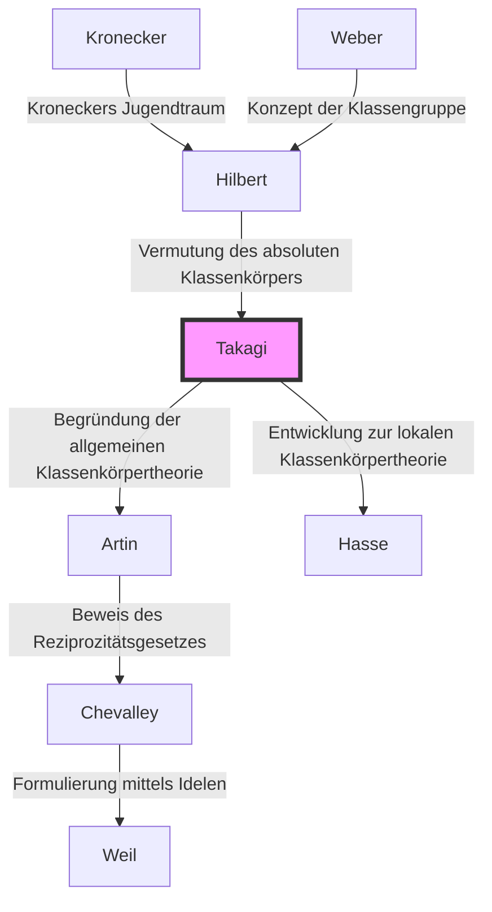

## Einleitung

Eine der schönsten und leistungsfähigsten theoretischen Strukturen der modernen Zahlentheorie, insbesondere der algebraischen Zahlentheorie, ist die **Klassenkörpertheorie**. Die Person, die dieses großartige theoretische System im Alleingang aufbaute und die japanische Mathematik schlagartig auf das höchste Weltniveau hob, war **Teiji Takagi** (1875–1960).

Die monumentale Leistung, die er vollbrachte, bestand nicht nur in der Lösung eines einzigen offenen Problems. Es gelang ihm vielmehr, die mathematische Landschaft, von der westliche Giganten wie Kronecker und Hilbert geträumt hatten, brillant zu entwerfen, während er im Fernen Osten isoliert war. Damit zeigte er der mathematischen Gemeinschaft den Weg, den sie in Zukunft beschreiten sollte. In diesem Artikel werden wir den Lebensweg von Teiji Takagi und den Kern der von ihm begründeten Klassenkörpertheorie eingehend beleuchten.

## 1. Frühes Leben und das Erwachen zur Mathematik

### Vom Bauerndorf in Gifu zur Kaiserlichen Universität

Teiji Takagi wurde 1875 (Meiji 8) in einem ruhigen Bauerndorf namens Kazuya im Landkreis Ono, Präfektur Gifu (der heutigen Stadt Motosu), geboren. Er zeigte schon in jungen Jahren außergewöhnliches Talent, durchlief die örtlichen Schulen und wechselte dann an die Dritte Höhere Mittelschule (die spätere Dritte Höhere Schule) in Kyoto. Hier wurde er Klassenkamerad von Kitaro Nishida, der später die japanische philosophische Welt anführen sollte.

Anschließend studierte er an der Abteilung für Mathematik der naturwissenschaftlichen Fakultät der Kaiserlichen Universität (der heutigen Universität Tokio). Zu dieser Zeit waren seit der Meiji-Restauration in Japan erst wenige Jahrzehnte vergangen, und man hatte gerade erst begonnen, die moderne westliche Mathematik vollständig zu übernehmen. Unter der Anleitung seiner Mentoren Dairoku Kikuchi und Rikitaro Fujisawa, die die Anfänge der Mathematikausbildung in Japan unterstützten, entfaltete Takagi rasch sein mathematisches Talent.

### Studium im Ausland und die Zeit in Göttingen

Im Jahr 1898 reiste Takagi als Auslandsstudent des Bildungsministeriums nach Deutschland. Zunächst studierte er an der Universität Berlin, wechselte dann aber an die Universität Göttingen, die zu dieser Zeit das Weltzentrum der Mathematik war.

Dort erwarteten ihn große Mathematiker, die in der Geschichte der Mathematik ihre Spuren hinterlassen haben, wie [David Hilbert](https://kenji.blog/p/hilbert/) und Felix Klein. Insbesondere Hilbert hatte gerade seinen "Zahlbericht" veröffentlicht, der den Höhepunkt der algebraischen Zahlentheorie darstellte, und dessen Inhalt einen tiefgreifenden Einfluss auf Takagi hatte. Unter Hilbert löste er einen Teil von "Kroneckers Jugendtraum" (ein Problem der Theorie der komplexen Multiplikation), erlangte 1903 seinen Doktortitel und kehrte nach Japan zurück.

## 2. Durchbruch in der Isolation: Die Geburt der Klassenkörpertheorie

### Akademische Isolation durch den Ersten Weltkrieg

Nach seiner Rückkehr nach Japan setzte Takagi seine eigenen Forschungen fort, während er als Professor an der Kaiserlichen Universität Tokio jüngere Wissenschaftler unterrichtete. Doch als 1914 der Erste Weltkrieg ausbrach, brach der akademische Austausch zwischen Japan und Europa vollständig ab. Ohne Zugang zu den neuesten Arbeiten oder Zeitschriften blieb Takagi nichts anderes übrig, als seine eigenen Gedanken allein in seinem Arbeitszimmer zu vertiefen.

Diese "Isolation" wurde ironischerweise zum Nährboden, aus dem eine großartige Schöpfung hervorging. Takagi begann, die von Hilbert vorgeschlagenen Probleme zu relativen abelschen Erweiterungen aus seiner eigenen, einzigartigen Perspektive neu zu betrachten.

### Die Konzeption der Klassenkörpertheorie

Hilbert hatte die Existenz eines "absoluten Klassenkörpers" für einen gegebenen algebraischen Zahlkörper $K$ vermutet und teilweise bewiesen. Dies ist eine maximale unverzweigte abelsche Erweiterung, deren Galoisgruppe isomorph zur Idealklassengruppe von $K$ ist.

Takagi dachte, dass durch die Aufhebung dieser Einschränkung der "Unverzweigtheit" eine ähnlich schöne Korrespondenz für jede abelsche Erweiterung gelten könnte. Dies war die Kernidee von Takagis **Klassenkörpertheorie**.

## 3. Der Höhepunkt der Mathematik: Der Kern der Klassenkörpertheorie

Betrachten wir die Aussagen der Klassenkörpertheorie anhand mathematischer Formeln. Sei $L$ eine endliche abelsche Erweiterung eines algebraischen Zahlkörpers $K$. Takagi zeigte, dass durch die Betrachtung einer Kongruenzidealgruppe $H$ innerhalb der Idealgruppe von $K$, die bestimmte Bedingungen erfüllt, eine Eins-zu-eins-Korrespondenz zwischen $L$ und $H$ besteht.

### Takagis Existenzsatz und Hauptsatz

Die wichtigsten von Teiji Takagi bewiesenen Sätze sind die folgenden:

1. **Isomorphiesatz**: Zu jeder abelschen Erweiterung $L/K$ existiert eine geeignete Kongruenzidealgruppe $H$ von $K$, und die Galoisgruppe $\text{Gal}(L/K)$ ist isomorph zur Faktorgruppe $I/H$.
   
   $$ \text{Gal}(L/K) \cong I/H $$
   
   Hierbei ist $I$ eine Idealgruppe modulo eines bestimmten Moduls.

2. **Existenzsatz**: Umgekehrt existiert zu jeder Kongruenzidealgruppe $H$ von $K$ immer eine abelsche Erweiterung $L$ (Klassenkörper), die $H$ entspricht.

3. **Zerlegungssatz**: Eine notwendige und hinreichende Bedingung dafür, dass ein Primideal $\mathfrak{p}$ von $K$ in $L$ voll zerlegt ist, besteht darin, dass $\mathfrak{p}$ zur Gruppe $H$ gehört.

Hilberts Vermutung ist als Spezialfall enthalten, bei dem der Modul trivial ist (wenn es keine Verzweigung gibt). Takagi verallgemeinerte dies auf eine Form, die beliebige Verzweigungen zulässt, und begründete damit eine vollständige Theorie der abelschen Erweiterungen algebraischer Zahlkörper.

### Mathematische Schönheit: Verallgemeinerung des Satzes von Kronecker-Weber

Die Schönheit der Klassenkörpertheorie liegt in der Ausweitung des **Satzes von Kronecker-Weber** für den Körper der rationalen Zahlen $\mathbb{Q}$ auf allgemeine algebraische Zahlkörper. Der Satz von Kronecker-Weber besagt: "Jede endliche abelsche Erweiterung des rationalen Zahlkörpers ist in einem Teilkörper eines Kreisteilungskörpers $\mathbb{Q}(\zeta_n)$ enthalten."

$$ L \subset \mathbb{Q}(\zeta_n) \quad (\text{wobei } \zeta_n \text{ eine primitive } n\text{-te Einheitswurzel ist}) $$

Takagis Klassenkörpertheorie bestimmte vollständig, welche Art von Körper die Rolle des Kreisteilungskörpers spielt, wenn dieses $\mathbb{Q}$ durch einen beliebigen algebraischen Zahlkörper $K$ ersetzt wird.

## 4. Globale Anerkennung und das Artinsche Reziprozitätsgesetz

1920, auf dem Internationalen Mathematikerkongress, der nach dem Ende des Ersten Weltkriegs in Straßburg stattfand, präsentierte Takagi diese Klassenkörpertheorie. Da der Inhalt jedoch anfangs so innovativ war, wurde er nicht vollständig verstanden.

Die spätere Zusendung eines Sonderdrucks seiner Arbeit an Carl Siegel in Deutschland weckte die Aufmerksamkeit aufstrebender Mathematiker wie Emil Artin und [Helmut Hasse](https://kenji.blog/p/hasse/). Sie verstanden sofort die Größe von Takagis Theorie und trieben auf dieser Grundlage weitere Forschungen voran.

Insbesondere bewies Artin unter Verwendung von Takagis Theorie das **Artinsche Reziprozitätsgesetz** und vollendete damit die Formulierung der Klassenkörpertheorie. Damit wurde der Name Teiji Takagi für immer in die Geschichte der Mathematik eingraviert.

## 5. Genealogie der Theorie: Die Ausbreitung der Klassenkörpertheorie

Die Theorie von Teiji Takagi hatte einen enormen Einfluss auf spätere Mathematiker. Diese Genealogie wird im folgenden Mermaid-Diagramm dargestellt.

## 6. Beiträge als Pädagoge und seine Meisterwerke

Über seine mathematischen Errungenschaften hinaus leistete Teiji Takagi unermessliche Beiträge zur Mathematikausbildung in Japan. Seine Bücher waren für Generationen von Naturwissenschaftsstudenten in Japan die Standardwerke.

- **"Einführung in die Analysis" (Kaiseki Gairon)**: Das maßgebliche Lehrbuch der Infinitesimalrechnung in Japan. Es ist ein Meisterwerk, das rigorose logische Entwicklung mit elegantem Japanisch verbindet.
- **"Vorlesungen über elementare Zahlentheorie"**: Ein Lehrbuch, das alles von den Grundlagen der Zahlentheorie bis zum quadratischen Reziprozitätsgesetz von Gauß erklärt.
- **"Historische Erzählungen der modernen Mathematik"**: Ein historisches Buch, das die Gruppe der Mathematiker im 19. Jahrhundert lebendig beschreibt. Es vermittelt die Dramatik der mathematischen Entwicklung.

Die Samen, die er säte, wurden an japanische Mathematiker weitergegeben, die später weltweit aktiv sein sollten, wie [Kunihiko Kodaira](https://kenji.blog/p/kodaira-kunihiko/), Kiyoshi Ito und darüber hinaus [Goro Shimura](https://kenji.blog/p/shimura-goro/) und [Yutaka Taniyama](https://kenji.blog/p/taniyama-yutaka/).

## Fazit

**Teiji Takagi** entwickelte die im Westen entstandene akademische Disziplin der Mathematik auf einzigartige Weise im östlichen Land Japan und baute den höchsten theoretischen Gipfel der Welt auf. Sein Leben, in dem er die Widrigkeiten der Isolation während des Krieges überwand und sich allein auf reines Denken verließ, um die großartige "Klassenkörpertheorie" zu vollenden, lehrt uns die unendlichen Möglichkeiten des menschlichen Intellekts.

Heute weiten sich die Bereiche, in denen die algebraische Zahlentheorie angewendet wird, wie die Kryptographie und die mathematische Physik, immer weiter aus. Die Errungenschaften von Teiji Takagi, der den Grundstein dafür legte, strahlen auch über seine Epoche hinaus.
