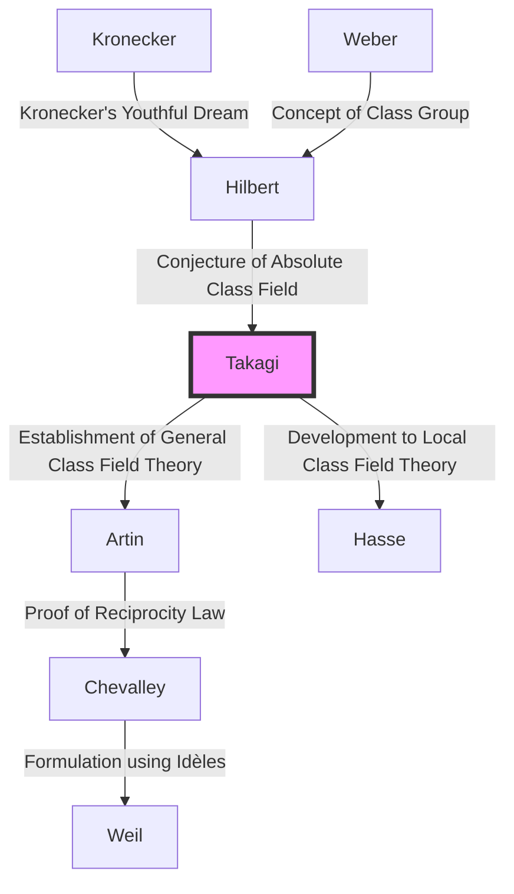

## Introduction

One of the most beautiful and powerful theoretical frameworks in modern number theory, particularly in algebraic number theory, is **Class Field Theory**. The person who single-handedly constructed this magnificent theoretical system and suddenly elevated Japanese mathematics to the world's highest standard was **Teiji [Takagi](https://kenji.blog/en/p/takagi-teiji/)** (1875–1960).

The monumental achievement he accomplished was not merely solving a single open problem. He brilliantly depicted the mathematical landscape that Western giants like [Kronecker](https://kenji.blog/en/p/kronecker/) and [Hilbert](https://kenji.blog/en/p/hilbert/) had dreamed of, while being isolated in the Far East, and thereby showed the path that the mathematical community should follow thereafter. In this article, we will delve deeply into the trajectory of Teiji [Takagi](https://kenji.blog/en/p/takagi-teiji/)'s life and the core of the Class Field Theory he established.

## 1. Early Life and Awakening to Mathematics

### From a Farming Village in Gifu to the Imperial University

Teiji [Takagi](https://kenji.blog/en/p/takagi-teiji/) was born in 1875 (Meiji 8) in a quiet farming village called Kazuya Village in Ono District, Gifu Prefecture (present-day Motosu City). Showing extraordinary talent from a young age, he went through local schools and advanced to the Third Higher Middle School (later the Third High School) in Kyoto. Here, he became classmates with Kitaro Nishida, who would later lead the Japanese philosophical world.

He then proceeded to the Department of Mathematics in the College of Science at the Imperial University (now the University of Tokyo). Japan at that time was only a few decades out of the Meiji Restoration and had just begun to fully embrace Western modern mathematics. Under the guidance of his mentors, Dairoku Kikuchi and Rikitaro Fujisawa, who supported the dawn of mathematics education in Japan, [Takagi](https://kenji.blog/en/p/takagi-teiji/) rapidly blossomed in his mathematical talents.

### Studying Abroad and Days in Göttingen

In 1898, [Takagi](https://kenji.blog/en/p/takagi-teiji/) traveled to Germany as an overseas student of the Ministry of Education. He initially studied at the University of Berlin, but later transferred to the University of Göttingen, which was the center of mathematics in the world at that time.

Waiting for him there were great mathematicians who left their names in the history of mathematics, such as [David Hilbert](https://kenji.blog/en/p/hilbert/) and Felix Klein. In particular, [Hilbert](https://kenji.blog/en/p/hilbert/) had just published his "Zahlbericht" (Report on Numbers), which was the culmination of algebraic number theory, and its contents had a profound impact on [Takagi](https://kenji.blog/en/p/takagi-teiji/). Under [Hilbert](https://kenji.blog/en/p/hilbert/), he solved a part of "[Kronecker](https://kenji.blog/en/p/kronecker/)'s Youthful Dream" (a problem concerning the theory of complex multiplication), obtained his doctorate in 1903, and returned to Japan.

## 2. Breakthrough in Isolation: The Birth of Class Field Theory

### Academic Isolation due to World War I

After returning to Japan, [Takagi](https://kenji.blog/en/p/takagi-teiji/) continued his own research while teaching younger scholars as a professor at Tokyo Imperial University. However, when World War I broke out in 1914, academic exchange between Japan and Europe was completely severed. Without receiving the latest papers or journals, [Takagi](https://kenji.blog/en/p/takagi-teiji/) had no choice but to deepen his own thoughts alone in his laboratory.

This "isolation" ironically became the soil that produced great creation. [Takagi](https://kenji.blog/en/p/takagi-teiji/) began to reexamine the problems regarding relative [Abel](https://kenji.blog/en/p/abel/)ian extensions proposed by [Hilbert](https://kenji.blog/en/p/hilbert/) from his unique perspective.

### The Conception of Class Field Theory

[Hilbert](https://kenji.blog/en/p/hilbert/) had conjectured and partially proved the existence of an "absolute class field" for a given algebraic number field $K$, which is a maximal unramified [Abel](https://kenji.blog/en/p/abel/)ian extension whose [Galois](https://kenji.blog/en/p/galois/) group is isomorphic to the ideal class group of $K$.

[Takagi](https://kenji.blog/en/p/takagi-teiji/) thought that by removing this restriction of being "unramified," a similarly beautiful correspondence might hold for any [Abel](https://kenji.blog/en/p/abel/)ian extension. This was the core idea of [Takagi](https://kenji.blog/en/p/takagi-teiji/)'s **Class Field Theory**.

## 3. The Pinnacle of Mathematics: The Core of Class Field Theory

Let's look at the claims of Class Field Theory using mathematical formulas. Consider a finite [Abel](https://kenji.blog/en/p/abel/)ian extension $L$ of an algebraic number field $K$. [Takagi](https://kenji.blog/en/p/takagi-teiji/) showed that by considering a congruence ideal group $H$ within the ideal group of $K$ that satisfies specific conditions, there is a one-to-one correspondence between $L$ and $H$.

### [Takagi](https://kenji.blog/en/p/takagi-teiji/)'s Existence Theorem and Fundamental Theorem

The main theorems proved by Teiji [Takagi](https://kenji.blog/en/p/takagi-teiji/) are as follows:

1. **Isomorphism Theorem**: For any [Abel](https://kenji.blog/en/p/abel/)ian extension $L/K$, there exists a suitable congruence ideal group $H$ of $K$, and the [Galois](https://kenji.blog/en/p/galois/) group $\text{Gal}(L/K)$ is isomorphic to the quotient group $I/H$.
   
   $$ \text{Gal}(L/K) \cong I/H $$
   
   Here, $I$ is an ideal group modulo a certain modulus.

2. **Existence Theorem**: Conversely, for any congruence ideal group $H$ of $K$, an [Abel](https://kenji.blog/en/p/abel/)ian extension $L$ (class field) corresponding to $H$ always exists.

3. **Complete Splitting Theorem**: A necessary and sufficient condition for a prime ideal $\mathfrak{p}$ of $K$ to split completely in $L$ is that $\mathfrak{p}$ belongs to the group $H$.

[Hilbert](https://kenji.blog/en/p/hilbert/)'s conjecture is included as a special case where the modulus is trivial (when there is no ramification). [Takagi](https://kenji.blog/en/p/takagi-teiji/) generalized this to a form that allows arbitrary ramification, establishing a complete theory regarding [Abel](https://kenji.blog/en/p/abel/)ian extensions of algebraic number fields.

### Mathematical Beauty: Generalization of the [Kronecker](https://kenji.blog/en/p/kronecker/)-Weber Theorem

The beauty of Class Field Theory lies in extending the **[Kronecker](https://kenji.blog/en/p/kronecker/)-Weber Theorem** for the field of rational numbers $\mathbb{Q}$ to general algebraic number fields. The [Kronecker](https://kenji.blog/en/p/kronecker/)-Weber Theorem states that "any finite [Abel](https://kenji.blog/en/p/abel/)ian extension of the rational number field is contained in a subfield of some cyclotomic field $\mathbb{Q}(\zeta_n)$."

$$ L \subset \mathbb{Q}(\zeta_n) \quad (\text{where } \zeta_n \text{ is a primitive } n\text{-th root of unity}) $$

[Takagi](https://kenji.blog/en/p/takagi-teiji/)'s Class Field Theory completely determined what kind of field plays the role of the cyclotomic field when this $\mathbb{Q}$ is replaced by an arbitrary algebraic number field $K$.

## 4. Global Recognition and Artin's Reciprocity Law

In 1920, at the International Congress of Mathematicians held in Strasbourg after the end of World War I, [Takagi](https://kenji.blog/en/p/takagi-teiji/) presented this Class Field Theory. However, because the content was so innovative at first, it was not fully understood.

Later, sending a reprint of his paper to Carl Siegel in Germany caught the attention of up-and-coming mathematicians such as Emil Artin and [Helmut Hasse](https://kenji.blog/en/p/hasse/). They immediately understood the greatness of [Takagi](https://kenji.blog/en/p/takagi-teiji/)'s theory and advanced further research based on this foundation.

In particular, Artin proved **Artin's Reciprocity Law** using [Takagi](https://kenji.blog/en/p/takagi-teiji/)'s theory, completing the formulation of Class Field Theory. With this, the name of Teiji [Takagi](https://kenji.blog/en/p/takagi-teiji/) was forever etched in the history of mathematics.

## 5. Genealogy of the Theory: The Spread of Class Field Theory

Teiji [Takagi](https://kenji.blog/en/p/takagi-teiji/)'s theory had a tremendous influence on later mathematicians. This genealogy is shown in the Mermaid diagram below.

## 6. Contributions as an Educator and Masterpieces

Beyond his mathematical achievements, Teiji [Takagi](https://kenji.blog/en/p/takagi-teiji/) made immeasurable contributions to mathematics education in Japan. His books have been the bibles for generations of science students in Japan.

- **"Introduction to Analysis" (Kaiseki Gairon)**: The definitive textbook of calculus in Japan. It is a masterpiece that blends rigorous logical development with elegant Japanese.
- **"Lectures on Elementary Number Theory"**: A textbook explaining everything from the basics of number theory to Gauss's law of reciprocity.
- **"Historical Tales of Modern Mathematics"**: A historical book that vividly depicts the ensemble of mathematicians in the 19th century. It conveys the drama of mathematical development.

The seeds he sowed were passed on to Japanese mathematicians who would later be active worldwide, such as [Kunihiko Kodaira](https://kenji.blog/en/p/kodaira-kunihiko/), [Kiyosi Ito](https://kenji.blog/en/p/ito-kiyosi/), and furthermore, [Goro Shimura](https://kenji.blog/en/p/shimura-goro/) and [Yutaka Taniyama](https://kenji.blog/en/p/taniyama-yutaka/).

## Conclusion

**Teiji [Takagi](https://kenji.blog/en/p/takagi-teiji/)** developed the academic discipline of mathematics, born in the West, uniquely in the Eastern country of Japan, and built the world's highest peak of theory. His life of overcoming the adversity of isolation during the war and completing the magnificent "Class Field Theory" relying solely on pure thought teaches us the infinite possibilities of human intellect.

Today, the fields where algebraic number theory is applied, such as cryptography and mathematical physics, continue to expand. The achievements of Teiji [Takagi](https://kenji.blog/en/p/takagi-teiji/), who laid its foundation, continue to shine beyond eras.
