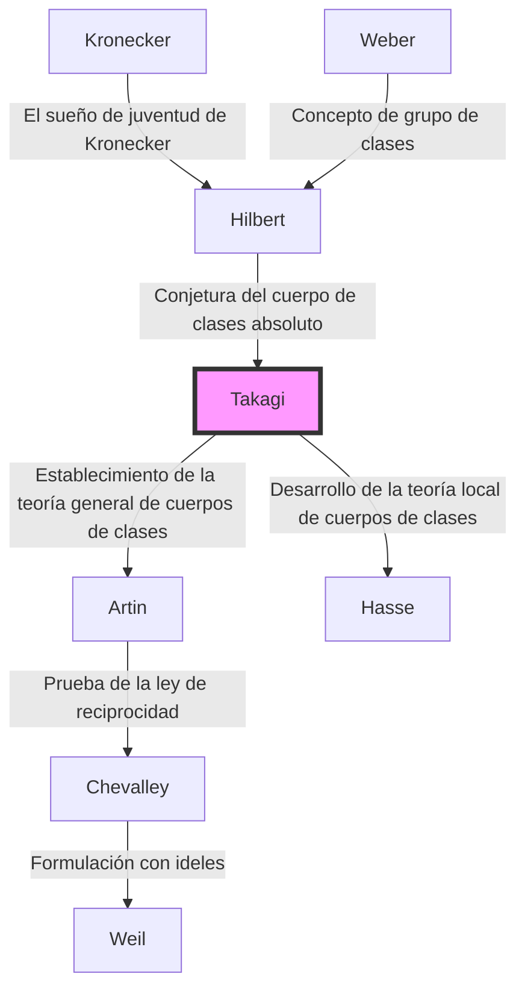

## Introducción

Uno de los marcos teóricos más hermosos y poderosos en la teoría de números moderna, particularmente en la teoría de números algebraicos, es la **teoría de cuerpos de clases**. La persona que construyó por sí sola este magnífico sistema teórico y elevó repentinamente las matemáticas japonesas al nivel mundial más alto fue **Teiji Takagi** (1875–1960).

El logro monumental que logró no consistió simplemente en resolver un solo problema abierto. Representó de manera brillante el panorama matemático con el que habían soñado gigantes occidentales como Kronecker y Hilbert, estando aislado en el Lejano Oriente, y por lo tanto mostró el camino que la comunidad matemática debería seguir a partir de entonces. En este artículo, profundizaremos en la trayectoria de la vida de Teiji Takagi y en el núcleo de la teoría de cuerpos de clases que estableció.

## 1. Vida temprana y despertar a las matemáticas

### De un pueblo agrícola en Gifu a la Universidad Imperial

Teiji Takagi nació en 1875 (año 8 de la era Meiji) en un tranquilo pueblo agrícola llamado Kazuya en el distrito de Ono, prefectura de Gifu (actual ciudad de Motosu). Mostrando un talento extraordinario desde una edad temprana, pasó por las escuelas locales y avanzó a la Tercera Escuela Secundaria Superior (más tarde la Tercera Escuela Superior) en Kioto. Aquí, se convirtió en compañero de clase de Kitaro Nishida, quien más tarde lideraría el mundo filosófico japonés.

Luego procedió al Departamento de Matemáticas en el Colegio de Ciencias de la Universidad Imperial (ahora la Universidad de Tokio). Japón en ese momento estaba a solo unas pocas décadas de la Restauración Meiji y apenas había comenzado a adoptar plenamente las matemáticas modernas occidentales. Bajo la guía de sus mentores, Dairoku Kikuchi y Rikitaro Fujisawa, quienes apoyaron los albores de la educación matemática en Japón, Takagi floreció rápidamente en sus talentos matemáticos.

### Estudios en el extranjero y días en Gotinga

En 1898, Takagi viajó a Alemania como estudiante en el extranjero del Ministerio de Educación. Inicialmente estudió en la Universidad de Berlín, pero luego se trasladó a la Universidad de Gotinga, que era el centro mundial de las matemáticas en ese momento.

Lo esperaban allí grandes matemáticos que dejaron su nombre en la historia de las matemáticas, como David Hilbert y Felix Klein. En particular, Hilbert acababa de publicar su "Zahlbericht" (Informe sobre los números), que fue la culminación de la teoría de números algebraicos, y su contenido tuvo un profundo impacto en Takagi. Bajo la dirección de Hilbert, resolvió una parte del "Sueño de juventud de Kronecker" (un problema relacionado con la teoría de la multiplicación compleja), obtuvo su doctorado en 1903 y regresó a Japón.

## 2. Un gran avance en el aislamiento: el nacimiento de la teoría de cuerpos de clases

### Aislamiento académico debido a la Primera Guerra Mundial

Después de regresar a Japón, Takagi continuó su propia investigación mientras enseñaba a académicos más jóvenes como profesor en la Universidad Imperial de Tokio. Sin embargo, cuando estalló la Primera Guerra Mundial en 1914, el intercambio académico entre Japón y Europa se cortó por completo. Sin recibir los últimos artículos o revistas, Takagi no tuvo más remedio que profundizar sus propios pensamientos a solas en su laboratorio.

Irónicamente, este "aislamiento" se convirtió en el suelo que produjo una gran creación. Takagi comenzó a reexaminar los problemas relacionados con las extensiones abelianas relativas propuestos por Hilbert desde su perspectiva única.

### La concepción de la teoría de cuerpos de clases

Hilbert había conjeturado y probado parcialmente la existencia de un "cuerpo de clases absoluto" para un cuerpo de números algebraicos dado $K$, que es una extensión abeliana máxima no ramificada cuyo grupo de Galois es isomorfo al grupo de clases de ideales de $K$.

Takagi pensó que al eliminar esta restricción de ser "no ramificada", una correspondencia igualmente hermosa podría ser válida para cualquier extensión abeliana. Esta fue la idea central de la **teoría de cuerpos de clases** de Takagi.

## 3. El pináculo de las matemáticas: el núcleo de la teoría de cuerpos de clases

Veamos las afirmaciones de la teoría de cuerpos de clases usando fórmulas matemáticas. Considere una extensión abeliana finita $L$ de un cuerpo de números algebraicos $K$. Takagi demostró que al considerar un grupo de ideales de congruencia $H$ dentro del grupo de ideales de $K$ que satisface condiciones específicas, existe una correspondencia uno a uno entre $L$ y $H$.

### Teorema de existencia y teorema fundamental de Takagi

Los principales teoremas demostrados por Teiji Takagi son los siguientes:

1. **Teorema de isomorfismo**: Para cualquier extensión abeliana $L/K$, existe un grupo de ideales de congruencia adecuado $H$ de $K$, y el grupo de Galois $\text{Gal}(L/K)$ es isomorfo al grupo cociente $I/H$.
   
   $$ \text{Gal}(L/K) \cong I/H $$
   
   Aquí, $I$ es un grupo de ideales módulo un cierto módulo.

2. **Teorema de existencia**: A la inversa, para cualquier grupo de ideales de congruencia $H$ de $K$, siempre existe una extensión abeliana $L$ (cuerpo de clases) que corresponde a $H$.

3. **Teorema de división completa**: Una condición necesaria y suficiente para que un ideal primo $\mathfrak{p}$ de $K$ se divida completamente en $L$ es que $\mathfrak{p}$ pertenezca al grupo $H$.

La conjetura de Hilbert se incluye como un caso especial donde el módulo es trivial (cuando no hay ramificación). Takagi generalizó esto a una forma que permite una ramificación arbitraria, estableciendo una teoría completa con respecto a las extensiones abelianas de los cuerpos de números algebraicos.

### Belleza matemática: generalización del teorema de Kronecker-Weber

La belleza de la teoría de cuerpos de clases radica en la extensión del **teorema de Kronecker-Weber** para el cuerpo de los números racionales $\mathbb{Q}$ a cuerpos de números algebraicos generales. El teorema de Kronecker-Weber establece que "cualquier extensión abeliana finita del cuerpo de los números racionales está contenida en un subcuerpo de algún cuerpo ciclotómico $\mathbb{Q}(\zeta_n)$".

$$ L \subset \mathbb{Q}(\zeta_n) \quad (\text{donde } \zeta_n \text{ es una raíz primitiva } n\text{-ésima de la unidad}) $$

La teoría de cuerpos de clases de Takagi determinó completamente qué tipo de cuerpo desempeña el papel del cuerpo ciclotómico cuando este $\mathbb{Q}$ se reemplaza por un cuerpo de números algebraicos arbitrario $K$.

## 4. Reconocimiento global y ley de reciprocidad de Artin

En 1920, en el Congreso Internacional de Matemáticos celebrado en Estrasburgo después del final de la Primera Guerra Mundial, Takagi presentó esta teoría de cuerpos de clases. Sin embargo, debido a que el contenido era tan innovador al principio, no se comprendió por completo.

Más tarde, el envío de una separata de su artículo a Carl Siegel en Alemania llamó la atención de matemáticos prometedores como Emil Artin y Helmut Hasse. Comprendieron de inmediato la grandeza de la teoría de Takagi y avanzaron en investigaciones posteriores basadas en esta base.

En particular, Artin demostró la **ley de reciprocidad de Artin** utilizando la teoría de Takagi, completando la formulación de la teoría de cuerpos de clases. Con esto, el nombre de Teiji Takagi quedó grabado para siempre en la historia de las matemáticas.

## 5. Genealogía de la teoría: la difusión de la teoría de cuerpos de clases

La teoría de Teiji Takagi tuvo una tremenda influencia en los matemáticos posteriores. Esta genealogía se muestra en el diagrama Mermaid a continuación.

## 6. Contribuciones como educador y obras maestras

Más allá de sus logros matemáticos, Teiji Takagi hizo contribuciones inconmensurables a la educación matemática en Japón. Sus libros han sido las biblias de generaciones de estudiantes de ciencias en Japón.

- **"Introducción al análisis" (Kaiseki Gairon)**: El libro de texto definitivo de cálculo en Japón. Es una obra maestra que combina un riguroso desarrollo lógico con un japonés elegante.
- **"Lecciones de teoría elemental de números"**: Un libro de texto que explica todo, desde los conceptos básicos de la teoría de números hasta la ley de reciprocidad de Gauss.
- **"Relatos históricos de las matemáticas modernas"**: Un libro histórico que describe vívidamente el conjunto de matemáticos del siglo XIX. Transmite el drama del desarrollo matemático.

Las semillas que sembró se transmitieron a los matemáticos japoneses que más tarde estarían activos en todo el mundo, como Kunihiko Kodaira, Kiyoshi Ito, y además, Goro Shimura y Yutaka Taniyama.

## Conclusión

**Teiji Takagi** desarrolló la disciplina académica de las matemáticas, nacida en Occidente, de forma única en el país oriental de Japón, y construyó el pico teórico más alto del mundo. Su vida de superar la adversidad del aislamiento durante la guerra y completar la magnífica "teoría de cuerpos de clases" confiando únicamente en el pensamiento puro nos enseña las infinitas posibilidades del intelecto humano.

Hoy en día, los campos donde se aplica la teoría de números algebraicos, como la criptografía y la física matemática, continúan expandiéndose. Los logros de Teiji Takagi, quien sentó sus bases, continúan brillando más allá de las épocas.
