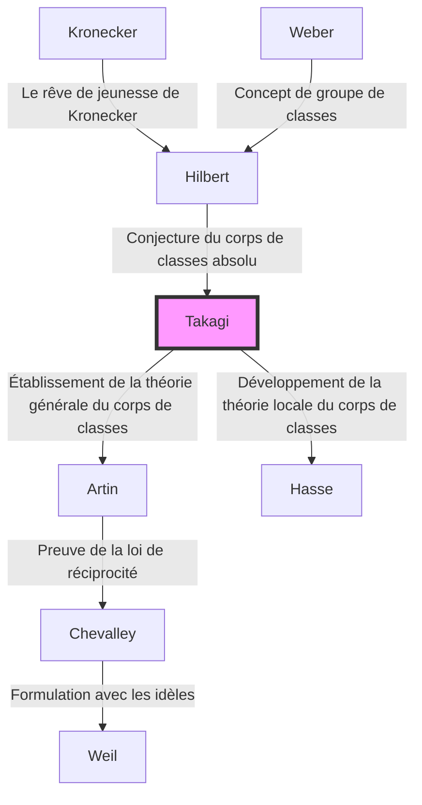

## Introduction

L'un des cadres théoriques les plus beaux et les plus puissants de la théorie des nombres moderne, en particulier dans la théorie algébrique des nombres, est la **théorie du corps de classes**. La personne qui a construit à elle seule ce magnifique système théorique et qui a soudainement élevé les mathématiques japonaises au plus haut niveau mondial fut **Teiji [Takagi](https://kenji.blog/fr/p/takagi-teiji/)** (1875-1960).

L'accomplissement monumental qu'il a réalisé ne consistait pas simplement à résoudre un problème ouvert. Il a brillamment dépeint le paysage mathématique dont rêvaient les géants occidentaux comme [Kronecker](https://kenji.blog/fr/p/kronecker/) et Hilbert, tout en étant isolé en Extrême-Orient, et a ainsi montré la voie que la communauté mathématique devait suivre par la suite. Dans cet article, nous plongerons profondément dans la trajectoire de la vie de Teiji [Takagi](https://kenji.blog/fr/p/takagi-teiji/) et au cœur de la théorie du corps de classes qu'il a établie.

## 1. Jeunesse et éveil aux mathématiques

### D'un village agricole de Gifu à l'Université Impériale

Teiji [Takagi](https://kenji.blog/fr/p/takagi-teiji/) est né en 1875 (Meiji 8) dans un paisible village agricole appelé village de Kazuya dans le district d'Ono, préfecture de Gifu (aujourd'hui la ville de Motosu). Faisant preuve d'un talent extraordinaire dès son plus jeune âge, il a fréquenté les écoles locales et a progressé jusqu'au Troisième Collège Supérieur (plus tard le Troisième Lycée) à Kyoto. Là, il est devenu le camarade de classe de Kitaro Nishida, qui allait plus tard diriger le monde philosophique japonais.

Il a ensuite poursuivi ses études au département de mathématiques du Collège des sciences de l'Université Impériale (aujourd'hui l'Université de Tokyo). À cette époque, le Japon n'était qu'à quelques décennies de la restauration de Meiji et commençait tout juste à adopter pleinement les mathématiques modernes occidentales. Sous la direction de ses mentors, Dairoku Kikuchi et Rikitaro Fujisawa, qui ont soutenu les débuts de l'enseignement des mathématiques au Japon, [Takagi](https://kenji.blog/fr/p/takagi-teiji/) a rapidement vu ses talents mathématiques s'épanouir.

### Études à l'étranger et jours à Göttingen

En 1898, [Takagi](https://kenji.blog/fr/p/takagi-teiji/) a voyagé en Allemagne en tant qu'étudiant boursier du ministère de l'Éducation. Il a d'abord étudié à l'Université de Berlin, mais a ensuite été transféré à l'Université de Göttingen, qui était à l'époque le centre mondial des mathématiques.

L'y attendaient de grands mathématiciens qui ont laissé leur nom dans l'histoire, tels que [David Hilbert](https://kenji.blog/fr/p/hilbert/) et Felix Klein. En particulier, Hilbert venait de publier son « Zahlbericht » (Rapport sur les nombres), qui était l'aboutissement de la théorie algébrique des nombres, et son contenu a eu un impact profond sur Takagi. Sous la direction de Hilbert, il a résolu une partie du « Rêve de jeunesse de [Kronecker](https://kenji.blog/fr/p/kronecker/) » (un problème concernant la théorie de la multiplication complexe), a obtenu son doctorat en 1903 et est retourné au Japon.

## 2. Percée dans l'isolement : La naissance de la théorie du corps de classes

### Isolement académique dû à la Première Guerre mondiale

Après son retour au Japon, [Takagi](https://kenji.blog/fr/p/takagi-teiji/) a poursuivi ses propres recherches tout en enseignant à de plus jeunes chercheurs en tant que professeur à l'Université impériale de Tokyo. Cependant, lorsque la Première Guerre mondiale a éclaté en 1914, les échanges universitaires entre le Japon et l'Europe ont été complètement rompus. Sans recevoir les derniers articles ni les dernières revues, [Takagi](https://kenji.blog/fr/p/takagi-teiji/) n'a eu d'autre choix que d'approfondir ses propres réflexions, seul dans son laboratoire.

Cet « isolement » est ironiquement devenu le terreau qui a produit une grande création. [Takagi](https://kenji.blog/fr/p/takagi-teiji/) a commencé à réexaminer les problèmes concernant les extensions abéliennes relatives proposés par [Hilbert](https://kenji.blog/fr/p/hilbert/), avec sa propre perspective unique.

### La conception de la théorie du corps de classes

[Hilbert](https://kenji.blog/fr/p/hilbert/) avait conjecturé et partiellement prouvé l'existence d'un « corps de classes absolu » pour un corps de nombres algébriques donné $K$, qui est une extension abélienne non ramifiée maximale dont le groupe de [Galois](https://kenji.blog/fr/p/galois/) est isomorphe au groupe des classes d'idéaux de $K$.

[Takagi](https://kenji.blog/fr/p/takagi-teiji/) pensait qu'en supprimant cette restriction de « non-ramification », une correspondance tout aussi belle pourrait valoir pour n'importe quelle extension abélienne. C'était l'idée centrale de la **théorie du corps de classes** de [Takagi](https://kenji.blog/fr/p/takagi-teiji/).

## 3. Le summum des mathématiques : Le cœur de la théorie du corps de classes

Examinons les affirmations de la théorie du corps de classes à l'aide de formules mathématiques. Considérons une extension abélienne finie $L$ d'un corps de nombres algébriques $K$. [Takagi](https://kenji.blog/fr/p/takagi-teiji/) a montré qu'en considérant un groupe d'idéaux de congruence $H$ au sein du groupe d'idéaux de $K$ qui satisfait à des conditions spécifiques, il existe une correspondance biunivoque entre $L$ et $H$.

### Théorème d'existence et théorème fondamental de [Takagi](https://kenji.blog/fr/p/takagi-teiji/)

Les principaux théorèmes prouvés par Teiji [Takagi](https://kenji.blog/fr/p/takagi-teiji/) sont les suivants :

1. **Théorème d'isomorphisme** : Pour toute extension abélienne $L/K$, il existe un groupe d'idéaux de congruence approprié $H$ de $K$, et le groupe de [Galois](https://kenji.blog/fr/p/galois/) $\text{Gal}(L/K)$ est isomorphe au groupe quotient $I/H$.
   
   $$ \text{Gal}(L/K) \cong I/H $$
   
   Ici, $I$ est un groupe d'idéaux modulo un certain module.

2. **Théorème d'existence** : Inversement, pour tout groupe d'idéaux de congruence $H$ de $K$, une extension abélienne $L$ (corps de classes) correspondant à $H$ existe toujours.

3. **Théorème de décomposition complète** : Une condition nécessaire et suffisante pour qu'un idéal premier $\mathfrak{p}$ de $K$ se décompose complètement dans $L$ est que $\mathfrak{p}$ appartienne au groupe $H$.

La conjecture de [Hilbert](https://kenji.blog/fr/p/hilbert/) est incluse comme un cas particulier où le module est trivial (lorsqu'il n'y a pas de ramification). [Takagi](https://kenji.blog/fr/p/takagi-teiji/) a généralisé cela à une forme qui permet une ramification arbitraire, établissant une théorie complète concernant les extensions abéliennes des corps de nombres algébriques.

### Beauté mathématique : Généralisation du théorème de [Kronecker](https://kenji.blog/fr/p/kronecker/)-Weber

La beauté de la théorie du corps de classes réside dans l'extension du **théorème de [Kronecker](https://kenji.blog/fr/p/kronecker/)-Weber** pour le corps des nombres rationnels $\mathbb{Q}$ aux corps de nombres algébriques généraux. Le théorème de [Kronecker](https://kenji.blog/fr/p/kronecker/)-Weber stipule que « toute extension abélienne finie du corps des nombres rationnels est contenue dans un sous-corps d'un certain corps cyclotomique $\mathbb{Q}(\zeta_n)$ ».

$$ L \subset \mathbb{Q}(\zeta_n) \quad (\text{où } \zeta_n \text{ est une racine primitive } n\text{-ième de l'unité}) $$

La théorie du corps de classes de [Takagi](https://kenji.blog/fr/p/takagi-teiji/) a complètement déterminé quel type de corps joue le rôle du corps cyclotomique lorsque ce $\mathbb{Q}$ est remplacé par un corps de nombres algébriques arbitraire $K$.

## 4. Reconnaissance mondiale et loi de réciprocité d'Artin

En 1920, lors du Congrès international des mathématiciens qui s'est tenu à Strasbourg après la fin de la Première Guerre mondiale, [Takagi](https://kenji.blog/fr/p/takagi-teiji/) a présenté cette théorie du corps de classes. Cependant, le contenu étant si novateur au départ, il n'a pas été entièrement compris.

Plus tard, l'envoi d'un tiré à part de son article à Carl Siegel en Allemagne a attiré l'attention de jeunes mathématiciens prometteurs tels qu'Emil Artin et [Helmut Hasse](https://kenji.blog/fr/p/hasse/). Ils ont immédiatement compris la grandeur de la théorie de [Takagi](https://kenji.blog/fr/p/takagi-teiji/) et ont fait progresser les recherches sur cette base.

En particulier, Artin a prouvé la **loi de réciprocité d'Artin** en utilisant la théorie de [Takagi](https://kenji.blog/fr/p/takagi-teiji/), complétant ainsi la formulation de la théorie du corps de classes. Avec cela, le nom de Teiji [Takagi](https://kenji.blog/fr/p/takagi-teiji/) a été gravé à jamais dans l'histoire des mathématiques.

## 5. Généalogie de la théorie : La diffusion de la théorie du corps de classes

La théorie de Teiji [Takagi](https://kenji.blog/fr/p/takagi-teiji/) a eu une influence énorme sur les mathématiciens ultérieurs. Cette généalogie est illustrée dans le diagramme Mermaid ci-dessous.

## 6. Contributions en tant qu'éducateur et chefs-d'œuvre

Au-delà de ses réalisations mathématiques, Teiji [Takagi](https://kenji.blog/fr/p/takagi-teiji/) a apporté des contributions incommensurables à l'enseignement des mathématiques au Japon. Ses livres ont été les bibles de générations d'étudiants en sciences au Japon.

- **« Introduction à l'analyse » (Kaiseki Gairon)** : Le manuel définitif de calcul infinitésimal au Japon. C'est un chef-d'œuvre qui allie un développement logique rigoureux à un japonais élégant.
- **« Leçons sur la théorie élémentaire des nombres »** : Un manuel expliquant tout, des bases de la théorie des nombres à la loi de réciprocité de Gauss.
- **« Récits historiques des mathématiques modernes »** : Un livre historique qui dépeint avec vivacité l'ensemble des mathématiciens du 19e siècle. Il transmet le drame du développement mathématique.

Les graines qu'il a semées ont été transmises à des mathématiciens japonais qui allaient plus tard être actifs dans le monde entier, tels que [Kunihiko Kodaira](https://kenji.blog/fr/p/kodaira-kunihiko/), Kiyoshi Ito, et par la suite Goro Shimura et [Yutaka Taniyama](https://kenji.blog/fr/p/taniyama-yutaka/).

## Conclusion

**Teiji [Takagi](https://kenji.blog/fr/p/takagi-teiji/)** a développé la discipline académique des mathématiques, née en Occident, de manière unique dans le pays oriental qu'est le Japon, et a construit le plus haut sommet théorique du monde. Sa vie consistant à surmonter l'adversité de l'isolement pendant la guerre et à achever la magnifique « Théorie du corps de classes » en s'appuyant uniquement sur la pensée pure nous enseigne les possibilités infinies de l'intellect humain.

Aujourd'hui, les domaines où la théorie algébrique des nombres est appliquée, tels que la cryptographie et la physique mathématique, continuent de s'étendre. Les réalisations de Teiji [Takagi](https://kenji.blog/fr/p/takagi-teiji/), qui en a jeté les bases, continuent de briller au-delà de son époque.

